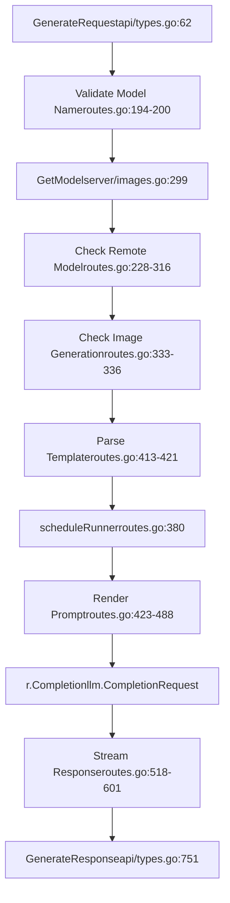
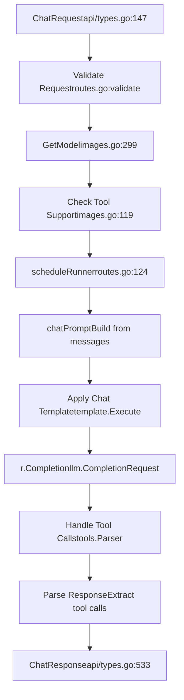
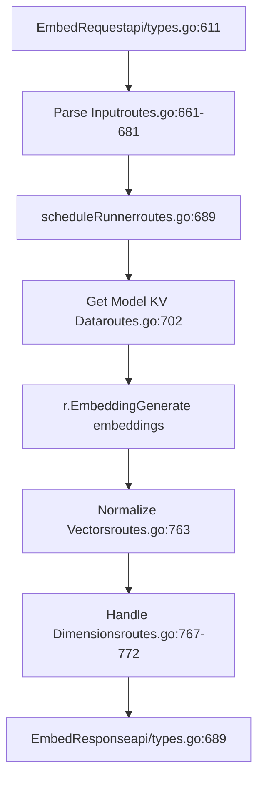
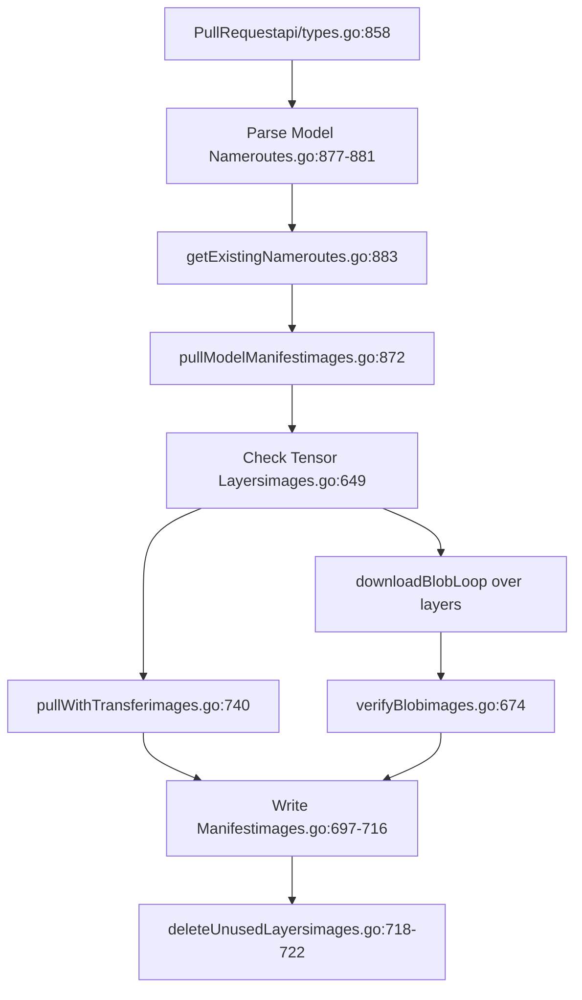
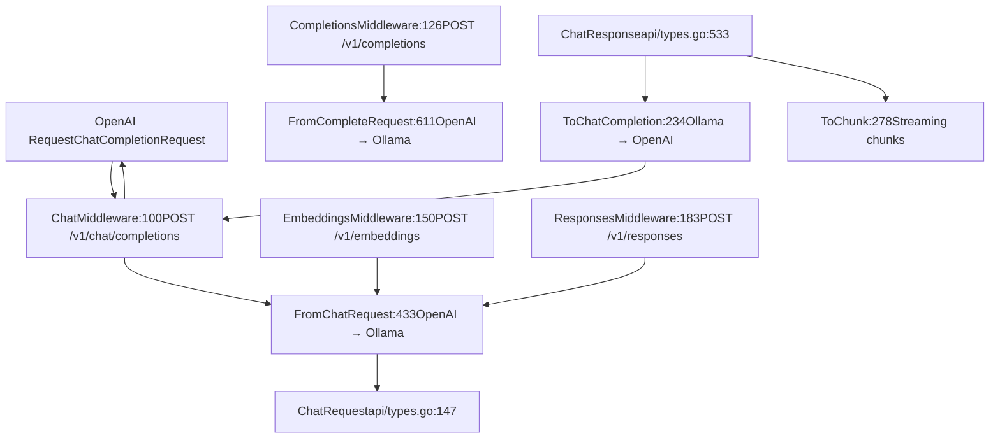

# API 参考

相关源文件

-   [README.md](https://github.com/ollama/ollama/blob/562c76d7/README.md?plain=1)
-   [api/client.go](https://github.com/ollama/ollama/blob/562c76d7/api/client.go)
-   [api/client\_test.go](https://github.com/ollama/ollama/blob/562c76d7/api/client_test.go)
-   [api/types.go](https://github.com/ollama/ollama/blob/562c76d7/api/types.go)
-   [cmd/cmd.go](https://github.com/ollama/ollama/blob/562c76d7/cmd/cmd.go)
-   [docs/README.md](https://github.com/ollama/ollama/blob/562c76d7/docs/README.md?plain=1)
-   [docs/api.md](https://github.com/ollama/ollama/blob/562c76d7/docs/api.md?plain=1)
-   [docs/development.md](https://github.com/ollama/ollama/blob/562c76d7/docs/development.md?plain=1)
-   [docs/images/ollama-keys.png](https://github.com/ollama/ollama/blob/562c76d7/docs/images/ollama-keys.png)
-   [docs/images/signup.png](https://github.com/ollama/ollama/blob/562c76d7/docs/images/signup.png)
-   [server/images.go](https://github.com/ollama/ollama/blob/562c76d7/server/images.go)
-   [server/routes.go](https://github.com/ollama/ollama/blob/562c76d7/server/routes.go)

本文档提供 Ollama HTTP REST API 的完整参考。它涵盖模型推理（generation、chat、embeddings）、模型管理（pull、push、create、delete）以及系统信息的全部端点。关于对这些核心 API 的 OpenAI 兼容端点，请参阅 [OpenAI Compatibility Layer](/ollama/ollama/3.4-openai-compatibility-layer)。关于模型执行内部机制，请参阅 [Model Execution Pipeline](/ollama/ollama/2.3-model-execution-pipeline)。

## API 概览

Ollama 提供基于 Gin 框架构建的 REST API（[server/routes.go83-87](https://github.com/ollama/ollama/blob/562c76d7/server/routes.go#L83-L87)）。服务器接收 JSON 请求，并根据端点与 `stream` 参数返回单个 JSON 响应或换行分隔的 JSON（NDJSON）流。

**核心 API 架构**

```mermaid
flowchart TD
    CLI["CLI Clientcmd/cmd.go"]
    SDK["Client SDKsapi.Client"]
    OpenAI["OpenAI SDKs"]
    Router["Gin Routerroutes.go:83"]
    CORS["CORS Middlewarecors"]
    Auth["Authenticationauth.go"]
    Generate["POST /api/generateGenerateHandler:178"]
    Chat["POST /api/chatChatHandler"]
    Embed["POST /api/embedEmbedHandler:648"]
    Pull["POST /api/pullPullHandler:865"]
    Push["POST /api/pushPushHandler:916"]
    Create["POST /api/createCreateHandler"]
    List["GET /api/tagsListHandler:1287"]
    Show["POST /api/showShowHandler:1043"]
    Delete["DELETE /api/deleteDeleteHandler:999"]
    Copy["POST /api/copyCopyHandler"]
    PS["GET /api/psListRunningHandler"]
    Version["GET /api/versionVersionHandler"]
    ChatComp["POST /v1/chat/completionsChatMiddleware:100"]
    Complete["POST /v1/completionsCompletionsMiddleware:126"]
    EmbedComp["POST /v1/embeddingsEmbeddingsMiddleware:150"]
    Models["GET /v1/modelsListMiddleware:218"]
    Responses["POST /v1/responsesResponsesMiddleware:183"]

    CLI --> Router
    SDK --> Router
    OpenAI --> Router
    Router --> CORS
    CORS --> Auth
    Auth --> Generate
    Auth --> Chat
    Auth --> Embed
    Auth --> Pull
    Auth --> Push
    Auth --> Create
    Auth --> List
    Auth --> Show
    Auth --> Delete
    Auth --> Copy
    Auth --> PS
    Auth --> Version
    Router --> ChatComp
    Router --> Complete
    Router --> EmbedComp
    Router --> Models
    Router --> Responses
    ChatComp --> Chat
    Complete --> Generate
    EmbedComp --> Embed
```


来源： [server/routes.go83-87](https://github.com/ollama/ollama/blob/562c76d7/server/routes.go#L83-L87) [middleware/openai.go1-300](https://github.com/ollama/ollama/blob/562c76d7/middleware/openai.go#L1-L300) [api/client.go36-86](https://github.com/ollama/ollama/blob/562c76d7/api/client.go#L36-L86)

## 请求/响应约定

### Base URL

默认 Base URL 为 `http://localhost:11434`。可通过 `OLLAMA_HOST` 环境变量进行配置（[api/client.go74-78](https://github.com/ollama/ollama/blob/562c76d7/api/client.go#L74-L78)）。

### 内容类型

-   **请求**: `application/json`
-   **响应**: `application/json`（单次响应）或 `application/x-ndjson`（流式）

### 流式传输

大多数推理端点通过 `stream` 参数支持流式输出（[api/types.go84](https://github.com/ollama/ollama/blob/562c76d7/api/types.go#L84-L84) [api/types.go155](https://github.com/ollama/ollama/blob/562c76d7/api/types.go#L155-L155)）：

```
{  "stream": true}
```
当 `stream` 为 `true`（默认）时，响应以换行分隔 JSON 对象发送。最终对象包含 `"done": true`。当为 `false` 时，会在完成后返回单个 JSON 响应。

### 认证

当 `OLLAMA_HOST` 指向 `ollama.com` 或显式启用认证时，会进行认证处理（[api/client.go119-130](https://github.com/ollama/ollama/blob/562c76d7/api/client.go#L119-L130)）。客户端使用 ED25519 密钥签名 challenge（[auth/auth.go](https://github.com/ollama/ollama/blob/562c76d7/auth/auth.go)）。

### 时长格式

`keep_alive` 参数接受诸如 `"5m"`、`"1h"` 的时长字符串，或以纳秒表示的数值（[api/types.go869-900](https://github.com/ollama/ollama/blob/562c76d7/api/types.go#L869-L900)）。

来源： [api/client.go36-166](https://github.com/ollama/ollama/blob/562c76d7/api/client.go#L36-L166) [api/types.go1-900](https://github.com/ollama/ollama/blob/562c76d7/api/types.go#L1-L900)

## Generation API

### POST /api/generate

使用指定模型为给定提示词生成补全（[server/routes.go178-646](https://github.com/ollama/ollama/blob/562c76d7/server/routes.go#L178-L646)）。

**请求结构**（[api/types.go62-144](https://github.com/ollama/ollama/blob/562c76d7/api/types.go#L62-L144)）：

| Field | Type | Required | Description |
| --- | --- | --- | --- |
| `model` | string | Yes | 模型名称（例如：`"llama3.2"`） |
| `prompt` | string | Yes | 用于生成的文本提示 |
| `suffix` | string | No | 插入点之后的文本（用于中间填充） |
| `system` | string | No | 覆盖系统消息 |
| `template` | string | No | 覆盖提示模板 |
| `context` | \[\]int | No | 已弃用的会话上下文 |
| `stream` | \*bool | No | 启用流式（默认：`true`） |
| `raw` | bool | No | 跳过模板格式化 |
| `format` | json.RawMessage | No | 响应格式（`"json"` 或 JSON schema） |
| `images` | \[\]ImageData | No | 面向多模态模型的 base64 编码图像 |
| `options` | map\[string\]any | No | 模型参数（temperature、top\_k 等） |
| `keep_alive` | \*Duration | No | 模型保持加载时长 |
| `think` | \*ThinkValue | No | 启用 thinking/reasoning 模式 |
| `truncate` | \*bool | No | 若提示过长则截断 |
| `shift` | \*bool | No | 上下文窗口满时平移 |
| `logprobs` | bool | No | 返回对数概率 |
| `top_logprobs` | int | No | 返回的 top logprobs 数量（0-20） |

**响应结构**（[api/types.go751-783](https://github.com/ollama/ollama/blob/562c76d7/api/types.go#L751-L783)）：

| Field | Type | Description |
| --- | --- | --- |
| `model` | string | 使用的模型名 |
| `created_at` | time.Time | 响应时间戳 |
| `response` | string | 生成文本（流式时可能为空） |
| `done` | bool | 生成是否完成 |
| `done_reason` | string | 完成原因（`"stop"`、`"length"` 等） |
| `context` | \[\]int | 下一次请求的更新上下文 |
| `total_duration` | time.Duration | 请求总耗时 |
| `load_duration` | time.Duration | 模型加载耗时 |
| `prompt_eval_count` | int | 提示词 token 数 |
| `prompt_eval_duration` | time.Duration | 提示词评估耗时 |
| `eval_count` | int | 生成 token 数 |
| `eval_duration` | time.Duration | 生成耗时 |
| `logprobs` | \[\]Logprob | token 对数概率 |

**请求流程**


来源： [server/routes.go178-646](https://github.com/ollama/ollama/blob/562c76d7/server/routes.go#L178-L646) [api/types.go62-144](https://github.com/ollama/ollama/blob/562c76d7/api/types.go#L62-L144) [api/types.go751-783](https://github.com/ollama/ollama/blob/562c76d7/api/types.go#L751-L783)

**示例请求**

```
{  "model": "llama3.2",  "prompt": "Why is the sky blue?",  "stream": false,  "options": {    "temperature": 0.7,    "num_predict": 100  }}
```
**示例响应**

```
{  "model": "llama3.2",  "created_at": "2024-01-01T12:00:00Z",  "response": "The sky appears blue due to Rayleigh scattering...",  "done": true,  "done_reason": "stop",  "context": [1, 2, 3],  "total_duration": 1500000000,  "load_duration": 100000000,  "prompt_eval_count": 15,  "prompt_eval_duration": 200000000,  "eval_count": 45,  "eval_duration": 1200000000}
```
### 结构化输出

`format` 字段支持 JSON 模式，以及基于 JSON schema 的结构化输出（[server/routes.go526](https://github.com/ollama/ollama/blob/562c76d7/server/routes.go#L526-L526) [api/types.go90](https://github.com/ollama/ollama/blob/562c76d7/api/types.go#L90-L90)）：

**JSON 模式**：

```
{  "format": "json"}
```
**JSON Schema**：

```
{  "format": {    "type": "object",    "properties": {      "name": {"type": "string"},      "age": {"type": "integer"}    },    "required": ["name", "age"]  }}
```
### Thinking 模型

对于推理模型，`think` 参数用于控制思考行为（[api/types.go109](https://github.com/ollama/ollama/blob/562c76d7/api/types.go#L109-L109) [server/routes.go344-378](https://github.com/ollama/ollama/blob/562c76d7/server/routes.go#L344-L378)）：

```
{  "think": true,           // Boolean: enable/disable  "think": "high"          // String: "high", "medium", "low" (model-specific)}
```
thinking 内容会通过响应中的 `thinking` 字段返回（[api/types.go554](https://github.com/ollama/ollama/blob/562c76d7/api/types.go#L554-L554)）。

来源： [server/routes.go178-646](https://github.com/ollama/ollama/blob/562c76d7/server/routes.go#L178-L646) [api/types.go62-144](https://github.com/ollama/ollama/blob/562c76d7/api/types.go#L62-L144) [api/types.go751-783](https://github.com/ollama/ollama/blob/562c76d7/api/types.go#L751-L783)

## Chat API

### POST /api/chat

在会话中生成下一条消息（[server/routes\_generate.go1-900](https://github.com/ollama/ollama/blob/562c76d7/server/routes_generate.go#L1-L900)）。

**请求结构**（[api/types.go147-194](https://github.com/ollama/ollama/blob/562c76d7/api/types.go#L147-L194)）：

| Field | Type | Required | Description |
| --- | --- | --- | --- |
| `model` | string | Yes | 模型名称 |
| `messages` | \[\]Message | Yes | 会话历史 |
| `stream` | \*bool | No | 启用流式（默认：`true`） |
| `format` | json.RawMessage | No | 响应格式 |
| `keep_alive` | \*Duration | No | 模型保活时长 |
| `tools` | \[\]Tool | No | 可供函数调用的工具 |
| `options` | map\[string\]any | No | 模型参数 |
| `think` | \*ThinkValue | No | 启用 thinking 模式 |
| `truncate` | \*bool | No | 消息过长时截断 |
| `shift` | \*bool | No | 上下文满时平移消息 |
| `logprobs` | bool | No | 返回对数概率 |
| `top_logprobs` | int | No | top logprobs 数量（0-20） |

**消息结构**（[api/types.go211-221](https://github.com/ollama/ollama/blob/562c76d7/api/types.go#L211-L221)）：

| Field | Type | Description |
| --- | --- | --- |
| `role` | string | `"system"`、`"user"`、`"assistant"` 或 `"tool"` |
| `content` | string | 消息内容 |
| `thinking` | string | thinking 内容（用于推理模型） |
| `images` | \[\]ImageData | 多模态模型图像 |
| `tool_calls` | \[\]ToolCall | assistant 发起的工具调用 |
| `tool_name` | string | 工具名称（用于 tool 角色） |
| `tool_call_id` | string | 被响应的工具调用 ID |

**响应结构**（[api/types.go533-562](https://github.com/ollama/ollama/blob/562c76d7/api/types.go#L533-L562)）：

| Field | Type | Description |
| --- | --- | --- |
| `model` | string | 模型名称 |
| `created_at` | time.Time | 时间戳 |
| `message` | Message | 生成的消息 |
| `done` | bool | 完成状态 |
| `done_reason` | string | 完成原因 |
| `total_duration` | time.Duration | 总耗时 |
| `load_duration` | time.Duration | 加载耗时 |
| `prompt_eval_count` | int | 提示词 token 数 |
| `prompt_eval_duration` | time.Duration | 提示词评估耗时 |
| `eval_count` | int | 生成 token 数 |
| `eval_duration` | time.Duration | 生成耗时 |
| `logprobs` | \[\]Logprob | 对数概率 |

**聊天处理流程**


来源： [server/routes\_generate.go](https://github.com/ollama/ollama/blob/562c76d7/server/routes_generate.go) [api/types.go147-221](https://github.com/ollama/ollama/blob/562c76d7/api/types.go#L147-L221) [api/types.go533-562](https://github.com/ollama/ollama/blob/562c76d7/api/types.go#L533-L562)

**示例请求**

```
{  "model": "llama3.2",  "messages": [    {      "role": "system",      "content": "You are a helpful assistant."    },    {      "role": "user",      "content": "What is the capital of France?"    }  ],  "stream": false}
```
**示例响应**

```
{  "model": "llama3.2",  "created_at": "2024-01-01T12:00:00Z",  "message": {    "role": "assistant",    "content": "The capital of France is Paris."  },  "done": true,  "done_reason": "stop",  "total_duration": 1200000000,  "prompt_eval_count": 25,  "eval_count": 10}
```
### 工具调用

聊天端点通过 `tools` 参数支持函数调用（[api/types.go165](https://github.com/ollama/ollama/blob/562c76d7/api/types.go#L165-L165) [api/types.go319-503](https://github.com/ollama/ollama/blob/562c76d7/api/types.go#L319-L503)）：

**工具定义**：

```
{  "tools": [    {      "type": "function",      "function": {        "name": "get_weather",        "description": "Get current weather",        "parameters": {          "type": "object",          "properties": {            "location": {              "type": "string",              "description": "City name"            }          },          "required": ["location"]        }      }    }  ]}
```
**工具调用响应**：

```
{  "message": {    "role": "assistant",    "content": "",    "tool_calls": [      {        "id": "call_123",        "function": {          "name": "get_weather",          "arguments": "{\"location\": \"Paris\"}"        }      }    ]  }}
```
工具会由模板系统处理（[template/template.go](https://github.com/ollama/ollama/blob/562c76d7/template/template.go)），并从模型输出中解析（[tools/tools.go20-200](https://github.com/ollama/ollama/blob/562c76d7/tools/tools.go#L20-L200)）。

来源： [api/types.go196-503](https://github.com/ollama/ollama/blob/562c76d7/api/types.go#L196-L503) [tools/tools.go1-200](https://github.com/ollama/ollama/blob/562c76d7/tools/tools.go#L1-L200) [server/routes\_generate.go](https://github.com/ollama/ollama/blob/562c76d7/server/routes_generate.go)

## Embedding API

### POST /api/embed

为文本输入生成 embeddings（[server/routes.go648-802](https://github.com/ollama/ollama/blob/562c76d7/server/routes.go#L648-L802)）。

**请求结构**（[api/types.go611-643](https://github.com/ollama/ollama/blob/562c76d7/api/types.go#L611-L643)）：

| Field | Type | Required | Description |
| --- | --- | --- | --- |
| `model` | string | Yes | 模型名称 |
| `input` | string or \[\]string | Yes | 要嵌入的文本 |
| `truncate` | \*bool | No | 若输入超出上下文则截断 |
| `dimensions` | int | No | 输出维度（适用于支持的模型） |
| `keep_alive` | \*Duration | No | 模型保活时长 |
| `options` | map\[string\]any | No | 模型参数 |

**响应结构**（[api/types.go689-699](https://github.com/ollama/ollama/blob/562c76d7/api/types.go#L689-L699)）：

| Field | Type | Description |
| --- | --- | --- |
| `model` | string | 模型名称 |
| `embeddings` | \[\]\[\]float32 | 生成的 embeddings |
| `total_duration` | time.Duration | 总耗时 |
| `load_duration` | time.Duration | 加载耗时 |
| `prompt_eval_count` | int | 处理的总 token 数 |

**Embedding 处理流程**


来源： [server/routes.go648-802](https://github.com/ollama/ollama/blob/562c76d7/server/routes.go#L648-L802) [api/types.go611-699](https://github.com/ollama/ollama/blob/562c76d7/api/types.go#L611-L699)

**示例请求**

```
{  "model": "nomic-embed-text",  "input": "The quick brown fox",  "dimensions": 768}
```
**示例响应**

```
{  "model": "nomic-embed-text",  "embeddings": [    [0.123, -0.456, 0.789, ...]  ],  "total_duration": 500000000,  "prompt_eval_count": 5}
```
归一化函数会确保单位向量（[server/routes.go804-818](https://github.com/ollama/ollama/blob/562c76d7/server/routes.go#L804-L818)），并处理降维（[server/routes.go767-772](https://github.com/ollama/ollama/blob/562c76d7/server/routes.go#L767-L772)）。

来源： [server/routes.go648-818](https://github.com/ollama/ollama/blob/562c76d7/server/routes.go#L648-L818) [api/types.go611-699](https://github.com/ollama/ollama/blob/562c76d7/api/types.go#L611-L699)

## Model Management API

### POST /api/pull

从 registry 下载模型（[server/routes.go865-914](https://github.com/ollama/ollama/blob/562c76d7/server/routes.go#L865-L914) [server/images.go613-728](https://github.com/ollama/ollama/blob/562c76d7/server/images.go#L613-L728)）。

**请求结构**（[api/types.go858-862](https://github.com/ollama/ollama/blob/562c76d7/api/types.go#L858-L862)）：

| Field | Type | Required | Description |
| --- | --- | --- | --- |
| `model` | string | Yes | 要 pull 的模型名 |
| `name` | string | No | `model` 的已弃用别名 |
| `insecure` | bool | No | 允许不安全连接 |
| `stream` | \*bool | No | 流式进度（默认：`true`） |

**响应结构**（[api/types.go704-709](https://github.com/ollama/ollama/blob/562c76d7/api/types.go#L704-L709)）：

| Field | Type | Description |
| --- | --- | --- |
| `status` | string | 进度状态信息 |
| `digest` | string | 当前处理层的 digest |
| `total` | int64 | 总字节数 |
| `completed` | int64 | 已完成字节数 |

**Pull 流程**


来源： [server/routes.go865-914](https://github.com/ollama/ollama/blob/562c76d7/server/routes.go#L865-L914) [server/images.go613-728](https://github.com/ollama/ollama/blob/562c76d7/server/images.go#L613-L728)

### POST /api/push

将模型上传到 registry（[server/routes.go916-969](https://github.com/ollama/ollama/blob/562c76d7/server/routes.go#L916-L969) [server/images.go546-611](https://github.com/ollama/ollama/blob/562c76d7/server/images.go#L546-L611)）。

**请求结构**（[api/types.go845-852](https://github.com/ollama/ollama/blob/562c76d7/api/types.go#L845-L852)）：

| Field | Type | Required | Description |
| --- | --- | --- | --- |
| `model` | string | Yes | 要 push 的模型名 |
| `name` | string | No | `model` 的已弃用别名 |
| `insecure` | bool | No | 允许不安全连接 |
| `stream` | \*bool | No | 流式进度 |

**响应**：与 pull 相同（ProgressResponse）。

来源： [server/routes.go916-969](https://github.com/ollama/ollama/blob/562c76d7/server/routes.go#L916-L969) [server/images.go546-611](https://github.com/ollama/ollama/blob/562c76d7/server/images.go#L546-L611)

### POST /api/create

从 Modelfile 创建模型（[server/routes.go](https://github.com/ollama/ollama/blob/562c76d7/server/routes.go) [parser/parser.go56-155](https://github.com/ollama/ollama/blob/562c76d7/parser/parser.go#L56-L155)）。

**请求结构**（[api/types.go711-728](https://github.com/ollama/ollama/blob/562c76d7/api/types.go#L711-L728)）：

| Field | Type | Required | Description |
| --- | --- | --- | --- |
| `model` | string | Yes | 新模型名称 |
| `modelfile` | string | No | Modelfile 内容 |
| `path` | string | No | Modelfile 路径 |
| `stream` | \*bool | No | 流式进度 |
| `quantize` | string | No | 量化格式 |

Modelfile 支持 `FROM`、`PARAMETER`、`TEMPLATE`、`SYSTEM` 等命令（[parser/parser.go64-142](https://github.com/ollama/ollama/blob/562c76d7/parser/parser.go#L64-L142)）。

来源： [api/types.go711-728](https://github.com/ollama/ollama/blob/562c76d7/api/types.go#L711-L728) [parser/parser.go56-155](https://github.com/ollama/ollama/blob/562c76d7/parser/parser.go#L56-L155)

### GET /api/tags

列出本地可用模型（[server/routes.go1287-1361](https://github.com/ollama/ollama/blob/562c76d7/server/routes.go#L1287-L1361)）。

**响应结构**（[api/types.go805-808](https://github.com/ollama/ollama/blob/562c76d7/api/types.go#L805-L808)）：

```
{  "models": [    {      "name": "llama3.2:latest",      "modified_at": "2024-01-01T12:00:00Z",      "size": 4661211648,      "digest": "sha256:abc123...",      "details": {        "format": "gguf",        "family": "llama",        "families": ["llama"],        "parameter_size": "3B",        "quantization_level": "Q4_0"      }    }  ]}
```
来源： [server/routes.go1287-1361](https://github.com/ollama/ollama/blob/562c76d7/server/routes.go#L1287-L1361) [api/types.go805-843](https://github.com/ollama/ollama/blob/562c76d7/api/types.go#L805-L843)

### POST /api/show

显示模型详细信息（[server/routes.go1043-1078](https://github.com/ollama/ollama/blob/562c76d7/server/routes.go#L1043-L1078) [server/routes.go1080-1262](https://github.com/ollama/ollama/blob/562c76d7/server/routes.go#L1080-L1262)）。

**请求结构**（[api/types.go730-734](https://github.com/ollama/ollama/blob/562c76d7/api/types.go#L730-L734)）：

| Field | Type | Required | Description |
| --- | --- | --- | --- |
| `model` | string | Yes | 模型名 |
| `name` | string | No | 已弃用别名 |
| `verbose` | bool | No | 包含 tensor 信息 |

**响应结构**包含模型详情、模板、系统提示、参数、许可证，以及可选的 tensor 信息（[api/types.go736-749](https://github.com/ollama/ollama/blob/562c76d7/api/types.go#L736-L749)）。

来源： [server/routes.go1043-1262](https://github.com/ollama/ollama/blob/562c76d7/server/routes.go#L1043-L1262) [api/types.go730-749](https://github.com/ollama/ollama/blob/562c76d7/api/types.go#L730-L749)

### DELETE /api/delete

删除模型（[server/routes.go999-1041](https://github.com/ollama/ollama/blob/562c76d7/server/routes.go#L999-L1041)）。

**请求结构**（[api/types.go854-856](https://github.com/ollama/ollama/blob/562c76d7/api/types.go#L854-L856)）：

```
{  "model": "llama3.2"}
```
来源： [server/routes.go999-1041](https://github.com/ollama/ollama/blob/562c76d7/server/routes.go#L999-L1041) [api/types.go854-856](https://github.com/ollama/ollama/blob/562c76d7/api/types.go#L854-L856)

### POST /api/copy

复制模型（[server/routes.go](https://github.com/ollama/ollama/blob/562c76d7/server/routes.go) [server/images.go399-436](https://github.com/ollama/ollama/blob/562c76d7/server/images.go#L399-L436)）。

**请求结构**（[api/types.go864-867](https://github.com/ollama/ollama/blob/562c76d7/api/types.go#L864-L867)）：

```
{  "source": "llama3.2",  "destination": "my-llama"}
```
来源： [server/images.go399-436](https://github.com/ollama/ollama/blob/562c76d7/server/images.go#L399-L436) [api/types.go864-867](https://github.com/ollama/ollama/blob/562c76d7/api/types.go#L864-L867)

### GET /api/ps

列出当前已加载模型（[server/routes.go](https://github.com/ollama/ollama/blob/562c76d7/server/routes.go)）。

**响应**包含模型名称、大小、VRAM 使用量、处理器拆分和过期时间。

来源： [server/routes.go](https://github.com/ollama/ollama/blob/562c76d7/server/routes.go) [api/types.go](https://github.com/ollama/ollama/blob/562c76d7/api/types.go)

## OpenAI 兼容层

Ollama 提供 OpenAI 兼容端点，可将请求与响应在 OpenAI 格式之间双向转换（[middleware/openai.go1-300](https://github.com/ollama/ollama/blob/562c76d7/middleware/openai.go#L1-L300) [openai/openai.go1-600](https://github.com/ollama/ollama/blob/562c76d7/openai/openai.go#L1-L600)）。

### 转换架构


来源： [middleware/openai.go1-300](https://github.com/ollama/ollama/blob/562c76d7/middleware/openai.go#L1-L300) [openai/openai.go1-600](https://github.com/ollama/ollama/blob/562c76d7/openai/openai.go#L1-L600)

### POST /v1/chat/completions

OpenAI 兼容的聊天端点（[middleware/openai.go100-125](https://github.com/ollama/ollama/blob/562c76d7/middleware/openai.go#L100-L125)）。

**请求转换**（[openai/openai.go433-609](https://github.com/ollama/ollama/blob/562c76d7/openai/openai.go#L433-L609)）：

| OpenAI Field | Ollama Field | Notes |
| --- | --- | --- |
| `model` | `model` | 直接映射 |
| `messages` | `messages` | 内容会被转换 |
| `max_tokens` | `options.num_predict` | token 上限 |
| `temperature` | `options.temperature` | 采样参数 |
| `top_p` | `options.top_p` | 核采样 |
| `frequency_penalty` | `options.frequency_penalty` | 重复惩罚 |
| `presence_penalty` | `options.presence_penalty` | 存在惩罚 |
| `tools` | `tools` | 函数调用 |
| `response_format` | `format` | 支持 JSON schema |
| `reasoning_effort` | `think` | 推理模型 |
| `logprobs` | `logprobs` | 对数概率 |
| `top_logprobs` | `top_logprobs` | Top K logprobs |

**响应转换**（[openai/openai.go234-276](https://github.com/ollama/ollama/blob/562c76d7/openai/openai.go#L234-L276)）：

| Ollama Field | OpenAI Field | Notes |
| --- | --- | --- |
| `message.content` | `choices[0].message.content` | 响应文本 |
| `message.tool_calls` | `choices[0].message.tool_calls` | 函数调用 |
| `done_reason` | `choices[0].finish_reason` | 完成原因 |
| `prompt_eval_count` | `usage.prompt_tokens` | 输入 token |
| `eval_count` | `usage.completion_tokens` | 输出 token |

来源： [middleware/openai.go100-125](https://github.com/ollama/ollama/blob/562c76d7/middleware/openai.go#L100-L125) [openai/openai.go234-609](https://github.com/ollama/ollama/blob/562c76d7/openai/openai.go#L234-L609)

### POST /v1/completions

OpenAI 兼容的 completions 端点（[middleware/openai.go126-149](https://github.com/ollama/ollama/blob/562c76d7/middleware/openai.go#L126-L149)）。

会转换为 `/api/generate`，字段映射类似（[openai/openai.go611-682](https://github.com/ollama/ollama/blob/562c76d7/openai/openai.go#L611-L682)）。

来源： [middleware/openai.go126-149](https://github.com/ollama/ollama/blob/562c76d7/middleware/openai.go#L126-L149) [openai/openai.go611-682](https://github.com/ollama/ollama/blob/562c76d7/openai/openai.go#L611-L682)

### POST /v1/embeddings

OpenAI 兼容的 embeddings 端点（[middleware/openai.go150-182](https://github.com/ollama/ollama/blob/562c76d7/middleware/openai.go#L150-L182)）。

**请求转换**（[openai/openai.go684-746](https://github.com/ollama/ollama/blob/562c76d7/openai/openai.go#L684-L746)）：

| OpenAI Field | Ollama Field |
| --- | --- |
| `input` | `input` |
| `model` | `model` |
| `dimensions` | `dimensions` |
| `encoding_format` | N/A（在响应中处理） |

支持 `"float"` 与 `"base64"` 两种编码格式（[openai/openai.go740-743](https://github.com/ollama/ollama/blob/562c76d7/openai/openai.go#L740-L743)）。

来源： [middleware/openai.go150-182](https://github.com/ollama/ollama/blob/562c76d7/middleware/openai.go#L150-L182) [openai/openai.go684-746](https://github.com/ollama/ollama/blob/562c76d7/openai/openai.go#L684-L746)

### GET /v1/models

以 OpenAI 格式列出可用模型（[middleware/openai.go218-240](https://github.com/ollama/ollama/blob/562c76d7/middleware/openai.go#L218-L240)）。

返回具有 OpenAI 兼容结构的模型列表：

```
{  "object": "list",  "data": [    {      "id": "llama3.2",      "object": "model",      "created": 1234567890,      "owned_by": "library"    }  ]}
```
来源： [middleware/openai.go218-240](https://github.com/ollama/ollama/blob/562c76d7/middleware/openai.go#L218-L240) [openai/openai.go188-205](https://github.com/ollama/ollama/blob/562c76d7/openai/openai.go#L188-L205)

## 通用模式

### 错误处理

所有端点都以如下格式返回错误对象（[api/types.go23-41](https://github.com/ollama/ollama/blob/562c76d7/api/types.go#L23-L41)）：

```
{  "error": "model not found"}
```
HTTP 状态码遵循 REST 约定：

-   `400`: Bad request（参数无效）
-   `401`: Unauthorized（需要认证）
-   `404`: Not found（模型不存在）
-   `500`: Internal server error

来源： [api/types.go23-54](https://github.com/ollama/ollama/blob/562c76d7/api/types.go#L23-L54) [server/routes.go182-220](https://github.com/ollama/ollama/blob/562c76d7/server/routes.go#L182-L220)

### 流式响应格式

流式端点返回换行分隔 JSON（[api/client.go170-263](https://github.com/ollama/ollama/blob/562c76d7/api/client.go#L170-L263)）：

```
{"model":"llama3.2","created_at":"...","response":"The","done":false}
{"model":"llama3.2","created_at":"...","response":" sky","done":false}
{"model":"llama3.2","created_at":"...","response":" is","done":false}
{"model":"llama3.2","created_at":"...","response":"","done":true,"total_duration":1500000000,...}
```
最终消息包含 `"done": true` 并附带时间指标。

来源： [api/client.go170-263](https://github.com/ollama/ollama/blob/562c76d7/api/client.go#L170-L263) [server/routes.go645](https://github.com/ollama/ollama/blob/562c76d7/server/routes.go#L645-L645)

### 模型选项

`options` 字段接受来自 Modelfile 规范的参数（[api/types.go581-608](https://github.com/ollama/ollama/blob/562c76d7/api/types.go#L581-L608)）：

| Parameter | Type | Description |
| --- | --- | --- |
| `num_ctx` | int | 上下文窗口大小 |
| `num_batch` | int | 处理批大小 |
| `num_gpu` | int | GPU 层数 |
| `num_thread` | int | CPU 线程数 |
| `num_predict` | int | 最大生成 token 数 |
| `temperature` | float | 随机性（0.0-2.0） |
| `top_k` | int | Top-k 采样 |
| `top_p` | float | 核采样 |
| `min_p` | float | 最小概率 |
| `repeat_penalty` | float | 重复惩罚 |
| `presence_penalty` | float | 存在惩罚 |
| `frequency_penalty` | float | 频率惩罚 |
| `stop` | \[\]string | 停止序列 |
| `seed` | int | 随机种子 |

这些参数可在请求时设置，也可在模型的 Modelfile 中设置（[parser/parser.go122-141](https://github.com/ollama/ollama/blob/562c76d7/parser/parser.go#L122-L141)）。

来源： [api/types.go581-608](https://github.com/ollama/ollama/blob/562c76d7/api/types.go#L581-L608) [parser/parser.go56-155](https://github.com/ollama/ollama/blob/562c76d7/parser/parser.go#L56-L155)

### Keep-Alive 行为

`keep_alive` 参数控制模型内存管理（[server/routes.go156](https://github.com/ollama/ollama/blob/562c76d7/server/routes.go#L156-L156) [server/sched.go](https://github.com/ollama/ollama/blob/562c76d7/server/sched.go)）：

-   `"5m"`: 最后一次使用后保持加载 5 分钟（默认）
-   `"0"`: 请求结束后立即卸载
-   `"-1"`: 始终保持加载

当模型被访问时，调度器会延长其过期时间（[server/sched.go](https://github.com/ollama/ollama/blob/562c76d7/server/sched.go)）。

来源： [api/types.go869-900](https://github.com/ollama/ollama/blob/562c76d7/api/types.go#L869-L900) [server/sched.go](https://github.com/ollama/ollama/blob/562c76d7/server/sched.go)
