# 模型管理 API

相关源文件

-   [api/client.go](https://github.com/ollama/ollama/blob/562c76d7/api/client.go)
-   [api/client\_test.go](https://github.com/ollama/ollama/blob/562c76d7/api/client_test.go)
-   [api/types.go](https://github.com/ollama/ollama/blob/562c76d7/api/types.go)
-   [cmd/cmd.go](https://github.com/ollama/ollama/blob/562c76d7/cmd/cmd.go)
-   [cmd/cmd\_test.go](https://github.com/ollama/ollama/blob/562c76d7/cmd/cmd_test.go)
-   [server/create.go](https://github.com/ollama/ollama/blob/562c76d7/server/create.go)
-   [server/images.go](https://github.com/ollama/ollama/blob/562c76d7/server/images.go)
-   [server/model.go](https://github.com/ollama/ollama/blob/562c76d7/server/model.go)
-   [server/routes.go](https://github.com/ollama/ollama/blob/562c76d7/server/routes.go)
-   [server/routes\_create\_test.go](https://github.com/ollama/ollama/blob/562c76d7/server/routes_create_test.go)
-   [server/routes\_delete\_test.go](https://github.com/ollama/ollama/blob/562c76d7/server/routes_delete_test.go)
-   [server/routes\_list\_test.go](https://github.com/ollama/ollama/blob/562c76d7/server/routes_list_test.go)
-   [server/routes\_test.go](https://github.com/ollama/ollama/blob/562c76d7/server/routes_test.go)

本页记录了用于管理 Ollama 模型的 REST API 端点，包括从 registry 拉取模型、向 registry 推送模型、列出本地模型、创建自定义模型以及执行其他模型生命周期操作。

关于文本生成与聊天 API，请参阅 [Generation and Chat API](/ollama/ollama/3.2-generation-and-chat-api)。关于 embedding 生成，请参阅 [Embedding API](/ollama/ollama/3.3-embedding-api)。关于 OpenAI 兼容端点，请参阅 [OpenAI Compatibility Layer](/ollama/ollama/3.4-openai-compatibility-layer)。

## 概览

Model Management API 为模型完整生命周期操作提供 HTTP 端点。这些端点以服务器中的 HTTP handler 形式实现，并根据操作支持流式与非流式响应。API 使用标准 HTTP 方法与 JSON 作为请求/响应体格式。

### 端点分类

模型管理端点分为以下几类：

| Category | Endpoints | Purpose |
| --- | --- | --- |
| **Registry Operations** | `/api/pull`, `/api/push` | 从 registry 下载/上传模型 |
| **Local Management** | `/api/tags`, `/api/show`, `/api/delete`, `/api/copy` | 管理本地存储模型 |
| **Model Creation** | `/api/create`, `/api/blobs/:digest` | 创建自定义模型并上传文件 |

## API 端点映射

```mermaid
flowchart TD
    POST_pull["/api/pull POST"]
    POST_push["/api/push POST"]
    GET_tags["/api/tags GET"]
    POST_show["/api/show POST"]
    DELETE_delete["/api/delete DELETE"]
    POST_create["/api/create POST"]
    POST_copy["/api/copy POST"]
    HEAD_blob["/api/blobs/:digest HEAD"]
    POST_blob["/api/blobs/:digest POST"]
    PullHandler["PullHandler()"]
    PushHandler["PushHandler()"]
    ListHandler["ListHandler()"]
    ShowHandler["ShowHandler()"]
    DeleteHandler["DeleteHandler()"]
    CreateHandler["CreateHandler()"]
    CopyHandler["CopyHandler()"]
    HeadBlobHandler["HeadBlobHandler()"]
    CreateBlobHandler["CreateBlobHandler()"]
    PullModel["PullModel()"]
    PushModel["PushModel()"]
    Manifests["Manifests()"]
    GetModel["GetModel()"]
    ParseNamedManifest["ParseNamedManifest()"]
    CopyModel["CopyModel()"]
    GetBlobsPath["GetBlobsPath()"]

    POST --> pull_PullHandler
    POST --> push_PushHandler
    GET --> tags_ListHandler
    POST --> show_ShowHandler
    DELETE --> delete_DeleteHandler
    POST --> create_CreateHandler
    POST --> copy_CopyHandler
    HEAD --> blob_HeadBlobHandler
    POST --> blob_CreateBlobHandler
    PullHandler --> PullModel
    PushHandler --> PushModel
    ListHandler --> Manifests
    ShowHandler --> GetModel
    DeleteHandler --> ParseNamedManifest
    CopyHandler --> CopyModel
    HeadBlobHandler --> GetBlobsPath
    CreateBlobHandler --> GetBlobsPath
```


来源： [server/routes.go865-914](https://github.com/ollama/ollama/blob/562c76d7/server/routes.go#L865-L914) [server/routes.go916-969](https://github.com/ollama/ollama/blob/562c76d7/server/routes.go#L916-L969) [server/routes.go1287-1358](https://github.com/ollama/ollama/blob/562c76d7/server/routes.go#L1287-L1358) [server/routes.go1043-1078](https://github.com/ollama/ollama/blob/562c76d7/server/routes.go#L1043-L1078) [server/routes.go999-1041](https://github.com/ollama/ollama/blob/562c76d7/server/routes.go#L999-L1041)

## Registry 操作

### 拉取模型

从 registry 下载模型并跟踪进度。

**Endpoint:** `POST /api/pull`

**Request Type:** [\`api.PullRequest\`](https://github.com/ollama/ollama/blob/562c76d7/`api.PullRequest`)

```
{  "model": "llama3.2:latest",  "name": "llama3.2:latest",  "insecure": false,  "stream": true}
```
**Response Type:** [\`api.ProgressResponse\`](https://github.com/ollama/ollama/blob/562c76d7/`api.ProgressResponse`)（流式）

```
{  "status": "pulling manifest",   "digest": "sha256:...",  "total": 1234567,  "completed": 567890}
```
`PullHandler` 函数通过以下步骤处理 pull 请求：

1.  使用 `model.ParseName()` 和 `cmp.Or(req.Model, req.Name)` 解析并校验模型名称
2.  使用 `getExistingName()` 进行名称规范化，以匹配本地已有名称大小写
3.  启动 goroutine，调用 `PullModel()` 并传入 registry 选项与进度回调
4.  通过 channel 向客户端流式发送进度响应

如果 `stream` 设为 `false`，handler 会通过 `waitForStream()` 等待完成后再返回单个响应。

来源： [server/routes.go865-914](https://github.com/ollama/ollama/blob/562c76d7/server/routes.go#L865-L914) [server/images.go613-728](https://github.com/ollama/ollama/blob/562c76d7/server/images.go#L613-L728)

### 推送模型

将本地模型上传到 registry 并跟踪进度。

**Endpoint:** `POST /api/push`

**Request Type:** [\`api.PushRequest\`](https://github.com/ollama/ollama/blob/562c76d7/`api.PushRequest`)

```
{  "model": "mymodel:latest",  "name": "mymodel:latest",  "insecure": false,  "stream": true}
```
**Response Type:** [\`api.ProgressResponse\`](https://github.com/ollama/ollama/blob/562c76d7/`api.ProgressResponse`)（流式）

`PushHandler` 在发起上传前会校验模型在本地存在：

1.  从 `req.Model` 或 `req.Name`（已弃用）确定模型名称
2.  通过 `getExistingName()` 进行名称规范化
3.  对 `ollama.com/ollama.ai` 域名调用 `client.Whoami()` 检查认证状态
4.  调用 `PushModel()` 将 manifest 与 blob 层上传至 registry
5.  向客户端流式发送进度响应

对于 ollama.com 模型，必须认证；若未授权，会提示用户登录。

来源： [server/routes.go916-969](https://github.com/ollama/ollama/blob/562c76d7/server/routes.go#L916-L969) [server/images.go546-611](https://github.com/ollama/ollama/blob/562c76d7/server/images.go#L546-L611)

## 本地模型管理

### 列出模型

获取本地所有可用模型。

**Endpoint:** `GET /api/tags`

**Response Type:** [\`api.ListResponse\`](https://github.com/ollama/ollama/blob/562c76d7/`api.ListResponse`)

```
{  "models": [    {      "name": "llama3.2:latest",      "model": "llama3.2:latest",       "modified_at": "2024-01-01T00:00:00Z",      "size": 1234567890,      "digest": "sha256:...",      "remote_model": "",      "remote_host": "",      "details": {        "parent_model": "",        "format": "gguf",        "family": "llama",        "families": ["llama"],        "parameter_size": "3B",        "quantization_level": "Q4_0"      }    }  ]}
```
`ListHandler` 的实现流程：

1.  调用 `Manifests(true)` 发现所有模型 manifest，并容忍损坏条目
2.  对每个 manifest 读取配置 blob（若存在）以提取 `ConfigV2` 元数据
3.  构建 `api.ListModelResponse` 条目，包含名称、大小、digest 和详情
4.  按修改时间排序（最新优先）
5.  以 `api.ListResponse` 返回列表

远程模型（云模型）通过 `remote_model` 和 `remote_host` 字段是否填充进行区分，并以 `"-"` 显示大小。

来源： [server/routes.go1287-1358](https://github.com/ollama/ollama/blob/562c76d7/server/routes.go#L1287-L1358)

### 显示模型信息

获取指定模型的详细信息。

**Endpoint:** `POST /api/show`

**Request Type:** [\`api.ShowRequest\`](https://github.com/ollama/ollama/blob/562c76d7/`api.ShowRequest`)

```
{  "model": "llama3.2:latest",  "name": "llama3.2:latest",  "system": "",  "template": "",  "options": {},  "verbose": false}
```
**Response Type:** [\`api.ShowResponse\`](https://github.com/ollama/ollama/blob/562c76d7/`api.ShowResponse`)

```
{  "license": "...",  "modelfile": "...",   "parameters": "...",  "system": "...",  "template": "...",  "details": {    "parent_model": "",    "format": "gguf",    "family": "llama",    "families": ["llama"],    "parameter_size": "3B",    "quantization_level": "Q4_0"  },  "model_info": {},  "projector_info": {},  "messages": [],  "capabilities": ["completion", "vision"],  "modified_at": "2024-01-01T00:00:00Z"}
```
`ShowHandler` 会调用 `GetModelInfo()`，其流程如下：

1.  解析并校验模型名称
2.  使用 `GetModel()` 加载模型，获取 manifest 与配置
3.  构建模型的 `Modelfile` 字符串表示
4.  通过 `getModelData()` 从 GGUF 文件提取元数据：
    -   KV 元数据（存入 `model_info`）
    -   Tensor 信息（仅 verbose 模式）
    -   Projector 元数据（vision 模型）
5.  通过 `m.Capabilities()` 计算模型能力
6.  返回详细模型信息

对于远程模型（云模型），仅返回配置层级信息，不加载 tensor 数据。

来源： [server/routes.go1043-1078](https://github.com/ollama/ollama/blob/562c76d7/server/routes.go#L1043-L1078) [server/routes.go1080-1262](https://github.com/ollama/ollama/blob/562c76d7/server/routes.go#L1080-L1262) [server/routes.go1264-1285](https://github.com/ollama/ollama/blob/562c76d7/server/routes.go#L1264-L1285)

### 删除模型

删除模型及其关联数据。

**Endpoint:** `DELETE /api/delete`

**Request Type:** [\`api.DeleteRequest\`](https://github.com/ollama/ollama/blob/562c76d7/`api.DeleteRequest`)

```
{  "model": "mymodel:latest",  "name": "mymodel:latest"}
```
`DeleteHandler` 的实现流程：

1.  使用 `model.ParseName()` 与 `cmp.Or(r.Model, r.Name)` 解析模型名称
2.  校验模型名称格式合法
3.  通过 `getExistingName()` 做名称规范化
4.  通过 `ParseNamedManifest()` 加载 manifest
5.  调用 `m.Remove()` 删除 manifest 文件
6.  调用 `m.RemoveLayers()` 删除关联 blob 层

说明：层删除仅移除未被其他模型引用的 blob（垃圾回收）。

来源： [server/routes.go999-1041](https://github.com/ollama/ollama/blob/562c76d7/server/routes.go#L999-L1041)

### 复制模型

将现有模型复制为新名称。

**Endpoint:** `POST /api/copy`

**Request Type:** [\`api.CopyRequest\`](https://github.com/ollama/ollama/blob/562c76d7/`api.CopyRequest`)

```
{  "source": "llama3.2:latest",  "destination": "my-llama:latest"}
```
`CopyHandler` 的实现流程：

1.  解析源模型名与目标模型名
2.  校验两者格式均合法
3.  通过 `getExistingName()` 对两者进行名称规范化
4.  调用 `CopyModel()`，将源 manifest 文件复制到目标
5.  返回成功或对应错误（源不存在时返回 404）

复制操作仅创建指向同一底层 blob 的新 manifest 引用，因此不会复制模型数据。

来源： [server/routes.go1360-1386](https://github.com/ollama/ollama/blob/562c76d7/server/routes.go#L1360-L1386) [server/images.go399-436](https://github.com/ollama/ollama/blob/562c76d7/server/images.go#L399-L436)

## 模型创建

### 创建模型

根据 Modelfile 规范创建新模型，或转换已有模型格式。

**Endpoint:** `POST /api/create`

**Request Type:** [\`api.CreateRequest\`](https://github.com/ollama/ollama/blob/562c76d7/`api.CreateRequest`)

```
{  "model": "mymodel:latest",  "name": "mymodel:latest",  "from": "llama3.2:latest",  "files": {    "model.gguf": "sha256:..."  },  "adapters": {    "adapter.bin": "sha256:..."  },  "template": "{{ .Prompt }}",  "system": "You are a helpful assistant",  "parameters": {    "temperature": 0.8  },  "messages": [],  "quantize": "",  "stream": true}
```
**Response Type:** [\`api.ProgressResponse\`](https://github.com/ollama/ollama/blob/562c76d7/`api.ProgressResponse`)（流式）

模型创建流程由服务器中的 `CreateHandler` 处理，具体包括：

1.  校验请求中至少包含 `from`、`path` 或 Modelfile 之一
2.  若提供 Modelfile，则解析其中指令
3.  验证所有引用的 blob（files/adapters）在本地存在
4.  为各组件（model、template、system、parameters 等）构建 manifest 层
5.  若设置 `quantize` 参数，则可选执行量化
6.  将完整 manifest 写入存储
7.  向客户端流式返回进度

`cmd/cmd.go` 中 CLI 的 `CreateHandler` 提供客户端侧逻辑：

-   从磁盘读取 Modelfile
-   通过 `createBlob()` 与 `/api/blobs/:digest` 上传文件 blob
-   调用 create API 并跟踪进度

来源： [cmd/cmd.go93-293](https://github.com/ollama/ollama/blob/562c76d7/cmd/cmd.go#L93-L293) [cmd/cmd.go295-341](https://github.com/ollama/ollama/blob/562c76d7/cmd/cmd.go#L295-L341) [server/create.go](https://github.com/ollama/ollama/blob/562c76d7/server/create.go)

### Blob 管理

#### 检查 Blob 是否存在

**Endpoint:** `HEAD /api/blobs/:digest`

检查指定 digest 的 blob 是否存在于本地存储。

`HeadBlobHandler` 流程：

1.  调用 `GetBlobsPath(c.Param("digest"))` 解析 blob 文件路径
2.  使用 `os.Stat()` 检查文件是否存在
3.  存在返回 200 OK，不存在返回 404

#### 上传 Blob

**Endpoint:** `POST /api/blobs/:digest`

**Request Body:** 原始二进制数据（blob 内容）

上传指定 digest 对应的二进制数据。`CreateBlobHandler` 流程：

1.  检查 digest 是否匹配某个正在进行的创建操作中的中间 blob
2.  若不匹配，则按新的 blob 上传处理
3.  将数据写入 blobs 目录中的临时文件
4.  可选校验上传内容是否匹配预期 digest
5.  完成后将临时文件重命名为最终 blob 文件名

digest 参数格式应为 `sha256:hexdigest`。

来源： [server/routes.go1388-1415](https://github.com/ollama/ollama/blob/562c76d7/server/routes.go#L1388-L1415) [server/routes.go1417-1477](https://github.com/ollama/ollama/blob/562c76d7/server/routes.go#L1417-L1477)

## 模型管理流程

### Pull 模型时序

> **[Mermaid sequence]**
> *(图表结构无法解析)*

### List 模型时序

> **[Mermaid sequence]**
> *(图表结构无法解析)*

### Create 模型时序

> **[Mermaid sequence]**
> *(图表结构无法解析)*

来源： [server/routes.go865-914](https://github.com/ollama/ollama/blob/562c76d7/server/routes.go#L865-L914) [server/images.go613-728](https://github.com/ollama/ollama/blob/562c76d7/server/images.go#L613-L728) [server/routes.go1287-1358](https://github.com/ollama/ollama/blob/562c76d7/server/routes.go#L1287-L1358) [cmd/cmd.go93-293](https://github.com/ollama/ollama/blob/562c76d7/cmd/cmd.go#L93-L293)

## 错误处理

API 使用标准 HTTP 状态码并返回 JSON 错误响应：

| Status Code | Description | Example Scenario |
| --- | --- | --- |
| `400` | Bad Request | 模型名无效、JSON 格式错误、缺少必填字段 |
| `401` | Unauthorized | 未认证时向 ollama.com push/pull |
| `404` | Not Found | 模型在本地或 registry 中不存在 |
| `500` | Internal Server Error | 文件系统错误、网络问题、manifest 损坏 |

### 错误响应格式

```
{  "error": "model 'invalid-name' not found"}
```
对于认证错误（401），会包含额外字段：

```
{  "error": "unauthorized",  "signin_url": "https://ollama.com/connect?name=hostname&key=..."}
```
### 常见错误场景

| Operation | Error | HTTP Status | Error Message |
| --- | --- | --- | --- |
| Pull | 模型在 registry 中不存在 | 404 | `model 'name' not found` |
| Pull | 阻止不安全 HTTP | 400 | `insecure protocol http` |
| Push | 未登录 | 401 | `unauthorized`，并带 `signin_url` |
| Push | 命名空间错误 | 403 | `access denied` 或 `unauthorized` |
| Show/Delete | 模型不在本地 | 404 | `model 'name' not found` |
| Create | 模型名无效 | 400 | `name "invalid" is invalid` |
| Copy | 源模型不存在 | 404 | `model 'source' not found` |

### 名称规范化

`getExistingName()` 函数确保与现有模型进行大小写不敏感匹配。它会遍历本地 manifest，并返回与输入匹配的规范化名称各部分（host、namespace、model、tag）。这可以防止仅大小写不同导致的重复模型。

来源： [server/routes.go971-997](https://github.com/ollama/ollama/blob/562c76d7/server/routes.go#L971-L997) [server/routes.go999-1041](https://github.com/ollama/ollama/blob/562c76d7/server/routes.go#L999-L1041) [server/routes.go916-969](https://github.com/ollama/ollama/blob/562c76d7/server/routes.go#L916-L969) [server/images.go36-46](https://github.com/ollama/ollama/blob/562c76d7/server/images.go#L36-L46)

## 客户端集成

这些 API 端点由以下组件使用：

-   **CLI Commands**: Pull、push、list、show、delete、create 与 copy 命令，位于 [\`cmd/cmd.go\`](https://github.com/ollama/ollama/blob/562c76d7/`cmd/cmd.go`)
-   **API Client**: [\`api.Client\`](https://github.com/ollama/ollama/blob/562c76d7/`api.Client`) 类型提供与各端点对应的方法
-   **OpenAI Compatibility**: 部分端点也通过 OpenAI 兼容路由暴露

客户端会处理流式响应、进度上报与错误处理，以便与各类接口无缝集成。

来源： [cmd/cmd.go903-976](https://github.com/ollama/ollama/blob/562c76d7/cmd/cmd.go#L903-L976) [api/client.go342-430](https://github.com/ollama/ollama/blob/562c76d7/api/client.go#L342-L430) [server/routes.go1281-1287](https://github.com/ollama/ollama/blob/562c76d7/server/routes.go#L1281-L1287)
