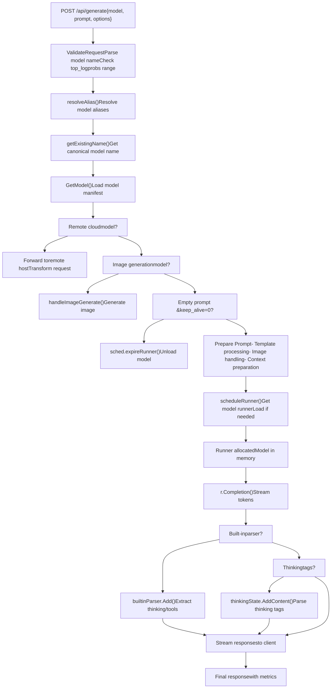
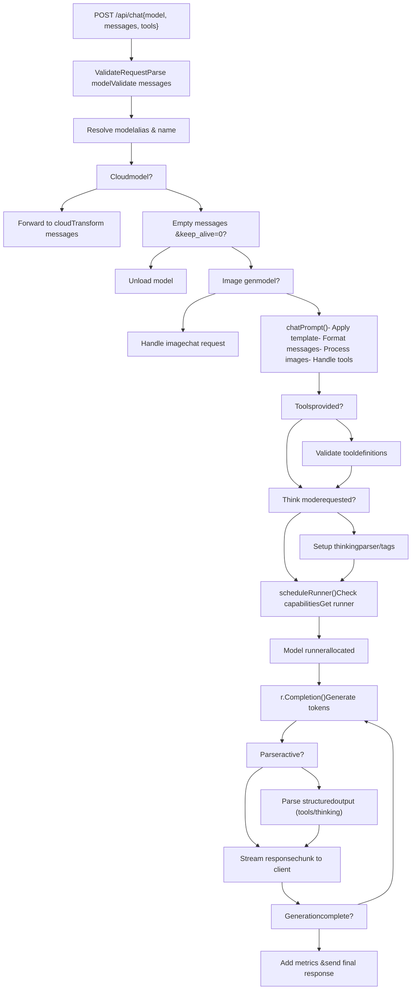
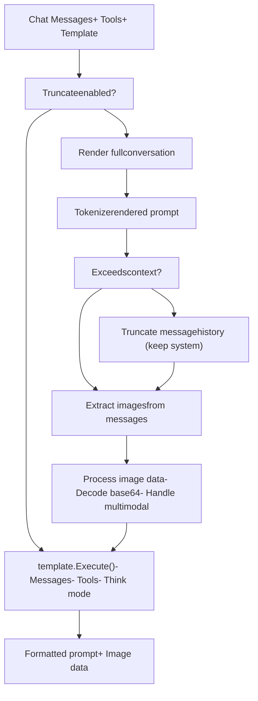
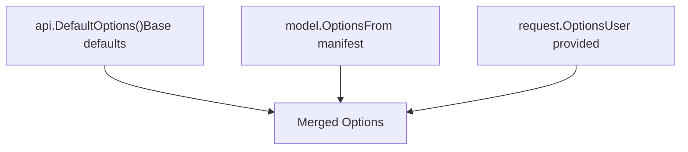
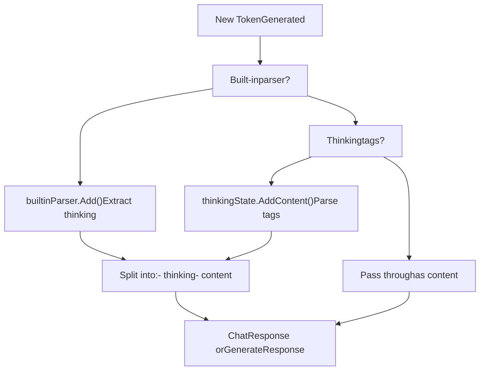
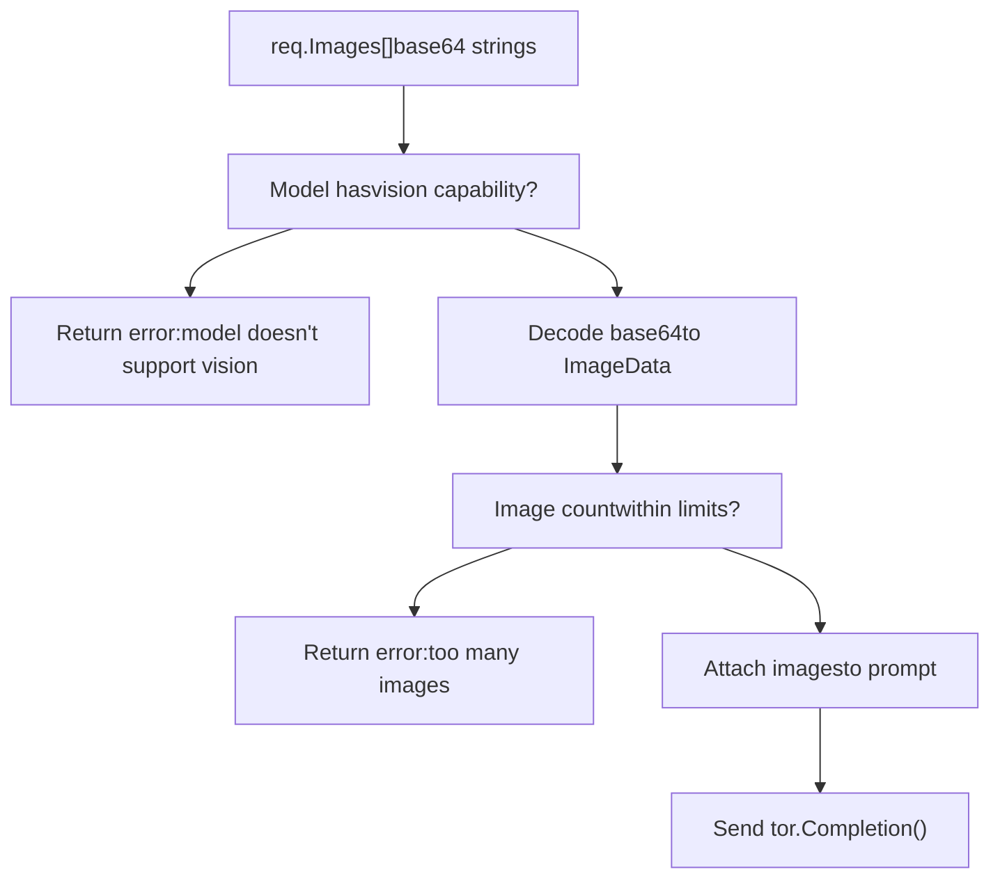
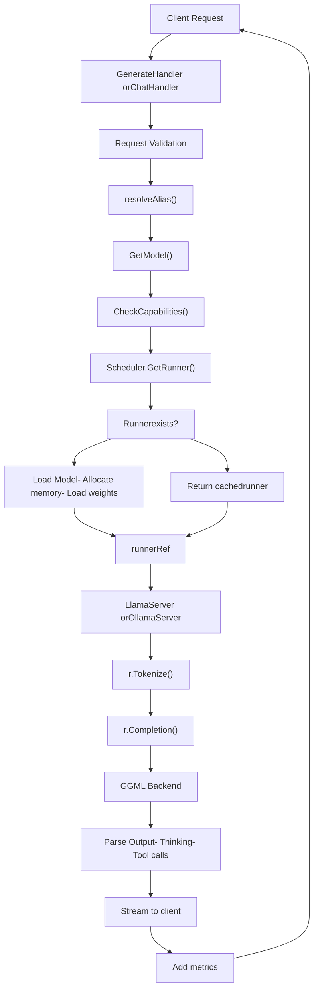
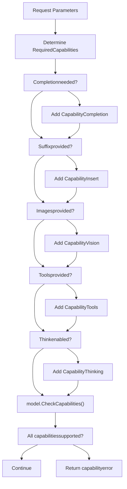

# 生成与聊天 API

相关源文件

-   [README.md](https://github.com/ollama/ollama/blob/562c76d7/README.md?plain=1)
-   [api/client.go](https://github.com/ollama/ollama/blob/562c76d7/api/client.go)
-   [api/client\_test.go](https://github.com/ollama/ollama/blob/562c76d7/api/client_test.go)
-   [api/types.go](https://github.com/ollama/ollama/blob/562c76d7/api/types.go)
-   [cmd/cmd.go](https://github.com/ollama/ollama/blob/562c76d7/cmd/cmd.go)
-   [docs/README.md](https://github.com/ollama/ollama/blob/562c76d7/docs/README.md?plain=1)
-   [docs/api.md](https://github.com/ollama/ollama/blob/562c76d7/docs/api.md?plain=1)
-   [docs/development.md](https://github.com/ollama/ollama/blob/562c76d7/docs/development.md?plain=1)
-   [docs/images/ollama-keys.png](https://github.com/ollama/ollama/blob/562c76d7/docs/images/ollama-keys.png)
-   [docs/images/signup.png](https://github.com/ollama/ollama/blob/562c76d7/docs/images/signup.png)
-   [server/images.go](https://github.com/ollama/ollama/blob/562c76d7/server/images.go)
-   [server/routes.go](https://github.com/ollama/ollama/blob/562c76d7/server/routes.go)

本页说明支撑 Ollama 文本生成能力的核心推理端点 `/api/generate` 与 `/api/chat`。这些端点处理提示词补全与基于已加载模型的多轮会话交互。

关于模型生命周期操作（pull、push、create、delete），请参阅 [Model Management API](/ollama/ollama/3.1-model-management-api)。关于 embedding 生成，请参阅 [Embedding API](/ollama/ollama/3.3-embedding-api)。关于 OpenAI 兼容端点，请参阅 [OpenAI Compatibility Layer](/ollama/ollama/3.4-openai-compatibility-layer)。

## 概览

Ollama 提供两个主要文本生成端点：

-   **`/api/generate`** - 针对给定提示词的单轮补全
-   **`/api/chat`** - 具备消息历史的多轮会话接口

两个端点均支持流式响应、多模态输入（图像）、结构化输出格式、工具调用以及 thinking/reasoning 能力。服务器通过调度器路由这些请求，以分配模型 runner 并逐 token 生成响应。

**API 端点**

| Endpoint | Method | Purpose | Stream Support |
| --- | --- | --- | --- |
| `/api/generate` | POST | 为提示词生成补全 | Yes（默认） |
| `/api/chat` | POST | 基于消息历史进行聊天 | Yes（默认） |

来源： [server/routes.go183-658](https://github.com/ollama/ollama/blob/562c76d7/server/routes.go#L183-L658) [docs/api.md35-718](https://github.com/ollama/ollama/blob/562c76d7/docs/api.md?plain=1#L35-L718)

## Generate 端点

### 请求格式

`/api/generate` 端点接收 `GenerateRequest`，结构如下：

**必填字段：**

-   `model` (string) - 用于生成的模型名
-   `prompt` (string) - 待补全的文本提示

**可选字段：**

-   `suffix` (string) - 插入点后的文本（用于 infilling 模型）
-   `system` (string) - 覆盖系统消息
-   `template` (string) - 覆盖提示模板
-   `images` (\[\]ImageData) - 面向多模态模型的 base64 编码图像
-   `format` (json.RawMessage) - 输出格式约束（`"json"` 或 JSON schema）
-   `options` (map\[string\]any) - 模型特定选项（temperature、top\_p 等）
-   `stream` (\*bool) - 启用/禁用流式（默认：true）
-   `raw` (bool) - 跳过模板格式化
-   `keep_alive` (\*Duration) - 请求后模型保持加载时长
-   `think` (\*ThinkValue) - 为推理模型启用 thinking（bool 或 `"high"`/`"medium"`/`"low"`）
-   `truncate` (\*bool) - 若提示超出上下文长度则截断
-   `shift` (\*bool) - 上下文满时平移窗口
-   `logprobs` (bool) - 返回 token 对数概率
-   `top_logprobs` (int) - 返回 top 候选数量（0-20）

来源： [api/types.go62-144](https://github.com/ollama/ollama/blob/562c76d7/api/types.go#L62-L144) [server/routes.go183-192](https://github.com/ollama/ollama/blob/562c76d7/server/routes.go#L183-L192)

### 响应格式

**流式响应**（多个 JSON 对象）：

```
{  "model": "llama3.2",  "created_at": "2023-08-04T08:52:19.385406455-07:00",  "response": "The",  "done": false}
```
**最终响应**（当 `done: true`）：

```
{  "model": "llama3.2",  "created_at": "2023-08-04T19:22:45.499127Z",  "response": "",  "done": true,  "done_reason": "stop",  "context": [1, 2, 3],  "total_duration": 10706818083,  "load_duration": 6338219291,  "prompt_eval_count": 26,  "prompt_eval_duration": 130079000,  "eval_count": 259,  "eval_duration": 4232710000,  "thinking": "...",  "tool_calls": [...]}
```
**响应字段：**

| Field | Type | Description |
| --- | --- | --- |
| `model` | string | 生成响应的模型 |
| `remote_model` | string | 上游模型名称（云模型） |
| `remote_host` | string | 上游主机 URL（云模型） |
| `created_at` | time.Time | 响应时间戳 |
| `response` | string | 生成文本分片 |
| `thinking` | string | 推理文本（thinking 模型） |
| `done` | bool | 生成是否完成 |
| `done_reason` | string | 完成原因（`"stop"`、`"length"`、`"unload"`、`"load"`） |
| `context` | \[\]int | 用于续写的 token 上下文 |
| `tool_calls` | \[\]ToolCall | 函数调用（启用 tools 时） |
| `logprobs` | \[\]Logprob | token 对数概率 |
| `total_duration` | int64 | 总耗时（纳秒） |
| `load_duration` | int64 | 模型加载耗时 |
| `prompt_eval_count` | int | 评估的提示词 token 数 |
| `prompt_eval_duration` | int64 | 提示词评估耗时 |
| `eval_count` | int | 生成的响应 token 数 |
| `eval_duration` | int64 | 响应生成耗时 |

来源： [api/types.go579-626](https://github.com/ollama/ollama/blob/562c76d7/api/types.go#L579-L626) [server/routes.go545-604](https://github.com/ollama/ollama/blob/562c76d7/server/routes.go#L545-L604)

### Generate Handler 流程


**关键决策点：**

1.  **云模型检查** [server/routes.go240-333](https://github.com/ollama/ollama/blob/562c76d7/server/routes.go#L240-L333)：若模型配置了 `RemoteHost` 与 `RemoteModel`，请求会转发到云提供商
2.  **图像生成** [server/routes.go350-353](https://github.com/ollama/ollama/blob/562c76d7/server/routes.go#L350-L353)：具备 `CapabilityImage` 的模型会路由到图像生成管线
3.  **模型卸载** [server/routes.go336-347](https://github.com/ollama/ollama/blob/562c76d7/server/routes.go#L336-L347)：空提示且 `keep_alive=0` 时会从内存卸载模型
4.  **解析器选择** [server/routes.go360-371](https://github.com/ollama/ollama/blob/562c76d7/server/routes.go#L360-L371)：内置解析器（harmony 等）处理特殊输出格式
5.  **thinking 提取** [server/routes.go516-528](https://github.com/ollama/ollama/blob/562c76d7/server/routes.go#L516-L528)：启用 `think` 参数时会推断并提取 thinking 标签

来源： [server/routes.go183-658](https://github.com/ollama/ollama/blob/562c76d7/server/routes.go#L183-L658) [server/routes.go133-170](https://github.com/ollama/ollama/blob/562c76d7/server/routes.go#L133-L170)

## Chat 端点

### 请求格式

`/api/chat` 端点接收用于多轮会话的 `ChatRequest`：

**必填字段：**

-   `model` (string) - 模型名称
-   `messages` (\[\]Message) - 会话历史

**消息格式：**

```
{  "role": "user|assistant|system|tool",  "content": "Message text",  "images": ["base64..."],  "tool_calls": [...],  "tool_name": "function_name",  "tool_call_id": "call_id"}
```
**可选字段：**

-   `tools` (\[\]Tool) - 模型可调用的函数
-   `format` (json.RawMessage) - 输出格式约束
-   `options` (map\[string\]any) - 模型参数
-   `stream` (\*bool) - 流式模式
-   `keep_alive` (\*Duration) - 模型保活
-   `think` (\*ThinkValue) - thinking 模式
-   `truncate` (\*bool) - 上下文溢出时截断
-   `shift` (\*bool) - 平移上下文窗口
-   `logprobs` (bool) - 返回对数概率
-   `top_logprobs` (int) - top 候选数量

来源： [api/types.go146-194](https://github.com/ollama/ollama/blob/562c76d7/api/types.go#L146-L194) [server/routes.go660-1053](https://github.com/ollama/ollama/blob/562c76d7/server/routes.go#L660-L1053)

### 响应格式

**ChatResponse 结构：**

```
{  "model": "llama3.2",  "created_at": "2024-01-01T00:00:00Z",  "message": {    "role": "assistant",    "content": "Response text",    "thinking": "Reasoning process...",    "tool_calls": [      {        "id": "call_abc123",        "function": {          "name": "get_weather",          "arguments": {"location": "San Francisco"}        }      }    ]  },  "done": true,  "done_reason": "stop"}
```
该响应结构与 `GenerateResponse` 类似，但会将生成内容封装在带角色信息的 `Message` 对象中。

来源： [api/types.go533-562](https://github.com/ollama/ollama/blob/562c76d7/api/types.go#L533-L562) [server/routes.go893-968](https://github.com/ollama/ollama/blob/562c76d7/server/routes.go#L893-L968)

### Chat Handler 流程


来源： [server/routes.go660-1053](https://github.com/ollama/ollama/blob/562c76d7/server/routes.go#L660-L1053)

### Chat 提示处理

`chatPrompt` 函数会将聊天消息历史转换为模型可用的格式化提示：


**截断逻辑：**

当设置 `truncate: true` 且渲染后提示超出上下文长度时：

1.  先渲染完整会话以估算 token 数
2.  若超限，迭代移除历史中间消息
3.  始终保留：系统消息、最新用户消息
4.  持续直到提示适配上下文或达到最小可用会话

来源： [server/routes.go1055-1264](https://github.com/ollama/ollama/blob/562c76d7/server/routes.go#L1055-L1264)

## 通用特性

### 流式响应

两个端点默认都支持流式输出。设置 `"stream": false` 可禁用流式。

**流式流程：**

> **[Mermaid sequence]**
> *(图表结构无法解析)*

**非流式模式：**

当 `stream: false` 时，handler 会累积所有分片并返回单个响应：

```
// Accumulate streaming chunksfor chunk := range ch {    sbContent.WriteString(chunk.Response)    sbThinking.WriteString(chunk.Thinking)    // Accumulate logprobs, tool calls, etc.} // Return complete responsereturn CompleteResponse{    Response: sbContent.String(),    Thinking: sbThinking.String(),    Done: true}
```
来源： [server/routes.go615-655](https://github.com/ollama/ollama/blob/562c76d7/server/routes.go#L615-L655) [server/routes.go969-1017](https://github.com/ollama/ollama/blob/562c76d7/server/routes.go#L969-L1017) [api/client.go273-282](https://github.com/ollama/ollama/blob/562c76d7/api/client.go#L273-L282)

### 模型选项

`options` 字段接受模型特定参数：

**常用选项：**

| Option | Type | Description | Default |
| --- | --- | --- | --- |
| `temperature` | float | 随机性（0.0-2.0） | 0.8 |
| `top_k` | int | Top-K 采样 | 40 |
| `top_p` | float | 核采样 | 0.9 |
| `num_ctx` | int | 上下文窗口大小 | 2048 |
| `num_predict` | int | 最大生成 token 数 | \-1（无限制） |
| `repeat_penalty` | float | 重复惩罚 | 1.1 |
| `seed` | int | 随机种子 | \-1（随机） |
| `stop` | \[\]string | 停止序列 | \[\] |

**选项处理：**


选项合并优先级：Request > Model > Default

来源： [server/routes.go116-131](https://github.com/ollama/ollama/blob/562c76d7/server/routes.go#L116-L131) [api/types.go627-723](https://github.com/ollama/ollama/blob/562c76d7/api/types.go#L627-L723)

### Thinking 支持

Ollama 支持推理模型，可在生成最终回答前产出 “thinking” 文本。

**thinking 检测：**

通过以下方式检测模型是否具备 thinking 能力：

1.  模型配置中显式声明 `CapabilityThinking`
2.  支持 thinking 的内置解析器（`harmony` 等）
3.  由模板推断出的 thinking 标签（`<thinking>`、`<think>` 等）

**thinking 模式：**

| Think Value | Description |
| --- | --- |
| `true` or `"true"` | 启用默认深度 thinking |
| `false` | 显式禁用 thinking |
| `"high"` | 最大推理深度 |
| `"medium"` | 中等推理 |
| `"low"` | 最小推理 |
| `nil` (not set) | 使用模型默认值 |

**thinking 提取流程：**


**包含 thinking 的示例响应：**

```
{  "model": "deepseek-r1",  "message": {    "role": "assistant",    "content": "The answer is 42.",    "thinking": "Let me work through this step by step..."  },  "done": false}
```
来源： [server/routes.go360-390](https://github.com/ollama/ollama/blob/562c76d7/server/routes.go#L360-L390) [server/routes.go516-528](https://github.com/ollama/ollama/blob/562c76d7/server/routes.go#L516-L528) [thinking/thinking.go](https://github.com/ollama/ollama/blob/562c76d7/thinking/thinking.go) [model/parsers/](https://github.com/ollama/ollama/blob/562c76d7/model/parsers/)

### 多模态支持

具备视觉能力的模型可接收 base64 字符串编码图像。

**图像处理：**


**模型特定限制：**

-   `mllama` 模型：每次请求最多 1 张图
-   大多数视觉模型：支持多张图

来源： [server/routes.go412-421](https://github.com/ollama/ollama/blob/562c76d7/server/routes.go#L412-L421) [server/routes.go1141-1163](https://github.com/ollama/ollama/blob/562c76d7/server/routes.go#L1141-L1163)

### 结构化输出

两个端点均支持将输出约束为 JSON 格式。

**JSON 模式（`format: "json"`）：**

强制输出为合法 JSON。仍需在提示中指示模型输出 JSON。

```
{  "format": "json"}
```
**JSON Schema 模式：**

将输出约束为匹配特定 schema：

```
{  "format": {    "type": "object",    "properties": {      "name": {"type": "string"},      "age": {"type": "integer"}    },    "required": ["name", "age"]  }}
```
schema 会通过 completion 选项传递给模型，并在生成期间执行约束。

来源： [docs/api.md71-284](https://github.com/ollama/ollama/blob/562c76d7/docs/api.md?plain=1#L71-L284) [server/routes.go538](https://github.com/ollama/ollama/blob/562c76d7/server/routes.go#L538-L538)

### 工具调用

聊天端点通过 `tools` 参数支持函数调用。

**工具定义格式：**

```
{  "tools": [    {      "type": "function",      "function": {        "name": "get_weather",        "description": "Get current weather",        "parameters": {          "type": "object",          "properties": {            "location": {              "type": "string",              "description": "City name"            }          },          "required": ["location"]        }      }    }  ]}
```
**工具调用响应：**

当模型希望调用函数时，会返回：

```
{  "message": {    "role": "assistant",    "content": "",    "tool_calls": [      {        "id": "call_123",        "function": {          "name": "get_weather",          "arguments": {            "location": "San Francisco"          }        }      }    ]  }}
```
**工具结果消息：**

客户端将函数结果回传：

```
{  "role": "tool",  "content": "{\"temp\": 72, \"condition\": \"sunny\"}",  "tool_call_id": "call_123"}
```
来源： [api/types.go196-508](https://github.com/ollama/ollama/blob/562c76d7/api/types.go#L196-L508) [server/routes.go790-836](https://github.com/ollama/ollama/blob/562c76d7/server/routes.go#L790-L836) [tools/tools.go](https://github.com/ollama/ollama/blob/562c76d7/tools/tools.go)

## 请求处理架构

### 端到端流程


来源： [server/routes.go183-658](https://github.com/ollama/ollama/blob/562c76d7/server/routes.go#L183-L658) [server/routes.go660-1053](https://github.com/ollama/ollama/blob/562c76d7/server/routes.go#L660-L1053) [server/sched.go](https://github.com/ollama/ollama/blob/562c76d7/server/sched.go)

### 能力检查

在调度 runner 前，handler 会校验模型是否支持所需能力：


**能力错误：**

当模型不支持所需能力时，会返回明确错误信息：

-   `"model does not support completion"` - 模型仅支持 embedding
-   `"model does not support insert"` - 不支持 infilling
-   `"model does not support vision"` - 不支持图像处理
-   `"model does not support tools"` - 不支持函数调用
-   `"model does not support thinking"` - 不支持推理

来源： [server/routes.go373-398](https://github.com/ollama/ollama/blob/562c76d7/server/routes.go#L373-L398) [server/routes.go714-779](https://github.com/ollama/ollama/blob/562c76d7/server/routes.go#L714-L779) [server/images.go147-189](https://github.com/ollama/ollama/blob/562c76d7/server/images.go#L147-L189)

## 错误处理

### 错误类型

**StatusError:** 带状态码与消息的 HTTP 错误。

```
{  "error": "model 'invalid' not found",  "status": 404}
```
**AuthorizationError:** 云模型的认证失败。

```
{  "error": "unauthorized",  "signin_url": "https://ollama.com/connect?...",  "status": 401}
```
来源： [api/types.go22-54](https://github.com/ollama/ollama/blob/562c76d7/api/types.go#L22-L54)

### 常见错误场景

| Error | Status | Cause |
| --- | --- | --- |
| "missing request body" | 400 | POST body 为空 |
| "model is required" | 400 | 缺少 model 字段 |
| "model 'X' not found" | 404 | 模型未 pull/create |
| "model does not support Y" | 400 | 能力不匹配 |
| "top\_logprobs must be between 0 and 20" | 400 | 参数无效 |
| "this model only supports one image" | 400 | 图像过多（mllama） |
| "unauthorized" | 401 | 云模型认证失败 |
| "remote model is unavailable" | 403 | 云模型被禁用 |

来源： [server/routes.go186-232](https://github.com/ollama/ollama/blob/562c76d7/server/routes.go#L186-L232) [server/routes.go392-397](https://github.com/ollama/ollama/blob/562c76d7/server/routes.go#L392-L397) [server/routes.go668-710](https://github.com/ollama/ollama/blob/562c76d7/server/routes.go#L668-L710)

### 错误响应格式

错误以 JSON 返回：

```
{  "error": "detailed error message"}
```
对于流式端点，错误可能在流中途出现：

```
{"error": "context length exceeded"}
```
客户端必须检查每个流分片中的 `error` 字段。

来源： [server/routes.go606-612](https://github.com/ollama/ollama/blob/562c76d7/server/routes.go#L606-L612) [api/client.go222-256](https://github.com/ollama/ollama/blob/562c76d7/api/client.go#L222-L256)

## 性能指标

两个端点都会在最终响应中返回性能指标：

**耗时指标：**

| Metric | Description | Unit |
| --- | --- | --- |
| `total_duration` | 端到端请求耗时 | 纳秒 |
| `load_duration` | 模型加载耗时 | 纳秒 |
| `prompt_eval_duration` | 提示词处理耗时 | 纳秒 |
| `eval_duration` | token 生成耗时 | 纳秒 |

**计数指标：**

| Metric | Description |
| --- | --- |
| `prompt_eval_count` | 提示词 token 数 |
| `eval_count` | 生成 token 数 |

**派生指标：**

-   **每秒 token 数：** `eval_count / (eval_duration / 1e9)`
-   **每秒提示 token 数：** `prompt_eval_count / (prompt_eval_duration / 1e9)`

来源： [api/types.go570-577](https://github.com/ollama/ollama/blob/562c76d7/api/types.go#L570-L577) [server/routes.go582-583](https://github.com/ollama/ollama/blob/562c76d7/server/routes.go#L582-L583)

## 与其他系统的集成

### 调度器集成

两个 handler 都会与调度器交互以获取模型 runner：

```
r, m, opts, err := s.scheduleRunner(    ctx,    modelName,    requiredCapabilities,    requestOptions,    keepAlive)
```
调度器负责：

-   runner 分配与生命周期（参见 [Request Scheduling and Runner Management](/ollama/ollama/2.2-request-scheduling-and-runner-management)）
-   模型加载与内存管理
-   keep-alive 定时器管理
-   并发请求引用计数

来源： [server/routes.go133-170](https://github.com/ollama/ollama/blob/562c76d7/server/routes.go#L133-L170) [server/sched.go](https://github.com/ollama/ollama/blob/562c76d7/server/sched.go)

### Runner 接口

handler 通过 `LlamaServer` 接口与 runner 交互：

**关键方法：**

-   `Tokenize(ctx, text)` - 文本转 token
-   `Detokenize(ctx, tokens)` - token 转文本
-   `Completion(ctx, request, callback)` - 生成 token
-   `Embedding(ctx, text)` - 生成 embedding（用于 `/api/embed`）

来源： [llm/server.go](https://github.com/ollama/ollama/blob/562c76d7/llm/server.go)

### 模板系统

提示词通过模板系统进行格式化（参见 [Template System](/ollama/ollama/7.1-template-system)）：

```
tmpl := model.Templateif requestTemplate != "" {    tmpl, _ = template.Parse(requestTemplate)} values := template.Values{    Messages: messages,    Tools: tools,    Think: thinkEnabled,} tmpl.Execute(&buffer, values)
```
来源： [server/routes.go425-500](https://github.com/ollama/ollama/blob/562c76d7/server/routes.go#L425-L500) [server/routes.go1198-1264](https://github.com/ollama/ollama/blob/562c76d7/server/routes.go#L1198-L1264) [template/template.go](https://github.com/ollama/ollama/blob/562c76d7/template/template.go)
