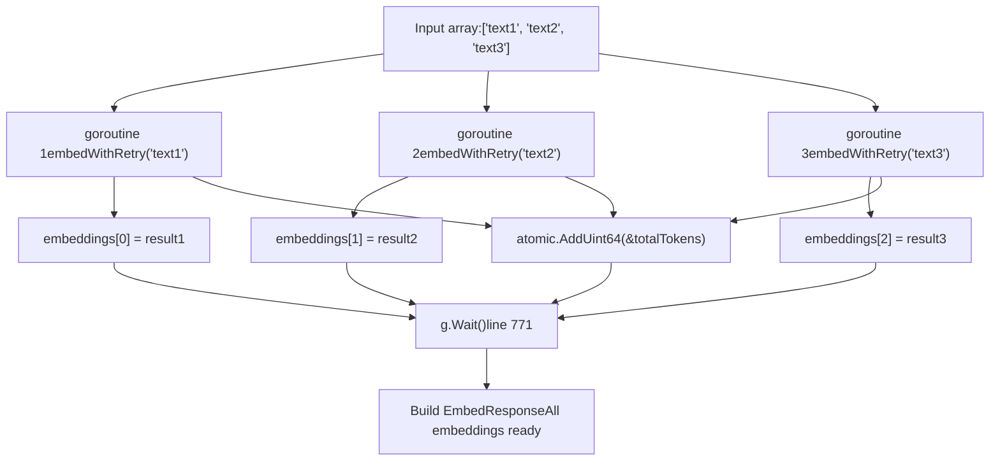
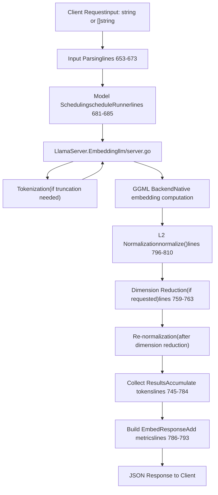

# 嵌入 API

相关源文件

-   [README.md](https://github.com/ollama/ollama/blob/562c76d7/README.md?plain=1)
-   [api/client.go](https://github.com/ollama/ollama/blob/562c76d7/api/client.go)
-   [api/client\_test.go](https://github.com/ollama/ollama/blob/562c76d7/api/client_test.go)
-   [api/types.go](https://github.com/ollama/ollama/blob/562c76d7/api/types.go)
-   [cmd/cmd.go](https://github.com/ollama/ollama/blob/562c76d7/cmd/cmd.go)
-   [docs/README.md](https://github.com/ollama/ollama/blob/562c76d7/docs/README.md?plain=1)
-   [docs/api.md](https://github.com/ollama/ollama/blob/562c76d7/docs/api.md?plain=1)
-   [docs/development.md](https://github.com/ollama/ollama/blob/562c76d7/docs/development.md?plain=1)
-   [docs/images/ollama-keys.png](https://github.com/ollama/ollama/blob/562c76d7/docs/images/ollama-keys.png)
-   [docs/images/signup.png](https://github.com/ollama/ollama/blob/562c76d7/docs/images/signup.png)
-   [server/images.go](https://github.com/ollama/ollama/blob/562c76d7/server/images.go)
-   [server/routes.go](https://github.com/ollama/ollama/blob/562c76d7/server/routes.go)

Embedding API 提供用于基于 embedding 模型从文本生成向量 embedding 的端点。embedding 是文本的数值表示，能够捕获语义信息，并支持相似度比较、检索等向量化操作。

关于模型管理操作，请参阅 [Model Management API](/ollama/ollama/3.1-model-management-api)。关于文本生成，请参阅 [Generation and Chat API](/ollama/ollama/3.2-generation-and-chat-api)。

## 端点

Ollama 提供两个接口不同的 embedding 端点：

| Endpoint | Purpose | Status |
| --- | --- | --- |
| `/api/embed` | 现代 embedding API，支持批处理 | 推荐 |
| `/api/embeddings` | 旧版单 embedding API | 已弃用 |

`/api/embed` 是推荐接口，因为它支持单请求多输入批处理，并提供降维与自动截断等高级功能。

**来源：** [server/routes.go640-855](https://github.com/ollama/ollama/blob/562c76d7/server/routes.go#L640-L855) [docs/api.md16](https://github.com/ollama/ollama/blob/562c76d7/docs/api.md?plain=1#L16-L16)

## 请求流架构

> **[Mermaid sequence]**
> *(图表结构无法解析)*

**来源：** [server/routes.go640-794](https://github.com/ollama/ollama/blob/562c76d7/server/routes.go#L640-L794)

## /api/embed 端点

### 请求格式

`/api/embed` 端点接收 `EmbedRequest`，结构如下：

| Field | Type | Required | Description |
| --- | --- | --- | --- |
| `model` | string | Yes | 要使用的 embedding 模型名称 |
| `input` | string or string\[\] | No | 要进行 embedding 的文本（单字符串或字符串数组） |
| `truncate` | boolean | No | 截断超出上下文长度的输入（默认：true） |
| `options` | map | No | 模型特定选项（如上下文长度） |
| `keep_alive` | duration | No | 模型在内存中保持加载的时长 |
| `dimensions` | int | No | 将 embedding 维度降至该大小 |

`input` 字段较为灵活，支持单字符串或字符串数组（用于批处理）：

```
{  "model": "mxbai-embed-large",  "input": "Why is the sky blue?"}
```
或批量 embedding：

```
{  "model": "mxbai-embed-large",  "input": [    "Why is the sky blue?",    "What is the capital of France?",    "How does photosynthesis work?"  ]}
```
**来源：** [api/types.go611-635](https://github.com/ollama/ollama/blob/562c76d7/api/types.go#L611-L635) [server/routes.go640-694](https://github.com/ollama/ollama/blob/562c76d7/server/routes.go#L640-L694)

### 响应格式

该端点返回 `EmbedResponse`：

| Field | Type | Description |
| --- | --- | --- |
| `model` | string | 使用的模型名称 |
| `embeddings` | float32\[\]\[\] | embedding 向量数组 |
| `total_duration` | int64 | 总耗时（纳秒） |
| `load_duration` | int64 | 模型加载耗时（纳秒） |
| `prompt_eval_count` | int | 已处理 token 总数 |

`embeddings` 数组中的每个 embedding 都是归一化后的浮点向量。向量长度取决于模型原生 embedding 维度（除非通过 `dimensions` 参数降维）。

**来源：** [api/types.go637-646](https://github.com/ollama/ollama/blob/562c76d7/api/types.go#L637-L646) [server/routes.go786-793](https://github.com/ollama/ollama/blob/562c76d7/server/routes.go#L786-L793)

### 输入处理流程

**来源：** [server/routes.go640-794](https://github.com/ollama/ollama/blob/562c76d7/server/routes.go#L640-L794)

## 输入截断逻辑

当输入超过模型上下文长度时，若启用 `truncate`，`EmbedHandler` 可自动执行截断：

1.  **错误检测：** handler 调用 `runner.Embedding()` 并捕获 400 状态错误
2.  **分词：** 使用 `runner.Tokenize()` 将输入文本转换为 token
3.  **上下文计算：** 通过以下步骤确定最大 token 数：
    -   从 `opts.NumCtx` 或模型原生上下文长度开始
    -   若会添加 BOS（beginning-of-sequence）token，则减 1
    -   若会添加 EOS（end-of-sequence）token，则减 1
4.  **截断：** 将 token 数组切片到上下文长度：`tokens[:ctxLen]`
5.  **反分词：** 将截断后的 token 转回文本
6.  **重试：** 使用截断后的文本再次调用 `runner.Embedding()`

该逻辑封装在 [server/routes.go702-743](https://github.com/ollama/ollama/blob/562c76d7/server/routes.go#L702-L743) 的 `embedWithRetry` 闭包中。

**来源：** [server/routes.go702-743](https://github.com/ollama/ollama/blob/562c76d7/server/routes.go#L702-L743)

## 向量归一化

返回前，所有 embedding 都会执行 L2 归一化为单位长度。位于 [server/routes.go796-810](https://github.com/ollama/ollama/blob/562c76d7/server/routes.go#L796-L810) 的 `normalize` 函数实现如下：

1.  **校验：** 检查 embedding 向量中是否存在 NaN 或 Inf 值
2.  **平方和：** 对每个元素计算 `sum += v * v`
3.  **归一化因子：** 计算 `norm = 1.0 / max(sqrt(sum), 1e-12)`
4.  **缩放：** 将每个元素乘以归一化因子

若请求了降维，归一化会执行两次：

-   一次在生成完整 embedding 后
-   一次在切片到请求维度后

这可确保降维后的 embedding 仍保持单位长度。

**来源：** [server/routes.go796-810](https://github.com/ollama/ollama/blob/562c76d7/server/routes.go#L796-L810) [server/routes.go755-763](https://github.com/ollama/ollama/blob/562c76d7/server/routes.go#L755-L763)

## 并发批处理


handler 使用 `golang.org/x/sync/errgroup` 并发处理多个输入：

-   **Goroutine Limit:** 设为 `max(GOMAXPROCS-1, 1)`（由 errgroup 行为隐式决定）
-   **Index Preservation:** 每个 goroutine 写入 embeddings 切片中预分配的索引
-   **Token Counting:** 使用 `atomic.AddUint64` 安全累计 token 数
-   **Error Handling:** 任一 goroutine 返回错误时，`g.Wait()` 会返回该错误并终止处理

**来源：** [server/routes.go745-784](https://github.com/ollama/ollama/blob/562c76d7/server/routes.go#L745-L784)

## /api/embeddings 端点（旧版）

### 请求格式

旧版端点接收 `EmbeddingRequest`：

| Field | Type | Required | Description |
| --- | --- | --- | --- |
| `model` | string | Yes | embedding 模型名称 |
| `prompt` | string | Yes | 待 embedding 的文本 |
| `options` | map | No | 模型特定选项 |
| `keep_alive` | duration | No | 模型内存保活时长 |

**来源：** [api/types.go648-657](https://github.com/ollama/ollama/blob/562c76d7/api/types.go#L648-L657) [server/routes.go812-855](https://github.com/ollama/ollama/blob/562c76d7/server/routes.go#L812-L855)

### 响应格式

返回只包含单个 embedding 的 `EmbeddingResponse`：

| Field | Type | Description |
| --- | --- | --- |
| `embedding` | float64\[\] | 单 embedding 向量（为 float64，而非 float32） |

**Note:** 与 `/api/embed` 相比，该端点：

-   返回 `float64` 而不是 `float32`
-   不返回指标（无耗时与 token 计数）
-   不支持批处理
-   不执行归一化
-   不支持截断或降维

**来源：** [api/types.go659-662](https://github.com/ollama/ollama/blob/562c76d7/api/types.go#L659-L662) [server/routes.go835-854](https://github.com/ollama/ollama/blob/562c76d7/server/routes.go#L835-L854)

### 端点对比

```mermaid
flowchart TD
    L1["✗ Single input only"]
    L2["✗ No truncation"]
    L3["✗ No dimension control"]
    L4["✗ No normalization"]
    L5["✗ No metrics"]
    L6["✗ No token counts"]
    L7["float64 output"]
    L8["✗ No concurrency"]
    E1["✓ Batch processing"]
    E2["✓ Auto-truncation"]
    E3["✓ Dimension reduction"]
    E4["✓ L2 normalization"]
    E5["✓ Timing metrics"]
    E6["✓ Token counts"]
    E7["✓ float32 output"]
    E8["✓ Concurrent processing"]
    Recommendation["Use /api/embed for new applications"]

    E1 --> Recommendation
    E2 --> Recommendation
    E3 --> Recommendation
```


**来源：** [server/routes.go640-855](https://github.com/ollama/ollama/blob/562c76d7/server/routes.go#L640-L855)

## 模型调度与加载

两个端点都使用 `scheduleRunner` 函数获取模型 runner：

1.  **模型校验：** 解析并校验模型名称
2.  **模型获取：** 通过 `GetModel(name)` 加载模型元数据
3.  **能力检查：** 校验模型支持 embedding（对 embedding 端点而言通常是隐式）
4.  **选项合并：** 合并模型默认值与请求选项
5.  **Runner 分配：** 调用 `s.sched.GetRunner()`，其行为可能是：
    -   返回已加载 runner
    -   将模型加载入内存
    -   在内存受限时卸载其他模型

`keep_alive` 参数控制请求完成后 runner 保持加载的时长。设为 `0` 会立即卸载模型。

**来源：** [server/routes.go122-163](https://github.com/ollama/ollama/blob/562c76d7/server/routes.go#L122-L163) [server/routes.go681-685](https://github.com/ollama/ollama/blob/562c76d7/server/routes.go#L681-L685)

## 客户端用法

`api` 包提供类型化客户端以发起 embedding 请求：

```
// Modern API with batch supportfunc (c *Client) Embed(ctx context.Context, req *EmbedRequest) (*EmbedResponse, error)
```
示例用法：

```
client, _ := api.ClientFromEnvironment() resp, err := client.Embed(context.Background(), &api.EmbedRequest{    Model: "mxbai-embed-large",    Input: []string{        "The sky appears blue during the day",        "Grass is typically green in color",    },}) // resp.Embeddings[0] contains embedding for first text// resp.Embeddings[1] contains embedding for second text
```
**来源：** [api/client.go425-432](https://github.com/ollama/ollama/blob/562c76d7/api/client.go#L425-L432)

## 数据流总结


**来源：** [server/routes.go640-794](https://github.com/ollama/ollama/blob/562c76d7/server/routes.go#L640-L794)

## 错误处理

embedding 端点会返回合适的 HTTP 状态码：

| Status | Condition |
| --- | --- |
| 200 | 成功 |
| 400 | 无效请求（JSON 格式错误、输入类型无效） |
| 404 | 模型不存在 |
| 500 | 内部错误（分词失败、后端错误） |

具体错误场景：

-   **Invalid Input Type:** 若 `input` 既不是字符串也不是字符串数组，返回 400 [server/routes.go663-665](https://github.com/ollama/ollama/blob/562c76d7/server/routes.go#L663-L665)
-   **Empty Input:** 返回空 embeddings 数组与 200 状态 [server/routes.go689-692](https://github.com/ollama/ollama/blob/562c76d7/server/routes.go#L689-L692)
-   **Truncation Failure:** 截断后仍超上下文时返回错误 [server/routes.go731-735](https://github.com/ollama/ollama/blob/562c76d7/server/routes.go#L731-L735)
-   **NaN/Inf in Embeddings:** 归一化检测到非法值时返回错误 [server/routes.go799-801](https://github.com/ollama/ollama/blob/562c76d7/server/routes.go#L799-L801)

**来源：** [server/routes.go640-794](https://github.com/ollama/ollama/blob/562c76d7/server/routes.go#L640-L794)

## 模型检测

若要检查模型是否支持 embedding，可查看其 capabilities：

```
resp, _ := client.Show(ctx, &api.ShowRequest{Model: "mxbai-embed-large"}) // Check if model has embedding capabilityhasEmbedding := slices.Contains(resp.Capabilities, model.CapabilityEmbedding)
```
embedding 能力通过检查模型 GGUF 元数据中是否存在 `pooling_type` 键来判定。若存在，模型会被归类为 embedding 模型而非 completion 模型。

**来源：** [server/images.go72-100](https://github.com/ollama/ollama/blob/562c76d7/server/images.go#L72-L100)
