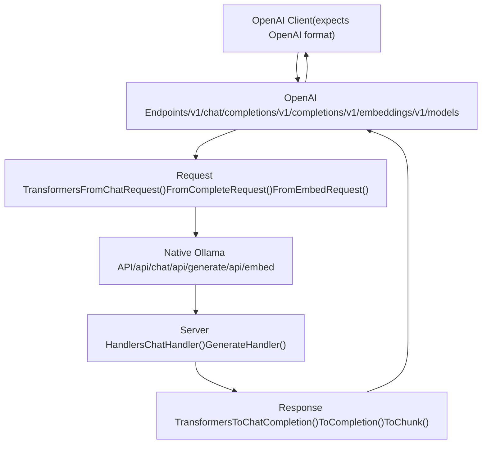
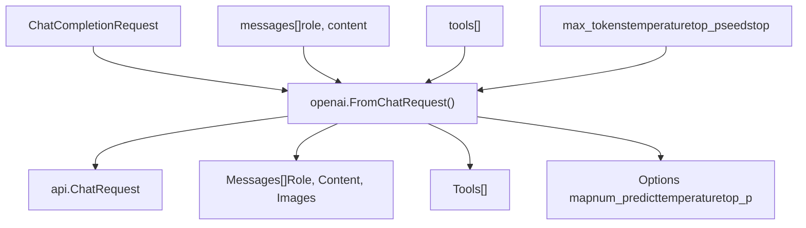
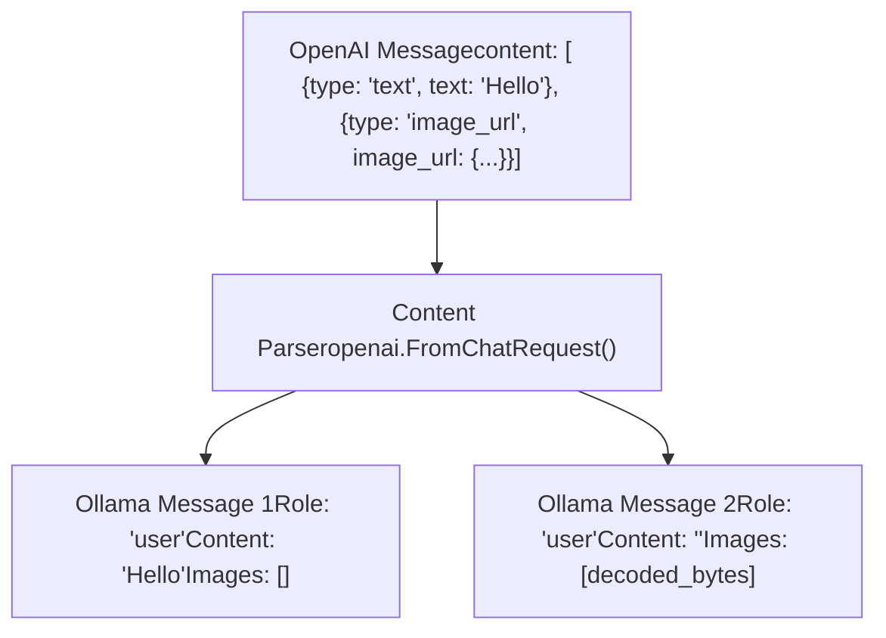
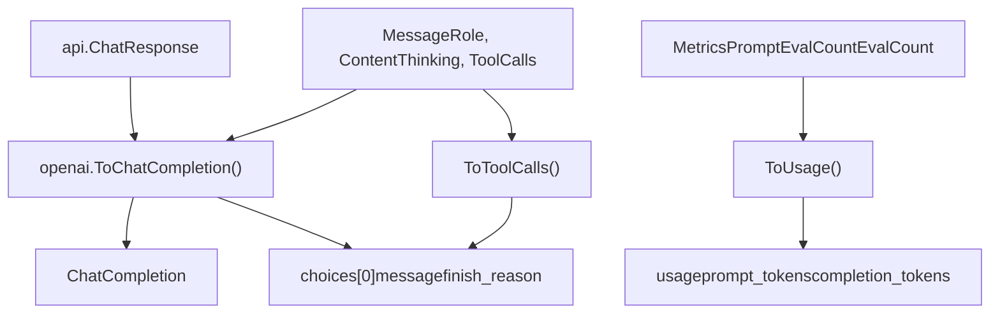
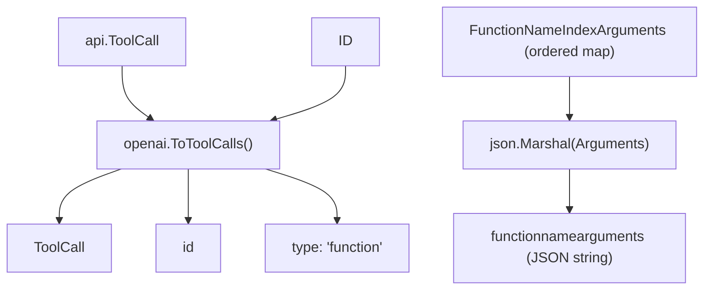
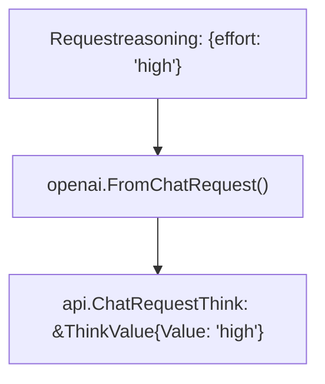
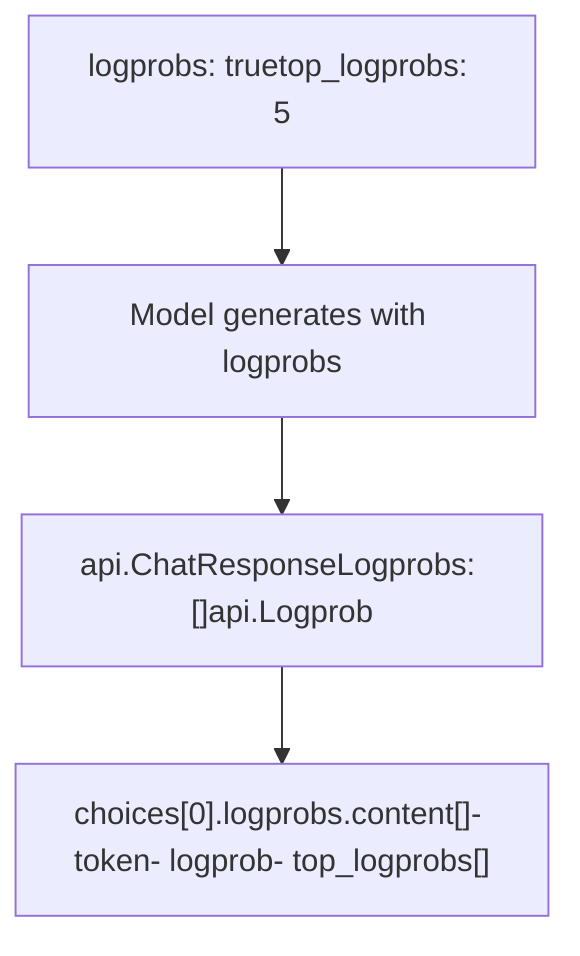
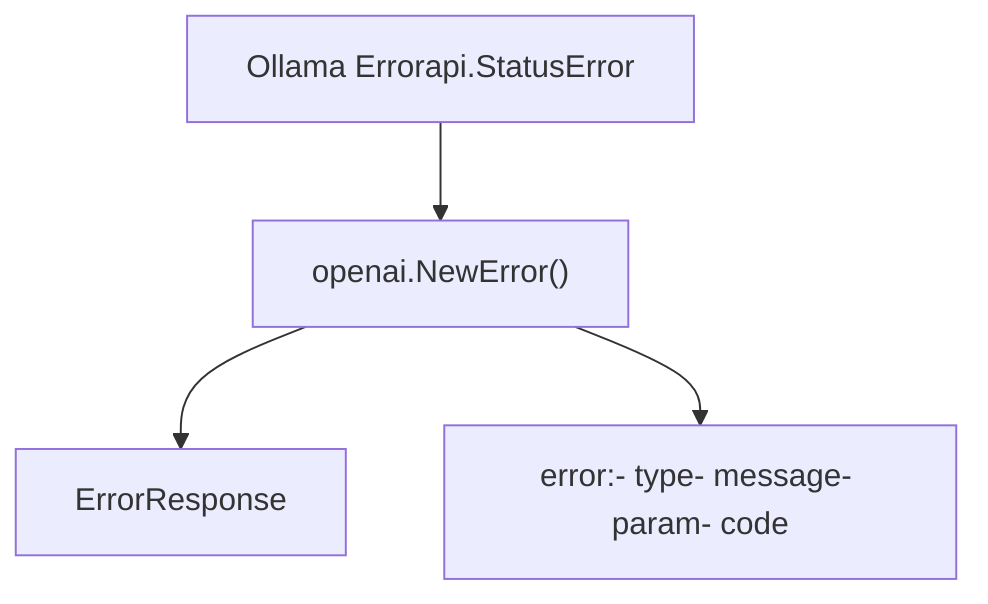

# OpenAI 兼容层

相关源文件

-   [api/client.go](https://github.com/ollama/ollama/blob/562c76d7/api/client.go)
-   [api/client\_test.go](https://github.com/ollama/ollama/blob/562c76d7/api/client_test.go)
-   [api/types.go](https://github.com/ollama/ollama/blob/562c76d7/api/types.go)
-   [api/types\_test.go](https://github.com/ollama/ollama/blob/562c76d7/api/types_test.go)
-   [api/types\_typescript\_test.go](https://github.com/ollama/ollama/blob/562c76d7/api/types_typescript_test.go)
-   [cmd/cmd.go](https://github.com/ollama/ollama/blob/562c76d7/cmd/cmd.go)
-   [middleware/openai.go](https://github.com/ollama/ollama/blob/562c76d7/middleware/openai.go)
-   [middleware/openai\_test.go](https://github.com/ollama/ollama/blob/562c76d7/middleware/openai_test.go)
-   [openai/openai.go](https://github.com/ollama/ollama/blob/562c76d7/openai/openai.go)
-   [openai/openai\_test.go](https://github.com/ollama/ollama/blob/562c76d7/openai/openai_test.go)
-   [openai/responses.go](https://github.com/ollama/ollama/blob/562c76d7/openai/responses.go)
-   [openai/responses\_test.go](https://github.com/ollama/ollama/blob/562c76d7/openai/responses_test.go)
-   [server/images.go](https://github.com/ollama/ollama/blob/562c76d7/server/images.go)
-   [server/routes.go](https://github.com/ollama/ollama/blob/562c76d7/server/routes.go)
-   [server/routes\_generate\_test.go](https://github.com/ollama/ollama/blob/562c76d7/server/routes_generate_test.go)
-   [tools/tools.go](https://github.com/ollama/ollama/blob/562c76d7/tools/tools.go)
-   [tools/tools\_test.go](https://github.com/ollama/ollama/blob/562c76d7/tools/tools_test.go)

OpenAI Compatibility Layer 提供对 OpenAI REST API 的部分兼容，使面向 OpenAI 构建的客户端只需最少修改即可与 Ollama 交互。该层负责在 OpenAI 格式与 Ollama 原生 API 格式之间进行请求和响应转换。

关于 Ollama 原生 API 端点，请参阅 [API Reference](/ollama/ollama/3-api-reference)。关于模型管理操作详情，请参阅 [Model Management API](/ollama/ollama/3.1-model-management-api)。

---

## 目的与范围

该兼容层实现了 OpenAI API 规范的一个子集，重点包括：

-   聊天补全（`/v1/chat/completions`）
-   文本补全（`/v1/completions`）
-   Embeddings（`/v1/embeddings`）
-   模型列表（`/v1/models`）

该层执行双向转换：将传入的 OpenAI 格式请求转换为 Ollama 原生格式，并将 Ollama 响应转换回 OpenAI 格式。这使得原本为 OpenAI API 设计的应用能够实现“即插即用”兼容。

---

## 架构概览


**兼容层中的请求/响应流**

来源： [openai/openai.go1-700](https://github.com/ollama/ollama/blob/562c76d7/openai/openai.go#L1-L700) [server/routes.go1-1500](https://github.com/ollama/ollama/blob/562c76d7/server/routes.go#L1-L1500)

兼容层充当外部 OpenAI 客户端与 Ollama 内部 API 之间的翻译边界。所有请求与响应转换均由 `openai` 包中的函数处理，该包与核心服务器逻辑相分离。

---

## HTTP 端点

兼容层暴露以下 OpenAI 兼容端点：

| OpenAI Endpoint | Maps To | Request Type | Response Type |
| --- | --- | --- | --- |
| `POST /v1/chat/completions` | `/api/chat` | `ChatCompletionRequest` | `ChatCompletion` or `ChatCompletionChunk` |
| `POST /v1/completions` | `/api/generate` | `CompletionRequest` | `Completion` or `CompletionChunk` |
| `POST /v1/embeddings` | `/api/embed` | `EmbedRequest` | `EmbeddingList` |
| `GET /v1/models` | `/api/tags` | None | `ListCompletion` |

来源： [openai/openai.go98-177](https://github.com/ollama/ollama/blob/562c76d7/openai/openai.go#L98-L177)

### 流式支持

当请求中设置 `stream: true` 时，聊天与文本补全端点都支持流式响应。流式响应采用 Server-Sent Events（SSE）格式，使用 `data:` 前缀 JSON 分片，匹配 OpenAI 的流式协议。

> **[Mermaid sequence]**
> *(图表结构无法解析)*

**流式响应流程**

来源： [openai/openai.go294-324](https://github.com/ollama/ollama/blob/562c76d7/openai/openai.go#L294-L324) [openai/openai.go335-420](https://github.com/ollama/ollama/blob/562c76d7/openai/openai.go#L335-L420)

---

## 请求转换

### Chat Completion 请求

`FromChatRequest()` 函数将 OpenAI 的 `ChatCompletionRequest` 转换为 Ollama 的 `api.ChatRequest`：


**聊天请求字段映射**

来源： [openai/openai.go422-693](https://github.com/ollama/ollama/blob/562c76d7/openai/openai.go#L422-L693)

`FromChatRequest()` 执行的关键转换：

| OpenAI Field | Ollama Field | Transformation |
| --- | --- | --- |
| `messages[].content` | `Messages[].Content` | 字符串保持不变；数组转换为文本 + 图像 |
| `messages[].content[].image_url.url` | `Messages[].Images[]` | 提取并解码 Base64 数据 |
| `max_tokens` | `Options["num_predict"]` | 直接映射 |
| `temperature` | `Options["temperature"]` | 转换为 `float32` |
| `top_p` | `Options["top_p"]` | 转换为 `float32` |
| `frequency_penalty` | `Options["frequency_penalty"]` | 转换为 `float32` |
| `presence_penalty` | `Options["presence_penalty"]` | 转换为 `float32` |
| `seed` | `Options["seed"]` | 直接映射 |
| `stop` | `Options["stop"]` | 字符串或数组转换为 `[]string` |
| `tools[]` | `Tools` | 直接映射（结构兼容） |
| `response_format.type` | `Format` | `"json"` 映射为 JSON 格式 |
| `response_format.json_schema.schema` | `Format` | Schema 作为 `json.RawMessage` 传递 |

来源： [openai/openai.go422-550](https://github.com/ollama/ollama/blob/562c76d7/openai/openai.go#L422-L550)

### 多模态内容处理

当消息包含多模态内容（文本与图像）时，转换逻辑会将其拆分为多个独立消息：


**多模态内容拆分**

来源： [openai/openai.go476-548](https://github.com/ollama/ollama/blob/562c76d7/openai/openai.go#L476-L548)

如果图像 URL 使用 `data:image/...;base64,` 前缀，会从 Base64 进行解码。解码后的二进制数据会存入 Ollama 消息的 `Images` 字段。

### 文本 Completion 请求

`FromCompleteRequest()` 函数将 OpenAI 的 `CompletionRequest` 转换为 Ollama 的 `api.GenerateRequest`：

| OpenAI Field | Ollama Field | Notes |
| --- | --- | --- |
| `prompt` | `Prompt` | 字符串直接映射 |
| `suffix` | `Suffix` | 用于中间填充 completion |
| `max_tokens` | `Options["num_predict"]` | token 上限 |
| `logprobs` | `Logprobs` and `TopLogprobs` | logprobs 支持 |

来源： [openai/openai.go695-777](https://github.com/ollama/ollama/blob/562c76d7/openai/openai.go#L695-L777)

### Embedding 请求

`FromEmbedRequest()` 函数同时处理单字符串与字符串数组：

```
// Input can be:// - string: "single text"// - []string: ["text1", "text2"]
```
来源： [openai/openai.go779-824](https://github.com/ollama/ollama/blob/562c76d7/openai/openai.go#L779-L824)

---

## 响应转换

### Chat Completion 响应

`ToChatCompletion()` 函数将 Ollama 的 `api.ChatResponse` 转换为 OpenAI 的 `ChatCompletion`：


**响应转换管线**

来源： [openai/openai.go261-292](https://github.com/ollama/ollama/blob/562c76d7/openai/openai.go#L261-L292) [openai/openai.go232-239](https://github.com/ollama/ollama/blob/562c76d7/openai/openai.go#L232-L239)

关键响应字段映射：

| Ollama Field | OpenAI Field | Transformation |
| --- | --- | --- |
| `Message.Role` | `choices[0].message.role` | 直接映射 |
| `Message.Content` | `choices[0].message.content` | 直接映射 |
| `Message.Thinking` | `choices[0].message.reasoning` | thinking 内容映射到 `reasoning` |
| `Message.ToolCalls[]` | `choices[0].message.tool_calls[]` | 通过 `ToToolCalls()` 转换 |
| `DoneReason` | `choices[0].finish_reason` | `"stop"`、`"length"` 或 `"tool_calls"` |
| `Metrics.PromptEvalCount` | `usage.prompt_tokens` | 直接映射 |
| `Metrics.EvalCount` | `usage.completion_tokens` | 直接映射 |
| `Model` | `model` | 保留模型名称 |
| `CreatedAt` | `created` | 转为 Unix 时间戳 |

来源： [openai/openai.go261-292](https://github.com/ollama/ollama/blob/562c76d7/openai/openai.go#L261-L292)

### 流式响应分片

对于流式响应，`ToChunk()` 会生成 `ChatCompletionChunk` 对象：

> **[Mermaid sequence]**
> *(图表结构无法解析)*

**流式分片生成**

来源： [openai/openai.go294-324](https://github.com/ollama/ollama/blob/562c76d7/openai/openai.go#L294-L324)

对于流式响应，`object` 字段会设为 `"chat.completion.chunk"`，以区别于完整响应使用的 `"chat.completion"`。

### 文本 Completion 响应

文本 completion 使用类似转换，但目标结构为 `Completion` 与 `CompletionChunk`：

| Response Type | Object Type | Structure |
| --- | --- | --- |
| Non-streaming | `"text_completion"` | `Completion` with `choices[].text` |
| Streaming | `"text_completion.chunk"` | `CompletionChunk` with delta text |

来源： [openai/openai.go336-421](https://github.com/ollama/ollama/blob/562c76d7/openai/openai.go#L336-L421)

---

## 工具调用支持

兼容层会在 OpenAI 与 Ollama 格式之间保留工具调用能力。

### 工具调用转换

`ToToolCalls()` 函数将 Ollama 工具调用结构转换为 OpenAI 格式：


**工具调用结构映射**

来源： [openai/openai.go242-259](https://github.com/ollama/ollama/blob/562c76d7/openai/openai.go#L242-L259) [api/types.go235-318](https://github.com/ollama/ollama/blob/562c76d7/api/types.go#L235-L318)

该转换会保留：

-   **工具调用 ID**：用于多轮会话中的跟踪
-   **函数名称**：标识要调用的工具
-   **参数**：从有序映射转换为 JSON 字符串
-   **索引**：工具调用序列中的位置

### 工具定义格式

请求中的工具定义在两种格式之间是兼容的，因为二者都使用 JSON Schema 定义参数：

```
{  "type": "function",  "function": {    "name": "get_weather",    "description": "Get current weather",    "parameters": {      "type": "object",      "properties": {        "location": {          "type": "string",          "description": "City name"        }      },      "required": ["location"]    }  }}
```
来源： [api/types.go319-508](https://github.com/ollama/ollama/blob/562c76d7/api/types.go#L319-L508) [openai/openai\_test.go169-235](https://github.com/ollama/ollama/blob/562c76d7/openai/openai_test.go#L169-L235)

---

## Thinking/Reasoning 模型

OpenAI 推理模型通过 `reasoning` 字段公开模型内部思考过程。Ollama 将其映射到 `thinking` 字段：

| Ollama Field | OpenAI Field | Usage |
| --- | --- | --- |
| `Message.Thinking` | `message.reasoning` | 思考过程内容 |
| `Think` parameter | `reasoning.effort` | 控制思考深度（`"high"`、`"medium"`、`"low"`） |

来源： [openai/openai.go34-41](https://github.com/ollama/ollama/blob/562c76d7/openai/openai.go#L34-L41) [openai/openai.go98-117](https://github.com/ollama/ollama/blob/562c76d7/openai/openai.go#L98-L117)

当请求中指定 `reasoning.effort` 时，会映射到 Ollama 的 `Think` 参数：


**推理强度映射**

来源： [openai/openai.go588-609](https://github.com/ollama/ollama/blob/562c76d7/openai/openai.go#L588-L609)

---

## Logprobs 支持

兼容层支持返回生成 token 的对数概率信息：


**Logprobs 数据流**

来源： [openai/openai.go43-66](https://github.com/ollama/ollama/blob/562c76d7/openai/openai.go#L43-L66) [api/types.go510-530](https://github.com/ollama/ollama/blob/562c76d7/api/types.go#L510-L530)

`top_logprobs` 参数（有效值 0-20）控制每个位置返回多少个备选 token 及其概率。

---

## Embedding 响应

Embedding 响应支持 `float` 与 `base64` 两种编码格式转换：

| OpenAI Field | Source | Notes |
| --- | --- | --- |
| `data[].embedding` | `Embeddings[][]` | 浮点数组或 base64 字符串 |
| `data[].index` | Array position | 从 0 开始的索引 |
| `usage.prompt_tokens` | Sum of token counts | 所有输入聚合后的总计 |
| `model` | Request model name | 保留 |

来源： [openai/openai.go826-925](https://github.com/ollama/ollama/blob/562c76d7/openai/openai.go#L826-L925)

当指定 `encoding_format: "base64"` 时，浮点 embedding 会编码为 base64 的 little-endian float32 数组：

```
// Float32 array → Little-endian bytes → Base64 stringbinary.LittleEndian.PutUint32(bytes, math.Float32bits(value))base64.StdEncoding.EncodeToString(bytes)
```
来源： [openai/openai.go873-905](https://github.com/ollama/ollama/blob/562c76d7/openai/openai.go#L873-L905)

---

## 错误处理

兼容层会将 Ollama 错误转换为 OpenAI 错误响应格式：


**错误响应转换**

来源： [openai/openai.go23-33](https://github.com/ollama/ollama/blob/562c76d7/openai/openai.go#L23-L33) [openai/openai.go218-230](https://github.com/ollama/ollama/blob/562c76d7/openai/openai.go#L218-L230)

HTTP 状态码到错误类型映射如下：

| Status Code | Error Type |
| --- | --- |
| 400 | `invalid_request_error` |
| 404 | `not_found_error` |
| 500+ | `api_error` |

来源： [openai/openai.go218-230](https://github.com/ollama/ollama/blob/562c76d7/openai/openai.go#L218-L230)

---

## 模型列表

`/v1/models` 端点以 OpenAI 格式返回可用模型：

```
{  "object": "list",  "data": [    {      "id": "llama3.2:latest",      "object": "model",      "created": 1234567890,      "owned_by": "library"    }  ]}
```
来源： [openai/openai.go188-204](https://github.com/ollama/ollama/blob/562c76d7/openai/openai.go#L188-L204)

来自 Ollama `/api/tags` 端点的每个模型都会转换为 `Model` 对象，包含：

-   `id`: 模型名称（例如：`"llama3.2:latest"`）
-   `object`: 固定为 `"model"`
-   `created`: 模型创建/修改的 Unix 时间戳
-   `owned_by`: 固定值 `"library"`

---

## 实现说明

### ID 生成

响应 ID 遵循 OpenAI 格式模式：

```
// Chat completions: "chatcmpl-{uuid}"// Completions: "cmpl-{uuid}"
```
来源： [openai/openai.go927-933](https://github.com/ollama/ollama/blob/562c76d7/openai/openai.go#L927-L933)

### System Fingerprints

所有响应都包含固定的 `system_fingerprint` 值 `"fp_ollama"`，用于标识该响应来自 Ollama。

来源： [openai/openai.go275](https://github.com/ollama/ollama/blob/562c76d7/openai/openai.go#L275-L275) [openai/openai.go308](https://github.com/ollama/ollama/blob/562c76d7/openai/openai.go#L308-L308)

### 流式终止

流式响应以 `data: [DONE]` 消息结束，匹配 OpenAI 的 SSE 协议。

来源： [openai/openai.go294-324](https://github.com/ollama/ollama/blob/562c76d7/openai/openai.go#L294-L324)
