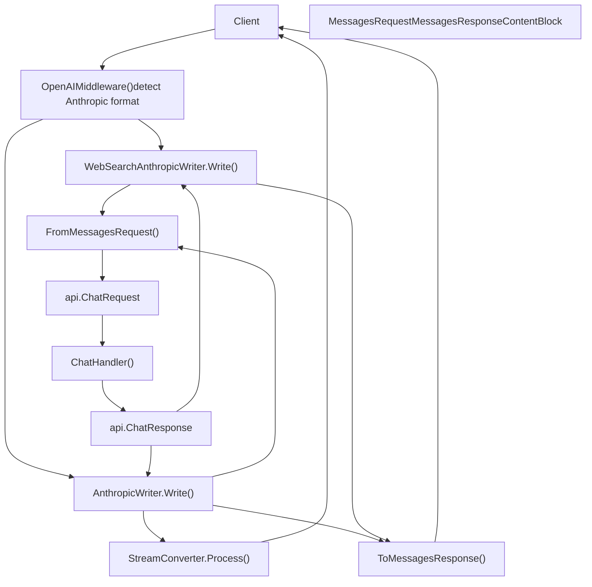
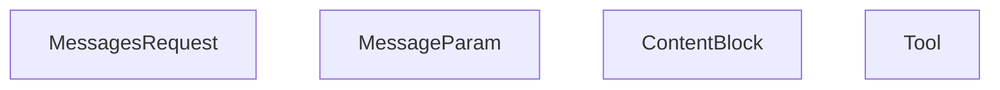
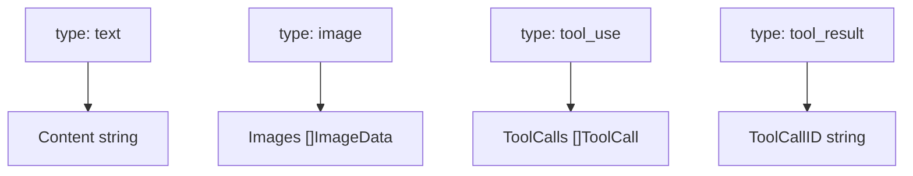
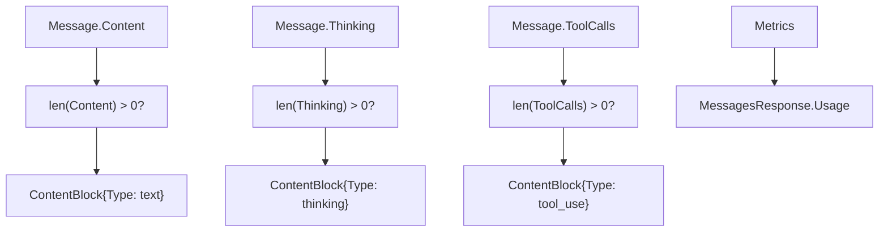
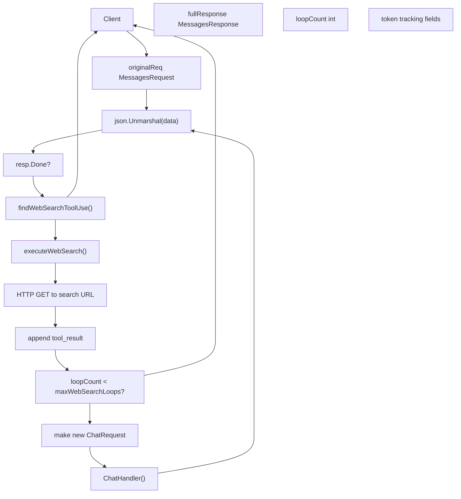
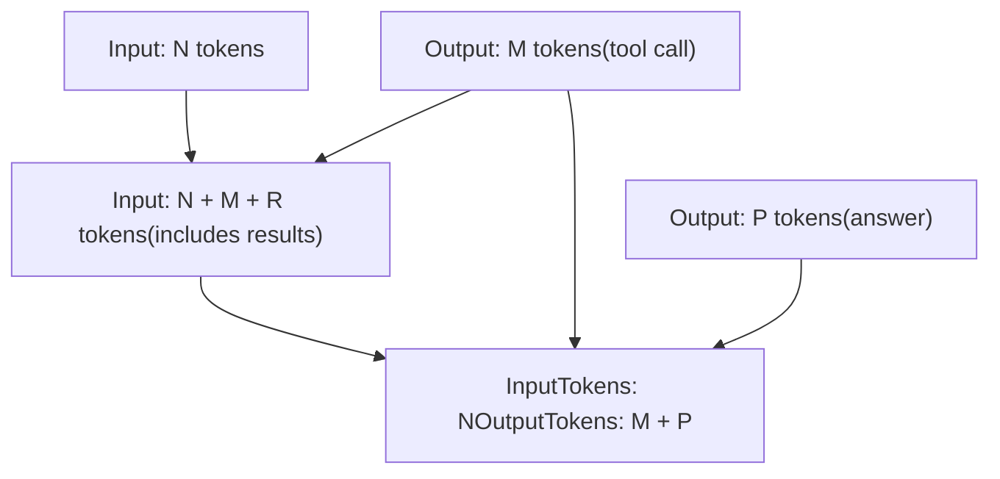

# Anthropic 兼容层

相关源文件

-   [api/client.go](https://github.com/ollama/ollama/blob/562c76d7/api/client.go)
-   [api/client\_test.go](https://github.com/ollama/ollama/blob/562c76d7/api/client_test.go)
-   [api/types.go](https://github.com/ollama/ollama/blob/562c76d7/api/types.go)
-   [api/types\_test.go](https://github.com/ollama/ollama/blob/562c76d7/api/types_test.go)
-   [api/types\_typescript\_test.go](https://github.com/ollama/ollama/blob/562c76d7/api/types_typescript_test.go)
-   [cmd/cmd.go](https://github.com/ollama/ollama/blob/562c76d7/cmd/cmd.go)
-   [middleware/openai.go](https://github.com/ollama/ollama/blob/562c76d7/middleware/openai.go)
-   [middleware/openai\_test.go](https://github.com/ollama/ollama/blob/562c76d7/middleware/openai_test.go)
-   [openai/openai.go](https://github.com/ollama/ollama/blob/562c76d7/openai/openai.go)
-   [openai/openai\_test.go](https://github.com/ollama/ollama/blob/562c76d7/openai/openai_test.go)
-   [openai/responses.go](https://github.com/ollama/ollama/blob/562c76d7/openai/responses.go)
-   [openai/responses\_test.go](https://github.com/ollama/ollama/blob/562c76d7/openai/responses_test.go)
-   [server/images.go](https://github.com/ollama/ollama/blob/562c76d7/server/images.go)
-   [server/routes.go](https://github.com/ollama/ollama/blob/562c76d7/server/routes.go)
-   [server/routes\_generate\_test.go](https://github.com/ollama/ollama/blob/562c76d7/server/routes_generate_test.go)
-   [tools/tools.go](https://github.com/ollama/ollama/blob/562c76d7/tools/tools.go)
-   [tools/tools\_test.go](https://github.com/ollama/ollama/blob/562c76d7/tools/tools_test.go)

## 概览

Anthropic Compatibility Layer 实现了 Anthropic 的 Messages API，使 Ollama 能够接收 Claude 模型格式的请求并返回 Anthropic 格式响应。这使得为 Anthropic API 构建的集成（如 Claude Code、Cline）能够与 Ollama 模型配合使用。

关于 OpenAI API 兼容性，请参阅 [OpenAI Compatibility Layer](/ollama/ollama/3.4-openai-compatibility-layer)。关于 Ollama 原生端点，请参阅 [Generation and Chat API](/ollama/ollama/3.2-generation-and-chat-api)。

该兼容层提供：

-   通过 `FromMessagesRequest()` 与 `ToMessagesResponse()` 进行请求/响应转换
-   带 Anthropic 特定事件类型（`message_start`、`content_block_delta` 等）的 SSE 流式输出
-   通过 `WebSearchAnthropicWriter` 实现多轮 Web 搜索编排
-   Anthropic 与 Ollama 约定之间的工具调用转换
-   通过 `ThinkingConfig` 提供扩展 thinking/reasoning 支持

**来源：** [anthropic/anthropic.go1-1163](https://github.com/ollama/ollama/blob/562c76d7/anthropic/anthropic.go#L1-L1163) [middleware/anthropic.go1-587](https://github.com/ollama/ollama/blob/562c76d7/middleware/anthropic.go#L1-L587)

## API 端点

Anthropic 兼容层暴露单一端点：

| Endpoint | Method | Handler Chain |
| --- | --- | --- |
| `/v1/messages` | POST | `OpenAIMiddleware()` → `ChatHandler()` |

该端点在 [server/routes.go](https://github.com/ollama/ollama/blob/562c76d7/server/routes.go) 中通过 middleware 包装注册。`OpenAIMiddleware()` 会检测 Anthropic 格式请求，并根据是否存在 web search 工具应用 `AnthropicWriter` 或 `WebSearchAnthropicWriter`。

**来源：** [server/routes.go](https://github.com/ollama/ollama/blob/562c76d7/server/routes.go) [middleware/anthropic.go23-29](https://github.com/ollama/ollama/blob/562c76d7/middleware/anthropic.go#L23-L29)

## 架构

带代码实体的请求/响应流：


**来源：** [middleware/anthropic.go23-76](https://github.com/ollama/ollama/blob/562c76d7/middleware/anthropic.go#L23-L76) [anthropic/anthropic.go499-746](https://github.com/ollama/ollama/blob/562c76d7/anthropic/anthropic.go#L499-L746) [server/routes.go](https://github.com/ollama/ollama/blob/562c76d7/server/routes.go)

## 请求转换

### MessagesRequest 结构

`anthropic/anthropic.go` 中的核心类型：


**内容块类型**（`Type` 字段）：

-   `"text"` - 普通文本内容
-   `"image"` - Base64 或 URL 图像
-   `"tool_use"` - 模型发起工具调用
-   `"tool_result"` - 工具执行结果
-   `"thinking"` - 推理轨迹
-   `"server_tool_use"` - 内部 web search 请求
-   `"web_search_tool_result"` - 检索结果

**来源：** [anthropic/anthropic.go66-81](https://github.com/ollama/ollama/blob/562c76d7/anthropic/anthropic.go#L66-L81) [anthropic/anthropic.go84-87](https://github.com/ollama/ollama/blob/562c76d7/anthropic/anthropic.go#L84-L87) [anthropic/anthropic.go89-117](https://github.com/ollama/ollama/blob/562c76d7/anthropic/anthropic.go#L89-L117)

### 转换为 ChatRequest

位于 [anthropic/anthropic.go499-746](https://github.com/ollama/ollama/blob/562c76d7/anthropic/anthropic.go#L499-L746) 的 `FromMessagesRequest()` 执行字段映射：

| Anthropic Field | Ollama Field | Implementation |
| --- | --- | --- |
| `model` | `Model` | 字符串直接复制 |
| `max_tokens` | `Options["num_predict"]` | 整数赋值 |
| `messages` | `Messages` | 由 `convertMessages()` 处理 |
| `system` | 前置 system message | `convertSystemPrompt()` 处理字符串或数组 |
| `temperature` | `Options["temperature"]` | Float64 转 Float32（默认：1.0） |
| `top_p` | `Options["top_p"]` | Float64 转 Float32（默认：1.0） |
| `top_k` | `Options["top_k"]` | 整数 |
| `stop_sequences` | `Options["stop"]` | 字符串数组 |
| `tools` | `Tools` | `convertTools()` 映射 schema |
| `thinking` | `Think` | `convertThinking()` → `api.ThinkValue` |

`convertMessages()` 中的内容块转换 [anthropic/anthropic.go625-730](https://github.com/ollama/ollama/blob/562c76d7/anthropic/anthropic.go#L625-L730)：


**来源：** [anthropic/anthropic.go499-746](https://github.com/ollama/ollama/blob/562c76d7/anthropic/anthropic.go#L499-L746) [anthropic/anthropic.go625-730](https://github.com/ollama/ollama/blob/562c76d7/anthropic/anthropic.go#L625-L730) [anthropic/anthropic.go258-314](https://github.com/ollama/ollama/blob/562c76d7/anthropic/anthropic.go#L258-L314)

### 转换流程示例

> **[Mermaid sequence]**
> *(图表结构无法解析)*

**来源：** [middleware/anthropic.go403-427](https://github.com/ollama/ollama/blob/562c76d7/middleware/anthropic.go#L403-L427) [anthropic/anthropic.go499-564](https://github.com/ollama/ollama/blob/562c76d7/anthropic/anthropic.go#L499-L564)

## 响应转换

### MessagesResponse 结构

[anthropic/anthropic.go183-192](https://github.com/ollama/ollama/blob/562c76d7/anthropic/anthropic.go#L183-L192) 中的 `MessagesResponse` 类型：

| Field | Type | Description |
| --- | --- | --- |
| `id` | string | 通过 `generateID("msg")` 生成 |
| `type` | string | 硬编码 `"message"` |
| `role` | string | 硬编码 `"assistant"` |
| `model` | string | 从 `api.ChatResponse.Model` 复制 |
| `content` | \[\]ContentBlock | 由 `ToMessagesResponse()` 构建 |
| `stop_reason` | string | 从 `DoneReason` 映射 |
| `usage` | Usage | 从 `Metrics` 转换 |

**停止原因映射**：

-   `"stop"` → `"end_turn"`
-   `"length"` → `"max_tokens"`
-   `""`（空）→ `"end_turn"`
-   存在 tool calls → `"tool_use"`

**来源：** [anthropic/anthropic.go183-192](https://github.com/ollama/ollama/blob/562c76d7/anthropic/anthropic.go#L183-L192) [anthropic/anthropic.go316-415](https://github.com/ollama/ollama/blob/562c76d7/anthropic/anthropic.go#L316-L415)

### 从 ChatResponse 转换

位于 [anthropic/anthropic.go316-415](https://github.com/ollama/ollama/blob/562c76d7/anthropic/anthropic.go#L316-L415) 的 `ToMessagesResponse()` 构建内容块：


**ID 生成**：工具调用会通过 `generateID("toolu")` 生成带随机后缀的 ID。

**来源：** [anthropic/anthropic.go316-415](https://github.com/ollama/ollama/blob/562c76d7/anthropic/anthropic.go#L316-L415) [anthropic/anthropic.go417-425](https://github.com/ollama/ollama/blob/562c76d7/anthropic/anthropic.go#L417-L425)

## 流式支持

### 事件类型

Anthropic API 使用 server-sent events（SSE）并定义了特定事件类型：

| Event Type | Purpose | Data Structure |
| --- | --- | --- |
| `message_start` | 初始化 | 含空 message 的 `MessageStartEvent` |
| `content_block_start` | 内容块开始 | 索引与内容块类型 |
| `content_block_delta` | 增量内容 | 含文本/thinking/tool 输入增量 |
| `content_block_stop` | 内容块结束 | 仅索引 |
| `message_delta` | 消息更新 | 停止原因与 usage |
| `message_stop` | 流完成 | 无数据 |

**来源：** [anthropic/anthropic.go201-255](https://github.com/ollama/ollama/blob/562c76d7/anthropic/anthropic.go#L201-L255)

### StreamConverter

位于 [anthropic/anthropic.go875-1163](https://github.com/ollama/ollama/blob/562c76d7/anthropic/anthropic.go#L875-L1163) 的 `StreamConverter` 会在分片间维护状态：

**状态字段**：

-   `messageSent bool` - 标记是否已发出 `message_start`
-   `openBlocks map[int]*openBlock` - 按索引记录活跃内容块
-   `blockIndex int` - 下一个内容块索引
-   `usage *Usage` - 累积 token 计数

**状态迁移**：

> **[Mermaid stateDiagram]**
> *(图表结构无法解析)*

位于 [anthropic/anthropic.go904-1163](https://github.com/ollama/ollama/blob/562c76d7/anthropic/anthropic.go#L904-L1163) 的 `Process()` 流程：

1.  检查 `!messageSent` → 发出 `MessageStartEvent`
2.  将当前分片与 `openBlocks` 状态比较
3.  对新内容类型发出 `ContentBlockStart`
4.  对增量内容发出 `ContentBlockDelta`
5.  当内容类型结束时发出 `ContentBlockStop`
6.  在 `Done=true` 时发出 `MessageDelta` + `MessageStop`

**来源：** [anthropic/anthropic.go875-903](https://github.com/ollama/ollama/blob/562c76d7/anthropic/anthropic.go#L875-L903) [anthropic/anthropic.go904-1163](https://github.com/ollama/ollama/blob/562c76d7/anthropic/anthropic.go#L904-L1163)

### 流式示例

通过 middleware 的实际方法调用：

> **[Mermaid sequence]**
> *(图表结构无法解析)*

**来源：** [middleware/anthropic.go47-76](https://github.com/ollama/ollama/blob/562c76d7/middleware/anthropic.go#L47-L76) [anthropic/anthropic.go904-1163](https://github.com/ollama/ollama/blob/562c76d7/anthropic/anthropic.go#L904-L1163)

## Web 搜索编排

### 概览

Web 搜索功能是一套复杂的多轮编排机制：Ollama 会拦截 `web_search_20250305` 工具调用，通过外部搜索服务执行该调用，并自动携带搜索结果再次调用模型。由此可实现模型跨多轮搜索网页并综合信息的无缝体验。

**来源：** [middleware/anthropic.go89-253](https://github.com/ollama/ollama/blob/562c76d7/middleware/anthropic.go#L89-L253)

### 架构

位于 `WebSearchAnthropicWriter` [middleware/anthropic.go89-253](https://github.com/ollama/ollama/blob/562c76d7/middleware/anthropic.go#L89-L253) 的 Web 搜索流程：


**方法引用**：

-   `Write()` - [middleware/anthropic.go162-253](https://github.com/ollama/ollama/blob/562c76d7/middleware/anthropic.go#L162-L253)
-   `findWebSearchToolUse()` - [middleware/anthropic.go255-291](https://github.com/ollama/ollama/blob/562c76d7/middleware/anthropic.go#L255-L291)
-   `executeWebSearch()` - [middleware/anthropic.go353-410](https://github.com/ollama/ollama/blob/562c76d7/middleware/anthropic.go#L353-L410)
-   `buildWebSearchToolResult()` - [middleware/anthropic.go412-514](https://github.com/ollama/ollama/blob/562c76d7/middleware/anthropic.go#L412-L514)

**来源：** [middleware/anthropic.go89-253](https://github.com/ollama/ollama/blob/562c76d7/middleware/anthropic.go#L89-L253) [middleware/anthropic.go255-514](https://github.com/ollama/ollama/blob/562c76d7/middleware/anthropic.go#L255-L514)

### Web 搜索循环流程

位于 [middleware/anthropic.go162-253](https://github.com/ollama/ollama/blob/562c76d7/middleware/anthropic.go#L162-L253) 的 `Write()` 方法循环：

> **[Mermaid sequence]**
> *(图表结构无法解析)*

**循环控制常量**：`maxWebSearchLoops = 3`，定义于 [middleware/anthropic.go116](https://github.com/ollama/ollama/blob/562c76d7/middleware/anthropic.go#L116-L116)

**来源：** [middleware/anthropic.go162-253](https://github.com/ollama/ollama/blob/562c76d7/middleware/anthropic.go#L162-L253) [middleware/anthropic.go353-410](https://github.com/ollama/ollama/blob/562c76d7/middleware/anthropic.go#L353-L410)

### Web 搜索内容块类型

Web 搜索流程使用了专用内容块：

| Block Type | Direction | Purpose |
| --- | --- | --- |
| `server_tool_use` | Model → System | 模型请求执行 Web 搜索 |
| `web_search_tool_result` | System → Model | 将搜索结果回传模型 |
| `text` with `citations` | Model → Client | 带引用来源的最终答案 |

**web\_search\_tool\_result 结构：**

```
{  "type": "web_search_tool_result",  "tool_use_id": "toolu_XXXXX",  "content": [    {      "type": "web_search_result",      "url": "https://example.com",      "title": "Page Title",      "encrypted_content": "base64_content...",      "page_age": "2024-01-15"    }  ]}
```
**来源：** [anthropic/anthropic.go89-117](https://github.com/ollama/ollama/blob/562c76d7/anthropic/anthropic.go#L89-L117) [anthropic/anthropic.go128-141](https://github.com/ollama/ollama/blob/562c76d7/anthropic/anthropic.go#L128-L141)

### 循环控制与错误处理

Web 搜索循环实现了多重保护机制：

| Safeguard | Implementation | Purpose |
| --- | --- | --- |
| Max loops | `maxWebSearchLoops = 3` | 防止无限搜索循环 |
| Search errors | `WebSearchToolResultError` | 平滑处理搜索失败 |
| Usage tracking | 累计各轮 token | 准确上报总 usage |
| Context cancellation | 检查 `ctx.Done()` | 遵循客户端取消请求 |

当达到循环上限或发生错误时，系统会返回包含累计内容块的最终响应，而不是使整个请求失败。

**来源：** [middleware/anthropic.go116](https://github.com/ollama/ollama/blob/562c76d7/middleware/anthropic.go#L116-L116) [middleware/anthropic.go353-410](https://github.com/ollama/ollama/blob/562c76d7/middleware/anthropic.go#L353-L410)

### Usage 计算

跨 Web 搜索循环的 token usage 会被精细跟踪：


系统跟踪以下指标：

-   `estimatedInputTokens`：原始请求 token（估算）
-   `loopBaseInputTok`/`loopBaseOutputTok`：每轮循环前的 token 基线
-   `observedPromptEvalCount`/`observedEvalCount`：来自响应的累计指标

最终 usage 会减去中间工具调用输出，以仅报告对用户可见的生成量。

**来源：** [middleware/anthropic.go98](https://github.com/ollama/ollama/blob/562c76d7/middleware/anthropic.go#L98-L98) [middleware/anthropic.go292-341](https://github.com/ollama/ollama/blob/562c76d7/middleware/anthropic.go#L292-L341)

## 工具支持

### 工具定义转换

位于 [anthropic/anthropic.go564-581](https://github.com/ollama/ollama/blob/562c76d7/anthropic/anthropic.go#L564-L581) 的 `convertTools()` 映射工具 schema：

| Anthropic Field | Ollama Field | Conversion |
| --- | --- | --- |
| `Tool.Type` | Not mapped | 过滤：仅 `"custom"` 透传 |
| `Tool.Name` | `Tool.Function.Name` | 字符串直接复制 |
| `Tool.Description` | `Tool.Function.Description` | 字符串直接复制 |
| `Tool.InputSchema` | `Tool.Function.Parameters` | 直接赋值 `json.RawMessage` |

**类型处理**：

-   `"custom"` → 转换为 `api.Tool`
-   `"web_search_20250305"` → 由 `WebSearchAnthropicWriter` 处理，不传给模型

**InputSchema 结构**：应为符合 `api.ToolFunctionParameters` 格式（type、properties、required 字段）的 JSON Schema 对象。

**来源：** [anthropic/anthropic.go564-581](https://github.com/ollama/ollama/blob/562c76d7/anthropic/anthropic.go#L564-L581) [anthropic/anthropic.go151-160](https://github.com/ollama/ollama/blob/562c76d7/anthropic/anthropic.go#L151-L160)

### 工具调用转换

`convertMessages()` 与 `ToMessagesResponse()` 中的双向映射：

**请求（Anthropic → Ollama）**，位于 [anthropic/anthropic.go625-730](https://github.com/ollama/ollama/blob/562c76d7/anthropic/anthropic.go#L625-L730)：

```
// ContentBlock{Type: "tool_result", ToolUseID: "toolu_123", Content: ...}msg := api.Message{    Role:       "tool",    ToolCallID: block.ToolUseID,  // Maps ToolUseID → ToolCallID    Content:    stringify(block.Content),}
```
**响应（Ollama → Anthropic）**，位于 [anthropic/anthropic.go316-415](https://github.com/ollama/ollama/blob/562c76d7/anthropic/anthropic.go#L316-L415)：

```
// api.ToolCall{Function: {Name: "fn", Arguments: {...}}}block := ContentBlock{    Type:  "tool_use",    ID:    generateID("toolu"),  // Random ID: toolu_XXXXXXXX    Name:  toolCall.Function.Name,    Input: toolCall.Function.Arguments.ToMap(),}
```
**ID 生成**：使用 `rand.Intn(100000000)` 生成 8 位后缀。

**来源：** [anthropic/anthropic.go625-730](https://github.com/ollama/ollama/blob/562c76d7/anthropic/anthropic.go#L625-L730) [anthropic/anthropic.go316-415](https://github.com/ollama/ollama/blob/562c76d7/anthropic/anthropic.go#L316-L415) [anthropic/anthropic.go417-425](https://github.com/ollama/ollama/blob/562c76d7/anthropic/anthropic.go#L417-L425)

### Tool Choice

`ToolChoice` 字段控制模型工具使用策略：

| Type | Behavior |
| --- | --- |
| `auto` | 模型自行决定是否使用工具 |
| `any` | 模型必须至少使用一个工具 |
| `tool` | 模型必须使用指定工具（按名称） |
| `none` | 模型不得使用工具 |

设置为 `true` 时，`disable_parallel_tool_use` 会强制顺序工具调用。

**来源：** [anthropic/anthropic.go162-167](https://github.com/ollama/ollama/blob/562c76d7/anthropic/anthropic.go#L162-L167)

## 扩展 Thinking 支持

### Thinking 配置

`ThinkingConfig` 类型定义于 [anthropic/anthropic.go169-173](https://github.com/ollama/ollama/blob/562c76d7/anthropic/anthropic.go#L169-L173)，转换逻辑位于 `convertThinking()`：

**输入格式**：

```
{  "thinking": {    "type": "enabled",    "budget_tokens": 10000  }}
```
**转换为 `api.ThinkValue`**，见 [anthropic/anthropic.go748-774](https://github.com/ollama/ollama/blob/562c76d7/anthropic/anthropic.go#L748-L774)：

-   `type: "enabled"` → `Think = &api.ThinkValue{Value: true}`
-   `budget_tokens` → 当前忽略（未映射到 effort 等级）
-   缺失/禁用 → `Think = nil`

`ThinkValue` 类型支持布尔（`true`/`false`）或字符串（`"high"`、`"medium"`、`"low"`）值，但 Anthropic 的 `budget_tokens` 目前尚未映射到这些级别。

**来源：** [anthropic/anthropic.go79](https://github.com/ollama/ollama/blob/562c76d7/anthropic/anthropic.go#L79-L79) [anthropic/anthropic.go169-173](https://github.com/ollama/ollama/blob/562c76d7/anthropic/anthropic.go#L169-L173) [anthropic/anthropic.go748-774](https://github.com/ollama/ollama/blob/562c76d7/anthropic/anthropic.go#L748-L774)

### Thinking 内容块

当 `api.Message.Thinking` 非空时，会创建 thinking 块：

**非流式**，位于 `ToMessagesResponse()` [anthropic/anthropic.go370-377](https://github.com/ollama/ollama/blob/562c76d7/anthropic/anthropic.go#L370-L377)：

```
if len(resp.Message.Thinking) > 0 {    content = append(content, ContentBlock{        Type:     "thinking",        Thinking: resp.Message.Thinking,    })}
```
**流式**，位于 `StreamConverter.Process()` [anthropic/anthropic.go1057-1091](https://github.com/ollama/ollama/blob/562c76d7/anthropic/anthropic.go#L1057-L1091)：

-   在 `openBlock.content` 缓冲区跟踪 thinking 内容
-   通过增量 thinking 文本发出 `ThinkingDelta` 事件
-   事件结构：`{"type": "content_block_delta", "delta": {"type": "thinking_delta", "thinking": "..."}}`

`thinking_delta` 类型定义于 [anthropic/anthropic.go222-229](https://github.com/ollama/ollama/blob/562c76d7/anthropic/anthropic.go#L222-L229)，属于 `Delta` 判别联合的一部分。

**来源：** [anthropic/anthropic.go89-117](https://github.com/ollama/ollama/blob/562c76d7/anthropic/anthropic.go#L89-L117) [anthropic/anthropic.go222-229](https://github.com/ollama/ollama/blob/562c76d7/anthropic/anthropic.go#L222-L229) [anthropic/anthropic.go370-377](https://github.com/ollama/ollama/blob/562c76d7/anthropic/anthropic.go#L370-L377) [anthropic/anthropic.go1057-1091](https://github.com/ollama/ollama/blob/562c76d7/anthropic/anthropic.go#L1057-L1091)

## 集成示例

Anthropic 兼容层支持多种集成方式：

**环境变量配置**：

-   `ANTHROPIC_BASE_URL` → 指向 Ollama 服务器（如 `http://localhost:11434`）
-   `ANTHROPIC_API_KEY` → Ollama 场景下非必需
-   模型选择 → 通过 `MessagesRequest` 的 `model` 字段

**集成模式**：

1.  **直接 HTTP 客户端**：向 `/v1/messages` POST `MessagesRequest` JSON
2.  **Anthropic SDK 客户端**：将 base URL 配置为 Ollama 服务器
3.  **IDE 扩展**：Claude Code、Cline 配置 Anthropic SDK 端点

**响应兼容性**：所有响应都遵循 Anthropic 的事件流或 JSON 响应格式，从而确保透明集成。

**来源：** [middleware/anthropic.go23-76](https://github.com/ollama/ollama/blob/562c76d7/middleware/anthropic.go#L23-L76) [anthropic/anthropic.go499-746](https://github.com/ollama/ollama/blob/562c76d7/anthropic/anthropic.go#L499-L746)

### 模型别名配置

Claude Code 支持模型别名，可将不同请求类型路由到不同模型：

| Alias | Environment Variable | Purpose |
| --- | --- | --- |
| `primary` | `ANTHROPIC_DEFAULT_OPUS_MODEL`
`ANTHROPIC_DEFAULT_SONNET_MODEL`
`CLAUDE_CODE_SUBAGENT_MODEL` | 复杂任务的主模型 |
| `fast` | `ANTHROPIC_DEFAULT_HAIKU_MODEL` | 子代理任务的快速模型（仅云端） |

该别名系统在 Ollama 服务器端通过前缀匹配，将 `claude-sonnet-*` 与 `claude-haiku-*` 请求路由到已配置模型。

**来源：** [cmd/config/claude.go74-92](https://github.com/ollama/ollama/blob/562c76d7/cmd/config/claude.go#L74-L92) [cmd/config/claude.go94-151](https://github.com/ollama/ollama/blob/562c76d7/cmd/config/claude.go#L94-L151) [cmd/config/claude.go153-192](https://github.com/ollama/ollama/blob/562c76d7/cmd/config/claude.go#L153-L192)

## 错误处理

`NewAnthropicError()` 中的错误转换，见 [anthropic/anthropic.go26-62](https://github.com/ollama/ollama/blob/562c76d7/anthropic/anthropic.go#L26-L62)：

**错误响应结构**：

```
type ErrorResponse struct {    Type      string `json:"type"`      // "error"    Error     Error  `json:"error"`    RequestID string `json:"request_id,omitempty"`} type Error struct {    Type    string `json:"type"`    Message string `json:"message"`}
```
**状态码到错误类型映射**：

| HTTP Status | `Error.Type` |
| --- | --- |
| 400 | `"invalid_request_error"` |
| 401 | `"authentication_error"` |
| 403 | `"permission_error"` |
| 404 | `"not_found_error"` |
| 429 | `"rate_limit_error"` |
| 503, 529 | `"overloaded_error"` |
| Other | `"api_error"` |

**中间件集成**：位于 [middleware/anthropic.go31-46](https://github.com/ollama/ollama/blob/562c76d7/middleware/anthropic.go#L31-L46) 的 `AnthropicWriter.writeError()` 会捕获 `api.StatusError`，并通过 `NewAnthropicError()` 转换。

**来源：** [anthropic/anthropic.go26-62](https://github.com/ollama/ollama/blob/562c76d7/anthropic/anthropic.go#L26-L62) [middleware/anthropic.go31-46](https://github.com/ollama/ollama/blob/562c76d7/middleware/anthropic.go#L31-L46)

## 实现文件

| File | Purpose |
| --- | --- |
| [anthropic/anthropic.go](https://github.com/ollama/ollama/blob/562c76d7/anthropic/anthropic.go) | 核心类型、转换函数、流式逻辑 |
| [middleware/anthropic.go](https://github.com/ollama/ollama/blob/562c76d7/middleware/anthropic.go) | 请求/响应转换的 HTTP middleware |
| [anthropic/anthropic\_test.go](https://github.com/ollama/ollama/blob/562c76d7/anthropic/anthropic_test.go) | 转换与流式测试 |
| [middleware/anthropic\_test.go](https://github.com/ollama/ollama/blob/562c76d7/middleware/anthropic_test.go) | 集成测试（若存在） |
| [cmd/config/claude.go](https://github.com/ollama/ollama/blob/562c76d7/cmd/config/claude.go) | Claude Code 集成配置 |

**来源：** [anthropic/anthropic.go1-1163](https://github.com/ollama/ollama/blob/562c76d7/anthropic/anthropic.go#L1-L1163) [middleware/anthropic.go1-587](https://github.com/ollama/ollama/blob/562c76d7/middleware/anthropic.go#L1-L587)
