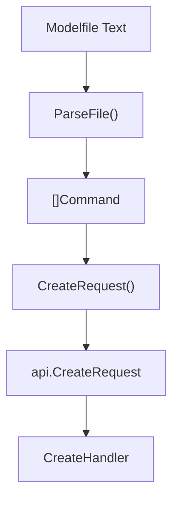
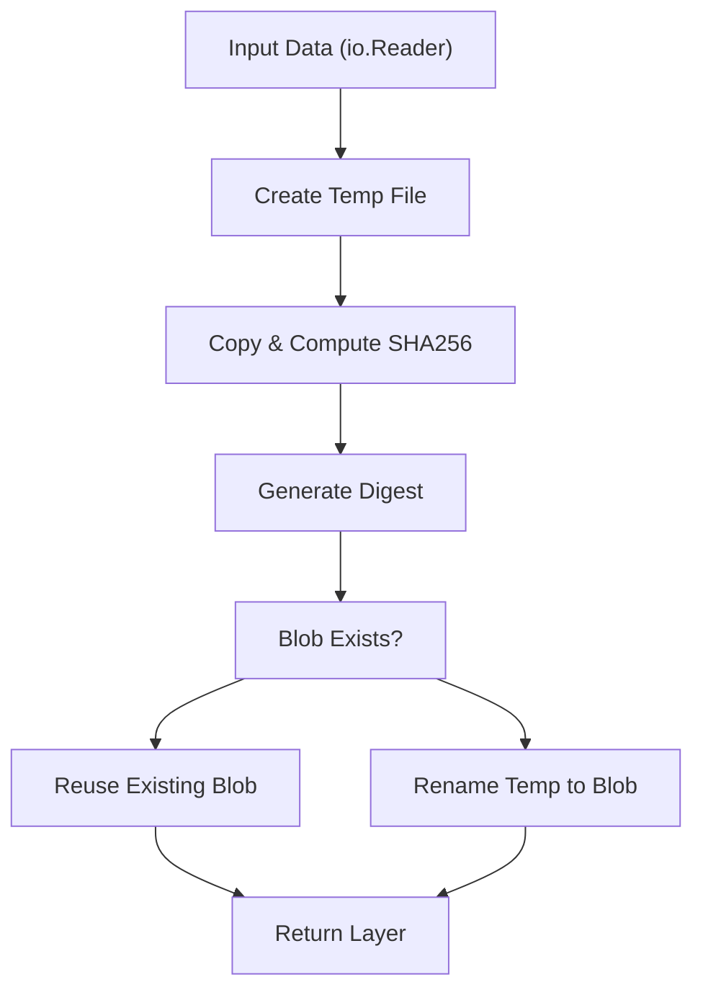
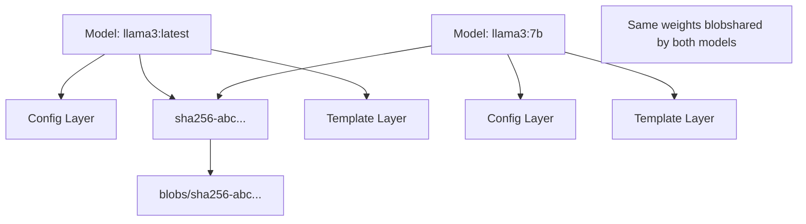
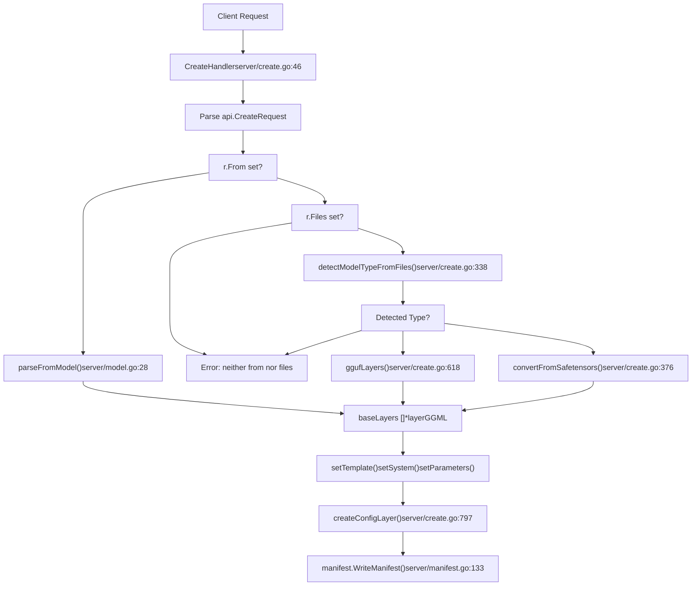
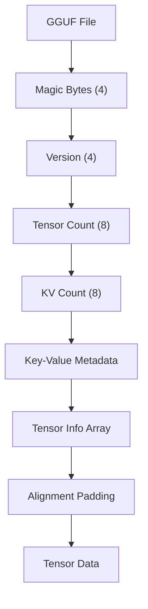
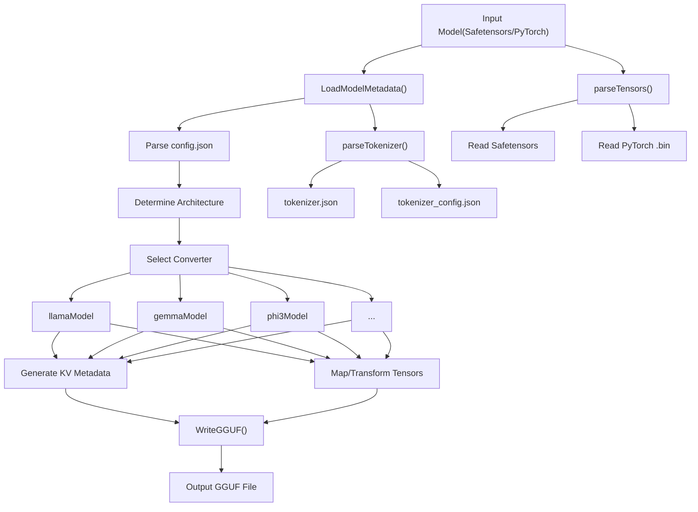
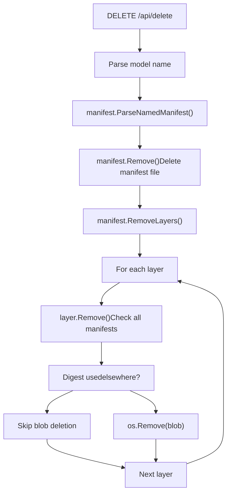

# 模型管理

相关源文件

-   [cmd/cmd\_test.go](https://github.com/ollama/ollama/blob/562c76d7/cmd/cmd_test.go)
-   [convert/convert.go](https://github.com/ollama/ollama/blob/562c76d7/convert/convert.go)
-   [fs/ggml/ggml.go](https://github.com/ollama/ollama/blob/562c76d7/fs/ggml/ggml.go)
-   [fs/ggml/ggml\_test.go](https://github.com/ollama/ollama/blob/562c76d7/fs/ggml/ggml_test.go)
-   [model/models/models.go](https://github.com/ollama/ollama/blob/562c76d7/model/models/models.go)
-   [model/parsers/parsers.go](https://github.com/ollama/ollama/blob/562c76d7/model/parsers/parsers.go)
-   [model/parsers/parsers\_test.go](https://github.com/ollama/ollama/blob/562c76d7/model/parsers/parsers_test.go)
-   [model/renderers/glmocr.go](https://github.com/ollama/ollama/blob/562c76d7/model/renderers/glmocr.go)
-   [model/renderers/glmocr\_test.go](https://github.com/ollama/ollama/blob/562c76d7/model/renderers/glmocr_test.go)
-   [model/renderers/renderer.go](https://github.com/ollama/ollama/blob/562c76d7/model/renderers/renderer.go)
-   [server/create.go](https://github.com/ollama/ollama/blob/562c76d7/server/create.go)
-   [server/model.go](https://github.com/ollama/ollama/blob/562c76d7/server/model.go)
-   [server/routes\_create\_test.go](https://github.com/ollama/ollama/blob/562c76d7/server/routes_create_test.go)
-   [server/routes\_delete\_test.go](https://github.com/ollama/ollama/blob/562c76d7/server/routes_delete_test.go)
-   [server/routes\_list\_test.go](https://github.com/ollama/ollama/blob/562c76d7/server/routes_list_test.go)
-   [server/routes\_test.go](https://github.com/ollama/ollama/blob/562c76d7/server/routes_test.go)

Ollama 中的模型管理负责模型的定义、存储、转换和组织方式。这包括：

-   **模型定义** - Modelfile 定义模型配置、参数和行为
-   **存储** - 采用 manifest/layer 架构的内容寻址 blob 存储
-   **转换** - 从 Safetensors、PyTorch 和 GGUF 格式导入
-   **注册表** - 与远程注册表之间推送/拉取模型

该系统采用两层架构：manifest 描述模型组成，blob 存储实际数据。此设计通过去重实现高效存储——多个模型可以共享相同的基础权重。

**相关文档：**

-   [Modelfiles（4.1）](/ollama/ollama/4.1-modelfiles) - Modelfile 语法与指令
-   [模型注册表与层（4.2）](/ollama/ollama/4.2-model-registry-and-layers) - Manifest/blob 存储系统
-   [模型转换与导入（4.3）](/ollama/ollama/4.3-model-conversion-and-import) - 从外部格式转换
-   [模型文件格式（4.4）](/ollama/ollama/4.4-model-file-formats) - GGUF 格式细节
-   [Blob 传输与身份验证（4.5）](/ollama/ollama/4.5-blob-transfer-and-authentication) - 注册表推送/拉取操作
-   [LlamaServer 与 Runner 实现（5.2）](/ollama/ollama/5.2-llamaserver-and-runner-implementation) - 运行时模型加载与执行

## 使用 Modelfile 进行模型定义

模型通过 **Modelfile** 创建，Modelfile 定义基础模型、参数、模板和行为。Modelfile 类似 Dockerfile——它指定如何构建模型。

**基础 Modelfile 结构：**

```
FROM llama3.2
PARAMETER temperature 0.8
PARAMETER num_ctx 4096
SYSTEM You are a helpful assistant.
TEMPLATE """{{ .System }} {{ .Prompt }}"""
```
**Modelfile 指令：**

| 指令 | 用途 | 示例 |
| --- | --- | --- |
| `FROM` | 指定基础模型或文件 | `FROM llama3.2` |
| `PARAMETER` | 设置推理参数 | `PARAMETER temperature 0.8` |
| `TEMPLATE` | 定义聊天模板 | `TEMPLATE """..."""` |
| `SYSTEM` | 设置系统提示词 | `SYSTEM You are...` |
| `ADAPTER` | 添加 LoRA 适配器 | `ADAPTER ./adapter.gguf` |
| `LICENSE` | 指定许可证 | `LICENSE MIT` |
| `MESSAGE` | 预填充会话 | `MESSAGE user Hello` |

[parser/parser.go377-506](https://github.com/ollama/ollama/blob/562c76d7/parser/parser.go#L377-L506) 中的解析器会读取 Modelfile 并将其转换为 `api.CreateRequest` 结构。完整 Modelfile 语法请参见 [Modelfiles（4.1）](/ollama/ollama/4.1-modelfiles)。

**Modelfile 解析流程：**


来源：[parser/parser.go377-506](https://github.com/ollama/ollama/blob/562c76d7/parser/parser.go#L377-L506) [parser/parser.go55-154](https://github.com/ollama/ollama/blob/562c76d7/parser/parser.go#L55-L154)

## 存储架构

Ollama 使用由 **manifest** 和 **blob** 组成的两层存储架构，类似 Docker 等容器镜像系统。

### 目录结构

```
$OLLAMA_MODELS/
├── manifests/
│   └── {host}/{namespace}/{model}/{tag}
└── blobs/
    └── sha256-{digest}
```
`manifests` 目录包含按全限定模型名组织的 JSON manifest 文件。`blobs` 目录存储由 SHA256 摘要引用的内容寻址二进制对象。有关详细存储架构，请参见 [模型注册表与层（4.2）](/ollama/ollama/4.2-model-registry-and-layers)。

来源：[server/manifest.go1-179](https://github.com/ollama/ollama/blob/562c76d7/server/manifest.go#L1-L179)

### Manifest 格式

一个 manifest 描述完整模型，包括其配置和所有组件层：

```
type Manifest struct {    SchemaVersion int     `json:"schemaVersion"`    MediaType     string  `json:"mediaType"`    Config        Layer   `json:"config"`    Layers        []Layer `json:"layers"`}
```
`Config` 层包含模型元数据（见 [types/model/config.go1-34](https://github.com/ollama/ollama/blob/562c76d7/types/model/config.go#L1-L34)），而 `Layers` 引用实际的模型权重、模板、参数及其他组件。

**层媒体类型：**

| 媒体类型 | 内容 | 创建来源 |
| --- | --- | --- |
| `application/vnd.ollama.image.model` | 模型权重（GGUF） | GGUF 导入或转换 |
| `application/vnd.ollama.image.projector` | 视觉投影器权重 | 多模态模型 |
| `application/vnd.ollama.image.adapter` | LoRA 适配器权重 | `ADAPTER` 指令 |
| `application/vnd.ollama.image.template` | 聊天模板 | `TEMPLATE` 指令 |
| `application/vnd.ollama.image.params` | 模型参数（JSON） | `PARAMETER` 指令 |
| `application/vnd.ollama.image.system` | 系统提示词 | `SYSTEM` 指令 |
| `application/vnd.ollama.image.license` | 许可证文本 | `LICENSE` 指令 |
| `application/vnd.ollama.image.messages` | 预填充会话 | `MESSAGE` 指令 |
| `application/vnd.docker.container.image.v1+json` | 配置元数据 | 所有模型 |

Modelfile 指令会被 [server/create.go468-530](https://github.com/ollama/ollama/blob/562c76d7/server/create.go#L468-L530) 转换为 manifest 层

来源：[server/manifest.go17-26](https://github.com/ollama/ollama/blob/562c76d7/server/manifest.go#L17-L26) [server/create.go649-655](https://github.com/ollama/ollama/blob/562c76d7/server/create.go#L649-L655) [server/create.go468-530](https://github.com/ollama/ollama/blob/562c76d7/server/create.go#L468-L530)

### 层与 Blob 系统

每一层都是存储在 `blobs` 目录中的内容寻址对象：

```
type Layer struct {    MediaType string `json:"mediaType"`    Digest    string `json:"digest"`    Size      int64  `json:"size"`    From      string `json:"from,omitempty"`}
```
层的创建方式是计算其内容的 SHA256 摘要，并将其存储为 `blobs/sha256-{digest}`。这使得去重成为可能——如果两个模型共享相同权重（例如相同基础模型），它们会引用同一个 blob。

**层创建过程：**


来源：[server/layer.go19-65](https://github.com/ollama/ollama/blob/562c76d7/server/layer.go#L19-L65)

### Manifest 操作

**ParseNamedManifest** 读取并验证 manifest：

```
func ParseNamedManifest(n model.Name) (*Manifest, error)
```
该函数会：

1.  根据模型名解析 manifest 路径
2.  打开并解析 JSON manifest
3.  计算 manifest 摘要以进行完整性校验
4.  返回带元数据的 `Manifest` 结构

**WriteManifest** 以原子方式创建或更新 manifest：

```
func WriteManifest(name model.Name, config Layer, layers []Layer) error
```
来源：[server/manifest.go63-124](https://github.com/ollama/ollama/blob/562c76d7/server/manifest.go#L63-L124)

### 内容寻址与去重


当多个模型引用同一个 blob（以摘要标识）时，磁盘上只存储一份副本。`Layer.Remove()` 中的层删除逻辑会在删除 blob 前检查所有 manifest，以防出现悬空引用。

来源：[server/layer.go104-130](https://github.com/ollama/ollama/blob/562c76d7/server/layer.go#L104-L130)

## 模型创建工作流

模型创建由 [server/create.go46-259](https://github.com/ollama/ollama/blob/562c76d7/server/create.go#L46-L259) 中的 `CreateHandler` 处理。该处理器会处理从 Modelfile 生成的 `api.CreateRequest` 结构。

### 创建来源

Ollama 支持三种主要输入来源：

1.  **来自现有模型** - `FROM modelname` - 复用现有 Ollama 模型
2.  **来自 GGUF 文件** - `FROM /path/to/model.gguf` - 导入 GGUF 文件
3.  **来自 Safetensors/PyTorch** - `FROM /path/to/model/` - 转换 HuggingFace 格式

有关详细转换过程，请参见 [模型转换与导入（4.3）](/ollama/ollama/4.3-model-conversion-and-import)。

**模型创建流程：**


来源：[server/create.go46-259](https://github.com/ollama/ollama/blob/562c76d7/server/create.go#L46-L259) [server/create.go306-374](https://github.com/ollama/ollama/blob/562c76d7/server/create.go#L306-L374) [server/model.go28-77](https://github.com/ollama/ollama/blob/562c76d7/server/model.go#L28-L77)

### 来自现有模型

当使用 `From: "model-name"` 创建模型时，Ollama 会：

1.  **解析源模型 manifest** - [server/model.go27-76](https://github.com/ollama/ollama/blob/562c76d7/server/model.go#L27-L76)
2.  **将所有层加载为 layerGGML** - 每层可能包含解码后的 GGML 元数据
3.  **检测聊天模板** - 从 GGUF 元数据中自动检测并应用聊天模板
4.  **继承配置** - 从基础模型配置复制 `Renderer`、`Parser` 和 `Requires`

```
func parseFromModel(ctx context.Context, name model.Name,                     fn func(api.ProgressResponse)) (layers []*layerGGML, err error)
```
来源：[server/model.go27-76](https://github.com/ollama/ollama/blob/562c76d7/server/model.go#L27-L76) [server/create.go99-148](https://github.com/ollama/ollama/blob/562c76d7/server/create.go#L99-L148)

### 来自 GGUF 文件

[server/create.go618-666](https://github.com/ollama/ollama/blob/562c76d7/server/create.go#L618-L666) 中的 `ggufLayers()` 函数处理 GGUF 文件：

1.  通过 `manifest.BlobsPath(digest)` 打开 blob
2.  使用 `ggml.DetectContentType()` 验证 GGUF 魔数
3.  使用 `ggml.Decode()` 解码 GGUF 元数据
4.  根据 GGUF KV 数据确定层媒体类型
5.  使用 `detectChatTemplate()` 自动检测聊天模板

**媒体类型检测逻辑：**

```
// From server/create.go:649-655if kv["general.type"] == "adapter" {    mediaType = "application/vnd.ollama.image.adapter"} else if kv.BlockCount() == 0 && kv.VisionBlockCount() > 0 {    mediaType = "application/vnd.ollama.image.projector"} else {    mediaType = "application/vnd.ollama.image.model"}
```
GGUF 格式细节见 [模型文件格式（4.4）](/ollama/ollama/4.4-model-file-formats)。

来源：[server/create.go618-666](https://github.com/ollama/ollama/blob/562c76d7/server/create.go#L618-L666) [fs/ggml/ggml.go497-568](https://github.com/ollama/ollama/blob/562c76d7/fs/ggml/ggml.go#L497-L568)

### 来自 Safetensors/PyTorch

[server/create.go376-457](https://github.com/ollama/ollama/blob/562c76d7/server/create.go#L376-L457) 中的 `convertFromSafetensors()` 函数用于转换 HuggingFace 模型：

**转换顺序：**

> **[Mermaid 时序图]**
> *(图表结构无法解析)*

**转换步骤：**

1.  创建临时目录并将 blob 链接为文件（保持目录结构）
2.  从 `config.json` 加载元数据——用于确定架构
3.  从 `tokenizer.json` 或 `tokenizer.model` 解析分词器
4.  从 `.safetensors` 或 `.bin` 文件提取张量
5.  通过架构特定转换写入 GGUF 文件
6.  创建层并存储为 blob

支持的架构包括 Llama、Mistral、Gemma、Phi3、Qwen2 等。完整转换细节见 [模型转换与导入（4.3）](/ollama/ollama/4.3-model-conversion-and-import)。

来源：[server/create.go376-457](https://github.com/ollama/ollama/blob/562c76d7/server/create.go#L376-L457) [convert/convert.go255-372](https://github.com/ollama/ollama/blob/562c76d7/convert/convert.go#L255-L372)

### 量化

[server/create.go566-616](https://github.com/ollama/ollama/blob/562c76d7/server/create.go#L566-L616) 中的 `quantizeLayer()` 函数对 F16/F32 模型进行量化：

```
func quantizeLayer(layer *layerGGML, quantizeType string,                    fn func(resp api.ProgressResponse)) (*layerGGML, error)
```
**量化过程：**

-   打开源 GGUF blob
-   调用原生 `quantize()` 函数（与 llama.cpp 交互）
-   将量化后的 GGUF 写入新的临时文件
-   使用量化后的权重创建新的 blob 层
-   返回更新了摘要的新层

**支持的量化类型：**

-   `Q4_0`, `Q4_1` - 4 位量化
-   `Q5_0`, `Q5_1` - 5 位量化
-   `Q8_0` - 8 位量化
-   `Q4_K_M`, `Q5_K_M`, `Q6_K` - K-quant 变体（质量更好）
-   `Q2_K`, `Q3_K_S`, `Q3_K_M` - 激进量化

量化可实现 4-8 倍压缩，同时仅有极小质量损失。只有 F16/F32 模型可以量化。

来源：[server/create.go566-616](https://github.com/ollama/ollama/blob/562c76d7/server/create.go#L566-L616) [server/create.go471-488](https://github.com/ollama/ollama/blob/562c76d7/server/create.go#L471-L488)

### 应用 Modelfile 指令

Modelfile 指令通过 [server/create.go683-795](https://github.com/ollama/ollama/blob/562c76d7/server/create.go#L683-L795) 中这些函数应用到层：

| 函数 | Modelfile 指令 | 层类型 |
| --- | --- | --- |
| `setTemplate()` | `TEMPLATE` | `application/vnd.ollama.image.template` |
| `setSystem()` | `SYSTEM` | `application/vnd.ollama.image.system` |
| `setLicense()` | `LICENSE` | `application/vnd.ollama.image.license` |
| `setParameters()` | `PARAMETER` | `application/vnd.ollama.image.params` |
| `setMessages()` | `MESSAGE` | `application/vnd.ollama.image.messages` |

**层修改模式：**

```
func setTemplate(layers []*layerGGML, template string) ([]*layerGGML, error) {    layers = removeLayer(layers, "application/vnd.ollama.image.template")    layer, err := manifest.NewLayer(strings.NewReader(template), mediaType)    return append(layers, &layerGGML{layer, nil}), nil}
```
每个函数都会移除该类型的已有层，创建新的 blob，并将其追加。参数合并会保留基础模型参数，同时用新值覆盖。

来源：[server/create.go683-795](https://github.com/ollama/ollama/blob/562c76d7/server/create.go#L683-L795)

## GGUF 文件格式

GGUF（GGML Universal File）是 Ollama 中模型权重的原生格式。

### 格式结构


**文件结构：**

1.  **头部** - 魔数 `GGUF`（小端序 0x46554747）
2.  **版本** - 当前为版本 3
3.  **张量数量** - 文件中的张量数
4.  **KV 数量** - 元数据键值对数量
5.  **KV 元数据** - 架构、超参数、分词器数据
6.  **张量描述符** - 每个张量的名称、类型、形状、偏移
7.  **张量数据** - 原始张量字节（按 32 字节对齐）

来源：[fs/ggml/ggml.go497-568](https://github.com/ollama/ollama/blob/562c76d7/fs/ggml/ggml.go#L497-L568)

### 键值元数据

KV 区域将模型元数据存储为带类型的键值对：

```
type KV map[string]any
```
**常见 KV 键：**

| 键模式 | 类型 | 用途 |
| --- | --- | --- |
| `general.architecture` | string | 模型架构（llama、gemma 等） |
| `general.file_type` | uint32 | 量化类型 |
| `general.parameter_count` | uint64 | 参数总量 |
| `{arch}.block_count` | uint32 | Transformer block 数量 |
| `{arch}.embedding_length` | uint32 | 嵌入维度 |
| `{arch}.attention.head_count` | uint32 | 注意力头数量 |
| `{arch}.context_length` | uint32 | 最大上下文长度 |
| `tokenizer.ggml.tokens` | \[\]string | token 词表 |
| `tokenizer.ggml.scores` | \[\]float32 | token 分数 |
| `tokenizer.chat_template` | string | 聊天模板字符串 |

**KV 访问器方法：**

`KV` 类型提供带架构前缀处理的类型化访问器：

```
func (kv KV) Architecture() stringfunc (kv KV) BlockCount() uint64func (kv KV) EmbeddingLength() uint64func (kv KV) HeadCount() []uint64func (kv KV) ContextLength() uint64
```
这些方法会自动为键添加架构名前缀（例如，`"block_count"` → `"llama.block_count"`）。

来源：[fs/ggml/ggml.go32-298](https://github.com/ollama/ollama/blob/562c76d7/fs/ggml/ggml.go#L32-L298)

### 张量格式

GGUF 中的每个张量包含：

```
type Tensor struct {    Name   string   // e.g., "blk.0.attn_q.weight"    Kind   uint32   // Data type (F32, F16, Q4_0, etc)    Shape  []uint64 // Dimensions (reversed in GGUF)    Offset uint64   // Byte offset in data section}
```
**量化类型：**

| Kind | 名称 | 描述 |
| --- | --- | --- |
| 0 | F32 | 32 位浮点 |
| 1 | F16 | 16 位浮点 |
| 2 | Q4\_0 | 4 位量化（32 元素块） |
| 3 | Q4\_1 | 带 scale/min 的 4 位量化 |
| 6 | Q5\_0 | 5 位量化 |
| 7 | Q5\_1 | 带 scale/min 的 5 位量化 |
| 8 | Q8\_0 | 8 位量化 |
| 10 | Q2\_K | 2 位 K-quant（256 元素块） |
| 11 | Q3\_K | 3 位 K-quant |
| 12 | Q4\_K | 4 位 K-quant |
| 13 | Q5\_K | 5 位 K-quant |
| 14 | Q6\_K | 6 位 K-quant |

K-quant 格式使用 256 元素的超块，并采用更复杂的量化方案。

来源：[fs/ggml/ggml.go353-486](https://github.com/ollama/ollama/blob/562c76d7/fs/ggml/ggml.go#L353-L486)

### 解码 GGUF

读取 GGUF 文件时：

```
func Decode(rs io.ReadSeeker, maxArraySize int) (*GGML, error)
```
该函数会：

1.  **验证魔数** - 检查 GGUF 签名
2.  **确定字节序** - 小端或大端
3.  **读取元数据** - 解析 KV 键值对
4.  **解析张量信息** - 提取张量描述符
5.  **记录数据偏移** - 存储张量数据起始位置

`maxArraySize` 参数用于控制是收集完整数组值，还是仅收集其大小（用于大词表）。

来源：[fs/ggml/ggml.go530-568](https://github.com/ollama/ollama/blob/562c76d7/fs/ggml/ggml.go#L530-L568)

### 模型架构检测

GGUF 文件通过 KV 元数据标识其架构：

```
func (kv KV) Architecture() string {    return kv.String("general.architecture", "unknown")}
```
架构决定了：

-   使用哪种推理引擎（llama.cpp 或 Ollama 自定义引擎）
-   内存布局与注意力机制
-   分词器格式与特殊 token

某些架构需要 Ollama 自定义引擎：

```
func (kv KV) OllamaEngineRequired() bool {    return slices.Contains([]string{        "bert", "deepseek2", "gemma3", "llama4", "mllama",        "qwen3", "qwen3vl", // ...    }, kv.Architecture())}
```
来源：[fs/ggml/ggml.go34-273](https://github.com/ollama/ollama/blob/562c76d7/fs/ggml/ggml.go#L34-L273)

## 模型转换系统

### 转换架构


来源：[convert/convert.go255-372](https://github.com/ollama/ollama/blob/562c76d7/convert/convert.go#L255-L372)

### ModelConverter 接口

每种架构都会实现 `ModelConverter` 接口：

```
type ModelConverter interface {    KV(*Tokenizer) KV    Tensors([]Tensor) []*ggml.Tensor    Replacements() []string    specialTokenTypes() []string}
```
**接口方法：**

-   **KV()** - 从模型配置生成 GGUF 元数据
-   **Tensors()** - 将输入张量映射为带转换的 GGUF 张量
-   **Replacements()** - 提供用于张量名称映射的字符串对
-   **specialTokenTypes()** - 列出要提取的特殊 token 类型

来源：[convert/convert.go185-201](https://github.com/ollama/ollama/blob/562c76d7/convert/convert.go#L185-L201)

### 张量解析

张量通过特定格式读取器从源文件中解析：

```
func parseTensors(fsys fs.FS, replacer *strings.Replacer) ([]Tensor, error)
```
**支持的格式：**

| 模式 | 格式 | 解析器 |
| --- | --- | --- |
| `*.safetensors` | Safetensors | `parseSafetensors()` |
| `pytorch_model-*-of-*.bin` | PyTorch 分片 | `parseTorch()` |
| `pytorch_model.bin` | PyTorch 单文件 | `parseTorch()` |
| `consolidated.*.pth` | PyTorch 合并文件 | `parseTorch()` |

**Tensor 接口：**

```
type Tensor interface {    Name() string    Shape() []uint64    Kind() uint32    SetRepacker(Repacker)    WriteTo(io.Writer) (int64, error)    Clone() Tensor}
```
每个张量实现都会处理其源格式读取，并在写入时转换为 F32/F16。

来源：[convert/reader.go10-94](https://github.com/ollama/ollama/blob/562c76d7/convert/reader.go#L10-L94)

### Safetensors 读取器

Safetensors 文件使用 JSON 头部存储张量：

```
type safetensorMetadata struct {    Type    string   `json:"dtype"`    Shape   []uint64 `json:"shape"`    Offsets []int64  `json:"data_offsets"`}
```
**读取过程：**

1.  **读取头部大小** - 前 8 字节（int64）
2.  **解析 JSON 元数据** - 将张量名映射到元数据
3.  **创建张量对象** - 每个对象含文件偏移和 dtype
4.  **应用名称替换** - 将 Hugging Face 名称映射为 GGUF 名称

**数据类型转换：**

| Safetensors 类型 | 转换 | GGUF 类型 |
| --- | --- | --- |
| F32 | 直接复制 | F32 |
| F16 | 直接复制 | F16 |
| BF16 | 解码为 F32 → 编码为目标类型 | F32/F16/BF16 |

来源：[convert/reader\_safetensors.go26-209](https://github.com/ollama/ollama/blob/562c76d7/convert/reader_safetensors.go#L26-L209)

### 分词器转换

分词器解析会提取词表和特殊 token：

```
type Tokenizer struct {    *Vocabulary    SpecialVocabulary []*SpecialVocabulary    Merges            []string    Pre               string    Template          string}
```
**解析来源：**

1.  **tokenizer.json** - 主来源（Hugging Face 格式）
    -   词表和分数
    -   BPE merges
    -   新增 token
2.  **tokenizer\_config.json** - 配置
    -   聊天模板
    -   特殊 token 定义
3.  **tokenizer.model** - SentencePiece 格式（回退）
4.  **generation\_config.json** - 特殊 token ID

**预分词器检测：**

转换器通过对正则表达式模式进行哈希来检测预分词策略：

| Hash 摘要 | 预分词器 |
| --- | --- |
| `d98f963...` | llama-bpe |
| `03df5c5...` | deepseek-llm |
| `21cde97...` | deepseek-coder |
| `1ff7f41...` | qwen2 |

来源：[convert/tokenizer.go36-203](https://github.com/ollama/ollama/blob/562c76d7/convert/tokenizer.go#L36-L203)

### 架构特定转换器

每个架构转换器会处理模型特定转换：

**Llama 转换器** - [convert/convert\_llama.go1-185](https://github.com/ollama/ollama/blob/562c76d7/convert/convert_llama.go#L1-L185)

-   用于长上下文的 RoPE 频率缩放
-   用于 GQA 注意力的 Q/K 张量重打包
-   Rope factors 张量生成

**Gemma 转换器** - [convert/convert\_gemma.go1-94](https://github.com/ollama/ollama/blob/562c76d7/convert/convert_gemma.go#L1-L94)

-   嵌入归一化（乘以 sqrt(hidden\_size)）
-   特殊 token 配置

**Phi3 转换器** - [convert/convert\_phi3.go1-119](https://github.com/ollama/ollama/blob/562c76d7/convert/convert_phi3.go#L1-L119)

-   SuRope/LongRope 缩放因子
-   滑动窗口注意力参数

**Mixtral 转换器** - [convert/convert\_mixtral.go1-51](https://github.com/ollama/ollama/blob/562c76d7/convert/convert_mixtral.go#L1-L51)

-   专家张量合并（合并每个专家的张量）
-   专家数量与路由配置

来源：[convert/convert.go270-316](https://github.com/ollama/ollama/blob/562c76d7/convert/convert.go#L270-L316)

### 适配器转换

LoRA 适配器遵循类似但不同的转换路径：

```
func ConvertAdapter(fsys fs.FS, f *os.File, baseKV ofs.Config) error
```
**适配器流程：**

1.  **解析 adapter\_config.json** - 获取 LoRA rank 和 alpha
2.  **确定基础架构** - 从基础模型 KV 读取
3.  **选择适配器转换器** - 架构特定的适配器处理
4.  **解析 LoRA 张量** - 提取 `lora_a` 和 `lora_b` 权重
5.  **写入 GGUF** - 存储为 `application/vnd.ollama.image.adapter`

**适配器元数据：**

```
{    "adapter.lora.alpha": 16.0,    "adapter.type": "lora",    "general.file_type": 1,    "general.type": "adapter"}
```
来源：[convert/convert.go217-253](https://github.com/ollama/ollama/blob/562c76d7/convert/convert.go#L217-L253)

## 模型操作

### 复制操作

`CopyHandler` 会创建一个引用已有层的新模型：

```
// POST /api/copyfunc (s *Server) CopyHandler(c *gin.Context)
```
**复制流程：**

1.  解析源模型名与目标模型名
2.  使用 `manifest.ParseNamedManifest()` 加载源 manifest
3.  使用 `manifest.WriteManifest()` 写入指向相同层的新 manifest
4.  不复制 blob——新模型引用相同 blob

由于仅写入 manifest，该操作非常快。

来源：[server/routes.go](https://github.com/ollama/ollama/blob/562c76d7/server/routes.go)

### 删除操作

`DeleteHandler` 删除模型，并可能删除未使用的 blob：

```
// DELETE /api/deletefunc (s *Server) DeleteHandler(c *gin.Context)
```
**删除流程：**


[server/layer.go104-130](https://github.com/ollama/ollama/blob/562c76d7/server/layer.go#L104-L130) 中的 `Layer.Remove()` 方法会在删除 blob 之前扫描所有 manifest，以防产生悬空引用。

来源：[server/layer.go104-130](https://github.com/ollama/ollama/blob/562c76d7/server/layer.go#L104-L130) [server/manifest.go49-61](https://github.com/ollama/ollama/blob/562c76d7/server/manifest.go#L49-L61)

## 模型元数据

### ConfigV2 层

模型配置存储在媒体类型为 `application/vnd.docker.container.image.v1+json` 的配置层中。[types/model/config.go1-34](https://github.com/ollama/ollama/blob/562c76d7/types/model/config.go#L1-L34) 中的 `ConfigV2` 结构包含：

```
type ConfigV2 struct {    ModelFormat   string   // "gguf"    ModelFamily   string   // "llama", "gemma", etc    ModelType     string   // "7B", "13B" (parameter size)    FileType      string   // "Q4_K_M", "F16" (quantization)        Renderer      string   // Custom renderer for special output    Parser        string   // Custom parser for special input    Requires      string   // Min Ollama version (e.g. "0.14.0")        RemoteHost    string   // For proxy models    RemoteModel   string        // Docker manifest fields (required)    OS           string    Architecture string    RootFS       RootFS}
```
**配置用途：**

-   **UI 显示** - 显示参数规模和量化级别
-   **能力检测** - 判断模型是否支持工具、视觉等
-   **版本检查** - 验证 Ollama 版本兼容性
-   **远程代理** - 将请求路由到远程 Ollama 服务器

配置层由 [server/create.go797-857](https://github.com/ollama/ollama/blob/562c76d7/server/create.go#L797-L857) 中的 `createConfigLayer()` 创建

来源：[types/model/config.go1-34](https://github.com/ollama/ollama/blob/562c76d7/types/model/config.go#L1-L34) [server/create.go797-857](https://github.com/ollama/ollama/blob/562c76d7/server/create.go#L797-L857)

### 模板自动检测

[server/model.go79-111](https://github.com/ollama/ollama/blob/562c76d7/server/model.go#L79-L111) 中的 `detectChatTemplate()` 函数会从 GGUF 元数据自动检测聊天模板：

```
func detectChatTemplate(layers []*layerGGML) ([]*layerGGML, error)
```
**检测过程：**

1.  从 GGUF KV 元数据读取 `tokenizer.chat_template`
2.  将模板字符串与 `template.Named()` 注册表匹配
3.  若找到匹配项则创建模板层
4.  添加包含模板特定停止 token 的参数层

**常见自动检测模板：**

| 模板名称 | 模型 | 停止 token |
| --- | --- | --- |
| `llama3` | Llama 3.x | `<|eot_id|>`, `<|start_header_id|>` |
| `chatml` | Qwen, Yi | `<|im_end|>`, `<|im_start|>` |
| `gemma` | Gemma 1/2 | `<end_of_turn>`, `<start_of_turn>` |
| `command-r` | Command-R | 自定义标记 |

模板自动检测可在无需手动配置的情况下确保正确的聊天格式。

来源：[server/model.go79-111](https://github.com/ollama/ollama/blob/562c76d7/server/model.go#L79-L111) [template/template.go](https://github.com/ollama/ollama/blob/562c76d7/template/template.go)

### 内存估算

GGUF 提供推理时的内存估算：

```
func (f GGML) GraphSize(context, batch uint64, numParallel int,                         kvCacheType string, useFlashAttention ml.FlashAttentionType)     (kv []uint64, partialOffload, fullOffload uint64)
```
**内存组成：**

1.  **KV 缓存** - 每层的上下文缓存大小
2.  **部分卸载** - 部分 GPU 卸载所需内存
3.  **完全卸载** - 完全 GPU 卸载所需内存

该计算会考虑：

-   架构特定的内存模式
-   注意力机制（MHA、GQA、MQA）
-   上下文长度与批大小
-   KV 缓存量化（q8\_0、q4\_0）
-   Flash attention 使用情况

来源：[fs/ggml/ggml.go570-818](https://github.com/ollama/ollama/blob/562c76d7/fs/ggml/ggml.go#L570-L818)

---

这一完整的模型管理系统使 Ollama 能够在保持内容寻址与去重能力的同时，高效地跨多种架构和格式存储、转换并管理机器学习模型。
