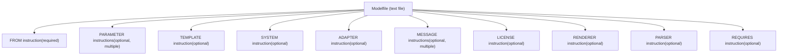
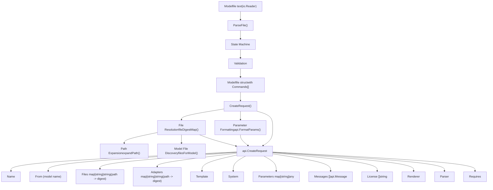
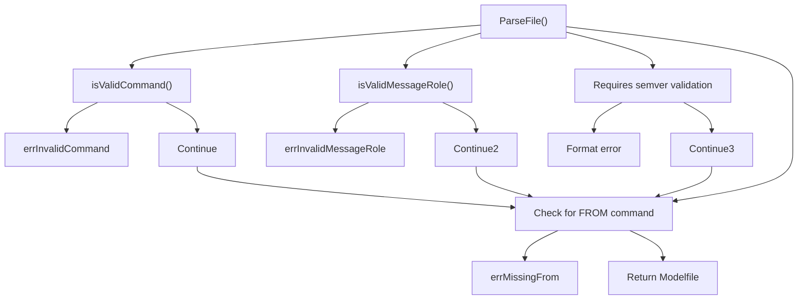
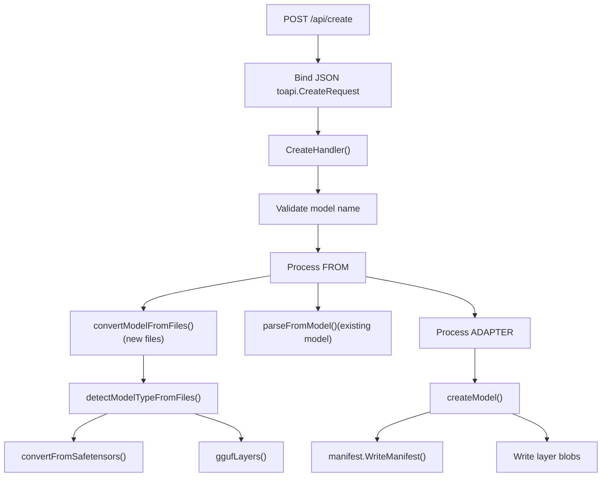

# Modelfiles

相关源文件

-   [README.md](https://github.com/ollama/ollama/blob/562c76d7/README.md?plain=1)
-   [docs/README.md](https://github.com/ollama/ollama/blob/562c76d7/docs/README.md?plain=1)
-   [docs/api.md](https://github.com/ollama/ollama/blob/562c76d7/docs/api.md?plain=1)
-   [docs/development.md](https://github.com/ollama/ollama/blob/562c76d7/docs/development.md?plain=1)
-   [docs/images/ollama-keys.png](https://github.com/ollama/ollama/blob/562c76d7/docs/images/ollama-keys.png)
-   [docs/images/signup.png](https://github.com/ollama/ollama/blob/562c76d7/docs/images/signup.png)
-   [parser/expandpath\_test.go](https://github.com/ollama/ollama/blob/562c76d7/parser/expandpath_test.go)
-   [parser/parser.go](https://github.com/ollama/ollama/blob/562c76d7/parser/parser.go)
-   [parser/parser\_test.go](https://github.com/ollama/ollama/blob/562c76d7/parser/parser_test.go)

Modelfile 是一种基于文本的配置文件，用于定义如何在 Ollama 中创建和定制模型。Modelfile 可指定基础模型、参数、系统提示词、模板、适配器以及创建新模型变体所需的其他配置。它充当蓝图，会被解析并转换为模型创建请求。

关于模型创建流程和层管理的信息，请参见 [模型注册表与层](/ollama/ollama/4.2-model-registry-and-layers)。关于消费 Modelfile 的 API 端点细节，请参见 [模型管理 API](/ollama/ollama/3.1-model-management-api)。

## Modelfile 结构与语法

### 基本格式

Modelfile 由指令行构成，格式如下：

```
INSTRUCTION arguments
```
指令不区分大小写，且可按任意顺序出现，但 `FROM` 指令是必需的。注释以 `#` 开头。

**Modelfile 示例：**

```
FROM llama3.2
PARAMETER temperature 1.0
PARAMETER num_ctx 4096
SYSTEM You are a helpful assistant.
TEMPLATE """{{ .System }} {{ .Prompt }}"""
```
### Modelfile 结构图


来源：[parser/parser.go30-41](https://github.com/ollama/ollama/blob/562c76d7/parser/parser.go#L30-L41) [parser/parser.go326-346](https://github.com/ollama/ollama/blob/562c76d7/parser/parser.go#L326-L346) [docs/modelfile.mdx26-44](https://github.com/ollama/ollama/blob/562c76d7/docs/modelfile.mdx?plain=1#L26-L44)

## 解析架构

### 解析器状态机

Modelfile 解析器实现了一个逐字符处理输入的状态机。解析器定义于 [parser/parser.go](https://github.com/ollama/ollama/blob/562c76d7/parser/parser.go)，并使用以下状态：

| 状态 | 描述 |
| --- | --- |
| `stateNil` | 初始状态，等待指令 |
| `stateName` | 读取指令名 |
| `stateValue` | 读取指令参数值 |
| `stateParameter` | 在 PARAMETER 指令后读取参数名 |
| `stateMessage` | 在 MESSAGE 指令后读取消息角色 |
| `stateComment` | 跳过注释行 |

> **[Mermaid stateDiagram]**
> *(图表结构无法解析)*

来源：[parser/parser.go348-357](https://github.com/ollama/ollama/blob/562c76d7/parser/parser.go#L348-L357) [parser/parser.go508-565](https://github.com/ollama/ollama/blob/562c76d7/parser/parser.go#L508-L565)

### 核心解析组件

解析器由以下关键结构和函数组成：

**Modelfile 结构：**

```
type Modelfile struct {
    Commands []Command
}
```
[parser/parser.go30-32](https://github.com/ollama/ollama/blob/562c76d7/parser/parser.go#L30-L32)

**Command 结构：**

```
type Command struct {
    Name string
    Args string
}
```
[parser/parser.go326-329](https://github.com/ollama/ollama/blob/562c76d7/parser/parser.go#L326-L329)

**主解析函数：**

-   `ParseFile(r io.Reader) (*Modelfile, error)` - 从 `io.Reader` 解析 Modelfile，并处理 UTF-8 与 UTF-16（带 BOM）编码 [parser/parser.go377-506](https://github.com/ollama/ollama/blob/562c76d7/parser/parser.go#L377-L506)

**状态转移逻辑：**

-   `parseRuneForState(r rune, cs state) (state, rune, error)` - 基于当前状态和输入字符决定状态转移 [parser/parser.go508-565](https://github.com/ollama/ollama/blob/562c76d7/parser/parser.go#L508-L565)

**校验函数：**

-   `isValidCommand(cmd string) bool` - 校验指令名 [parser/parser.go620-627](https://github.com/ollama/ollama/blob/562c76d7/parser/parser.go#L620-L627)
-   `isValidMessageRole(role string) bool` - 校验消息角色（system、user、assistant）[parser/parser.go616-618](https://github.com/ollama/ollama/blob/562c76d7/parser/parser.go#L616-L618)

来源：[parser/parser.go30-32](https://github.com/ollama/ollama/blob/562c76d7/parser/parser.go#L30-L32) [parser/parser.go326-329](https://github.com/ollama/ollama/blob/562c76d7/parser/parser.go#L326-L329) [parser/parser.go377-506](https://github.com/ollama/ollama/blob/562c76d7/parser/parser.go#L377-L506) [parser/parser.go508-565](https://github.com/ollama/ollama/blob/562c76d7/parser/parser.go#L508-L565)

## 指令参考

### FROM 指令（必需）

`FROM` 指令用于指定要使用的基础模型或模型文件。它是唯一必需的指令，且必须至少出现一次。解析器会在内部将 `FROM` 命令转换为 `model` 命令。

**格式：**

1.  **现有模型名：**

    ```
    FROM llama3:latest
    FROM registry.ollama.ai/library/mistral:7b
    ```

2.  **本地文件路径（GGUF 或目录）：**

    ```
    FROM ./my-model.gguf
    FROM /absolute/path/to/model.gguf
    FROM ./model-directory
    ```

3.  **用户主目录展开：**

    ```
    FROM ~/models/my-model.gguf
    FROM ~username/models/my-model.gguf
    ```


解析器通过 `expandPath()` 执行路径展开 [parser/parser.go666-668](https://github.com/ollama/ollama/blob/562c76d7/parser/parser.go#L666-L668)，其处理内容包括：

-   绝对路径
-   相对路径（相对 Modelfile 所在位置）
-   主目录的波浪号展开

当提供的是模型名时，解析器会使用 `fileDigestMap()` 检查其是否引用本地文件 [parser/parser.go157-215](https://github.com/ollama/ollama/blob/562c76d7/parser/parser.go#L157-L215)。对于目录，它会使用 `filesForModel()` 发现模型文件 [parser/parser.go236-324](https://github.com/ollama/ollama/blob/562c76d7/parser/parser.go#L236-L324)，查找以下内容：

-   `.safetensors` 文件（model\*.safetensors、consolidated\*.safetensors）
-   `.bin` 文件（pytorch\_model\*.bin、consolidated\*.pth）
-   `.gguf` 文件
-   `.json` 配置文件
-   `tokenizer.model` 文件

来源：[parser/parser.go64-85](https://github.com/ollama/ollama/blob/562c76d7/parser/parser.go#L64-L85) [parser/parser.go157-215](https://github.com/ollama/ollama/blob/562c76d7/parser/parser.go#L157-L215) [parser/parser.go236-324](https://github.com/ollama/ollama/blob/562c76d7/parser/parser.go#L236-L324) [parser/parser.go629-668](https://github.com/ollama/ollama/blob/562c76d7/parser/parser.go#L629-L668) [docs/modelfile.mdx96-139](https://github.com/ollama/ollama/blob/562c76d7/docs/modelfile.mdx?plain=1#L96-L139)

### PARAMETER 指令

`PARAMETER` 指令用于设置推理参数。可指定多个 `PARAMETER` 指令。参数会收集到一个映射中，而数组值（如 `stop` 序列）可重复指定多次。

**格式：**

```
PARAMETER <name> <value>
```
**已弃用参数**（会警告但可接受）：

-   `penalize_newline`, `low_vram`, `f16_kv`, `logits_all`, `vocab_only`, `use_mlock`, `mirostat`, `mirostat_tau`, `mirostat_eta` [parser/parser.go43-53](https://github.com/ollama/ollama/blob/562c76d7/parser/parser.go#L43-L53)

**常见参数：**

| 参数 | 类型 | 描述 | 示例 |
| --- | --- | --- | --- |
| `num_ctx` | int | 上下文窗口大小 | `PARAMETER num_ctx 4096` |
| `temperature` | float | 采样温度（创造性） | `PARAMETER temperature 0.8` |
| `top_k` | int | Top-k 采样 | `PARAMETER top_k 40` |
| `top_p` | float | Top-p（nucleus）采样 | `PARAMETER top_p 0.9` |
| `min_p` | float | 最小概率阈值 | `PARAMETER min_p 0.05` |
| `seed` | int | 随机种子 | `PARAMETER seed 42` |
| `stop` | string | 停止序列（可指定多个） | `PARAMETER stop "###"` |
| `num_predict` | int | 最大生成 token 数 | `PARAMETER num_predict 128` |
| `repeat_penalty` | float | 重复惩罚 | `PARAMETER repeat_penalty 1.1` |

参数在 `CreateRequest()` 生成期间通过 `api.FormatParams()` 转换 [parser/parser.go127-140](https://github.com/ollama/ollama/blob/562c76d7/parser/parser.go#L127-L140)

来源：[parser/parser.go43-53](https://github.com/ollama/ollama/blob/562c76d7/parser/parser.go#L43-L53) [parser/parser.go122-141](https://github.com/ollama/ollama/blob/562c76d7/parser/parser.go#L122-L141) [docs/modelfile.mdx141-162](https://github.com/ollama/ollama/blob/562c76d7/docs/modelfile.mdx?plain=1#L141-L162)

### TEMPLATE 指令

`TEMPLATE` 指令定义用于格式化模型消息的提示词模板。模板使用 Go 模板语法，并支持特殊变量。

**格式：**

```
TEMPLATE """<template string>"""
```
**模板变量：**

| 变量 | 描述 |
| --- | --- |
| `{{ .System }}` | 系统消息 |
| `{{ .Prompt }}` | 用户提示 |
| `{{ .Response }}` | 模型回复（生成期间省略） |

**示例：**

```
TEMPLATE """{{ if .System }}<|start_header_id|>system<|end_header_id|>

{{ .System }}<|eot_id|>{{ end }}{{ if .Prompt }}<|start_header_id|>user<|end_header_id|>

{{ .Prompt }}<|eot_id|>{{ end }}<|start_header_id|>assistant<|end_header_id|>

{{ .Response }}<|eot_id|>"""
```
该模板会存储到 `CreateRequest.Template` [parser/parser.go98-99](https://github.com/ollama/ollama/blob/562c76d7/parser/parser.go#L98-L99)

来源：[parser/parser.go98-99](https://github.com/ollama/ollama/blob/562c76d7/parser/parser.go#L98-L99) [docs/modelfile.mdx164-183](https://github.com/ollama/ollama/blob/562c76d7/docs/modelfile.mdx?plain=1#L164-L183)

### SYSTEM 指令

`SYSTEM` 指令设置默认系统消息，用于引导模型行为。

**格式：**

```
SYSTEM """<system message>"""
```
**示例：**

```
SYSTEM """You are a helpful AI assistant specializing in code review."""
```
系统消息会存储到 `CreateRequest.System` [parser/parser.go100-101](https://github.com/ollama/ollama/blob/562c76d7/parser/parser.go#L100-L101)

来源：[parser/parser.go100-101](https://github.com/ollama/ollama/blob/562c76d7/parser/parser.go#L100-L101) [docs/modelfile.mdx185-191](https://github.com/ollama/ollama/blob/562c76d7/docs/modelfile.mdx?plain=1#L185-L191)

### ADAPTER 指令

`ADAPTER` 指令用于指定要应用到基础模型上的 LoRA 或 QLoRA 适配器。适配器可以是 Safetensors 或 GGUF 格式。

**格式：**

```
ADAPTER <path>
```
**示例：**

```
ADAPTER ./my-lora-adapter
ADAPTER ./adapter.gguf
```
适配器文件与模型文件类似，通过 `fileDigestMap()` 处理。摘要会以映射形式存储在 `CreateRequest.Adapters` 中 [parser/parser.go86-97](https://github.com/ollama/ollama/blob/562c76d7/parser/parser.go#L86-L97)

在模型创建期间，目前仅支持一个 GGUF 适配器 [server/create.go318-320](https://github.com/ollama/ollama/blob/562c76d7/server/create.go#L318-L320)

来源：[parser/parser.go86-97](https://github.com/ollama/ollama/blob/562c76d7/parser/parser.go#L86-L97) [server/create.go306-336](https://github.com/ollama/ollama/blob/562c76d7/server/create.go#L306-L336) [docs/modelfile.mdx193-213](https://github.com/ollama/ollama/blob/562c76d7/docs/modelfile.mdx?plain=1#L193-L213)

### LICENSE 指令

`LICENSE` 指令用于指定模型的法律许可文本。可指定多个许可证指令，并将其拼接。

**格式：**

```
LICENSE """<license text>"""
```
**示例：**

```
LICENSE """MIT License

Copyright (c) 2024 Example

Permission is hereby granted..."""
```
许可证会收集到数组中，并存储到 `CreateRequest.License` [parser/parser.go102-103](https://github.com/ollama/ollama/blob/562c76d7/parser/parser.go#L102-L103) [parser/parser.go150-152](https://github.com/ollama/ollama/blob/562c76d7/parser/parser.go#L150-L152)

来源：[parser/parser.go102-103](https://github.com/ollama/ollama/blob/562c76d7/parser/parser.go#L102-L103) [parser/parser.go150-152](https://github.com/ollama/ollama/blob/562c76d7/parser/parser.go#L150-L152) [docs/modelfile.mdx215-223](https://github.com/ollama/ollama/blob/562c76d7/docs/modelfile.mdx?plain=1#L215-L223)

### MESSAGE 指令

`MESSAGE` 指令添加示例对话历史，以引导模型回复。消息包含角色（system、user 或 assistant）和内容。

**格式：**

```
MESSAGE <role> <content>
```
**有效角色：**

-   `system` - 系统级指令
-   `user` - 示例用户消息
-   `assistant` - 示例模型回复

**示例：**

```
MESSAGE user What is the capital of France?
MESSAGE assistant Paris is the capital of France.
MESSAGE user What about Germany?
MESSAGE assistant Berlin is the capital of Germany.
```
消息解析时会校验角色 [parser/parser.go438-446](https://github.com/ollama/ollama/blob/562c76d7/parser/parser.go#L438-L446)，并以 `api.Message` 结构存储到 `CreateRequest.Messages` [parser/parser.go118-120](https://github.com/ollama/ollama/blob/562c76d7/parser/parser.go#L118-L120) [parser/parser.go147-149](https://github.com/ollama/ollama/blob/562c76d7/parser/parser.go#L147-L149)

来源：[parser/parser.go118-120](https://github.com/ollama/ollama/blob/562c76d7/parser/parser.go#L118-L120) [parser/parser.go147-149](https://github.com/ollama/ollama/blob/562c76d7/parser/parser.go#L147-L149) [parser/parser.go438-446](https://github.com/ollama/ollama/blob/562c76d7/parser/parser.go#L438-L446) [docs/modelfile.mdx225-250](https://github.com/ollama/ollama/blob/562c76d7/docs/modelfile.mdx?plain=1#L225-L250)

### RENDERER 指令

`RENDERER` 指令用于为模型指定自定义渲染器。Ollama 使用它来确定如何渲染模型输出。

**格式：**

```
RENDERER <renderer-name>
```
渲染器会存储到 `CreateRequest.Renderer` [parser/parser.go104-105](https://github.com/ollama/ollama/blob/562c76d7/parser/parser.go#L104-L105)，并最终写入 `ConfigV2.Renderer` [types/model/config.go10](https://github.com/ollama/ollama/blob/562c76d7/types/model/config.go#L10-L10)

来源：[parser/parser.go104-105](https://github.com/ollama/ollama/blob/562c76d7/parser/parser.go#L104-L105) [types/model/config.go10](https://github.com/ollama/ollama/blob/562c76d7/types/model/config.go#L10-L10)

### PARSER 指令

`PARSER` 指令用于为模型指定自定义解析器。Ollama 使用它来确定如何解析模型输入。

**格式：**

```
PARSER <parser-name>
```
解析器会存储到 `CreateRequest.Parser` [parser/parser.go106-107](https://github.com/ollama/ollama/blob/562c76d7/parser/parser.go#L106-L107)，并最终写入 `ConfigV2.Parser` [types/model/config.go11](https://github.com/ollama/ollama/blob/562c76d7/types/model/config.go#L11-L11)

来源：[parser/parser.go106-107](https://github.com/ollama/ollama/blob/562c76d7/parser/parser.go#L106-L107) [types/model/config.go11](https://github.com/ollama/ollama/blob/562c76d7/types/model/config.go#L11-L11)

### REQUIRES 指令

`REQUIRES` 指令指定使用该模型所需的 Ollama 最低版本。版本必须是有效的语义化版本。

**格式：**

```
REQUIRES <version>
```
**示例：**

```
REQUIRES 0.14.0
```
该版本会通过 `semver.IsValid()` 校验，并存储到 `CreateRequest.Requires` [parser/parser.go108-117](https://github.com/ollama/ollama/blob/562c76d7/parser/parser.go#L108-L117) 和 `ConfigV2.Requires` [types/model/config.go12](https://github.com/ollama/ollama/blob/562c76d7/types/model/config.go#L12-L12)

来源：[parser/parser.go108-117](https://github.com/ollama/ollama/blob/562c76d7/parser/parser.go#L108-L117) [types/model/config.go12](https://github.com/ollama/ollama/blob/562c76d7/types/model/config.go#L12-L12) [docs/modelfile.mdx252-260](https://github.com/ollama/ollama/blob/562c76d7/docs/modelfile.mdx?plain=1#L252-L260)

## 字符串引号与多行文本

### 引号规则

解析器支持三种用于指令参数的引号风格：

1.  **不加引号** - 不含空格或特殊字符的简单值：

    ```
    FROM llama3
    PARAMETER temperature 0.8
    ```

2.  **双引号** - 含空格，或需要保留首尾空白的值：

    ```
    SYSTEM "You are a helpful assistant."
    ```

3.  **三引号** - 保留格式的多行值：

    ```
    TEMPLATE """
    {{ .System }}
    {{ .Prompt }}
    """
    ```


### 引号处理函数

解析器使用两个辅助函数处理引号：

**quote(s string) string** [parser/parser.go567-577](https://github.com/ollama/ollama/blob/562c76d7/parser/parser.go#L567-L577)

-   在输出格式化需要时添加引号
-   若字符串包含换行或双引号，则使用三引号
-   若字符串包含首尾空格，则使用双引号
-   否则返回不加引号的字符串

**unquote(s string) (string, bool)** [parser/parser.go579-598](https://github.com/ollama/ollama/blob/562c76d7/parser/parser.go#L579-L598)

-   从已解析字符串中移除引号定界符
-   处理三引号（`"""..."""`）
-   处理双引号（`"..."`）
-   返回去引号内容和成功布尔值

在解析时，解析器会将字符累积到缓冲区，并在从 `stateValue` 转换到 `stateNil` 时调用 `unquote()` [parser/parser.go450-465](https://github.com/ollama/ollama/blob/562c76d7/parser/parser.go#L450-L465)

来源：[parser/parser.go450-465](https://github.com/ollama/ollama/blob/562c76d7/parser/parser.go#L450-L465) [parser/parser.go567-598](https://github.com/ollama/ollama/blob/562c76d7/parser/parser.go#L567-L598)

## 从 Modelfile 到 CreateRequest 的转换


### CreateRequest 方法

`CreateRequest(relativeDir string)` 方法 [parser/parser.go56-155](https://github.com/ollama/ollama/blob/562c76d7/parser/parser.go#L56-L155) 会将已解析的 `Modelfile` 转换为可发送到服务器的 `api.CreateRequest`。该方法会：

1.  **处理 FROM 命令** - 解析文件路径并为本地文件生成 SHA256 摘要
2.  **处理 ADAPTER 命令** - 与 FROM 类似，解析适配器文件路径
3.  **收集参数** - 使用 `api.FormatParams()` 格式化并合并参数
4.  **累积消息** - 构建消息历史数组
5.  **收集许可证** - 合并多个许可证文本
6.  **设置模板与系统消息** - 直接赋值
7.  **设置元数据** - renderer、parser、requires 字段

**文件摘要计算：**

对于本地文件路径，解析器会生成 SHA256 摘要 [parser/parser.go217-234](https://github.com/ollama/ollama/blob/562c76d7/parser/parser.go#L217-L234)：

```
sha256:<hex-encoded-hash>
```
这些摘要用于在模型存储系统中引用 blob。

来源：[parser/parser.go56-155](https://github.com/ollama/ollama/blob/562c76d7/parser/parser.go#L56-L155) [parser/parser.go157-234](https://github.com/ollama/ollama/blob/562c76d7/parser/parser.go#L157-L234)

## 文件发现与内容类型检测

### 模型文件发现

当在 `FROM` 或 `ADAPTER` 中指定目录时，解析器会使用 `filesForModel()` 搜索支持的文件类型 [parser/parser.go236-324](https://github.com/ollama/ollama/blob/562c76d7/parser/parser.go#L236-L324)。该函数会：

1.  按优先级**搜索模型权重**：

    -   Safetensors：`model*.safetensors`、`consolidated*.safetensors`
    -   PyTorch：`pytorch_model*.bin`、`consolidated*.pth`
    -   GGUF：`*.gguf`、`*.bin`（带 GGUF 魔数）
2.  **添加配置文件**：

    -   目录中的所有 `*.json` 文件
    -   嵌套目录中的 `*.json` 文件（用于 BERT 等模型）
3.  **添加分词器文件**：

    -   `tokenizer.model` 文件
    -   嵌套目录中的 `tokenizer.model` 文件
4.  使用 `http.DetectContentType()` **校验内容类型**，确保文件不是 Git LFS 引用或错误格式


### 内容类型检测

`detectContentType()` 辅助函数 [parser/parser.go237-253](https://github.com/ollama/ollama/blob/562c76d7/parser/parser.go#L237-L253) 会读取文件前 512 字节并使用 HTTP 内容类型检测。这可以防止 Git LFS 指针文件被误认为模型文件的问题。

### 路径安全

解析器通过以下方式校验文件路径安全性：

-   `filepath.IsLocal()` - 确保路径不会逃逸基础目录 [parser/parser.go183-185](https://github.com/ollama/ollama/blob/562c76d7/parser/parser.go#L183-L185)
-   `filepath.EvalSymlinks()` - 处理前解析符号链接 [parser/parser.go173-176](https://github.com/ollama/ollama/blob/562c76d7/parser/parser.go#L173-L176) [parser/parser.go218-221](https://github.com/ollama/ollama/blob/562c76d7/parser/parser.go#L218-L221)

这可防止通过恶意 Modelfile 路径进行目录遍历攻击。

来源：[parser/parser.go157-215](https://github.com/ollama/ollama/blob/562c76d7/parser/parser.go#L157-L215) [parser/parser.go236-324](https://github.com/ollama/ollama/blob/562c76d7/parser/parser.go#L236-L324)

## 错误处理

解析器定义了自定义错误类型，并为常见失败场景返回特定错误：

**解析器错误：**

| 错误 | 常量 | 描述 |
| --- | --- | --- |
| `errMissingFrom` | `"no FROM line"` | Modelfile 缺少必需的 FROM 指令 |
| `errInvalidCommand` | `"command must be one of..."` | 无效指令名 |
| `errInvalidMessageRole` | `"message role must be..."` | 无效 MESSAGE 角色 |

**ParserError 类型：**

`ParserError` 结构 [parser/parser.go365-375](https://github.com/ollama/ollama/blob/562c76d7/parser/parser.go#L365-L375) 包含行号信息：

```
type ParserError struct {
    LineNumber int
    Msg        string
}
```
这使得在调试无效 Modelfile 时可以精确报告行号。

**校验流程：**


来源：[parser/parser.go359-375](https://github.com/ollama/ollama/blob/562c76d7/parser/parser.go#L359-L375) [parser/parser.go499-506](https://github.com/ollama/ollama/blob/562c76d7/parser/parser.go#L499-L506) [parser/parser.go615-627](https://github.com/ollama/ollama/blob/562c76d7/parser/parser.go#L615-L627)

## 与模型创建的集成

解析后的 Modelfile 会被服务器的 `CreateHandler` 消费 [server/create.go46-259](https://github.com/ollama/ollama/blob/562c76d7/server/create.go#L46-L259)，该处理器会：

1.  **接收 CreateRequest**（来自 API 或已解析 Modelfile）
2.  使用 `model.ParseName()` 和 `name.IsValid()` **校验模型名**
3.  **处理 FROM**：
    -   若 FROM 是模型名：调用 `parseFromModel()` 加载现有模型层
    -   若 FROM 是文件：调用 `convertModelFromFiles()` 转换 Safetensors 或 GGUF 文件
4.  **处理 ADAPTER**（若存在）：转换适配器文件
5.  **合并配置**，包括 renderer、parser 和 requires 字段
6.  **创建模型层**并写入 manifest


来源：[server/create.go46-259](https://github.com/ollama/ollama/blob/562c76d7/server/create.go#L46-L259) [server/create.go306-336](https://github.com/ollama/ollama/blob/562c76d7/server/create.go#L306-L336) [server/model.go28-77](https://github.com/ollama/ollama/blob/562c76d7/server/model.go#L28-L77)

## 使用示例

### 从 Modelfile 创建模型

**命令行：**

```
ollama create mymodel -f ./Modelfile
```
**Modelfile 内容：**

```
FROM llama3.2
PARAMETER temperature 0.9
PARAMETER top_p 0.95
SYSTEM You are an expert programmer.
```
### 使用自定义模板创建

```
FROM mistral
TEMPLATE """<s>[INST] {{ .System }}
{{ .Prompt }} [/INST] {{ .Response }}</s>"""
SYSTEM You are a helpful coding assistant.
```
### 使用适配器创建

```
FROM llama3:7b
ADAPTER ./my-code-lora
PARAMETER temperature 0.7
```
### 从本地 GGUF 创建

```
FROM ./llama-3-8b-instruct-q4_0.gguf
PARAMETER num_ctx 8192
```
### 从 Safetensors 目录创建

```
FROM ./Meta-Llama-3-8B-Instruct
PARAMETER temperature 0.8
MESSAGE user Hello
MESSAGE assistant Hi! How can I help you today?
```
来源：[docs/modelfile.mdx46-93](https://github.com/ollama/ollama/blob/562c76d7/docs/modelfile.mdx?plain=1#L46-L93) [parser/parser\_test.go28-59](https://github.com/ollama/ollama/blob/562c76d7/parser/parser_test.go#L28-L59)

## 测试

解析器在 [parser/parser\_test.go](https://github.com/ollama/ollama/blob/562c76d7/parser/parser_test.go) 中包含全面测试：

-   **基础解析** - 指令、参数、引号 [parser/parser\_test.go28-92](https://github.com/ollama/ollama/blob/562c76d7/parser/parser_test.go#L28-L92)
-   **FROM 变体** - 模型名、路径、校验 [parser/parser\_test.go94-173](https://github.com/ollama/ollama/blob/562c76d7/parser/parser_test.go#L94-L173)
-   **引号** - 单引号、双引号、三引号及边界场景 [parser/parser\_test.go348-499](https://github.com/ollama/ollama/blob/562c76d7/parser/parser_test.go#L348-L499)
-   **参数** - 所有参数类型和值 [parser/parser\_test.go502-551](https://github.com/ollama/ollama/blob/562c76d7/parser/parser_test.go#L502-L551)
-   **消息** - 角色校验与内容解析 [parser/parser\_test.go232-346](https://github.com/ollama/ollama/blob/562c76d7/parser/parser_test.go#L232-L346)
-   **UTF 编码** - UTF-8、UTF-16 LE/BE（含 BOM）[parser/parser\_test.go642-703](https://github.com/ollama/ollama/blob/562c76d7/parser/parser_test.go#L642-L703)
-   **错误场景** - 缺失 FROM、无效命令、不完整引号 [parser/parser\_test.go176-202](https://github.com/ollama/ollama/blob/562c76d7/parser/parser_test.go#L176-L202)

[server/routes\_create\_test.go](https://github.com/ollama/ollama/blob/562c76d7/server/routes_create_test.go) 中的集成测试验证了从 Modelfile 进行端到端模型创建。

来源：[parser/parser\_test.go1-27](https://github.com/ollama/ollama/blob/562c76d7/parser/parser_test.go#L1-L27) [server/routes\_create\_test.go1-30](https://github.com/ollama/ollama/blob/562c76d7/server/routes_create_test.go#L1-L30)
