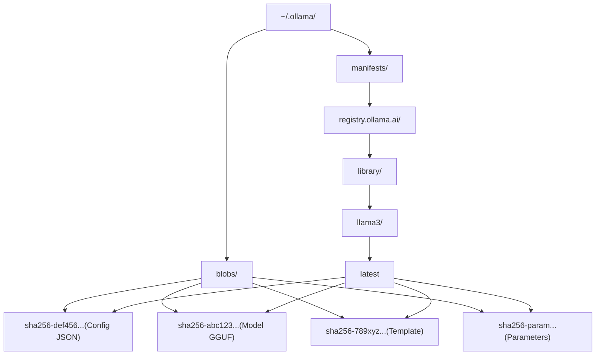
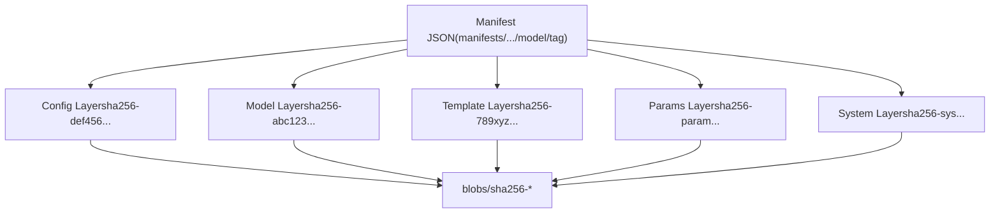
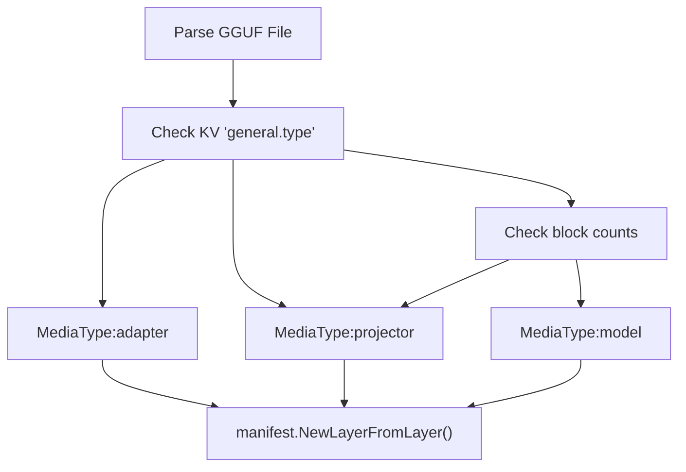
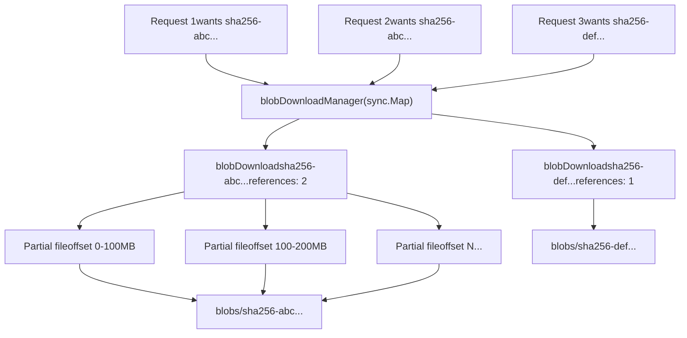
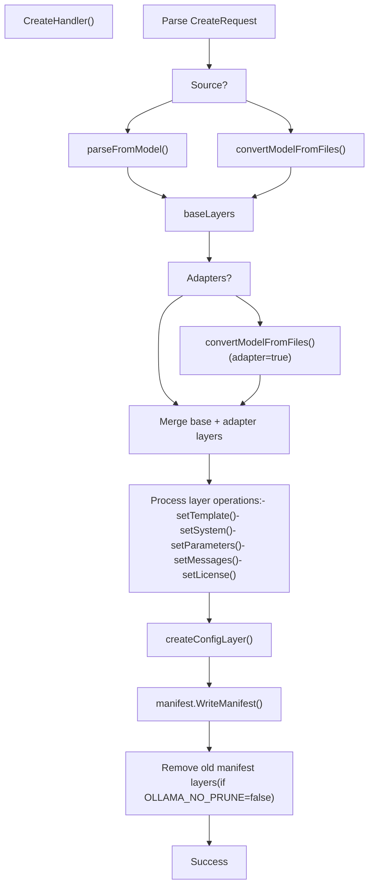

# 模型注册表与层

相关源文件

-   [auth/auth.go](https://github.com/ollama/ollama/blob/562c76d7/auth/auth.go)
-   [cmd/cmd\_test.go](https://github.com/ollama/ollama/blob/562c76d7/cmd/cmd_test.go)
-   [server/auth.go](https://github.com/ollama/ollama/blob/562c76d7/server/auth.go)
-   [server/auth\_test.go](https://github.com/ollama/ollama/blob/562c76d7/server/auth_test.go)
-   [server/create.go](https://github.com/ollama/ollama/blob/562c76d7/server/create.go)
-   [server/download.go](https://github.com/ollama/ollama/blob/562c76d7/server/download.go)
-   [server/model.go](https://github.com/ollama/ollama/blob/562c76d7/server/model.go)
-   [server/routes\_create\_test.go](https://github.com/ollama/ollama/blob/562c76d7/server/routes_create_test.go)
-   [server/routes\_delete\_test.go](https://github.com/ollama/ollama/blob/562c76d7/server/routes_delete_test.go)
-   [server/routes\_list\_test.go](https://github.com/ollama/ollama/blob/562c76d7/server/routes_list_test.go)
-   [server/routes\_test.go](https://github.com/ollama/ollama/blob/562c76d7/server/routes_test.go)
-   [server/sparse\_common.go](https://github.com/ollama/ollama/blob/562c76d7/server/sparse_common.go)
-   [server/sparse\_windows.go](https://github.com/ollama/ollama/blob/562c76d7/server/sparse_windows.go)
-   [server/upload.go](https://github.com/ollama/ollama/blob/562c76d7/server/upload.go)
-   [types/errtypes/errtypes.go](https://github.com/ollama/ollama/blob/562c76d7/types/errtypes/errtypes.go)

本文档说明 Ollama 的内容寻址模型存储系统，包括 manifest/layer 架构、blob 存储、层类型和注册表操作。关于如何从 Modelfile 创建模型，请参见 [Modelfiles](/ollama/ollama/4.1-modelfiles)。关于文件格式转换和量化细节，请参见 [模型转换与导入](/ollama/ollama/4.3-model-conversion-and-import) 与 [量化](/ollama/ollama/4.6-quantization)。

## 概览

Ollama 使用与 Docker 基于层的模型分发类似的内容寻址存储系统。每个模型由一个 manifest 和多个层（模型权重、模板、参数等）组成；每一层都以 SHA256 摘要标识并作为不可变 blob 存储。该架构带来：

-   **去重**：多个模型可共享同一层（例如相同基础模型权重）
-   **高效存储**：仅唯一内容存储一次
-   **原子更新**：manifest 原子更新，层不可变
-   **远程分发**：与注册表之间的标准拉取/推送操作

**来源：** [server/model.go1-129](https://github.com/ollama/ollama/blob/562c76d7/server/model.go#L1-L129) [server/create.go1-45](https://github.com/ollama/ollama/blob/562c76d7/server/create.go#L1-L45) [manifest package overview from imports](https://github.com/ollama/ollama/blob/562c76d7/manifest package overview from imports)

## 存储架构

### 目录结构

```
~/.ollama/
├── manifests/
│   └── registry.ollama.ai/
│       └── library/
│           └── llama3/
│               └── latest          # Manifest file (JSON)
└── blobs/
    ├── sha256-abc123...           # Model weights (GGUF)
    ├── sha256-def456...           # Config layer (JSON)
    ├── sha256-789xyz...           # Template layer
    └── sha256-...                 # Other layers
```
**目录结构图**


**来源：** [server/download.go468-509](https://github.com/ollama/ollama/blob/562c76d7/server/download.go#L468-L509) [server/routes\_create\_test.go105-147](https://github.com/ollama/ollama/blob/562c76d7/server/routes_create_test.go#L105-L147)

### 内容寻址

每一层都由 `sha256:{64-char-hex}` 格式的 SHA256 摘要标识。Blob 存储在 `~/.ollama/blobs/sha256-{digest}`，其中 digest 是 blob 内容的 SHA256 哈希。这保证了：

1.  **完整性**：内容可通过其摘要进行校验
2.  **不可变性**：一旦写入，blob 永不更改
3.  **去重**：相同内容（同一摘要）只存储一次

**来源：** [server/download.go473-476](https://github.com/ollama/ollama/blob/562c76d7/server/download.go#L473-L476) [server/upload.go56-59](https://github.com/ollama/ollama/blob/562c76d7/server/upload.go#L56-L59) [server/create.go77-84](https://github.com/ollama/ollama/blob/562c76d7/server/create.go#L77-L84)

## Manifest 结构

Manifest 是一个描述模型的 JSON 文档。它引用一个配置层和按顺序排列的组件层列表。

### Manifest 组件

**Manifest 与层关系**


Manifest 包含：

-   **SchemaVersion**：Manifest 格式版本
-   **MediaType**：始终为 `application/vnd.docker.distribution.manifest.v2+json`
-   **Config**：配置层引用（digest、size、media type）
-   **Layers**：有序层引用数组

每个层引用包含：

-   **Digest**：SHA256 摘要（例如 `sha256:abc123...`）
-   **Size**：blob 字节大小
-   **MediaType**：层类型标识
-   **From**（可选）：用于跨仓库 blob 挂载的源模型

**来源：** [server/model.go28-77](https://github.com/ollama/ollama/blob/562c76d7/server/model.go#L28-L77) [server/create.go559-573](https://github.com/ollama/ollama/blob/562c76d7/server/create.go#L559-L573)

### Manifest 路径解析

模型名称会被解析为组件并映射到文件系统路径：

| 模型名 | Manifest 路径 |
| --- | --- |
| `llama3` | `manifests/registry.ollama.ai/library/llama3/latest` |
| `llama3:8b` | `manifests/registry.ollama.ai/library/llama3/8b` |
| `user/mymodel` | `manifests/registry.ollama.ai/user/mymodel/latest` |
| `example.com/ns/model:tag` | `manifests/example.com/ns/model/tag` |

Manifest 在文件系统上不区分大小写（全部以小写存储），但在 API 响应中保留原始大小写。

**来源：** [server/routes\_test.go562-687](https://github.com/ollama/ollama/blob/562c76d7/server/routes_test.go#L562-L687) [types/model package from imports](https://github.com/ollama/ollama/blob/562c76d7/types/model package from imports)

## 层类型与媒体类型

Ollama 使用特定媒体类型标识每一层用途。这些媒体类型遵循 Docker 约定，但使用 Ollama 专用标识符。

### 层媒体类型

| 媒体类型 | 用途 | 内容格式 | 示例 |
| --- | --- | --- | --- |
| `application/vnd.ollama.image.model` | 模型权重 | GGUF 文件 | 基础模型参数 |
| `application/vnd.ollama.image.projector` | 视觉编码器 | GGUF 文件 | CLIP 视觉模型 |
| `application/vnd.ollama.image.adapter` | LoRA 适配器 | GGUF 文件 | 微调权重 |
| `application/vnd.ollama.image.template` | 提示词模板 | 纯文本 | `{{ .System }} {{ .Prompt }}` |
| `application/vnd.ollama.image.system` | 系统消息 | 纯文本 | `You are a helpful assistant` |
| `application/vnd.ollama.image.params` | 模型参数 | JSON | `{"temperature": 0.7}` |
| `application/vnd.ollama.image.license` | 许可证文本 | 纯文本 | 模型许可证 |
| `application/vnd.docker.container.image.v1+json` | 配置元数据 | JSON | 模型家族、类型等 |

**来源：** [server/model.go50-72](https://github.com/ollama/ollama/blob/562c76d7/server/model.go#L50-L72) [server/create.go424-441](https://github.com/ollama/ollama/blob/562c76d7/server/create.go#L424-L441) [server/create.go661-667](https://github.com/ollama/ollama/blob/562c76d7/server/create.go#L661-L667)

### 层类型检测

从 GGUF 文件创建模型时，会自动检测层类型：

**层类型检测流程**


**来源：** [server/create.go630-678](https://github.com/ollama/ollama/blob/562c76d7/server/create.go#L630-L678) [server/model.go50-72](https://github.com/ollama/ollama/blob/562c76d7/server/model.go#L50-L72)

### 层操作

在模型创建过程中，层可被添加、移除或替换：

```
// Setting a template removes existing template layers and adds a new onelayers = removeLayer(layers, "application/vnd.ollama.image.template")layer, _ := manifest.NewLayer(templateReader, "application/vnd.ollama.image.template")layers = append(layers, layer)
```
常见操作：

-   **removeLayer**：移除指定媒体类型的所有层
-   **setTemplate**：替换模板层
-   **setSystem**：替换系统消息层
-   **setParameters**：与现有参数合并
-   **setMessages**：替换消息历史层
-   **setLicense**：添加许可证层

**来源：** [server/create.go680-735](https://github.com/ollama/ollama/blob/562c76d7/server/create.go#L680-L735) [server/create.go509-576](https://github.com/ollama/ollama/blob/562c76d7/server/create.go#L509-L576)

## Blob 存储与检索

### Blob 路径解析

`manifest.BlobsPath()` 函数将摘要转换为文件系统路径：

```
// Input:  "sha256:abc123..."// Output: "~/.ollama/blobs/sha256-abc123..."
```
**来源：** [server/download.go473-476](https://github.com/ollama/ollama/blob/562c76d7/server/download.go#L473-L476) [server/upload.go56-59](https://github.com/ollama/ollama/blob/562c76d7/server/upload.go#L56-L59)

### Blob 下载管理器

下载由 `blobDownloadManager` 管理，它是一个 `sync.Map`，可确保对同一 blob 的并发请求共享同一次下载操作。

**Blob 下载架构**


关键组件：

-   **blobDownload**：管理单个 blob 的下载状态

    -   `Total`：blob 总大小
    -   `Completed`：已下载字节数的原子计数器
    -   `Parts`：下载分片数组（并行下载）
    -   `references`：并发请求的原子引用计数
    -   `done`：完成信号通道
-   **blobDownloadPart**：表示一个下载分片

    -   `N`：分片编号
    -   `Offset`：起始字节偏移
    -   `Size`：分片大小（字节）
    -   `Completed`：该分片已下载字节数的原子计数器

**来源：** [server/download.go39-67](https://github.com/ollama/ollama/blob/562c76d7/server/download.go#L39-L67) [server/download.go468-509](https://github.com/ollama/ollama/blob/562c76d7/server/download.go#L468-L509)

### 多分片下载

为提升性能，大型 blob 会并行分片下载：

1.  **初始化**：HEAD 请求确定总大小
2.  **分片创建**：大小划分为 16 个分片（每片 100MB-1GB）
3.  **并行下载**：最多 16 个并发分片下载
4.  **进度跟踪**：每个分片原子跟踪完成状态
5.  **断点续传**：部分下载会持久化，重试时可恢复
6.  **停滞检测**：停滞超过 30 秒的分片会重试
7.  **组装**：分片按正确偏移写入稀疏文件

**来源：** [server/download.go99-183](https://github.com/ollama/ollama/blob/562c76d7/server/download.go#L99-L183) [server/download.go216-329](https://github.com/ollama/ollama/blob/562c76d7/server/download.go#L216-L329) [server/download.go331-390](https://github.com/ollama/ollama/blob/562c76d7/server/download.go#L331-L390)

### Blob 上传管理器

上传架构与下载类似，使用 `blobUploadManager`：

**上传流程**

> **[Mermaid 时序图]**
> *(图表结构无法解析)*

上传特性：

-   **跨仓库挂载**：若 blob 已存在于其他仓库，可直接挂载（HTTP 201 响应）
-   **重定向支持**：注册表可重定向到 blob 存储（例如 S3）
-   **带 ETag 的多分片**：分片用 MD5 校验，合并为 ETag 用于提交
-   **引用计数**：多个并发上传可共享同一次上传操作

**来源：** [server/upload.go28-405](https://github.com/ollama/ollama/blob/562c76d7/server/upload.go#L28-L405) [server/upload.go55-125](https://github.com/ollama/ollama/blob/562c76d7/server/upload.go#L55-L125) [server/upload.go218-307](https://github.com/ollama/ollama/blob/562c76d7/server/upload.go#L218-L307)

## 注册表协议

### 认证流程

Ollama 使用基于 Docker 注册表协议的 challenge-response 认证流程：

**注册表认证时序**

> **[Mermaid 时序图]**
> *(图表结构无法解析)*

认证组件：

-   **registryChallenge**：从 `WWW-Authenticate` 头解析

    -   `Realm`：认证服务器 URL
    -   `Service`：注册表服务名
    -   `Scope`：请求权限（例如 `repository:model:pull`）
-   **跨域保护**：客户端会校验认证 realm 是否与原始注册表主机匹配

-   **签名**：使用 `~/.ollama/id_ed25519` 私钥进行 Ed25519 签名

-   **Nonce**：随机 16 字节 nonce 防止重放攻击

-   **时间戳**：请求中包含 Unix 时间戳


**来源：** [server/auth.go22-100](https://github.com/ollama/ollama/blob/562c76d7/server/auth.go#L22-L100) [server/auth\_test.go10-40](https://github.com/ollama/ollama/blob/562c76d7/server/auth_test.go#L10-L40) [auth/auth.go1-86](https://github.com/ollama/ollama/blob/562c76d7/auth/auth.go#L1-L86)

### 注册表操作

常见注册表端点：

| 操作 | HTTP 方法 | 路径 | 用途 |
| --- | --- | --- | --- |
| 检查 blob | HEAD | `/v2/{ns}/{model}/blobs/{digest}` | 验证 blob 是否存在 |
| 下载 blob | GET | `/v2/{ns}/{model}/blobs/{digest}` | 下载 blob 内容 |
| 初始化上传 | POST | `/v2/{ns}/{model}/blobs/uploads/` | 启动上传会话 |
| 上传分片 | PATCH | `/v2/{ns}/{model}/blobs/uploads/{id}` | 上传 blob 分块 |
| 提交上传 | PUT | `/v2/{ns}/{model}/blobs/uploads/{id}?digest=...` | 完成上传 |
| 获取 manifest | GET | `/v2/{ns}/{model}/manifests/{tag}` | 下载 manifest |
| 上传 manifest | PUT | `/v2/{ns}/{model}/manifests/{tag}` | 上传 manifest |

**来源：** [server/download.go148-153](https://github.com/ollama/ollama/blob/562c76d7/server/download.go#L148-L153) [server/upload.go68-72](https://github.com/ollama/ollama/blob/562c76d7/server/upload.go#L68-L72) [server/upload.go370-388](https://github.com/ollama/ollama/blob/562c76d7/server/upload.go#L370-L388)

### Blob 去重

上传时，客户端会检查 blob 是否已存在：

1.  **HEAD 请求**：检查 blob 是否在远端存在
2.  **若存在**：跳过上传（立即返回）
3.  **若缺失**：发起上传，可选携带 `from` 参数进行跨仓库挂载
4.  **挂载尝试**：若源仓库中存在 blob，注册表可返回 201

**来源：** [server/upload.go369-388](https://github.com/ollama/ollama/blob/562c76d7/server/upload.go#L369-L388) [server/upload.go61-66](https://github.com/ollama/ollama/blob/562c76d7/server/upload.go#L61-L66)

## 层生命周期

### 创建模型

**模型创建流程**


**来源：** [server/create.go46-270](https://github.com/ollama/ollama/blob/562c76d7/server/create.go#L46-L270) [server/create.go479-576](https://github.com/ollama/ollama/blob/562c76d7/server/create.go#L479-L576) [server/create.go680-793](https://github.com/ollama/ollama/blob/562c76d7/server/create.go#L680-L793)

### 层检测与自动配置

从 GGUF 文件创建时，Ollama 会自动检测模板：

```
// Check for chat template in model metadataif s := layer.GGML.KV().ChatTemplate(); s != "" {    if t, err := template.Named(s); err == nil {        // Create template layer from detected template        layer := manifest.NewLayer(t.Reader(), "application/vnd.ollama.image.template")        layer.Status = fmt.Sprintf("using autodetected template %s", t.Name)        layers = append(layers, layer)    }}
```
**来源：** [server/model.go79-111](https://github.com/ollama/ollama/blob/562c76d7/server/model.go#L79-L111) [server/create.go662-678](https://github.com/ollama/ollama/blob/562c76d7/server/create.go#L662-L678)

### 删除模型

删除模型时：

1.  **移除 manifest**：删除 manifest 文件
2.  **枚举层**：收集所有层摘要
3.  **检查引用**：对每个层检查是否仍被其他 manifest 引用
4.  **移除未引用 blob**：删除任何剩余 manifest 均未引用的 blob

这可确保共享层（例如多个微调模型共用同一基础模型）被保留。

**来源：** [server/routes\_delete\_test.go17-114](https://github.com/ollama/ollama/blob/562c76d7/server/routes_delete_test.go#L17-L114) 该测试演示了跨模型的 blob 保留

### 参数合并

当基于另一个模型 FROM 创建模型时，参数会进行智能合并：

```
// Load existing parameters from base modelvar existing map[string]any// ... load from base model's params layer // Merge with new parameters (new parameters override)for k, v := range existing {    if _, exists := p[k]; !exists {        p[k] = v  // Keep base parameter if not overridden    }}
```
**注意**：数组参数（如 `stop` 序列）会被整体替换，而不是合并。

**来源：** [server/create.go737-768](https://github.com/ollama/ollama/blob/562c76d7/server/create.go#L737-L768) [server/routes\_create\_test.go391-524](https://github.com/ollama/ollama/blob/562c76d7/server/routes_create_test.go#L391-L524)

## 总结

Ollama 的注册表与层系统提供：

-   **内容寻址存储**：基于 SHA256 的 blob 去重
-   **分层模型组合**：权重、模板、参数等分别存放在独立层
-   **高效分发**：多分片并行下载/上传
-   **注册表协议**：标准 Docker 兼容注册表操作
-   **身份认证**：基于 Ed25519 签名的 challenge-response
-   **原子更新**：manifest 变更原子化，层不可变
-   **自动清理**：删除模型时移除未引用 blob（除非禁用）

该系统支持本地模型创建、远程推送/拉取、跨仓库 blob 挂载，并通过去重实现高效存储。

**来源：** [server/download.go](https://github.com/ollama/ollama/blob/562c76d7/server/download.go) [server/upload.go](https://github.com/ollama/ollama/blob/562c76d7/server/upload.go) [server/model.go](https://github.com/ollama/ollama/blob/562c76d7/server/model.go) [server/create.go](https://github.com/ollama/ollama/blob/562c76d7/server/create.go) [server/auth.go](https://github.com/ollama/ollama/blob/562c76d7/server/auth.go)
