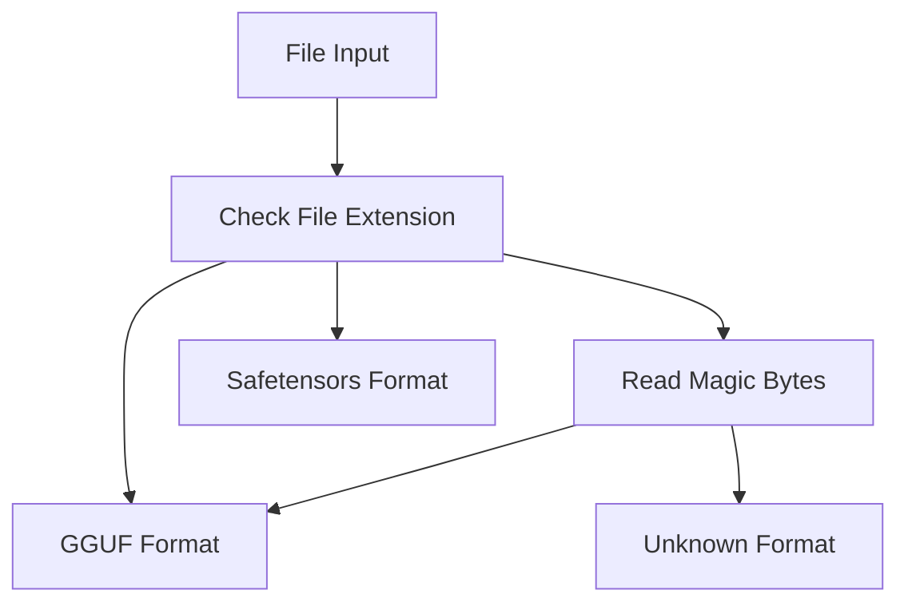
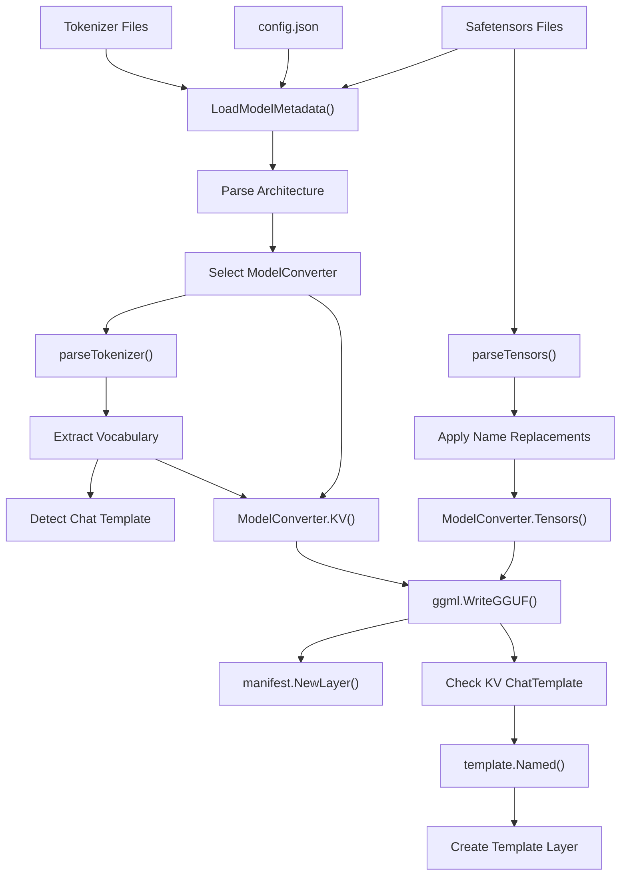
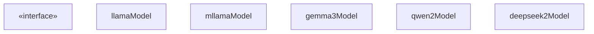
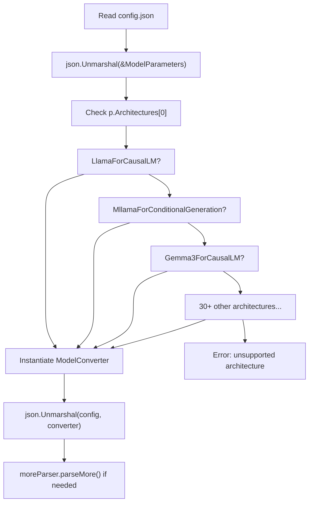
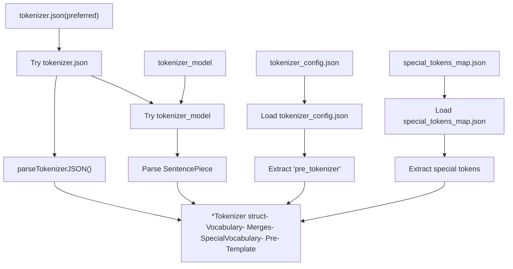
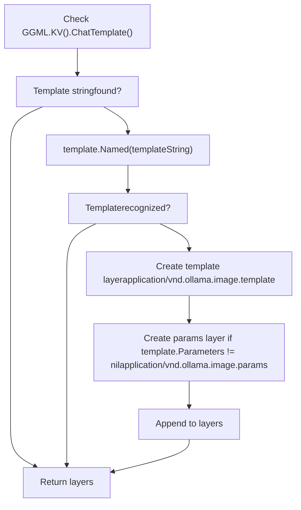
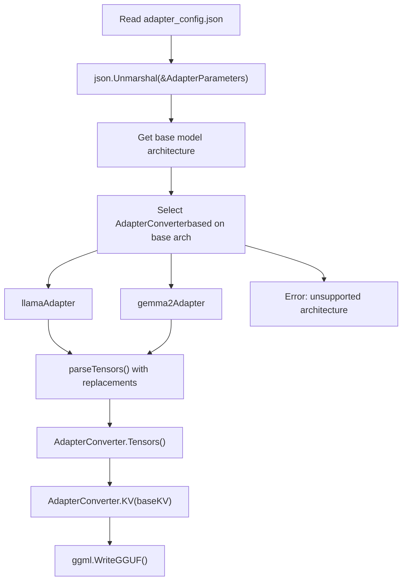
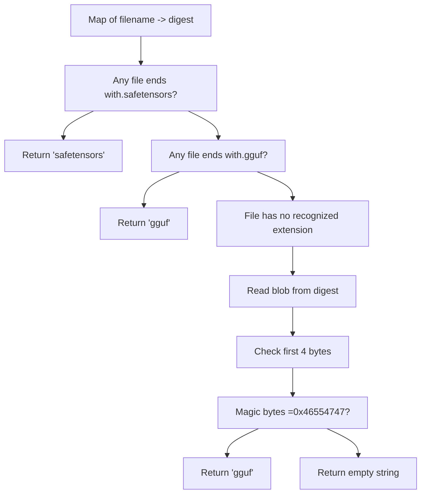

# 模型转换与导入

相关源文件

-   [cmd/cmd\_test.go](https://github.com/ollama/ollama/blob/562c76d7/cmd/cmd_test.go)
-   [convert/convert.go](https://github.com/ollama/ollama/blob/562c76d7/convert/convert.go)
-   [fs/ggml/ggml.go](https://github.com/ollama/ollama/blob/562c76d7/fs/ggml/ggml.go)
-   [fs/ggml/ggml\_test.go](https://github.com/ollama/ollama/blob/562c76d7/fs/ggml/ggml_test.go)
-   [model/models/models.go](https://github.com/ollama/ollama/blob/562c76d7/model/models/models.go)
-   [model/parsers/parsers.go](https://github.com/ollama/ollama/blob/562c76d7/model/parsers/parsers.go)
-   [model/parsers/parsers\_test.go](https://github.com/ollama/ollama/blob/562c76d7/model/parsers/parsers_test.go)
-   [model/renderers/glmocr.go](https://github.com/ollama/ollama/blob/562c76d7/model/renderers/glmocr.go)
-   [model/renderers/glmocr\_test.go](https://github.com/ollama/ollama/blob/562c76d7/model/renderers/glmocr_test.go)
-   [model/renderers/renderer.go](https://github.com/ollama/ollama/blob/562c76d7/model/renderers/renderer.go)
-   [server/create.go](https://github.com/ollama/ollama/blob/562c76d7/server/create.go)
-   [server/model.go](https://github.com/ollama/ollama/blob/562c76d7/server/model.go)
-   [server/routes\_create\_test.go](https://github.com/ollama/ollama/blob/562c76d7/server/routes_create_test.go)
-   [server/routes\_delete\_test.go](https://github.com/ollama/ollama/blob/562c76d7/server/routes_delete_test.go)
-   [server/routes\_list\_test.go](https://github.com/ollama/ollama/blob/562c76d7/server/routes_list_test.go)
-   [server/routes\_test.go](https://github.com/ollama/ollama/blob/562c76d7/server/routes_test.go)

本页记录 Ollama 的模型转换与导入系统，该系统会将外部格式（主要是 HuggingFace/Safetensors）模型转换为 Ollama 内部基于 GGUF 的格式。转换过程可处理 30+ 种模型架构，提取元数据与分词器信息，并创建 Ollama 模型管理系统所需层。

关于 GGUF 格式细节和张量类型，请参见 [模型文件格式](/ollama/ollama/4.4-model-file-formats)。关于已转换模型如何存储与组织，请参见 [模型注册表与层](/ollama/ollama/4.2-model-registry-and-layers)。

## 概览

转换系统是从外部来源导入模型的入口。当用户使用 Safetensors 格式文件创建模型时，Ollama 会将其转换为 GGUF 格式，同时保留全部模型元数据、分词器信息和架构细节。该转换过程具备架构感知能力，并为每个受支持模型家族提供专用转换器。

来源：[convert/convert.go1-394](https://github.com/ollama/ollama/blob/562c76d7/convert/convert.go#L1-L394) [server/create.go317-468](https://github.com/ollama/ollama/blob/562c76d7/server/create.go#L317-L468)

## 支持的输入格式

Ollama 在模型创建中支持两种主要输入格式：

| 格式 | 描述 | 检测方法 | 使用场景 |
| --- | --- | --- | --- |
| **GGUF** | 预转换的 GGML Universal File Format | 魔数：`0x46554747`（LE）或 `0x47475546`（BE） | 已在 Ollama 格式中的模型或来自 llama.cpp 的模型 |
| **Safetensors** | HuggingFace 的张量序列化格式 | 文件扩展名：`.safetensors` | 从 HuggingFace Hub 直接导入 |

系统会通过检查文件扩展名和魔数自动检测输入格式：


**图示：文件格式检测流程**

来源：[server/create.go349-385](https://github.com/ollama/ollama/blob/562c76d7/server/create.go#L349-L385) [fs/ggml/ggml.go541-556](https://github.com/ollama/ollama/blob/562c76d7/fs/ggml/ggml.go#L541-L556)

## 支持的架构

转换系统通过专用转换器支持 30+ 种模型架构。每种架构都有对应转换器，用于理解其特定张量布局和配置：

### 纯文本架构

-   **LlamaForCausalLM**：标准 Llama 模型（Llama 2、Llama 3 等）
-   **MixtralForCausalLM**：Mixtral 混合专家模型
-   **GemmaForCausalLM**：Google Gemma 模型
-   **Gemma2ForCausalLM**：具备架构改进的 Gemma 2
-   **Gemma3ForCausalLM**：最新一代 Gemma
-   **Qwen2ForCausalLM**：Qwen 2 模型
-   **Qwen3NextForCausalLM**：Qwen 3/3.5 模型
-   **Phi3ForCausalLM**：Microsoft Phi-3 模型
-   **CohereForCausalLM**：Cohere Command-R 模型
-   **Olmo3ForCausalLM**：OLMo 3 模型
-   **DeepseekV3ForCausalLM**：DeepSeek V3 模型
-   **Ministral3ForCausalLM**：Ministral 3 模型
-   **Glm4MoeLiteForCausalLM**：GLM-4 MoE Lite 模型
-   **Lfm2ForCausalLM**：LFM-2 模型
-   **Lfm2MoeForCausalLM**：LFM-2 MoE 变体
-   **NemotronHForCausalLM**：Nemotron-H 模型

### 多模态架构

-   **MllamaForConditionalGeneration**：Llama 3.2 Vision（mLlama）
-   **Llama4ForConditionalGeneration**：Llama 4 多模态
-   **Mistral3ForConditionalGeneration**：带视觉能力的 Mistral 3
-   **Gemma3ForConditionalGeneration**：带视觉能力的 Gemma 3
-   **Gemma3nForConditionalGeneration**：Gemma 3n 多模态
-   **Qwen2\_5\_VLForConditionalGeneration**：Qwen 2.5 VL
-   **Qwen3VLForConditionalGeneration**：Qwen 3 VL
-   **Qwen3VLMoeForConditionalGeneration**：Qwen 3 VL MoE
-   **Qwen3\_5ForConditionalGeneration**：Qwen 3.5 多模态
-   **Qwen3\_5MoeForConditionalGeneration**：Qwen 3.5 MoE 多模态
-   **GlmOcrForConditionalGeneration**：GLM OCR 模型
-   **Lfm2VlForConditionalGeneration**：LFM-2 VL 模型

### 专用架构

-   **BertModel**：基于 BERT 的嵌入
-   **NomicBertModel**：Nomic BERT 嵌入
-   **NomicBertMoEModel**：Nomic BERT MoE
-   **GptOssForCausalLM**：GPT-OSS 模型
-   **DeepseekOCRForCausalLM**：DeepSeek OCR 模型

来源：[convert/convert.go272-329](https://github.com/ollama/ollama/blob/562c76d7/convert/convert.go#L272-L329)

## 转换流水线

转换流水线通过多个阶段将外部模型文件转换为 Ollama 内部格式：


**图示：模型转换流水线**

该流水线分为五个主要阶段：

1.  **输入阶段**：从输入目录读取 Safetensors 文件、配置 JSON 和分词器文件
2.  **元数据加载**：解析 `config.json` 以确定架构并选择合适转换器
3.  **分词器处理**：从分词器文件提取词表、merges 与特殊 token
4.  **张量处理**：以架构特定转换将张量转换为 GGUF 格式
5.  **GGUF 生成**：写出最终 GGUF 文件，包含全部元数据与张量数据

来源：[convert/convert.go255-385](https://github.com/ollama/ollama/blob/562c76d7/convert/convert.go#L255-L385) [server/create.go387-468](https://github.com/ollama/ollama/blob/562c76d7/server/create.go#L387-L468)

## ModelConverter 接口

所有架构特定转换器都实现 `ModelConverter` 接口，该接口定义了将模型转换为 GGUF 格式的契约：


**图示：ModelConverter 接口层级**

### 接口方法

| 方法 | 用途 | 返回 |
| --- | --- | --- |
| `KV(*Tokenizer)` | 从模型配置与分词器生成 GGUF 键值元数据 | 带架构特定元数据的 `KV` map |
| `Tensors([]Tensor)` | 通过架构特定修改将输入张量转换为 GGUF 格式 | 可直接写入的 `*ggml.Tensor` 切片 |
| `Replacements()` | 提供张量名称规范化的字符串替换对 | 用于 `strings.Replacer` 的字符串切片 |
| `specialTokenTypes()` | 列出该架构使用的特殊 token 类型 | token 类型名字符串切片 |

来源：[convert/convert.go185-201](https://github.com/ollama/ollama/blob/562c76d7/convert/convert.go#L185-L201)

## 转换过程细节

### Safetensors 到 GGUF 转换

Safetensors 转换过程会创建临时目录、链接 blob 文件并调用转换器：

> **[Mermaid sequence]**
> *(图表结构无法解析)*

**图示：Safetensors 到 GGUF 转换时序**

转换过程如下：

1.  创建用于暂存文件的临时目录：`os.MkdirTemp(envconfig.Models(), "ollama-safetensors")`
2.  从 blob 存储到临时目录创建硬链接，并保留输入文件的相对路径
3.  为安全起见，校验所有路径均位于临时根目录内
4.  以临时目录为根的 `DirFS` 调用 `convert.ConvertModel()`
5.  将转换后的 GGUF 写入临时文件
6.  从 GGUF 输出创建 manifest 层
7.  若可用则检测并添加聊天模板
8.  清理临时目录

来源：[server/create.go387-468](https://github.com/ollama/ollama/blob/562c76d7/server/create.go#L387-L468)

### 元数据提取

元数据提取会加载模型配置并选择合适转换器：


**图示：元数据提取与转换器选择**

`LoadModelMetadata()` 函数执行以下步骤：

1.  从输入文件系统读取 `config.json`
2.  清理可能导致解析失败的非有限 JSON 值（NaN、Inf）
3.  反序列化到 `ModelParameters` 以读取架构字段
4.  基于 `p.Architectures[0]` 选择合适转换器
5.  将完整配置反序列化到所选转换器，以填充架构特定字段
6.  若转换器实现 `moreParser` 接口，则调用 `parseMore()` 处理附加文件

来源：[convert/convert.go255-366](https://github.com/ollama/ollama/blob/562c76d7/convert/convert.go#L255-L366)

### 分词器解析

分词器解析会从多个潜在源文件中提取词表、merges 和特殊 token：


**图示：分词器解析过程**

系统优先使用 `tokenizer.json`（HuggingFace 的统一格式），但会回退到 `tokenizer_model`（SentencePiece 格式）。特殊 token 会从主分词器文件或单独的 `special_tokens_map.json` 加载。

分词器解析后会进行词表大小校验。若模型声明的词表大小与分词器不一致：

-   **大于实际值**：用虚拟 token `[PAD0]`、`[PAD1]` 等补齐
-   **小于实际值**：记录警告并使用实际大小

来源：[convert/convert.go346-365](https://github.com/ollama/ollama/blob/562c76d7/convert/convert.go#L346-L365)

### 聊天模板检测

GGUF 转换完成后，系统会尝试检测并自动配置聊天模板：


**图示：聊天模板检测流程**

`detectChatTemplate()` 函数会：

1.  检查 GGUF 文件是否包含 `tokenizer.chat_template` 键值
2.  若存在，在 Ollama 命名模板注册表中查找该模板字符串
3.  若匹配成功，创建包含模板内容的模板层
4.  若模板带有关联参数，则额外创建参数层
5.  将两层都追加到模型层列表

这使模型无需在 Modelfile 中显式配置即可自动使用合适的聊天模板。

来源：[server/model.go79-111](https://github.com/ollama/ollama/blob/562c76d7/server/model.go#L79-L111)

### 适配器转换

LoRA 适配器转换遵循类似但更简化的流程：


**图示：适配器转换流程**

适配器转换与完整模型转换有以下差异：

1.  使用 `adapter_config.json` 而非 `config.json`
2.  需要基础模型的 KV 数据以正确配置适配器
3.  在 GGUF 元数据中将 `general.type` 设为 `"adapter"`
4.  仅支持已实现 `AdapterConverter` 类型的架构
5.  创建媒体类型为 `application/vnd.ollama.image.adapter` 的层

`AdapterConverter` 接口与 `ModelConverter` 类似，但会接收基础模型配置：

```
type AdapterConverter interface {    KV(ofs.Config) KV    Tensors([]Tensor) []*ggml.Tensor    Replacements() []string}
```
来源：[convert/convert.go207-253](https://github.com/ollama/ollama/blob/562c76d7/convert/convert.go#L207-L253) [server/create.go432-441](https://github.com/ollama/ollama/blob/562c76d7/server/create.go#L432-L441)

## 文件检测与类型解析

当扩展名不明确时，系统会使用多种策略检测文件类型：


**图示：文件类型检测策略**

`detectModelTypeFromFiles()` 函数实现了级联检测策略：

1.  **主检测**：检查任意文件名是否以 `.safetensors` 结尾 → 返回 `"safetensors"`
2.  **次级检测**：检查任意文件名是否以 `.gguf` 结尾 → 返回 `"gguf"`
3.  **回退检测**：对于无扩展名文件：
    -   将 digest 解析为 blob 路径
    -   读取前 4 字节
    -   检查 GGUF 魔数（`0x46554747`）
    -   若匹配返回 `"gguf"`，否则返回空字符串

这使用户即使没有 `.gguf` 扩展名，也可从 GGUF 文件创建模型（前提是文件已在 blob 存储中）。

来源：[server/create.go349-385](https://github.com/ollama/ollama/blob/562c76d7/server/create.go#L349-L385)

## 与创建流程的集成

转换系统通过 `CreateHandler` 与模型创建 API 集成：

> **[Mermaid sequence]**
> *(图表结构无法解析)*

**图示：带转换的模型创建**

集成流程如下：

1.  客户端提交带有 digest 引用的文件映射
2.  `CreateHandler` 校验 digest 和文件路径
3.  调用 `convertModelFromFiles()` 检测类型并转换
4.  对于 Safetensors：创建临时目录、链接文件、运行转换
5.  对于 GGUF：校验格式并封装为层结构
6.  应用可选量化（见 [量化](/ollama/ollama/4.6-quantization)）
7.  添加模板、系统提示词和参数层
8.  将 manifest 写入存储

来源：[server/create.go46-270](https://github.com/ollama/ollama/blob/562c76d7/server/create.go#L46-L270)
