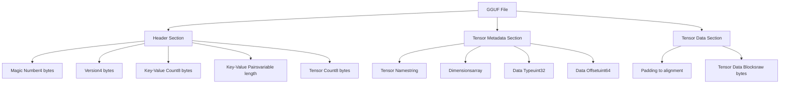
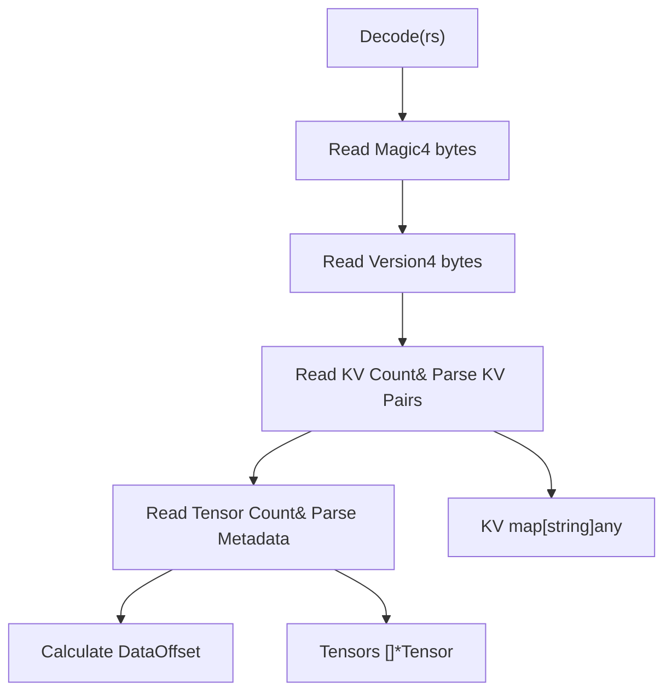
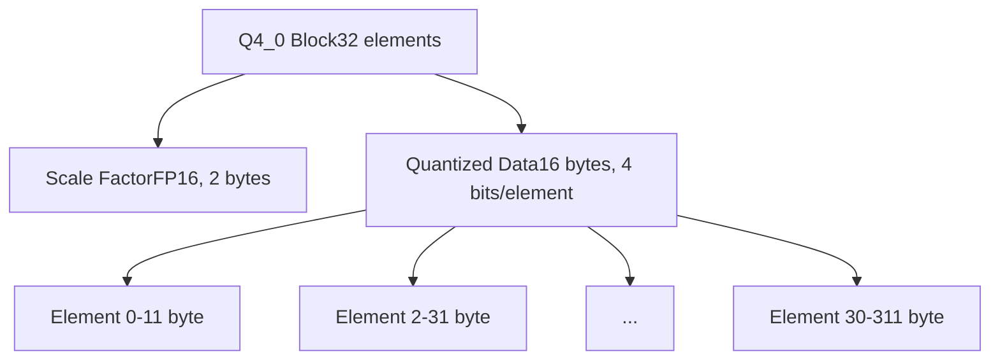
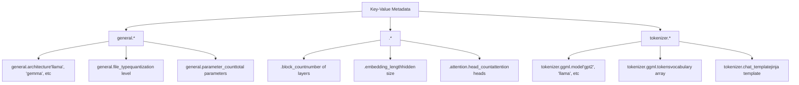
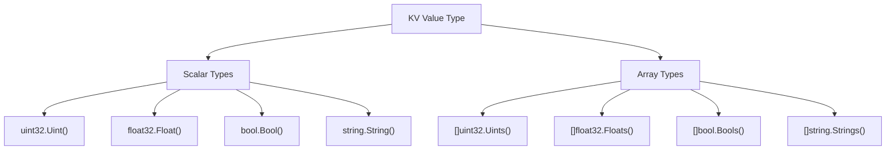
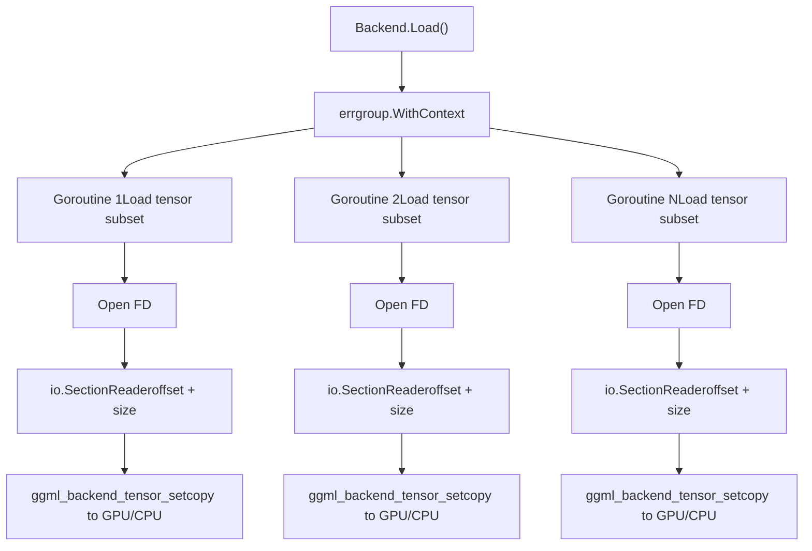
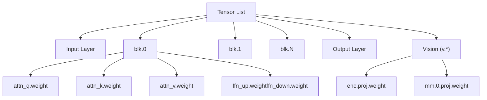
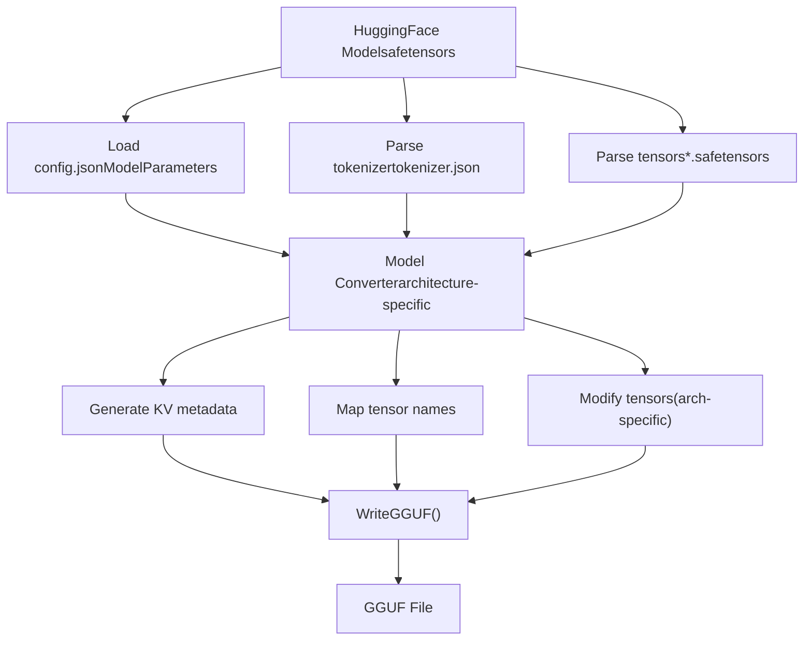
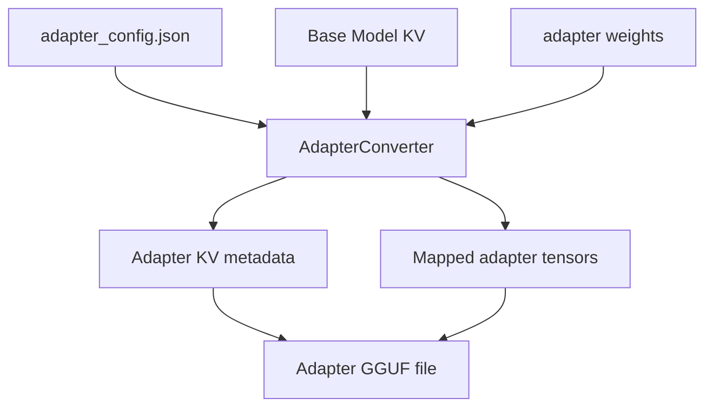

# 模型文件格式

相关源文件

-   [convert/convert.go](https://github.com/ollama/ollama/blob/562c76d7/convert/convert.go)
-   [fs/ggml/ggml.go](https://github.com/ollama/ollama/blob/562c76d7/fs/ggml/ggml.go)
-   [fs/ggml/ggml\_test.go](https://github.com/ollama/ollama/blob/562c76d7/fs/ggml/ggml_test.go)
-   [integration/embed\_test.go](https://github.com/ollama/ollama/blob/562c76d7/integration/embed_test.go)
-   [kvcache/cache.go](https://github.com/ollama/ollama/blob/562c76d7/kvcache/cache.go)
-   [kvcache/causal.go](https://github.com/ollama/ollama/blob/562c76d7/kvcache/causal.go)
-   [kvcache/causal\_test.go](https://github.com/ollama/ollama/blob/562c76d7/kvcache/causal_test.go)
-   [kvcache/encoder.go](https://github.com/ollama/ollama/blob/562c76d7/kvcache/encoder.go)
-   [kvcache/wrapper.go](https://github.com/ollama/ollama/blob/562c76d7/kvcache/wrapper.go)
-   [ml/backend.go](https://github.com/ollama/ollama/blob/562c76d7/ml/backend.go)
-   [ml/backend/ggml/ggml.go](https://github.com/ollama/ollama/blob/562c76d7/ml/backend/ggml/ggml.go)
-   [model/input/input.go](https://github.com/ollama/ollama/blob/562c76d7/model/input/input.go)
-   [model/model.go](https://github.com/ollama/ollama/blob/562c76d7/model/model.go)
-   [model/model\_test.go](https://github.com/ollama/ollama/blob/562c76d7/model/model_test.go)
-   [model/models/models.go](https://github.com/ollama/ollama/blob/562c76d7/model/models/models.go)
-   [model/parsers/parsers.go](https://github.com/ollama/ollama/blob/562c76d7/model/parsers/parsers.go)
-   [model/parsers/parsers\_test.go](https://github.com/ollama/ollama/blob/562c76d7/model/parsers/parsers_test.go)
-   [model/renderers/glmocr.go](https://github.com/ollama/ollama/blob/562c76d7/model/renderers/glmocr.go)
-   [model/renderers/glmocr\_test.go](https://github.com/ollama/ollama/blob/562c76d7/model/renderers/glmocr_test.go)
-   [model/renderers/renderer.go](https://github.com/ollama/ollama/blob/562c76d7/model/renderers/renderer.go)
-   [runner/llamarunner/cache.go](https://github.com/ollama/ollama/blob/562c76d7/runner/llamarunner/cache.go)
-   [runner/llamarunner/runner.go](https://github.com/ollama/ollama/blob/562c76d7/runner/llamarunner/runner.go)
-   [runner/ollamarunner/cache.go](https://github.com/ollama/ollama/blob/562c76d7/runner/ollamarunner/cache.go)
-   [runner/ollamarunner/cache\_test.go](https://github.com/ollama/ollama/blob/562c76d7/runner/ollamarunner/cache_test.go)
-   [runner/ollamarunner/runner.go](https://github.com/ollama/ollama/blob/562c76d7/runner/ollamarunner/runner.go)
-   [server/internal/internal/backoff/backoff.go](https://github.com/ollama/ollama/blob/562c76d7/server/internal/internal/backoff/backoff.go)

本页记录了 Ollama 用于存储和加载模型的文件格式，重点是 GGUF（GGML Universal File）格式。内容涵盖二进制结构、张量编码、量化类型、元数据组织，以及代码库如何读取并处理这些文件。

关于从其他格式（例如 safetensors）转换模型，请参见 [模型转换与导入](/ollama/ollama/4.3-model-conversion-and-import)。关于量化如何影响模型性能，请参见 [量化](/ollama/ollama/4.6-quantization)。

## 概览

Ollama 将 GGUF 作为其主要模型文件格式。GGUF 是一种用于高效存储以下内容的二进制格式：

-   模型架构元数据（键值对）
-   分词器配置
-   各种数据类型与量化方案下的张量权重
-   视觉模型投影器和适配器

该格式支持小端与大端字节序，但在现代系统上通常使用小端。

来源：[fs/ggml/ggml.go520-596](https://github.com/ollama/ollama/blob/562c76d7/fs/ggml/ggml.go#L520-L596)

## GGUF 文件结构

### 文件头与魔数

GGUF 文件以 4 字节魔数开头，用于标识格式和字节序：

```
Little-endian: 0x46554747 ("GGUF")
Big-endian:    0x47475546 ("GGUF")
```
文件结构由三个主要区段组成：


**文件检测**

`DetectContentType` 函数通过读取前 4 个字节来识别文件格式：

来源：[fs/ggml/ggml.go541-556](https://github.com/ollama/ollama/blob/562c76d7/fs/ggml/ggml.go#L541-L556) [fs/ggml/ggml.go562-596](https://github.com/ollama/ollama/blob/562c76d7/fs/ggml/ggml.go#L562-L596)

### 容器实现

`containerGGUF` 结构负责解码：


该容器支持限制元数据中的数组大小，以避免在初次文件检查时将大型数组加载到内存。

来源：[fs/ggml/ggml.go562-596](https://github.com/ollama/ollama/blob/562c76d7/fs/ggml/ggml.go#L562-L596)

## 张量类型与量化

### 数据类型枚举

GGUF 支持多种张量数据类型，每种类型都有特定存储特征：

| 类型 | 常量 | 每元素字节数 | 块大小 | 使用场景 |
| --- | --- | --- | --- | --- |
| F32 | `TensorTypeF32` (0) | 4 | 1 | 全精度 |
| F16 | `TensorTypeF16` (1) | 2 | 1 | 半精度 |
| Q4\_0 | `TensorTypeQ4_0` (2) | 每元素 0.5625 | 32 | 4 位量化 |
| Q4\_1 | `TensorTypeQ4_1` (3) | 每元素 0.625 | 32 | 带偏置的 4 位 |
| Q8\_0 | `TensorTypeQ8_0` (8) | 每元素 1.0625 | 32 | 8 位量化 |
| Q8\_K | `TensorTypeQ8_K` (15) | 可变 | 256 | K-quant 8 位 |
| BF16 | `TensorTypeBF16` (30) | 2 | 1 | Brain float 16 |
| MXFP4 | `TensorTypeMXFP4` (4, 39) | 每元素 0.53125 | 32 | Microscaling FP4 |

来源：[fs/ggml/ggml.go405-429](https://github.com/ollama/ollama/blob/562c76d7/fs/ggml/ggml.go#L405-L429) [fs/ggml/ggml.go434-502](https://github.com/ollama/ollama/blob/562c76d7/fs/ggml/ggml.go#L434-L502)

### 量化块结构

量化类型以块形式存储数据。例如，Q4\_0 使用 32 元素块：


`TypeSize` 方法计算每个块的存储需求：

```
Q4_0: 2 (scale) + 32/2 (data) = 18 bytes per 32 elements
Q8_0: 2 (scale) + 32 (data) = 34 bytes per 32 elements
```
来源：[fs/ggml/ggml.go434-502](https://github.com/ollama/ollama/blob/562c76d7/fs/ggml/ggml.go#L434-L502)

### 大小计算

`Tensor` 上的 `Size()` 方法计算总存储大小：

```
Size = Elements * TypeSize / BlockSize
```
对于形状 `[4096, 4096]`、类型为 Q4\_0 的张量：

-   元素数：16,777,216
-   TypeSize：18 字节
-   BlockSize：32
-   大小：16,777,216 \* 18 / 32 = 9,437,184 字节

来源：[fs/ggml/ggml.go512-514](https://github.com/ollama/ollama/blob/562c76d7/fs/ggml/ggml.go#L512-L514)

### 特殊类型处理

后端在加载期间处理特殊类型转换：

**MXFP4 变换**

原始 MXFP4 数据（类型 4）会通过字节重排转换为 GGML MXFP4 格式（类型 39）：

```
Input:  a1 b2 c3 ... x7 y8 z9
Output: 71 xa 82 yb 93 zc
```
**BF16 到 F32 转换**

对于 `_exps.bias` 等特定张量，BF16 数据会在加载时转换为 F32：

来源：[ml/backend/ggml/ggml.go266-274](https://github.com/ollama/ollama/blob/562c76d7/ml/backend/ggml/ggml.go#L266-L274) [ml/backend/ggml/ggml.go528-595](https://github.com/ollama/ollama/blob/562c76d7/ml/backend/ggml/ggml.go#L528-L595)

## 元数据键值系统

### 架构特定键

KV 系统使用带架构前缀的层级命名方案：


### 键解析

`keyValue` 函数实现自动前缀解析：

```
// If key doesn't start with "tokenizer." or "general."// it gets prefixed with the architecture namekey = architecture + "." + key // Example:// Input: "block_count"// Architecture: "llama"// Resolved: "llama.block_count"
```
来源：[fs/ggml/ggml.go315-326](https://github.com/ollama/ollama/blob/562c76d7/fs/ggml/ggml.go#L315-L326) [convert/convert.go62-71](https://github.com/ollama/ollama/blob/562c76d7/convert/convert.go#L62-L71)

### 数据类型支持

KV 系统支持多种值类型，并提供类型安全访问器：


### 可变长度数组

某些键（如 `attention.head_count`）可能是单值或数组。`UintOrArrayValueAsArray` 方法会将它们归一化：

```
// Single value becomes array of length 1headCount := kv.UintOrArrayValueAsArray("attention.head_count", defaultValue) // If value is scalar: headCount = [value]// If value is array: headCount = values// Ensures layer-by-layer configuration
```
来源：[fs/ggml/ggml.go221-238](https://github.com/ollama/ollama/blob/562c76d7/fs/ggml/ggml.go#L221-L238) [fs/ggml/ggml.go63-111](https://github.com/ollama/ollama/blob/562c76d7/fs/ggml/ggml.go#L63-L111)

## 文件读取与张量加载

### 解码过程

主解码流程：

> **[Mermaid sequence]**
> *(图表结构无法解析)*

来源：[fs/ggml/ggml.go562-596](https://github.com/ollama/ollama/blob/562c76d7/fs/ggml/ggml.go#L562-L596)

### 后端张量加载

GGML 后端使用 goroutine 并行加载张量：


每个 goroutine 会：

1.  打开独立文件描述符（用于顺序读取）
2.  为其张量数据范围创建 section reader
3.  分块流式读取数据（128 KB 缓冲区）
4.  通过 `ggml_backend_tensor_set` 复制到后端内存
5.  通过回调上报进度

来源：[ml/backend/ggml/ggml.go468-645](https://github.com/ollama/ollama/blob/562c76d7/ml/backend/ggml/ggml.go#L468-L645)

### 内存对齐与填充

张量在内存中按对齐方式存储，以获得最佳访问性能：

```
func pad(length, pad C.size_t) C.size_t {    return ((length + pad - 1) / pad) * pad} // Example: align to 32 bytessize := pad(tensorSize, 32)
```
对齐方式由后端缓冲区类型决定：

```
C.ggml_backend_buft_get_alignment(bt)
```
来源：[ml/backend/ggml/ggml.go885-887](https://github.com/ollama/ollama/blob/562c76d7/ml/backend/ggml/ggml.go#L885-L887) [ml/backend/ggml/ggml.go281-286](https://github.com/ollama/ollama/blob/562c76d7/ml/backend/ggml/ggml.go#L281-L286)

## 张量组织与命名

### 命名约定

张量遵循层级命名模式：

```
token_embd.weight           - Input embeddings
blk.0.attn_q.weight        - Layer 0 query projection
blk.0.attn_k.weight        - Layer 0 key projection
blk.15.ffn_up.weight       - Layer 15 feed-forward up
output.weight              - Output projection
v.enc.proj.weight          - Vision encoder projection
```
### 层分组

`GroupLayers` 方法按层组织张量：


这种分组可用于：

-   计算逐层内存需求
-   GPU 层分配
-   高效层迭代

来源：[fs/ggml/ggml.go348-369](https://github.com/ollama/ollama/blob/562c76d7/fs/ggml/ggml.go#L348-L369)

### 张量名称替换

模型创建期间，张量名称可能被重映射。`tensorLoadTargets` 映射会跟踪源到目标名称映射：

```
// One source tensor may map to multiple destinationstensorLoadTargets["token_embd.weight"] = []string{    "token_embd.weight",    "output.weight",  // shared weight for output}
```
这可支持：

-   权重共享（例如 tied embeddings）
-   架构特定重映射
-   Adapter/LoRA 覆盖

来源：[ml/backend/ggml/ggml.go86-88](https://github.com/ollama/ollama/blob/562c76d7/ml/backend/ggml/ggml.go#L86-L88) [ml/backend/ggml/ggml.go241-293](https://github.com/ollama/ollama/blob/562c76d7/ml/backend/ggml/ggml.go#L241-L293)

## 文件创建与写入

### GGUF 写入

`WriteGGUF` 函数根据 KV 元数据和张量创建 GGUF 文件：

> **[Mermaid sequence]**
> *(图表结构无法解析)*

**形状反转**

与许多框架相比，GGUF 会以反向顺序存储张量维度：

```
for i := range ts {    ts[i].Shape = slices.Clone(ts[i].Shape)    slices.Reverse(ts[i].Shape)  // [4096, 4096] -> [4096, 4096]}
```
来源：[convert/convert.go387-393](https://github.com/ollama/ollama/blob/562c76d7/convert/convert.go#L387-L393)

### 模型转换流程

从 safetensors/HuggingFace 格式转换：


每种架构（llama、gemma、qwen 等）都实现 `ModelConverter` 接口：

```
type ModelConverter interface {    KV(*Tokenizer) KV    Tensors([]Tensor) []*ggml.Tensor    Replacements() []string}
```
来源：[convert/convert.go185-201](https://github.com/ollama/ollama/blob/562c76d7/convert/convert.go#L185-L201) [convert/convert.go372-385](https://github.com/ollama/ollama/blob/562c76d7/convert/convert.go#L372-L385)

## Adapter 与 LoRA 文件

### Adapter 格式

LoRA 适配器使用相同的 GGUF 格式，但包含特定元数据：

```
general.type = "adapter"
adapter.type = "lora"
adapter.lora.alpha = <float>
```
适配器张量名称与基础模型层保持匹配：

```
blk.0.attn_q.weight.loraA
blk.0.attn_q.weight.loraB
```
### Adapter 加载

适配器转换流程：


来源：[convert/convert.go217-253](https://github.com/ollama/ollama/blob/562c76d7/convert/convert.go#L217-L253)

## 性能考量

### 缓冲读取

文件解码使用缓冲读取器以提高效率：

```
rs = bufioutil.NewBufferedSeeker(rs, 32<<10)  // 32 KB buffer
```
### 并行张量加载

后端会基于 CPU 数量限制并发张量加载：

```
g.SetLimit(runtime.GOMAXPROCS(0))
```
每个 goroutine 处理一个张量，并以 128 KB 分块流式读取：

```
bts := make([]byte, 128*format.KibiByte)
```
### 进度上报

加载会跟踪所有张量的整体进度：

```
doneBytes.Add(uint64(n))progress(float32(done) / float32(totalBytes))
```
来源：[ml/backend/ggml/ggml.go496-625](https://github.com/ollama/ollama/blob/562c76d7/ml/backend/ggml/ggml.go#L496-L625)

## 文件格式校验

### 支持格式检测

系统会在处理前校验文件格式：

```
func DetectContentType(b []byte) string {    switch binary.LittleEndian.Uint32(b[:4]) {    case FILE_MAGIC_GGUF_LE, FILE_MAGIC_GGUF_BE:        return "gguf"    default:        return ""    }}
```
遗留格式（GGML、GGMF、GGJT、GGLA）可被检测到，但可能未完全支持。

来源：[fs/ggml/ggml.go541-556](https://github.com/ollama/ollama/blob/562c76d7/fs/ggml/ggml.go#L541-L556)

### 张量校验

后端在分配期间会校验张量形状和类型：

```
if !ggml_backend_buft_supports_backend(bt, backend) {    // Skip if buffer type doesn't support this tensor}
```
来源：[ml/backend/ggml/ggml.go287-290](https://github.com/ollama/ollama/blob/562c76d7/ml/backend/ggml/ggml.go#L287-L290)
