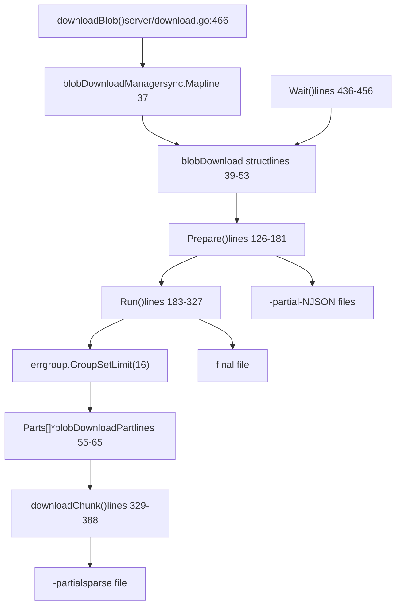
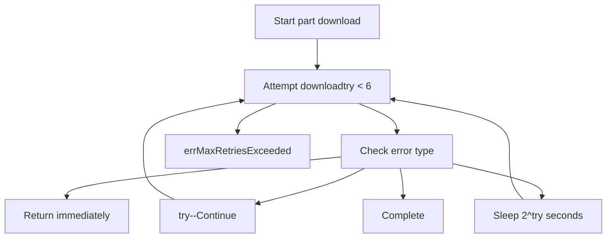
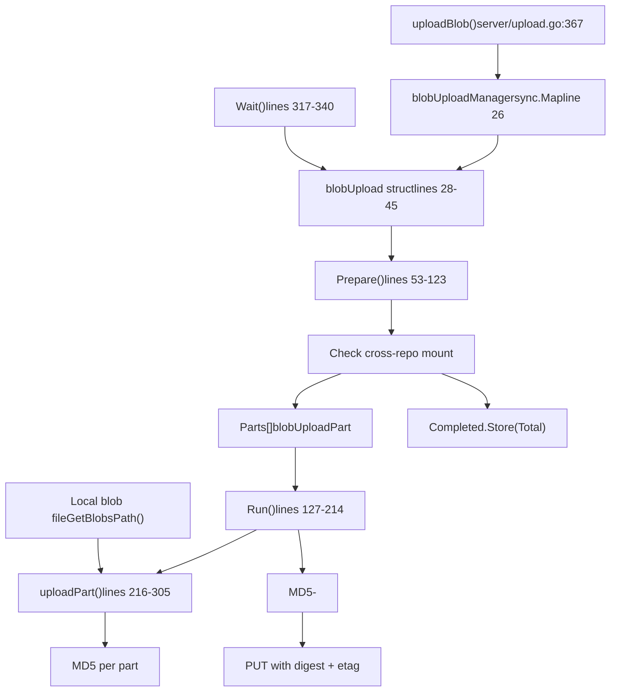

# Blob 传输与认证

相关源文件

-   [auth/auth.go](https://github.com/ollama/ollama/blob/562c76d7/auth/auth.go)
-   [server/auth.go](https://github.com/ollama/ollama/blob/562c76d7/server/auth.go)
-   [server/auth\_test.go](https://github.com/ollama/ollama/blob/562c76d7/server/auth_test.go)
-   [server/download.go](https://github.com/ollama/ollama/blob/562c76d7/server/download.go)
-   [server/sparse\_common.go](https://github.com/ollama/ollama/blob/562c76d7/server/sparse_common.go)
-   [server/sparse\_windows.go](https://github.com/ollama/ollama/blob/562c76d7/server/sparse_windows.go)
-   [server/upload.go](https://github.com/ollama/ollama/blob/562c76d7/server/upload.go)
-   [types/errtypes/errtypes.go](https://github.com/ollama/ollama/blob/562c76d7/types/errtypes/errtypes.go)

## 目的与范围

本页记录 Ollama 的 blob 下载与上传协议，包括并行传输机制、断点续传能力和认证系统。Blob 是 Ollama 内容寻址系统中模型数据的基础存储单元。关于 blob 在模型注册表结构中的位置，请参见 [模型注册表与层](/ollama/ollama/4.2-model-registry-and-layers)。关于 GGUF blob 格式细节，请参见 [模型文件格式](/ollama/ollama/4.4-model-file-formats)。

**来源：** [server/download.go](https://github.com/ollama/ollama/blob/562c76d7/server/download.go) [server/upload.go](https://github.com/ollama/ollama/blob/562c76d7/server/upload.go)

---

## 内容寻址存储

Ollama 在内容寻址系统中存储 blob，每个 blob 由其 SHA256 摘要标识。Blob 存储在 `~/.ollama/blobs/` 目录中，文件名与其摘要匹配。

### Blob 路径结构

`GetBlobsPath` 函数将摘要转换为文件系统路径：

```
~/.ollama/blobs/sha256-<64-character-hex-digest>
```
摘要格式必须匹配 `sha256[:-][0-9a-fA-F]{64}`。同时接受冒号（`:`）和连字符（`-`）分隔符，但内部统一存为连字符分隔，以确保文件系统兼容性。

**路径校验：**

-   输入：`sha256:456402914e838a953e0cf80caa6adbe75383d9e63584a964f504a7bbb8f7aad9`
-   存储：`~/.ollama/blobs/sha256-456402914e838a953e0cf80caa6adbe75383d9e63584a964f504a7bbb8f7aad9`

**来源：** [server/modelpath.go125-146](https://github.com/ollama/ollama/blob/562c76d7/server/modelpath.go#L125-L146)

### 部分文件管理

下载期间，系统会创建支持续传的临时文件，命名约定如下：

| 文件类型 | 命名模式 | 用途 |
| --- | --- | --- |
| 主部分文件 | `<blob-path>-partial` | 包含所有下载分片的稀疏文件 |
| 分片元数据 | `<blob-path>-partial-<N>` | 用于断点续传的 JSON 元数据 |

**来源：** [server/download.go103-107](https://github.com/ollama/ollama/blob/562c76d7/server/download.go#L103-L107) [server/download.go218-223](https://github.com/ollama/ollama/blob/562c76d7/server/download.go#L218-L223)

### 稀疏文件优化

在 Windows 上，下载文件会被标记为稀疏文件，以避免为未填充区域分配磁盘空间。该优化允许文件立即截断到完整 blob 大小，同时在写入数据前不消耗对应磁盘空间。

**来源：** [server/sparse\_windows.go9-17](https://github.com/ollama/ollama/blob/562c76d7/server/sparse_windows.go#L9-L17) [server/sparse\_common.go7-8](https://github.com/ollama/ollama/blob/562c76d7/server/sparse_common.go#L7-L8)

---

## 下载协议

### 下载架构


**来源：** [server/download.go39-66](https://github.com/ollama/ollama/blob/562c76d7/server/download.go#L39-L66) [server/download.go126-327](https://github.com/ollama/ollama/blob/562c76d7/server/download.go#L126-L327) [server/download.go466-507](https://github.com/ollama/ollama/blob/562c76d7/server/download.go#L466-L507)

### 分片大小计算

下载系统会根据总大小将 blob 切分为并行分片：

| 配置 | 值 | 来源 |
| --- | --- | --- |
| 分片数量 | 16 | `numDownloadParts` [server/download.go98](https://github.com/ollama/ollama/blob/562c76d7/server/download.go#L98-L98) |
| 最小分片大小 | 100 MB | `minDownloadPartSize` [server/download.go99](https://github.com/ollama/ollama/blob/562c76d7/server/download.go#L99-L99) |
| 最大分片大小 | 1000 MB | `maxDownloadPartSize` [server/download.go100](https://github.com/ollama/ollama/blob/562c76d7/server/download.go#L100-L100) |

**分片大小算法：**

1.  计算 `size = total / 16`
2.  将其限制在 `[100MB, 1000MB]` 范围内
3.  按该大小划分 blob
4.  最后一个分片可能更小以匹配总大小

**来源：** [server/download.go97-101](https://github.com/ollama/ollama/blob/562c76d7/server/download.go#L97-L101) [server/download.go154-173](https://github.com/ollama/ollama/blob/562c76d7/server/download.go#L154-L173)

### 断点续传能力

下载系统通过持久化分片元数据支持中断后续传：

> **[Mermaid sequence]**
> *(图表结构无法解析)*

**分片元数据结构（JSON）：**

```
{  "N": 0,  "Offset": 0,  "Size": 104857600,  "Completed": 52428800}
```
**来源：** [server/download.go126-181](https://github.com/ollama/ollama/blob/562c76d7/server/download.go#L126-L181) [server/download.go400-424](https://github.com/ollama/ollama/blob/562c76d7/server/download.go#L400-L424)

### 并行下载执行

每个分片通过 HTTP Range 请求独立下载：

**Range Header 格式：**

```
Range: bytes={StartsAt}-{StopsAt-1}
```
其中：

-   `StartsAt() = Offset + Completed` - 续传起点
-   `StopsAt() = Offset + Size` - 分片终点

**并发控制：**

-   使用 `errgroup.WithContext` 并设置 `SetLimit(16)`
-   限制活跃分片下载为最多 16 个并发请求
-   出错时自动取消剩余分片

**来源：** [server/download.go273-305](https://github.com/ollama/ollama/blob/562c76d7/server/download.go#L273-L305) [server/download.go329-357](https://github.com/ollama/ollama/blob/562c76d7/server/download.go#L329-L357)

### 重试与退避策略

下载系统实现了多层重试机制：

#### 分片级重试逻辑


**重试配置：**

-   最大重试次数：6（`maxRetries` 常量）
-   退避公式：`2^try` 秒
-   停滞分片不计入重试上限

**来源：** [server/download.go29](https://github.com/ollama/ollama/blob/562c76d7/server/download.go#L29-L29) [server/download.go282-304](https://github.com/ollama/ollama/blob/562c76d7/server/download.go#L282-L304)

#### 停滞检测

一个独立 goroutine 会监控每个分片是否停滞：

**停滞检测逻辑：**

-   检查间隔：1 秒
-   停滞阈值：30 秒无进度
-   发生停滞：返回 `errPartStalled` 触发重试
-   停滞重试不消耗重试配额

**来源：** [server/download.go33](https://github.com/ollama/ollama/blob/562c76d7/server/download.go#L33-L33) [server/download.go359-385](https://github.com/ollama/ollama/blob/562c76d7/server/download.go#L359-L385)

#### 直连 URL 退避

获取直连下载 URL 时（用于基于重定向的 CDN 加速）会应用单独退避策略：

**退避特征：**

-   公式：`min(n^2 * 10ms, 10s)` 并带随机化
-   随机化范围：计算延迟的 `0.5x` 到 `1.5x`
-   可防止惊群问题

**来源：** [server/download.go188-212](https://github.com/ollama/ollama/blob/562c76d7/server/download.go#L188-L212) [server/download.go227-268](https://github.com/ollama/ollama/blob/562c76d7/server/download.go#L227-L268)

### 重定向处理

下载系统针对 CDN 重定向进行了优化：

1.  使用自定义 `CheckRedirect` 处理器向注册表发起**初始请求**
2.  当主机名与注册表不同步时**捕获重定向 URL**
3.  直接从 CDN URL 执行**并行下载**
4.  对重定向 URL **不再认证**（已预认证）

**重定向限制：**

-   最多 10 次重定向
-   在首次主机名变化处停止
-   超限返回 `errMaxRedirectsExceeded`

**来源：** [server/download.go34](https://github.com/ollama/ollama/blob/562c76d7/server/download.go#L34-L34) [server/download.go227-268](https://github.com/ollama/ollama/blob/562c76d7/server/download.go#L227-L268)

---

## 上传协议

### 上传架构


**来源：** [server/upload.go28-45](https://github.com/ollama/ollama/blob/562c76d7/server/upload.go#L28-L45) [server/upload.go53-214](https://github.com/ollama/ollama/blob/562c76d7/server/upload.go#L53-L214) [server/upload.go367-403](https://github.com/ollama/ollama/blob/562c76d7/server/upload.go#L367-L403)

### 跨仓库 Blob 挂载

上传前，系统会先尝试从同一注册表中的其他仓库挂载 blob（若已存在）：

**挂载请求：**

```
POST /v2/{namespace}/{repository}/blobs/uploads/?mount={digest}&from={source-repo}
```
**挂载响应：**

-   `201 Created`：blob 挂载成功，跳过上传
-   其他状态：继续执行上传

该优化可避免对内容完全相同但模型名不同的 blob 进行重复上传。

**来源：** [server/upload.go59-65](https://github.com/ollama/ollama/blob/562c76d7/server/upload.go#L59-L65) [server/upload.go84-89](https://github.com/ollama/ollama/blob/562c76d7/server/upload.go#L84-L89)

### 上传会话管理

注册表会为分块上传提供会话 URL：

**会话头：**

```
Docker-Upload-Location: <upload-session-url>
Location: <upload-session-url>
```
`nextURL` 通道用于串联分片上传：

1.  Prepare 接收初始会话 URL
2.  每个 `uploadPart` 从 `nextURL` 通道读取
3.  分片上传成功后，将下一 URL 写回通道
4.  若服务器不支持重定向，可序列化上传

**来源：** [server/upload.go72-76](https://github.com/ollama/ollama/blob/562c76d7/server/upload.go#L72-L76) [server/upload.go120-122](https://github.com/ollama/ollama/blob/562c76d7/server/upload.go#L120-L122) [server/upload.go148-151](https://github.com/ollama/ollama/blob/562c76d7/server/upload.go#L148-L151)

### 并行上传执行

上传分片采用与下载类似的分片逻辑，但处理方式不同：

> **[Mermaid sequence]**
> *(图表结构无法解析)*

**来源：** [server/upload.go144-173](https://github.com/ollama/ollama/blob/562c76d7/server/upload.go#L144-L173) [server/upload.go216-305](https://github.com/ollama/ollama/blob/562c76d7/server/upload.go#L216-L305)

### 上传分片头

每个分片都会携带特定头：

| Header | 值 | 用途 |
| --- | --- | --- |
| `Content-Type` | `application/octet-stream` | 二进制数据 |
| `Content-Length` | 分片字节大小 | 上传大小 |
| `Content-Range` | `{offset}-{offset+size-1}` | 分片位置（仅 PATCH） |
| `X-Redirect-Uploads` | `1` | 请求重定向支持（仅 PATCH） |

**来源：** [server/upload.go217-224](https://github.com/ollama/ollama/blob/562c76d7/server/upload.go#L217-L224)

### MD5 校验和与 ETag

上传系统会生成多分片 MD5 ETag 以进行完整性校验：

**ETag 格式：**

```
{hex-md5-of-concatenated-part-md5s}-{part-count}
```
**计算过程：**

1.  每个分片在上传时计算 MD5
2.  最终提交阶段拼接所有分片 MD5
3.  对拼接结果再次计算 MD5
4.  以连字符追加分片数量

**提交请求：**

```
PUT {session-url}?digest={sha256-digest}&etag={md5-hash}-{parts}
Content-Type: application/octet-stream
Content-Length: 0
```
**来源：** [server/upload.go183-196](https://github.com/ollama/ollama/blob/562c76d7/server/upload.go#L183-L196) [server/upload.go226-230](https://github.com/ollama/ollama/blob/562c76d7/server/upload.go#L226-L230) [server/upload.go302-303](https://github.com/ollama/ollama/blob/562c76d7/server/upload.go#L302-L303)

### 上传重试逻辑

上传重试模式与下载类似：

**分片级重试：**

-   每个分片最多重试 6 次
-   指数退避：`2^try` 秒
-   上下文取消时立即返回

**提交重试：**

-   最终 PUT 最多重试 6 次
-   使用相同指数退避
-   由于会最终完成上传，因此属于关键操作

**错误回滚：**`progressWriter` 会跟踪已写入字节，并在失败时回滚进度计数器，以确保重试进度上报准确。

**来源：** [server/upload.go152-171](https://github.com/ollama/ollama/blob/562c76d7/server/upload.go#L152-L171) [server/upload.go197-210](https://github.com/ollama/ollama/blob/562c76d7/server/upload.go#L197-L210) [server/upload.go350-365](https://github.com/ollama/ollama/blob/562c76d7/server/upload.go#L350-L365)

---

## 认证协议

### 注册表 Challenge-Response 流程

> **[Mermaid sequence]**
> *(图表结构无法解析)*

**来源：** [server/auth.go22-95](https://github.com/ollama/ollama/blob/562c76d7/server/auth.go#L22-L95) [server/upload.go279-288](https://github.com/ollama/ollama/blob/562c76d7/server/upload.go#L279-L288)

### 注册表 Challenge 结构

`WWW-Authenticate` 头包含 challenge 参数：

**Challenge 格式：**

```
Bearer realm="https://auth.example.com/token",service="registry",scope="repository:library/model:pull,push"
```
**解析后结构：**

```
type registryChallenge struct {    Realm   string  // Auth server URL    Service string  // Registry service identifier    Scope   string  // Space-separated permission scopes}
```
**来源：** [server/auth.go22-26](https://github.com/ollama/ollama/blob/562c76d7/server/auth.go#L22-L26)

### 授权 URL 构造

Challenge 会被转换为授权请求 URL：

**查询参数：**

| 参数 | 值 | 来源 |
| --- | --- | --- |
| `service` | 来自 challenge | 注册表服务标识 |
| `scope` | 来自 challenge（按空格拆分） | 仓库与权限范围 |
| `ts` | 当前 Unix 时间戳 | 防止重放攻击 |
| `nonce` | 16 字节随机 base64 | 额外重放保护 |

**来源：** [server/auth.go28-51](https://github.com/ollama/ollama/blob/562c76d7/server/auth.go#L28-L51)

### 基于 SSH 密钥的签名

Ollama 使用 SSH 密钥签名进行认证：

**密钥位置：**

```
~/.ollama/id_ed25519
```
**签名数据：**

```
{method},{url},{base64(hex(sha256(body)))}
```
对于无请求体的 GET 请求，SHA256 哈希基于空数据计算。

**签名格式：**

```
{base64-pubkey}:{base64-signature}
```
该格式使服务器能够：

1.  提取公钥以识别用户
2.  验证签名与请求是否匹配

**来源：** [auth/auth.go19](https://github.com/ollama/ollama/blob/562c76d7/auth/auth.go#L19-L19) [auth/auth.go53-85](https://github.com/ollama/ollama/blob/562c76d7/auth/auth.go#L53-L85) [server/auth.go59-68](https://github.com/ollama/ollama/blob/562c76d7/server/auth.go#L59-L68)

### Token 获取

签名请求会获取 bearer token：

**请求头：**

```
Authorization: {pubkey}:{signature}
```
**响应：**

```
{  "token": "eyJhbGc...",  "expires_in": 300,  "issued_at": "2024-01-01T00:00:00Z"}
```
随后 token 将用于后续请求：

```
Authorization: Bearer {token}
```
**来源：** [server/auth.go53-95](https://github.com/ollama/ollama/blob/562c76d7/server/auth.go#L53-L95)

### 公钥管理

系统提供公钥提取工具：

**公钥格式：**

```
func GetPublicKey() (string, error)// Returns: "ssh-ed25519 AAAAC3NzaC1lZDI1NTE5AAAAIxxx..."
```
公钥处理流程：

1.  从 `~/.ollama/id_ed25519` 读取
2.  解析为 SSH 私钥
3.  提取公钥并以 OpenSSH `authorized_keys` 格式序列化
4.  去除首尾空白

**来源：** [auth/auth.go21-42](https://github.com/ollama/ollama/blob/562c76d7/auth/auth.go#L21-L42)

---

## 进度跟踪与生命周期管理

### 引用计数

下载和上传都使用原子引用计数管理并发访问：

> **[Mermaid stateDiagram]**
> *(图表结构无法解析)*

**引用操作：**

| 操作 | 动作 | 效果 |
| --- | --- | --- |
| `LoadOrStore` | 首次访问 | 创建下载对象，`ok=false` |
| `LoadOrStore` | 后续访问 | 复用下载对象，`ok=true` |
| `acquire()` | 增加引用 | `references.Add(1)` |
| `release()` | 减少引用 | `references.Add(-1)` |
| `release()` 为 0 时 | 取消下载 | 调用 `CancelFunc()` |

**来源：** [server/download.go426-434](https://github.com/ollama/ollama/blob/562c76d7/server/download.go#L426-L434) [server/upload.go307-315](https://github.com/ollama/ollama/blob/562c76d7/server/upload.go#L307-L315)

### 进度上报

进度通过带原子计数器的回调函数上报：

**进度结构：**

```
api.ProgressResponse{    Status:    "pulling sha256:456402914e...",    Digest:    "sha256:45640291...",    Total:     1073741824,      // Total bytes    Completed: 536870912,       // Completed bytes (atomic)}
```
**更新频率：**

-   Ticker 间隔：60 毫秒
-   原子读取可在无锁情况下保证一致性
-   在 ticker 触发或完成时调用回调

**Progress Writer：**上传系统使用实现了 `io.Writer` 的 `progressWriter`：

1.  拦截上传过程中写入的字节
2.  更新原子 `Completed` 计数器
3.  在本地跟踪 `written` 以便回滚
4.  可在错误时回滚而不影响全局进度

**来源：** [server/download.go436-456](https://github.com/ollama/ollama/blob/562c76d7/server/download.go#L436-L456) [server/upload.go317-340](https://github.com/ollama/ollama/blob/562c76d7/server/upload.go#L317-L340) [server/upload.go350-365](https://github.com/ollama/ollama/blob/562c76d7/server/upload.go#L350-L365)

### 下载生命周期

> **[Mermaid stateDiagram]**
> *(图表结构无法解析)*

**来源：** [server/download.go466-507](https://github.com/ollama/ollama/blob/562c76d7/server/download.go#L466-L507) [server/download.go126-327](https://github.com/ollama/ollama/blob/562c76d7/server/download.go#L126-L327)

### 上传生命周期

> **[Mermaid stateDiagram]**
> *(图表结构无法解析)*

**来源：** [server/upload.go367-403](https://github.com/ollama/ollama/blob/562c76d7/server/upload.go#L367-L403) [server/upload.go53-214](https://github.com/ollama/ollama/blob/562c76d7/server/upload.go#L53-L214)

### 完成与清理

**下载完成：**

1.  关闭稀疏部分文件
2.  删除所有分片元数据文件（`-partial-N`）
3.  将 `-partial` 重命名为最终 blob 名
4.  从 `blobDownloadManager` 中删除

**上传完成：**

1.  计算最终 MD5 ETag
2.  通过 PUT 请求提交
3.  关闭本地 blob 文件
4.  从 `blobUploadManager` 中删除

**错误处理：**

-   保留部分文件以支持续传
-   引用计数保证清理安全
-   上下文取消会传播到所有分片

**来源：** [server/download.go311-326](https://github.com/ollama/ollama/blob/562c76d7/server/download.go#L311-L326) [server/upload.go180-213](https://github.com/ollama/ollama/blob/562c76d7/server/upload.go#L180-L213)

---

## 注册表选项与请求处理

### Registry Options 结构

下载与上传操作都接受 `registryOptions`：

```
type registryOptions struct {    Token         string           // Bearer token from auth    CheckRedirect func(*http.Request, []*http.Request) error    // Additional fields for HTTP client configuration}
```
这些选项会在认证与请求流水线中传递，用于配置 HTTP 行为。

**来源：** [server/download.go](https://github.com/ollama/ollama/blob/562c76d7/server/download.go) 与 [server/upload.go](https://github.com/ollama/ollama/blob/562c76d7/server/upload.go) 中的代码引用

### 请求重试封装

`makeRequestWithRetry` 函数为所有注册表操作提供一致重试逻辑：

**重试条件：**

-   网络错误
-   HTTP 5xx 错误（服务器错误）
-   HTTP 401（触发重新认证）
-   HTTP 429（限流）

**不重试条件：**

-   HTTP 404（blob 不存在）
-   上下文取消
-   HTTP 4xx（401、429 除外）

该封装用于：

-   HEAD 请求（检查 blob 是否存在）
-   POST 请求（启动上传会话）
-   GET 请求（直接下载）
-   PUT 请求（提交上传）

**来源：** 见 [server/download.go](https://github.com/ollama/ollama/blob/562c76d7/server/download.go) 与 [server/upload.go](https://github.com/ollama/ollama/blob/562c76d7/server/upload.go) 全文中的相关引用

---

## 总结

Blob 传输系统为大模型文件提供了稳健、可续传且高效的传输能力：

**关键特性：**

-   **并行传输：**16 个并发分片并带大小优化
-   **断点续传：**JSON 元数据跨重启持久化进度
-   **重试韧性：**带停滞检测的指数退避
-   **CDN 优化：**直连 URL 重定向可绕过注册表进行大文件传输
-   **跨仓库挂载：**跨仓库上传去重
-   **完整性校验：**MD5 ETag 保证上传正确性
-   **SSH 认证：**基于密钥的安全注册表访问
-   **引用计数：**对共享传输状态的并发安全访问

该系统在性能（并行传输）、可靠性（重试与续传）和效率（挂载与 CDN 优化）之间取得平衡，形成可用于生产环境的 blob 传输实现。

**来源：** [server/download.go](https://github.com/ollama/ollama/blob/562c76d7/server/download.go) [server/upload.go](https://github.com/ollama/ollama/blob/562c76d7/server/upload.go) [server/auth.go](https://github.com/ollama/ollama/blob/562c76d7/server/auth.go) [auth/auth.go](https://github.com/ollama/ollama/blob/562c76d7/auth/auth.go)
