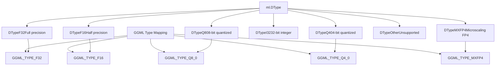
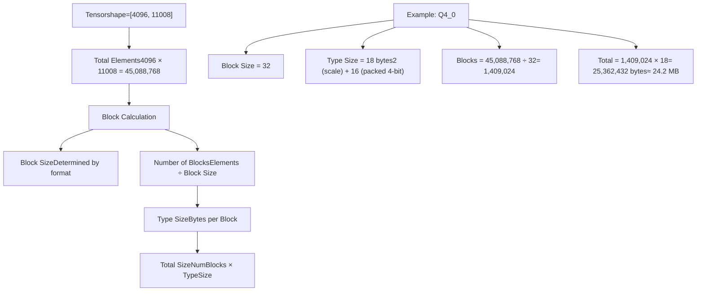
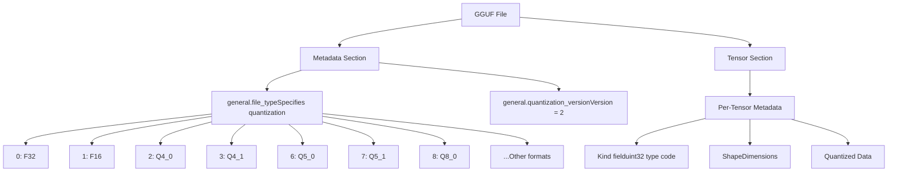
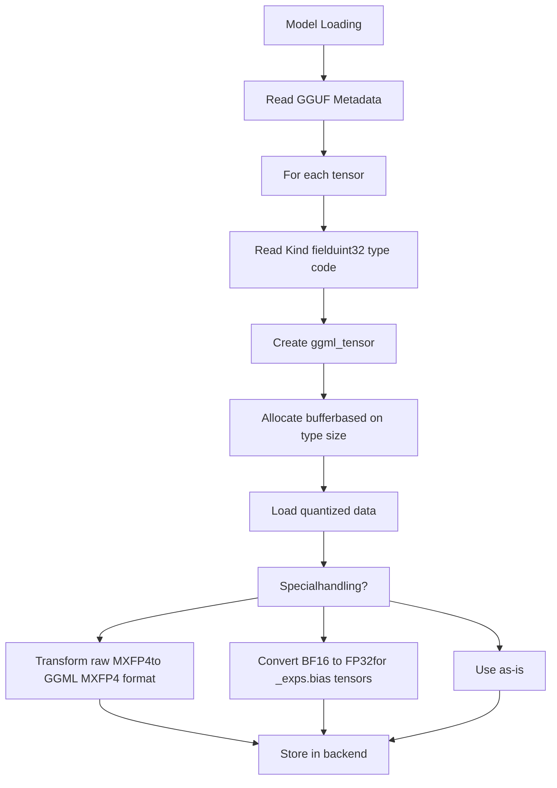
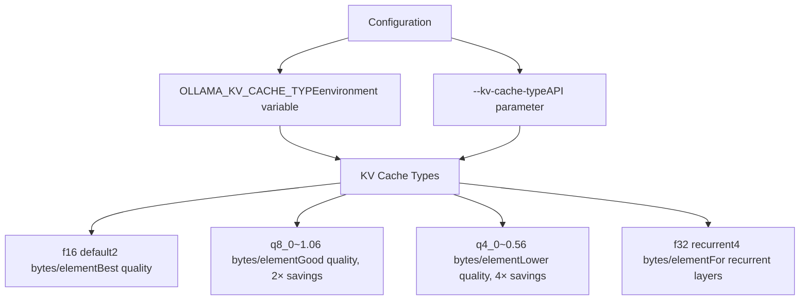
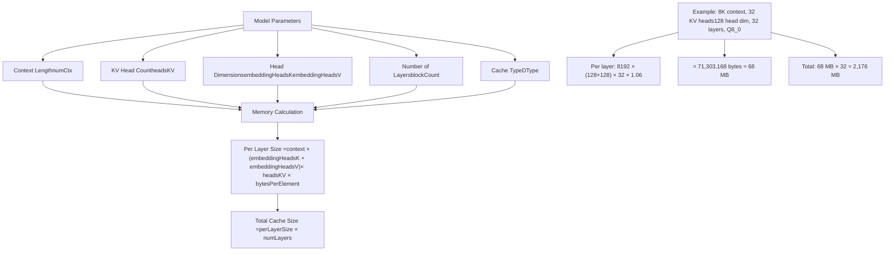
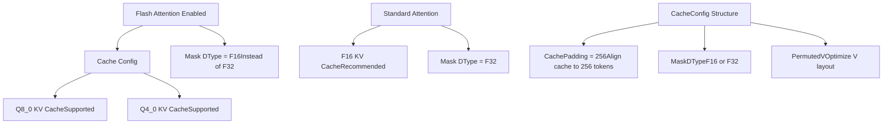
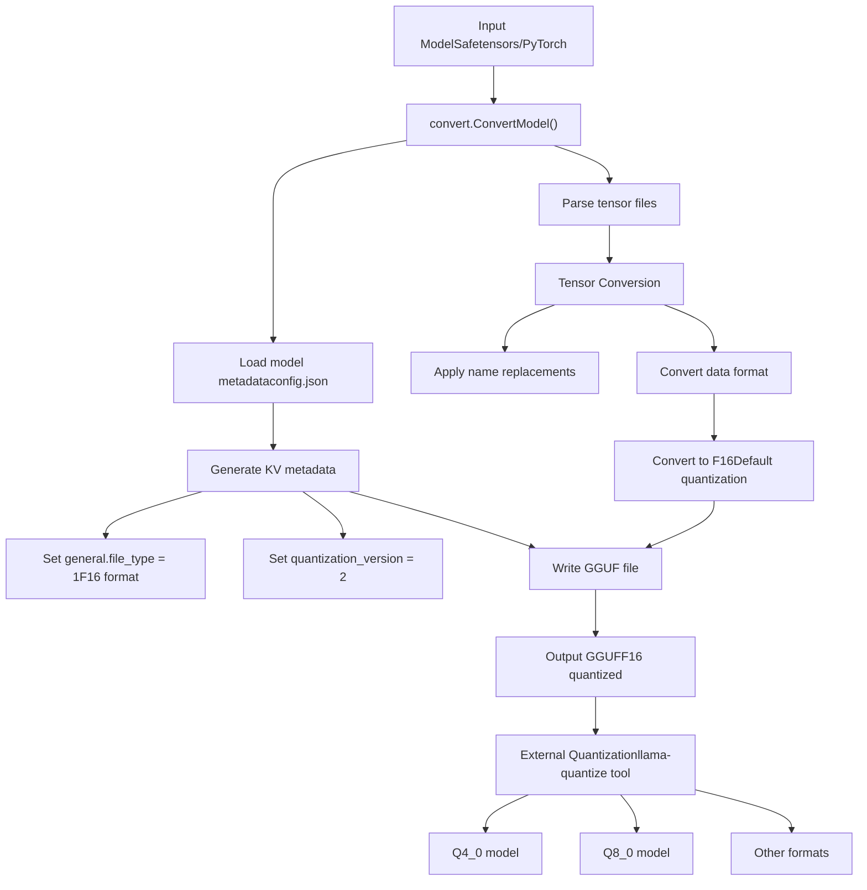
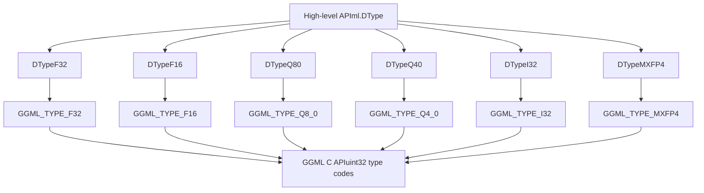

# 量化

相关源码文件

-   [convert/convert.go](https://github.com/ollama/ollama/blob/562c76d7/convert/convert.go)
-   [fs/ggml/ggml.go](https://github.com/ollama/ollama/blob/562c76d7/fs/ggml/ggml.go)
-   [fs/ggml/ggml\_test.go](https://github.com/ollama/ollama/blob/562c76d7/fs/ggml/ggml_test.go)
-   [integration/embed\_test.go](https://github.com/ollama/ollama/blob/562c76d7/integration/embed_test.go)
-   [kvcache/cache.go](https://github.com/ollama/ollama/blob/562c76d7/kvcache/cache.go)
-   [kvcache/causal.go](https://github.com/ollama/ollama/blob/562c76d7/kvcache/causal.go)
-   [kvcache/causal\_test.go](https://github.com/ollama/ollama/blob/562c76d7/kvcache/causal_test.go)
-   [kvcache/encoder.go](https://github.com/ollama/ollama/blob/562c76d7/kvcache/encoder.go)
-   [kvcache/wrapper.go](https://github.com/ollama/ollama/blob/562c76d7/kvcache/wrapper.go)
-   [ml/backend.go](https://github.com/ollama/ollama/blob/562c76d7/ml/backend.go)
-   [ml/backend/ggml/ggml.go](https://github.com/ollama/ollama/blob/562c76d7/ml/backend/ggml/ggml.go)
-   [model/input/input.go](https://github.com/ollama/ollama/blob/562c76d7/model/input/input.go)
-   [model/model.go](https://github.com/ollama/ollama/blob/562c76d7/model/model.go)
-   [model/model\_test.go](https://github.com/ollama/ollama/blob/562c76d7/model/model_test.go)
-   [model/models/models.go](https://github.com/ollama/ollama/blob/562c76d7/model/models/models.go)
-   [model/parsers/parsers.go](https://github.com/ollama/ollama/blob/562c76d7/model/parsers/parsers.go)
-   [model/parsers/parsers\_test.go](https://github.com/ollama/ollama/blob/562c76d7/model/parsers/parsers_test.go)
-   [model/renderers/glmocr.go](https://github.com/ollama/ollama/blob/562c76d7/model/renderers/glmocr.go)
-   [model/renderers/glmocr\_test.go](https://github.com/ollama/ollama/blob/562c76d7/model/renderers/glmocr_test.go)
-   [model/renderers/renderer.go](https://github.com/ollama/ollama/blob/562c76d7/model/renderers/renderer.go)
-   [runner/llamarunner/cache.go](https://github.com/ollama/ollama/blob/562c76d7/runner/llamarunner/cache.go)
-   [runner/llamarunner/runner.go](https://github.com/ollama/ollama/blob/562c76d7/runner/llamarunner/runner.go)
-   [runner/ollamarunner/cache.go](https://github.com/ollama/ollama/blob/562c76d7/runner/ollamarunner/cache.go)
-   [runner/ollamarunner/cache\_test.go](https://github.com/ollama/ollama/blob/562c76d7/runner/ollamarunner/cache_test.go)
-   [runner/ollamarunner/runner.go](https://github.com/ollama/ollama/blob/562c76d7/runner/ollamarunner/runner.go)
-   [server/internal/internal/backoff/backoff.go](https://github.com/ollama/ollama/blob/562c76d7/server/internal/internal/backoff/backoff.go)

在 Ollama 中，量化是指降低模型权重和运行时数据结构的精度，以减少内存占用并提升推理性能。该系统为模型存储（GGUF 文件）和运行时缓存（KV cache）实现了多种量化格式。

关于模型文件格式和存储的信息，请参见 [Model File Formats](/ollama/ollama/4.4-model-file-formats)。关于 KV 缓存实现细节，请参见 [KV Cache System](/ollama/ollama/5.3-kv-cache-system)。

## 概述

量化通过使用更少位数来表示浮点数值。与将每个权重存储为 32 位浮点（F32）或 16 位浮点（F16）不同，量化方案可以将每个值压缩到 2-8 位，从而将内存占用降低 4-16 倍，同时保持可接受的精度。

Ollama 在两个主要方面支持量化：

-   **模型权重量化**：权重以多种量化方案存储在 GGUF 文件中
-   **KV 缓存量化**：运行时注意力缓存使用 Q8\_0、Q4\_0 或 F16 格式

## 量化格式分类

```mermaid
flowchart TD
    QFormats["Quantization Formats"]
    Float["Full Precision"]
    Legacy["Legacy Formats"]
    KSeries["K-Series"]
    IQSeries["IQ-Series"]
    Special["Special Formats"]
    F32["F3232-bit float4 bytes"]
    F16["F1616-bit float2 bytes"]
    BF16["BF16bfloat162 bytes"]
    Q4_0["Q4_0block_size=322.5 bytes/value"]
    Q4_1["Q4_1block_size=323 bytes/value"]
    Q5_0["Q5_0block_size=322.75 bytes/value"]
    Q5_1["Q5_1block_size=323.125 bytes/value"]
    Q8_0["Q8_0block_size=321.0625 bytes/value"]
    Q8_1["Q8_1block_size=321.25 bytes/value"]
    Q2_K["Q2_Kblock_size=256~0.7 bytes/value"]
    Q3_K["Q3_Kblock_size=256~0.9 bytes/value"]
    Q4_K["Q4_Kblock_size=256~1.1 bytes/value"]
    Q5_K["Q5_Kblock_size=256~1.3 bytes/value"]
    Q6_K["Q6_Kblock_size=256~1.7 bytes/value"]
    Q8_K["Q8_Kblock_size=256~2.1 bytes/value"]
    IQ2_XXS["IQ2_XXS"]
    IQ2_XS["IQ2_XS"]
    IQ3_XXS["IQ3_XXS"]
    IQ1_S["IQ1_S"]
    IQ4_NL["IQ4_NL"]
    IQ3_S["IQ3_S"]
    IQ2_S["IQ2_S"]
    IQ4_XS["IQ4_XS"]
    IQ1_M["IQ1_M"]
    MXFP4["MXFP4Microscaling FP4block_size=32"]

    QFormats --> Float
    QFormats --> Legacy
    QFormats --> KSeries
    QFormats --> IQSeries
    QFormats --> Special
    Float --> F32
    Float --> F16
    Float --> BF16
    Legacy --> Q4_0
    Legacy --> Q4_1
    Legacy --> Q5_0
    Legacy --> Q5_1
    Legacy --> Q8_0
    Legacy --> Q8_1
    KSeries --> Q2_K
    KSeries --> Q3_K
    KSeries --> Q4_K
    KSeries --> Q5_K
    KSeries --> Q6_K
    KSeries --> Q8_K
    IQSeries --> IQ2_XXS
    IQSeries --> IQ2_XS
    IQSeries --> IQ3_XXS
    IQSeries --> IQ1_S
    IQSeries --> IQ4_NL
    IQSeries --> IQ3_S
    IQSeries --> IQ2_S
    IQSeries --> IQ4_XS
    IQSeries --> IQ1_M
    Special --> MXFP4
```


**来源**: [fs/ggml/ggml.go405-501](https://github.com/ollama/ollama/blob/562c76d7/fs/ggml/ggml.go#L405-L501) [fs/ggml/ggml.go404-429](https://github.com/ollama/ollama/blob/562c76d7/fs/ggml/ggml.go#L404-L429)

## 量化类型系统

### DType 枚举

后端类型系统使用 `DType` 枚举来表示数据类型：


`ggmlDType()` 函数 [ml/backend/ggml/ggml.go1113-1130](https://github.com/ollama/ollama/blob/562c76d7/ml/backend/ggml/ggml.go#L1113-L1130) 负责在 Ollama 的 `ml.DType` 与 GGML 原生类型系统之间进行映射。反向映射由 `DType()` 方法 [ml/backend/ggml/ggml.go1094-1111](https://github.com/ollama/ollama/blob/562c76d7/ml/backend/ggml/ggml.go#L1094-L1111) 完成。

**来源**: [ml/backend.go397-407](https://github.com/ollama/ollama/blob/562c76d7/ml/backend.go#L397-L407) [ml/backend/ggml/ggml.go1094-1130](https://github.com/ollama/ollama/blob/562c76d7/ml/backend/ggml/ggml.go#L1094-L1130)

## 基于块的量化

多数量化格式采用基于块的方法：把数值分组为一个个块，每个块共享量化参数（缩放因子、零点）。

### 块大小与类型大小计算


该计算实现于 [fs/ggml/ggml.go512-514](https://github.com/ollama/ollama/blob/562c76d7/fs/ggml/ggml.go#L512-L514)：

```
Size() = Elements() × TypeSize() / BlockSize()
```
**来源**: [fs/ggml/ggml.go404-429](https://github.com/ollama/ollama/blob/562c76d7/fs/ggml/ggml.go#L404-L429) [fs/ggml/ggml.go431-502](https://github.com/ollama/ollama/blob/562c76d7/fs/ggml/ggml.go#L431-L502) [fs/ggml/ggml.go504-514](https://github.com/ollama/ollama/blob/562c76d7/fs/ggml/ggml.go#L504-L514)

## 量化格式细节

### 传统格式规格

| Format | Block Size | Bytes/Block | Bytes/Value | Components |
| --- | --- | --- | --- | --- |
| **Q4\_0** | 32 | 18 | 0.5625 | 2B scale + 16B data |
| **Q4\_1** | 32 | 20 | 0.625 | 2B scale + 2B min + 16B data |
| **Q5\_0** | 32 | 22 | 0.6875 | 2B scale + 4B high bits + 16B data |
| **Q5\_1** | 32 | 24 | 0.75 | 2B scale + 2B min + 4B high + 16B data |
| **Q8\_0** | 32 | 34 | 1.0625 | 2B scale + 32B data |
| **Q8\_1** | 32 | 36 | 1.125 | 2B scale + 2B min + 32B data |

### K 系列格式规格

K 系列格式使用更大的块（256 个值）以及更复杂的量化方案：

| Format | Block Size | Bytes/Block | Bytes/Value | Description |
| --- | --- | --- | --- | --- |
| **Q2\_K** | 256 | 82 | 0.3203 | 2-bit + scales + biases |
| **Q3\_K** | 256 | 110 | 0.4297 | 3-bit + scales + high bits |
| **Q4\_K** | 256 | 144 | 0.5625 | 4-bit + scales + bias |
| **Q5\_K** | 256 | 176 | 0.6875 | 5-bit + scales + high bits |
| **Q6\_K** | 256 | 210 | 0.8203 | 6-bit + scales |
| **Q8\_K** | 256 | 292 | 1.1406 | 8-bit + scales |

在相近位宽下，K 系列格式比传统格式具有更好的质量/体积比。

**来源**: [fs/ggml/ggml.go438-502](https://github.com/ollama/ollama/blob/562c76d7/fs/ggml/ggml.go#L438-L502)

### IQ 系列格式

IQ 系列（Importance Quantization）是基于重要性的高级量化格式：

| Format | Block Size | Approximate Bits | Use Case |
| --- | --- | --- | --- |
| **IQ1\_S** | 32 | ~1.56 bits | Extreme compression |
| **IQ1\_M** | 32 | ~1.75 bits | Extreme compression |
| **IQ2\_XXS** | 32 | ~2.06 bits | Very high compression |
| **IQ2\_XS** | 32 | ~2.31 bits | High compression |
| **IQ2\_S** | 256 | ~2.5 bits | Balanced compression |
| **IQ3\_XXS** | 256 | ~3.06 bits | Medium compression |
| **IQ3\_S** | 256 | ~3.44 bits | Quality-focused compression |
| **IQ4\_NL** | 32 | ~4.5 bits | Low compression, high quality |
| **IQ4\_XS** | 256 | ~4.25 bits | Balanced quality |

**来源**: [fs/ggml/ggml.go467-495](https://github.com/ollama/ollama/blob/562c76d7/fs/ggml/ggml.go#L467-L495)

## 模型权重量化

### 文件类型元数据

模型量化通过 GGUF 元数据中的 `general.file_type` 键来指定：


文件类型通过 `FileType()` 方法 [fs/ggml/ggml.go47-53](https://github.com/ollama/ollama/blob/562c76d7/fs/ggml/ggml.go#L47-L53) 读取并暴露。

**来源**: [fs/ggml/ggml.go47-53](https://github.com/ollama/ollama/blob/562c76d7/fs/ggml/ggml.go#L47-L53) [convert/convert.go132-133](https://github.com/ollama/ollama/blob/562c76d7/convert/convert.go#L132-L133)

### Tensor Kind 字段

GGUF 文件中的每个张量都有一个 `Kind` 字段（uint32），用于指定其量化格式。后端读取该字段并创建相应的张量结构：


某些类型的特殊处理发生在 [ml/backend/ggml/ggml.go268-274](https://github.com/ollama/ollama/blob/562c76d7/ml/backend/ggml/ggml.go#L268-L274)：

-   Kind 4（原始 MXFP4）会转换为 kind 39（GGML MXFP4 格式）
-   BF16 的 `_exps.bias` 张量会转换为 FP32 以保证兼容性

**来源**: [ml/backend/ggml/ggml.go266-290](https://github.com/ollama/ollama/blob/562c76d7/ml/backend/ggml/ggml.go#L266-L290) [ml/backend/ggml/ggml.go528-566](https://github.com/ollama/ollama/blob/562c76d7/ml/backend/ggml/ggml.go#L528-L566)

### 加载量化权重

权重加载流程会对量化数据进行特殊处理：

> **[Mermaid sequence]**
> *(图表结构无法解析)*

MXFP4 的转换发生在 [ml/backend/ggml/ggml.go528-566](https://github.com/ollama/ollama/blob/562c76d7/ml/backend/ggml/ggml.go#L528-L566)，该步骤会把原始流格式转换为 GGML 内部表示。

**来源**: [ml/backend/ggml/ggml.go468-645](https://github.com/ollama/ollama/blob/562c76d7/ml/backend/ggml/ggml.go#L468-L645) [ml/backend/ggml/ggml.go528-566](https://github.com/ollama/ollama/blob/562c76d7/ml/backend/ggml/ggml.go#L528-L566) [ml/backend/ggml/ggml.go568-595](https://github.com/ollama/ollama/blob/562c76d7/ml/backend/ggml/ggml.go#L568-L595)

## KV 缓存量化

KV（key-value）缓存在推理期间存储注意力状态，也可进行量化以减少内存占用。

### 支持的 KV 缓存类型


`kvCacheTypeFromStr()` 函数 [runner/ollamarunner/cache.go61-70](https://github.com/ollama/ollama/blob/562c76d7/runner/ollamarunner/cache.go#L61-L70) 会将字符串规格转换为 `ml.DType`：

| String | DType | Bytes per Element |
| --- | --- | --- |
| `"q8_0"` | `ml.DTypeQ80` | ~1.06 |
| `"q4_0"` | `ml.DTypeQ40` | ~0.56 |
| `"f16"` (default) | `ml.DTypeF16` | 2.0 |
| `"f32"` (recurrent) | `ml.DTypeF32` | 4.0 |

**来源**: [runner/ollamarunner/cache.go61-70](https://github.com/ollama/ollama/blob/562c76d7/runner/ollamarunner/cache.go#L61-L70) [runner/ollamarunner/cache.go34-58](https://github.com/ollama/ollama/blob/562c76d7/runner/ollamarunner/cache.go#L34-L58)

### KV 缓存内存计算


该计算在 `GraphSize()` [fs/ggml/ggml.go598-846](https://github.com/ollama/ollama/blob/562c76d7/fs/ggml/ggml.go#L598-L846) 中执行，并使用 `kvCacheBytesPerElement()` 辅助函数按缓存类型确定每元素字节数。

**来源**: [fs/ggml/ggml.go598-660](https://github.com/ollama/ollama/blob/562c76d7/fs/ggml/ggml.go#L598-L660) [fs/ggml/ggml.go848-879](https://github.com/ollama/ollama/blob/562c76d7/fs/ggml/ggml.go#L848-L879)

### 缓存初始化流程

> **[Mermaid sequence]**
> *(图表结构无法解析)*

量化缓存在 [runner/ollamarunner/cache.go34-58](https://github.com/ollama/ollama/blob/562c76d7/runner/ollamarunner/cache.go#L34-L58) 中初始化，该过程会继续调用 [kvcache/causal.go130-182](https://github.com/ollama/ollama/blob/562c76d7/kvcache/causal.go#L130-L182) 中的 KV 缓存初始化逻辑。

**来源**: [runner/ollamarunner/cache.go34-58](https://github.com/ollama/ollama/blob/562c76d7/runner/ollamarunner/cache.go#L34-L58) [kvcache/causal.go130-182](https://github.com/ollama/ollama/blob/562c76d7/kvcache/causal.go#L130-L182) [kvcache/causal.go459-473](https://github.com/ollama/ollama/blob/562c76d7/kvcache/causal.go#L459-L473)

### Flash Attention 与 KV 缓存量化

启用 flash attention 时，KV 缓存可使用 Q8\_0 或 Q4\_0 量化：


缓存配置由 `CacheConfig()` [ml/backend/ggml/ggml.go686-692](https://github.com/ollama/ollama/blob/562c76d7/ml/backend/ggml/ggml.go#L686-L692) 决定；当启用 flash attention 时，它会将 `MaskDType` 设置为 F16。

**来源**: [ml/backend/ggml/ggml.go686-692](https://github.com/ollama/ollama/blob/562c76d7/ml/backend/ggml/ggml.go#L686-L692) [ml/backend.go37-57](https://github.com/ollama/ollama/blob/562c76d7/ml/backend.go#L37-L57)

## 内存影响分析

### 权重量化影响

以典型的 7B 参数模型为例：

| Format | Size | vs F32 | vs F16 | Quality |
| --- | --- | --- | --- | --- |
| **F32** | 28 GB | 1.0× | 2.0× | Reference |
| **F16** | 14 GB | 0.5× | 1.0× | Negligible loss |
| **Q8\_0** | 7.5 GB | 0.27× | 0.54× | Minimal loss |
| **Q6\_K** | 5.7 GB | 0.20× | 0.41× | Very good |
| **Q5\_K** | 4.8 GB | 0.17× | 0.34× | Good |
| **Q4\_K** | 3.9 GB | 0.14× | 0.28× | Acceptable |
| **Q3\_K** | 3.0 GB | 0.11× | 0.21× | Lower quality |
| **Q2\_K** | 2.2 GB | 0.08× | 0.16× | Noticeable loss |

### KV 缓存量化影响

对于一个具有 8K 上下文、32 层、32 个 KV 头、128 头维度的模型：

| Cache Type | Per Layer | Total (32 layers) | vs F16 |
| --- | --- | --- | --- |
| **F16** | 67.1 MB | 2,147 MB | 1.0× |
| **Q8\_0** | 35.7 MB | 1,142 MB | 0.53× |
| **Q4\_0** | 18.9 MB | 605 MB | 0.28× |

内存节省是在图大小估算过程中计算得到的 [fs/ggml/ggml.go614-659](https://github.com/ollama/ollama/blob/562c76d7/fs/ggml/ggml.go#L614-L659)。

**来源**: [fs/ggml/ggml.go598-660](https://github.com/ollama/ollama/blob/562c76d7/fs/ggml/ggml.go#L598-L660) [fs/ggml/ggml.go848-879](https://github.com/ollama/ollama/blob/562c76d7/fs/ggml/ggml.go#L848-L879)

## 转换与量化流程

### 模型转换流水线


转换流程 [convert/convert.go372-393](https://github.com/ollama/ollama/blob/562c76d7/convert/convert.go#L372-L393) 默认生成 F16 模型。若需进一步量化为 Q4\_0、Q8\_0 等格式，通常需要使用外部工具。

**来源**: [convert/convert.go130-158](https://github.com/ollama/ollama/blob/562c76d7/convert/convert.go#L130-L158) [convert/convert.go372-393](https://github.com/ollama/ollama/blob/562c76d7/convert/convert.go#L372-L393) [convert/convert.go387-393](https://github.com/ollama/ollama/blob/562c76d7/convert/convert.go#L387-L393)

### 量化元数据

GGUF 文件在键值存储中包含量化元数据：

| Key | Type | Purpose |
| --- | --- | --- |
| `general.file_type` | uint32 | 整体量化格式 |
| `general.quantization_version` | uint32 | 量化版本（2） |

每个张量还具有一个 `Kind` 字段来指定其单独的量化格式，因此支持混合精度模型。

**来源**: [convert/convert.go130-158](https://github.com/ollama/ollama/blob/562c76d7/convert/convert.go#L130-L158) [fs/ggml/ggml.go47-53](https://github.com/ollama/ollama/blob/562c76d7/fs/ggml/ggml.go#L47-L53)

## 实现细节

### 类型大小计算

`TypeSize()` 方法 [fs/ggml/ggml.go435-502](https://github.com/ollama/ollama/blob/562c76d7/fs/ggml/ggml.go#L435-L502) 为每种量化格式实现了每块字节数的公式：

```
TypeSize(format) returns bytes per block
Size(tensor) = Elements(tensor) × TypeSize(format) / BlockSize(format)
```
例如，块大小为 32 的 Q4\_0：

-   TypeSize = 2（scale） + 32/2（4-bit packed） = 18 字节
-   1000 elements = 1000 × 18 / 32 = 562.5 字节

**来源**: [fs/ggml/ggml.go404-429](https://github.com/ollama/ollama/blob/562c76d7/fs/ggml/ggml.go#L404-L429) [fs/ggml/ggml.go435-502](https://github.com/ollama/ollama/blob/562c76d7/fs/ggml/ggml.go#L435-L502) [fs/ggml/ggml.go504-514](https://github.com/ollama/ollama/blob/562c76d7/fs/ggml/ggml.go#L504-L514)

### 后端类型映射

后端维护了 DType 与 GGML 类型之间的映射：


`DType()` 方法 [ml/backend/ggml/ggml.go1094-1111](https://github.com/ollama/ollama/blob/562c76d7/ml/backend/ggml/ggml.go#L1094-L1111) 负责将 GGML 类型转换回 `ml.DType`，而 `ggmlDType()` [ml/backend/ggml/ggml.go1113-1130](https://github.com/ollama/ollama/blob/562c76d7/ml/backend/ggml/ggml.go#L1113-L1130) 负责反向转换。

**来源**: [ml/backend/ggml/ggml.go1094-1130](https://github.com/ollama/ollama/blob/562c76d7/ml/backend/ggml/ggml.go#L1094-L1130)

### 量化支持检测

模型可以通过 `SupportsKVCacheType()` 方法 [fs/ggml/ggml.go848-879](https://github.com/ollama/ollama/blob/562c76d7/fs/ggml/ggml.go#L848-L879) 查询量化支持情况。该方法会检查给定 KV 缓存类型是否与模型架构兼容，以及是否可用 flash attention。

**来源**: [fs/ggml/ggml.go848-879](https://github.com/ollama/ollama/blob/562c76d7/fs/ggml/ggml.go#L848-L879)

## 使用模式

### 指定 KV 缓存量化

用户可通过环境变量或 API 参数指定 KV 缓存量化：

```
# Environment variableOLLAMA_KV_CACHE_TYPE=q8_0 ollama serve # The cache type is read during cache initialization
```
缓存类型在系统中的流转路径如下：

1.  runner 读取环境变量
2.  作为字符串传递给 `NewInputCache()`
3.  由 `kvCacheTypeFromStr()` 转换为 `ml.DType`
4.  用于缓存初始化

**来源**: [runner/ollamarunner/cache.go34-58](https://github.com/ollama/ollama/blob/562c76d7/runner/ollamarunner/cache.go#L34-L58) [runner/ollamarunner/cache.go61-70](https://github.com/ollama/ollama/blob/562c76d7/runner/ollamarunner/cache.go#L61-L70)

### 模型文件类型检测

加载模型时会检测模型文件类型：

> **[Mermaid sequence]**
> *(图表结构无法解析)*

文件类型通过 `FileType()` 方法 [fs/ggml/ggml.go47-53](https://github.com/ollama/ollama/blob/562c76d7/fs/ggml/ggml.go#L47-L53) 对外暴露，并在初始化阶段记录日志 [ml/backend/ggml/ggml.go135-145](https://github.com/ollama/ollama/blob/562c76d7/ml/backend/ggml/ggml.go#L135-L145)。

**来源**: [fs/ggml/ggml.go47-53](https://github.com/ollama/ollama/blob/562c76d7/fs/ggml/ggml.go#L47-L53) [ml/backend/ggml/ggml.go123-148](https://github.com/ollama/ollama/blob/562c76d7/ml/backend/ggml/ggml.go#L123-L148) [fs/ggml/ggml.go558-596](https://github.com/ollama/ollama/blob/562c76d7/fs/ggml/ggml.go#L558-L596)
