# 推理引擎

相关源文件

-   [envconfig/config.go](https://github.com/ollama/ollama/blob/562c76d7/envconfig/config.go)
-   [envconfig/config\_test.go](https://github.com/ollama/ollama/blob/562c76d7/envconfig/config_test.go)
-   [integration/embed\_test.go](https://github.com/ollama/ollama/blob/562c76d7/integration/embed_test.go)
-   [kvcache/cache.go](https://github.com/ollama/ollama/blob/562c76d7/kvcache/cache.go)
-   [kvcache/causal.go](https://github.com/ollama/ollama/blob/562c76d7/kvcache/causal.go)
-   [kvcache/causal\_test.go](https://github.com/ollama/ollama/blob/562c76d7/kvcache/causal_test.go)
-   [kvcache/encoder.go](https://github.com/ollama/ollama/blob/562c76d7/kvcache/encoder.go)
-   [kvcache/wrapper.go](https://github.com/ollama/ollama/blob/562c76d7/kvcache/wrapper.go)
-   [llama/llama.go](https://github.com/ollama/ollama/blob/562c76d7/llama/llama.go)
-   [llama/sampling\_ext.cpp](https://github.com/ollama/ollama/blob/562c76d7/llama/sampling_ext.cpp)
-   [llama/sampling\_ext.h](https://github.com/ollama/ollama/blob/562c76d7/llama/sampling_ext.h)
-   [llm/server.go](https://github.com/ollama/ollama/blob/562c76d7/llm/server.go)
-   [ml/backend.go](https://github.com/ollama/ollama/blob/562c76d7/ml/backend.go)
-   [ml/backend/ggml/ggml.go](https://github.com/ollama/ollama/blob/562c76d7/ml/backend/ggml/ggml.go)
-   [model/input/input.go](https://github.com/ollama/ollama/blob/562c76d7/model/input/input.go)
-   [model/model.go](https://github.com/ollama/ollama/blob/562c76d7/model/model.go)
-   [model/model\_test.go](https://github.com/ollama/ollama/blob/562c76d7/model/model_test.go)
-   [runner/llamarunner/cache.go](https://github.com/ollama/ollama/blob/562c76d7/runner/llamarunner/cache.go)
-   [runner/llamarunner/runner.go](https://github.com/ollama/ollama/blob/562c76d7/runner/llamarunner/runner.go)
-   [runner/ollamarunner/cache.go](https://github.com/ollama/ollama/blob/562c76d7/runner/ollamarunner/cache.go)
-   [runner/ollamarunner/cache\_test.go](https://github.com/ollama/ollama/blob/562c76d7/runner/ollamarunner/cache_test.go)
-   [runner/ollamarunner/runner.go](https://github.com/ollama/ollama/blob/562c76d7/runner/ollamarunner/runner.go)
-   [server/internal/internal/backoff/backoff.go](https://github.com/ollama/ollama/blob/562c76d7/server/internal/internal/backoff/backoff.go)
-   [server/sched.go](https://github.com/ollama/ollama/blob/562c76d7/server/sched.go)
-   [server/sched\_test.go](https://github.com/ollama/ollama/blob/562c76d7/server/sched_test.go)

推理引擎是核心执行系统，负责将模型加载到内存中、处理输入 token/embedding，并生成预测结果。它涵盖与硬件加速器（GPU）对接的后端系统、负责编排批处理与序列生成的 runner 实现，以及管理并发请求的调度逻辑。

关于模型在更高层面的加载与调度信息，请参见[请求调度与 Runner 管理](/ollama/ollama/2.2-request-scheduling-and-runner-management)。关于模型存储格式的细节，请参见[模型文件格式](/ollama/ollama/4.4-model-file-formats)。关于 GPU 硬件检测与配置，请参见[GPU 发现与后端加载](/ollama/ollama/6.1-gpu-discovery-and-backend-loading)。

## 架构概览

推理引擎采用分层架构：请求从 HTTP API 流入调度器，再进入 runner，由后端实现执行模型前向计算：

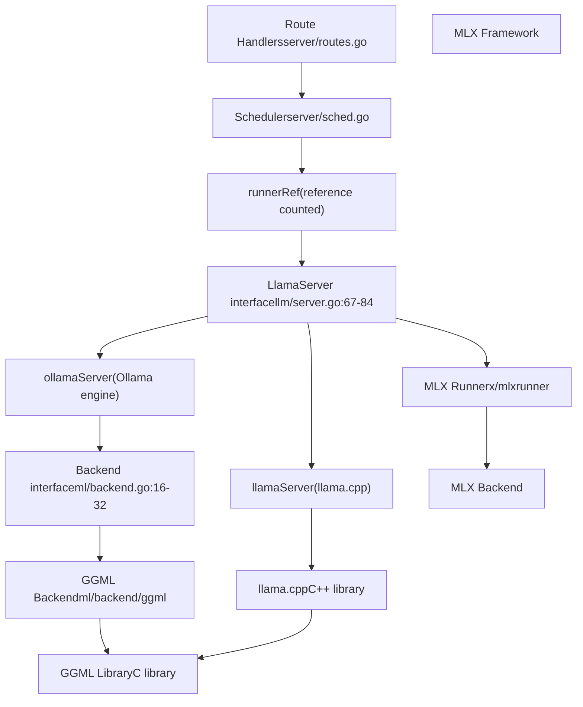
**Sources:** [llm/server.go67-84](https://github.com/ollama/ollama/blob/562c76d7/llm/server.go#L67-L84) [ml/backend.go16-32](https://github.com/ollama/ollama/blob/562c76d7/ml/backend.go#L16-L32) [server/sched.go38-59](https://github.com/ollama/ollama/blob/562c76d7/server/sched.go#L38-L59) [runner/ollamarunner/runner.go331-388](https://github.com/ollama/ollama/blob/562c76d7/runner/ollamarunner/runner.go#L331-L388)

### 双执行路径

Ollama 支持两种不同的推理引擎，可根据模型需求和环境配置进行选择：

| Engine | Implementation | Selection Criteria | Key Files |
| --- | --- | --- | --- |
| **llama.cpp** | `llamaServer` | 默认；所有 GGUF 模型 | [llm/server.go110-114](https://github.com/ollama/ollama/blob/562c76d7/llm/server.go#L110-L114) |
| **Ollama Engine** | `ollamaServer` | 通过 `OLLAMA_NEW_ENGINE` 启用；safetensors 模型 | [llm/server.go116-120](https://github.com/ollama/ollama/blob/562c76d7/llm/server.go#L116-L120) |
| **MLX** | MLX client | Apple Silicon；图像生成 | [x/mlxrunner](https://github.com/ollama/ollama/blob/562c76d7/x/mlxrunner) |

选择过程发生在服务器初始化期间：

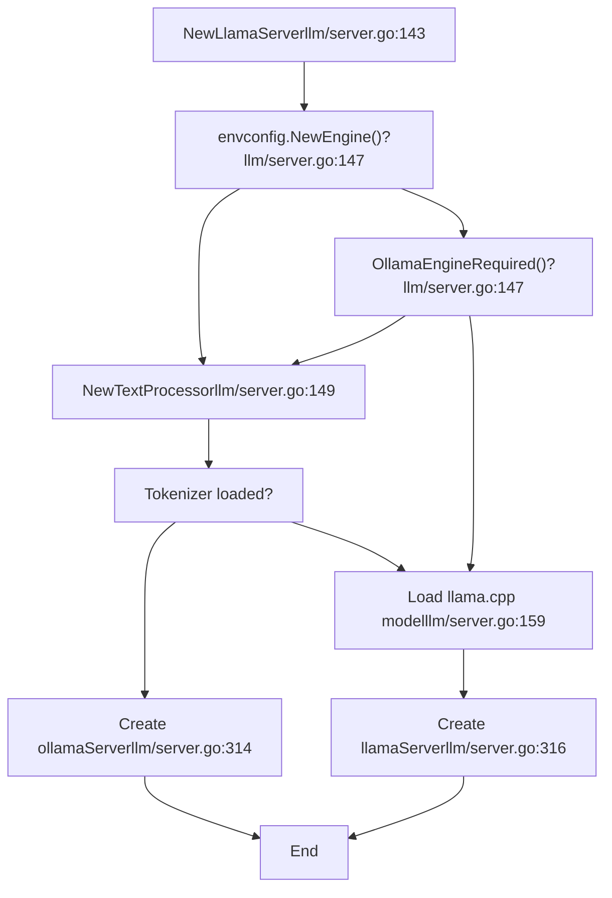
**Sources:** [llm/server.go143-318](https://github.com/ollama/ollama/blob/562c76d7/llm/server.go#L143-L318) [envconfig/config.go204-206](https://github.com/ollama/ollama/blob/562c76d7/envconfig/config.go#L204-L206)

## LlamaServer 接口

`LlamaServer` 接口定义了所有 runner 实现必须满足的契约。它在统一提供模型操作 API 的同时，抽象了不同执行引擎之间的差异：

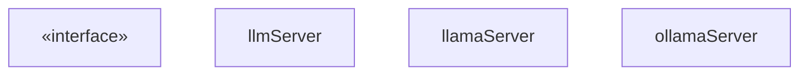
**Sources:** [llm/server.go67-84](https://github.com/ollama/ollama/blob/562c76d7/llm/server.go#L67-L84) [llm/server.go86-108](https://github.com/ollama/ollama/blob/562c76d7/llm/server.go#L86-L108) [llm/server.go110-120](https://github.com/ollama/ollama/blob/562c76d7/llm/server.go#L110-L120)

### 关键接口方法

接口方法可分为以下几类：

**生命周期管理：**

-   `Load()` - 加载模型权重并分配内存（`llamaServer` 对应 [llm/server.go496-714](https://github.com/ollama/ollama/blob/562c76d7/llm/server.go#L496-L714)，`ollamaServer` 对应 [llm/server.go746-899](https://github.com/ollama/ollama/blob/562c76d7/llm/server.go#L746-L899)）
-   `WaitUntilRunning()` - 阻塞直到 runner 子进程就绪
-   `Close()` - 释放资源并终止子进程

**推理操作：**

-   `Completion()` - 从提示词生成文本续写
-   `Embedding()` - 计算输入文本的 embedding
-   `Tokenize()`/`Detokenize()` - 文本↔token 转换

**资源监控：**

-   `MemorySize()` - 返回总内存与 VRAM 使用量
-   `VRAMByGPU()` - 按 GPU 统计内存消耗
-   `GetDeviceInfos()` - 活跃 GPU 信息

**Sources:** [llm/server.go67-84](https://github.com/ollama/ollama/blob/562c76d7/llm/server.go#L67-L84)

### Runner 进程模型

`llamaServer` 与 `ollamaServer` 都作为由 `StartRunner()` 启动的独立子进程运行：

> **[Mermaid sequence]**
> *(图表结构无法解析)*

**Sources:** [llm/server.go320-438](https://github.com/ollama/ollama/blob/562c76d7/llm/server.go#L320-L438) [llm/server.go496-714](https://github.com/ollama/ollama/blob/562c76d7/llm/server.go#L496-L714)

## 后端抽象层

`Backend` 接口为张量操作与模型执行提供与硬件无关的 API。其主要实现是 GGML 后端，支持多种加速库（CUDA、Metal、ROCm、Vulkan）：

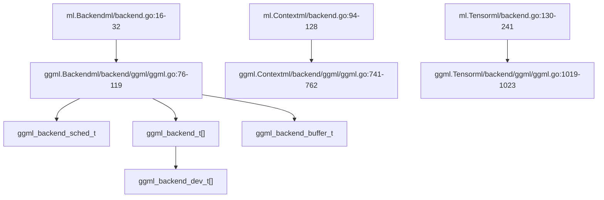
**Sources:** [ml/backend.go16-32](https://github.com/ollama/ollama/blob/562c76d7/ml/backend.go#L16-L32) [ml/backend/ggml/ggml.go76-119](https://github.com/ollama/ollama/blob/562c76d7/ml/backend/ggml/ggml.go#L76-L119) [ml/backend/ggml/ggml.go741-762](https://github.com/ollama/ollama/blob/562c76d7/ml/backend/ggml/ggml.go#L741-L762)

### 后端初始化

GGML 后端初始化流程会基于 GPU 层配置将模型层分配到各设备：

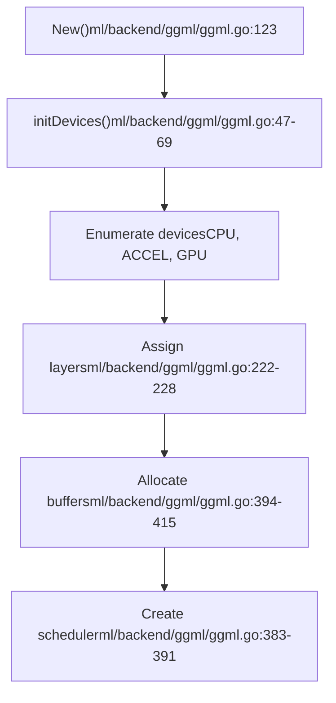
**设备分配逻辑：**

1.  CPU 设备接收输入张量，以及未卸载到 GPU 的层
2.  每个 GPU 基于 `params.GPULayers` 被分配特定层范围
3.  输出层分配取决于它是否在 GPU 层列表中

**Sources:** [ml/backend/ggml/ggml.go123-449](https://github.com/ollama/ollama/blob/562c76d7/ml/backend/ggml/ggml.go#L123-L449) [ml/backend/ggml/ggml.go47-69](https://github.com/ollama/ollama/blob/562c76d7/ml/backend/ggml/ggml.go#L47-L69)

### 上下文与计算图执行

`Context` 接口负责张量分配与计算图构建：

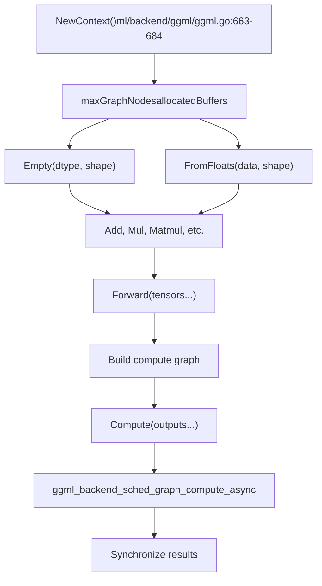
**Sources:** [ml/backend/ggml/ggml.go663-684](https://github.com/ollama/ollama/blob/562c76d7/ml/backend/ggml/ggml.go#L663-L684) [ml/backend/ggml/ggml.go794-843](https://github.com/ollama/ollama/blob/562c76d7/ml/backend/ggml/ggml.go#L794-L843)

### 张量缓冲区管理

后端维护两类缓冲区：

| Buffer Type | Purpose | Lifecycle | Source |
| --- | --- | --- | --- |
| **Weight Buffers** | 存储模型参数 | 在 `New()` 期间创建，在 `Close()` 时释放 | [ml/backend/ggml/ggml.go394-421](https://github.com/ollama/ollama/blob/562c76d7/ml/backend/ggml/ggml.go#L394-L421) |
| **Compute Buffers** | 保存中间激活值 | 按上下文分配，在上下文关闭时释放 | [ml/backend/ggml/ggml.go912-922](https://github.com/ollama/ollama/blob/562c76d7/ml/backend/ggml/ggml.go#L912-L922) |

**缓冲区分配流程：**

> **[Mermaid sequence]**
> *(图表结构无法解析)*

**Sources:** [ml/backend/ggml/ggml.go889-936](https://github.com/ollama/ollama/blob/562c76d7/ml/backend/ggml/ggml.go#L889-L936)

## Runner 实现

runner 层位于后端之上，负责编排序列生成流程，包括批管理、KV 缓存操作与采样。

### Ollama Runner 架构

`ollamaRunner` 实现提供对模型执行的细粒度控制：

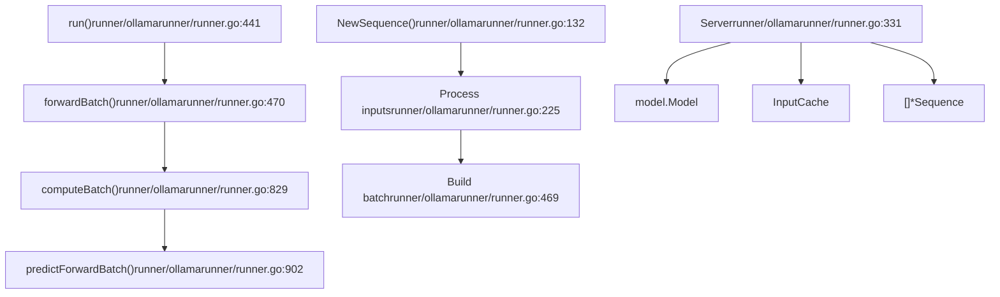
**Sources:** [runner/ollamarunner/runner.go331-388](https://github.com/ollama/ollama/blob/562c76d7/runner/ollamarunner/runner.go#L331-L388) [runner/ollamarunner/runner.go441-467](https://github.com/ollama/ollama/blob/562c76d7/runner/ollamarunner/runner.go#L441-L467)

### 批处理流水线

runner 以批处理方式处理序列，以最大化吞吐量：

> **[Mermaid sequence]**
> *(图表结构无法解析)*

**Sources:** [runner/ollamarunner/runner.go469-827](https://github.com/ollama/ollama/blob/562c76d7/runner/ollamarunner/runner.go#L469-L827) [runner/ollamarunner/runner.go829-900](https://github.com/ollama/ollama/blob/562c76d7/runner/ollamarunner/runner.go#L829-L900) [runner/ollamarunner/runner.go902-1081](https://github.com/ollama/ollama/blob/562c76d7/runner/ollamarunner/runner.go#L902-L1081)

### 关键 Runner 组件

**序列状态：**

```
type Sequence struct {
    inputs           []*input.Input     // Remaining tokens to process
    pendingInputs    []*input.Input     // Tokens in current batch
    pendingResponses []string           // Generated but not returned
    cache            *InputCacheSlot    // KV cache slot
    responses        chan response      // Output channel
    sampler          sample.Sampler     // Token sampler
    numPredict       int                // Max tokens to generate
    stop             []string           // Stop sequences
}
```
**Sources:** [runner/ollamarunner/runner.go51-116](https://github.com/ollama/ollama/blob/562c76d7/runner/ollamarunner/runner.go#L51-L116)

**批状态：**

```
type batchState struct {
    id               int                // Trace ID
    ctx              ml.Context         // Backend context
    modelOutput      ml.Tensor          // Logits output
    batchInputs      []*input.Input     // Input pointers
    batch            input.Batch        // Actual batch data
    seqs             []*Sequence        // Associated sequences
    inputsReadyCh    chan struct{}      // Sync: inputs ready
    computeStartedCh chan struct{}      // Sync: compute started
    outputsReadyCh   chan struct{}      // Sync: outputs ready
}
```
**Sources:** [runner/ollamarunner/runner.go300-329](https://github.com/ollama/ollama/blob/562c76d7/runner/ollamarunner/runner.go#L300-L329)

### Llama.cpp Runner 架构

`llamaRunner` 对 llama.cpp 库进行封装，将大部分操作委托给 C++ 实现：

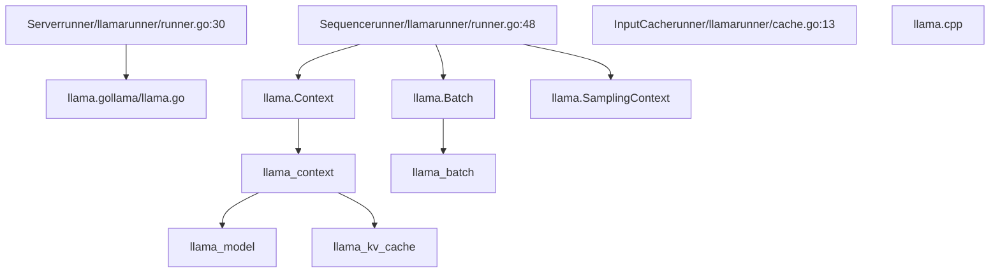
**Sources:** [runner/llamarunner/runner.go30](https://github.com/ollama/ollama/blob/562c76d7/runner/llamarunner/runner.go#L30-L30) [llama/llama.go161-164](https://github.com/ollama/ollama/blob/562c76d7/llama/llama.go#L161-L164) [llama/llama.go368-448](https://github.com/ollama/ollama/blob/562c76d7/llama/llama.go#L368-L448)

## 执行流程：从请求到响应

从 API 请求到生成 token 的完整流程：

> **[Mermaid sequence]**
> *(图表结构无法解析)*

**Sources:** [server/sched.go108-141](https://github.com/ollama/ollama/blob/562c76d7/server/sched.go#L108-L141) [server/sched.go436-592](https://github.com/ollama/ollama/blob/562c76d7/server/sched.go#L436-L592) [llm/server.go](https://github.com/ollama/ollama/blob/562c76d7/llm/server.go)

### 提示词处理与 Token 生成

runner 处理两个具有不同性能特征的阶段：

| Phase | Characteristics | Batch Composition | Source |
| --- | --- | --- | --- |
| **Prompt Processing** | 并行评估输入 token | 大批次（最多 `batchSize`） | [runner/ollamarunner/runner.go509-546](https://github.com/ollama/ollama/blob/562c76d7/runner/ollamarunner/runner.go#L509-L546) |
| **Token Generation** | 顺序采样，每个序列每次一个 token | 小批次（每个活跃序列 1 个 token） | [runner/ollamarunner/runner.go902-1081](https://github.com/ollama/ollama/blob/562c76d7/runner/ollamarunner/runner.go#L902-L1081) |

**提示词处理优化：**

-   输入 token 以批方式处理，以最大化 GPU 利用率
-   多个序列可并行处理
-   为所有提示词 token 填充 KV 缓存

**Token 生成：**

-   每个序列在每次前向中生成一个 token
-   采样根据 logits 决定下一个 token
-   过程重复，直到满足停止条件或达到上限

**Sources:** [runner/ollamarunner/runner.go469-827](https://github.com/ollama/ollama/blob/562c76d7/runner/ollamarunner/runner.go#L469-L827) [runner/ollamarunner/runner.go902-1081](https://github.com/ollama/ollama/blob/562c76d7/runner/ollamarunner/runner.go#L902-L1081)

## 内存布局与张量拆分

后端根据层分配，在 CPU 与多 GPU 之间管理内存分配：

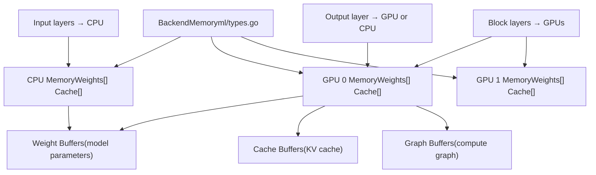
**Sources:** [ml/backend/ggml/ggml.go149-198](https://github.com/ollama/ollama/blob/562c76d7/ml/backend/ggml/ggml.go#L149-L198) [ml/backend/ggml/ggml.go202-228](https://github.com/ollama/ollama/blob/562c76d7/ml/backend/ggml/ggml.go#L202-L228)

### 层分配算法

层分配流程将模型层分布到可用设备：

1.  **输入层分配：**始终分配到 CPU 以保持灵活性
2.  **重复层：**根据 `params.GPULayers` 列表分配
3.  **输出层：**若在 GPU 层列表中则分配到 GPU，否则分配到 CPU

```
// Example from ml/backend/ggml/ggml.go:202-228
assignLayer := func(layer int) deviceBufferType {
    for _, p := range params.GPULayers {
        for _, l := range p.Layers {
            if l == layer {
                // Find GPU device by DeviceID
                return gpuDeviceBufferTypes[i]
            }
        }
    }
    return cpuDeviceBufferType
}
```
**Sources:** [ml/backend/ggml/ggml.go202-228](https://github.com/ollama/ollama/blob/562c76d7/ml/backend/ggml/ggml.go#L202-L228)

## 多模态输入处理

对于视觉模型，runner 同时处理文本 token 与图像 embedding：

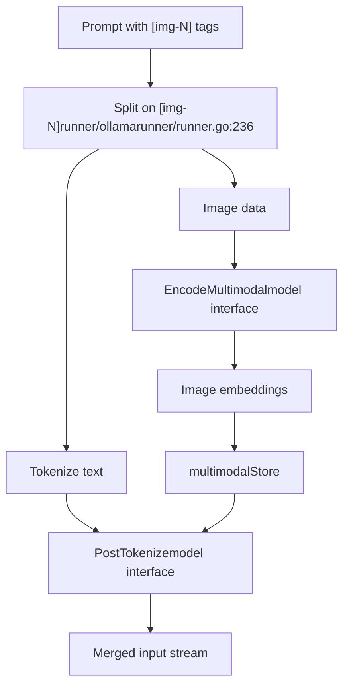
**图像 embedding 存储：**

-   图像通过视觉编码器处理为 embedding 张量
-   embedding 存储在 `multimodalStore` 中以便批组装
-   模型的 `PostTokenize` 方法将 embedding 与文本 token 进行排列

**Sources:** [runner/ollamarunner/runner.go222-298](https://github.com/ollama/ollama/blob/562c76d7/runner/ollamarunner/runner.go#L222-L298) [model/model.go51-80](https://github.com/ollama/ollama/blob/562c76d7/model/model.go#L51-L80)

### 多模态批组装

在构建批次时，runner 会同时处理 token 与 embedding 输入：

```
type Input struct {
    Token         int32          // Regular text token
    Multimodal    []Multimodal   // Image/audio embeddings
    MultimodalHash uint64        // Hash for caching
    SameBatch     int            // Keep next N inputs together
}
```
`SameBatch` 字段确保多 token embedding 保持在一起，防止它们被拆分到不同的批边界。

**Sources:** [model/input/input.go22-50](https://github.com/ollama/ollama/blob/562c76d7/model/input/input.go#L22-L50) [runner/ollamarunner/runner.go524-533](https://github.com/ollama/ollama/blob/562c76d7/runner/ollamarunner/runner.go#L524-L533)

## 性能考量

### 批大小优化

runner 基于以下因素动态调整批大小：

-   可用 GPU 内存
-   并行序列数量
-   模型架构约束

```
// From runner/ollamarunner/runner.go:522-533
batchSize := s.batchSize

for i, inp := range seq.inputs {
    minBatch := 1 + inp.SameBatch
    if minBatch > batchSize {
        batchSize = minBatch  // Extend for required together inputs
    }

    if len(batchInputs)+minBatch > batchSize {
        break  // Would exceed limit
    }
}
```
**Sources:** [runner/ollamarunner/runner.go522-577](https://github.com/ollama/ollama/blob/562c76d7/runner/ollamarunner/runner.go#L522-L577)

### 异步执行

当后端允许时，Ollama runner 支持异步批处理：

**同步点：**

-   `inputsReadyCh`：表示批输入已填充
-   `computeStartedCh`：表示计算已开始（可安全准备下一批）
-   `outputsReadyCh`：表示结果可用

**Sources:** [runner/ollamarunner/runner.go441-467](https://github.com/ollama/ollama/blob/562c76d7/runner/ollamarunner/runner.go#L441-L467) [runner/ollamarunner/runner.go471-484](https://github.com/ollama/ollama/blob/562c76d7/runner/ollamarunner/runner.go#L471-L484)

### 上下文窗口管理

当上下文窗口被填满时，runner 可以移动缓存：

```
// Shifting removes old tokens and preserves recent ones
// Keeps first numKeep tokens plus most recent tokens
if shift and pos >= numCtx {
    shiftAmount := numCtx / 2
    cache.Remove(numKeep, numKeep + shiftAmount)
    cache.ShiftPositions(numKeep + shiftAmount, numCtx, -shiftAmount)
}
```
**Sources:** [runner/ollamarunner/runner.go965-1017](https://github.com/ollama/ollama/blob/562c76d7/runner/ollamarunner/runner.go#L965-L1017)

## 错误处理与恢复

runner 实现了多种错误处理机制：

### 加载失败

在模型加载期间，调度器会重试或驱逐其他模型：

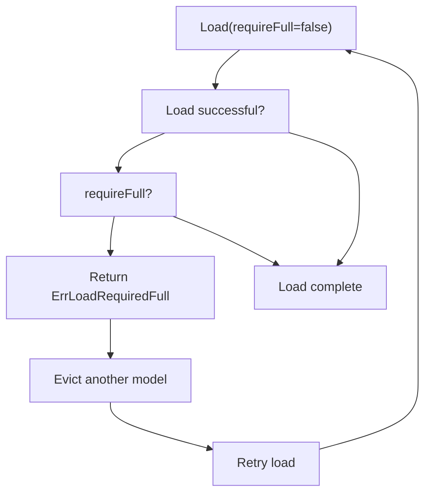
**Sources:** [llm/server.go746-899](https://github.com/ollama/ollama/blob/562c76d7/llm/server.go#L746-L899) [server/sched.go436-592](https://github.com/ollama/ollama/blob/562c76d7/server/sched.go#L436-L592)

### 运行时错误

-   **批溢出：**若批无法容纳，则拆分为更小批次
-   **KV 缓存已满：**返回 `ErrKvCacheFull`，触发上下文移动
-   **GPU OOM：**后端分配失败会触发优雅关闭

**Sources:** [runner/ollamarunner/runner.go469-827](https://github.com/ollama/ollama/blob/562c76d7/runner/ollamarunner/runner.go#L469-L827) [kvcache/cache.go11-12](https://github.com/ollama/ollama/blob/562c76d7/kvcache/cache.go#L11-L12)

### 进程监控

`llmServer` 会监控子进程是否崩溃：

```
// From llm/server.go:298-311go func() {    err := s.cmd.Wait()    if err != nil && s.status != nil && s.status.LastErrMsg != "" {        s.done <- errors.New(s.status.LastErrMsg)    } else {        s.done <- err    }}()
```
**Sources:** [llm/server.go298-311](https://github.com/ollama/ollama/blob/562c76d7/llm/server.go#L298-L311)

---

推理引擎为语言模型提供了灵活且高性能的执行环境。其分层架构允许存在多种后端实现，同时为模型操作保持一致的 API。调度层、runner 实现与后端抽象之间的分离，使其能够高效利用资源并支持多样化的硬件配置。
