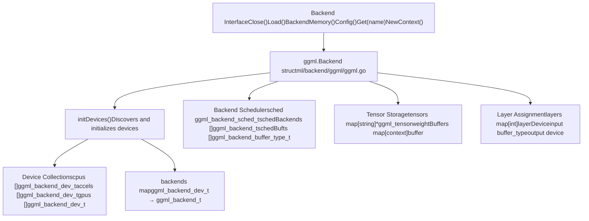
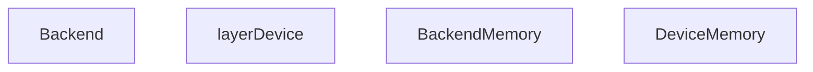
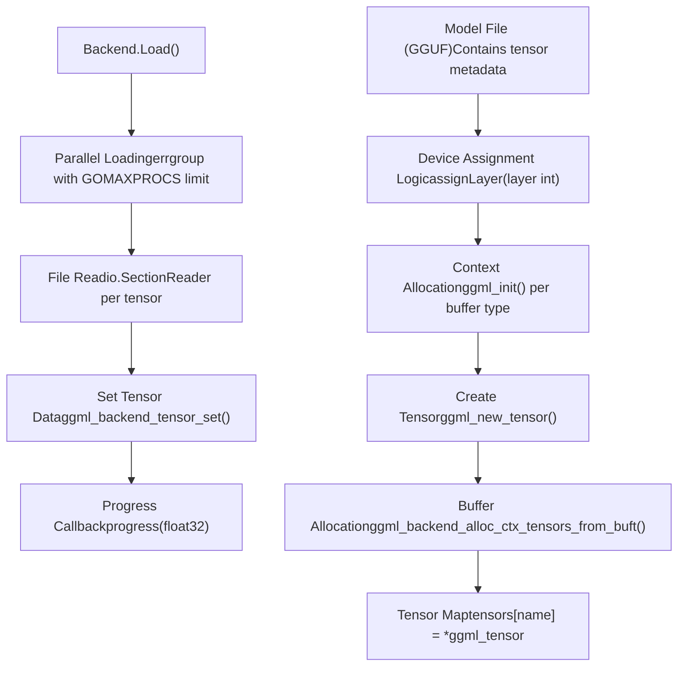
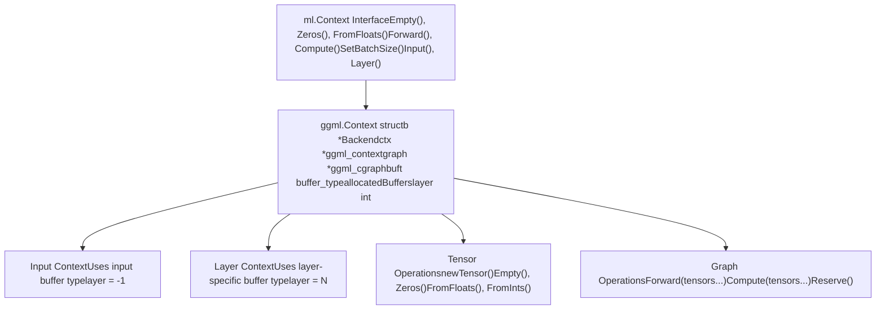
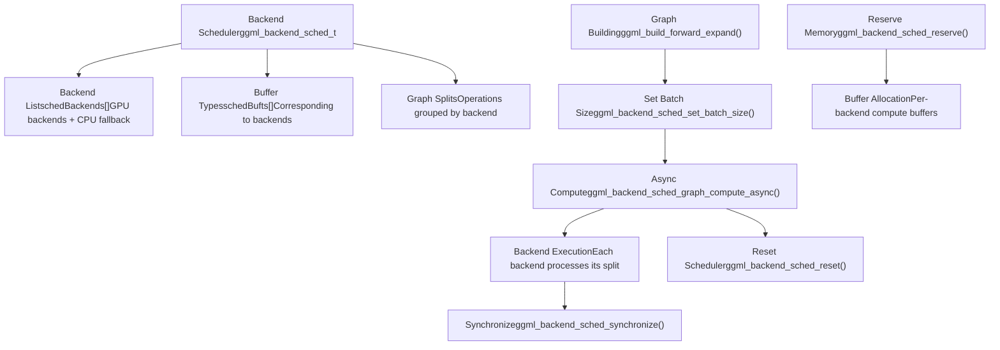
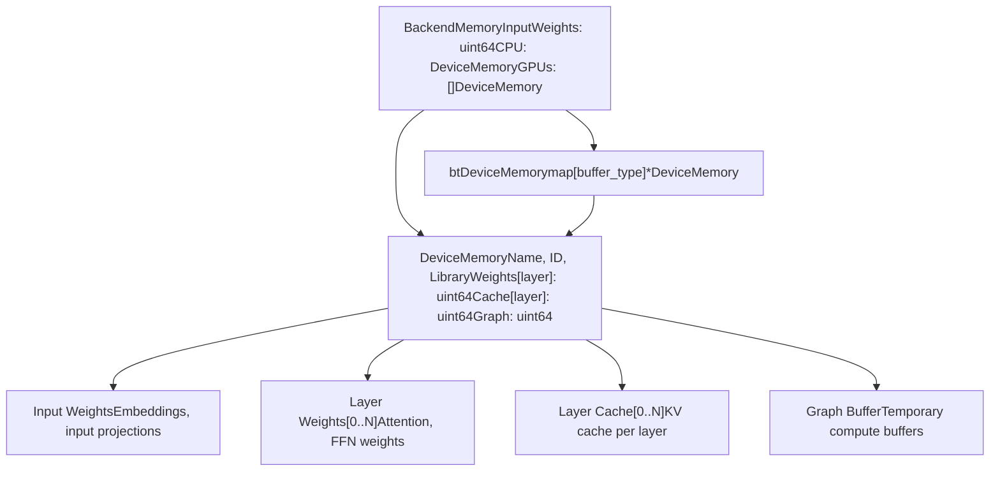
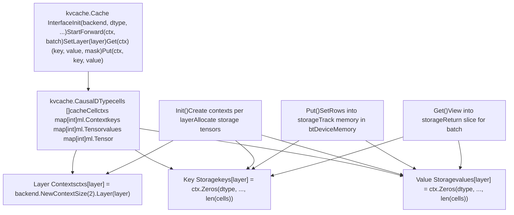
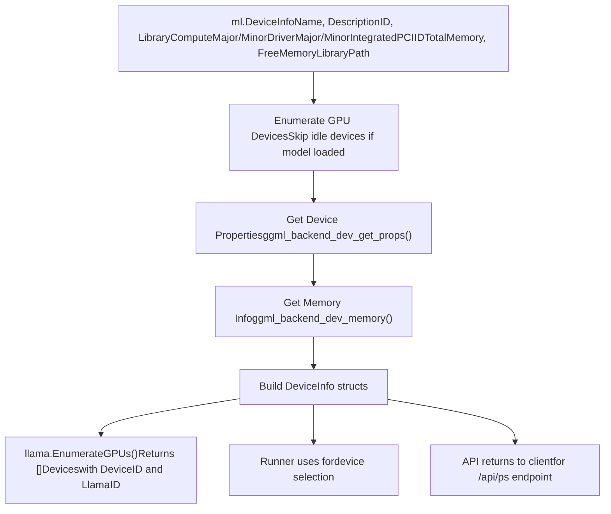

# GGML 后端与 ML 上下文

相关源文件

-   [integration/embed\_test.go](https://github.com/ollama/ollama/blob/562c76d7/integration/embed_test.go)
-   [kvcache/cache.go](https://github.com/ollama/ollama/blob/562c76d7/kvcache/cache.go)
-   [kvcache/causal.go](https://github.com/ollama/ollama/blob/562c76d7/kvcache/causal.go)
-   [kvcache/causal\_test.go](https://github.com/ollama/ollama/blob/562c76d7/kvcache/causal_test.go)
-   [kvcache/encoder.go](https://github.com/ollama/ollama/blob/562c76d7/kvcache/encoder.go)
-   [kvcache/wrapper.go](https://github.com/ollama/ollama/blob/562c76d7/kvcache/wrapper.go)
-   [llama/llama.go](https://github.com/ollama/ollama/blob/562c76d7/llama/llama.go)
-   [llama/sampling\_ext.cpp](https://github.com/ollama/ollama/blob/562c76d7/llama/sampling_ext.cpp)
-   [llama/sampling\_ext.h](https://github.com/ollama/ollama/blob/562c76d7/llama/sampling_ext.h)
-   [ml/backend.go](https://github.com/ollama/ollama/blob/562c76d7/ml/backend.go)
-   [ml/backend/ggml/ggml.go](https://github.com/ollama/ollama/blob/562c76d7/ml/backend/ggml/ggml.go)
-   [model/input/input.go](https://github.com/ollama/ollama/blob/562c76d7/model/input/input.go)
-   [model/model.go](https://github.com/ollama/ollama/blob/562c76d7/model/model.go)
-   [model/model\_test.go](https://github.com/ollama/ollama/blob/562c76d7/model/model_test.go)
-   [runner/llamarunner/cache.go](https://github.com/ollama/ollama/blob/562c76d7/runner/llamarunner/cache.go)
-   [runner/llamarunner/runner.go](https://github.com/ollama/ollama/blob/562c76d7/runner/llamarunner/runner.go)
-   [runner/ollamarunner/cache.go](https://github.com/ollama/ollama/blob/562c76d7/runner/ollamarunner/cache.go)
-   [runner/ollamarunner/cache\_test.go](https://github.com/ollama/ollama/blob/562c76d7/runner/ollamarunner/cache_test.go)
-   [runner/ollamarunner/runner.go](https://github.com/ollama/ollama/blob/562c76d7/runner/ollamarunner/runner.go)
-   [server/internal/internal/backoff/backoff.go](https://github.com/ollama/ollama/blob/562c76d7/server/internal/internal/backoff/backoff.go)

## 目的与范围

GGML 后端与 ML 上下文系统为在多样化硬件加速器（GPU、CPU、加速卡）上执行机器学习模型提供底层基础设施。**Backend** 负责设备发现、内存分配和张量存储，而 **Context** 提供用于构建和执行计算图的接口。二者共同抽象了硬件特定操作，并支持在不同设备上高效进行模型推理。

有关模型架构实现的信息，请参见[模型架构](/ollama/ollama/5.6-model-architectures)。有关 KV 缓存管理，请参见[KV 缓存系统](/ollama/ollama/5.3-kv-cache-system)。有关内存跟踪与 GPU 分配，请参见[内存管理与 GPU 分配](/ollama/ollama/5.4-memory-management-and-gpu-allocation)。

---

## 后端架构概览


**后端初始化与设备发现**

Sources: [ml/backend/ggml/ggml.go47-69](https://github.com/ollama/ollama/blob/562c76d7/ml/backend/ggml/ggml.go#L47-L69) [ml/backend/ggml/ggml.go123-449](https://github.com/ollama/ollama/blob/562c76d7/ml/backend/ggml/ggml.go#L123-L449)

GGML 后端通过设备初始化流程来发现并管理计算设备：

> **[Mermaid sequence]**
> *(图表结构无法解析)*

**设备类型与分类**

Sources: [ml/backend/ggml/ggml.go54-65](https://github.com/ollama/ollama/blob/562c76d7/ml/backend/ggml/ggml.go#L54-L65)

| 设备类型 | 枚举值 | 描述 | 存储 |
| --- | --- | --- | --- |
| `GGML_BACKEND_DEVICE_TYPE_CPU` | CPU | 主 CPU 设备（仅使用第一个 CPU） | `cpus []ggml_backend_dev_t` |
| `GGML_BACKEND_DEVICE_TYPE_ACCEL` | Accelerator | 硬件加速器 | `accels []ggml_backend_dev_t` |
| `GGML_BACKEND_DEVICE_TYPE_GPU` | GPU | 独立 GPU | `gpus []ggml_backend_dev_t` |
| `GGML_BACKEND_DEVICE_TYPE_IGPU` | Integrated GPU | 集成 GPU | `gpus []ggml_backend_dev_t` |

---

## Backend 结构体与内存管理


**Backend 结构体字段**

Sources: [ml/backend/ggml/ggml.go76-119](https://github.com/ollama/ollama/blob/562c76d7/ml/backend/ggml/ggml.go#L76-L119)

`Backend` 结构体维护模型执行的全部状态：

| 字段 | 类型 | 用途 |
| --- | --- | --- |
| `modelPath` | `string` | 模型文件位置 |
| `meta` | `*fsggml.GGML` | 来自 GGUF 文件的模型元数据 |
| `allocMemory` | `bool` | 是否实际分配内存（dry run 时为 false） |
| `tensorLoadTargets` | `map[string][]string` | 将文件中的 tensor 名映射到模型 tensor 名 |
| `sched` | `ggml_backend_sched_t` | 计算图的后端调度器 |
| `schedBackends` | `[]ggml_backend_t` | 调度器使用的后端集合 |
| `schedBufts` | `[]ggml_backend_buffer_type_t` | 调度器使用的缓冲区类型 |
| `tensors` | `map[string]*ggml_tensor` | 按名称索引的全部模型张量 |
| `input` | `ggml_backend_buffer_type_t` | 输入张量的缓冲区类型 |
| `output` | `ggml_backend_dev_t` | 输出层所在设备 |
| `layers` | `map[int]layerDevice` | 每层的设备分配 |
| `requiredMemory` | `*BackendMemory` | 各设备的内存需求 |
| `maxGraphNodes` | `int` | 计算图最大节点数 |
| `weightBuffers` | `map[*ggml_context]ggml_backend_buffer_t` | 权重存储缓冲区 |

---

## 张量创建与加载


**张量分配策略**

Sources: [ml/backend/ggml/ggml.go203-229](https://github.com/ollama/ollama/blob/562c76d7/ml/backend/ggml/ggml.go#L203-L229) [ml/backend/ggml/ggml.go306-343](https://github.com/ollama/ollama/blob/562c76d7/ml/backend/ggml/ggml.go#L306-L343)

张量会根据其功能分配到设备：

1.  **输入张量**（`position_embd`、`token_embd`、`token_norm_embd`）：始终位于 CPU 输入缓冲区
2.  **输出张量**（`cls`、`output`、`output_norm`）：根据 `output` 设备分配（由层分配决定 CPU 或 GPU）
3.  **视觉张量**（前缀为 `v.`、`mm.`、`s.`）：当前分配到输出设备
4.  **RoPE 张量**（`rope_freqs`、`rope_factors_*`）：按层在对应层设备上重复
5.  **层张量**（前缀为 `blk.N.`）：按 GPU 层配置分配到第 N 层对应设备
6.  **其他张量**：默认分配到 CPU 输入缓冲区

**张量加载流程**

Sources: [ml/backend/ggml/ggml.go468-645](https://github.com/ollama/ollama/blob/562c76d7/ml/backend/ggml/ggml.go#L468-L645)

`Load()` 方法会并行从磁盘加载张量权重：

```
// Parallel loading with concurrency limitg, ctx := errgroup.WithContext(ctx)g.SetLimit(runtime.GOMAXPROCS(0)) for _, t := range b.meta.Tensors().Items() {    g.Go(func() error {        // Open separate FD per goroutine for sequential reads        file, err := os.Open(b.modelPath)        sr := io.NewSectionReader(file, offset, size)                // Read in chunks and set tensor data        for s < t.Size() {            n, err := io.ReadFull(sr, bts[:])            C.ggml_backend_tensor_set(tt, data, offset, size)            progress(float32(done) / float32(total))        }    })}
```
以下情况存在特殊处理：

-   **MXFP4 格式转换** [ml/backend/ggml/ggml.go528-566](https://github.com/ollama/ollama/blob/562c76d7/ml/backend/ggml/ggml.go#L528-L566)：将原始 MXFP4 流转换为 GGML 格式
-   **BF16 到 FP32 转换** [ml/backend/ggml/ggml.go567-594](https://github.com/ollama/ollama/blob/562c76d7/ml/backend/ggml/ggml.go#L567-L594)：为兼容性转换 `_exps.bias` 张量

---

## ML 上下文系统


**上下文结构**

Sources: [ml/backend/ggml/ggml.go741-762](https://github.com/ollama/ollama/blob/562c76d7/ml/backend/ggml/ggml.go#L741-L762)

`Context` 结构体负责临时张量分配与计算图构建：

| 字段 | 类型 | 用途 |
| --- | --- | --- |
| `b` | `*Backend` | 对父后端的引用 |
| `ctx` | `*ggml_context` | 用于张量元数据的 GGML 上下文 |
| `graph` | `*ggml_cgraph` | 正在构建的计算图 |
| `batchSize` | `int` | 处理优化提示 |
| `buft` | `ggml_backend_buffer_type_t` | 新张量使用的缓冲区类型 |
| `allocatedBuffers` | `*[]ggml_backend_buffer_t` | 关闭时需要释放的缓冲区 |
| `maxGraphNodes` | `int` | 允许的最大图节点数 |
| `layer` | `int` | 用于内存记账的层索引（-1 = input/cache） |

**上下文创建**

Sources: [ml/backend/ggml/ggml.go663-684](https://github.com/ollama/ollama/blob/562c76d7/ml/backend/ggml/ggml.go#L663-L684)

```
func (b *Backend) NewContext() ml.Context {    return b.NewContextSize(b.maxGraphNodes)} func (b *Backend) NewContextSize(n int) ml.Context {    var allocatedBuffers []ggml_backend_buffer_t        return &Context{        b:                b,        maxGraphNodes:    n,        ctx: C.ggml_init(C.struct_ggml_init_params{            mem_size: C.size_t(n)*C.ggml_tensor_overhead() +                       C.ggml_graph_overhead_custom(C.size_t(n), false),            no_alloc: true,        }),        allocatedBuffers: &allocatedBuffers,        layer:            -1,    }}
```
**上下文特化**

Sources: [ml/backend/ggml/ggml.go764-792](https://github.com/ollama/ollama/blob/562c76d7/ml/backend/ggml/ggml.go#L764-L792)

上下文可针对不同用途进行特化：

1.  **输入上下文**（`Input()`）：用于输入张量与模型输出
    -   使用 `b.input` 缓冲区类型（通常为 CPU）
    -   层设为 -1
2.  **层上下文**（`Layer(i)`）：用于层专属张量
    -   使用来自 `b.layers[i]` 的缓冲区类型
    -   层设为 `i`，用于 KV 缓存中的内存记账

---

## 张量操作与计算图构建

> **[Mermaid sequence]**
> *(图表结构无法解析)*

**张量创建方法**

Sources: [ml/backend/ggml/ggml.go889-1006](https://github.com/ollama/ollama/blob/562c76d7/ml/backend/ggml/ggml.go#L889-L1006)

| 方法 | 用途 | 示例 |
| --- | --- | --- |
| `Empty(dtype, shape...)` | 分配未初始化张量 | `ctx.Empty(ml.DTypeF32, 1024, 768)` |
| `Zeros(dtype, shape...)` | 分配零初始化张量 | `ctx.Zeros(ml.DTypeF16, 512)` |
| `FromFloats(s, shape...)` | 从 float32 切片创建 | `ctx.FromFloats([]float32{1,2,3}, 3)` |
| `FromInts(s, shape...)` | 从 int32 切片创建 | `ctx.FromInts([]int32{0,1,2}, 3)` |
| `FromBytes(dtype, s, shape...)` | 从字节切片创建 | `ctx.FromBytes(ml.DTypeQ80, data, 1024)` |
| `Arange(start, stop, step, dtype)` | 创建范围张量 | `ctx.Arange(0, 512, 1, ml.DTypeI32)` |

**计算图构建与执行**

Sources: [ml/backend/ggml/ggml.go794-870](https://github.com/ollama/ollama/blob/562c76d7/ml/backend/ggml/ggml.go#L794-L870)

`Forward()` 方法将张量加入计算图，而 `Compute()` 执行该图：

```
// Add tensors to graphfunc (c *Context) Forward(tensors ...ml.Tensor) ml.Context {    if c.graph == nil {        c.graph = C.ggml_new_graph_custom(c.ctx,             C.size_t(c.maxGraphNodes), false)    }        for _, tensor := range tensors {        C.ggml_build_forward_expand(c.graph, tensor.(*Tensor).t)    }        return c} // Execute graphfunc (c *Context) Compute(tensors ...ml.Tensor) {    c.b.schedMu.Lock()    defer c.b.schedMu.Unlock()        if c.batchSize > 0 {        C.ggml_backend_sched_set_batch_size(c.b.sched, C.int(c.batchSize))    }        status := C.ggml_backend_sched_graph_compute_async(c.b.sched, c.graph)    C.ggml_backend_sched_reset(c.b.sched)        // Set up sync function for tensor data retrieval    sync := func() {        C.ggml_backend_sched_synchronize(c.b.sched)    }}
```
**`ComputeWithNotify` 变体**

Sources: [ml/backend/ggml/ggml.go814-843](https://github.com/ollama/ollama/blob/562c76d7/ml/backend/ggml/ggml.go#L814-L843)

`ComputeWithNotify()` 方法允许在计算开始时进行异步通知，从而支持流水线批处理：

```
func (c *Context) ComputeWithNotify(cb func(), tensors ...ml.Tensor) {    c.b.schedMu.Lock()    defer c.b.schedMu.Unlock()        if cb != nil {        go cb()  // Notify in goroutine    }        status := C.ggml_backend_sched_graph_compute_async(c.b.sched, c.graph)    // ... setup sync for tensors}
```
runner 使用该方法在 GPU 执行的同时重叠准备批次 [runner/ollamarunner/runner.go720-728](https://github.com/ollama/ollama/blob/562c76d7/runner/ollamarunner/runner.go#L720-L728)

---

## 后端调度器与计算图执行


**调度器初始化**

Sources: [ml/backend/ggml/ggml.go356-391](https://github.com/ollama/ollama/blob/562c76d7/ml/backend/ggml/ggml.go#L356-L391)

调度器使用所有参与后端及其缓冲区类型创建：

```
// Create backends and buffer types for schedulervar schedBackends []C.ggml_backend_tvar schedBufts []C.ggml_backend_buffer_type_t for _, d := range append(gpus, append(accels, cpus...)...) {    b := backends[d]    bt := C.ggml_backend_get_default_buffer_type(b)        // Skip devices where no layers are assigned (except CPU fallback)    if !slices.Contains(cpuDeviceBufferType.bts, bt) {        if c, ok := ctxs[bt]; !ok || C.ggml_get_first_tensor(c) == nil {            continue        }    }        schedBackends = append(schedBackends, b)    schedBufts = append(schedBufts, bt)        if C.ggml_backend_is_cpu(b) {        C.ggml_backend_cpu_set_n_threads(b, C.int(Threads(params.NumThreads)))    }} maxGraphNodes := max(1024, len(meta.Tensors().Items())*32) sched := C.ggml_backend_sched_new_ext(    (*C.ggml_backend_t)(unsafe.Pointer(&schedBackends[0])),    (*C.ggml_backend_buffer_type_t)(unsafe.Pointer(&schedBufts[0])),    C.int(len(schedBackends)),    C.size_t(maxGraphNodes),    C._Bool(false),    C._Bool(true),    C._Bool(params.AllocMemory),)
```
**Reserve 操作**

Sources: [ml/backend/ggml/ggml.go845-870](https://github.com/ollama/ollama/blob/562c76d7/ml/backend/ggml/ggml.go#L845-L870)

`Reserve()` 方法会为最坏情况下的计算图大小预分配计算缓冲区：

```
func (c *Context) Reserve() {    if c.batchSize > 0 {        C.ggml_backend_sched_set_batch_size(c.b.sched, C.int(c.batchSize))    }        reserved := C.ggml_backend_sched_reserve(c.b.sched, c.graph)        // Track allocated buffer sizes per backend    for i := range c.b.schedBackends {        bufferSize := C.ggml_backend_sched_get_attempted_buffer_size(            c.b.sched, c.b.schedBackends[i])        c.b.btDeviceMemory[c.b.schedBufts[i]].Graph += uint64(bufferSize)    }        if !reserved {        panic(ml.ErrNoMem{BackendMemory: *c.b.requiredMemory})    }}
```
---

## 设备内存跟踪


**内存分配跟踪**

Sources: [ml/backend/ggml/ggml.go149-198](https://github.com/ollama/ollama/blob/562c76d7/ml/backend/ggml/ggml.go#L149-L198) [ml/backend/ggml/ggml.go280-289](https://github.com/ollama/ollama/blob/562c76d7/ml/backend/ggml/ggml.go#L280-L289)

在后端初始化期间，会按设备跟踪内存需求：

```
// Initialize memory tracking structuresrequiredMemory := ml.BackendMemory{}btDeviceMemory := make(map[C.ggml_backend_buffer_type_t]*ml.DeviceMemory) // CPU device memorycpuDeviceMemory := &requiredMemory.CPUcpuDeviceMemory.Name = C.GoString(C.ggml_backend_dev_name(cpuDevice))cpuDeviceMemory.Weights = make([]uint64, blocks+1)cpuDeviceMemory.Cache = make([]uint64, blocks+1) // GPU device memoryrequiredMemory.GPUs = make([]ml.DeviceMemory, len(gpus))for i, d := range gpus {    bt := C.ggml_backend_dev_buffer_type(d)    btDeviceMemory[bt] = &requiredMemory.GPUs[i]    requiredMemory.GPUs[i].Weights = make([]uint64, blocks+1)    requiredMemory.GPUs[i].Cache = make([]uint64, blocks+1)} // Track tensor allocationsize := pad(C.ggml_backend_buft_get_alloc_size(bt, tt),             C.ggml_backend_buft_get_alignment(bt))if layer == -1 {    requiredMemory.InputWeights += uint64(size)} else {    btDeviceMemory[bt].Weights[layer] += uint64(size)}
```
**缓存内存记账**

Sources: [ml/backend/ggml/ggml.go909-924](https://github.com/ollama/ollama/blob/562c76d7/ml/backend/ggml/ggml.go#L909-L924)

当上下文为 KV 缓存创建张量时，内存会按层进行跟踪：

```
func (c *Context) newTensor(dtype ml.DType, shape []int) *Tensor {    t := C.ggml_new_tensor(c.ctx, cdtype, C.int(len(shape)), shapeToGGML(shape))    size := pad(C.ggml_backend_buft_get_alloc_size(c.buft, t),                 C.ggml_backend_buft_get_alignment(c.buft))        b := C.ggml_backend_buft_alloc_buffer(c.buft, size)    if c.layer >= 0 {        c.b.btDeviceMemory[c.buft].Cache[c.layer] += uint64(size)    }        *c.allocatedBuffers = append(*c.allocatedBuffers, b)    C.ggml_backend_tensor_alloc(b, t, C.ggml_backend_buffer_get_base(b))    return &Tensor{b: c.b, t: t}}
```
---

## 与模型系统的集成

> **[Mermaid sequence]**
> *(图表结构无法解析)*

**后端注册与创建**

Sources: [ml/backend.go76-92](https://github.com/ollama/ollama/blob/562c76d7/ml/backend.go#L76-L92) [ml/backend/ggml/ggml.go451-453](https://github.com/ollama/ollama/blob/562c76d7/ml/backend/ggml/ggml.go#L451-L453)

GGML 后端在包初始化期间完成自注册：

```
// In ml/backend/ggml/ggml.gofunc init() {    ml.RegisterBackend("ggml", New)} // In ml/backend.govar backends = make(map[string]func(string, BackendParams) (Backend, error)) func RegisterBackend(name string, f func(string, BackendParams) (Backend, error)) {    if _, ok := backends[name]; ok {        panic("backend: backend already registered")    }    backends[name] = f} func NewBackend(modelPath string, params BackendParams) (Backend, error) {    if backend, ok := backends["ggml"]; ok {        return backend(modelPath, params)    }    return nil, fmt.Errorf("unsupported backend")}
```
**模型字段填充**

Sources: [model/model.go113-135](https://github.com/ollama/ollama/blob/562c76d7/model/model.go#L113-L135) [model/model.go175-259](https://github.com/ollama/ollama/blob/562c76d7/model/model.go#L175-L259)

模型系统使用反射，将来自后端的张量填充到模型结构体字段：

```
func New(modelPath string, params ml.BackendParams) (Model, error) {    b, err := ml.NewBackend(modelPath, params)    if err != nil {        return nil, err    }        m, err := modelForArch(b.Config())    if err != nil {        return nil, err    }        base := Base{b: b, config: m.Config()}    v := reflect.ValueOf(m)    v.Elem().Set(populateFields(base, v.Elem()))        return m, nil} // populateFields uses struct tags to fetch tensors// For example: `gguf:"attn_q"` fetches backend.Get("attn_q.weight")
```
---

## 与 KV 缓存系统的集成


**使用后端进行缓存初始化**

Sources: [kvcache/causal.go130-182](https://github.com/ollama/ollama/blob/562c76d7/kvcache/causal.go#L130-L182)

缓存通过后端创建上下文并分配张量：

```
func (c *Causal) Init(backend ml.Backend, dtype ml.DType,                       maxSequences, capacity, maxBatch int) {    // Get cache configuration from backend if available    if c.config == nil {        var config ml.CacheConfig        if cc, ok := backend.(ml.BackendCacheConfig); ok {            config = cc.CacheConfig()        }        c.config = &config    }        // Calculate cache size    var cacheSize int    if c.swaMemorySize == math.MaxInt32 {        cacheSize = maxSequences * capacity    } else {        cacheSize = (maxSequences * int(c.swaMemorySize)) + maxBatch    }    cacheSize = roundUp(cacheSize, c.config.CachePadding)        c.cells = make([]cacheCell, cacheSize)    c.DType = dtype    c.backend = backend}
```
**按层创建上下文与张量**

Sources: [kvcache/causal.go449-495](https://github.com/ollama/ollama/blob/562c76d7/kvcache/causal.go#L449-L495)

存储缓存数据时，缓存会创建按层专属的上下文与张量：

```
func (c *Causal) Put(ctx ml.Context, key, value ml.Tensor) {    // Create layer context if not exists    if _, ok := c.ctxs[c.curLayer]; !ok {        c.ctxs[c.curLayer] = c.backend.NewContextSize(2).Layer(c.curLayer)    }        // Allocate storage tensors if not exists    if _, ok := c.keys[c.curLayer]; !ok {        c.keys[c.curLayer] = c.ctxs[c.curLayer].Zeros(            c.DType, kHeadDim, numKVHeads, len(c.cells))    }        if _, ok := c.values[c.curLayer]; !ok {        if c.config.PermutedV {            c.values[c.curLayer] = c.ctxs[c.curLayer].Zeros(                c.DType, len(c.cells), vHeadDim, numKVHeads)        } else {            c.values[c.curLayer] = c.ctxs[c.curLayer].Zeros(                c.DType, vHeadDim, numKVHeads, len(c.cells))        }    }        // Store key/value using SetRows    key = key.Reshape(ctx, kHeadDim*numKVHeads, batchSize)    keyCache = c.keys[c.curLayer].Reshape(ctx, kHeadDim*numKVHeads, len(c.cells))    ctx.Forward(keyCache.SetRows(ctx, key, c.curLoc))}
```
`Layer()` 方法确保上下文会为特定层跟踪内存 [ml/backend/ggml/ggml.go909-924](https://github.com/ollama/ollama/blob/562c76d7/ml/backend/ggml/ggml.go#L909-L924)

---

## 后端设备枚举


**设备枚举实现**

Sources: [ml/backend/ggml/ggml.go694-739](https://github.com/ollama/ollama/blob/562c76d7/ml/backend/ggml/ggml.go#L694-L739) [llama/llama.go72-94](https://github.com/ollama/ollama/blob/562c76d7/llama/llama.go#L72-L94)

后端为 GPU 调度器和 API 提供设备信息：

```
func (b *Backend) BackendDevices() []ml.DeviceInfo {    deviceInfos := []ml.DeviceInfo{}        for _, dev := range gpus {        // Skip unused devices if model is loaded        if b.allocMemory {            idleDev := true            for _, backend := range b.schedBackends {                if dev == C.ggml_backend_get_device(backend) {                    idleDev = false                    break                }            }            if idleDev {                continue            }        }                info := ml.DeviceInfo{}        props := C.struct_ggml_backend_dev_props{}        C.ggml_backend_dev_get_props(dev, &props)                info.Name = C.GoString(props.name)        info.Description = C.GoString(props.description)        info.ID = C.GoString(props.id)        info.Library = C.GoString(props.library)        info.ComputeMajor = (int)(props.compute_major)        info.ComputeMinor = (int)(props.compute_minor)        info.DriverMajor = (int)(props.driver_major)        info.DriverMinor = (int)(props.driver_minor)                C.ggml_backend_dev_memory(dev, &props.memory_free, &props.memory_total)        info.TotalMemory = (uint64)(props.memory_total)        info.FreeMemory = (uint64)(props.memory_free)                deviceInfos = append(deviceInfos, info)    }        return deviceInfos}
```
---

## Flash Attention 与缓存配置

**后端缓存配置**

Sources: [ml/backend.go34-57](https://github.com/ollama/ollama/blob/562c76d7/ml/backend.go#L34-L57) [ml/backend/ggml/ggml.go686-692](https://github.com/ollama/ollama/blob/562c76d7/ml/backend/ggml/ggml.go#L686-L692)

后端可实现 `BackendCacheConfig` 来指定缓存操作优化：

```
type BackendCacheConfig interface {    CacheConfig() CacheConfig} type CacheConfig struct {    // CachePadding specifies padding multiple for cache history    CachePadding int        // PermutedV performs Permute(ctx, 1, 2, 0, 3) on v tensors    PermutedV bool        // MaskDType specifies data type for mask generation    MaskDType DType} func (b *Backend) CacheConfig() ml.CacheConfig {    if b.flashAttention == ml.FlashAttentionEnabled {        return ml.CacheConfig{CachePadding: 256, MaskDType: ml.DTypeF16}    } else {        return ml.CacheConfig{CachePadding: 256, PermutedV: true}    }}
```
这些配置支持：

-   **Flash Attention**：使用 F16 掩码与 256-token padding，以匹配融合内核
-   **标准 Attention**：使用置换后的 V 缓存，以避免 `Contiguous()` 调用

Sources: [ml/backend/ggml/ggml.go686-692](https://github.com/ollama/ollama/blob/562c76d7/ml/backend/ggml/ggml.go#L686-L692) [kvcache/causal.go130-145](https://github.com/ollama/ollama/blob/562c76d7/kvcache/causal.go#L130-L145)

---

## 完整推理流程示例

> **[Mermaid sequence]**
> *(图表结构无法解析)*

该流程演示了：

1.  **后端初始化**：设备发现与张量分配
2.  **上下文创建**：面向输入和层的特化上下文
3.  **计算图构建**：使用 `Forward()` 添加操作
4.  **异步执行**：使用 `ComputeWithNotify()` 进行流水线化
5.  **缓存集成**：用于 KV 存储的按层上下文
6.  **内存管理**：通过 `Close()` 自动清理

Sources: [runner/ollamarunner/runner.go470-633](https://github.com/ollama/ollama/blob/562c76d7/runner/ollamarunner/runner.go#L470-L633) [ml/backend/ggml/ggml.go663-843](https://github.com/ollama/ollama/blob/562c76d7/ml/backend/ggml/ggml.go#L663-L843) [model/model.go323-348](https://github.com/ollama/ollama/blob/562c76d7/model/model.go#L323-L348)
