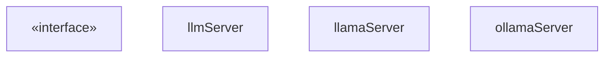
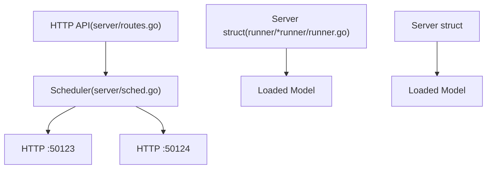
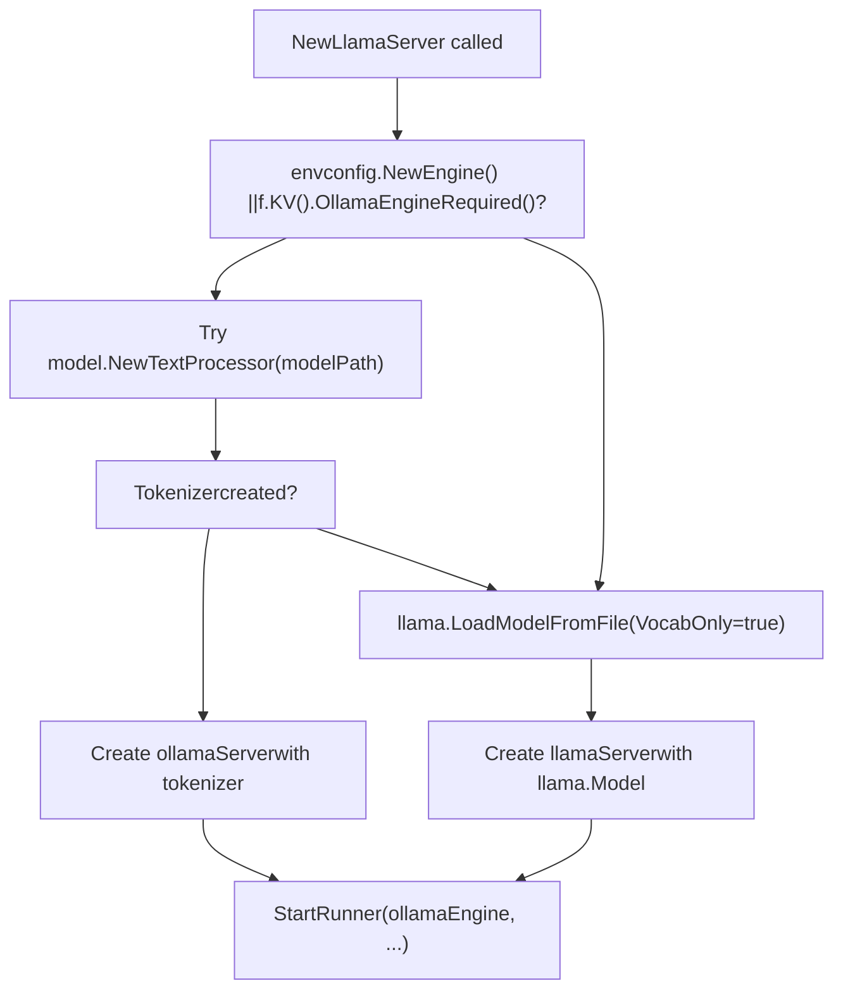
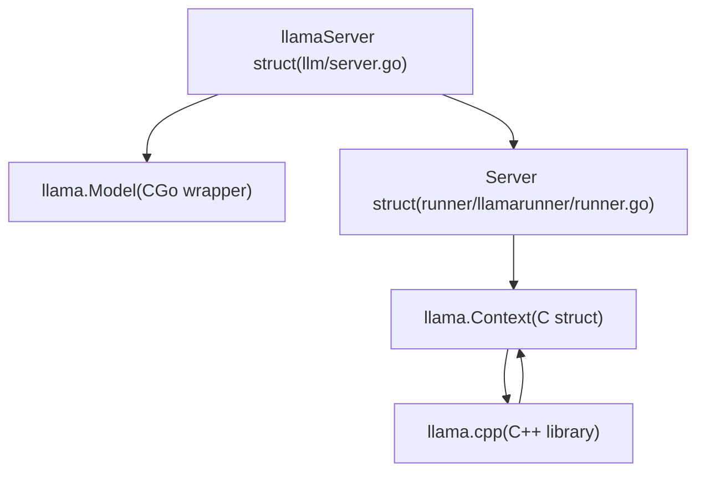
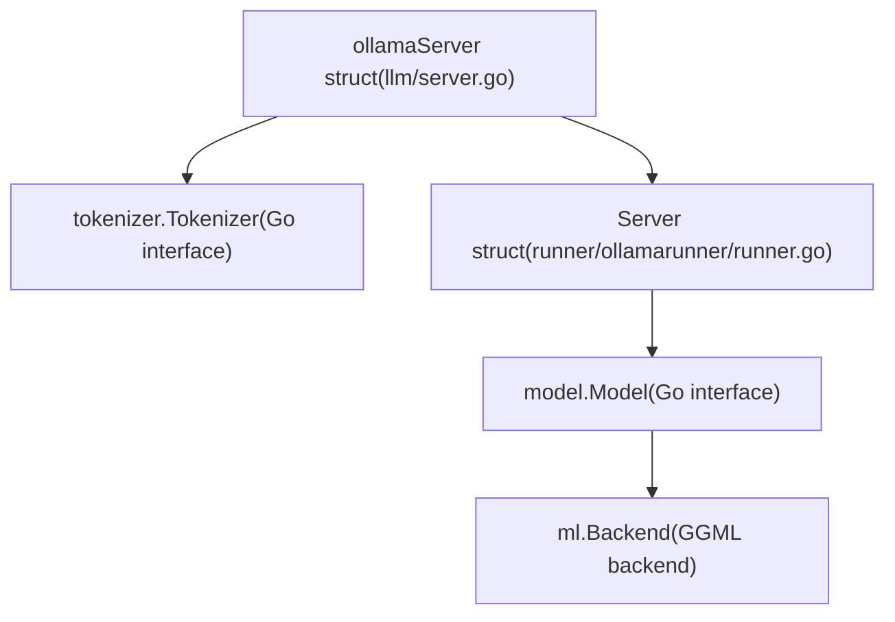
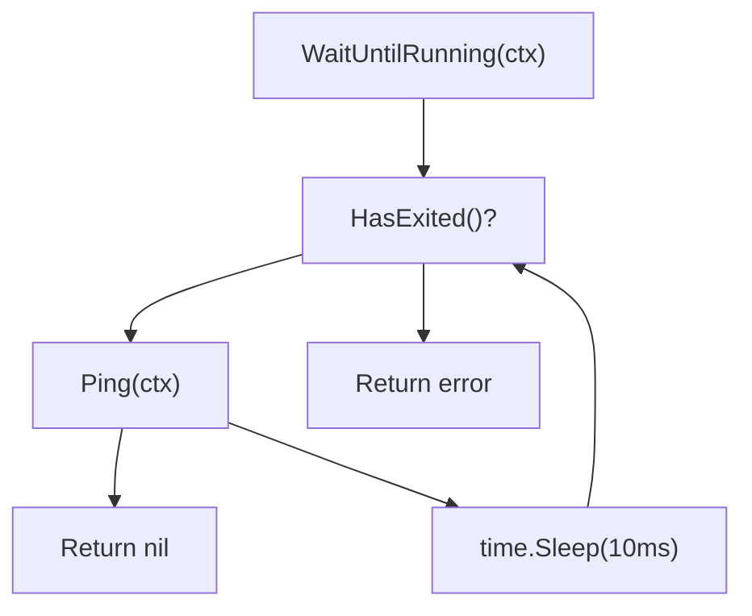
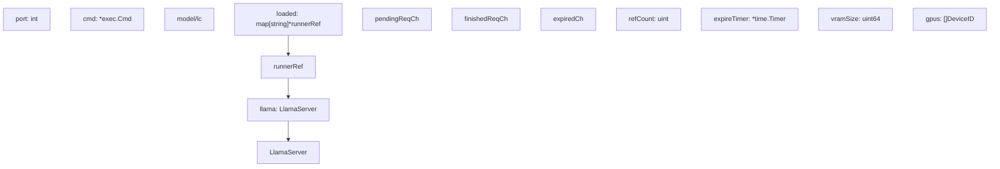

# LlamaServer 与 Runner 实现

相关源文件

-   [envconfig/config.go](https://github.com/ollama/ollama/blob/562c76d7/envconfig/config.go)
-   [envconfig/config\_test.go](https://github.com/ollama/ollama/blob/562c76d7/envconfig/config_test.go)
-   [llama/llama.go](https://github.com/ollama/ollama/blob/562c76d7/llama/llama.go)
-   [llama/sampling\_ext.cpp](https://github.com/ollama/ollama/blob/562c76d7/llama/sampling_ext.cpp)
-   [llama/sampling\_ext.h](https://github.com/ollama/ollama/blob/562c76d7/llama/sampling_ext.h)
-   [llm/server.go](https://github.com/ollama/ollama/blob/562c76d7/llm/server.go)
-   [server/sched.go](https://github.com/ollama/ollama/blob/562c76d7/server/sched.go)
-   [server/sched\_test.go](https://github.com/ollama/ollama/blob/562c76d7/server/sched_test.go)

## 目的与范围

本页记录 Ollama 推理引擎中的 runner 子进程架构。Runner 与主 Ollama 服务器分离进程运行，以提供隔离性与稳定性。Runner 层位于调度器（见 [2.2](/ollama/ollama/2.2-request-scheduling-and-runner-management)）之后，负责执行实际模型推理。

**关键职责：**

-   **子进程管理**：Runner 作为独立进程运行，通过 HTTP 通信
-   **双实现**：基于 CGo 的实现（llamaServer）与 Go 原生实现（ollamaServer）
-   **进程生命周期**：启动、初始化、健康检查与优雅关闭
-   **API 接口**：用于模型加载、推理与分词的 HTTP 端点

有关 GPU 内存分配与层分布的信息，请参见 [5.4](/ollama/ollama/5.4-memory-management-and-gpu-allocation)。有关 KV 缓存系统的细节，请参见 [5.3](/ollama/ollama/5.3-kv-cache-system)。有关 runner 内部的批处理与序列管理，请参见 [2.3](/ollama/ollama/2.3-model-execution-pipeline)。

---

## LlamaServer 接口

`LlamaServer` 接口定义了所有 runner 实现必须满足的契约。它为调度器提供统一 API，使其可在不关心底层实现差异的情况下与已加载模型交互。

**LlamaServer 接口与实现**


**关键方法：**

| 方法 | 用途 |
| --- | --- |
| `Load()` | 分配内存并将模型权重加载到 GPU/CPU |
| `Completion()` | 通过 HTTP 执行文本生成推理 |
| `Embedding()` | 通过 HTTP 为输入文本生成 embedding |
| `WaitUntilRunning()` | 阻塞直到 runner 子进程就绪 |
| `Ping()` | 检查子进程是否可响应 |
| `Close()` | 关闭 runner 子进程并释放资源 |
| `VRAMSize()` | 报告所有 GPU 的总 VRAM 使用量 |
| `Pid()` | 获取子进程进程 ID |
| `GetPort()` | 获取用于子进程通信的 HTTP 端口 |
| `HasExited()` | 检查子进程是否已终止 |

Sources: [llm/server.go67-85](https://github.com/ollama/ollama/blob/562c76d7/llm/server.go#L67-L85) [llm/server.go88-109](https://github.com/ollama/ollama/blob/562c76d7/llm/server.go#L88-L109)

---

## 子进程架构

### 进程分离

Ollama 在独立子进程中运行模型推理，而不是在主服务器进程中运行。这带来：

-   **隔离性**：推理崩溃不会拖垮主服务器
-   **资源管理**：进程退出时可干净回收 VRAM
-   **灵活性**：不同 runner 实现可并存

**进程结构图**


Sources: [llm/server.go320-438](https://github.com/ollama/ollama/blob/562c76d7/llm/server.go#L320-L438) [server/sched.go39-60](https://github.com/ollama/ollama/blob/562c76d7/server/sched.go#L39-L60)

### 子进程启动

**StartRunner 函数流程**

Sources: [llm/server.go321-438](https://github.com/ollama/ollama/blob/562c76d7/llm/server.go#L321-L438)

**StartRunner 的关键步骤** [llm/server.go321-438](https://github.com/ollama/ollama/blob/562c76d7/llm/server.go#L321-L438)：

1.  **二进制路径**：调用 `os.Executable()` 获取当前二进制并解析符号链接
2.  **端口分配**：尝试绑定 `localhost:0` 获取空闲端口，失败时退回到随机临时端口（49152-65535）
3.  **命令构造**：构建参数 `[
"runner", "--ollama-engine" (optional), "--model", path, "--port", port]`
4.  **环境设置**：
    -   为 GPU 库设置 `PATH`/`LD_LIBRARY_PATH`/`DYLD_LIBRARY_PATH`
    -   设置 GPU 可见性变量（如 `CUDA_VISIBLE_DEVICES`）
    -   透传 `OLLAMA_*` 环境变量
5.  **进程启动**：调用 `cmd.Start()` fork 子进程
6.  **Reaper Goroutine**：启动 goroutine 调用 `cmd.Wait()`，并将退出状态转发到 `done` 通道

Sources: [llm/server.go321-438](https://github.com/ollama/ollama/blob/562c76d7/llm/server.go#L321-L438)

---

## Runner 实现

Ollama 实现了两种不同的 runner 架构，依据模型兼容性与配置进行选择。

**实现选择图**


**选择逻辑：**

1.  **ollamaServer**（Go 原生）：当 `OLLAMA_NEW_ENGINE=true` 或模型 GGUF 元数据含 `ollama.engine_required=true` 时使用
2.  **llamaServer**（CGo）：用于尚未兼容新引擎的模型，依赖 llama.cpp 的 CGo 接入

Sources: [llm/server.go144-319](https://github.com/ollama/ollama/blob/562c76d7/llm/server.go#L144-L319)

### llamaServer（CGo 实现）

`llamaServer` 通过 CGo 绑定使用 llama.cpp。这是支持模型架构范围最广的传统实现。

**架构：**


**关键组件：**

-   **llama.Model** [llama/llama.go450-452](https://github.com/ollama/ollama/blob/562c76d7/llama/llama.go#L450-L452)：对 llama.cpp 中 C `llama_model` 结构体的 CGo 包装
-   **llama.Context** [llama/llama.go161-164](https://github.com/ollama/ollama/blob/562c76d7/llama/llama.go#L161-L164)：对用于推理状态的 C `llama_context` 的 CGo 包装
-   **Server struct** [runner/llamarunner/runner.go256-308](https://github.com/ollama/ollama/blob/562c76d7/runner/llamarunner/runner.go#L256-L308)：管理序列与批处理的子进程服务器
-   **CGo 绑定** [llama/llama.go1-60](https://github.com/ollama/ollama/blob/562c76d7/llama/llama.go#L1-L60)：llama.cpp API 的 C 函数封装

**分词流程：**

> **[Mermaid sequence]**
> *(图表结构无法解析)*

Sources: [llm/server.go111-115](https://github.com/ollama/ollama/blob/562c76d7/llm/server.go#L111-L115) [runner/llamarunner/runner.go256-308](https://github.com/ollama/ollama/blob/562c76d7/runner/llamarunner/runner.go#L256-L308) [llama/llama.go450-452](https://github.com/ollama/ollama/blob/562c76d7/llama/llama.go#L450-L452) [llama/llama.go161-164](https://github.com/ollama/ollama/blob/562c76d7/llama/llama.go#L161-L164)

### ollamaServer（Go 原生实现）

`ollamaServer` 使用 Ollama 纯 Go 推理引擎，并在 `model` 包中实现模型逻辑。

**架构：**


**关键组件：**

-   **tokenizer.Tokenizer** \[tokenizer/tokenizer.go\]：文本编码/解码的 Go 接口
-   **model.Model** [model/model.go35-41](https://github.com/ollama/ollama/blob/562c76d7/model/model.go#L35-L41)：模型特定推理逻辑的 Go 接口
-   **ml.Backend** [ml/backend.go16-32](https://github.com/ollama/ollama/blob/562c76d7/ml/backend.go#L16-L32)：张量操作后端抽象
-   **Server struct** [runner/ollamarunner/runner.go331-388](https://github.com/ollama/ollama/blob/562c76d7/runner/ollamarunner/runner.go#L331-L388)：包含原生 Go 推理能力的子进程服务器

**实现差异：**

| 方面 | llamaServer (CGo) | ollamaServer (Go-Native) |
| --- | --- | --- |
| **语言** | 通过 CGo 调用 C++ | 纯 Go（GGML 后端除外） |
| **模型加载** | `llama.LoadModelFromFile` | `model.New` |
| **分词** | llama.cpp 词表函数 | `tokenizer.Tokenizer` 接口 |
| **批处理** | `llama.Batch`（C 结构体） | `input.Batch`（Go 结构体） |
| **后端访问** | 通过 llama.cpp 间接访问 | 直接访问 `ml.Backend` |
| **架构支持** | 所有 llama.cpp 模型 | 持续扩展中的 Go 实现 |

Sources: [llm/server.go117-121](https://github.com/ollama/ollama/blob/562c76d7/llm/server.go#L117-L121) [runner/ollamarunner/runner.go331-388](https://github.com/ollama/ollama/blob/562c76d7/runner/ollamarunner/runner.go#L331-L388) [model/model.go35-41](https://github.com/ollama/ollama/blob/562c76d7/model/model.go#L35-L41)

---

## 进程生命周期

### 创建与初始化

**完整生命周期图**

Sources: [llm/server.go144-319](https://github.com/ollama/ollama/blob/562c76d7/llm/server.go#L144-L319) [llm/server.go321-438](https://github.com/ollama/ollama/blob/562c76d7/llm/server.go#L321-L438) [llm/server.go497-714](https://github.com/ollama/ollama/blob/562c76d7/llm/server.go#L497-L714)

### 健康检查

主进程在发送请求前必须验证子进程已就绪。

**健康检查实现**


**关键方法：**

| 方法 | 实现 | 用途 |
| --- | --- | --- |
| `Ping()` | HTTP GET `/health` | 快速健康检查 |
| `WaitUntilRunning()` | 循环调用 `Ping()` | 阻塞直到就绪 |
| `HasExited()` | 检查 `done` 通道 | 检测子进程崩溃 |

**Ping 实现** [llm/server.go1863-1887](https://github.com/ollama/ollama/blob/562c76d7/llm/server.go#L1863-L1887)：

```
func (s *llmServer) Ping(ctx context.Context) error {    resp, err := http.Get(fmt.Sprintf("http://127.0.0.1:%d/health", s.port))    if err != nil {        return err    }    defer resp.Body.Close()        if resp.StatusCode != http.StatusOK {        body, _ := io.ReadAll(resp.Body)        return fmt.Errorf("health check failed: %s", body)    }    return nil}
```
**WaitUntilRunning 实现** [llm/server.go1889-1911](https://github.com/ollama/ollama/blob/562c76d7/llm/server.go#L1889-L1911)：

```
func (s *llmServer) WaitUntilRunning(ctx context.Context) error {    for {        select {        case <-ctx.Done():            return ctx.Err()        case err := <-s.done:            return err        default:            if err := s.Ping(ctx); err == nil {                return nil            }            time.Sleep(10 * time.Millisecond)        }    }}
```
Sources: [llm/server.go1863-1911](https://github.com/ollama/ollama/blob/562c76d7/llm/server.go#L1863-L1911)

### 关闭与清理

**关闭时序**

> **[Mermaid sequence]**
> *(图表结构无法解析)*

**Close 实现** [llm/server.go1913-1934](https://github.com/ollama/ollama/blob/562c76d7/llm/server.go#L1913-L1934)：

```
func (s *llmServer) Close() error {    if s.cmd != nil && s.cmd.Process != nil {        if runtime.GOOS == "windows" {            s.cmd.Process.Kill()        } else {            s.cmd.Process.Signal(os.Interrupt)        }    }        select {    case err := <-s.done:        return err    case <-time.After(30 * time.Second):        s.cmd.Process.Kill()        return errors.New("shutdown timeout")    }}
```
**Reaper Goroutine** [llm/server.go300-312](https://github.com/ollama/ollama/blob/562c76d7/llm/server.go#L300-L312)：

在 `NewLlamaServer` 期间启动，用于检测子进程退出：

```
go func() {    err := s.cmd.Wait()    if err != nil && s.status != nil && s.status.LastErrMsg != "" {        if strings.Contains(s.status.LastErrMsg, "unknown model") {            s.status.LastErrMsg = "this model is not supported by your version of Ollama"        }        s.done <- errors.New(s.status.LastErrMsg)    } else {        s.done <- err    }}()
```
Sources: [llm/server.go300-312](https://github.com/ollama/ollama/blob/562c76d7/llm/server.go#L300-L312) [llm/server.go1913-1934](https://github.com/ollama/ollama/blob/562c76d7/llm/server.go#L1913-L1934)

---

## HTTP API 通信

主 Ollama 进程通过分配端口上的 HTTP 与 runner 子进程通信。

### API 端点

**端点总览**

| Endpoint | Method | Purpose | Request Body | Response |
| --- | --- | --- | --- | --- |
| `/health` | GET | 健康检查 | 无 | HTTP 200 或错误 |
| `/api/load` | POST | 加载模型 | `LoadRequest` | `LoadResponse` |
| `/api/completion` | POST | 生成文本 | `CompletionRequest` | `CompletionResponse` 流 |
| `/api/embeddings` | POST | 生成 embeddings | 提示文本 | embedding 向量 |
| `/api/tokenize` | POST | 分词文本 | 文本字符串 | Token IDs |
| `/api/detokenize` | POST | 反分词 | Token IDs | 文本字符串 |

Sources: [llm/server.go1679-1861](https://github.com/ollama/ollama/blob/562c76d7/llm/server.go#L1679-L1861)

### 加载请求流程

**通过 HTTP 加载模型**

> **[Mermaid sequence]**
> *(图表结构无法解析)*

**LoadRequest 结构体** [llm/server.go471-488](https://github.com/ollama/ollama/blob/562c76d7/llm/server.go#L471-L488)：

```
type LoadRequest struct {    Operation      LoadOperation  // Fit, Alloc, Commit, Close    LoraPath       []string    Parallel       int    BatchSize      int    FlashAttention ml.FlashAttentionType    KvSize         int    KvCacheType    string    NumThreads     int    GPULayers      ml.GPULayersList    MultiUserCache bool        // Legacy fields for llamaServer    ProjectorPath  string    MainGPU        int    UseMmap        bool}
```
Sources: [llm/server.go471-488](https://github.com/ollama/ollama/blob/562c76d7/llm/server.go#L471-L488) [llm/server.go490-493](https://github.com/ollama/ollama/blob/562c76d7/llm/server.go#L490-L493)

### Completion 请求流程

**流式生成**

> **[Mermaid sequence]**
> *(图表结构无法解析)*

**CompletionResponse 结构体** [llm/llm.go37-70](https://github.com/ollama/ollama/blob/562c76d7/llm/llm.go#L37-L70)：

```
type CompletionResponse struct {    Content         string    Logprobs        []Logprob    Done            bool    DoneReason      DoneReason        // Metrics (only in final response)    PromptEvalCount      int    PromptEvalDuration   time.Duration    EvalCount            int    EvalDuration         time.Duration    LoadDuration         time.Duration    SampleCount          int    SampleDuration       time.Duration        // Timings    Timings Timings}
```
Sources: [llm/llm.go37-70](https://github.com/ollama/ollama/blob/562c76d7/llm/llm.go#L37-L70) [llm/server.go1679-1753](https://github.com/ollama/ollama/blob/562c76d7/llm/server.go#L1679-L1753)

### HTTP 客户端实现

**llmServer 中的请求方法**

`llmServer` 基础结构体实现了 `llamaServer` 与 `ollamaServer` 共用的 HTTP 通信：

```
func (s *llmServer) Completion(ctx context.Context, req CompletionRequest, fn func(CompletionResponse)) error {    url := fmt.Sprintf("http://127.0.0.1:%d/api/completion", s.port)    body, _ := json.Marshal(req)        httpReq, _ := http.NewRequestWithContext(ctx, "POST", url, bytes.NewReader(body))    resp, err := http.DefaultClient.Do(httpReq)    if err != nil {        return err    }    defer resp.Body.Close()        scanner := bufio.NewScanner(resp.Body)    for scanner.Scan() {        var response CompletionResponse        json.Unmarshal(scanner.Bytes(), &response)        fn(response)                if response.Done {            break        }    }    return scanner.Err()}
```
Sources: [llm/server.go1679-1753](https://github.com/ollama/ollama/blob/562c76d7/llm/server.go#L1679-L1753)

---

## 与调度器的集成

调度器通过 `LlamaServer` 接口与 runner 交互，以管理模型生命周期。

### Runner 管理


**引用计数：**

调度器维护引用计数以跟踪活动请求：

1.  **请求开始**：增加 `refCount`，停止过期定时器
2.  **请求完成**：减少 `refCount`
3.  **空闲状态**：当 `refCount == 0` 时，启动过期定时器
4.  **过期**：当定时器触发且 `refCount == 0` 时，卸载模型

**卸载流程：**

> **[Mermaid sequence]**
> *(图表结构无法解析)*

Sources: [server/sched.go284-386](https://github.com/ollama/ollama/blob/562c76d7/server/sched.go#L284-L386) [server/sched.go660-695](https://github.com/ollama/ollama/blob/562c76d7/server/sched.go#L660-L695) [server/sched.go731-860](https://github.com/ollama/ollama/blob/562c76d7/server/sched.go#L731-L860)

### 错误处理

**子进程退出检测**

主进程通过多种机制监控子进程健康状态：

1.  **Reaper Goroutine** [llm/server.go300-312](https://github.com/ollama/ollama/blob/562c76d7/llm/server.go#L300-L312)：通过 `cmd.Wait()` 检测进程退出
2.  **Done Channel** [llm/server.go91](https://github.com/ollama/ollama/blob/562c76d7/llm/server.go#L91-L91)：接收退出状态与错误信息
3.  **HasExited()** [llm/server.go1936-1945](https://github.com/ollama/ollama/blob/562c76d7/llm/server.go#L1936-L1945)：非阻塞检查退出状态
4.  **StatusWriter** [llm/server.go92](https://github.com/ollama/ollama/blob/562c76d7/llm/server.go#L92-L92)：捕获 stderr 用于错误诊断

**错误流程图**

> **[Mermaid sequence]**
> *(图表结构无法解析)*

Sources: [llm/server.go91](https://github.com/ollama/ollama/blob/562c76d7/llm/server.go#L91-L91) [llm/server.go300-312](https://github.com/ollama/ollama/blob/562c76d7/llm/server.go#L300-L312) [llm/server.go1936-1945](https://github.com/ollama/ollama/blob/562c76d7/llm/server.go#L1936-L1945)

---

## 总结

LlamaServer 与 runner 实现提供了：

1.  **统一接口**：`LlamaServer` 抽象不同后端下的模型执行
2.  **双实现**：传统 llama.cpp 路径与新的纯 Go 引擎
3.  **进程隔离**：runner 在子进程中执行以提升稳定性
4.  **高效批处理**：每批处理多个序列与 token
5.  **提示缓存**：通过缓存槽跨请求复用 KV 缓存
6.  **并行执行**：支持多个并发推理请求
7.  **平滑生命周期**：支持干净的加载、执行与卸载，并回收 VRAM

runner 层作为桥梁，连接了 Ollama 的调度与资源管理（scheduler）以及实际推理计算（ML backend 与 model 实现）。
