# KV 缓存系统

相关源文件

-   [integration/embed\_test.go](https://github.com/ollama/ollama/blob/562c76d7/integration/embed_test.go)
-   [kvcache/cache.go](https://github.com/ollama/ollama/blob/562c76d7/kvcache/cache.go)
-   [kvcache/causal.go](https://github.com/ollama/ollama/blob/562c76d7/kvcache/causal.go)
-   [kvcache/causal\_test.go](https://github.com/ollama/ollama/blob/562c76d7/kvcache/causal_test.go)
-   [kvcache/encoder.go](https://github.com/ollama/ollama/blob/562c76d7/kvcache/encoder.go)
-   [kvcache/wrapper.go](https://github.com/ollama/ollama/blob/562c76d7/kvcache/wrapper.go)
-   [llama/llama.go](https://github.com/ollama/ollama/blob/562c76d7/llama/llama.go)
-   [llama/sampling\_ext.cpp](https://github.com/ollama/ollama/blob/562c76d7/llama/sampling_ext.cpp)
-   [llama/sampling\_ext.h](https://github.com/ollama/ollama/blob/562c76d7/llama/sampling_ext.h)
-   [ml/backend.go](https://github.com/ollama/ollama/blob/562c76d7/ml/backend.go)
-   [ml/backend/ggml/ggml.go](https://github.com/ollama/ollama/blob/562c76d7/ml/backend/ggml/ggml.go)
-   [model/input/input.go](https://github.com/ollama/ollama/blob/562c76d7/model/input/input.go)
-   [model/model.go](https://github.com/ollama/ollama/blob/562c76d7/model/model.go)
-   [model/model\_test.go](https://github.com/ollama/ollama/blob/562c76d7/model/model_test.go)
-   [runner/llamarunner/cache.go](https://github.com/ollama/ollama/blob/562c76d7/runner/llamarunner/cache.go)
-   [runner/llamarunner/runner.go](https://github.com/ollama/ollama/blob/562c76d7/runner/llamarunner/runner.go)
-   [runner/ollamarunner/cache.go](https://github.com/ollama/ollama/blob/562c76d7/runner/ollamarunner/cache.go)
-   [runner/ollamarunner/cache\_test.go](https://github.com/ollama/ollama/blob/562c76d7/runner/ollamarunner/cache_test.go)
-   [runner/ollamarunner/runner.go](https://github.com/ollama/ollama/blob/562c76d7/runner/ollamarunner/runner.go)
-   [server/internal/internal/backoff/backoff.go](https://github.com/ollama/ollama/blob/562c76d7/server/internal/internal/backoff/backoff.go)

## 目的与范围

KV 缓存系统存储注意力操作中的 key（K）与 value（V）张量，以避免推理期间重复计算。它对性能至关重要，因为它支持增量式 token 生成，而无需重新处理完整提示历史。该系统支持多种缓存类型、多序列批处理、滑动窗口注意力以及跨序列缓存共享。

本页覆盖底层缓存实现及其与后端的集成。有关调度器如何管理模型加载与 runner 生命周期的信息，请参见[请求调度与 Runner 管理](/ollama/ollama/2.2-request-scheduling-and-runner-management)。有关完整推理流水线的细节，请参见[模型执行流水线](/ollama/ollama/2.3-model-execution-pipeline)。

## 架构概览

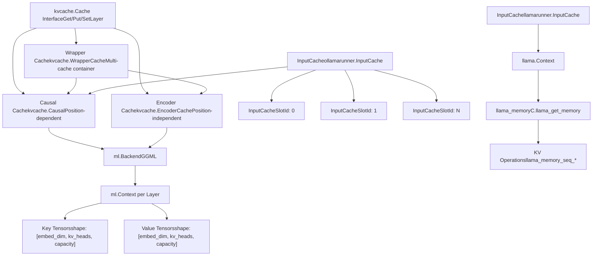
**Sources:** [kvcache/cache.go1-64](https://github.com/ollama/ollama/blob/562c76d7/kvcache/cache.go#L1-L64) [kvcache/causal.go1-644](https://github.com/ollama/ollama/blob/562c76d7/kvcache/causal.go#L1-L644) [kvcache/encoder.go1-141](https://github.com/ollama/ollama/blob/562c76d7/kvcache/encoder.go#L1-L141) [kvcache/wrapper.go1-105](https://github.com/ollama/ollama/blob/562c76d7/kvcache/wrapper.go#L1-L105) [runner/ollamarunner/cache.go1-343](https://github.com/ollama/ollama/blob/562c76d7/runner/ollamarunner/cache.go#L1-L343) [runner/llamarunner/cache.go1-252](https://github.com/ollama/ollama/blob/562c76d7/runner/llamarunner/cache.go#L1-L252)

## 缓存接口

`kvcache.Cache` 接口定义了所有缓存实现必须遵循的契约：

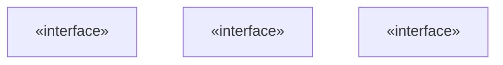
### 核心操作

| 方法 | 用途 |
| --- | --- |
| `SetLayer(layer int)` | 设置后续 Get/Put 操作的当前层 |
| `Get(ctx ml.Context)` | 返回当前层的缓存 key、value 张量与注意力 mask |
| `Put(ctx ml.Context, key, value ml.Tensor)` | 将 key 与 value 张量写入当前层缓存 |
| `StartForward(ctx ml.Context, batch input.Batch, reserve bool)` | 为前向过程准备缓存并分配位置 |

### 生命周期操作

| 方法 | 用途 |
| --- | --- |
| `Init(backend, dtype, maxSequences, capacity, maxBatch)` | 使用后端初始化缓存并分配存储 |
| `SetConfig(config ml.CacheConfig)` | 配置后端相关优化 |
| `Close()` | 释放所有已分配资源 |

### 高级操作

| 方法 | 用途 |
| --- | --- |
| `CopyPrefix(srcSeq, dstSeq, len)` | 将缓存前缀从源序列复制到目标序列 |
| `Remove(seq, beginIndex, endIndex)` | 删除缓存范围内的 token |
| `CanResume(seq, pos)` | 检查序列是否可从指定位置恢复 |
| `Checkpoint(seq, pos)` | 为循环模型创建检查点 |
| `PrepareRestore(seq, pos)` | 准备从检查点恢复 |

**Sources:** [kvcache/cache.go15-64](https://github.com/ollama/ollama/blob/562c76d7/kvcache/cache.go#L15-L64)

## Causal Cache 实现

`Causal` 缓存按序列中的位置存储 K/V 张量，并返回带因果掩码的历史，以便仅关注历史 token。

### 缓存单元结构

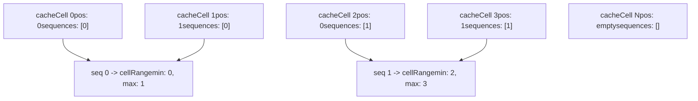
每个缓存单元包含：

-   `pos`：该 token 在其序列中的位置
-   `sequences`：引用该单元的序列 ID 列表（支持共享）

`cellRanges` 映射跟踪每个序列的存储区间 `[min, max]`，以实现高效查找和操作。

**Sources:** [kvcache/causal.go80-88](https://github.com/ollama/ollama/blob/562c76d7/kvcache/causal.go#L80-L88) [kvcache/causal.go68-78](https://github.com/ollama/ollama/blob/562c76d7/kvcache/causal.go#L68-L78)

### 存储布局

key 与 value 以按层方式存储，维度为：

```
Key:   [embed_dim, kv_heads, capacity]
Value: [embed_dim, kv_heads, capacity] (or permuted if PermutedV)
```
当启用 `PermutedV` 时，value 会以 `[capacity, embed_dim, kv_heads]` 存储，以优化注意力内核。

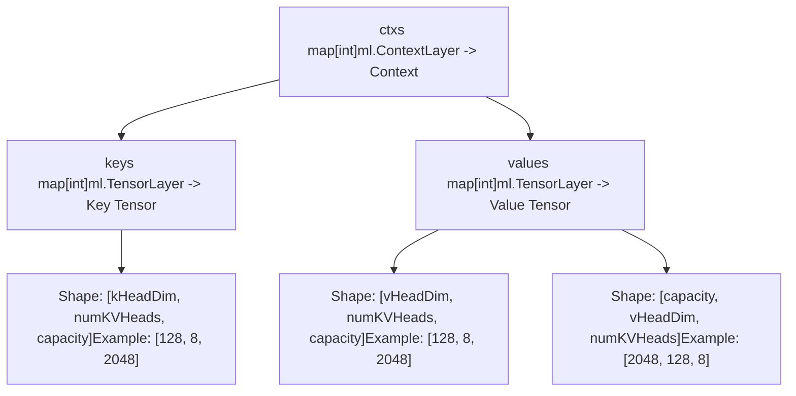
**Sources:** [kvcache/causal.go74-78](https://github.com/ollama/ollama/blob/562c76d7/kvcache/causal.go#L74-L78) [kvcache/causal.go458-473](https://github.com/ollama/ollama/blob/562c76d7/kvcache/causal.go#L458-L473) [kvcache/causal.go480-494](https://github.com/ollama/ollama/blob/562c76d7/kvcache/causal.go#L480-L494)

### 滑动窗口注意力（SWA）

SWA 将注意力窗口限制在最近 token 上，同时可选保留更多历史以支持缓存复用：

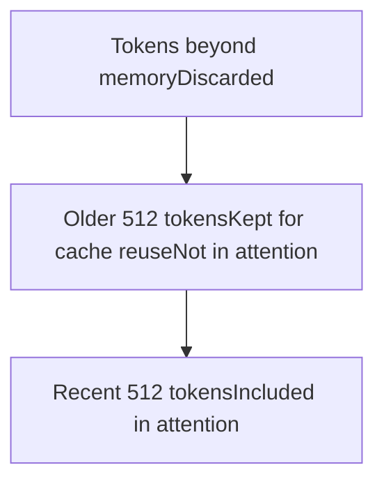
| 参数 | 描述 |
| --- | --- |
| `swaWindowSize` | 注意力 mask 中包含的 token 数 |
| `swaMemorySize` | 为复用而在缓存中保留的 token 总数 |

系统会在 `updateSlidingWindow()` 期间自动删除超过 `swaMemorySize` 的 token：

**Sources:** [kvcache/causal.go23-28](https://github.com/ollama/ollama/blob/562c76d7/kvcache/causal.go#L23-L28) [kvcache/causal.go99-118](https://github.com/ollama/ollama/blob/562c76d7/kvcache/causal.go#L99-L118) [kvcache/causal.go273-349](https://github.com/ollama/ollama/blob/562c76d7/kvcache/causal.go#L273-L349)

### 缓存操作流程

> **[Mermaid sequence]**
> *(图表结构无法解析)*

**Sources:** [kvcache/causal.go198-248](https://github.com/ollama/ollama/blob/562c76d7/kvcache/causal.go#L198-L248) [kvcache/causal.go449-495](https://github.com/ollama/ollama/blob/562c76d7/kvcache/causal.go#L449-L495) [kvcache/causal.go411-447](https://github.com/ollama/ollama/blob/562c76d7/kvcache/causal.go#L411-L447)

### 掩码生成

因果掩码确保每个 token 仅关注历史 token 以及自身序列：

```
Mask[i][j] = -Inf if:
  - Cell j's sequence != token i's sequence
  - Cell j's position > token i's position (causality)
  - Cell j's position < token i's position - swaWindowSize (SWA)
  - Chunked attention: Cell j's position < chunk start
Otherwise: 0
```
**Sources:** [kvcache/causal.go362-389](https://github.com/ollama/ollama/blob/562c76d7/kvcache/causal.go#L362-L389)

## Encoder Cache

`EncoderCache` 存储与位置无关的 K/V 张量，通常用于编码器-解码器模型中的编码器输出：

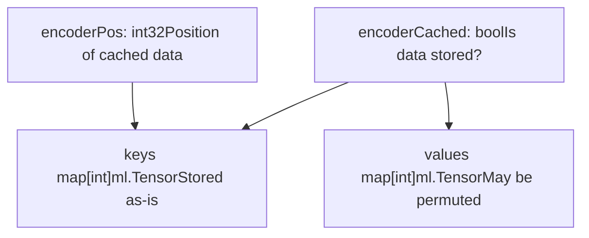
与 Causal 缓存的关键差异：

-   无序列跟踪或因果掩码
-   每层仅有单一缓存状态
-   张量按存储形式直接返回（无 View 操作）
-   `EncoderCached()` 方法指示数据是否存在

**Sources:** [kvcache/encoder.go1-141](https://github.com/ollama/ollama/blob/562c76d7/kvcache/encoder.go#L1-L141) [kvcache/encoder.go37-42](https://github.com/ollama/ollama/blob/562c76d7/kvcache/encoder.go#L37-L42) [kvcache/encoder.go106-112](https://github.com/ollama/ollama/blob/562c76d7/kvcache/encoder.go#L106-L112)

## 输入缓存管理

`InputCache` 在底层 KV 缓存之上提供更高层抽象，用于管理不同序列的缓存槽并处理提示复用。

### 缓存槽结构

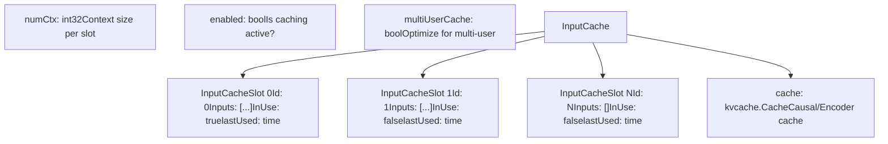
每个 `InputCacheSlot` 包含：

| 字段 | 类型 | 描述 |
| --- | --- | --- |
| `Id` | `int` | 在 KV 缓存中的索引 |
| `Inputs` | `[]*input.Input` | 已缓存的提示输入 |
| `InUse` | `bool` | 槽是否正在处理 |
| `lastUsed` | `time.Time` | 用于淘汰的最近访问时间 |

**Sources:** [runner/ollamarunner/cache.go16-32](https://github.com/ollama/ollama/blob/562c76d7/runner/ollamarunner/cache.go#L16-L32) [runner/ollamarunner/cache.go82-94](https://github.com/ollama/ollama/blob/562c76d7/runner/ollamarunner/cache.go#L82-L94)

### 提示复用策略

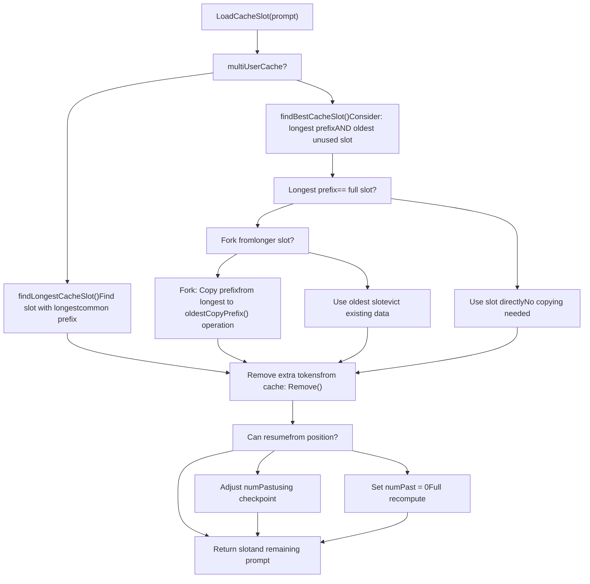
**关键函数：**

-   `findLongestCacheSlot()`：单用户优化——寻找最长公共前缀槽
-   `findBestCacheSlot()`：多用户优化——平衡前缀长度与槽年龄
-   `countCommonPrefix()`：比较 token 序列与多模态哈希是否相等

**Sources:** [runner/ollamarunner/cache.go96-158](https://github.com/ollama/ollama/blob/562c76d7/runner/ollamarunner/cache.go#L96-L158) [runner/ollamarunner/cache.go160-181](https://github.com/ollama/ollama/blob/562c76d7/runner/ollamarunner/cache.go#L160-L181) [runner/ollamarunner/cache.go183-227](https://github.com/ollama/ollama/blob/562c76d7/runner/ollamarunner/cache.go#L183-L227) [runner/ollamarunner/cache.go229-245](https://github.com/ollama/ollama/blob/562c76d7/runner/ollamarunner/cache.go#L229-L245)

### 缓存移位

当超过上下文窗口时，缓存会移位以丢弃旧 token 并保留近期 token：

> **[Mermaid sequence]**
> *(图表结构无法解析)*

`ShiftDiscard()` 函数确保整个批（由 `SameBatch` 标记）被整体删除：

**Sources:** [runner/ollamarunner/cache.go249-269](https://github.com/ollama/ollama/blob/562c76d7/runner/ollamarunner/cache.go#L249-L269) [runner/ollamarunner/cache.go271-343](https://github.com/ollama/ollama/blob/562c76d7/runner/ollamarunner/cache.go#L271-L343) [kvcache/causal.go549-613](https://github.com/ollama/ollama/blob/562c76d7/kvcache/causal.go#L549-L613)

## 缓存配置

`ml.CacheConfig` 结构体控制后端特定优化：

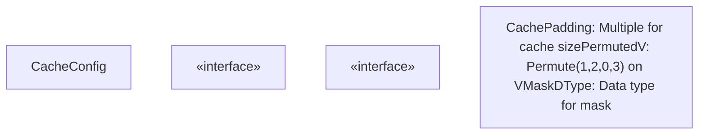
| 字段 | 类型 | 默认值 | 描述 |
| --- | --- | --- | --- |
| `CachePadding` | `int` | 256 | 缓存容量向该值的倍数取整 |
| `PermutedV` | `bool` | 变化 | 是否对 V 张量置换以优化内核 |
| `MaskDType` | `DType` | `DTypeF32` | 注意力 mask 的数据类型（flash attention 使用 F16） |

### 后端特定设置

```
// GGML backend with Flash Attentionfunc (b *Backend) CacheConfig() ml.CacheConfig {    if b.flashAttention == ml.FlashAttentionEnabled {        return ml.CacheConfig{            CachePadding: 256,            MaskDType: ml.DTypeF16,        }    } else {        return ml.CacheConfig{            CachePadding: 256,            PermutedV: true,        }    }}
```
**Sources:** [ml/backend.go41-57](https://github.com/ollama/ollama/blob/562c76d7/ml/backend.go#L41-L57) [ml/backend/ggml/ggml.go686-692](https://github.com/ollama/ollama/blob/562c76d7/ml/backend/ggml/ggml.go#L686-L692) [kvcache/causal.go130-145](https://github.com/ollama/ollama/blob/562c76d7/kvcache/causal.go#L130-L145)

## 与后端的集成

### 与 GGML 后端集成

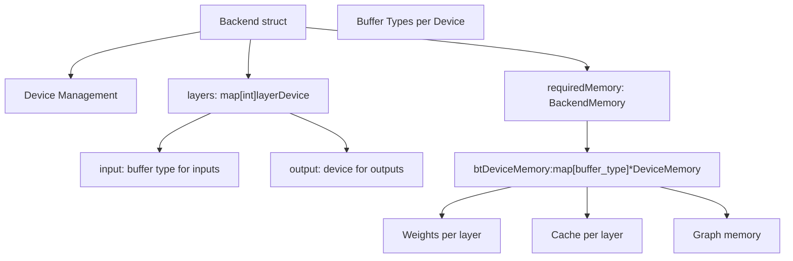
后端通过 `ml.Context.Layer(i)` 分配缓存内存，该方法会返回与层 `i` 对应设备关联的上下文：

```
// Create context for layer-specific cache allocationctx := backend.NewContextSize(2).Layer(layerIndex)keys[layer] = ctx.Zeros(dtype, kHeadDim, numKVHeads, capacity)
```
内存会按层在 `btDeviceMemory` 中进行跟踪：

**Sources:** [ml/backend/ggml/ggml.go76-119](https://github.com/ollama/ollama/blob/562c76d7/ml/backend/ggml/ggml.go#L76-L119) [kvcache/causal.go458-473](https://github.com/ollama/ollama/blob/562c76d7/kvcache/causal.go#L458-L473) [ml/backend/ggml/ggml.go909-924](https://github.com/ollama/ollama/blob/562c76d7/ml/backend/ggml/ggml.go#L909-L924)

### 与 llama.cpp 集成

`llamarunner` 通过 C 绑定与 llama.cpp 原生 KV 缓存集成：

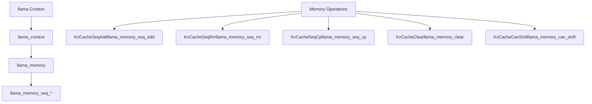
| Go 方法 | C 函数 | 用途 |
| --- | --- | --- |
| `KvCacheSeqAdd` | `llama_memory_seq_add` | 按 delta 平移位置 |
| `KvCacheSeqRm` | `llama_memory_seq_rm` | 删除 token 区间 |
| `KvCacheSeqCp` | `llama_memory_seq_cp` | 复制序列前缀 |
| `KvCacheClear` | `llama_memory_clear` | 清空整个缓存 |
| `KvCacheCanShift` | `llama_memory_can_shift` | 检查是否支持移位 |

**Sources:** [llama/llama.go190-208](https://github.com/ollama/ollama/blob/562c76d7/llama/llama.go#L190-L208) [runner/llamarunner/cache.go142-195](https://github.com/ollama/ollama/blob/562c76d7/runner/llamarunner/cache.go#L142-L195)

## 多序列支持

缓存支持共享存储下的多序列并行处理：

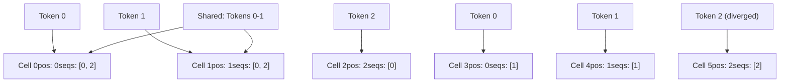
### 写时复制语义

`CopyPrefix()` 操作支持无数据重复的高效分叉：

1.  共享单元可同时引用多个序列
2.  当序列分叉时，仅存储新增 token
3.  公共前缀保持共享，直到被覆盖

**Sources:** [kvcache/causal.go497-518](https://github.com/ollama/ollama/blob/562c76d7/kvcache/causal.go#L497-L518)

### 缓存容量计算

```
Total Capacity = maxSequences * (capacity or swaMemorySize) + maxBatch
Rounded to CachePadding multiple
```
对于滑动窗口注意力：

-   `swaMemorySize > swaWindowSize`：允许在注意力窗口之外复用缓存
-   当 `maxSequences > 1` 时额外 `+1` 以容纳 stop token

**Sources:** [kvcache/causal.go169-176](https://github.com/ollama/ollama/blob/562c76d7/kvcache/causal.go#L169-L176)

## 性能考量

### 缓存填充

填充到 256 可改善 GPU 上的内存访问模式：

```
Actual cache size = roundUp(requested_size, 256)
Cache range returned: roundDown(min, 256) to roundUp(max+1, 256) - 1
```
**Sources:** [kvcache/causal.go351-357](https://github.com/ollama/ollama/blob/562c76d7/kvcache/causal.go#L351-L357) [kvcache/causal.go362-365](https://github.com/ollama/ollama/blob/562c76d7/kvcache/causal.go#L362-L365)

### 多用户与单用户

| 策略 | 用例 | 槽位选择 |
| --- | --- | --- |
| Single-user | 顺序请求 | 最长公共前缀 |
| Multi-user | 并发用户 | 在“最长前缀”和“最老槽位”之间折中 |

单用户策略最大化缓存命中并最小化占用。多用户策略可防止单个序列独占缓存槽。

**Sources:** [runner/ollamarunner/cache.go96-158](https://github.com/ollama/ollama/blob/562c76d7/runner/ollamarunner/cache.go#L96-L158)

### 内存布局优化

**PermutedV**：将 value 以 `[capacity, embed_dim, kv_heads]` 存储，而非 `[embed_dim, kv_heads, capacity]`。这使批量注意力操作无需 `Contiguous()` 调用即可高效执行。

**Flash Attention**：使用 `DTypeF16` mask 与量化 KV 缓存（`q8_0` 或 `q4_0`）以降低内存带宽占用。

**Sources:** [kvcache/causal.go426-444](https://github.com/ollama/ollama/blob/562c76d7/kvcache/causal.go#L426-L444) [kvcache/causal.go480-494](https://github.com/ollama/ollama/blob/562c76d7/kvcache/causal.go#L480-L494) [llama/llama.go139-141](https://github.com/ollama/ollama/blob/562c76d7/llama/llama.go#L139-L141)
