# 内存管理与 GPU 分配

相关源文件

-   [envconfig/config.go](https://github.com/ollama/ollama/blob/562c76d7/envconfig/config.go)
-   [envconfig/config\_test.go](https://github.com/ollama/ollama/blob/562c76d7/envconfig/config_test.go)
-   [integration/embed\_test.go](https://github.com/ollama/ollama/blob/562c76d7/integration/embed_test.go)
-   [kvcache/cache.go](https://github.com/ollama/ollama/blob/562c76d7/kvcache/cache.go)
-   [kvcache/causal.go](https://github.com/ollama/ollama/blob/562c76d7/kvcache/causal.go)
-   [kvcache/causal\_test.go](https://github.com/ollama/ollama/blob/562c76d7/kvcache/causal_test.go)
-   [kvcache/encoder.go](https://github.com/ollama/ollama/blob/562c76d7/kvcache/encoder.go)
-   [kvcache/wrapper.go](https://github.com/ollama/ollama/blob/562c76d7/kvcache/wrapper.go)
-   [llm/server.go](https://github.com/ollama/ollama/blob/562c76d7/llm/server.go)
-   [ml/backend.go](https://github.com/ollama/ollama/blob/562c76d7/ml/backend.go)
-   [ml/backend/ggml/ggml.go](https://github.com/ollama/ollama/blob/562c76d7/ml/backend/ggml/ggml.go)
-   [model/input/input.go](https://github.com/ollama/ollama/blob/562c76d7/model/input/input.go)
-   [model/model.go](https://github.com/ollama/ollama/blob/562c76d7/model/model.go)
-   [model/model\_test.go](https://github.com/ollama/ollama/blob/562c76d7/model/model_test.go)
-   [runner/llamarunner/cache.go](https://github.com/ollama/ollama/blob/562c76d7/runner/llamarunner/cache.go)
-   [runner/llamarunner/runner.go](https://github.com/ollama/ollama/blob/562c76d7/runner/llamarunner/runner.go)
-   [runner/ollamarunner/cache.go](https://github.com/ollama/ollama/blob/562c76d7/runner/ollamarunner/cache.go)
-   [runner/ollamarunner/cache\_test.go](https://github.com/ollama/ollama/blob/562c76d7/runner/ollamarunner/cache_test.go)
-   [runner/ollamarunner/runner.go](https://github.com/ollama/ollama/blob/562c76d7/runner/ollamarunner/runner.go)
-   [server/internal/internal/backoff/backoff.go](https://github.com/ollama/ollama/blob/562c76d7/server/internal/internal/backoff/backoff.go)
-   [server/sched.go](https://github.com/ollama/ollama/blob/562c76d7/server/sched.go)
-   [server/sched\_test.go](https://github.com/ollama/ollama/blob/562c76d7/server/sched_test.go)

本页描述 Ollama 如何在 CPU 和 GPU 设备间管理模型的内存分配。内容涵盖内存跟踪结构、GPU 层分配算法、内存估算，以及调度器与后端内存系统之间的交互。

有关 KV 缓存系统的专门信息，请参见 [KV 缓存系统](/ollama/ollama/5.3-kv-cache-system)。有关模型加载与 runner 生命周期的细节，请参见 [LlamaServer 与 Runner 实现](/ollama/ollama/5.2-llamaserver-and-runner-implementation)。

## 概览

Ollama 采用了一套复杂的内存管理系统，能够：

-   按层跟踪内存需求（权重和缓存）
-   基于可用内存将模型层分配到 CPU 或 GPU 设备
-   估算计算图内存需求
-   通过调度器管理多个已加载模型
-   通过后端特定缓冲区类型处理内存分配

系统按阶段运行：估算（fit）、分配（alloc）和提交（commit），从而支持模型增量加载并避免内存不足错误。

## 内存跟踪结构

### BackendMemory 结构

`ml.BackendMemory` 结构会跨所有设备跟踪累计内存分配：

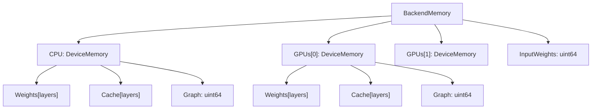
**按层内存跟踪**

每个 `DeviceMemory` 包含：

-   `Weights[]` - 每层模型权重内存
-   `Cache[]` - 每层 KV 缓存内存
-   `Graph` - 计算图临时空间
-   `DeviceID` - 设备唯一标识符
-   `Name`, `ID`, `Library` - 设备元数据

Sources: [ml/backend.go1-415](https://github.com/ollama/ollama/blob/562c76d7/ml/backend.go#L1-L415) [llm/server.go502-513](https://github.com/ollama/ollama/blob/562c76d7/llm/server.go#L502-L513)

### 层级粒度

内存以层级粒度跟踪，以支持部分卸载：

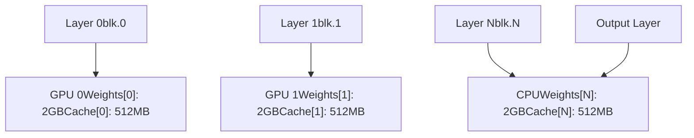
Sources: [llm/server.go540-558](https://github.com/ollama/ollama/blob/562c76d7/llm/server.go#L540-L558) [ml/backend/ggml/ggml.go157-198](https://github.com/ollama/ollama/blob/562c76d7/ml/backend/ggml/ggml.go#L157-L198)

## GPU 层分配

### 分配流水线

层分配流程遵循如下路径：

> **[Mermaid sequence]**
> *(图表结构无法解析)*

Sources: [llm/server.go496-714](https://github.com/ollama/ollama/blob/562c76d7/llm/server.go#L496-L714) [llm/server.go746-899](https://github.com/ollama/ollama/blob/562c76d7/llm/server.go#L746-L899)

### buildLayout 函数

`buildLayout` 函数通过以下步骤创建内存布局：

1.  按空闲内存对 GPU 排序（降序）
2.  计算总层大小（权重 + 缓存）
3.  按库分组 GPU（Metal、CUDA、ROCm 等）
4.  对每个库分组调用 `assignLayers`
5.  选择卸载层数最多的布局

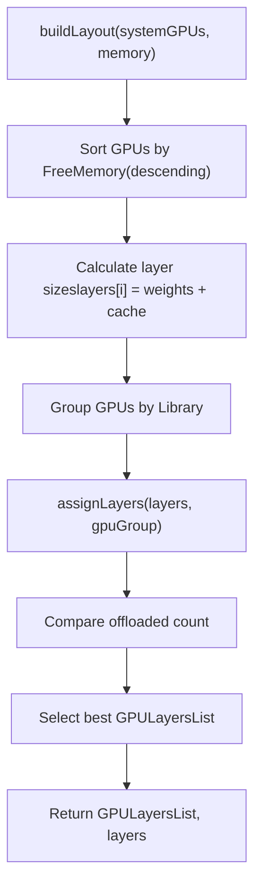
关键逻辑见 [llm/server.go939-998](https://github.com/ollama/ollama/blob/562c76d7/llm/server.go#L939-L998)：

-   在预留可用内存时会考虑 backoff、最小内存、额外开销和图大小
-   每块 GPU 的处理为：`FreeMemory -= (FreeMemory * backoff) + MinimumMemory() + GpuOverhead() + Graph`

Sources: [llm/server.go924-998](https://github.com/ollama/ollama/blob/562c76d7/llm/server.go#L924-L998) [envconfig/config.go272](https://github.com/ollama/ollama/blob/562c76d7/envconfig/config.go#L272-L272)

### assignLayers 算法

`assignLayers` 函数会把层打包到最少数量的 GPU 上：

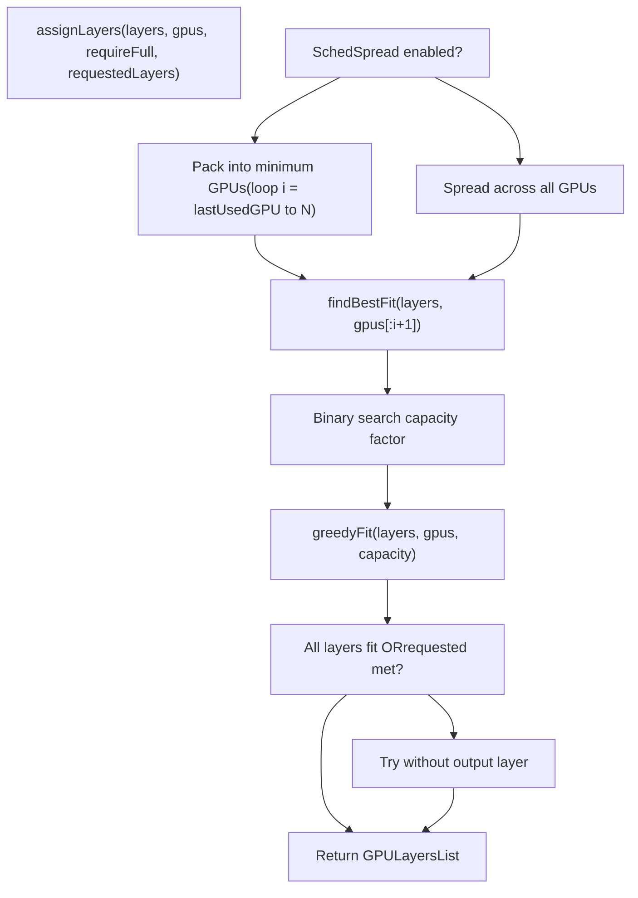
该算法有两种模式：

-   **打包模式**（默认）：逐步增加 GPU 数量直到层可装入
-   **扩散模式**（`OLLAMA_SCHED_SPREAD=1`）：使用全部可用 GPU

Sources: [llm/server.go1063-1100](https://github.com/ollama/ollama/blob/562c76d7/llm/server.go#L1063-L1100) [envconfig/config.go201](https://github.com/ollama/ollama/blob/562c76d7/envconfig/config.go#L201-L201)

### 二分搜索优化

`findBestFit` 函数使用二分搜索来寻找最优容量系数：

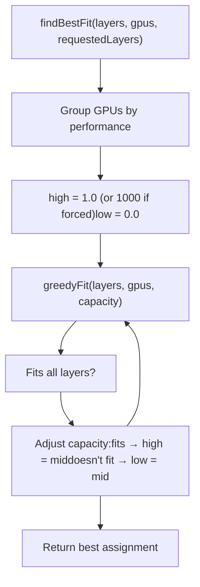
容量系数会乘到每块 GPU 的空闲内存上，使算法能找到满足需求的最紧凑适配。

Sources: [llm/server.go1102-1136](https://github.com/ollama/ollama/blob/562c76d7/llm/server.go#L1102-L1136)

### greedyFit 实现

`greedyFit` 函数以增量方式将层分配到 GPU：

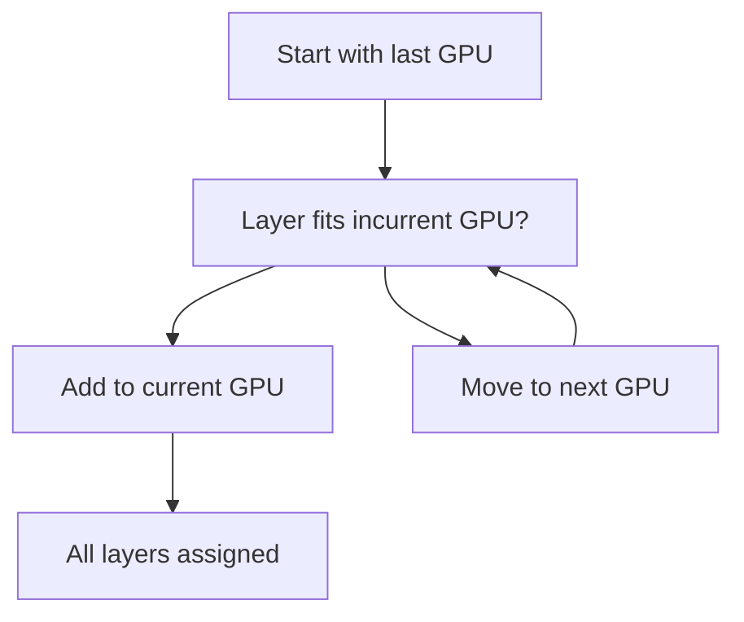
**算法**： [llm/server.go1138-1162](https://github.com/ollama/ollama/blob/562c76d7/llm/server.go#L1138-L1162)

-   按从后到前（逆序）迭代层
-   每块 GPU 的调整后空闲空间为：`freeSpace = FreeMemory * capacity`
-   层优先分配给索引最高的 GPU，必要时向更低索引 GPU 溢出
-   若指定 `requestedLayers`，则遵守该限制

Sources: [llm/server.go1138-1162](https://github.com/ollama/ollama/blob/562c76d7/llm/server.go#L1138-L1162)

## 内存估算与需求

### 图大小计算

计算图内存基于上下文大小、批大小和架构进行估算：

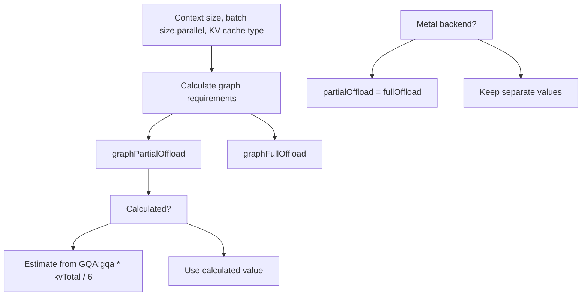
Sources: [llm/server.go522-611](https://github.com/ollama/ollama/blob/562c76d7/llm/server.go#L522-L611)

随着布局中包含的 GPU 逐步增多，图大小会在 [llm/server.go616-637](https://github.com/ollama/ollama/blob/562c76d7/llm/server.go#L616-L637) 处迭代累加

### 缓冲区与额外开销

多项缓冲区分配会减少可用内存：

| 组件 | 计算方式 | 用途 |
| --- | --- | --- |
| 层缓冲区 | `blk.0 size + kv[0]` | 每块 GPU 的安全裕量 |
| 投影器权重 | `projectorMemoryRequirements()` | 视觉模型投影器放在第一块独立 GPU 上 |
| GPU 额外开销 | `envconfig.GpuOverhead()` | 每块 GPU 预留 VRAM（用户可配置） |
| 最小内存 | `gpu.MinimumMemory()` | 驱动最小分配需求 |
| 回退系数 | `float32(gpu.FreeMemory) * backoff` | 动态调节因子（0.0-1.0+） |

Sources: [llm/server.go525-538](https://github.com/ollama/ollama/blob/562c76d7/llm/server.go#L525-L538) [llm/server.go562-589](https://github.com/ollama/ollama/blob/562c76d7/llm/server.go#L562-L589) [llm/server.go716-733](https://github.com/ollama/ollama/blob/562c76d7/llm/server.go#L716-L733) [llm/server.go969-980](https://github.com/ollama/ollama/blob/562c76d7/llm/server.go#L969-L980)

### 内存布局校验

`verifyLayout` 函数确保布局满足系统约束：

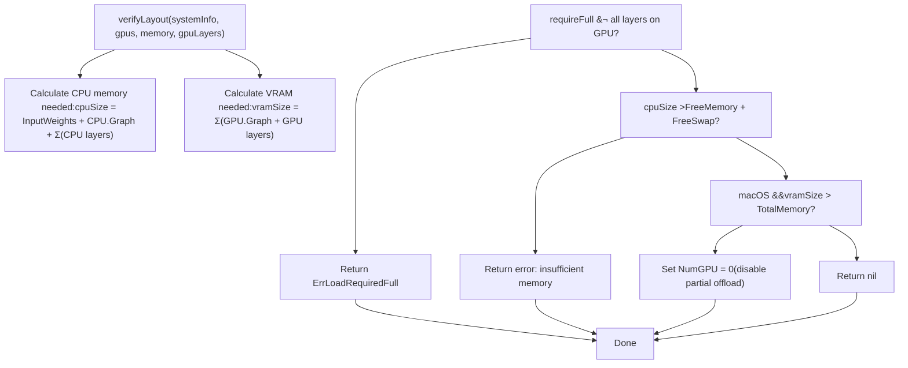
特殊处理：

-   **Linux/Windows**：严格校验可用 RAM + swap
-   **macOS**：动态 swap 允许超额使用，但当 VRAM > 系统总内存时会禁用部分卸载

Sources: [llm/server.go1001-1061](https://github.com/ollama/ollama/blob/562c76d7/llm/server.go#L1001-L1061) [llm/server.go1041-1054](https://github.com/ollama/ollama/blob/562c76d7/llm/server.go#L1041-L1054)

## 加载操作

### 操作类型

Ollama 使用三阶段加载方式：

| 操作 | 值 | 描述 | 内存分配 |
| --- | --- | --- | --- |
| `LoadOperationFit` | 0 | 计算内存需求 | 不分配 |
| `LoadOperationAlloc` | 1 | 分配内存但不加载权重 | 仅分配 |
| `LoadOperationCommit` | 2 | 将权重加载到已分配内存 | 最终加载 |
| `LoadOperationClose` | 3 | 释放所有内存 | 释放分配 |

Sources: [llm/server.go444-468](https://github.com/ollama/ollama/blob/562c76d7/llm/server.go#L444-L468) [runner/ollamarunner/runner.go1-43](https://github.com/ollama/ollama/blob/562c76d7/runner/ollamarunner/runner.go#L1-L43)

### LoadRequest 结构

`LoadRequest` 包含加载参数：

```
type LoadRequest struct {    Operation      LoadOperation    LoraPath       []string    Parallel       int    BatchSize      int    FlashAttention ml.FlashAttentionType    KvSize         int    KvCacheType    string    NumThreads     int    GPULayers      ml.GPULayersList    // Assigned by createLayout    MultiUserCache bool        // Legacy fields (llama runner only)    ProjectorPath  string    MainGPU        int    UseMmap        bool}
```
Sources: [llm/server.go470-487](https://github.com/ollama/ollama/blob/562c76d7/llm/server.go#L470-L487)

### 迭代加载（Ollama 引擎）

新 Ollama 引擎（`ollamaServer`）通过迭代加载寻找最优布局：

> **[Mermaid sequence]**
> *(图表结构无法解析)*

**关键特性**：

-   跟踪 `pastAllocations` 映射以检测循环
-   若分配持续失败则应用 `backoff` 系数
-   探索中间层数量以找到最优适配

Sources: [llm/server.go746-899](https://github.com/ollama/ollama/blob/562c76d7/llm/server.go#L746-L899)

### 传统加载（Llama 引擎）

`llamaServer` 先进行前置内存估算：

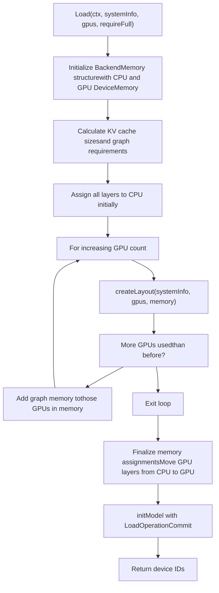
Sources: [llm/server.go496-714](https://github.com/ollama/ollama/blob/562c76d7/llm/server.go#L496-L714)

## 调度器内存管理

### 空闲空间跟踪

调度器通过查询已加载 runner 来保持 VRAM 跟踪准确：

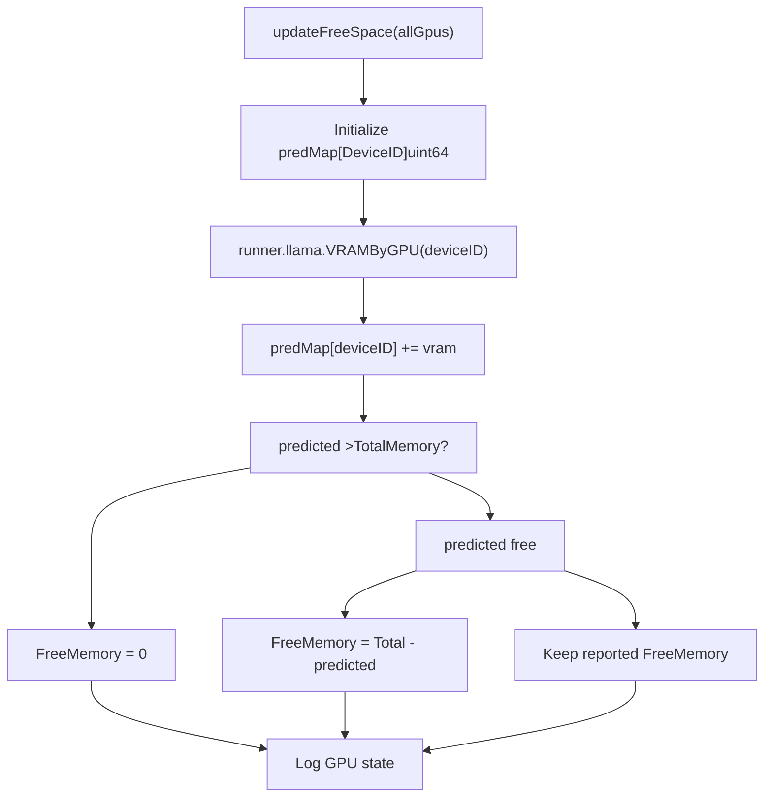
**关键洞察**：当调度器预测的空闲内存低于 GPU 上报值时，调度器会优先信任自身预测，以避免 GPU 内存上报引发的竞态问题。

Sources: [server/sched.go647-695](https://github.com/ollama/ollama/blob/562c76d7/server/sched.go#L647-L695)

### 模型加载决策

当新的模型请求到达时：

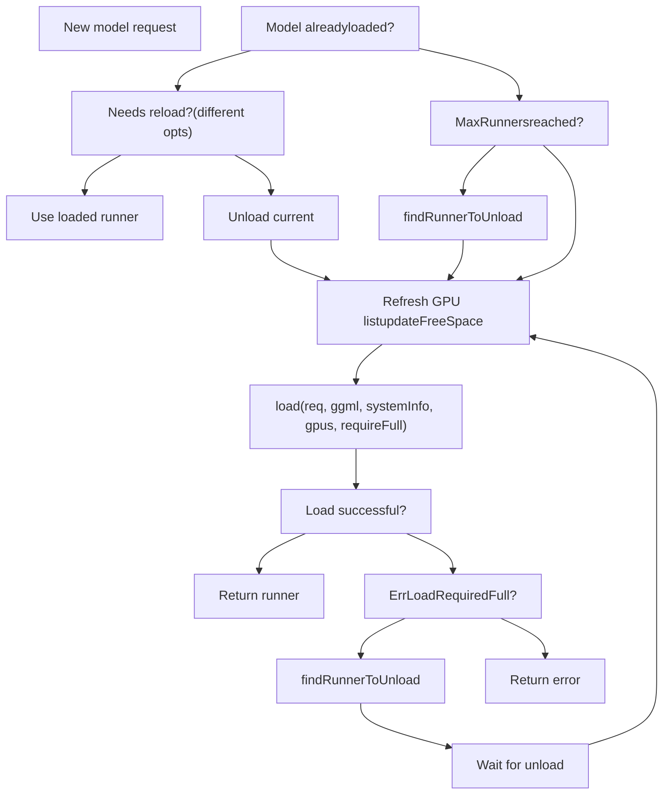
当存在其他已加载模型时，`requireFull` 参数为 `true`，要求新模型在不驱逐现有模型的前提下完整装入。

Sources: [server/sched.go155-306](https://github.com/ollama/ollama/blob/562c76d7/server/sched.go#L155-L306)

### 用于驱逐的 Runner 选择

`findRunnerToUnload` 函数会选择一个 runner 进行驱逐：

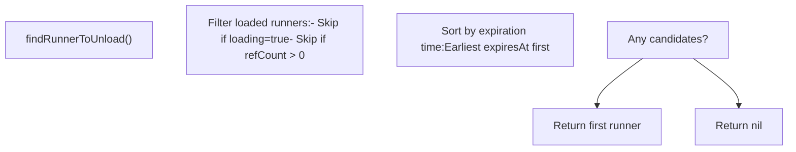
Sources: [server/sched.go697-731](https://github.com/ollama/ollama/blob/562c76d7/server/sched.go#L697-L731)

## 后端内存分配

### GGML 后端初始化

GGML 后端会为每个设备创建缓冲区类型：

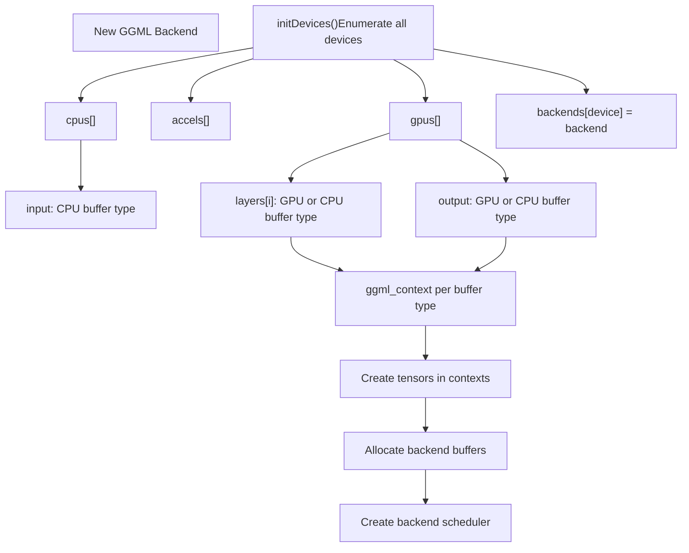
Sources: [ml/backend/ggml/ggml.go47-69](https://github.com/ollama/ollama/blob/562c76d7/ml/backend/ggml/ggml.go#L47-L69) [ml/backend/ggml/ggml.go123-449](https://github.com/ollama/ollama/blob/562c76d7/ml/backend/ggml/ggml.go#L123-L449)

### 张量分配

张量按缓冲区类型并按对齐要求进行分配：

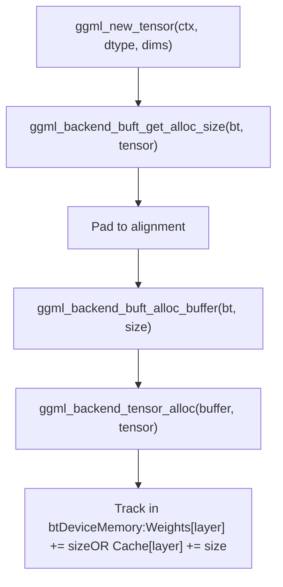
**缓冲区使用跟踪**： [ml/backend/ggml/ggml.go276-286](https://github.com/ollama/ollama/blob/562c76d7/ml/backend/ggml/ggml.go#L276-L286)

-   输入层张量计入 `InputWeights`
-   模型层计入 `Weights[layer]`
-   KV 缓存（由 Context.newTensor 分配）计入 `Cache[layer]`

Sources: [ml/backend/ggml/ggml.go244-293](https://github.com/ollama/ollama/blob/562c76d7/ml/backend/ggml/ggml.go#L244-L293) [ml/backend/ggml/ggml.go889-924](https://github.com/ollama/ollama/blob/562c76d7/ml/backend/ggml/ggml.go#L889-L924)

### 调度器与计算图执行

后端调度器负责管理计算图执行：

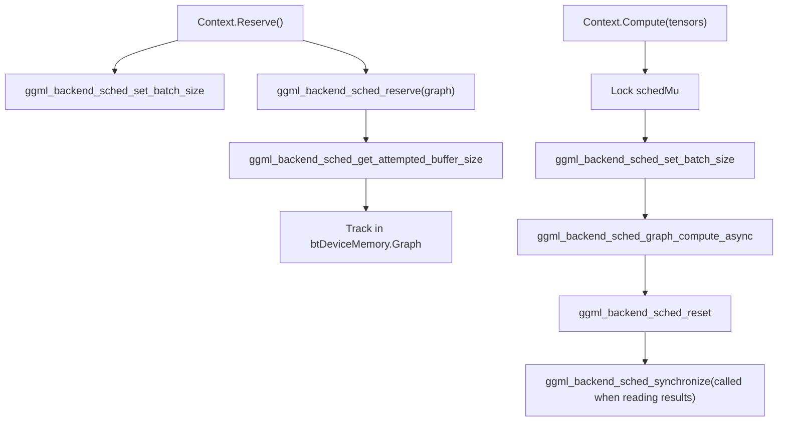
**图内存跟踪**：`Reserve` 调用会在 [ml/backend/ggml/ggml.go845-869](https://github.com/ollama/ollama/blob/562c76d7/ml/backend/ggml/ggml.go#L845-L869) 处使用每个后端的尝试缓冲区大小更新 `DeviceMemory.Graph`

Sources: [ml/backend/ggml/ggml.go810-843](https://github.com/ollama/ollama/blob/562c76d7/ml/backend/ggml/ggml.go#L810-L843) [ml/backend/ggml/ggml.go845-869](https://github.com/ollama/ollama/blob/562c76d7/ml/backend/ggml/ggml.go#L845-L869)

## KV 缓存内存

### 缓存初始化

KV 缓存内存与模型权重分开分配：

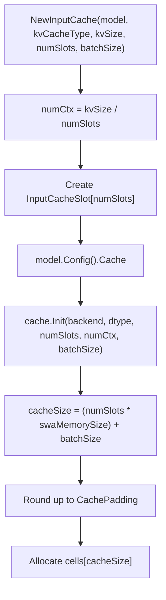
Sources: [runner/ollamarunner/cache.go34-59](https://github.com/ollama/ollama/blob/562c76d7/runner/ollamarunner/cache.go#L34-L59) [kvcache/causal.go130-182](https://github.com/ollama/ollama/blob/562c76d7/kvcache/causal.go#L130-L182)

### 每层缓存内存分配

在缓存操作期间调用 `Context.newTensor` 时：

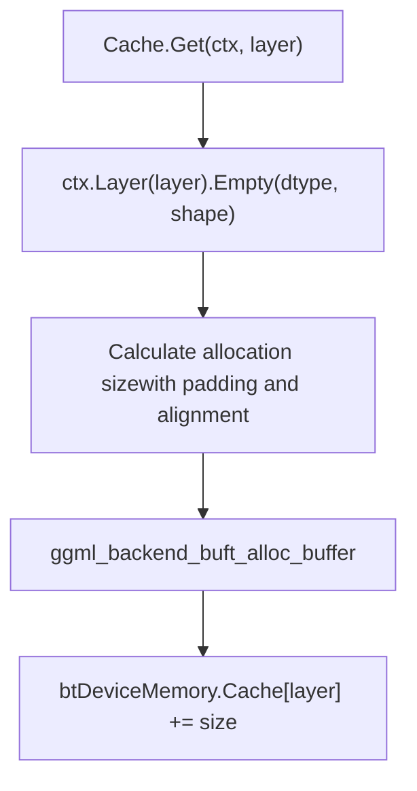
**缓存张量按需分配**：每层在首次访问时分配，使用 `Context.Layer(i)` 上下文来设置合适的缓冲区类型并跟踪分配。

Sources: [ml/backend/ggml/ggml.go889-924](https://github.com/ollama/ollama/blob/562c76d7/ml/backend/ggml/ggml.go#L889-L924) [kvcache/causal.go198-248](https://github.com/ollama/ollama/blob/562c76d7/kvcache/causal.go#L198-L248)

### 内存布局优化

缓存配置可优化内存布局：

| 配置 | 影响 | 用例 |
| --- | --- | --- |
| `CachePadding` | 将历史大小向倍数取整 | 内核批大小对齐 |
| `PermutedV` | 预先置换 V 张量存储 | 避免注意力中的 Contiguous() 调用 |
| `MaskDType` | 注意力 mask 的数据类型 | flash attention 用 F16，否则 F32 |

Sources: [ml/backend.go38-73](https://github.com/ollama/ollama/blob/562c76d7/ml/backend.go#L38-L73) [ml/backend/ggml/ggml.go686-692](https://github.com/ollama/ollama/blob/562c76d7/ml/backend/ggml/ggml.go#L686-L692)

## 配置与环境变量

### 与内存相关的环境变量

| 变量 | 类型 | 默认值 | 描述 |
| --- | --- | --- | --- |
| `OLLAMA_GPU_OVERHEAD` | uint64 | 0 | 每块 GPU 预留 VRAM（字节） |
| `OLLAMA_SCHED_SPREAD` | bool | false | 将层分布到所有 GPU |
| `OLLAMA_MAX_LOADED_MODELS` | uint | 0 (auto) | 最大并发已加载模型数 |
| `OLLAMA_FLASH_ATTENTION` | bool | auto | 启用 flash attention（影响 KV 缓存） |
| `OLLAMA_KV_CACHE_TYPE` | string | f16 | KV 缓存量化类型（f16、q8\_0、q4\_0） |
| `OLLAMA_MULTIUSER_CACHE` | bool | false | 为多用户优化缓存淘汰 |

Sources: [envconfig/config.go191-214](https://github.com/ollama/ollama/blob/562c76d7/envconfig/config.go#L191-L214) [envconfig/config.go248-273](https://github.com/ollama/ollama/blob/562c76d7/envconfig/config.go#L248-L273)

### Flash Attention 与 KV 缓存量化

Flash attention 同时影响性能与内存：

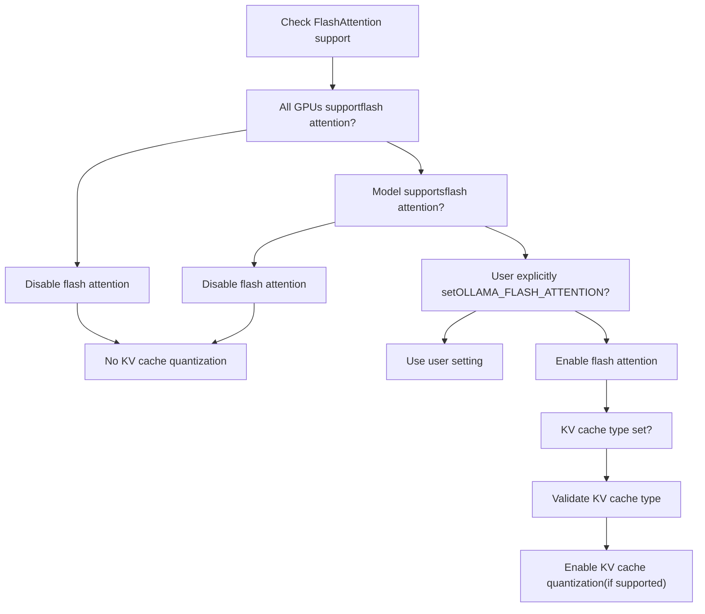
**量化 KV 缓存依赖 flash attention**：`q8_0` 和 `q4_0` KV 缓存类型仅在启用 flash attention 时可用。

Sources: [llm/server.go192-259](https://github.com/ollama/ollama/blob/562c76d7/llm/server.go#L192-L259)

---

**总结**：Ollama 的内存管理系统以层级粒度跟踪分配，使用复杂打包算法将层分配到设备，并通过迭代方式加载模型以寻找最优布局。调度器在多个已加载模型之间保持准确 VRAM 跟踪，后端则通过设备特定缓冲区类型完成实际内存分配。KV 缓存内存单独分配，并支持量化与布局优化。
