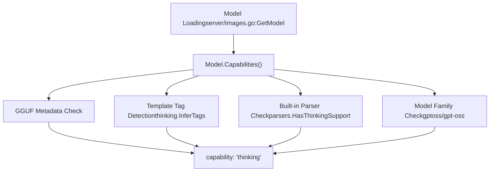
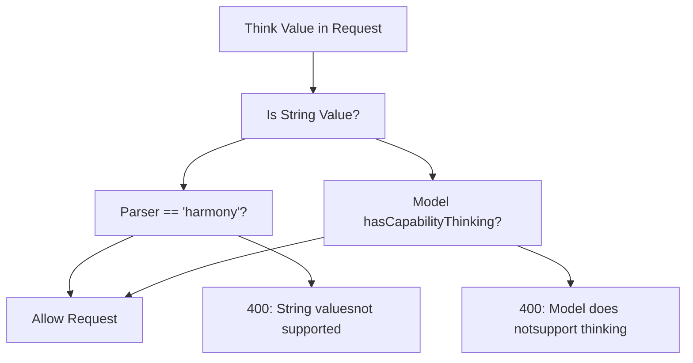
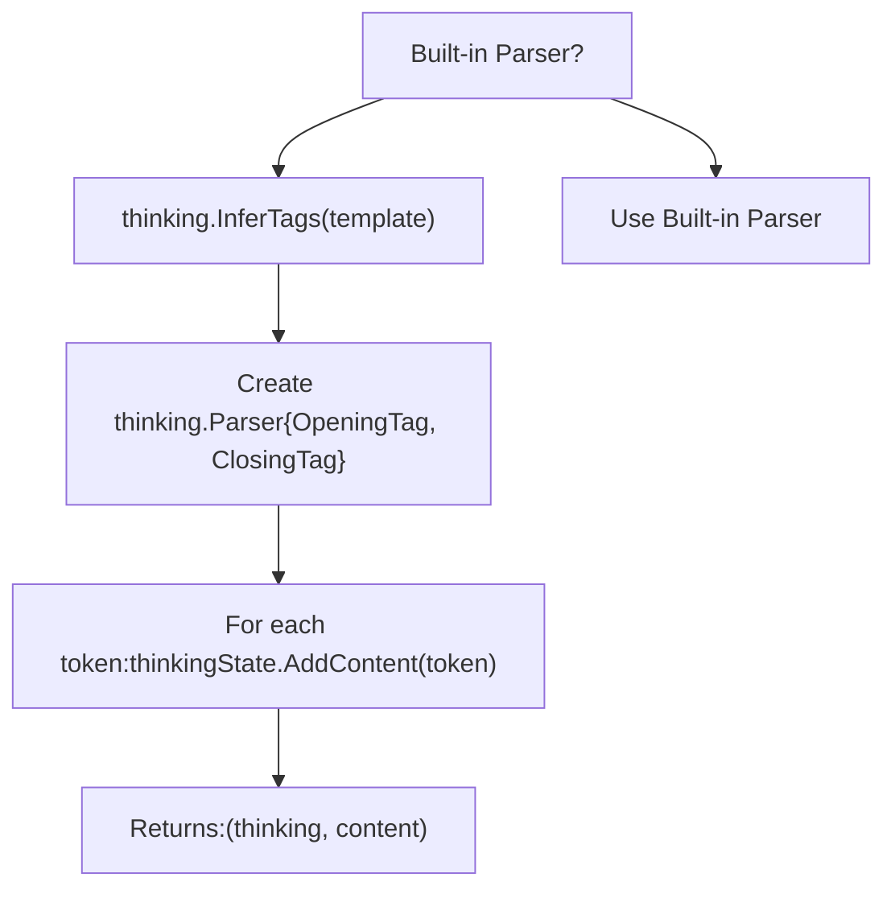
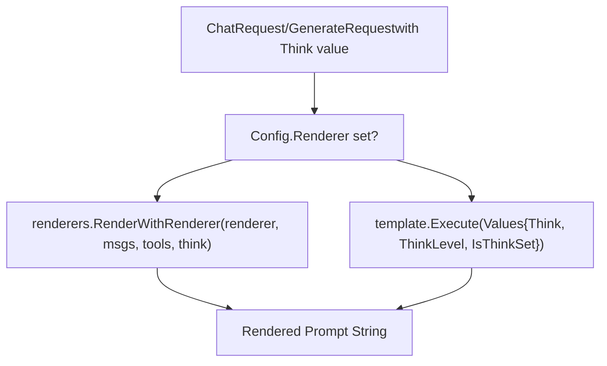
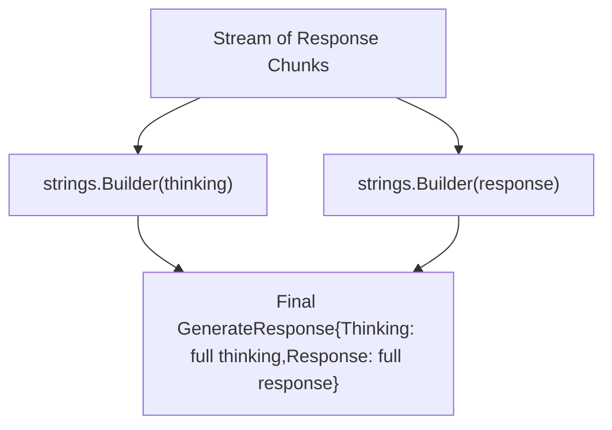
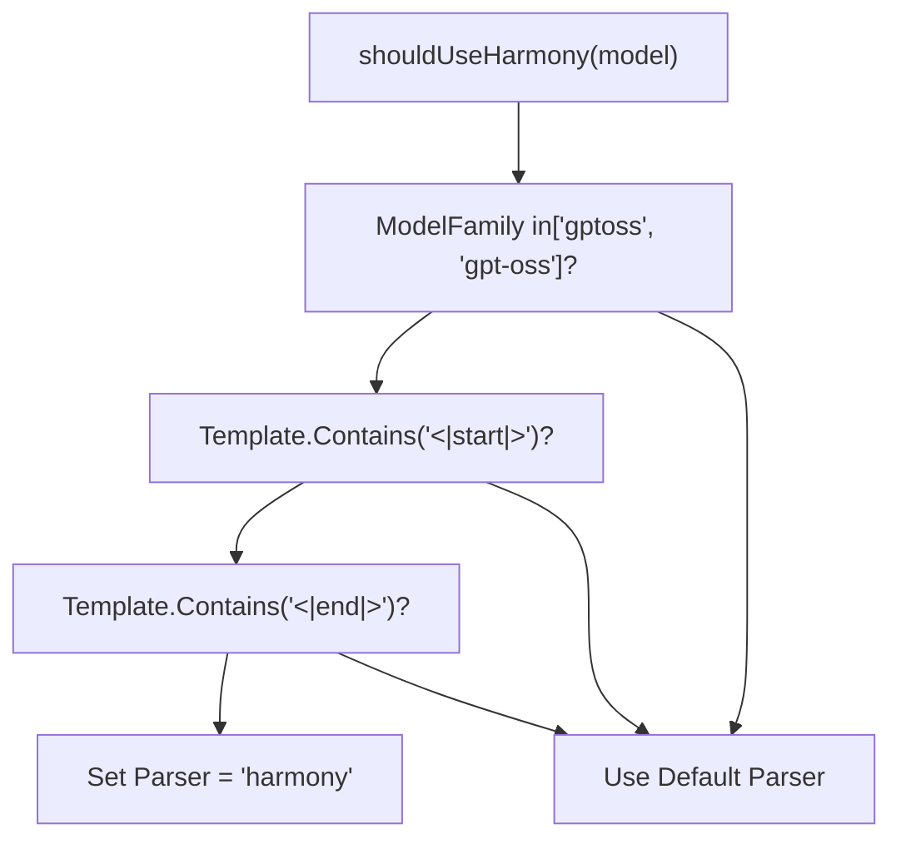
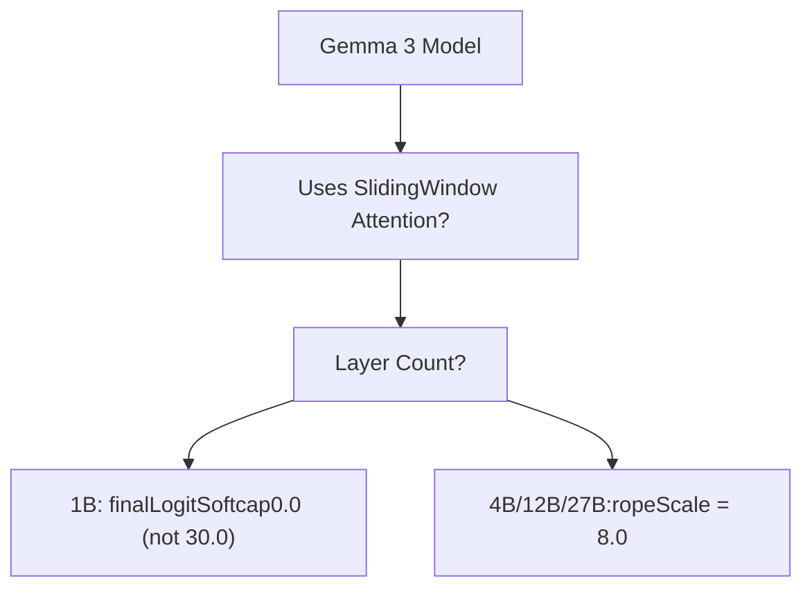
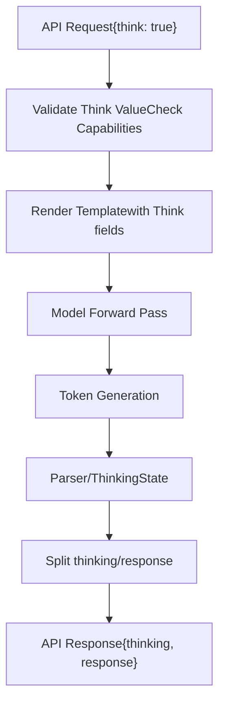

# 思考模型与推理

相关源文件

-   [api/client.go](https://github.com/ollama/ollama/blob/562c76d7/api/client.go)
-   [api/client\_test.go](https://github.com/ollama/ollama/blob/562c76d7/api/client_test.go)
-   [api/types.go](https://github.com/ollama/ollama/blob/562c76d7/api/types.go)
-   [api/types\_test.go](https://github.com/ollama/ollama/blob/562c76d7/api/types_test.go)
-   [api/types\_typescript\_test.go](https://github.com/ollama/ollama/blob/562c76d7/api/types_typescript_test.go)
-   [cmd/cmd.go](https://github.com/ollama/ollama/blob/562c76d7/cmd/cmd.go)
-   [middleware/openai.go](https://github.com/ollama/ollama/blob/562c76d7/middleware/openai.go)
-   [middleware/openai\_test.go](https://github.com/ollama/ollama/blob/562c76d7/middleware/openai_test.go)
-   [openai/openai.go](https://github.com/ollama/ollama/blob/562c76d7/openai/openai.go)
-   [openai/openai\_test.go](https://github.com/ollama/ollama/blob/562c76d7/openai/openai_test.go)
-   [openai/responses.go](https://github.com/ollama/ollama/blob/562c76d7/openai/responses.go)
-   [openai/responses\_test.go](https://github.com/ollama/ollama/blob/562c76d7/openai/responses_test.go)
-   [server/images.go](https://github.com/ollama/ollama/blob/562c76d7/server/images.go)
-   [server/routes.go](https://github.com/ollama/ollama/blob/562c76d7/server/routes.go)
-   [server/routes\_generate\_test.go](https://github.com/ollama/ollama/blob/562c76d7/server/routes_generate_test.go)
-   [tools/tools.go](https://github.com/ollama/ollama/blob/562c76d7/tools/tools.go)
-   [tools/tools\_test.go](https://github.com/ollama/ollama/blob/562c76d7/tools/tools_test.go)

本页记录 Ollama 对思考/推理模型的支持——这类模型会在给出最终答案前生成内部推理轨迹。包括 DeepSeek-R1、Qwen-QwQ 等支持显式思考/推理输出的模型。

有关通用模型推理概念，请参见[模型执行流水线](/ollama/ollama/2.3-model-execution-pipeline)。有关提示词格式化与模板，请参见[模板系统](/ollama/ollama/7.1-template-system)。

## 概览

思考模型会生成两类输出：

1.  **思考内容** - 模型的内部推理过程
2.  **响应内容** - 返回给用户的最终答案

Ollama 提供以下基础能力：

-   检测哪些模型支持思考能力
-   配置思考行为（启用/禁用、强度级别）
-   从模型输出中提取思考标签
-   在 API 响应中分离思考内容与响应内容

**Think 值类型**

`Think` 参数可为：

-   `true` / `false` - 用布尔值启用/禁用思考
-   `"high"` / `"medium"` / `"low"` - 支持模型的字符串值（例如 GPT-OSS/Harmony 模型）
-   `nil` - 未设置，使用模型默认行为

Sources: [api/types.go104-109](https://github.com/ollama/ollama/blob/562c76d7/api/types.go#L104-L109) [api/types.go170-173](https://github.com/ollama/ollama/blob/562c76d7/api/types.go#L170-L173)

## 能力检测

### 模型能力声明

模型通过 `model.CapabilityThinking` 能力声明思考支持：


**检测方法：**

1.  **模板标签推断** - 从模板中提取起始/结束标签
2.  **解析器支持** - 检查模型解析器（如 `harmony`）是否支持思考
3.  **模型家族** - 属于 `gptoss`/`gpt-oss` 家族的模型
4.  **显式配置** - 在模型配置中设置能力

Sources: [server/images.go132-138](https://github.com/ollama/ollama/blob/562c76d7/server/images.go#L132-L138) [thinking package](https://github.com/ollama/ollama/blob/562c76d7/thinking package)

### 能力检查

> **[Mermaid sequence]**
> *(图表结构无法解析)*

Sources: [server/routes.go385-395](https://github.com/ollama/ollama/blob/562c76d7/server/routes.go#L385-L395) [server/images.go177-181](https://github.com/ollama/ollama/blob/562c76d7/server/images.go#L177-L181)

## 请求配置

### API 请求字段

| 字段 | 类型 | 可用位置 | 描述 |
| --- | --- | --- | --- |
| `think` | `*ThinkValue` | `GenerateRequest`, `ChatRequest` | 控制思考行为 |
| `thinking` | `string` | `Message`, `GenerateResponse`, `ChatResponse` | 包含提取出的思考内容 |

**ThinkValue 结构：**

```
type ThinkValue struct {
    Value interface{} // bool or string
}

Methods:
- Bool() bool           // Returns boolean value
- String() string       // Returns string value ("high", "medium", "low")
- IsString() bool       // Checks if value is string type
```
Sources: [api/types.go640-690](https://github.com/ollama/ollama/blob/562c76d7/api/types.go#L640-L690)

### CLI 用法

```
# Enable thinking (boolean)ollama run model --think # Disable thinking explicitly  ollama run model --think=false # Set thinking level (string - for supported models)ollama run model --think=highollama run model --think=mediumollama run model --think=low
```
Sources: [cmd/cmd.go516-537](https://github.com/ollama/ollama/blob/562c76d7/cmd/cmd.go#L516-L537)

### 校验规则


Sources: [server/routes.go374-395](https://github.com/ollama/ollama/blob/562c76d7/server/routes.go#L374-L395)

## 思考标签解析

### 标签推断

Ollama 会从模型模板中自动推断思考标签：

**标签检测算法：**

1.  解析模板中的常见思考标签模式
2.  查找成对出现的起始/结束标签
3.  若未找到标签则返回空字符串

Sources: [server/routes.go523-532](https://github.com/ollama/ollama/blob/562c76d7/server/routes.go#L523-L532) [thinking package](https://github.com/ollama/ollama/blob/562c76d7/thinking package)

### 基于解析器的提取

对于带内置解析器的模型（如 Harmony）：

> **[Mermaid sequence]**
> *(图表结构无法解析)*

Sources: [server/routes.go564-607](https://github.com/ollama/ollama/blob/562c76d7/server/routes.go#L564-L607) [model/parsers package](https://github.com/ollama/ollama/blob/562c76d7/model/parsers package)

### 回退提取

对于没有内置解析器的模型：


**Thinking 解析器状态机：**

-   跟踪相对于思考标签的位置
-   将标签内内容（thinking）与标签外内容（response）分离
-   处理跨 token 边界的部分标签匹配

Sources: [server/routes.go521-579](https://github.com/ollama/ollama/blob/562c76d7/server/routes.go#L521-L579)

## 模板集成

### 模板值

模板会接收与思考相关的字段：

```
type Values struct {    Messages    []api.Message    Tools       []api.Tool    Think       bool     // Whether thinking is enabled    ThinkLevel  string   // "high", "medium", "low", or ""    IsThinkSet  bool     // Whether think was explicitly set    // ... other fields}
```
**模板用法示例：**

```
{{- if .Think }}<|im_start|>think{{- end }}{{- range .Messages }}{{ .Role }}: {{ .Content }}{{- end }}{{- if .Think }}<|im_end|>{{- end }}
```
Sources: [template/template.go462-468](https://github.com/ollama/ollama/blob/562c76d7/template/template.go#L462-L468) [server/routes.go463-468](https://github.com/ollama/ollama/blob/562c76d7/server/routes.go#L463-L468)

### 提示词渲染流程


Sources: [server/prompt.go111-131](https://github.com/ollama/ollama/blob/562c76d7/server/prompt.go#L111-L131)

## 响应处理

### 流式响应

> **[Mermaid sequence]**
> *(图表结构无法解析)*

**流式行为：**

-   每个分块同时包含 `Response` 与 `Thinking` 字段
-   仅发送包含有效内容的分块
-   随解析进度增量包含 thinking

Sources: [server/routes.go600-609](https://github.com/ollama/ollama/blob/562c76d7/server/routes.go#L600-L609)

### 非流式响应


**累积逻辑：**

-   分别使用构建器保存思考内容和响应内容
-   最后拼接所有分块
-   返回包含完整 thinking/response 的单个响应

Sources: [server/routes.go620-660](https://github.com/ollama/ollama/blob/562c76d7/server/routes.go#L620-L660)

## 内置解析器：Harmony

### Harmony 模型检测

Harmony 模型通过启发式规则检测：


Sources: [server/routes.go67-77](https://github.com/ollama/ollama/blob/562c76d7/server/routes.go#L67-L77) [server/routes.go361-363](https://github.com/ollama/ollama/blob/562c76d7/server/routes.go#L361-L363)

### Harmony 解析器特性

Harmony 解析器（`parsers.ParserForName("harmony")`）提供：

-   **Thinking 提取** - 解析 `` 标签
-   **工具调用解析** - 从输出中提取函数调用
-   **多模态支持** - 处理图像及其他模态
-   **状态管理** - 在分块间维护解析状态

**初始化：**

```
builtinParser.Init(    tools,      // Available tools ([]api.Tool)    lastMsg,    // Last message in conversation    think,      // Think configuration (*api.ThinkValue))
```
Sources: [server/routes.go365-371](https://github.com/ollama/ollama/blob/562c76d7/server/routes.go#L365-L371)

## 模型特定行为

### Gemma 3 家族

Gemma 3 模型使用思考能力，但可能需要特殊处理：


Sources: [model/models/gemma3/model\_text.go96-110](https://github.com/ollama/ollama/blob/562c76d7/model/models/gemma3/model_text.go#L96-L110)

### DeepSeek-R1 / Qwen3

针对应支持思考的模型，存在特殊错误处理：

```
if slices.Contains(errs, errCapabilityThinking) {    if m.Config.ModelFamily == "qwen3" ||        model.ParseName(m.Name).Model == "deepseek-r1" {        return fmt.Errorf("%w. Pull the model again to get " +            "the latest version with full thinking support", err)    }}
```
Sources: [server/images.go177-182](https://github.com/ollama/ollama/blob/562c76d7/server/images.go#L177-L182)

## 数据流总结


Sources: [server/routes.go183-663](https://github.com/ollama/ollama/blob/562c76d7/server/routes.go#L183-L663)

## 配置总结

| 组件 | 配置 | 默认值 |
| --- | --- | --- |
| **Request** | `think` field | `nil` (unset) |
| **Model** | `CapabilityThinking` | 自动检测 |
| **Template** | `Think`, `ThinkLevel`, `IsThinkSet` | 来自请求 |
| **Parser** | `parser` config field | 自动选择 |
| **Tags** | 从模板推断 | 模型特定 |

Sources: [api/types.go](https://github.com/ollama/ollama/blob/562c76d7/api/types.go) [server/routes.go](https://github.com/ollama/ollama/blob/562c76d7/server/routes.go) [template/template.go](https://github.com/ollama/ollama/blob/562c76d7/template/template.go)
