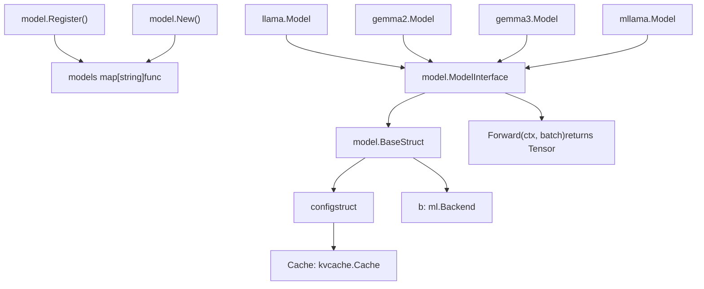
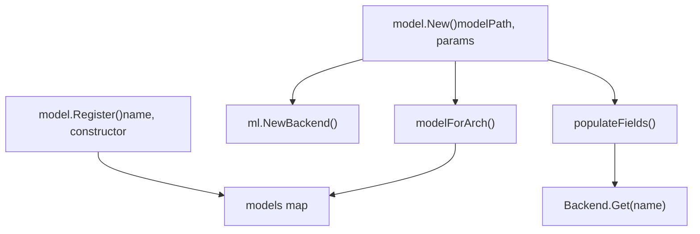
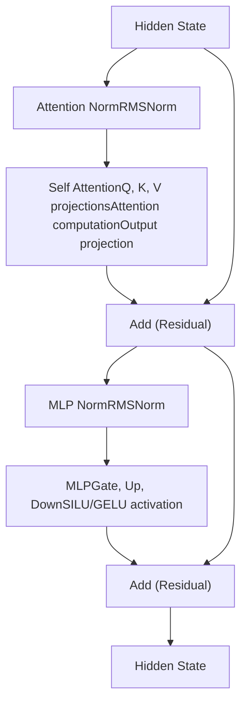
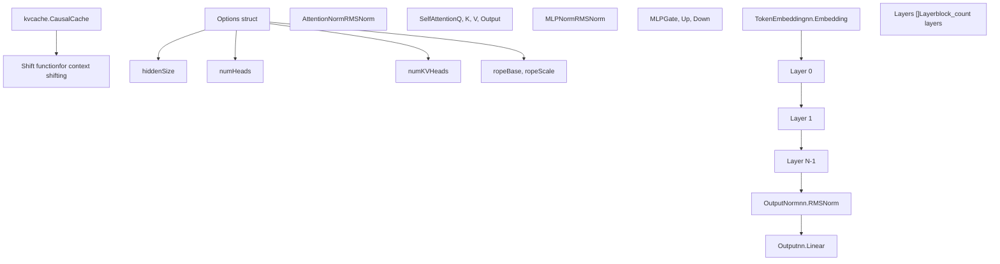
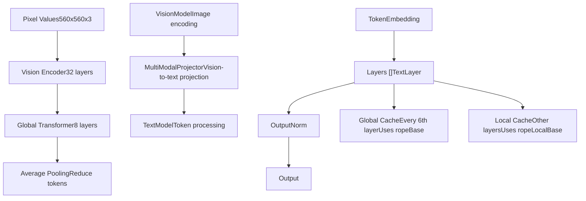
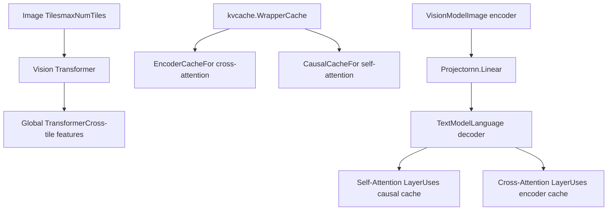
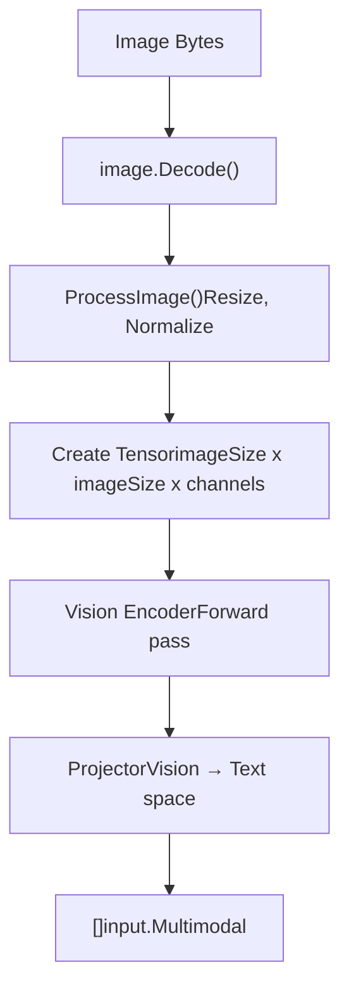
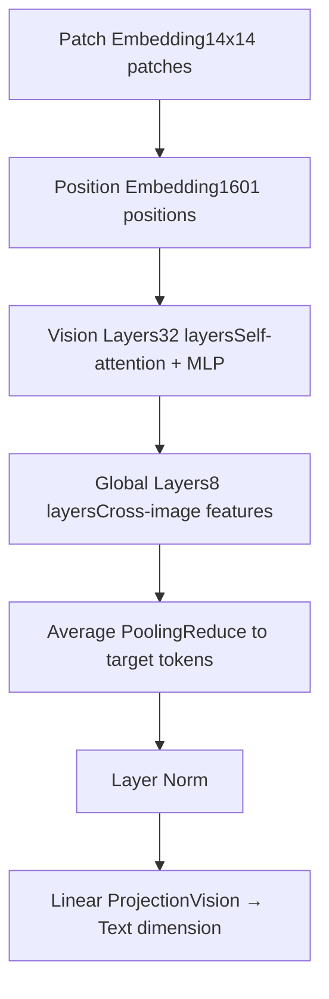
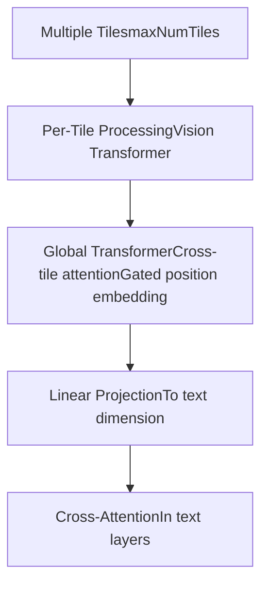
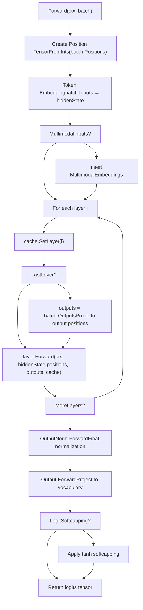

# 模型架构

相关源文件

-   [convert/convert\_gemma3.go](https://github.com/ollama/ollama/blob/562c76d7/convert/convert_gemma3.go)
-   [convert/convert\_mllama.go](https://github.com/ollama/ollama/blob/562c76d7/convert/convert_mllama.go)
-   [fs/config.go](https://github.com/ollama/ollama/blob/562c76d7/fs/config.go)
-   [integration/embed\_test.go](https://github.com/ollama/ollama/blob/562c76d7/integration/embed_test.go)
-   [kvcache/cache.go](https://github.com/ollama/ollama/blob/562c76d7/kvcache/cache.go)
-   [kvcache/causal.go](https://github.com/ollama/ollama/blob/562c76d7/kvcache/causal.go)
-   [kvcache/causal\_test.go](https://github.com/ollama/ollama/blob/562c76d7/kvcache/causal_test.go)
-   [kvcache/encoder.go](https://github.com/ollama/ollama/blob/562c76d7/kvcache/encoder.go)
-   [kvcache/wrapper.go](https://github.com/ollama/ollama/blob/562c76d7/kvcache/wrapper.go)
-   [llama/llama.cpp/src/llama-batch.cpp](https://github.com/ollama/ollama/blob/562c76d7/llama/llama.cpp/src/llama-batch.cpp)
-   [ml/backend.go](https://github.com/ollama/ollama/blob/562c76d7/ml/backend.go)
-   [ml/backend/ggml/ggml.go](https://github.com/ollama/ollama/blob/562c76d7/ml/backend/ggml/ggml.go)
-   [model/input/input.go](https://github.com/ollama/ollama/blob/562c76d7/model/input/input.go)
-   [model/model.go](https://github.com/ollama/ollama/blob/562c76d7/model/model.go)
-   [model/model\_test.go](https://github.com/ollama/ollama/blob/562c76d7/model/model_test.go)
-   [model/models/gemma2/model.go](https://github.com/ollama/ollama/blob/562c76d7/model/models/gemma2/model.go)
-   [model/models/gemma3/model.go](https://github.com/ollama/ollama/blob/562c76d7/model/models/gemma3/model.go)
-   [model/models/gemma3/model\_text.go](https://github.com/ollama/ollama/blob/562c76d7/model/models/gemma3/model_text.go)
-   [model/models/gemma3/model\_vision.go](https://github.com/ollama/ollama/blob/562c76d7/model/models/gemma3/model_vision.go)
-   [model/models/gemma3/process\_image.go](https://github.com/ollama/ollama/blob/562c76d7/model/models/gemma3/process_image.go)
-   [model/models/llama/model.go](https://github.com/ollama/ollama/blob/562c76d7/model/models/llama/model.go)
-   [model/models/llama4/process\_image.go](https://github.com/ollama/ollama/blob/562c76d7/model/models/llama4/process_image.go)
-   [model/models/llama4/process\_image\_test.go](https://github.com/ollama/ollama/blob/562c76d7/model/models/llama4/process_image_test.go)
-   [model/models/mllama/model.go](https://github.com/ollama/ollama/blob/562c76d7/model/models/mllama/model.go)
-   [model/models/mllama/model\_text.go](https://github.com/ollama/ollama/blob/562c76d7/model/models/mllama/model_text.go)
-   [model/models/mllama/model\_vision.go](https://github.com/ollama/ollama/blob/562c76d7/model/models/mllama/model_vision.go)
-   [model/models/mllama/process\_image.go](https://github.com/ollama/ollama/blob/562c76d7/model/models/mllama/process_image.go)
-   [runner/llamarunner/cache.go](https://github.com/ollama/ollama/blob/562c76d7/runner/llamarunner/cache.go)
-   [runner/llamarunner/runner.go](https://github.com/ollama/ollama/blob/562c76d7/runner/llamarunner/runner.go)
-   [runner/ollamarunner/cache.go](https://github.com/ollama/ollama/blob/562c76d7/runner/ollamarunner/cache.go)
-   [runner/ollamarunner/cache\_test.go](https://github.com/ollama/ollama/blob/562c76d7/runner/ollamarunner/cache_test.go)
-   [runner/ollamarunner/runner.go](https://github.com/ollama/ollama/blob/562c76d7/runner/ollamarunner/runner.go)
-   [server/internal/internal/backoff/backoff.go](https://github.com/ollama/ollama/blob/562c76d7/server/internal/internal/backoff/backoff.go)

本页记录 Ollama 中实现的模型架构，包括 Llama、Gemma 及其多模态变体。内容覆盖通用模型接口、架构特定组件、注意力机制与多模态处理能力。有关这些模型的后端执行信息，请参见 [GGML 后端与 ML 上下文](/ollama/ollama/5.1-ggml-backend-and-ml-context)。有关推理期间的缓存管理，请参见 [KV 缓存系统](/ollama/ollama/5.3-kv-cache-system)。

## 模型接口与框架

Ollama 定义了一个所有模型架构都必须实现的通用接口。`Model` 接口要求提供用于推理的 `Forward` 方法，并可访问后端与配置。


**模型接口定义**

核心 `Model` 接口定义了所有架构必须满足的契约：

| 方法 | 用途 |
| --- | --- |
| `Forward(ml.Context, input.Batch)` | 在输入批上执行模型推理 |
| `Backend()` | 返回底层执行后端 |
| `Config()` | 返回模型配置（包括缓存） |

Sources: [model/model.go36-41](https://github.com/ollama/ollama/blob/562c76d7/model/model.go#L36-L41)

**基础模型结构**

所有模型都内嵌 `Base` 结构体，提供通用基础设施：

```
type Base struct {    b ml.Backend    // Execution backend (GGML, MLX, etc.)    config          // Cache and other configuration}
```
`config` 结构体包含与各架构注意力模式对应的 KV 缓存实现。

Sources: [model/model.go82-99](https://github.com/ollama/ollama/blob/562c76d7/model/model.go#L82-L99)

**模型注册与初始化**

模型通过 `model.Register()` 以构造函数进行注册。初始化时，`model.New()` 会使用反射与 GGUF 标签自动填充字段：


`populateFields` 函数会遍历模型结构体，并根据字段标签自动从 GGUF 文件加载张量，例如 `gguf:"token_embd"` 或用于层数组的 `gguf:"blk"`。

Sources: [model/model.go101-173](https://github.com/ollama/ollama/blob/562c76d7/model/model.go#L101-L173) [model/model.go175-279](https://github.com/ollama/ollama/blob/562c76d7/model/model.go#L175-L279)

## 通用模型组件

### Token Embedding

所有文本模型都从 token embedding 层开始，将 token ID 转换为稠密向量：

```
TokenEmbedding *nn.Embedding `gguf:"token_embd"`
```
这通常是 `Forward` 方法中的首个操作：

```
hiddenState := m.TokenEmbedding.Forward(ctx, batch.Inputs)
```
Sources: [model/models/llama/model.go31](https://github.com/ollama/ollama/blob/562c76d7/model/models/llama/model.go#L31-L31) [model/models/gemma3/model\_text.go48](https://github.com/ollama/ollama/blob/562c76d7/model/models/gemma3/model_text.go#L48-L48)

### 层结构

模型将计算组织为重复层，每层包含注意力和前馈组件：


每层都维持该模式，但在归一化位置与激活函数上会因架构而异。

Sources: [model/models/llama/model.go155-181](https://github.com/ollama/ollama/blob/562c76d7/model/models/llama/model.go#L155-L181) [model/models/gemma3/model\_text.go191-221](https://github.com/ollama/ollama/blob/562c76d7/model/models/gemma3/model_text.go#L191-L221)

### 注意力机制

#### 标准自注意力

自注意力机制会将隐藏状态投影为 query、key、value，应用旋转位置编码（RoPE），并计算注意力：

```
type SelfAttention struct {    Query  *nn.Linear `gguf:"attn_q"`    Key    *nn.Linear `gguf:"attn_k"`    Value  *nn.Linear `gguf:"attn_v"`    Output *nn.Linear `gguf:"attn_output"`}
```
前向过程遵循以下模式：

1.  将隐藏状态投影为 Q、K、V，形状为 `[headDim, numHeads/numKVHeads, batch]`
2.  对 Q 与 K 应用 RoPE
3.  使用 KV 缓存计算注意力
4.  将输出投影回隐藏维度

Sources: [model/models/llama/model.go111-138](https://github.com/ollama/ollama/blob/562c76d7/model/models/llama/model.go#L111-L138) [model/models/gemma2/model.go83-115](https://github.com/ollama/ollama/blob/562c76d7/model/models/gemma2/model.go#L83-L115)

#### 分组查询注意力

模型使用分组查询注意力（GQA），其中 `numKVHeads < numHeads`，使多个 query 头共享同一组 key/value 头：

```
query = query.Reshape(ctx, headDim, opts.numHeads, batchSize)key = key.Reshape(ctx, headDim, opts.numKVHeads, batchSize)value = value.Reshape(ctx, headDim, opts.numKVHeads, batchSize)
```
这可在保持模型质量的同时降低 KV 缓存大小。

Sources: [model/models/llama/model.go123-130](https://github.com/ollama/ollama/blob/562c76d7/model/models/llama/model.go#L123-L130)

### 前馈网络（MLP）

MLP 层使用门控激活模式：

```
type MLP struct {    Up   *nn.Linear `gguf:"ffn_up"`    Down *nn.Linear `gguf:"ffn_down"`    Gate *nn.Linear `gguf:"ffn_gate"`} func (mlp *MLP) Forward(ctx ml.Context, hiddenState ml.Tensor) ml.Tensor {    hiddenState = mlp.Gate.Forward(ctx, hiddenState).SILU(ctx, mlp.Up.Forward(ctx, hiddenState))    return mlp.Down.Forward(ctx, hiddenState)}
```
门控项控制信息通过上投影的流动，激活函数可为 SILU（Llama）或 GELU（Gemma）。

Sources: [model/models/llama/model.go144-153](https://github.com/ollama/ollama/blob/562c76d7/model/models/llama/model.go#L144-L153) [model/models/gemma3/model\_text.go180-189](https://github.com/ollama/ollama/blob/562c76d7/model/models/gemma3/model_text.go#L180-L189)

### 旋转位置编码（RoPE）

所有架构都使用 RoPE 向注意力机制注入位置信息：

```
func (o Options) applyRotaryPositionEmbeddings(ctx ml.Context, states, positions, factors ml.Tensor) ml.Tensor {    return nn.RoPE(ctx, states, positions, ropeDim, ropeBase, 1./ropeScale, rope.WithFactors(factors))}
```
不同架构会调整 RoPE 参数（`ropeBase`、`ropeScale`）以支持不同上下文长度与缩放策略。

Sources: [model/models/llama/model.go23-25](https://github.com/ollama/ollama/blob/562c76d7/model/models/llama/model.go#L23-L25) [model/models/gemma2/model.go25-27](https://github.com/ollama/ollama/blob/562c76d7/model/models/gemma2/model.go#L25-L27)

## 已实现架构

### Llama 架构


**Llama 配置**

| 参数 | 描述 | 典型值 |
| --- | --- | --- |
| `hiddenSize` | embedding 维度 | 4096, 8192 |
| `numHeads` | 注意力头数量 | 32, 64 |
| `numKVHeads` | KV 头数量（GQA） | 8, 16 |
| `headDim` | 每头维度 | 128 |
| `ropeBase` | RoPE 频率基数 | 10000, 100000 |
| `ropeScale` | RoPE 缩放系数 | 1.0 |

Llama 架构使用标准因果注意力，并支持通过 RoPE 因子调整实现上下文窗口移位。

Sources: [model/models/llama/model.go27-108](https://github.com/ollama/ollama/blob/562c76d7/model/models/llama/model.go#L27-L108)

### Gemma2 架构

Gemma2 引入了滑动窗口注意力（SWA）与 attention logit softcapping：

```
type Options struct {    hiddenSize, numHeads, numKVHeads int    attnKeyLen, attnValLen           int    attnLogitSoftcap                 float32  // Caps attention scores    finalLogitSoftcap                float32  // Caps final logits    largeModelScaling                bool     // Different scaling for large models}
```
**滑动窗口注意力**

Gemma2 使用包装缓存，在滑动窗口注意力与因果注意力间交替：

```
slidingWindowLen := int32(c.Uint("attention.sliding_window"))m.Cache = kvcache.NewWrapperCache(    kvcache.NewSWACache(slidingWindowLen, m.Shift),    kvcache.NewCausalCache(m.Shift),)
```
这在保持长程依赖能力的同时降低了内存使用，长程依赖由周期性因果层维持。

**Logit Softcapping**

Gemma2 应用 softcapping 以防止 logit 值过大：

```
if opts.attnLogitSoftcap > 0.0 {    kq = kq.Scale(ctx, 1.0/float64(opts.attnLogitSoftcap))    kq = kq.Tanh(ctx)    kq = kq.Scale(ctx, float64(opts.attnLogitSoftcap))}
```
Sources: [model/models/gemma2/model.go16-80](https://github.com/ollama/ollama/blob/562c76d7/model/models/gemma2/model.go#L16-L80) [model/models/gemma2/model.go116-124](https://github.com/ollama/ollama/blob/562c76d7/model/models/gemma2/model.go#L116-L124)

### Gemma3 架构

Gemma3 在 Gemma2 基础上扩展了多模态能力与更复杂的注意力模式：


**交替缓存模式**

Gemma3 每 6 层在本地（滑动窗口）注意力与全局（因果）注意力之间交替：

```
func (opts *TextConfig) ropeValuesForLayer(layer int) (base float32, scale float32) {    if (layer+1)%gemmaGlobalCacheCount > 0 {        return opts.ropeLocalBase, 1.0  // Local attention    }    return opts.ropeBase, opts.ropeScale  // Global attention}
```
缓存类型会自动切换：

```
if (i+1)%gemmaGlobalCacheCount == 0 {    cacheType = cacheTypeCausal} else {    cacheType = cacheTypeSWA}cache.SetLayer(i)wc.SetLayerType(cacheType)
```
Sources: [model/models/gemma3/model\_text.go128-142](https://github.com/ollama/ollama/blob/562c76d7/model/models/gemma3/model_text.go#L128-L142) [model/models/gemma3/model\_text.go240-255](https://github.com/ollama/ollama/blob/562c76d7/model/models/gemma3/model_text.go#L240-L255)

**视觉组件**

视觉模型通过以下过程处理图像：

1.  patch embedding 与位置编码
2.  视觉 Transformer 层（典型模型为 32 层）
3.  用于跨图像特征的全局 Transformer（8 层）
4.  平均池化，降至目标 token 数（通常 256）
5.  投影到文本 embedding 空间

Sources: [model/models/gemma3/model.go32-55](https://github.com/ollama/ollama/blob/562c76d7/model/models/gemma3/model.go#L32-L55)

### mLlama 架构（多模态 Llama）

mLlama 通过交叉注意力结合视觉与语言模型：


**双缓存系统**

mLlama 使用包装缓存，根据层类型路由到不同缓存：

```
encoderCache := kvcache.NewEncoderCache()m.Cache = kvcache.NewWrapperCache(    encoderCache,    kvcache.NewCausalCache(m.TextModel.Shift),)
```
交叉注意力层使用 encoder cache（与位置无关），而自注意力层使用 causal cache。

**图像切片**

mLlama 以保持宽高比的方式将图像处理为多个切片：

```
pixelValues := ctx.Input().FromFloats(f32s,     m.imageSize, m.imageSize, m.numChannels, m.maxNumTiles)aspectRatio := ctx.Input().FromInts([]int32{int32(ratio.rank)}, 1)
```
视觉模型处理所有切片，全局 Transformer 聚合跨切片特征。

Sources: [model/models/mllama/model.go34-61](https://github.com/ollama/ollama/blob/562c76d7/model/models/mllama/model.go#L34-L61) [model/models/mllama/model.go63-92](https://github.com/ollama/ollama/blob/562c76d7/model/models/mllama/model.go#L63-L92)

## 架构特定特性

### RoPE 变体

不同架构使用不同 RoPE 配置：

| 架构 | RoPE 类型 | 基础频率 | 缩放 |
| --- | --- | --- | --- |
| Llama | Standard | 10000-100000 | 1.0 or yarn scaling |
| Gemma2 | NeoX | 10000 | 1.0 |
| Gemma3 | NeoX/Yarn | 10000 (local)
1000000 (global) | 1.0 (local)
8.0 (global) |

**Yarn 缩放**

Gemma3 支持用于扩展上下文的 yarn 缩放：

```
if o.ropeType == "yarn" {    attnFactor := float32(1.0 / (1.0 + 0.1*math.Log(float64(scale))))    ropeOpts = append(ropeOpts,        rope.WithOriginalContextLength(o.ropeOriginalContext),        rope.WithExtrapolationFactor(o.ropeExtrapolation),        rope.WithAttentionFactor(attnFactor),        rope.WithBetaFast(o.ropeBetaFast),        rope.WithBetaSlow(o.ropeBetaSlow),    )}
```
Sources: [model/models/gemma3/model\_text.go31-44](https://github.com/ollama/ollama/blob/562c76d7/model/models/gemma3/model_text.go#L31-L44)

### Query 归一化

Gemma 模型在应用注意力前会归一化 query 与 key 投影：

```
q = sa.QueryNorm.Forward(ctx, q, opts.eps)k = sa.KeyNorm.Forward(ctx, k, opts.eps)
```
这可稳定训练并提升长序列性能。

Sources: [model/models/gemma3/model\_text.go151-163](https://github.com/ollama/ollama/blob/562c76d7/model/models/gemma3/model_text.go#L151-L163)

### 注意力缩放

不同架构使用不同缩放策略：

**标准缩放**（Llama）：

```
scaleFactor := 1.0 / math.Sqrt(float64(headDim))
```
**大模型缩放**（Gemma3 27B）：

```
if opts.largeModelScaling {    q = q.Scale(ctx, 1.0/math.Sqrt(float64(opts.hiddenSize/opts.numHeads)))}
```
Sources: [model/models/llama/model.go135](https://github.com/ollama/ollama/blob/562c76d7/model/models/llama/model.go#L135-L135) [model/models/gemma3/model\_text.go154-158](https://github.com/ollama/ollama/blob/562c76d7/model/models/gemma3/model_text.go#L154-L158)

### Logit Softcapping

Gemma 模型会应用 softcapping 以防止极值：

```
// Attention logit softcapping (Gemma2)if opts.attnLogitSoftcap > 0.0 {    kq = kq.Scale(ctx, 1.0/float64(opts.attnLogitSoftcap))    kq = kq.Tanh(ctx)    kq = kq.Scale(ctx, float64(opts.attnLogitSoftcap))} // Final logit softcapping (Gemma3)if m.TextConfig.finalLogitSoftcap > 0.0 {    hiddenState = hiddenState.Scale(ctx, 1.0/float64(m.TextConfig.finalLogitSoftcap))    hiddenState = hiddenState.Tanh(ctx)    hiddenState = hiddenState.Scale(ctx, float64(m.TextConfig.finalLogitSoftcap))}
```
Sources: [model/models/gemma2/model.go116-124](https://github.com/ollama/ollama/blob/562c76d7/model/models/gemma2/model.go#L116-L124) [model/models/gemma3/model.go159-163](https://github.com/ollama/ollama/blob/562c76d7/model/models/gemma3/model.go#L159-L163)

## 多模态处理

多模态模型实现 `MultimodalProcessor` 接口以处理非文本输入：

```
type MultimodalProcessor interface {    EncodeMultimodal(ml.Context, []byte) ([]input.Multimodal, error)    PostTokenize([]*input.Input) ([]*input.Input, error)}
```
### 图像编码流水线


**Gemma3 编码**：

```
func (m *Model) EncodeMultimodal(ctx ml.Context, data []byte) ([]input.Multimodal, error) {    image, _, err := image.Decode(bytes.NewReader(data))        f32s, err := m.ImageProcessor.ProcessImage(image)    pixelValues := ctx.Input().FromFloats(f32s, m.imageSize, m.imageSize, m.numChannels)        visionOutputs := m.VisionModel.Forward(ctx, pixelValues)    visionOutputs = m.MultiModalProjector.Forward(ctx, visionOutputs, ...)        return []input.Multimodal{{Tensor: visionOutputs}}, nil}
```
Sources: [model/models/gemma3/model.go101-125](https://github.com/ollama/ollama/blob/562c76d7/model/models/gemma3/model.go#L101-L125)

### Token 流集成

编码后，`PostTokenize` 会将图像 embedding 集成到 token 流中：

**Gemma3 模式**：

```
func (m *Model) PostTokenize(inputs []*input.Input) ([]*input.Input, error) {    for _, inp := range inputs {        if len(inp.Multimodal) > 0 {            result = append(result,                &input.Input{Token: 108, SameBatch: numImageTokens + 3}, // "\n\n"                &input.Input{Token: 255999},                             // "<start_of_image>"                &input.Input{Multimodal: imageData},                     // First token with image data            )            // Add placeholder tokens            result = append(result, slices.Repeat([]*input.Input{{Token: 0}}, numImageTokens-1)...)            result = append(result,                &input.Input{Token: 256000}, // "<end_of_image>"                &input.Input{Token: 108},    // "\n\n"            )        }    }    return result, nil}
```
`SameBatch` 字段确保图像前缀与图像 token 在单个批中处理，以维持一致性。

Sources: [model/models/gemma3/model.go127-153](https://github.com/ollama/ollama/blob/562c76d7/model/models/gemma3/model.go#L127-L153)

**mLlama 模式**：

```
func (m *Model) PostTokenize(inputs []*input.Input) ([]*input.Input, error) {    for i := range inputs {        if inputs[i].Multimodal != nil {            inputs[i].Token = 128256 // <|image|>        }    }    return inputs, nil}
```
mLlama 每张图像使用单个特殊 token，并由交叉注意力访问完整图像编码。

Sources: [model/models/mllama/model.go94-102](https://github.com/ollama/ollama/blob/562c76d7/model/models/mllama/model.go#L94-L102)

### 图像预处理

图像预处理会因架构而异：

| 架构 | 图像尺寸 | 预处理步骤 |
| --- | --- | --- |
| Gemma3 | 560x560 | 按宽高比缩放，并按通道归一化 |
| mLlama | 560x560 (per tile) | 多切片并保持宽高比 |

**Gemma3 预处理**：

```
func (ip *ImageProcessor) ProcessImage(img image.Image) ([]float32, error) {    img = resizeImage(img, ip.imageSize, ip.imageSize)    img = normalizeImage(img, ip.imageMean, ip.imageStd)    return imageToFloat32Array(img), nil}
```
**mLlama 预处理**：

```
func (ip *ImageProcessor) ProcessImage(img image.Image) ([]float32, AspectRatio, error) {    ratio := selectAspectRatio(img, ip.maxImageTiles, ip.imageSize)    tiles := tileImage(img, ratio, ip.imageSize)    normalized := normalizeAllTiles(tiles, ip.imageMean, ip.imageStd)    return normalized, ratio, nil}
```
Sources: [model/models/gemma3/process\_image.go21-50](https://github.com/ollama/ollama/blob/562c76d7/model/models/gemma3/process_image.go#L21-L50) [model/models/llama4/process\_image.go50-120](https://github.com/ollama/ollama/blob/562c76d7/model/models/llama4/process_image.go#L50-L120)

### 视觉模型架构

**Gemma3 Vision**：


**mLlama Vision**：


Sources: [model/models/gemma3/model\_vision.go50-100](https://github.com/ollama/ollama/blob/562c76d7/model/models/gemma3/model_vision.go#L50-L100) [model/models/mllama/model\_vision.go50-150](https://github.com/ollama/ollama/blob/562c76d7/model/models/mllama/model_vision.go#L50-L150)

## 模型前向过程

不同架构的前向过程遵循一致模式：


**优化：输出裁剪**

在最后一层，模型会将隐藏状态裁剪为仅包含需要 logits 的位置：

```
if outputs != nil {    hiddenState = hiddenState.Rows(ctx, outputs)    residual = residual.Rows(ctx, outputs)}
```
当仅少量 token 需要 logits（如解码阶段）时，这能显著降低计算量。

Sources: [model/models/llama/model.go183-201](https://github.com/ollama/ollama/blob/562c76d7/model/models/llama/model.go#L183-L201) [model/models/gemma3/model\_text.go223-266](https://github.com/ollama/ollama/blob/562c76d7/model/models/gemma3/model_text.go#L223-L266)

## 架构对比

| Feature | Llama | Gemma2 | Gemma3 | mLlama |
| --- | --- | --- | --- | --- |
| Attention Type | Causal | SWA + Causal | SWA + Causal (alternating) | Causal + Cross-attention |
| RoPE Type | Standard | NeoX | NeoX + Yarn | Standard |
| Normalization | RMSNorm | RMSNorm | RMSNorm + Q/K norm | RMSNorm |
| Activation | SILU | GELU | GELU | SILU |
| Logit Softcapping | No | Yes (attention + final) | Yes (final only) | No |
| Multimodal | No | No | Yes (vision) | Yes (vision) |
| Cache Pattern | Single causal | Alternating every layer | Alternating every 6 layers | Dual (encoder + causal) |
| KV Head Strategy | GQA | GQA | GQA | GQA |

Sources: [model/models/llama/model.go39-108](https://github.com/ollama/ollama/blob/562c76d7/model/models/llama/model.go#L39-L108) [model/models/gemma2/model.go45-80](https://github.com/ollama/ollama/blob/562c76d7/model/models/gemma2/model.go#L45-L80) [model/models/gemma3/model\_text.go69-116](https://github.com/ollama/ollama/blob/562c76d7/model/models/gemma3/model_text.go#L69-L116) [model/models/mllama/model.go34-61](https://github.com/ollama/ollama/blob/562c76d7/model/models/mllama/model.go#L34-L61)
