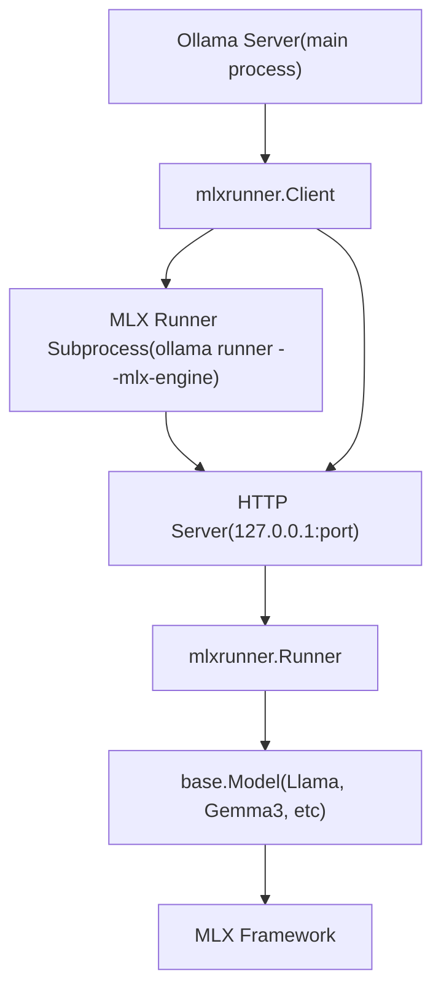
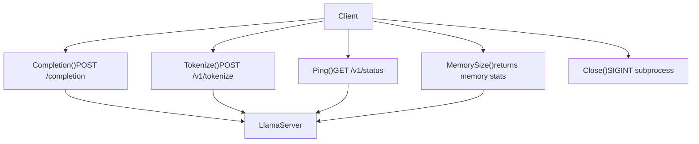
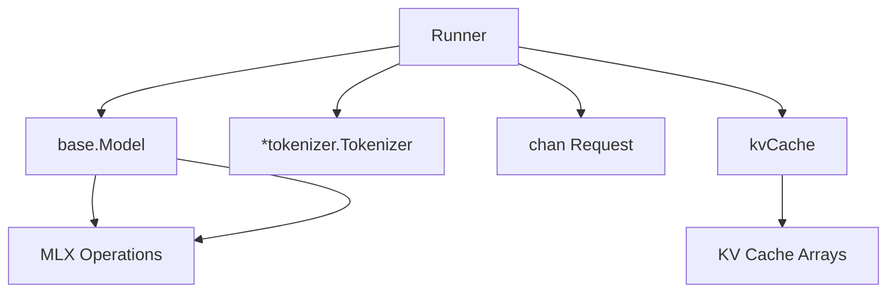
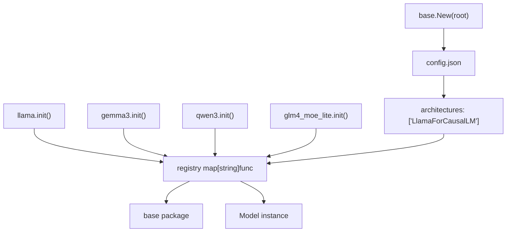
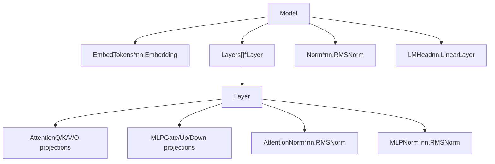
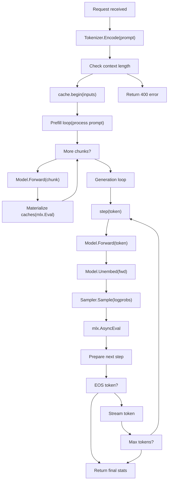
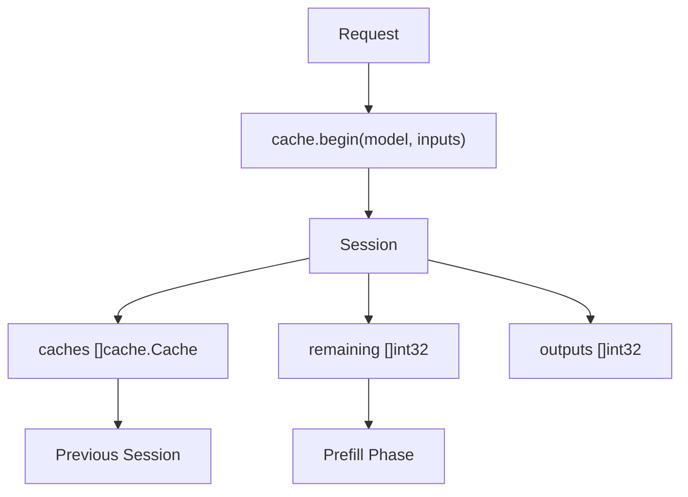
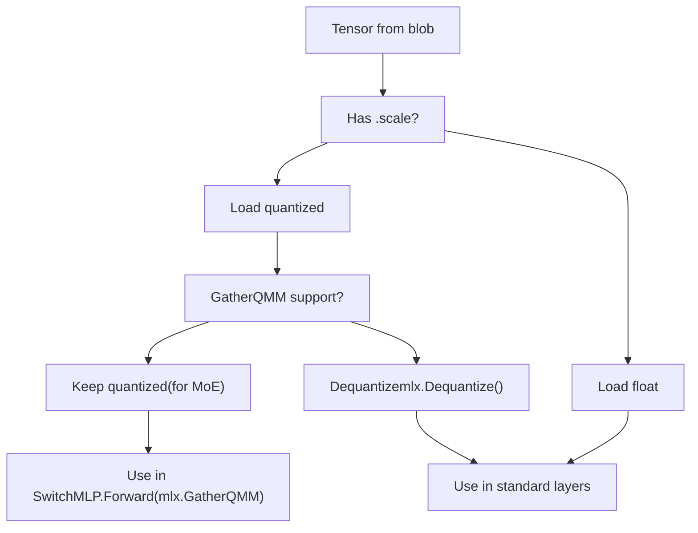

# MLX Runner（Apple Silicon）

相关源码文件

-   [x/mlxrunner/client.go](https://github.com/ollama/ollama/blob/562c76d7/x/mlxrunner/client.go)
-   [x/mlxrunner/model/base/base.go](https://github.com/ollama/ollama/blob/562c76d7/x/mlxrunner/model/base/base.go)
-   [x/mlxrunner/pipeline.go](https://github.com/ollama/ollama/blob/562c76d7/x/mlxrunner/pipeline.go)
-   [x/mlxrunner/runner.go](https://github.com/ollama/ollama/blob/562c76d7/x/mlxrunner/runner.go)
-   [x/mlxrunner/server.go](https://github.com/ollama/ollama/blob/562c76d7/x/mlxrunner/server.go)
-   [x/models/gemma3/gemma3.go](https://github.com/ollama/ollama/blob/562c76d7/x/models/gemma3/gemma3.go)
-   [x/models/glm4\_moe\_lite/glm4\_moe\_lite.go](https://github.com/ollama/ollama/blob/562c76d7/x/models/glm4_moe_lite/glm4_moe_lite.go)
-   [x/models/llama/llama.go](https://github.com/ollama/ollama/blob/562c76d7/x/models/llama/llama.go)
-   [x/models/qwen3/qwen3.go](https://github.com/ollama/ollama/blob/562c76d7/x/models/qwen3/qwen3.go)

## 目的与范围

MLX Runner 是面向 Apple Silicon 的专用执行后端，它利用 MLX 框架在 Apple 统一内存架构上高效运行大语言模型。本文档涵盖 MLX runner 的架构、客户端与服务端通信、模型系统以及推理流水线。

关于通用推理引擎概念和更广泛的基于 GGML 的后端，请参见 [Inference Engine](/ollama/ollama/5-inference-engine)。关于跨平台 GPU 支持和硬件检测信息，请参见 [GPU and Hardware Support](/ollama/ollama/6-gpu-and-hardware-support)。

## 架构概览

MLX runner 作为独立子进程运行，并通过 HTTP 与主 Ollama 服务器通信。这种设计隔离了 MLX 专用代码，并使主服务器保持平台无关，同时将 Apple Silicon 工作负载委托给专用 runner。

### 子进程模型

**来源:** [x/mlxrunner/client.go30-144](https://github.com/ollama/ollama/blob/562c76d7/x/mlxrunner/client.go#L30-L144) [x/mlxrunner/server.go25-178](https://github.com/ollama/ollama/blob/562c76d7/x/mlxrunner/server.go#L25-L178)

主服务器进程中的 `Client` 结构体会使用同一可执行文件并携带 `--mlx-engine` 标志来拉起子进程。子进程在动态分配的端口上启动 HTTP 服务器，客户端通过 HTTP 请求与其通信。

### 进程生命周期

> **[Mermaid sequence]**
> *(图表结构无法解析)*

**来源:** [x/mlxrunner/client.go44-144](https://github.com/ollama/ollama/blob/562c76d7/x/mlxrunner/client.go#L44-L144) [x/mlxrunner/server.go25-49](https://github.com/ollama/ollama/blob/562c76d7/x/mlxrunner/server.go#L25-L49)

生命周期从 `NewClient` 拉起子进程并通过健康检查等待其就绪开始。子进程在模型推理期间保持存活，并通过 HTTP API 处理请求。当客户端关闭时，它会发送 `SIGINT` 以优雅终止子进程。

## 客户端实现

`Client` 结构体实现了 `llm.LlamaServer` 接口，使主 Ollama 服务器能够像对待基于 GGML 的模型一样对待 MLX 模型。

### 客户端结构

| 字段 | 类型 | 用途 |
| --- | --- | --- |
| `port` | `int` | 子进程 HTTP 服务器的动态端口 |
| `modelName` | `string` | 用于加载的模型标识符 |
| `contextLength` | `atomic.Int64` | 来自模型配置的最大上下文长度 |
| `memory` | `atomic.Uint64` | 当前内存使用量（活跃 + 缓存） |
| `done` | `chan error` | 子进程退出信号 |
| `client` | `*http.Client` | 10 分钟超时的 HTTP 客户端 |
| `cmd` | `*exec.Cmd` | 子进程命令句柄 |

**来源:** [x/mlxrunner/client.go31-42](https://github.com/ollama/ollama/blob/562c76d7/x/mlxrunner/client.go#L31-L42)

### 客户端关键方法

**来源:** [x/mlxrunner/client.go228-433](https://github.com/ollama/ollama/blob/562c76d7/x/mlxrunner/client.go#L228-L433)

客户端会把 `llm.LlamaServer` 方法调用转换为发往子进程的 HTTP 请求。例如，`Completion` 会向 `/completion` 发送 POST 请求，并将响应流式回传给调用方。

## 服务端与 Runner

子进程侧由一个 HTTP 服务器组成，该服务器将请求路由到 `Runner` 实例。

### HTTP 端点

| 端点 | 方法 | 用途 |
| --- | --- | --- |
| `/v1/status` | GET | 健康检查，返回上下文长度和内存 |
| `/v1/completions` | POST | 支持流式输出的文本补全 |
| `/v1/tokenize` | POST | 对输入文本进行分词 |
| `/v1/models` | GET/POST/DELETE | 模型管理（占位） |
| `/completion` | POST | 重定向到 `/v1/completions` |
| `/health` | GET | 重定向到 `/v1/status` |
| `/load` | POST | 重定向到 `/v1/models` |

**来源:** [x/mlxrunner/server.go52-158](https://github.com/ollama/ollama/blob/562c76d7/x/mlxrunner/server.go#L52-L158)

### Runner 结构

**来源:** [x/mlxrunner/runner.go47-53](https://github.com/ollama/ollama/blob/562c76d7/x/mlxrunner/runner.go#L47-L53)

`Runner` 管理以下内容：

-   **Model**：已加载的模型实现（`base.Model` 接口）
-   **Tokenizer**：用于对提示词编码和对 token 解码
-   **Requests channel**：顺序请求处理
-   **KV cache**：管理跨请求缓存的 key/value 状态
-   **Context length**：来自模型配置的最大序列长度

### 请求处理

runner 通过通道按顺序处理请求，以确保模型访问安全：

[x/mlxrunner/runner.go139-174](https://github.com/ollama/ollama/blob/562c76d7/x/mlxrunner/runner.go#L139-L174)

每个请求都会指定一个流水线函数（例如 `TextGenerationPipeline`）来执行推理逻辑。响应通过通道流式回传。

**来源:** [x/mlxrunner/runner.go139-174](https://github.com/ollama/ollama/blob/562c76d7/x/mlxrunner/runner.go#L139-L174) [x/mlxrunner/server.go82-133](https://github.com/ollama/ollama/blob/562c76d7/x/mlxrunner/server.go#L82-L133)

## 模型系统

MLX runner 使用基于注册表的模型系统，支持多种架构。

### 模型注册表

**来源:** [x/mlxrunner/model/base/base.go31-80](https://github.com/ollama/ollama/blob/562c76d7/x/mlxrunner/model/base/base.go#L31-L80)

模型在包初始化期间通过 `base.Register` 自注册。`base.New` 函数会读取 `config.json`，提取架构名称，并调用已注册的构造函数。

### 模型接口

所有模型实现都必须满足 `base.Model` 接口：

| Method | Purpose |
| --- | --- |
| `Forward(inputs, cache) *mlx.Array` | 计算输入 token 的隐藏状态 |
| `Unembed(x) *mlx.Array` | 将隐藏状态转换为 logits |
| `NumLayers() int` | 返回 transformer 层数 |
| `Tokenizer() *tokenizer.Tokenizer` | 返回 tokenizer 实例 |
| `MaxContextLength() int` | 返回最大序列长度 |
| `LoadWeights(tensors) error` | 将张量分配到模型字段 |

**来源:** [x/mlxrunner/model/base/base.go18-29](https://github.com/ollama/ollama/blob/562c76d7/x/mlxrunner/model/base/base.go#L18-L29)

### 模型加载流水线

> **[Mermaid sequence]**
> *(图表结构无法解析)*

**来源:** [x/mlxrunner/runner.go55-83](https://github.com/ollama/ollama/blob/562c76d7/x/mlxrunner/runner.go#L55-L83) [x/mlxrunner/runner.go92-137](https://github.com/ollama/ollama/blob/562c76d7/x/mlxrunner/runner.go#L92-L137)

加载过程包括：

1.  打开模型清单
2.  从注册表创建模型实例
3.  从磁盘加载所有张量 blob
4.  调用 `LoadWeights` 将张量分配到模型字段
5.  固定所有数组并清理未引用内存

### 张量重映射

在加载期间，为了兼容性，张量可能需要重映射：

[x/mlxrunner/runner.go92-137](https://github.com/ollama/ollama/blob/562c76d7/x/mlxrunner/runner.go#L92-L137)

加载器会：

-   按 digest 对 blob 去重
-   对量化层将 `.scale` → `_scale`、`.bias` → `_qbias` 做重映射
-   处理 safetensors 键后缀约定

**来源:** [x/mlxrunner/runner.go92-137](https://github.com/ollama/ollama/blob/562c76d7/x/mlxrunner/runner.go#L92-L137)

## 支持的模型

MLX runner 支持多种模型架构，并提供不同特性：

### 模型实现

| Architecture | Class | Features |
| --- | --- | --- |
| Llama | `LlamaForCausalLM` | 标准 transformer、RMSNorm、RoPE |
| Gemma 3 | `Gemma3ForCausalLM` | Q/K norm、滑动窗口、本地 RoPE |
| Qwen 3 | `Qwen3ForCausalLM` | Q/K norm、高 RoPE 基频 |
| GLM-4 MoE Lite | `Glm4MoeLiteForCausalLM` | 多头潜在注意力、MoE |

**来源:** [x/models/llama/llama.go19-21](https://github.com/ollama/ollama/blob/562c76d7/x/models/llama/llama.go#L19-L21) [x/models/gemma3/gemma3.go19-22](https://github.com/ollama/ollama/blob/562c76d7/x/models/gemma3/gemma3.go#L19-L22) [x/models/qwen3/qwen3.go19-21](https://github.com/ollama/ollama/blob/562c76d7/x/models/qwen3/qwen3.go#L19-L21) [x/models/glm4\_moe\_lite/glm4\_moe\_lite.go20-23](https://github.com/ollama/ollama/blob/562c76d7/x/models/glm4_moe_lite/glm4_moe_lite.go#L20-L23)

### 示例：Llama 模型结构

**来源:** [x/models/llama/llama.go48-78](https://github.com/ollama/ollama/blob/562c76d7/x/models/llama/llama.go#L48-L78)

### 示例：GLM-4 MoE 结构

GLM-4 MoE Lite 模型使用了高级技术：

**多头潜在注意力（MLA）：**

-   将 K/V 压缩到更低维的潜在空间
-   使用吸收后的注意力权重（`kv_b_proj` 吸收到 `embed_q`/`unembed_out`）
-   结合非位置（nope）与位置编码（PE）组件

[x/models/glm4\_moe\_lite/glm4\_moe\_lite.go76-142](https://github.com/ollama/ollama/blob/562c76d7/x/models/glm4_moe_lite/glm4_moe_lite.go#L76-L142)

**专家混合（MoE）：**

-   使用 sigmoid gating 将 token 路由到 top-k 专家
-   堆叠专家权重以实现高效批处理
-   通过 `GatherQMM` kernel 支持量化专家权重
-   为所有 token 包含共享专家

[x/models/glm4\_moe\_lite/glm4\_moe\_lite.go283-307](https://github.com/ollama/ollama/blob/562c76d7/x/models/glm4_moe_lite/glm4_moe_lite.go#L283-L307)

**来源:** [x/models/glm4\_moe\_lite/glm4\_moe\_lite.go76-307](https://github.com/ollama/ollama/blob/562c76d7/x/models/glm4_moe_lite/glm4_moe_lite.go#L76-L307)

## 文本生成流水线

该流水线实现了带流式输出的自回归 token 生成。

### 流水线流程

**来源:** [x/mlxrunner/pipeline.go23-176](https://github.com/ollama/ollama/blob/562c76d7/x/mlxrunner/pipeline.go#L23-L176)

### 流水线阶段

**1\. 提示词编码与校验**

[x/mlxrunner/pipeline.go57-75](https://github.com/ollama/ollama/blob/562c76d7/x/mlxrunner/pipeline.go#L57-L75)

该流水线会对提示词进行编码、校验长度，并限制生成长度以确保不超过模型上下文窗口。

**2\. Prefill 阶段**

[x/mlxrunner/pipeline.go77-108](https://github.com/ollama/ollama/blob/562c76d7/x/mlxrunner/pipeline.go#L77-L108)

Prefill 阶段会将提示词按块处理（默认 2048 tokens）以构建 KV 缓存。每个块都会经过 `Model.Forward`，并使用 `mlx.Eval` 物化缓存，确保 GPU 计算完成后再继续。

**3\. Token 生成循环**

[x/mlxrunner/pipeline.go110-167](https://github.com/ollama/ollama/blob/562c76d7/x/mlxrunner/pipeline.go#L110-L167)

生成循环会：

-   计算当前 token 的 logits
-   使用 temperature/top-p/min-p/top-k 采样下一个 token
-   异步评估采样结果（与响应流式发送重叠）
-   解码并流式输出 token
-   检查 EOS 或最大 token 限制

**4\. 内存管理**

[x/mlxrunner/pipeline.go44-55](https://github.com/ollama/ollama/blob/562c76d7/x/mlxrunner/pipeline.go#L44-L55)

该流水线采用了积极的内存管理策略：

-   固定 sample 和 logprob 数组，防止过早回收
-   调用 `mlx.Sweep()` 释放未引用数组
-   周期性调用 `mlx.ClearCache()`（每 256 个 tokens）以释放编译缓存
-   在完成时报告峰值内存使用量

**来源:** [x/mlxrunner/pipeline.go23-176](https://github.com/ollama/ollama/blob/562c76d7/x/mlxrunner/pipeline.go#L23-L176)

### KV 缓存管理

该流水线使用基于会话的缓存系统：

**来源:** [x/mlxrunner/pipeline.go77-81](https://github.com/ollama/ollama/blob/562c76d7/x/mlxrunner/pipeline.go#L77-L81)

缓存系统会：

-   在跨请求场景下按层维护 KV 缓存
-   当输入前缀匹配时复用缓存状态
-   在 prefill 阶段仅处理新 token
-   将生成的 token 追加到会话输出

### Step 函数

核心生成步骤：

[x/mlxrunner/pipeline.go110-123](https://github.com/ollama/ollama/blob/562c76d7/x/mlxrunner/pipeline.go#L110-L123)

该函数会：

1.  将 token 扩展到 batch 维度
2.  执行 forward 和 unembed
3.  提取最后一个 token 的 logits
4.  计算对数概率
5.  采样下一个 token
6.  固定并异步评估结果

**来源:** [x/mlxrunner/pipeline.go110-123](https://github.com/ollama/ollama/blob/562c76d7/x/mlxrunner/pipeline.go#L110-L123)

## 编译与优化

MLX runner 使用 MLX 的图编译来提升性能：

### 编译控制

[x/mlxrunner/pipeline.go28-36](https://github.com/ollama/ollama/blob/562c76d7/x/mlxrunner/pipeline.go#L28-L36)

模型可通过实现 `EnableCompile() bool` 来禁用编译。启用时，MLX 会在首次执行时编译计算图，并缓存优化后的内核用于后续运行。

### 内存优化

| Technique | Implementation | Purpose |
| --- | --- | --- |
| Array pinning | `mlx.Pin(array)` | 防止过早垃圾回收 |
| Sweeping | `mlx.Sweep()` | 释放未引用数组 |
| Cache clearing | `mlx.ClearCache()` | 周期性释放编译缓存 |
| Peak tracking | `mlx.PeakMemory()` | 监控最大内存使用量 |

**来源:** [x/mlxrunner/pipeline.go44-55](https://github.com/ollama/ollama/blob/562c76d7/x/mlxrunner/pipeline.go#L44-L55)

### 量化支持

模型加载系统支持量化权重：

**来源:** [x/models/glm4\_moe\_lite/glm4\_moe\_lite.go370-413](https://github.com/ollama/ollama/blob/562c76d7/x/models/glm4_moe_lite/glm4_moe_lite.go#L370-L413)

对于 MoE 模型，在使用仿射量化（4 或 8 位）时，系统会保持专家权重量化状态，以便 `GatherQMM` kernel 按需高效选择并反量化专家。标准层会在加载期间对权重反量化。

## 示例：请求流程

下面是一个通过 MLX runner 的完整请求流程：

> **[Mermaid sequence]**
> *(图表结构无法解析)*

**来源:** [x/mlxrunner/server.go82-133](https://github.com/ollama/ollama/blob/562c76d7/x/mlxrunner/server.go#L82-L133) [x/mlxrunner/pipeline.go23-176](https://github.com/ollama/ollama/blob/562c76d7/x/mlxrunner/pipeline.go#L23-L176)

该流程展示了从 HTTP 请求到流式 token 生成的完整生命周期，突出服务端、runner、pipeline、model 与 MLX 框架之间的集成关系。
