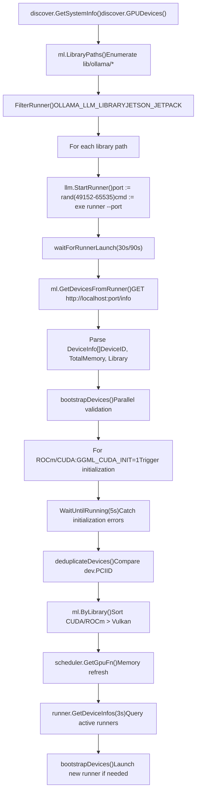
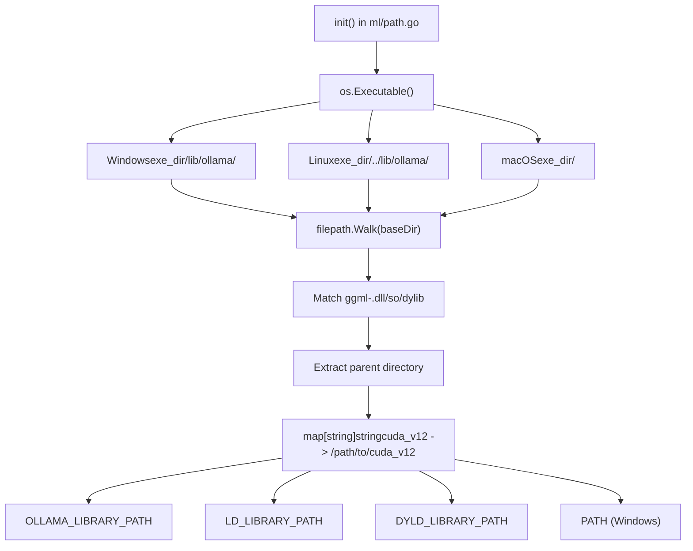
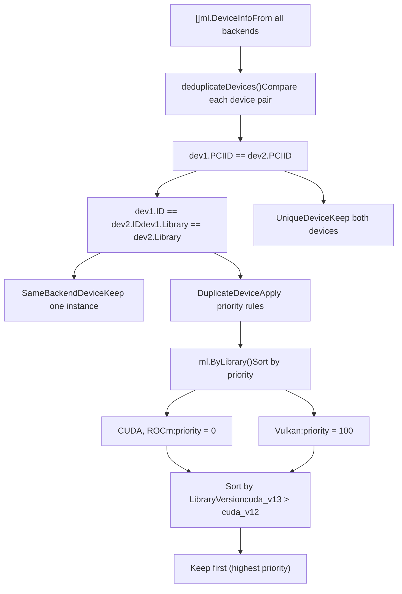
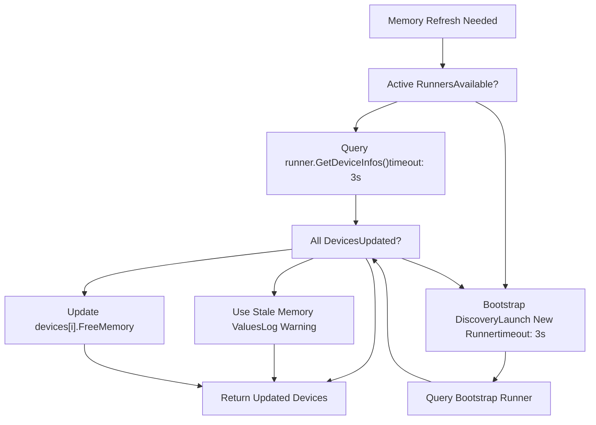

# GPU 与硬件支持

相关源文件

-   [envconfig/config.go](https://github.com/ollama/ollama/blob/562c76d7/envconfig/config.go)
-   [envconfig/config\_test.go](https://github.com/ollama/ollama/blob/562c76d7/envconfig/config_test.go)
-   [integration/embed\_test.go](https://github.com/ollama/ollama/blob/562c76d7/integration/embed_test.go)
-   [kvcache/cache.go](https://github.com/ollama/ollama/blob/562c76d7/kvcache/cache.go)
-   [kvcache/causal.go](https://github.com/ollama/ollama/blob/562c76d7/kvcache/causal.go)
-   [kvcache/causal\_test.go](https://github.com/ollama/ollama/blob/562c76d7/kvcache/causal_test.go)
-   [kvcache/encoder.go](https://github.com/ollama/ollama/blob/562c76d7/kvcache/encoder.go)
-   [kvcache/wrapper.go](https://github.com/ollama/ollama/blob/562c76d7/kvcache/wrapper.go)
-   [llm/server.go](https://github.com/ollama/ollama/blob/562c76d7/llm/server.go)
-   [ml/backend.go](https://github.com/ollama/ollama/blob/562c76d7/ml/backend.go)
-   [ml/backend/ggml/ggml.go](https://github.com/ollama/ollama/blob/562c76d7/ml/backend/ggml/ggml.go)
-   [model/input/input.go](https://github.com/ollama/ollama/blob/562c76d7/model/input/input.go)
-   [model/model.go](https://github.com/ollama/ollama/blob/562c76d7/model/model.go)
-   [model/model\_test.go](https://github.com/ollama/ollama/blob/562c76d7/model/model_test.go)
-   [runner/llamarunner/cache.go](https://github.com/ollama/ollama/blob/562c76d7/runner/llamarunner/cache.go)
-   [runner/llamarunner/runner.go](https://github.com/ollama/ollama/blob/562c76d7/runner/llamarunner/runner.go)
-   [runner/ollamarunner/cache.go](https://github.com/ollama/ollama/blob/562c76d7/runner/ollamarunner/cache.go)
-   [runner/ollamarunner/cache\_test.go](https://github.com/ollama/ollama/blob/562c76d7/runner/ollamarunner/cache_test.go)
-   [runner/ollamarunner/runner.go](https://github.com/ollama/ollama/blob/562c76d7/runner/ollamarunner/runner.go)
-   [server/internal/internal/backoff/backoff.go](https://github.com/ollama/ollama/blob/562c76d7/server/internal/internal/backoff/backoff.go)
-   [server/sched.go](https://github.com/ollama/ollama/blob/562c76d7/server/sched.go)
-   [server/sched\_test.go](https://github.com/ollama/ollama/blob/562c76d7/server/sched_test.go)

Ollama 在 NVIDIA、AMD、Apple 和 Vulkan 平台上提供全面的 GPU 加速支持。本页记录硬件检测系统、配置选项、内存管理与多 GPU 支持。它是理解 Ollama 如何发现、配置并利用 GPU 硬件的主要参考。

**相关页面：**

-   [GPU Discovery and Backend Loading](/ollama/ollama/6.1-gpu-discovery-and-backend-loading) - 设备枚举与库加载的实现细节
-   [Installation and Setup](/ollama/ollama/6.2-installation-and-setup) - 平台特定安装与驱动配置
-   [Docker Deployment](/ollama/ollama/6.3-docker-deployment) - 具备 GPU 透传的容器部署
-   [Troubleshooting and Performance](/ollama/ollama/6.4-troubleshooting-and-performance) - 调试与优化指南

## 支持的硬件平台

Ollama 通过 GGML 后端系统结合多个平台特定库来实现 GPU 加速。每个后端独立编译，并根据检测到的硬件动态加载。

### 平台兼容性矩阵

| 平台 | 库目录 | 操作系统 | 驱动要求 | 内存 API |
| --- | --- | --- | --- | --- |
| **NVIDIA CUDA 11** | `lib/ollama/cuda_v11/` | Linux, Windows | CUDA 11.8+ | `nvml.dll` / `libnvidia-ml.so.1` |
| **NVIDIA CUDA 12** | `lib/ollama/cuda_v12/` | Linux, Windows, WSL2 | CUDA 12.8+ | NVML |
| **NVIDIA CUDA 13** | `lib/ollama/cuda_v13/` | Linux, Windows | CUDA 13.0+ | NVML |
| **NVIDIA JetPack 5** | `lib/ollama/cuda_jetpack5/` | Linux ARM64 | JetPack 5.x (L4T R35) | `/proc/meminfo` |
| **NVIDIA JetPack 6** | `lib/ollama/cuda_jetpack6/` | Linux ARM64 | JetPack 6.x (L4T R36) | `/proc/meminfo` |
| **AMD ROCm 6** | `lib/ollama/rocm_v6/` | Linux, Windows | ROCm 6.3.3+ | `hipMemGetInfo()` |
| **Apple Metal** | Built-in | macOS 14.0+ | Metal support | Unified Memory (`sysctl`) |
| **Vulkan** | `lib/ollama/vulkan/` | Linux, Windows | Vulkan 1.4.321+ | `vkGetPhysicalDeviceMemoryProperties()` |
| **CPU** | `lib/ollama/` | All platforms | None | `sysconf(_SC_PAGESIZE)` |
| **MLX (图像生成)** | `lib/ollama/mlx_*/` | macOS (Metal only) | Metal support | Metal API |

### 计算能力要求

**NVIDIA CUDA**:

-   最低：Compute Capability 5.0（Maxwell 架构）
-   Flash Attention：Compute Capability ≥ 7.0（不包括 7.2）
-   推荐：Compute Capability 8.0+（Ampere）以获得最佳性能

**AMD ROCm**:

-   最低：gfx900（Vega 10）
-   排除：gfx906 架构（已从发行版中移除）
-   覆盖：`HSA_OVERRIDE_GFX_VERSION` 环境变量

**Apple Metal**:

-   M 系列处理器（M1、M2、M3、M4）
-   配备独立 AMD GPU 的 Intel Mac
-   部署目标最低 macOS 14.0

**Vulkan**:

-   Vulkan 1.2 API 支持（构建需 1.4.321 SDK）
-   实验性支持（需要 `OLLAMA_VULKAN=1`）

**来源**: [Dockerfile1-216](https://github.com/ollama/ollama/blob/562c76d7/Dockerfile#L1-L216) [ml/device.go480-493](https://github.com/ollama/ollama/blob/562c76d7/ml/device.go#L480-L493) [discover/gpu.go16-81](https://github.com/ollama/ollama/blob/562c76d7/discover/gpu.go#L16-L81) [envconfig/config.go211](https://github.com/ollama/ollama/blob/562c76d7/envconfig/config.go#L211-L211)

## 硬件检测架构

Ollama 通过两阶段引导流程发现 GPU：该流程会枚举库、校验硬件，并在多个后端之间去重设备。

### 设备发现流程


**阶段 1：串行枚举** (`discover/runner.go:34-119`)

针对 `lib/ollama/` 中的每个库目录，Ollama 会启动一个引导 runner 子进程：

1.  `StartRunner()` 使用 `LD_LIBRARY_PATH`/`PATH` 中的库路径启动 `exe runner --port <random>`
2.  子进程初始化后端（CUDA、ROCm 等）并查询可用设备
3.  对 `localhost:<port>/info` 发起 HTTP GET，返回包含设备元数据的 `ml.DeviceInfo[]`
4.  超时时间：30 秒（Linux/macOS），90 秒（Windows，因 Defender DLL 扫描）

**阶段 2：并行校验** (`discover/runner.go:176-243`)

对 CUDA 和 ROCm 后端，深度初始化会校验设备支持：

1.  设置 `GGML_CUDA_INIT=1` 以强制立即进行 GPU 初始化
2.  `WaitUntilRunning(5s)` 通过初始化崩溃检测不受支持的硬件
3.  `deduplicateDevices()` 通过比较 `PCIID` 字符串移除重复设备
4.  库优先级：同一设备上 CUDA/ROCm 优先于 Vulkan

**运行时内存刷新** (`discover/runner.go:258-362`)

完成初始发现后，仅更新可用内存值：

1.  先尝试通过 `runner.GetDeviceInfos(ctx, 3s)` 查询现有活动 runner
2.  若活动 runner 不可用或信息不完整，则回退到引导发现
3.  Metal 设备跳过刷新（统一内存模型）

**来源**: [discover/runner.go34-362](https://github.com/ollama/ollama/blob/562c76d7/discover/runner.go#L34-L362) [ml/device.go622-669](https://github.com/ollama/ollama/blob/562c76d7/ml/device.go#L622-L669) [llm/server.go321-439](https://github.com/ollama/ollama/blob/562c76d7/llm/server.go#L321-L439)

## 后端库系统

Ollama 会根据检测到的硬件动态加载 GPU 加速库。库按子目录组织，并支持自动版本选择与路径解析。

### 库路径解析


**路径初始化** (`ml/path.go:9-56`)

`ml.LibOllamaPath` 变量会在包初始化阶段设置：

1.  通过 `os.Executable()` 与 `filepath.EvalSymlinks()` 解析可执行文件路径
2.  平台特定基础目录：
    -   Windows：`<exe_dir>/lib/ollama/`
    -   Linux：`<exe_dir>/../lib/ollama/`
    -   macOS：`<exe_dir>/`
3.  遍历目录树并构建库目录映射
4.  每个包含 `*ggml-*` 文件的子目录都会成为一个后端选项

**库选择** (`discover/runner.go:55-119`)

用于多版本后端（例如 CUDA 11/12/13）的选择算法：

1.  按用户覆盖过滤：`OLLAMA_LLM_LIBRARY=cuda_v12`
2.  按平台过滤：在非 Jetson 系统上跳过 JetPack 库
3.  按版本降序排序：`cuda_v13` > `cuda_v12` > `cuda_v11`
4.  多 GPU 情况下：选择可支持**全部**已检测 GPU 的最新版本
5.  回退：若新版本无法支持全部设备，则使用较旧版本

**环境变量**

| 变量 | 用途 | 示例 |
| --- | --- | --- |
| `OLLAMA_LLM_LIBRARY` | 强制指定后端 | `cuda_v12`, `rocm_v6` |
| `JETSON_JETPACK` | 覆盖 JetPack 检测 | `5`, `6` |
| `OLLAMA_VULKAN` | 启用实验性 Vulkan | `1`（默认：禁用） |
| `OLLAMA_LIBRARY_PATH` | 自定义库搜索路径 | `/custom/path/to/libs` |

**Runner 子进程环境** (`llm/server.go:353-429`)

启动 runner 时，Ollama 会在子进程环境中设置库路径：

```
// Linux/macOSpathEnv = "LD_LIBRARY_PATH"  // or "DYLD_LIBRARY_PATH" on Darwincmd.Env = append(cmd.Env, "LD_LIBRARY_PATH="+gpuLibPaths)cmd.Env = append(cmd.Env, "OLLAMA_LIBRARY_PATH="+gpuLibs) // Windowscmd.Env = append(cmd.Env, "PATH="+gpuLibPaths)
```
**来源**: [ml/path.go9-56](https://github.com/ollama/ollama/blob/562c76d7/ml/path.go#L9-L56) [discover/runner.go55-119](https://github.com/ollama/ollama/blob/562c76d7/discover/runner.go#L55-L119) [llm/server.go321-439](https://github.com/ollama/ollama/blob/562c76d7/llm/server.go#L321-L439)

## 设备选择与优先级

多个后端可能会检测到同一块物理 GPU（例如 CUDA 和 Vulkan）。Ollama 会对设备去重，并应用优先级规则以选择最佳配置。

### 设备比较与去重


**去重算法** (`ml/device.go:432-477`)

`deduplicateDevices()` 函数会比较每一对设备：

```
func (a DeviceInfo) Compare(b DeviceInfo) DeviceComparison {    // Same physical device (PCI ID match)    if a.PCIID != "" && a.PCIID == b.PCIID {        if a.ID == b.ID && a.Library == b.Library {            return SameBackendDevice  // Exact duplicate        }        return DuplicateDevice  // Same GPU, different backend    }        // Different physical devices    return UniqueDevice}
```
**优先级规则** (`ml/device.go:549-560`)

1.  **库优先级**：`ByLibrary()` 使用按库加权进行排序：

    -   CUDA 后端：优先级 0
    -   ROCm 后端：优先级 0
    -   Vulkan 后端：优先级 100
    -   结果：CUDA/ROCm 优先于 Vulkan
2.  **版本优先级**：同一库类型内按版本降序排序：

    -   `cuda_v13`（13.0）> `cuda_v12`（12.8）> `cuda_v11`（11.8）
3.  **多 GPU 一致性**：在多 GPU 系统中，选择可支持**全部**设备的最新库版本，以确保所有 GPU 使用同一后端。

4.  **集成与独显**：在层分配（`assignLayers`）期间，使用默认调度时会先给独立 GPU 分配层，再分配给集成 GPU。


**环境变量过滤** (`ml/device.go:24-119`)

可通过环境变量控制设备可见性：

| 变量 | 平台 | 过滤行为 |
| --- | --- | --- |
| `CUDA_VISIBLE_DEVICES` | NVIDIA CUDA | 仅在 `mustFilter=true` 时（默认：不过滤） |
| `ROCR_VISIBLE_DEVICES` | AMD ROCm | 始终过滤（Linux 优先） |
| `HIP_VISIBLE_DEVICES` | AMD ROCm | 始终过滤（非 Linux） |
| `GGML_VK_VISIBLE_DEVICES` | Vulkan | 通过调度器过滤 |
| `GPU_DEVICE_ORDINAL` | AMD（旧版） | 为兼容性进行过滤 |

**CUDA 过滤特殊情况**：Ollama 默认避免过滤 CUDA 设备，因为 ROCm 也会读取 `CUDA_VISIBLE_DEVICES`，这会在混合厂商系统中造成混淆。仅在明确需要时才启用 CUDA 过滤。

**来源**: [ml/device.go432-477](https://github.com/ollama/ollama/blob/562c76d7/ml/device.go#L432-L477) [ml/device.go549-560](https://github.com/ollama/ollama/blob/562c76d7/ml/device.go#L549-L560) [ml/device.go24-119](https://github.com/ollama/ollama/blob/562c76d7/ml/device.go#L24-L119) [discover/runner.go176-243](https://github.com/ollama/ollama/blob/562c76d7/discover/runner.go#L176-L243)

## 内存管理基础

Ollama 通过平台特定 API 查询设备内存，以决定层分配。内存上报方式因平台而异，并会影响调度决策。

### VRAM 上报方式

| 平台 | 主要方式 | 库 | 回退 | 实现 |
| --- | --- | --- | --- | --- |
| **NVIDIA CUDA** | NVML API | `nvml.dll` / `libnvidia-ml.so.1` | `/proc/meminfo`（统一内存） | `ggml_nvml_get_device_memory()` |
| **AMD ROCm** | HIP API | `libamdhip64.so` / `amdhip64.dll` | None | `hipMemGetInfo()` |
| **Apple Metal** | Unified Memory | System API | N/A | `sysctl hw.memsize` |
| **Vulkan** | Vulkan API | `vulkan-1.dll` / `libvulkan.so` | None | `vkGetPhysicalDeviceMemoryProperties()` |
| **CPU** | System Memory | OS APIs | None | `sysconf(_SC_PAGESIZE)` (Linux), `GlobalMemoryStatusEx()` (Windows) |

### NVML 集成

**动态加载** (`ml/backend/ggml/ggml/src/mem_nvml.cpp:115-197`)

NVML 库在运行时加载，以避免硬依赖：

```
// Search paths for NVML library#ifdef _WIN32  "nvml.dll"  "C:\\Windows\\System32\\nvml.dll"  "C:\\Program Files\\NVIDIA Corporation\\NVSMI\\nvml.dll"#else  "libnvidia-ml.so.1"  // Standard path  "/usr/lib/wsl/lib/libnvidia-ml.so.1"  // WSL2 path#endif
```
**内存查询函数**：

```
nvmlReturn_t (*nvmlDeviceGetMemoryInfo)(nvmlDevice_t, nvmlMemory_t*);// Returns: .total (total VRAM), .free (available VRAM), .used (allocated)
```
**统一内存回退**：当 NVML 返回 `NVML_ERROR_NOT_SUPPORTED`（例如 Tegra/Jetson）时，Ollama 会读取 `/proc/meminfo` 以确定系统可用内存。

### 内存开销计入

**GPU 开销** (`ml/device.go:345-353`)

每个后端会为上下文结构预留内存：

| 后端 | 开销 | 可配置 |
| --- | --- | --- |
| Metal | 512 MiB | 否 |
| CUDA | 457 MiB | 是（`OLLAMA_GPU_OVERHEAD`） |
| ROCm | 457 MiB | 是（`OLLAMA_GPU_OVERHEAD`） |
| Vulkan | 457 MiB | 是（`OLLAMA_GPU_OVERHEAD`） |

```
func (dev DeviceInfo) MinimumMemory() uint64 {    if dev.Library == "metal" {        return 512 * 1024 * 1024  // 512 MiB    }    return 457 * 1024 * 1024  // ~450 MiB}
```
**用户覆盖**：设置 `OLLAMA_GPU_OVERHEAD`（单位字节）可为每块 GPU 额外预留 VRAM：

```
export OLLAMA_GPU_OVERHEAD=$((2 * 1024 * 1024 * 1024))  # 2 GiB reserve
```
### 内存刷新策略

**刷新触发** (`discover/runner.go:258-362`)

内存在两种场景会刷新：

1.  **初始加载**：在 `discover.GPUDevices()` 期间执行完整设备发现
2.  **调度器刷新**：在通过 `scheduler.GetGpuFn()` 加载新模型前

**刷新实现**：

```
func UpdateFreeMemory(ctx context.Context, runners []FilteredRunnerDiscovery) []DeviceInfo {    // Step 1: Try active runners (fast: ~500ms)    for _, runner := range runners {        devices := runner.GetDeviceInfos(ctx)  // 3s timeout        if allDevicesReported(devices) {            return devices        }    }        // Step 2: Bootstrap discovery (slow: ~3s)    return bootstrapDevices(ctx)}
```
**Metal 例外**：在使用 Metal 的 macOS 上不会刷新空闲内存，因为其采用统一内存架构。上报值表示系统总内存减去固定开销。

**来源**: [ml/backend/ggml/ggml/src/mem\_nvml.cpp115-273](https://github.com/ollama/ollama/blob/562c76d7/ml/backend/ggml/ggml/src/mem_nvml.cpp#L115-L273) [ml/device.go345-353](https://github.com/ollama/ollama/blob/562c76d7/ml/device.go#L345-L353) [discover/runner.go258-362](https://github.com/ollama/ollama/blob/562c76d7/discover/runner.go#L258-L362) [envconfig/config.go272](https://github.com/ollama/ollama/blob/562c76d7/envconfig/config.go#L272-L272)

### 内存刷新策略


**运行时刷新**：初次发现之后，Ollama 仅刷新空闲内存值，不再重新枚举设备。它会先尝试复用现有活动 runner（典型刷新约 500ms），仅在必要时回退到引导发现。在使用 Metal 的 macOS 上，由于采用统一内存，空闲内存不会被刷新。

**来源**: [discover/runner.go258-362](https://github.com/ollama/ollama/blob/562c76d7/discover/runner.go#L258-L362) [ml/device.go594-621](https://github.com/ollama/ollama/blob/562c76d7/ml/device.go#L594-L621)

## 多 GPU 支持

Ollama 支持将模型层分布到多块 GPU，并提供复杂的分配策略：

### 层分配策略

`fitGPU` 算法（实现于 `llmServer.createLayout`）根据以下因素将层分配到 GPU：

1.  **可用内存**：按空闲 VRAM 对 GPU 排序（独显优先于集显）
2.  **层需求**：每层具有权重大小与 KV 缓存需求
3.  **MinimumMemory 预留**：从可用 VRAM 中减去 GPU 开销（457-512 MiB）
4.  **顺序分配**：将层分配给空闲内存最多且可容纳该层的 GPU
5.  **拆分支持**：在有收益时允许层跨多个 GPU

**示例分配**：

```
GPU 0 (8GB VRAM):  Layers 0-15
GPU 1 (16GB VRAM): Layers 16-31
CPU:               Layers 32-35
```
### 设备可见性环境变量

启动 runner 子进程时，Ollama 会配置设备可见性以控制 GPU 访问。这可以防止后端检测到不受支持或未分配的设备。

**环境变量配置** (`ml/device.go:24-119`)

```
func GetVisibleDevicesEnv(gpus []DeviceInfo, mustFilter bool) map[string]string {    env := make(map[string]string)        for _, gpu := range gpus {        switch gpu.Library {        case "cuda":            if mustFilter {  // Only when explicitly required                env["CUDA_VISIBLE_DEVICES"] = deviceIDs            }        case "rocm":            // Always set for ROCm            if runtime.GOOS == "linux" {                env["ROCR_VISIBLE_DEVICES"] = deviceUUIDs            } else {                env["HIP_VISIBLE_DEVICES"] = deviceIDs            }        }    }    return env}
```
**设备过滤行为**

| 变量 | 平台 | 设置时机 | 格式 | 示例 |
| --- | --- | --- | --- | --- |
| `CUDA_VISIBLE_DEVICES` | NVIDIA CUDA | 仅 `mustFilter=true` | 逗号分隔设备 ID | `0,2,3` |
| `ROCR_VISIBLE_DEVICES` | AMD ROCm (Linux) | 总是 | 逗号分隔 UUID | `GPU-abc123,GPU-def456` |
| `HIP_VISIBLE_DEVICES` | AMD ROCm (Windows) | 总是 | 逗号分隔设备 ID | `0,1` |
| `GPU_DEVICE_ORDINAL` | AMD (legacy) | 总是 | 逗号分隔设备 ID | `0,1` |
| `GGML_VK_VISIBLE_DEVICES` | Vulkan | 通过调度器 | 逗号分隔设备 ID | `0,1` |

**CUDA 过滤特殊情况**：Ollama 默认避免设置 `CUDA_VISIBLE_DEVICES`，原因是：

1.  ROCm 后端也会读取该变量
2.  在 NVIDIA/AMD 混合系统中，设置该变量会干扰 ROCm
3.  CUDA 具备无需环境变量的内部过滤能力

仅在以下情况下启用 CUDA 过滤：

-   明确要求设备过滤（例如多租户场景）
-   向 `GetVisibleDevicesEnv()` 传入 `mustFilter=true`

**用户环境变量** (`envconfig/config.go:226-232`)

用户可在启动 Ollama 前覆盖设备可见性：

```
# Limit to specific CUDA devicesexport CUDA_VISIBLE_DEVICES=0,2 # Limit to specific AMD devices (Linux)export ROCR_VISIBLE_DEVICES=GPU-abc123,GPU-def456 # Limit to specific AMD devices (Windows)export HIP_VISIBLE_DEVICES=0,1 # Override AMD GPU architectureexport HSA_OVERRIDE_GFX_VERSION=10.3.0
```
**来源**: [ml/device.go24-119](https://github.com/ollama/ollama/blob/562c76d7/ml/device.go#L24-L119) [ml/device.go521-592](https://github.com/ollama/ollama/blob/562c76d7/ml/device.go#L521-L592) [envconfig/config.go226-232](https://github.com/ollama/ollama/blob/562c76d7/envconfig/config.go#L226-L232)

## 平台特定注意事项

### Linux

-   **驱动安装**：`install.sh` 脚本会自动检测 GPU 厂商并安装对应驱动（CUDA、ROCm）
-   **GPU 检测**：使用 `lspci` 或 `lshw` 按厂商 ID 枚举 PCI 设备（NVIDIA 为 10DE，AMD 为 1002）
-   **用户组**：会自动将 ollama 用户加入 `render` 与 `video` 组以访问 GPU
-   **内核模块**：确保 `nvidia` 与 `nvidia_uvm` 模块已加载，并通过 `/etc/modules-load.d/nvidia.conf` 配置为开机加载

### Windows

-   **杀毒扫描延迟**：Windows Defender 可能因顺序扫描 DLL 显著拖慢初始发现（最长可达 90 秒）
-   **NVML 位置**：搜索 `Program Files\NVIDIA Corporation\NVSMI\` 与 `\Windows\System32\`
-   **错误处理**：使用 `SEM_FAILCRITICALERRORS` 抑制缺失 DLL 的错误弹窗

### macOS

-   **仅支持 Metal**：macOS 仅支持 Metal 后端
-   **统一内存**：与 CPU 共享系统内存；无需单独跟踪 VRAM
-   **不刷新**：Metal 上空闲内存不会刷新，因为其表示系统内存

### WSL2

-   **GPU 透传**：仅支持通过 nvidia-smi 与 CUDA 透传使用 NVIDIA GPU
-   **NVML 路径**：优先使用 WSL2 专用 NVML 库 `/usr/lib/wsl/lib/libnvidia-ml.so.1`
-   **检测方式**：检查内核名是否匹配 "Microsoft\*WSL2" 模式

### NVIDIA JetPack（Jetson 设备）

-   **检测**：读取 `/etc/nv_tegra_release` 判断 L4T 版本（R35 → JetPack 5，R36 → JetPack 6）
-   **专用构建**：使用为 ARM64 优化且开销更低的独立库构建
-   **回退**：较新系统可能使用标准 SBSA 运行时，而非 JetPack 专用构建

**来源**: [scripts/install.sh39-393](https://github.com/ollama/ollama/blob/562c76d7/scripts/install.sh#L39-L393) [discover/runner.go86-94](https://github.com/ollama/ollama/blob/562c76d7/discover/runner.go#L86-L94) [discover/gpu.go51-81](https://github.com/ollama/ollama/blob/562c76d7/discover/gpu.go#L51-L81) [ml/backend/ggml/ggml/src/mem\_nvml.cpp121-197](https://github.com/ollama/ollama/blob/562c76d7/ml/backend/ggml/ggml/src/mem_nvml.cpp#L121-L197)
