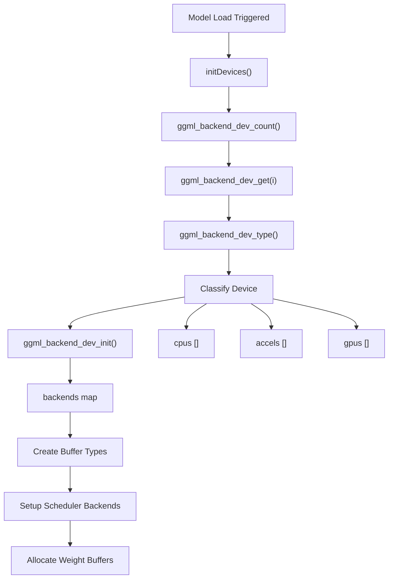
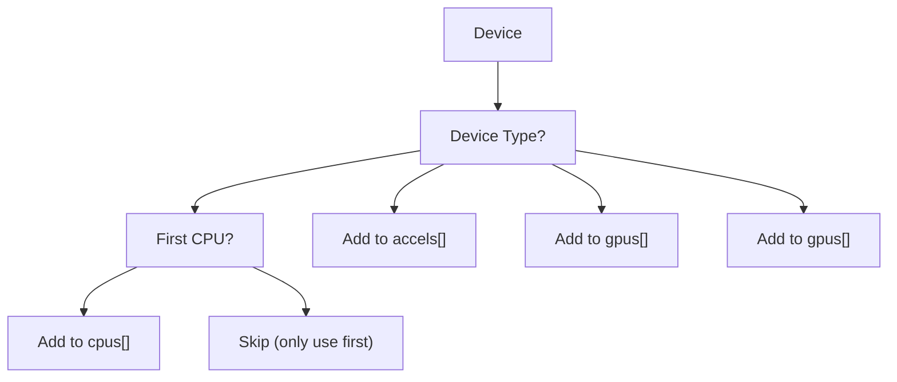
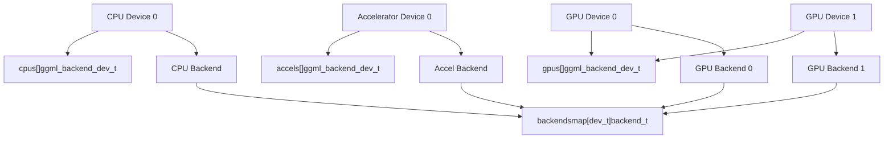
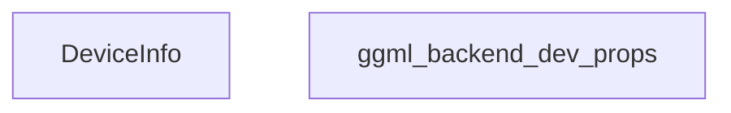
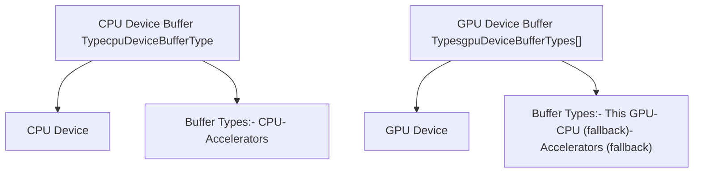
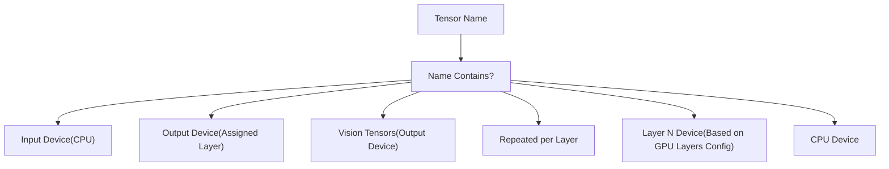
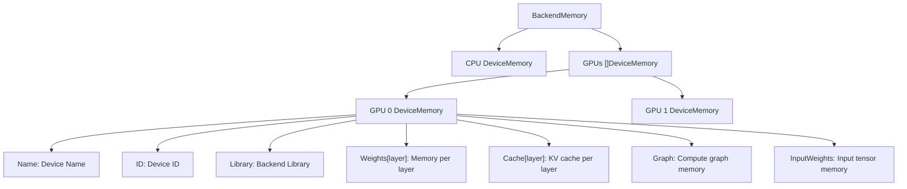
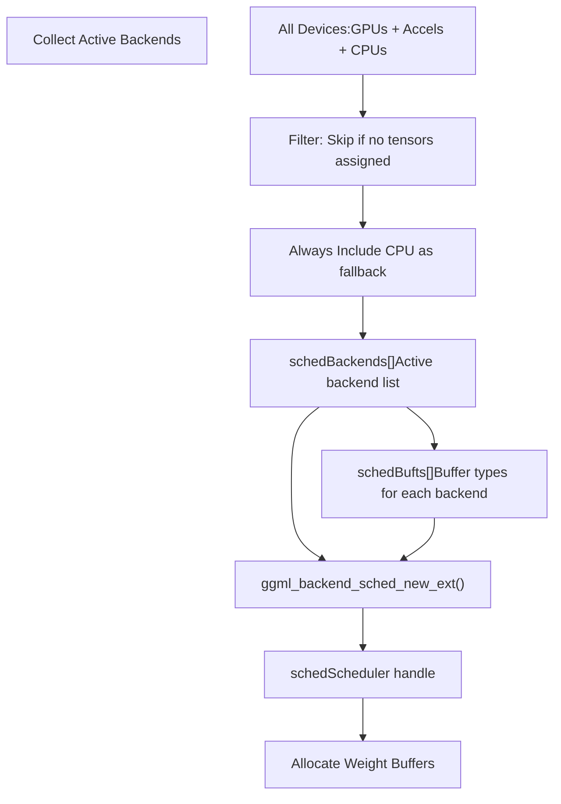
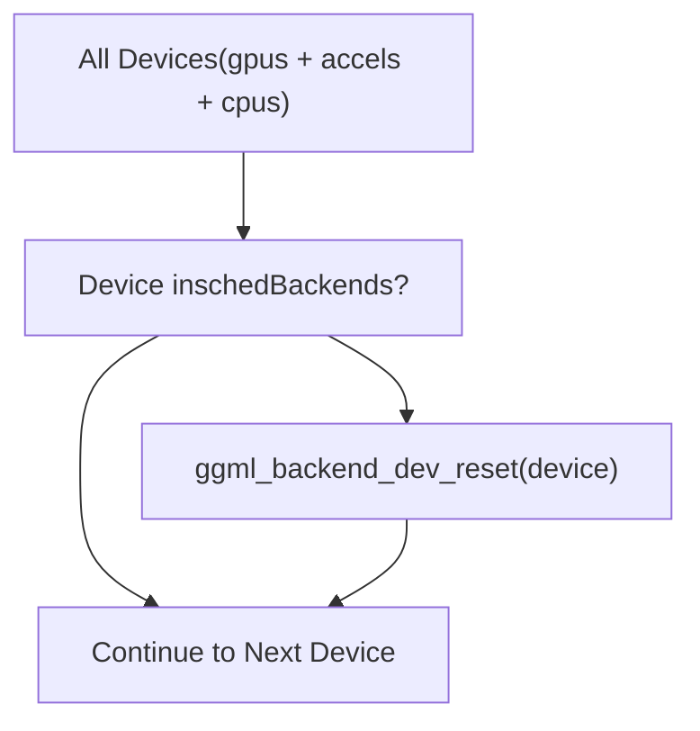
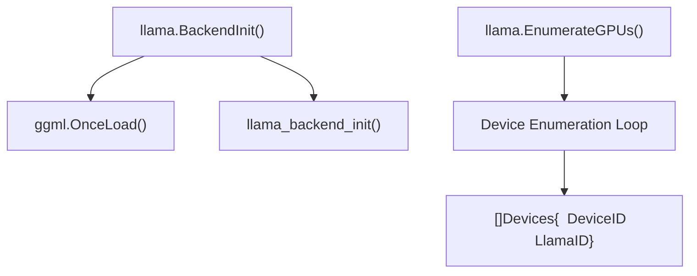

# GPU 发现与后端加载

相关源文件

-   [integration/embed\_test.go](https://github.com/ollama/ollama/blob/562c76d7/integration/embed_test.go)
-   [kvcache/cache.go](https://github.com/ollama/ollama/blob/562c76d7/kvcache/cache.go)
-   [kvcache/causal.go](https://github.com/ollama/ollama/blob/562c76d7/kvcache/causal.go)
-   [kvcache/causal\_test.go](https://github.com/ollama/ollama/blob/562c76d7/kvcache/causal_test.go)
-   [kvcache/encoder.go](https://github.com/ollama/ollama/blob/562c76d7/kvcache/encoder.go)
-   [kvcache/wrapper.go](https://github.com/ollama/ollama/blob/562c76d7/kvcache/wrapper.go)
-   [llama/llama.go](https://github.com/ollama/ollama/blob/562c76d7/llama/llama.go)
-   [llama/sampling\_ext.cpp](https://github.com/ollama/ollama/blob/562c76d7/llama/sampling_ext.cpp)
-   [llama/sampling\_ext.h](https://github.com/ollama/ollama/blob/562c76d7/llama/sampling_ext.h)
-   [ml/backend.go](https://github.com/ollama/ollama/blob/562c76d7/ml/backend.go)
-   [ml/backend/ggml/ggml.go](https://github.com/ollama/ollama/blob/562c76d7/ml/backend/ggml/ggml.go)
-   [model/input/input.go](https://github.com/ollama/ollama/blob/562c76d7/model/input/input.go)
-   [model/model.go](https://github.com/ollama/ollama/blob/562c76d7/model/model.go)
-   [model/model\_test.go](https://github.com/ollama/ollama/blob/562c76d7/model/model_test.go)
-   [runner/llamarunner/cache.go](https://github.com/ollama/ollama/blob/562c76d7/runner/llamarunner/cache.go)
-   [runner/llamarunner/runner.go](https://github.com/ollama/ollama/blob/562c76d7/runner/llamarunner/runner.go)
-   [runner/ollamarunner/cache.go](https://github.com/ollama/ollama/blob/562c76d7/runner/ollamarunner/cache.go)
-   [runner/ollamarunner/cache\_test.go](https://github.com/ollama/ollama/blob/562c76d7/runner/ollamarunner/cache_test.go)
-   [runner/ollamarunner/runner.go](https://github.com/ollama/ollama/blob/562c76d7/runner/ollamarunner/runner.go)
-   [server/internal/internal/backoff/backoff.go](https://github.com/ollama/ollama/blob/562c76d7/server/internal/internal/backoff/backoff.go)

## 目的与范围

本页解释 Ollama 如何在运行时发现可用的 GPU 设备并初始化后端系统。内容涵盖设备枚举流程、设备类型分类、后端初始化，以及用于计算图执行的缓冲区类型设置。有关安装 GPU 驱动与系统配置的信息，请参见 [Installation and Setup](/ollama/ollama/6.2-installation-and-setup)。有关 GPU 问题排查，请参见 [Troubleshooting and Performance](/ollama/ollama/6.4-troubleshooting-and-performance)。

## 概览

Ollama 使用 GGML（Georgi Gerganov Machine Learning）作为模型执行的主要后端。在初始化期间，系统会：

1.  枚举所有可用计算设备（CPU、GPU、加速器）
2.  按类型对设备分类（CPU、GPU、IGPU、ACCEL）
3.  为每个设备初始化后端
4.  创建内存分配所需的缓冲区类型
5.  使用可用后端配置计算图调度器

该过程在每次模型加载时执行一次，并决定推理将使用哪类硬件。


来源: [ml/backend/ggml/ggml.go47-69](https://github.com/ollama/ollama/blob/562c76d7/ml/backend/ggml/ggml.go#L47-L69) [ml/backend/ggml/ggml.go123-449](https://github.com/ollama/ollama/blob/562c76d7/ml/backend/ggml/ggml.go#L123-L449)

## 设备发现流程

### 设备枚举

设备发现从 `initDevices` 函数开始。该函数在 GGML 后端首次初始化时调用一次，并通过 `sync.OnceFunc` 确保在进程生命周期中仅执行一次。

> **[Mermaid sequence]**
> *(图表结构无法解析)*

枚举流程会遍历 GGML 库检测到的全部设备：

| GGML 函数 | 用途 |
| --- | --- |
| `ggml_backend_dev_count()` | 返回可用设备总数 |
| `ggml_backend_dev_get(i)` | 获取索引 `i` 对应设备的句柄 |
| `ggml_backend_dev_type(d)` | 返回设备 `d` 的类型分类 |
| `ggml_backend_dev_init(d, params)` | 初始化设备 `d` 的后端 |

来源: [ml/backend/ggml/ggml.go47-69](https://github.com/ollama/ollama/blob/562c76d7/ml/backend/ggml/ggml.go#L47-L69)

### 设备类型分类

设备会被划分为四类，并分别存储在独立的全局切片中：


**设备类型特性：**

| 类型 | 描述 | 存储 | 备注 |
| --- | --- | --- | --- |
| `GGML_BACKEND_DEVICE_TYPE_CPU` | CPU 设备 | `cpus []C.ggml_backend_dev_t` | 仅存储第一个 CPU 设备 |
| `GGML_BACKEND_DEVICE_TYPE_ACCEL` | 加速器（例如 Apple Neural Engine） | `accels []C.ggml_backend_dev_t` | 存储所有加速器设备 |
| `GGML_BACKEND_DEVICE_TYPE_GPU` | 独立 GPU | `gpus []C.ggml_backend_dev_t` | NVIDIA、AMD、Intel 独立显卡 |
| `GGML_BACKEND_DEVICE_TYPE_IGPU` | 集成 GPU | `gpus []C.ggml_backend_dev_t` | 集成显卡（与 GPU 共用同一存储） |

**重要实现细节：** 即使检测到多个 CPU 设备，也只使用第一个 CPU 设备。该逻辑由 [ml/backend/ggml/ggml.go](https://github.com/ollama/ollama/blob/562c76d7/ml/backend/ggml/ggml.go) 第 56-59 行的条件处理。

来源: [ml/backend/ggml/ggml.go54-65](https://github.com/ollama/ollama/blob/562c76d7/ml/backend/ggml/ggml.go#L54-L65)

## 后端初始化

### 按设备创建后端

对于每个已发现设备，系统都会初始化一个后端并存入全局映射：

```
backends[d] = C.ggml_backend_dev_init(d, nil)
```
`backends` 映射可从设备句柄快速查到其初始化后的后端：


该映射在后端整个生命周期内都会被使用，以便在计算操作中访问已初始化后端。

来源: [ml/backend/ggml/ggml.go42-69](https://github.com/ollama/ollama/blob/562c76d7/ml/backend/ggml/ggml.go#L42-L69)

## 设备属性与信息

### 查询设备信息

设备属性通过 `ggml_backend_dev_get_props` 与 `ggml_backend_dev_memory` 获取：


`BackendDevices()` 方法会返回所有 GPU 的设备信息：

**设备信息流程：**

1.  遍历 `gpus` 切片
2.  跳过当前模型未使用的设备（若模型已加载）
3.  调用 `ggml_backend_dev_get_props()` 获取静态属性
4.  调用 `ggml_backend_dev_memory()` 获取当前内存状态
5.  使用全部属性填充 `DeviceInfo` 结构体

来源: [ml/backend/ggml/ggml.go694-739](https://github.com/ollama/ollama/blob/562c76d7/ml/backend/ggml/ggml.go#L694-L739) [llama/llama.go72-94](https://github.com/ollama/ollama/blob/562c76d7/llama/llama.go#L72-L94)

## 缓冲区类型与内存分配

### 缓冲区类型层级

缓冲区类型决定了张量在内存中的分配位置与方式。系统会为不同设备类别创建独立的缓冲区类型：


**缓冲区类型选择策略：**

系统会为每类设备创建按优先级排序的缓冲区类型列表：

| 设备类别 | 主缓冲区类型 | 回退缓冲区类型 |
| --- | --- | --- |
| CPU | CPU 设备缓冲区 | 加速器缓冲区 |
| GPU N | GPU N 设备缓冲区 | CPU 设备缓冲区、加速器缓冲区 |

这种回退机制可确保当张量无法在主设备分配时，可以回退到 CPU 或加速器内存。

来源: [ml/backend/ggml/ggml.go157-198](https://github.com/ollama/ollama/blob/562c76d7/ml/backend/ggml/ggml.go#L157-L198)

### 张量到设备的分配

张量会依据其名称与层索引分配到设备：


**层分配逻辑：**

`assignLayer` 函数会基于 `GPULayers` 配置决定每一层由哪个设备处理：

```
assignLayer := func(layer int) deviceBufferType {    for _, p := range params.GPULayers {        for _, l := range p.Layers {            if l == layer {                // Find GPU with matching DeviceID                return gpuDeviceBufferTypes[i]            }        }    }    return cpuDeviceBufferType}
```
来源: [ml/backend/ggml/ggml.go203-343](https://github.com/ollama/ollama/blob/562c76d7/ml/backend/ggml/ggml.go#L203-L343)

### 内存跟踪

在创建张量时，系统会按设备与层跟踪内存使用：


内存在创建张量时进行统计：

```
size := pad(C.ggml_backend_buft_get_alloc_size(bt, tt),             C.ggml_backend_buft_get_alignment(bt))if layer == -1 {    requiredMemory.InputWeights += uint64(size)} else {    btDeviceMemory[bt].Weights[layer] += uint64(size)}
```
来源: [ml/backend/ggml/ggml.go149-198](https://github.com/ollama/ollama/blob/562c76d7/ml/backend/ggml/ggml.go#L149-L198) [ml/backend/ggml/ggml.go280-287](https://github.com/ollama/ollama/blob/562c76d7/ml/backend/ggml/ggml.go#L280-L287)

## 计算图调度器设置

### 调度器后端配置

在所有张量创建完成后，系统会使用将要参与执行的后端来配置计算图调度器：


**调度器创建过程：**

1.  **后端收集** - 按优先级顺序遍历设备：GPU、加速器、CPU
2.  **张量检查** - 对每个后端检查是否至少分配了一个张量（CPU 除外，CPU 总是包含）
3.  **缓冲区类型提取** - 获取每个后端的默认缓冲区类型
4.  **调度器初始化** - 使用收集的后端与缓冲区类型调用 `ggml_backend_sched_new_ext()`
5.  **线程配置** - 对 CPU 后端设置线程数

来源: [ml/backend/ggml/ggml.go354-391](https://github.com/ollama/ollama/blob/562c76d7/ml/backend/ggml/ggml.go#L354-L391)

### 权重缓冲区分配

调度器创建后，会为每个上下文分配权重缓冲区：

> **[Mermaid sequence]**
> *(图表结构无法解析)*

**分配失败处理：**

如果缓冲区分配失败，系统会：

1.  释放此前已分配的所有缓冲区
2.  释放所有已创建的上下文
3.  触发带内存需求信息的 `ml.ErrNoMem` 错误 panic

这可确保在内存不足时进行干净失败。

来源: [ml/backend/ggml/ggml.go394-420](https://github.com/ollama/ollama/blob/562c76d7/ml/backend/ggml/ggml.go#L394-L420)

## 设备重置与清理

### 未使用设备清理

调度器设置完成后，未使用设备会被重置，以释放其可能已分配的资源：


该清理步骤可确保当前模型未使用的设备不会不必要地占用资源。

来源: [ml/backend/ggml/ggml.go629-638](https://github.com/ollama/ollama/blob/562c76d7/ml/backend/ggml/ggml.go#L629-L638)

## 与 LLaMA Runner 的集成

LLaMA runner 为 GPU 枚举提供了更高层接口：


`EnumerateGPUs()` 函数会返回一组 GPU 设备列表，同时包含：

-   `DeviceID`：包含库名与设备 ID 字符串
-   `LlamaID`：设备在 GGML 枚举中的索引

这些信息由调度器用于配置模型执行应使用哪些 GPU。

来源: [llama/llama.go62-65](https://github.com/ollama/ollama/blob/562c76d7/llama/llama.go#L62-L65) [llama/llama.go72-94](https://github.com/ollama/ollama/blob/562c76d7/llama/llama.go#L72-L94)

## 总结

Ollama 中的 GPU 发现与后端加载流程遵循多阶段初始化：

| 阶段 | 关键函数 | 目的 |
| --- | --- | --- |
| **设备发现** | `initDevices()`, `ggml_backend_dev_count()`, `ggml_backend_dev_get()` | 枚举所有计算设备 |
| **分类** | `ggml_backend_dev_type()` | 将设备归类为 CPU、ACCEL、GPU、IGPU |
| **后端初始化** | `ggml_backend_dev_init()` | 为每个设备初始化后端 |
| **缓冲区类型** | `ggml_backend_dev_buffer_type()` | 创建内存分配策略 |
| **张量分配** | `createTensor()`, `assignLayer()` | 将张量分配到特定设备 |
| **调度器设置** | `ggml_backend_sched_new_ext()` | 配置计算图调度器 |
| **内存分配** | `ggml_backend_alloc_ctx_tensors_from_buft()` | 分配权重缓冲区 |

该架构使 Ollama 能够通过统一的 GGML 后端接口，在不同平台（macOS 的 Metal、NVIDIA 的 CUDA、AMD 的 ROCm、Intel 的 Vulkan）上高效利用可用硬件。

来源: [ml/backend/ggml/ggml.go47-449](https://github.com/ollama/ollama/blob/562c76d7/ml/backend/ggml/ggml.go#L47-L449) [llama/llama.go62-94](https://github.com/ollama/ollama/blob/562c76d7/llama/llama.go#L62-L94)
