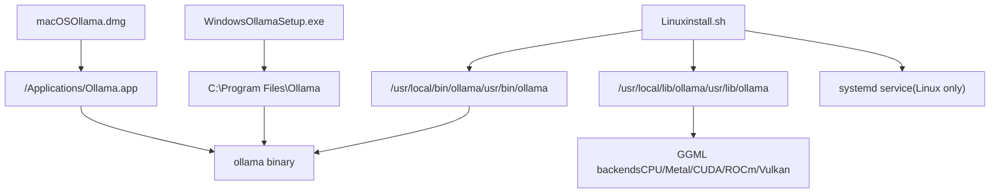
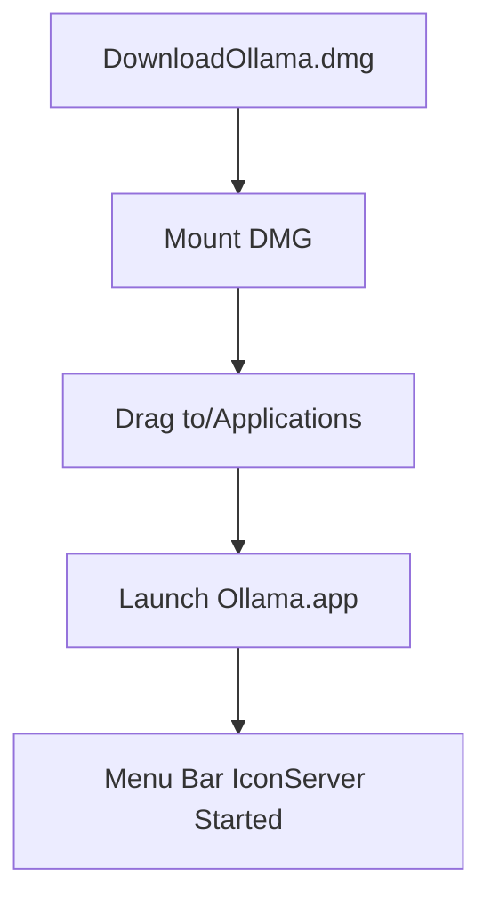
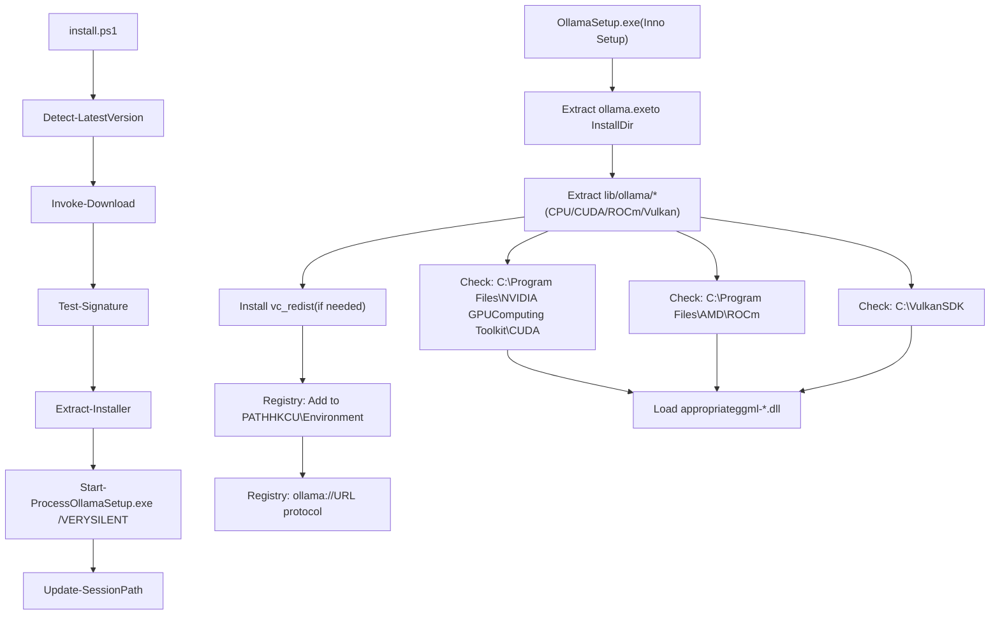
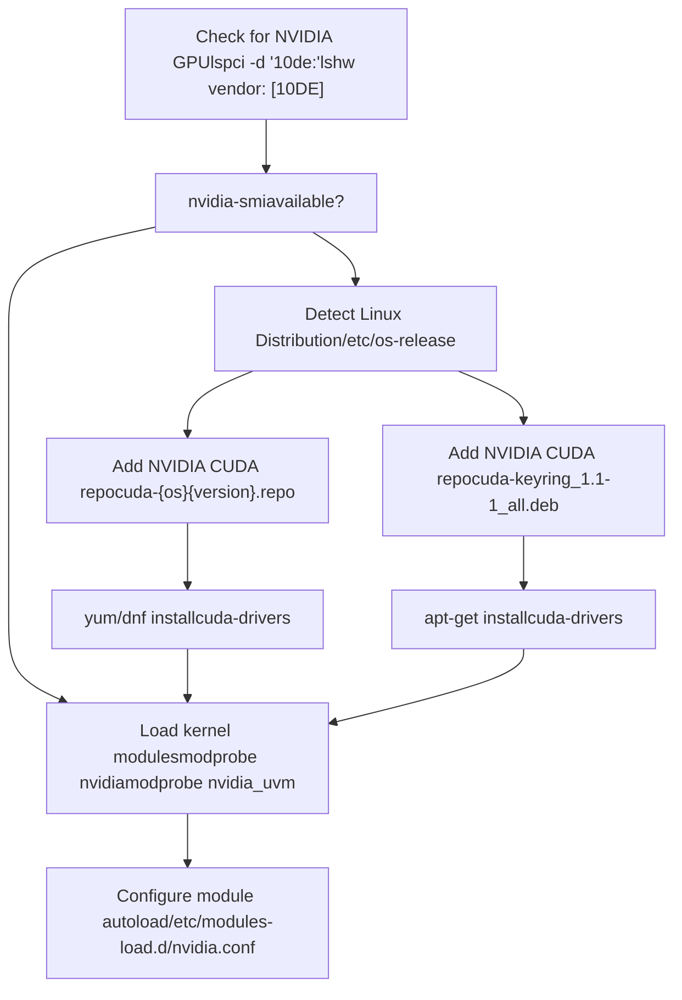
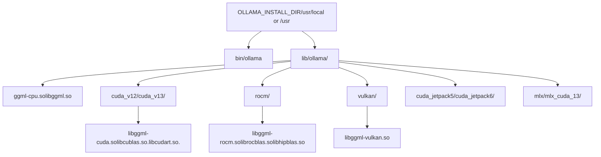

# 安装与设置

相关源文件

-   [.github/workflows/release.yaml](https://github.com/ollama/ollama/blob/562c76d7/.github/workflows/release.yaml)
-   [.github/workflows/test-install.yaml](https://github.com/ollama/ollama/blob/562c76d7/.github/workflows/test-install.yaml)
-   [.github/workflows/test.yaml](https://github.com/ollama/ollama/blob/562c76d7/.github/workflows/test.yaml)
-   [Dockerfile](https://github.com/ollama/ollama/blob/562c76d7/Dockerfile)
-   [README.md](https://github.com/ollama/ollama/blob/562c76d7/README.md?plain=1)
-   [app/ollama.iss](https://github.com/ollama/ollama/blob/562c76d7/app/ollama.iss)
-   [docs/README.md](https://github.com/ollama/ollama/blob/562c76d7/docs/README.md?plain=1)
-   [docs/api.md](https://github.com/ollama/ollama/blob/562c76d7/docs/api.md?plain=1)
-   [docs/development.md](https://github.com/ollama/ollama/blob/562c76d7/docs/development.md?plain=1)
-   [docs/images/ollama-keys.png](https://github.com/ollama/ollama/blob/562c76d7/docs/images/ollama-keys.png)
-   [docs/images/signup.png](https://github.com/ollama/ollama/blob/562c76d7/docs/images/signup.png)
-   [scripts/build\_darwin.sh](https://github.com/ollama/ollama/blob/562c76d7/scripts/build_darwin.sh)
-   [scripts/build\_linux.sh](https://github.com/ollama/ollama/blob/562c76d7/scripts/build_linux.sh)
-   [scripts/build\_windows.ps1](https://github.com/ollama/ollama/blob/562c76d7/scripts/build_windows.ps1)
-   [scripts/deduplicate\_cuda\_libs.sh](https://github.com/ollama/ollama/blob/562c76d7/scripts/deduplicate_cuda_libs.sh)
-   [scripts/install.ps1](https://github.com/ollama/ollama/blob/562c76d7/scripts/install.ps1)
-   [scripts/install.sh](https://github.com/ollama/ollama/blob/562c76d7/scripts/install.sh)

本页介绍如何从预构建二进制文件在系统上安装 Ollama，并完成首次使用配置。内容包括平台特定安装流程、GPU 驱动设置与基础配置。关于从源码构建，请参见 [Building from Source](/ollama/ollama/8.1-building-from-source)。关于 Docker 部署，请参见 [Docker Deployment](/ollama/ollama/6.3-docker-deployment)。关于 GPU 后端选择与加载机制，请参见 [GPU Discovery and Backend Loading](/ollama/ollama/6.1-gpu-discovery-and-backend-loading)。

## 安装方式概览

Ollama 提供平台特定安装程序，打包了完整运行时，包括服务器二进制、ML 后端和加速库。


**来源：** [README.md11-25](https://github.com/ollama/ollama/blob/562c76d7/README.md?plain=1#L11-L25) [scripts/install.sh99-116](https://github.com/ollama/ollama/blob/562c76d7/scripts/install.sh#L99-L116) [docs/development.md172-179](https://github.com/ollama/ollama/blob/562c76d7/docs/development.md?plain=1#L172-L179)

## macOS 安装

### 安装流程

macOS 使用标准 DMG 安装程序，包含所有必需组件。

| 组件 | 说明 |
| --- | --- |
| **Download** | [https://ollama.com/download/Ollama.dmg](https://ollama.com/download/Ollama.dmg) |
| **Installation** | 将 Ollama.app 拖到 /Applications |
| **GPU Support** | Metal（Apple Silicon 内建） |
| **Binary Location** | /Applications/Ollama.app/Contents/MacOS/ollama |

macOS 应用内置 Apple Silicon 的 Metal 加速后端。对于 Intel Mac，除非额外配置其他后端，否则将使用纯 CPU 推理。


### 验证

```
# Verify installationwhich ollama# /Applications/Ollama.app/Contents/MacOS/ollama # Test serverollama run gemma3:1b
```
**来源：** [README.md11-13](https://github.com/ollama/ollama/blob/562c76d7/README.md?plain=1#L11-L13) [docs/development.md18-20](https://github.com/ollama/ollama/blob/562c76d7/docs/development.md?plain=1#L18-L20)

## Windows 安装

### 安装方式

Windows 支持两种安装方式：

1.  **PowerShell 安装脚本**（推荐）
2.  **可执行安装包**（OllamaSetup.exe）

#### PowerShell 安装脚本

自动化 PowerShell 脚本支持版本控制与卸载：

```
# Quick install (latest version)irm https://ollama.com/install.ps1 | iex # Specific version$env:OLLAMA_VERSION="0.5.7"; irm https://ollama.com/install.ps1 | iex # Custom install directory$env:OLLAMA_INSTALL_DIR="D:\Ollama"; irm https://ollama.com/install.ps1 | iex # Uninstall$env:OLLAMA_UNINSTALL=1; irm https://ollama.com/install.ps1 | iex
```
**来源：** [scripts/install.ps11-39](https://github.com/ollama/ollama/blob/562c76d7/scripts/install.ps1#L1-L39) [README.md22-24](https://github.com/ollama/ollama/blob/562c76d7/README.md?plain=1#L22-L24)

#### 可执行安装包

Inno Setup 安装器提供图形化安装体验：

| 组件 | 说明 |
| --- | --- |
| **Download** | [https://ollama.com/download/OllamaSetup.exe](https://ollama.com/download/OllamaSetup.exe) |
| **Installation Path** | %LOCALAPPDATA%\\Programs\\Ollama |
| **Service** | 自动启动应用（非 Windows 服务） |
| **GPU Support** | CUDA, ROCm, Vulkan |

安装器会：

1.  将二进制解压到 `%LOCALAPPDATA%\Programs\Ollama`
2.  将 ollama 添加到用户 PATH（HKCU\\Environment）
3.  通过开始菜单快捷方式配置自动启动
4.  注册 `ollama://` URL 协议处理器

**来源：** [app/ollama.iss19-46](https://github.com/ollama/ollama/blob/562c76d7/app/ollama.iss#L19-L46) [app/ollama.iss160-167](https://github.com/ollama/ollama/blob/562c76d7/app/ollama.iss#L160-L167)

### GPU 后端安装

Windows 支持多种 GPU 后端，需分别安装：

| 后端 | GPU 厂商 | 安装链接 |
| --- | --- | --- |
| **CUDA 12** | NVIDIA | [https://developer.download.nvidia.com/compute/cuda/12.8.0/local\_installers/cuda\_12.8.0\_571.96\_windows.exe](https://developer.download.nvidia.com/compute/cuda/12.8.0/local_installers/cuda_12.8.0_571.96_windows.exe) |
| **CUDA 13** | NVIDIA | [https://developer.download.nvidia.com/compute/cuda/13.0.0/local\_installers/cuda\_13.0.0\_windows.exe](https://developer.download.nvidia.com/compute/cuda/13.0.0/local_installers/cuda_13.0.0_windows.exe) |
| **ROCm 6** | AMD | [https://download.amd.com/developer/eula/rocm-hub/AMD-Software-PRO-Edition-24.Q4-WinSvr2022-For-HIP.exe](https://download.amd.com/developer/eula/rocm-hub/AMD-Software-PRO-Edition-24.Q4-WinSvr2022-For-HIP.exe) |
| **Vulkan** | AMD/Intel | [https://sdk.lunarg.com/sdk/download/1.4.321.1/windows/vulkansdk-windows-X64-1.4.321.1.exe](https://sdk.lunarg.com/sdk/download/1.4.321.1/windows/vulkansdk-windows-X64-1.4.321.1.exe) |

**Windows 安装流程：**


**来源：** [scripts/install.ps1130-178](https://github.com/ollama/ollama/blob/562c76d7/scripts/install.ps1#L130-L178) [app/ollama.iss90-108](https://github.com/ollama/ollama/blob/562c76d7/app/ollama.iss#L90-L108) [.github/workflows/release.yaml75-119](https://github.com/ollama/ollama/blob/562c76d7/.github/workflows/release.yaml#L75-L119)

### Windows ARM

Windows ARM 系统不支持 GPU 加速。ARM64 安装包仅提供 CPU 推理。

**来源：** [README.md15-17](https://github.com/ollama/ollama/blob/562c76d7/README.md?plain=1#L15-L17) [docs/development.md42-91](https://github.com/ollama/ollama/blob/562c76d7/docs/development.md?plain=1#L42-L91)

## Linux 安装

### 自动安装脚本

Linux 安装使用 shell 脚本检测系统配置并安装相应组件。该脚本同样可用于 macOS。

```
# Linux and macOScurl -fsSL https://ollama.com/install.sh | sh
```
**脚本函数流程：**

```mermaid
flowchart TD
    download_and_extract["download_and_extract()curl | zstd -d | tar"]
    configure_systemd["configure_systemd()Create service"]
    install_cuda_driver_yum["install_cuda_driver_yum()"]
    install_cuda_driver_apt["install_cuda_driver_apt()"]
    available["available()command -v"]
    require["require()Check tools"]
    check_gpu["check_gpu()lspci/lshw/nvidia-smi"]
    main["main()"]
    OS["OS=$(uname -s)Darwin or Linux"]
    ARCH["ARCH=$(uname -m)x86_64→amd64aarch64→arm64"]
    IS_WSL2["KERN=$(uname -r)icrosoftWSL2"]
    JetPack["test -f/etc/nv_tegra_release"]
    BINDIR["for BINDIR in/usr/local/bin/usr/bin /bin"]
    INSTALL_DIR["OLLAMA_INSTALL_DIR=dirname BINDIR"]
    Download["download_and_extractollama-linux-$ARCH"]
    Symlink["ln -s$INSTALL_DIR/ollama$BINDIR/ollama"]
    check_nvidia["check_gpu lspci nvidiaVendor ID: 10de"]
    check_amd["check_gpu lspci amdgpuVendor ID: 1002"]
    cuda_yum["install_cuda_driver_yumrhel/centos/fedora"]
    cuda_apt["install_cuda_driver_aptubuntu/debian"]
    rocm["download_and_extractollama-linux-$ARCH-rocm"]
    systemd_check["available systemctl"]
    useradd["useradd -r -s /bin/false-U -m -d /usr/share/ollamaollama"]
    usermod["usermod -a -Grender,video,ollama"]
    service["cat > /etc/systemd/system/ollama.service"]
    enable["systemctl daemon-reloadsystemctl enable ollamasystemctl restart ollama"]

    main --> OS
    OS --> ARCH
    ARCH --> IS_WSL2
    IS --> WSL2_JetPack
    JetPack --> BINDIR
    BINDIR --> INSTALL_DIR
    INSTALL --> DIR_Download
    Download --> Symlink
    Symlink --> check_nvidia
    Symlink --> check_amd
    check --> nvidia_cuda_yum
    check --> nvidia_cuda_apt
    check --> amd_rocm
    cuda --> yum_systemd_check
    cuda --> apt_systemd_check
    rocm --> systemd_check
    systemd --> check_useradd
    useradd --> usermod
    usermod --> service
    service --> enable
```


**来源：** [scripts/install.sh7-453](https://github.com/ollama/ollama/blob/562c76d7/scripts/install.sh#L7-L453) [README.md15-32](https://github.com/ollama/ollama/blob/562c76d7/README.md?plain=1#L15-L32)

### 安装路径

安装脚本会根据 PATH 配置决定安装路径：

| 路径组件 | 默认位置 | 备用位置 | 代码参考 |
| --- | --- | --- | --- |
| **Binary** | /usr/local/bin/ollama | /usr/bin/ollama | [scripts/install.sh159-162](https://github.com/ollama/ollama/blob/562c76d7/scripts/install.sh#L159-L162) |
| **Libraries** | /usr/local/lib/ollama | /usr/lib/ollama | [scripts/install.sh163-171](https://github.com/ollama/ollama/blob/562c76d7/scripts/install.sh#L163-L171) |
| **Service** | /etc/systemd/system/ollama.service | N/A | [scripts/install.sh214-230](https://github.com/ollama/ollama/blob/562c76d7/scripts/install.sh#L214-L230) |
| **Data** | /usr/share/ollama | N/A | [scripts/install.sh200](https://github.com/ollama/ollama/blob/562c76d7/scripts/install.sh#L200-L200) |

```
# Script logic for determining BINDIR (lines 159-162)for BINDIR in /usr/local/bin /usr/bin /bin; do    echo $PATH | grep -q $BINDIR && break || continuedoneOLLAMA_INSTALL_DIR=$(dirname ${BINDIR}) # Installation commands (lines 169-171)$SUDO install -o0 -g0 -m755 -d $BINDIR$SUDO install -o0 -g0 -m755 -d "$OLLAMA_INSTALL_DIR/lib/ollama"download_and_extract "https://ollama.com/download" "$OLLAMA_INSTALL_DIR" "ollama-linux-${ARCH}"
```
**macOS 安装路径：**

| 路径组件 | 位置 |
| --- | --- |
| **Application** | /Applications/Ollama.app |
| **Binary** | /Applications/Ollama.app/Contents/Resources/ollama |
| **Symlink** | /usr/local/bin/ollama |
| **Data** | ~/.ollama |

**来源：** [scripts/install.sh159-171](https://github.com/ollama/ollama/blob/562c76d7/scripts/install.sh#L159-L171) [scripts/install.sh66-89](https://github.com/ollama/ollama/blob/562c76d7/scripts/install.sh#L66-L89)

### 架构检测

安装器支持 x86\_64 与 ARM64 架构：

```
# From install.sh lines 35-40ARCH=$(uname -m)case "$ARCH" in    x86_64) ARCH="amd64" ;;    aarch64|arm64) ARCH="arm64" ;;    *) error "Unsupported architecture: $ARCH" ;;esac
```
下载源为 `https://ollama.com/download/ollama-linux-${ARCH}.tar.zst`（旧版本使用 `.tgz`）。

**下载函数（第 129-157 行）：**

```
download_and_extract() {    local url_base="$1"    local dest_dir="$2"    local filename="$3"     # Try .tar.zst first (newer format)    if curl --fail --silent --head --location "${url_base}/${filename}.tar.zst${VER_PARAM}" >/dev/null 2>&1; then        if ! available zstd; then            error "This version requires zstd for extraction..."        fi        curl ... | zstd -d | $SUDO tar -xf - -C "${dest_dir}"    else        # Fall back to .tgz for older versions        curl ... | $SUDO tar -xzf - -C "${dest_dir}"    fi}
```
**来源：** [scripts/install.sh35-40](https://github.com/ollama/ollama/blob/562c76d7/scripts/install.sh#L35-L40) [scripts/install.sh129-157](https://github.com/ollama/ollama/blob/562c76d7/scripts/install.sh#L129-L157)

### WSL2 支持

脚本会检测 WSL2，并据此调整安装行为：

```
KERN=$(uname -r)case "$KERN" in    *icrosoft*WSL2 | *icrosoft*wsl2) IS_WSL2=true;;    *icrosoft) error "Microsoft WSL1 is not currently supported" ;;esac
```
在 WSL2 上：

-   GPU 支持需要 NVIDIA GPU 透传
-   会检查 `nvidia-smi` 以验证 CUDA 可用性
-   不会尝试安装驱动
-   systemd 可能需要手动启用

**来源：** [scripts/install.sh39-46](https://github.com/ollama/ollama/blob/562c76d7/scripts/install.sh#L39-L46) [scripts/install.sh194-202](https://github.com/ollama/ollama/blob/562c76d7/scripts/install.sh#L194-L202)

### NVIDIA JetPack 系统

对于 NVIDIA Jetson 设备，脚本会下载额外软件包：

```
# From install.sh lines 178-187if [ -f /etc/nv_tegra_release ] ; then    if grep R36 /etc/nv_tegra_release > /dev/null ; then        download_and_extract "https://ollama.com/download" "$OLLAMA_INSTALL_DIR" "ollama-linux-${ARCH}-jetpack6"    elif grep R35 /etc/nv_tegra_release > /dev/null ; then        download_and_extract "https://ollama.com/download" "$OLLAMA_INSTALL_DIR" "ollama-linux-${ARCH}-jetpack5"    else        warning "Unsupported JetPack version detected. GPU may not be supported"    fifi
```
对应 Dockerfile 构建阶段：

-   **JetPack 5:** [Dockerfile104-114](https://github.com/ollama/ollama/blob/562c76d7/Dockerfile#L104-L114)
-   **JetPack 6:** [Dockerfile116-126](https://github.com/ollama/ollama/blob/562c76d7/Dockerfile#L116-L126)

**来源：** [scripts/install.sh178-187](https://github.com/ollama/ollama/blob/562c76d7/scripts/install.sh#L178-L187) [scripts/install.sh264-269](https://github.com/ollama/ollama/blob/562c76d7/scripts/install.sh#L264-L269) [Dockerfile104-126](https://github.com/ollama/ollama/blob/562c76d7/Dockerfile#L104-L126)

## GPU 驱动安装

### NVIDIA CUDA 驱动

安装脚本会自动检测 NVIDIA GPU，并在未安装时安装 CUDA 驱动。


#### 发行版特定安装

**Ubuntu/Debian（`install_cuda_driver_apt` 函数，第 358-382 行）：**

```
install_cuda_driver_apt() {    status 'Installing NVIDIA repository...'    if curl -I --silent --fail --location "https://developer.download.nvidia.com/compute/cuda/repos/$1$2/$(uname -m | sed -e 's/aarch64/sbsa/')/cuda-keyring_1.1-1_all.deb" >/dev/null ; then        curl -fsSL -o $TEMP_DIR/cuda-keyring.deb https://developer.download.nvidia.com/compute/cuda/repos/$1$2/$(uname -m | sed -e 's/aarch64/sbsa/')/cuda-keyring_1.1-1_all.deb    else        error $CUDA_REPO_ERR_MSG    fi     status 'Installing CUDA driver...'    $SUDO dpkg -i $TEMP_DIR/cuda-keyring.deb    $SUDO apt-get update     [ -n "$SUDO" ] && SUDO_E="$SUDO -E" || SUDO_E=    DEBIAN_FRONTEND=noninteractive $SUDO_E apt-get -y install cuda-drivers -q}
```
**RHEL/CentOS/Fedora（`install_cuda_driver_yum` 函数，第 318-354 行）：**

```
install_cuda_driver_yum() {    status 'Installing NVIDIA repository...'        case $PACKAGE_MANAGER in        yum)            $SUDO $PACKAGE_MANAGER -y install yum-utils            if curl -I --silent --fail --location "https://developer.download.nvidia.com/compute/cuda/repos/$1$2/$(uname -m | sed -e 's/aarch64/sbsa/')/cuda-$1$2.repo" >/dev/null ; then                $SUDO $PACKAGE_MANAGER-config-manager --add-repo https://developer.download.nvidia.com/compute/cuda/repos/$1$2/$(uname -m | sed -e 's/aarch64/sbsa/')/cuda-$1$2.repo            fi            ;;        dnf)            if curl -I --silent --fail --location "https://developer.download.nvidia.com/compute/cuda/repos/$1$2/$(uname -m | sed -e 's/aarch64/sbsa/')/cuda-$1$2.repo" >/dev/null ; then                $SUDO $PACKAGE_MANAGER config-manager --add-repo https://developer.download.nvidia.com/compute/cuda/repos/$1$2/$(uname -m | sed -e 's/aarch64/sbsa/')/cuda-$1$2.repo            fi            ;;    esac     status 'Installing CUDA driver...'    $SUDO $PACKAGE_MANAGER -y install cuda-drivers}
```
**发行版特定调用（第 404-414 行）：**

```
if ! check_gpu nvidia-smi || [ -z "$(nvidia-smi | grep -o "CUDA Version: [0-9]*\.[0-9]*")" ]; then    case $OS_NAME in        centos|rhel) install_cuda_driver_yum 'rhel' $(echo $OS_VERSION | cut -d '.' -f 1) ;;        rocky) install_cuda_driver_yum 'rhel' $(echo $OS_VERSION | cut -c1) ;;        fedora) [ $OS_VERSION -lt '39' ] && install_cuda_driver_yum $OS_NAME $OS_VERSION || install_cuda_driver_yum $OS_NAME '39';;        amzn) install_cuda_driver_yum 'fedora' '37' ;;        debian) install_cuda_driver_apt $OS_NAME $OS_VERSION ;;        ubuntu) install_cuda_driver_apt $OS_NAME $(echo $OS_VERSION | sed 's/\.//') ;;        *) exit ;;    esacfi
```
**来源：** [scripts/install.sh318-354](https://github.com/ollama/ollama/blob/562c76d7/scripts/install.sh#L318-L354) [scripts/install.sh358-382](https://github.com/ollama/ollama/blob/562c76d7/scripts/install.sh#L358-L382) [scripts/install.sh404-414](https://github.com/ollama/ollama/blob/562c76d7/scripts/install.sh#L404-L414)

### AMD ROCm 支持

对于 AMD GPU，脚本会下载 ROCm 专用库：

```
if check_gpu lspci amdgpu || check_gpu lshw amdgpu; then    download_and_extract "https://ollama.com/download" \        "$OLLAMA_INSTALL_DIR" \        "ollama-linux-${ARCH}-rocm"fi
```
ROCm 驱动必须预先从 AMD 官方仓库安装。脚本仅添加 Ollama 的 ROCm 编译后端。

**来源：** [scripts/install.sh245-250](https://github.com/ollama/ollama/blob/562c76d7/scripts/install.sh#L245-L250)

### GPU 检测逻辑

脚本通过 `check_gpu()` 函数使用多种检测方式：

| 方法 | NVIDIA 检测 | AMD 检测 |
| --- | --- | --- |
| **lspci** | `lspci -d '10de:' | grep -q 'NVIDIA'` | `lspci -d '1002:' | grep -q 'AMD'` |
| **lshw** | `lshw -c display -numeric | grep 'vendor: .* [10DE]'` | `lshw -c display -numeric | grep 'vendor: .* [1002]'` |
| **nvidia-smi** | `nvidia-smi` 命令可用 | N/A |

```
# check_gpu function (lines 277-292)check_gpu() {    # Look for devices based on vendor ID for NVIDIA and AMD    case $1 in        lspci)            case $2 in                nvidia) available lspci && lspci -d '10de:' | grep -q 'NVIDIA' || return 1 ;;                amdgpu) available lspci && lspci -d '1002:' | grep -q 'AMD' || return 1 ;;            esac ;;        lshw)            case $2 in                nvidia) available lshw && $SUDO lshw -c display -numeric -disable network | grep -q 'vendor: .* \[10DE\]' || return 1 ;;                amdgpu) available lshw && $SUDO lshw -c display -numeric -disable network | grep -q 'vendor: .* \[1002\]' || return 1 ;;            esac ;;        nvidia-smi) available nvidia-smi || return 1 ;;    esac}
```
**来源：** [scripts/install.sh277-292](https://github.com/ollama/ollama/blob/562c76d7/scripts/install.sh#L277-L292)

### 内核模块加载

驱动安装后，必须加载内核模块：

```
# Load modules immediately (lines 416-424)if ! lsmod | grep -q nvidia || ! lsmod | grep -q nvidia_uvm; then    # Install kernel headers first    KERNEL_RELEASE="$(uname -r)"    case $OS_NAME in        rocky) $SUDO $PACKAGE_MANAGER -y install kernel-devel kernel-headers ;;        centos|rhel|amzn) $SUDO $PACKAGE_MANAGER -y install kernel-devel-$KERNEL_RELEASE kernel-headers-$KERNEL_RELEASE ;;        fedora) $SUDO $PACKAGE_MANAGER -y install kernel-devel-$KERNEL_RELEASE ;;        debian|ubuntu) $SUDO apt-get -y install linux-headers-$KERNEL_RELEASE ;;    esac     # DKMS build (if needed, lines 426-429)    NVIDIA_CUDA_VERSION=$($SUDO dkms status | awk -F: '/added/ { print $1 }')    if [ -n "$NVIDIA_CUDA_VERSION" ]; then        $SUDO dkms install $NVIDIA_CUDA_VERSION    fi     # Check for nouveau driver conflict (lines 431-434)    if lsmod | grep -q nouveau; then        status 'Reboot to complete NVIDIA CUDA driver install.'        exit 0    fi     # Load modules (lines 436-437)    $SUDO modprobe nvidia    $SUDO modprobe nvidia_uvmfi # Configure autoload on boot (lines 440-449)if available nvidia-persistenced; then    $SUDO touch /etc/modules-load.d/nvidia.conf    MODULES="nvidia nvidia-uvm"    for MODULE in $MODULES; do        if ! grep -qxF "$MODULE" /etc/modules-load.d/nvidia.conf; then            echo "$MODULE" | $SUDO tee -a /etc/modules-load.d/nvidia.conf > /dev/null        fi    donefi
```
如果加载了 `nouveau` 驱动，则需要重启以完成安装。

**来源：** [scripts/install.sh416-449](https://github.com/ollama/ollama/blob/562c76d7/scripts/install.sh#L416-L449)

## systemd 服务配置

### 服务文件创建

在使用 systemd 的 Linux 系统上，安装器会通过 `configure_systemd()` 函数创建服务文件：

```
# configure_systemd function (lines 197-248)configure_systemd() {    if ! id ollama >/dev/null 2>&1; then        status "Creating ollama user..."        $SUDO useradd -r -s /bin/false -U -m -d /usr/share/ollama ollama    fi    if getent group render >/dev/null 2>&1; then        status "Adding ollama user to render group..."        $SUDO usermod -a -G render ollama    fi    if getent group video >/dev/null 2>&1; then        status "Adding ollama user to video group..."        $SUDO usermod -a -G video ollama    fi     status "Adding current user to ollama group..."    $SUDO usermod -a -G ollama $(whoami)     status "Creating ollama systemd service..."    cat <<EOF | $SUDO tee /etc/systemd/system/ollama.service >/dev/null[Unit]Description=Ollama ServiceAfter=network-online.target [Service]ExecStart=$BINDIR/ollama serveUser=ollamaGroup=ollamaRestart=alwaysRestartSec=3Environment="PATH=$PATH" [Install]WantedBy=default.targetEOF    # ... service enable logic}
```
**来源：** [scripts/install.sh197-248](https://github.com/ollama/ollama/blob/562c76d7/scripts/install.sh#L197-L248)

### 用户与用户组设置

服务以专用 `ollama` 用户运行（在 `configure_systemd()` 函数中创建）：

```
# From lines 198-212if ! id ollama >/dev/null 2>&1; then    status "Creating ollama user..."    $SUDO useradd -r -s /bin/false -U -m -d /usr/share/ollama ollamafiif getent group render >/dev/null 2>&1; then    status "Adding ollama user to render group..."    $SUDO usermod -a -G render ollamafiif getent group video >/dev/null 2>&1; then    status "Adding ollama user to video group..."    $SUDO usermod -a -G video ollamafi status "Adding current user to ollama group..."$SUDO usermod -a -G ollama $(whoami)
```
| 用户/组 | 用途 |
| --- | --- |
| **ollama**（用户） | 服务运行用户，主目录：/usr/share/ollama |
| **render**（组） | 非 NVIDIA 设备的 GPU 访问 |
| **video**（组） | 视频设备访问 |
| **ollama**（组） | 模型文件访问权限 |

**来源：** [scripts/install.sh198-212](https://github.com/ollama/ollama/blob/562c76d7/scripts/install.sh#L198-L212)

### 服务管理

```
# Enable service (start on boot)systemctl enable ollama # Start service immediatelysystemctl start ollama # Check service statussystemctl status ollama # View logsjournalctl -u ollama -f
```
服务在崩溃后会自动重启（`Restart=always`，延迟 3 秒）。

**服务启动逻辑（第 231-247 行）：**

```
SYSTEMCTL_RUNNING="$(systemctl is-system-running || true)"case $SYSTEMCTL_RUNNING in    running|degraded)        status "Enabling and starting ollama service..."        $SUDO systemctl daemon-reload        $SUDO systemctl enable ollama         start_service() { $SUDO systemctl restart ollama; }        trap start_service EXIT        ;;    *)        warning "systemd is not running"        if [ "$IS_WSL2" = true ]; then            warning "see https://learn.microsoft.com/en-us/windows/wsl/systemd#how-to-enable-systemd to enable it"        fi        ;;esac
```
**来源：** [scripts/install.sh231-247](https://github.com/ollama/ollama/blob/562c76d7/scripts/install.sh#L231-L247) [scripts/install.sh250-252](https://github.com/ollama/ollama/blob/562c76d7/scripts/install.sh#L250-L252)

## 环境配置

### 环境变量

Ollama 行为由环境变量控制，可在服务文件或 shell 中设置：

| 变量 | 用途 | 默认值 |
| --- | --- | --- |
| `OLLAMA_HOST` | 服务器绑定地址 | 127.0.0.1:11434 |
| `OLLAMA_ORIGINS` | CORS 允许来源 | localhost |
| `OLLAMA_MODELS` | 模型存储目录 | ~/.ollama/models (user)
/usr/share/ollama/.ollama/models (service) |
| `OLLAMA_DEBUG` | 启用调试日志 | false |
| `OLLAMA_NUM_PARALLEL` | 并发请求数 | 1 |
| `OLLAMA_MAX_LOADED_MODELS` | 保留在内存中的模型数 | 1 |
| `OLLAMA_KEEP_ALIVE` | 模型卸载延迟 | 5m |

### 服务环境变量配置

为 systemd 服务配置环境变量：

```
# Edit service filesystemctl edit ollama # Add environment variables[Service]Environment="OLLAMA_HOST=0.0.0.0:11434"Environment="OLLAMA_MODELS=/mnt/models" # Reload and restartsystemctl daemon-reloadsystemctl restart ollama
```
### 用户环境变量配置

手动启动服务时：

```
# Linux/macOSexport OLLAMA_HOST=0.0.0.0:11434ollama serve # Windows PowerShell$env:OLLAMA_HOST="0.0.0.0:11434"ollama serve
```
**来源：** [scripts/install.sh166](https://github.com/ollama/ollama/blob/562c76d7/scripts/install.sh#L166-L166)

## 库检测与加载

### 库搜索路径

Ollama 会在相对二进制文件的特定路径中搜索加速库。搜索逻辑实现在后端加载代码中：

| 平台 | 搜索路径（按顺序） | 代码参考 |
| --- | --- | --- |
| **Windows** | `./lib/ollama` | Backend loading in llm/server.go |
| **Linux** | `../lib/ollama`, `./lib/ollama` | Backend loading in llm/server.go |
| **macOS** | `.`（当前目录） | Backend loading in llm/server.go |
| **Development** | `build/lib/ollama` | 构建期间设置 |

**库目录结构：**


**安装后的文件位置：**

```
# Linux installation structure/usr/local/bin/ollama                              # Main binary/usr/local/lib/ollama/libggml.so                   # CPU backend/usr/local/lib/ollama/cuda_v12/libggml-cuda.so    # CUDA 12 backend/usr/local/lib/ollama/cuda_v13/libggml-cuda.so    # CUDA 13 backend/usr/local/lib/ollama/rocm/libggml-rocm.so        # ROCm backend/usr/local/lib/ollama/vulkan/libggml-vulkan.so    # Vulkan backend
```
若这些路径中找不到库，Ollama 会回退到纯 CPU 模式。

**来源：** [docs/development.md170-179](https://github.com/ollama/ollama/blob/562c76d7/docs/development.md?plain=1#L170-L179) [Dockerfile179-209](https://github.com/ollama/ollama/blob/562c76d7/Dockerfile#L179-L209) [scripts/install.sh169-171](https://github.com/ollama/ollama/blob/562c76d7/scripts/install.sh#L169-L171)

## 手动安装

### 预构建二进制安装

不使用安装脚本时，可手动安装：

**Linux：**

```
# Download binarycurl -L https://ollama.com/download/ollama-linux-amd64.tar.zst -o ollama.tar.zst # Extract (requires zstd)zstd -d ollama.tar.zst | tar -xf - -C /usr/local # Create symlinkln -s /usr/local/ollama /usr/local/bin/ollama # Make executablechmod +x /usr/local/bin/ollama
```
**验证安装：**

```
ollama --version
```
### 无 systemd 运行

对于无 systemd 系统或测试场景：

```
# Start server in foregroundollama serve # Or as background processnohup ollama serve > /var/log/ollama.log 2>&1 &
```
**来源：** [README.md25](https://github.com/ollama/ollama/blob/562c76d7/README.md?plain=1#L25-L25) [scripts/install.sh69-111](https://github.com/ollama/ollama/blob/562c76d7/scripts/install.sh#L69-L111)

## 安装验证

### 服务器连通性测试

```
# Check if server is runningcurl http://localhost:11434/api/version # Expected response:# {"version":"0.x.x"}
```
### 模型拉取测试

```
# Pull and run a small modelollama pull gemma3:1b # Test inferenceollama run gemma3:1b "Hello"
```
### GPU 验证

```
# Check which GPU backend loaded (Linux)journalctl -u ollama | grep -i "gpu\|cuda\|rocm\|vulkan" # NVIDIA: Check CUDA availabilitynvidia-smi # AMD: Check ROCm availabilityrocm-smi
```
### 库加载验证

服务日志会显示加载了哪个加速后端：

```
# Expected log output
time=2024-01-01T00:00:00.000Z level=INFO msg="Loaded CUDA GPU" gpu=0 vram=16GB
```
**来源：** [README.md41-47](https://github.com/ollama/ollama/blob/562c76d7/README.md?plain=1#L41-L47) [docs/api.md1-3](https://github.com/ollama/ollama/blob/562c76d7/docs/api.md?plain=1#L1-L3)

## 安装后配置

### 模型存储位置

默认情况下，模型存储在：

-   **Linux (service):** `/usr/share/ollama/.ollama/models`
-   **Linux (user):** `~/.ollama/models`
-   **macOS:** `~/.ollama/models`
-   **Windows:** `C:\Users\<username>\.ollama\models`

要更改位置：

```
# Set OLLAMA_MODELS environment variableexport OLLAMA_MODELS=/mnt/storage/ollama-models # For systemd servicesystemctl edit ollama[Service]Environment="OLLAMA_MODELS=/mnt/storage/ollama-models"
```
### 网络访问配置

默认情况下，Ollama 绑定到 `127.0.0.1:11434`（仅 localhost）。如需允许远程访问：

```
# Allow all network interfacesexport OLLAMA_HOST=0.0.0.0:11434 # For systemd servicesystemctl edit ollama[Service]Environment="OLLAMA_HOST=0.0.0.0:11434"
```
**警告：** 绑定到 0.0.0.0 会在无认证的情况下将 API 暴露到网络。请使用防火墙规则限制访问。

### 防火墙配置

如果启用网络访问，请配置防火墙规则：

```
# ufw (Ubuntu/Debian)ufw allow 11434/tcp # firewalld (RHEL/CentOS/Fedora)firewall-cmd --permanent --add-port=11434/tcpfirewall-cmd --reload # iptablesiptables -A INPUT -p tcp --dport 11434 -j ACCEPT
```
**来源：** [docs/api.md1-3](https://github.com/ollama/ollama/blob/562c76d7/docs/api.md?plain=1#L1-L3)

## 常见安装问题

### 问题：未检测到 GPU

**症状：** 尽管有 GPU，Ollama 仍以纯 CPU 模式运行

**解决方案：**

1.  验证是否已安装 GPU 驱动：

    ```
    # NVIDIAnvidia-smi # AMDrocm-smi
    ```

2.  检查内核模块是否已加载：

    ```
    lsmod | grep nvidialsmod | grep amdgpu
    ```

3.  查看 Ollama 日志中的后端加载信息：

    ```
    journalctl -u ollama | grep -i gpu
    ```


### 问题：Permission Denied 错误

**症状：** 无法访问模型或创建文件

**解决方案：**

1.  确保用户在 ollama 组中：

    ```
    groups  # Should include 'ollama' # If not, add and re-loginsudo usermod -a -G ollama $USER
    ```

2.  检查模型目录权限：

    ```
    ls -la /usr/share/ollama/.ollama
    ```


### 问题：服务无法启动

**症状：** `systemctl status ollama` 显示 failed 状态

**解决方案：**

1.  检查日志获取错误详情：

    ```
    journalctl -u ollama -n 50
    ```

2.  验证二进制是否可执行：

    ```
    ls -l /usr/local/bin/ollama
    ```

3.  测试手动启动服务：

    ```
    /usr/local/bin/ollama serve
    ```


更多故障排查流程请参见 [Troubleshooting and Performance](/ollama/ollama/6.4-troubleshooting-and-performance)。

**来源：** [scripts/install.sh137-192](https://github.com/ollama/ollama/blob/562c76d7/scripts/install.sh#L137-L192)
