# Docker 部署

相关源文件

-   [.github/workflows/release.yaml](https://github.com/ollama/ollama/blob/562c76d7/.github/workflows/release.yaml)
-   [.github/workflows/test-install.yaml](https://github.com/ollama/ollama/blob/562c76d7/.github/workflows/test-install.yaml)
-   [.github/workflows/test.yaml](https://github.com/ollama/ollama/blob/562c76d7/.github/workflows/test.yaml)
-   [Dockerfile](https://github.com/ollama/ollama/blob/562c76d7/Dockerfile)
-   [README.md](https://github.com/ollama/ollama/blob/562c76d7/README.md?plain=1)
-   [app/ollama.iss](https://github.com/ollama/ollama/blob/562c76d7/app/ollama.iss)
-   [docs/README.md](https://github.com/ollama/ollama/blob/562c76d7/docs/README.md?plain=1)
-   [docs/api.md](https://github.com/ollama/ollama/blob/562c76d7/docs/api.md?plain=1)
-   [docs/development.md](https://github.com/ollama/ollama/blob/562c76d7/docs/development.md?plain=1)
-   [docs/images/ollama-keys.png](https://github.com/ollama/ollama/blob/562c76d7/docs/images/ollama-keys.png)
-   [docs/images/signup.png](https://github.com/ollama/ollama/blob/562c76d7/docs/images/signup.png)
-   [scripts/build\_darwin.sh](https://github.com/ollama/ollama/blob/562c76d7/scripts/build_darwin.sh)
-   [scripts/build\_linux.sh](https://github.com/ollama/ollama/blob/562c76d7/scripts/build_linux.sh)
-   [scripts/build\_windows.ps1](https://github.com/ollama/ollama/blob/562c76d7/scripts/build_windows.ps1)
-   [scripts/deduplicate\_cuda\_libs.sh](https://github.com/ollama/ollama/blob/562c76d7/scripts/deduplicate_cuda_libs.sh)
-   [scripts/install.ps1](https://github.com/ollama/ollama/blob/562c76d7/scripts/install.ps1)
-   [scripts/install.sh](https://github.com/ollama/ollama/blob/562c76d7/scripts/install.sh)

本页记录如何使用 Docker 容器部署 Ollama。内容涵盖 Docker Hub 上的官方镜像、不同 GPU 后端变体、GPU 透传配置、卷管理以及自定义镜像构建。关于从源码构建 Ollama，请参见 [Building from Source](/ollama/ollama/8.1-building-from-source)。关于裸机系统的一般安装，请参见 [Installation and Setup](/ollama/ollama/6.2-installation-and-setup)。

## Docker 镜像变体

Ollama 提供多个 Docker 镜像变体以支持不同 GPU 加速后端。所有镜像均发布在 Docker Hub 的 `ollama/ollama`，并同时构建 `linux/amd64` 与 `linux/arm64` 架构版本。

| 镜像标签 | GPU 支持 | 说明 |
| --- | --- | --- |
| `ollama/ollama:latest` | NVIDIA CUDA, CPU | 默认镜像，包含 CUDA v12、v13 与 CPU 后端（不含 Vulkan） |
| `ollama/ollama:latest-rocm` | AMD ROCm, CPU | 包含 ROCm 6.3.3 后端，用于 AMD GPU |
| (deprecated) `ollama/ollama:latest-vulkan` | Vulkan, NVIDIA CUDA, CPU | 包含 Vulkan 后端，用于跨平台 GPU 支持 |

默认镜像（`latest`）为 `novulkan` 变体，包含 CUDA 支持但不包含 Vulkan，以减小镜像体积。所有变体都包含 CPU 回退支持。

**来源：** [Dockerfile1-202](https://github.com/ollama/ollama/blob/562c76d7/Dockerfile#L1-L202) [README.md27-29](https://github.com/ollama/ollama/blob/562c76d7/README.md?plain=1#L27-L29)

## 多阶段构建架构

Ollama Docker 镜像通过复杂的多阶段构建流程生成：先分别编译 GPU 专用加速库，再将其组装进最终运行时镜像。

```mermaid
flowchart TD
    base_amd64["base-amd64rocm/dev-almalinux-8:6.3.3"]
    base_arm64["base-arm64almalinux:8"]
    cpu_amd64["cpuBuilds ggml-cpugcc-toolset-11"]
    cuda11["cuda-11CUDA 11.8cuda_v11"]
    cuda12["cuda-12CUDA 12.8cuda_v12"]
    cuda13["cuda-13CUDA 13.0cuda_v13"]
    rocm6["rocm-6ROCm 6.3.3rocm"]
    vulkan_amd64["vulkanVulkan SDK"]
    cpu_arm64["cpuBuilds ggml-cpu"]
    cuda12_arm64["cuda-12CUDA 12.8cuda_v12"]
    cuda13_arm64["cuda-13CUDA 13.0cuda_v13"]
    jetpack5["jetpack-5JetPack r35.4.1cuda_jetpack5"]
    jetpack6["jetpack-6JetPack r36.4.0cuda_jetpack6"]
    build["buildCompiles ollama binarygo build"]
    archive_amd64["amd64Assembles libraries"]
    archive_arm64["arm64Assembles libraries"]
    archive_rocm["rocmROCm libraries only"]
    novulkan["novulkanubuntu:24.04CUDA + CPU"]
    default["defaultubuntu:24.04CUDA + Vulkan + CPU"]
    rocm_final["(rocm image)ubuntu:24.04ROCm + CPU"]

    base --> amd64_cpu_amd64
    base --> amd64_cuda11
    base --> amd64_cuda12
    base --> amd64_cuda13
    base --> amd64_rocm6
    base --> amd64_vulkan_amd64
    base --> arm64_cpu_arm64
    base --> arm64_cuda12_arm64
    base --> arm64_cuda13_arm64
    cpu --> amd64_archive_amd64
    cuda12 --> archive_amd64
    cuda13 --> archive_amd64
    vulkan --> amd64_archive_amd64
    cpu --> arm64_archive_arm64
    cuda12 --> arm64_archive_arm64
    cuda13 --> arm64_archive_arm64
    jetpack5 --> archive_arm64
    jetpack6 --> archive_arm64
    rocm6 --> archive_rocm
    build --> archive_amd64
    build --> archive_arm64
    build --> archive_rocm
    archive --> amd64_novulkan
    archive --> amd64_default
    archive --> arm64_novulkan
    archive --> rocm_rocm_final
```


**构建流程：**

1.  **基础层准备**：平台特定基础镜像安装 CMake、编译工具链和 ccache 以加速构建
2.  **并行 GPU 后端编译**：每个 GPU 后端（CUDA 11/12/13、ROCm 6、Vulkan、JetPack）在隔离环境中使用 CMake 预设独立构建
3.  **Go 二进制编译**：启用 CGO 编译 Ollama 服务器二进制，并链接原生库
4.  **库组装**：将 GPU 专用库收集到 `/lib/ollama` 子目录（`cuda_v12`、`cuda_v13`、`rocm` 等）
5.  **最终镜像组装**：将运行时依赖与编译产物复制到精简的 Ubuntu 24.04 基础镜像

每个构建阶段都使用 `--mount=type=cache,target=/root/.ccache` 缓存编译对象，可显著缩短重复构建时间。

**来源：** [Dockerfile1-202](https://github.com/ollama/ollama/blob/562c76d7/Dockerfile#L1-L202) [CMakeLists.txt40-48](https://github.com/ollama/ollama/blob/562c76d7/CMakeLists.txt#L40-L48) [.github/workflows/release.yaml295-361](https://github.com/ollama/ollama/blob/562c76d7/.github/workflows/release.yaml#L295-L361)

## 构建工作流与镜像发布

```mermaid
flowchart TD
    tag["Git Tag Pushv*"]
    build_amd64_novulkan["docker-build-pushlinux/amd64target: novulkan"]
    build_arm64_novulkan["docker-build-pushlinux/arm64target: novulkan"]
    build_amd64_rocm["docker-build-pushlinux/amd64FLAVOR=rocm"]
    build_amd64_vulkan["docker-build-pushlinux/amd64target: defaultsuffix: -vulkan"]
    digest_amd64_novulkan["digest-linux-amd64-.txt"]
    digest_arm64_novulkan["digest-linux-arm64-.txt"]
    digest_amd64_rocm["digest-linux-amd64--rocm.txt"]
    digest_amd64_vulkan["digest-linux-amd64--vulkan.txt"]
    merge_default["docker-merge-pushsuffix: ''Combines amd64 + arm64"]
    merge_rocm["docker-merge-pushsuffix: '-rocm'amd64 only"]
    repo["ollama/ollama:versionollama/ollama:version-rocm"]

    tag --> build_amd64_novulkan
    tag --> build_arm64_novulkan
    tag --> build_amd64_rocm
    tag --> build_amd64_vulkan
    build --> amd64_novulkan_digest_amd64_novulkan
    build --> arm64_novulkan_digest_arm64_novulkan
    build --> amd64_rocm_digest_amd64_rocm
    build --> amd64_vulkan_digest_amd64_vulkan
    digest --> amd64_novulkan_merge_default
    digest --> arm64_novulkan_merge_default
    digest --> amd64_rocm_merge_rocm
    merge --> default_repo
    merge --> rocm_repo
```


每个 Docker 变体都在原生架构 runner 上独立构建（不使用 QEMU 模拟），以提升可靠性和速度。该工作流使用 `docker/build-push-action@v6` 与 `push-by-digest=true` 推送单个镜像，然后通过 `docker buildx imagetools create` 合并为多架构清单。

**来源：** [.github/workflows/release.yaml295-394](https://github.com/ollama/ollama/blob/562c76d7/.github/workflows/release.yaml#L295-L394)

## 在 Docker 中运行 Ollama

### 基本用法（仅 CPU）

```
docker run -d -v ollama:/root/.ollama -p 11434:11434 --name ollama ollama/ollama
```
该命令以以下配置启动 Ollama 服务：

-   将持久卷 `ollama` 挂载到 `/root/.ollama` 用于模型存储
-   暴露端口 `11434` 以提供 API 访问
-   以后台模式运行（`-d`）

### NVIDIA GPU 支持

Docker 容器需使用 `--gpus` 参数，并安装 NVIDIA Container Toolkit 才能访问主机 GPU：

```
docker run -d --gpus=all -v ollama:/root/.ollama -p 11434:11434 --name ollama ollama/ollama
```
镜像中已预配置 `NVIDIA_VISIBLE_DEVICES=all` 与 `NVIDIA_DRIVER_CAPABILITIES=compute,utility` 环境变量。

**要求：**

-   主机已安装 NVIDIA GPU 驱动
-   已安装 [NVIDIA Container Toolkit](https://docs.nvidia.com/datacenter/cloud-native/container-toolkit/install-guide.html)
-   Docker 版本 19.03 或更高

**来源：** [Dockerfile179-181](https://github.com/ollama/ollama/blob/562c76d7/Dockerfile#L179-L181) [README.md27-29](https://github.com/ollama/ollama/blob/562c76d7/README.md?plain=1#L27-L29)

### AMD GPU 支持（ROCm）

对于 AMD GPU，请使用 `-rocm` 镜像变体：

```
docker run -d \  --device=/dev/kfd \  --device=/dev/dri \  --group-add video \  --ipc=host \  --cap-add=SYS_PTRACE \  --security-opt seccomp=unconfined \  -v ollama:/root/.ollama \  -p 11434:11434 \  --name ollama \  ollama/ollama:latest-rocm
```
**ROCm 设备映射：**

-   `/dev/kfd`：用于 GPU 计算的 Kernel Fusion Driver
-   `/dev/dri`：用于 GPU 访问的 Direct Rendering Infrastructure
-   `--group-add video`：访问 GPU 设备所需
-   `--ipc=host`：ROCm 运行时共享内存所需
-   `--cap-add=SYS_PTRACE`：ROCm 分析工具所需

**来源：** [Dockerfile13-30](https://github.com/ollama/ollama/blob/562c76d7/Dockerfile#L13-L30) [Dockerfile87-94](https://github.com/ollama/ollama/blob/562c76d7/Dockerfile#L87-L94)

### Docker Compose 示例

```
services:  ollama:    image: ollama/ollama:latest    ports:      - "11434:11434"    volumes:      - ollama:/root/.ollama    deploy:      resources:        reservations:          devices:            - driver: nvidia              count: all              capabilities: [gpu] volumes:  ollama:
```
对于 ROCm GPU，请将 `deploy` 段替换为设备映射：

```
    devices:      - /dev/kfd:/dev/kfd      - /dev/dri:/dev/dri    group_add:      - video    ipc: host    cap_add:      - SYS_PTRACE    security_opt:      - seccomp=unconfined
```
**来源：** [Dockerfile179-185](https://github.com/ollama/ollama/blob/562c76d7/Dockerfile#L179-L185)

## 配置与环境变量

Ollama Docker 容器支持以下环境变量：

| 变量 | 默认值 | 描述 |
| --- | --- | --- |
| `OLLAMA_HOST` | `0.0.0.0:11434` | HTTP 服务器绑定地址 |
| `OLLAMA_MODELS` | `/root/.ollama/models` | 模型存储目录 |
| `OLLAMA_KEEP_ALIVE` | `5m` | 最后一次请求后模型卸载超时 |
| `OLLAMA_DEBUG` | `false` | 启用调试日志 |
| `OLLAMA_NUM_PARALLEL` | `1` | 并行请求数量 |
| `OLLAMA_MAX_LOADED_MODELS` | `1` | 同时加载模型上限 |

自定义配置示例：

```
docker run -d \  --gpus=all \  -e OLLAMA_MODELS=/models \  -e OLLAMA_KEEP_ALIVE=10m \  -e OLLAMA_NUM_PARALLEL=4 \  -v ollama_models:/models \  -p 11434:11434 \  ollama/ollama
```
**来源：** [Dockerfile182-183](https://github.com/ollama/ollama/blob/562c76d7/Dockerfile#L182-L183)

## 卷管理

容器会将模型数据写入 `/root/.ollama`。应将该目录挂载到持久卷，以避免容器重启后重新下载模型。

**目录结构：**

```
/root/.ollama/
├── models/
│   ├── manifests/
│   │   └── registry.ollama.ai/library/llama3.2/latest
│   └── blobs/
│       └── sha256-*
└── history
```
**命名卷（推荐）：**

```
docker volume create ollamadocker run -d -v ollama:/root/.ollama -p 11434:11434 ollama/ollama
```
**绑定挂载：**

```
docker run -d -v /path/on/host:/root/.ollama -p 11434:11434 ollama/ollama
```
`manifests` 目录包含描述模型配置的 JSON 文件，而 `blobs` 存储内容寻址的模型权重与层。

**来源：** [Dockerfile182-183](https://github.com/ollama/ollama/blob/562c76d7/Dockerfile#L182-L183) [discover/path.go9-56](https://github.com/ollama/ollama/blob/562c76d7/discover/path.go#L9-L56)

## 库路径结构

Docker 镜像会将 GPU 加速库放在 `/usr/lib/ollama`，并按后端划分子目录：

```
/usr/lib/ollama/
├── libggml-cpu.so                    # CPU backend
├── cuda_v12/
│   ├── libggml-cuda.so               # CUDA 12.x backend
│   ├── libcudart.so.12
│   ├── libcublas.so.12
│   └── libcublasLt.so.12
├── cuda_v13/
│   ├── libggml-cuda.so               # CUDA 13.x backend
│   └── ... (CUDA 13 dependencies)
├── cuda_jetpack5/                    # ARM64 only
├── cuda_jetpack6/                    # ARM64 only
├── rocm/
│   ├── libggml-hip.so                # ROCm backend
│   ├── libamdhip64.so
│   ├── librocblas.so
│   └── rocblas/library/*.db          # GPU-specific kernels
└── vulkan/
    └── libggml-vulkan.so             # Vulkan backend
```
`LD_LIBRARY_PATH` 包含 `/usr/local/nvidia/lib:/usr/local/nvidia/lib64` 以兼容 NVIDIA 驱动，使容器可使用主机安装的 CUDA 驱动。

**来源：** [Dockerfile143-170](https://github.com/ollama/ollama/blob/562c76d7/Dockerfile#L143-L170) [Dockerfile176-179](https://github.com/ollama/ollama/blob/562c76d7/Dockerfile#L176-L179) [discover/path.go26-34](https://github.com/ollama/ollama/blob/562c76d7/discover/path.go#L26-L34)

## 构建自定义 Docker 镜像

如需构建带特定 GPU 支持的自定义 Ollama Docker 镜像：

### 仅 CPU

```
docker build --target novulkan -t ollama-custom .
```
### 启用 ROCm 支持

```
docker build --build-arg FLAVOR=rocm -t ollama-rocm-custom .
```
### 启用 Vulkan 支持

```
docker build --target default -t ollama-vulkan-custom .
```
### 构建参数

| 参数 | 默认值 | 描述 |
| --- | --- | --- |
| `FLAVOR` | `${TARGETARCH}` | 构建风味：`amd64`、`arm64` 或 `rocm` |
| `PARALLEL` | `8` | CMake 并行构建任务数 |
| `ROCMVERSION` | `6.3.3` | AMD GPU 支持所用 ROCm 版本 |
| `CMAKEVERSION` | `3.31.2` | 构建使用的 CMake 版本 |
| `VULKANVERSION` | `1.4.321.1` | Vulkan SDK 版本 |
| `GOFLAGS` | (varies) | 传给二进制编译的 Go 构建参数 |

自定义并行度示例：

```
docker build --build-arg PARALLEL=16 --target novulkan -t ollama-fast .
```
**来源：** [Dockerfile1-11](https://github.com/ollama/ollama/blob/562c76d7/Dockerfile#L1-L11) [Dockerfile127-140](https://github.com/ollama/ollama/blob/562c76d7/Dockerfile#L127-L140)

## 多架构清单创建

官方镜像是多架构清单，会自动选择正确的平台变体：

```
# Pull automatically selects linux/amd64 or linux/arm64docker pull ollama/ollama:latest # Explicit platform selectiondocker pull --platform linux/arm64 ollama/ollama:latest
```
创建自定义多架构清单：

```
# Build for both platformsdocker buildx build --platform linux/amd64,linux/arm64 \  --target novulkan \  -t myregistry/ollama:latest \  --push .
```
发布工作流会在原生 runner 上分别构建各架构，再使用 `docker buildx imagetools create` 合并 digest，以避免 QEMU 性能损耗。

**来源：** [.github/workflows/release.yaml362-394](https://github.com/ollama/ollama/blob/562c76d7/.github/workflows/release.yaml#L362-L394)

## Entrypoint 与命令

Docker 镜像配置如下：

```
ENTRYPOINT ["/bin/ollama"]CMD ["serve"]
```
这表示容器默认执行 `/bin/ollama serve`。如需覆盖：

**运行其他命令：**

```
docker run ollama/ollama list
```
**交互式 shell：**

```
docker run -it --entrypoint /bin/bash ollama/ollama
```
**使用自定义参数启动服务：**

```
docker run ollama/ollama serve --verbose
```
**来源：** [Dockerfile184-185](https://github.com/ollama/ollama/blob/562c76d7/Dockerfile#L184-L185) [Dockerfile200-201](https://github.com/ollama/ollama/blob/562c76d7/Dockerfile#L200-L201)

## 开发构建

本地开发可直接构建 Docker 镜像：

```
# From repository rootdocker build . # With ROCmdocker build --build-arg FLAVOR=rocm .
```
Dockerfile 使用 `--mount=type=cache,target=/root/.ccache` 构建缓存来加速重复构建。清理缓存：

```
docker buildx prune --filter type=exec.cachemount
```
**来源：** [docs/development.md105-115](https://github.com/ollama/ollama/blob/562c76d7/docs/development.md?plain=1#L105-L115) [Dockerfile50-53](https://github.com/ollama/ollama/blob/562c76d7/Dockerfile#L50-L53)
