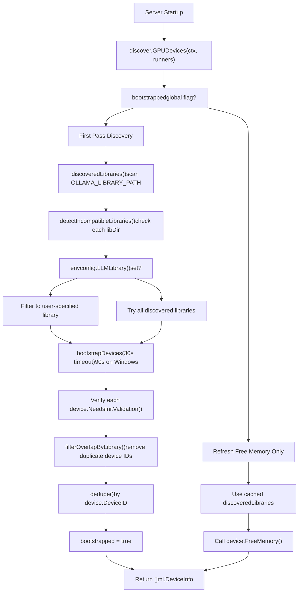
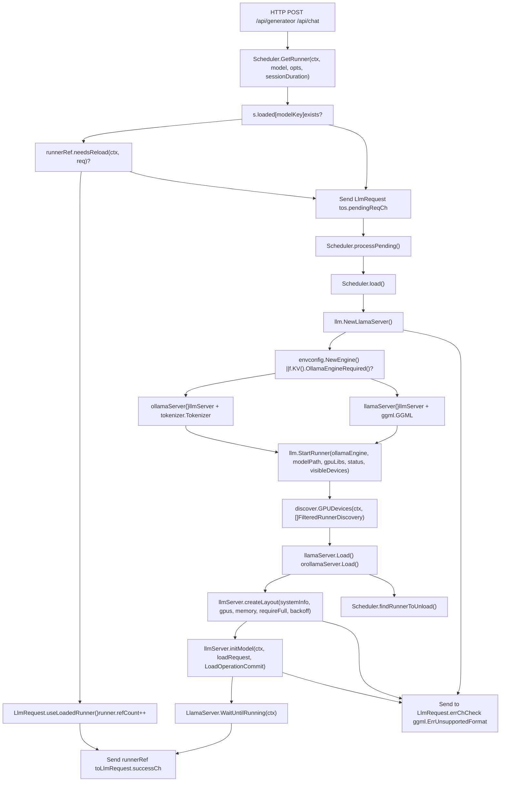
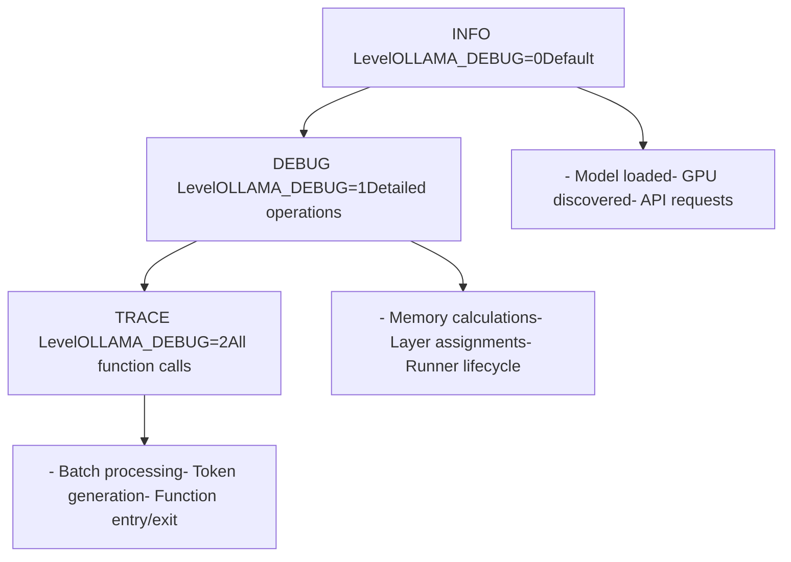
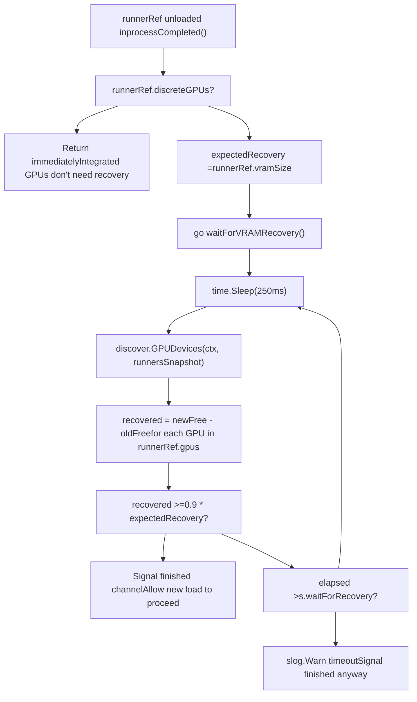

# 故障排查与性能优化

相关源文件

-   [envconfig/config.go](https://github.com/ollama/ollama/blob/562c76d7/envconfig/config.go)
-   [envconfig/config\_test.go](https://github.com/ollama/ollama/blob/562c76d7/envconfig/config_test.go)
-   [integration/embed\_test.go](https://github.com/ollama/ollama/blob/562c76d7/integration/embed_test.go)
-   [kvcache/cache.go](https://github.com/ollama/ollama/blob/562c76d7/kvcache/cache.go)
-   [kvcache/causal.go](https://github.com/ollama/ollama/blob/562c76d7/kvcache/causal.go)
-   [kvcache/causal\_test.go](https://github.com/ollama/ollama/blob/562c76d7/kvcache/causal_test.go)
-   [kvcache/encoder.go](https://github.com/ollama/ollama/blob/562c76d7/kvcache/encoder.go)
-   [kvcache/wrapper.go](https://github.com/ollama/ollama/blob/562c76d7/kvcache/wrapper.go)
-   [llm/server.go](https://github.com/ollama/ollama/blob/562c76d7/llm/server.go)
-   [ml/backend.go](https://github.com/ollama/ollama/blob/562c76d7/ml/backend.go)
-   [ml/backend/ggml/ggml.go](https://github.com/ollama/ollama/blob/562c76d7/ml/backend/ggml/ggml.go)
-   [model/input/input.go](https://github.com/ollama/ollama/blob/562c76d7/model/input/input.go)
-   [model/model.go](https://github.com/ollama/ollama/blob/562c76d7/model/model.go)
-   [model/model\_test.go](https://github.com/ollama/ollama/blob/562c76d7/model/model_test.go)
-   [runner/llamarunner/cache.go](https://github.com/ollama/ollama/blob/562c76d7/runner/llamarunner/cache.go)
-   [runner/llamarunner/runner.go](https://github.com/ollama/ollama/blob/562c76d7/runner/llamarunner/runner.go)
-   [runner/ollamarunner/cache.go](https://github.com/ollama/ollama/blob/562c76d7/runner/ollamarunner/cache.go)
-   [runner/ollamarunner/cache\_test.go](https://github.com/ollama/ollama/blob/562c76d7/runner/ollamarunner/cache_test.go)
-   [runner/ollamarunner/runner.go](https://github.com/ollama/ollama/blob/562c76d7/runner/ollamarunner/runner.go)
-   [server/internal/internal/backoff/backoff.go](https://github.com/ollama/ollama/blob/562c76d7/server/internal/internal/backoff/backoff.go)
-   [server/sched.go](https://github.com/ollama/ollama/blob/562c76d7/server/sched.go)
-   [server/sched\_test.go](https://github.com/ollama/ollama/blob/562c76d7/server/sched_test.go)

本页提供常见 Ollama 问题的诊断流程与性能优化建议。内容涵盖 GPU 检测失败、内存分配错误、模型加载问题、请求排队问题以及性能调优策略。

## 相关文档

-   GPU 支持与硬件：[6](/ollama/ollama/6-gpu-and-hardware-support), [6.1](/ollama/ollama/6.1-gpu-discovery-and-backend-loading), [6.2](/ollama/ollama/6.2-installation-and-setup)
-   模型管理：[4](/ollama/ollama/4-model-management), [4.1](/ollama/ollama/4.1-modelfiles), [4.2](/ollama/ollama/4.2-model-registry-and-layers)
-   API 参考：[3](/ollama/ollama/3-api-reference), [3.1](/ollama/ollama/3.1-model-management-api), [3.2](/ollama/ollama/3.2-generation-and-chat-api)
-   架构总览：[2](/ollama/ollama/2-architecture), [2.2](/ollama/ollama/2.2-request-scheduling-and-runner-management), [2.3](/ollama/ollama/2.3-model-execution-pipeline)

## 范围

-   运行时错误诊断与修复
-   GPU 检测与初始化失败
-   内存分配问题（VRAM 与系统 RAM）
-   模型加载与兼容性问题
-   请求队列与并发问题
-   通过环境变量和 API 参数进行性能调优
-   调试技巧与日志分析

---

## GPU 检测问题

### GPU 发现流程

GPU 检测在服务器启动期间通过 `discover.GPUDevices()` 执行 [discover/runner.go34-253](https://github.com/ollama/ollama/blob/562c76d7/discover/runner.go#L34-L253)。该函数维护已发现 GPU 的缓存列表，仅在首次调用时执行完整发现。


**关键函数：**

-   `discover.GPUDevices()`：GPU 发现主入口
-   `discoveredLibraries()`：扫描可用 GPU 库（CUDA、ROCm、Metal 等）
-   `detectIncompatibleLibraries()`：过滤无法加载的库
-   `bootstrapDevices()`：调用 GPU 库进行设备枚举
-   `filterOverlapByLibrary()`：去除跨库重复设备 ID
-   `dedupe()`：按设备 ID 做最终去重

**来源：** [discover/runner.go34-253](https://github.com/ollama/ollama/blob/562c76d7/discover/runner.go#L34-L253) [discover/runner.go255-402](https://github.com/ollama/ollama/blob/562c76d7/discover/runner.go#L255-L402)

### 常见 GPU 检测问题

#### 问题：未检测到 GPU

**症状：**

-   日志消息：`"inference compute id=cpu"`
-   日志消息：`"loaded runners count=1"` 且后续只有 CPU 指标
-   尽管存在 GPU，模型仍在 CPU 上运行
-   生成速度明显低于预期

**诊断：**

1.  **查看 GPU 发现日志：**

    ```
    OLLAMA_DEBUG=1 ollama serve 2>&1 | grep -i gpu
    ```

    关注：

    -   启动时的 `"discovering available GPUs..."`
    -   展示 `library`、`compute`、`total`、`available` 内存的设备条目
    -   任何库加载错误信息
2.  **验证驱动状态：**

    ```
    # NVIDIAnvidia-smi# Should show GPU(s) with memory info # AMD  rocm-smi# Should show GPU(s) and ROCm version # Check driver modules (Linux)lsmod | grep -E '(nvidia|amdgpu)'
    ```

3.  **检查环境变量冲突：**

    ```
    env | grep -E '(CUDA_VISIBLE_DEVICES|HIP_VISIBLE_DEVICES|ROCR_VISIBLE_DEVICES|GGML_VK_VISIBLE_DEVICES)'
    ```

    -   这些变量可能会将 GPU 对 Ollama 隐藏
    -   为空或无效值会导致 GPU 检测失败

**解决方案：**

1.  **移除环境变量覆盖：**

    ```
    unset CUDA_VISIBLE_DEVICESunset HIP_VISIBLE_DEVICESunset ROCR_VISIBLE_DEVICESollama serve
    ```

2.  **验证驱动安装：**

    ```
    # NVIDIA - Install CUDA toolkit# Download from: https://developer.nvidia.com/cuda-downloads # AMD - Install ROCm# Download from: https://rocm.docs.amd.com/ # Verify installationnvidia-smi   # NVIDIArocminfo     # AMD
    ```

3.  **手动指定 GPU 库：**

    ```
    # List available librariesls -la ~/.ollama/lib/ollama/# or /usr/lib/ollama/ on Linux # Force specific libraryOLLAMA_LLM_LIBRARY=cuda_v12 ollama serve# or: cuda_v11, rocm, vulkan
    ```

4.  **检查库依赖：**

    ```
    # Linux - verify shared library dependenciesldd ~/.ollama/lib/ollama/libggml-cuda.so# Should not show "not found" errors # macOS - Metal is built-in, no dependencies # Windows - verify CUDA DLLs in PATHwhere cudart64*.dll
    ```

5.  **以全新 GPU 状态重启：**

    ```
    # Stop all Ollama processespkill ollama # Clear GPU memory (NVIDIA)sudo nvidia-smi --gpu-reset # Restart Ollamaollama serve
    ```


#### 问题：检测到 GPU 但未使用

**症状：**

-   日志中有 GPU，但模型加载时 `num_gpu=0`
-   `"insufficient VRAM to load any model layers"`

**诊断：**

-   检查 `OLLAMA_GPU_OVERHEAD` 设置：[envconfig/config.go266](https://github.com/ollama/ollama/blob/562c76d7/envconfig/config.go#L266-L266)
-   查看内存计算日志：[llm/server.go449-464](https://github.com/ollama/ollama/blob/562c76d7/llm/server.go#L449-L464)

**解决方案：**

1.  **降低 GPU 预留开销：**

    ```
    OLLAMA_GPU_OVERHEAD=0
    ```

    -   默认会为系统进程预留空间
    -   [server/sched.go455-463](https://github.com/ollama/ollama/blob/562c76d7/server/sched.go#L455-L463)：显示每块 GPU 的内存拆分
2.  **检查可用 VRAM：**

    -   [llm/server.go528-534](https://github.com/ollama/ollama/blob/562c76d7/llm/server.go#L528-L534)：会预留缓冲空间（`blk.0` + `kv[0]` 大小）
    -   实际可用 = `FreeMemory - buffer - overhead - MinimumMemory()`

#### 问题：GPU 初始化不完整或卡住

**症状：**

-   服务器启动时卡住
-   日志中出现超时错误

**诊断：**

-   第一阶段使用 30 秒超时（Windows 为 90 秒）：[discover/runner.go85-94](https://github.com/ollama/ollama/blob/562c76d7/discover/runner.go#L85-L94)
-   第二阶段使用 30 秒超时：[discover/runner.go125-126](https://github.com/ollama/ollama/blob/562c76d7/discover/runner.go#L125-L126)

**解决方案：**

1.  **检查冲突进程：**

    -   其他高负载 GPU 应用可能拖慢初始化
    -   在 Windows 上，Defender 杀毒扫描会延迟库加载：[discover/runner.go87-93](https://github.com/ollama/ollama/blob/562c76d7/discover/runner.go#L87-L93)
2.  **验证设备权限：**

    -   确保用户属于 `render` 与 `video` 组（Linux）：[scripts/install.sh142-149](https://github.com/ollama/ollama/blob/562c76d7/scripts/install.sh#L142-L149)
3.  **尝试禁用问题设备：**

    ```
    # Hide specific GPU by indexCUDA_VISIBLE_DEVICES=0  # Use only GPU 0
    ```


**来源：** [discover/runner.go34-253](https://github.com/ollama/ollama/blob/562c76d7/discover/runner.go#L34-L253) [discover/runner.go454-515](https://github.com/ollama/ollama/blob/562c76d7/discover/runner.go#L454-L515) [discover/types.go29-74](https://github.com/ollama/ollama/blob/562c76d7/discover/types.go#L29-L74) [envconfig/config.go266](https://github.com/ollama/ollama/blob/562c76d7/envconfig/config.go#L266-L266) [llm/server.go449-464](https://github.com/ollama/ollama/blob/562c76d7/llm/server.go#L449-L464) [llm/server.go528-534](https://github.com/ollama/ollama/blob/562c76d7/llm/server.go#L528-L534) [scripts/install.sh142-149](https://github.com/ollama/ollama/blob/562c76d7/scripts/install.sh#L142-L149)

---

## 内存分配失败

### 内存分配架构

内存分配使用迭代拟合算法，以确定模型层在 GPU 与 CPU 之间的最优分布。`llmServer.createLayout()` 函数负责协调该流程。

**关键数据结构：**

-   `ml.BackendMemory`：保存 CPU 与各 GPU 的逐层内存需求
-   `ml.GPULayersList`：`GPULayers` 结构体列表，将设备 ID 映射到层范围
-   `llm.LoadRequest`：包含 GPU 层分配、批大小、KV 缓存大小、flash attention 设置

**分配算法：**

1.  `buildLayout()`：基于 GGML 张量大小计算每层内存需求
2.  `assignLayers()`：通过二分查找容量因子分配层
3.  `greedyFit()`：按性能从高到低将层贪心装入 GPU
4.  `verifyLayout()`：检查分配是否超出可用内存
5.  `initModel()`：提交分配并加载模型权重

**来源：** [llm/server.go922-1059](https://github.com/ollama/ollama/blob/562c76d7/llm/server.go#L922-L1059) [llm/server.go1062-1098](https://github.com/ollama/ollama/blob/562c76d7/llm/server.go#L1062-L1098) [llm/server.go1104-1134](https://github.com/ollama/ollama/blob/562c76d7/llm/server.go#L1104-L1134) [llm/server.go1137-1156](https://github.com/ollama/ollama/blob/562c76d7/llm/server.go#L1137-L1156) [server/sched.go234-264](https://github.com/ollama/ollama/blob/562c76d7/server/sched.go#L234-L264) [server/sched.go719-780](https://github.com/ollama/ollama/blob/562c76d7/server/sched.go#L719-L780)

### 常见内存问题

#### 问题：`"insufficient memory"` 错误

**症状：**

-   错误信息：`"model requires more system memory (X GB) than is available (Y GB)"`
-   错误信息：`"model requires more system memory than is available"`
-   错误信息：`"failed to allocate memory for model"`
-   模型加载失败并伴随内存相关错误

**根因：**

1.  **系统 RAM 不足**：`verifyLayout()` 检查 `cpuSize <= systemInfo.FreeMemory + systemInfo.FreeSwap` [llm/server.go1040-1045](https://github.com/ollama/ollama/blob/562c76d7/llm/server.go#L1040-L1045)
2.  **VRAM 不足**：请求层所需 GPU 内存不足
3.  **KV 缓存开销**：`KvSize = opts.NumCtx * numParallel` [llm/server.go173](https://github.com/ollama/ollama/blob/562c76d7/llm/server.go#L173-L173)
4.  **计算图内存**：计算操作需要额外内存

**诊断：**

1.  **查看系统内存日志：**

    ```
    OLLAMA_DEBUG=1 ollama serve 2>&1 | grep "system memory"
    ```

    预期输出：

    ```
    system memory total=32GB free=26GB free_swap=8GB
    ```

    由 `Scheduler.load()` 记录 [llm/server.go449-464](https://github.com/ollama/ollama/blob/562c76d7/llm/server.go#L449-L464)

2.  **查看 GPU 内存日志：**

    ```
    OLLAMA_DEBUG=1 ollama serve 2>&1 | grep "gpu memory"
    ```

    预期输出：

    ```
    gpu memory id=0 library=CUDA available=10.5GB free=11GB minimum=512MB overhead=500MB
    ```

    显示计算方式：`available = FreeMemory - overhead - MinimumMemory()` [llm/server.go455-463](https://github.com/ollama/ollama/blob/562c76d7/llm/server.go#L455-L463)

3.  **查看内存布局估算：**

    ```
    OLLAMA_DEBUG=1 ollama serve 2>&1 | grep "memory estimate"
    ```

    会显示 `BackendMemory` 结构，包含 CPU/GPU 的逐层分配

4.  **检查当前内存使用：**

    ```
    # System RAMfree -h    # Linuxvm_stat    # macOS # GPU VRAMnvidia-smi    # NVIDIArocm-smi      # AMD
    ```

5.  **查看 GGML 张量尺寸：**

    ```
    # Model stores size metadataOLLAMA_DEBUG=1 ollama serve 2>&1 | grep "blk.0"
    ```

    显示用于缓冲计算的首层块大小 [llm/server.go527-538](https://github.com/ollama/ollama/blob/562c76d7/llm/server.go#L527-L538)


**解决方案：**

1.  **降低上下文长度：**

    ```
    # In API request{"num_ctx": 2048}  # Default is 4096
    ```

    -   上下文越小，KV 缓存占用越少：[llm/server.go521-522](https://github.com/ollama/ollama/blob/562c76d7/llm/server.go#L521-L522)
2.  **降低批大小：**

    ```
    # Smaller batches use less memory during processing{"num_batch": 512}  # Automatically capped by num_ctx
    ```

    -   [llm/server.go171](https://github.com/ollama/ollama/blob/562c76d7/llm/server.go#L171-L171)：`opts.NumBatch = min(opts.NumBatch, opts.NumCtx)`
3.  **释放系统内存：**

    -   关闭其他应用
    -   Linux：`sync && echo 3 > /proc/sys/vm/drop_caches`（需要 root）
4.  **调整 GPU 预留开销：**

    ```
    OLLAMA_GPU_OVERHEAD=500000000  # 500MB in bytes
    ```

    -   若无其他 GPU 进程可适当减小：[envconfig/config.go266](https://github.com/ollama/ollama/blob/562c76d7/envconfig/config.go#L266-L266)
5.  **禁用 mmap（磁盘受限时）：**

    ```
    {"use_mmap": false}
    ```

    -   强制内存分配而非文件缓存：[llm/server.go671-692](https://github.com/ollama/ollama/blob/562c76d7/llm/server.go#L671-L692)

#### 问题：模型可加载但推理时内存耗尽

**症状：**

-   初始加载成功
-   生成期间崩溃或报错
-   出现 `"could not find a kv cache slot"` 错误

**诊断：**

-   检查 `num_parallel` 设置：[envconfig/config.go244](https://github.com/ollama/ollama/blob/562c76d7/envconfig/config.go#L244-L244)
-   每个并行请求都会乘上 KV 缓存需求
-   [llm/server.go173](https://github.com/ollama/ollama/blob/562c76d7/llm/server.go#L173-L173)：`KvSize: opts.NumCtx * numParallel`

**解决方案：**

1.  **减少并行请求：**

    ```
    OLLAMA_NUM_PARALLEL=1
    ```

2.  **减少已加载模型数：**

    ```
    OLLAMA_MAX_LOADED_MODELS=1
    ```

    -   加载新模型前强制卸载旧模型：[server/sched.go170-173](https://github.com/ollama/ollama/blob/562c76d7/server/sched.go#L170-L173)
3.  **启用多用户缓存优化：**

    ```
    OLLAMA_MULTIUSER_CACHE=1
    ```

    -   [llm/server.go173](https://github.com/ollama/ollama/blob/562c76d7/llm/server.go#L173-L173)：`MultiUserCache: envconfig.MultiUserCache()`
    -   优化跨请求缓存共享

#### 问题：`"failed to allocate memory for model"`

**症状：**

-   布局计算成功后仍报错
-   Runner 初始化失败

**诊断：**

-   错误发生于 `ollamaServer.Load()`：[llm/server.go744-896](https://github.com/ollama/ollama/blob/562c76d7/llm/server.go#L744-L896)
-   失败前会尝试多个布局方案

**解决方案：**

1.  **检查内存碎片：**

    -   重启 Ollama 服务以清理碎片内存
    -   Linux：检查 `/proc/meminfo` 中碎片情况
2.  **查看回退因子：**

    -   系统会逐步回退：[llm/server.go758-875](https://github.com/ollama/ollama/blob/562c76d7/llm/server.go#L758-L875)
    -   若持续失败，可能是系统内存上报不准确
3.  **强制 CPU 模式：**

    ```
    {"num_gpu": 0}
    ```

    -   完全绕过 GPU 分配

**附加说明：**

内存分配失败可能出现在不同阶段：

-   **布局计算阶段**：系统判断模型是否能放下
-   **缓冲分配阶段**：runner 分配内存结构
-   **模型加载阶段**：将权重加载到已分配内存

各阶段失败原因不同，对应解决方案也不同。

**来源：** [llm/server.go449-464](https://github.com/ollama/ollama/blob/562c76d7/llm/server.go#L449-L464) [llm/server.go521-522](https://github.com/ollama/ollama/blob/562c76d7/llm/server.go#L521-L522) [llm/server.go667-692](https://github.com/ollama/ollama/blob/562c76d7/llm/server.go#L667-L692) [llm/server.go744-896](https://github.com/ollama/ollama/blob/562c76d7/llm/server.go#L744-L896) [llm/server.go922-1059](https://github.com/ollama/ollama/blob/562c76d7/llm/server.go#L922-L1059) [server/sched.go170-173](https://github.com/ollama/ollama/blob/562c76d7/server/sched.go#L170-L173) [envconfig/config.go244](https://github.com/ollama/ollama/blob/562c76d7/envconfig/config.go#L244-L244) [envconfig/config.go266](https://github.com/ollama/ollama/blob/562c76d7/envconfig/config.go#L266-L266)

---

## 模型加载失败

### 模型加载流水线

模型加载由 `Scheduler` 协调，它负责管理 runner 生命周期，并确保仅并发加载兼容模型。


**关键类型与函数：**

-   `Scheduler`：管理模型生命周期与并发请求
-   `LlmRequest`：封装模型加载/复用请求
-   `runnerRef`：对 `LlamaServer` 的封装，包含引用计数与会话时长
-   `LlamaServer` 接口：由 `llamaServer` 或 `ollamaServer` 实现
-   `llm.NewLlamaServer()`：创建对应 runner 类型的工厂函数
-   `llm.StartRunner()`：使用 GPU 库启动 runner 子进程
-   `schedulerModelKey()`：根据 ModelPath 或 manifest digest 生成缓存键

**来源：** [server/sched.go85-117](https://github.com/ollama/ollama/blob/562c76d7/server/sched.go#L85-L117) [server/sched.go131-271](https://github.com/ollama/ollama/blob/562c76d7/server/sched.go#L131-L271) [server/sched.go401-553](https://github.com/ollama/ollama/blob/562c76d7/server/sched.go#L401-L553) [llm/server.go142-317](https://github.com/ollama/ollama/blob/562c76d7/llm/server.go#L142-L317) [llm/server.go319-437](https://github.com/ollama/ollama/blob/562c76d7/llm/server.go#L319-L437) [llm/server.go495-712](https://github.com/ollama/ollama/blob/562c76d7/llm/server.go#L495-L712) [llm/server.go744-896](https://github.com/ollama/ollama/blob/562c76d7/llm/server.go#L744-L896)

### 常见加载问题

#### 问题：`"this model may be incompatible with your version of Ollama"`

**症状：**

-   模型加载尝试时立即报错
-   完整错误：`"this model may be incompatible with your version of Ollama. If you previously pulled this model, try updating it by running 'ollama pull <model>'"`
-   在内存分配前即加载失败

**诊断：**

1.  **检查格式不兼容：**

    ```
    # Look for "failed to load model" in logsOLLAMA_DEBUG=1 ollama serve 2>&1 | grep "failed to load"
    ```

2.  **验证 GGUF 版本：**

    ```
    # Inspect model file headerod -An -tx1 -N16 ~/.ollama/models/blobs/sha256-<hash> | head -1# Should start with: 47 47 55 46 (GGUF magic)
    ```

3.  **检查模型架构：**

    ```
    # List model detailsollama show <model> --modelfile
    ```


**解决方案：**

1.  **更新模型：**

    ```
    ollama pull <model_name># Re-downloads latest compatible version
    ```

2.  **更新 Ollama 到最新版：**

    ```
    # Linuxcurl -fsSL https://ollama.com/install.sh | sh # macOSbrew upgrade ollama# or download from https://ollama.com/download # Windows  # Download latest from https://ollama.com/download
    ```

3.  **为新模型格式启用新引擎：**

    ```
    OLLAMA_NEW_ENGINE=1 ollama serve
    ```

    -   某些 safetensors 模型需要
    -   某些拆分视觉模型需要
4.  **检查模型兼容性：**

    ```
    # List supported model families# Documented at: https://ollama.com/library
    ```

5.  **验证模型文件完整性：**

    ```
    # Check file size matches expectedls -lh ~/.ollama/models/blobs/sha256-* # Re-pull if corruptedollama rm <model>ollama pull <model>
    ```


#### 问题：`"unknown model"` 错误

**症状：**

-   Runner 子进程立即终止
-   子进程输出包含 `"unknown model"`
-   错误会被转换为：`"this model is not supported by your version of Ollama. You may need to upgrade"`
-   与兼容性错误不同，此错误表示架构无法识别

**诊断：**

1.  **检查子进程终止日志：**

    ```
    OLLAMA_DEBUG=1 ollama serve 2>&1 | grep "llama runner terminated"
    ```

2.  **验证模型架构：**

    ```
    ollama show <model> --modelfile | grep "FROM"
    ```

3.  **查看 llama.cpp 版本：**

    ```
    # Version is built into Ollamaollama --version
    ```


**解决方案：**

1.  **升级 Ollama：**

    ```
    # Newer architectures require newer Ollama versionscurl -fsSL https://ollama.com/install.sh | sh
    ```

2.  **检查模型来源：**

    ```
    # Official models from ollama.com/library are tested# Custom/converted models may not be compatible
    ```

3.  **尝试官方模型变体：**

    ```
    # List available tagsollama pull <model>:latest
    ```

4.  **验证模型文件完整性：**

    ```
    # Re-download if corruption suspectedollama rm <model>ollama pull <model> # Check file sizels -lh ~/.ollama/models/blobs/
    ```

5.  **检查实验性架构支持：**

    ```
    # Some architectures may require new engineOLLAMA_NEW_ENGINE=1 ollama serve
    ```


#### 问题：模型加载停滞/超时

**症状：**

-   加载过程卡住
-   最终在 5 分钟后超时（默认）
-   日志显示“loading model”但始终不完成

**根因：**

1.  **磁盘 I/O 慢**：从慢速存储读取大模型文件（10GB+）
2.  **内存分配延迟**：操作系统分配大块内存较慢
3.  **GPU 初始化卡死**：驱动或库初始化停滞
4.  **子进程崩溃**：runner 在发出完成信号前已退出

**诊断：**

1.  **检查超时设置：**

    ```
    env | grep OLLAMA_LOAD_TIMEOUT
    ```

    默认 5 分钟：`envconfig.LoadTimeout()` [envconfig/config.go120-138](https://github.com/ollama/ollama/blob/562c76d7/envconfig/config.go#L120-L138)

2.  **监控磁盘 I/O：**

    ```
    # During model loadiostat -x 1    # Linuxiotop          # Linux, requires root
    ```

3.  **检查子进程状态：**

    ```
    ps aux | grep ollama# Look for runner process with --model flag # Check if process is in uninterruptible sleep (D state)ps -eo pid,stat,comm | grep ollama
    ```

4.  **查看等待条件：**

    ```
    OLLAMA_DEBUG=1 ollama serve 2>&1 | grep -E '(WaitUntilRunning|Ping)'
    ```

    `WaitUntilRunning()` 会轮询 `Ping()` 端点直至就绪 [llm/server.go694](https://github.com/ollama/ollama/blob/562c76d7/llm/server.go#L694-L694)


**解决方案：**

1.  **为大模型提高超时：**

    ```
    OLLAMA_LOAD_TIMEOUT=10m
    ```

2.  **检查磁盘 I/O 并验证模型完整性：**

    ```
    sha256sum ~/.ollama/models/blobs/sha256-*# Re-pull if corruptedollama rm <model>ollama pull <model>
    ```

3.  **禁用 mmap，强制预加载：**

    ```
    {"use_mmap": false}
    ```

    -   [llm/server.go683-692](https://github.com/ollama/ollama/blob/562c76d7/llm/server.go#L683-L692)：自动禁用 mmap 的条件
    -   强制将整个模型加载到 RAM，而非内存映射文件
    -   初始加载更慢，但可规避部分磁盘 I/O 问题
4.  **检查卡死子进程：**

    ```
    ps aux | grep ollama# Kill hung runner process if foundkill -9 <pid>
    ```

5.  **验证 GPU 库初始化：**

    ```
    # Test GPU library can be loadedOLLAMA_DEBUG=1 ollama serve 2>&1 | grep -E '(discovering|bootstrapDevices)'
    ```

    GPU 发现阶段超时通常指向驱动问题


#### 问题：Flash Attention 警告

**症状：**

-   警告：`"flash attention enabled but not supported by gpu"`
-   警告：`"flash attention enabled but not supported by model"`

**诊断：**

-   [llm/server.go201-209](https://github.com/ollama/ollama/blob/562c76d7/llm/server.go#L201-L209)：Flash attention 检查逻辑
-   需要满足特定 GPU 计算能力和模型支持

**解决方案：**

1.  **禁用 flash attention：**

    ```
    OLLAMA_FLASH_ATTENTION=0
    ```

2.  **检查 GPU 计算能力：**

    -   Flash attention 需要计算能力 7.0+
    -   运行 `nvidia-smi --query-gpu=compute_cap --format=csv`
3.  **验证模型支持：**

    -   [llm/server.go206-209](https://github.com/ollama/ollama/blob/562c76d7/llm/server.go#L206-L209)：`f.SupportsFlashAttention()`
    -   某些模型架构不支持

#### 问题：多模态模型问题

**症状：**

-   视觉模型加载失败
-   图像处理报错

**诊断：**

-   [llm/server.go147-151](https://github.com/ollama/ollama/blob/562c76d7/llm/server.go#L147-L151)：视觉模型存在特殊要求
-   新引擎不支持拆分视觉模型

**解决方案：**

1.  **对拆分模型强制使用旧引擎：**

    ```
    OLLAMA_NEW_ENGINE=0
    ```

2.  **验证 projector 文件：**

    -   检查模型是否包含 projector 路径：`req.model.ProjectorPaths`
    -   位于 manifest 层中

**来源：** [server/sched.go401-553](https://github.com/ollama/ollama/blob/562c76d7/server/sched.go#L401-L553) [server/sched.go428-434](https://github.com/ollama/ollama/blob/562c76d7/server/sched.go#L428-L434) [llm/server.go142-317](https://github.com/ollama/ollama/blob/562c76d7/llm/server.go#L142-L317) [llm/server.go303-310](https://github.com/ollama/ollama/blob/562c76d7/llm/server.go#L303-L310) [llm/server.go201-209](https://github.com/ollama/ollama/blob/562c76d7/llm/server.go#L201-L209) [llm/server.go147-151](https://github.com/ollama/ollama/blob/562c76d7/llm/server.go#L147-L151) [llm/server.go683-692](https://github.com/ollama/ollama/blob/562c76d7/llm/server.go#L683-L692) [envconfig/config.go120-138](https://github.com/ollama/ollama/blob/562c76d7/envconfig/config.go#L120-L138)

---

## 性能优化

### 关键性能参数

| 参数 | 环境变量 | 默认值 | 影响 | 何时调整 |
| --- | --- | --- | --- | --- |
| Context Length | `OLLAMA_CONTEXT_LENGTH` | 4096 (varies) | 越高占用内存越多，可处理更长提示 | 长文档场景，低内存时降低 |
| Parallel Requests | `OLLAMA_NUM_PARALLEL` | 1 | 越高并发越多，VRAM 占用越高 | 多用户场景 |
| Max Loaded Models | `OLLAMA_MAX_LOADED_MODELS` | 0 (auto: 3×GPUs) | 限制同时驻留模型数 | 低 VRAM、高吞吐场景 |
| Max Queue | `OLLAMA_MAX_QUEUE` | 512 | 最大待处理请求数 | 防止过载 |
| Batch Size | API: `num_batch` | From `num_ctx` | 越大处理越快、但内存更高 | 依据硬件调优 |
| GPU Layers | API: `num_gpu` | \-1 (auto) | 卸载到 GPU 的层数 | 强制 CPU/GPU 切分 |
| Thread Count | API: `num_thread` | Auto-detected | CPU 推理并行度 | CPU 推理调优 |
| Flash Attention | `OLLAMA_FLASH_ATTENTION` | Auto | 注意力计算可快 2-4× | 仅支持的 GPU |
| KV Cache Type | `OLLAMA_KV_CACHE_TYPE` | f16 | 量化可减 VRAM，精度略降 | 低 VRAM 场景 |
| Keep Alive | `OLLAMA_KEEP_ALIVE` | 5m | 模型在内存中的保留时长 | 平衡重载成本与内存占用 |
| Load Timeout | `OLLAMA_LOAD_TIMEOUT` | 5m | 模型加载最长时间 | 大模型、慢磁盘 |
| GPU Overhead | `OLLAMA_GPU_OVERHEAD` | 0 | 每 GPU 预留 VRAM | 其他 GPU 进程同时运行 |
| Multi-User Cache | `OLLAMA_MULTIUSER_CACHE` | false | 共享提示缓存 | 多用户、重复提示 |
| Schedule Spread | `OLLAMA_SCHED_SPREAD` | false | 在所有 GPU 分摊层 | 多 GPU 系统 |

**性能影响汇总：**

-   **内存：** `num_ctx`、`num_parallel`、`num_gpu`、`OLLAMA_GPU_OVERHEAD`
-   **速度：** `num_batch`、`num_thread`、`OLLAMA_FLASH_ATTENTION`、`num_gpu`
-   **吞吐：** `OLLAMA_NUM_PARALLEL`、`OLLAMA_MAX_LOADED_MODELS`、`OLLAMA_MAX_QUEUE`
-   **延迟：** `OLLAMA_KEEP_ALIVE`、`num_gpu`、`OLLAMA_FLASH_ATTENTION`

**来源：** [envconfig/config.go188-318](https://github.com/ollama/ollama/blob/562c76d7/envconfig/config.go#L188-L318)

### 性能调优策略

#### 策略 1：面向吞吐优化（多用户）

```
# Configuration for high concurrencyOLLAMA_NUM_PARALLEL=4          # Handle 4 concurrent requestsOLLAMA_MULTIUSER_CACHE=1       # Share cache across usersOLLAMA_MAX_LOADED_MODELS=1     # Keep one model loadedOLLAMA_KEEP_ALIVE=30m          # Keep models loaded longer
```
**原理：**

-   [envconfig/config.go244](https://github.com/ollama/ollama/blob/562c76d7/envconfig/config.go#L244-L244)：`NumParallel` 决定并发请求能力
-   [envconfig/config.go200](https://github.com/ollama/ollama/blob/562c76d7/envconfig/config.go#L200-L200)：`MultiUserCache` 优化跨用户提示共享
-   [server/sched.go402-407](https://github.com/ollama/ollama/blob/562c76d7/server/sched.go#L402-L407)：Embedding 模型始终使用 `parallel=1`

**权衡：**

-   更高的 VRAM 占用：`KV cache size = num_ctx * num_parallel`
-   可能需要降低 `num_ctx` 才能放入内存

#### 策略 2：面向延迟优化（单用户）

```
# Configuration for low latencyOLLAMA_NUM_PARALLEL=1           # Single request at a timeOLLAMA_FLASH_ATTENTION=1        # Enable if supportedOLLAMA_KV_CACHE_TYPE=f16        # Full precision cacheOLLAMA_MAX_LOADED_MODELS=3      # Keep recently used models
```
**原理：**

-   单并发可最小化 KV 缓存开销
-   Flash attention 可加速计算：[llm/server.go191-258](https://github.com/ollama/ollama/blob/562c76d7/llm/server.go#L191-L258)
-   多模型驻留可避免重复加载

#### 策略 3：面向内存受限系统优化

```
# Configuration for limited VRAM/RAMOLLAMA_CONTEXT_LENGTH=2048      # Reduce from default 4096OLLAMA_MAX_LOADED_MODELS=1      # Only one model at a timeOLLAMA_KEEP_ALIVE=0             # Unload immediately when idleOLLAMA_GPU_OVERHEAD=0           # Use all available VRAM # In API requests:{"num_ctx": 2048, "num_batch": 512, "num_gpu": 999}
```
**原理：**

-   更小上下文降低内存占用：[llm/server.go521-522](https://github.com/ollama/ollama/blob/562c76d7/llm/server.go#L521-L522)
-   立即卸载可快速释放资源
-   `num_gpu: 999` 表示尽可能多地加载层：[llm/server.go1109-1112](https://github.com/ollama/ollama/blob/562c76d7/llm/server.go#L1109-L1112)

#### 策略 4：多 GPU 优化

```
# Configuration for multiple GPUsOLLAMA_SCHED_SPREAD=1           # Use all GPUsOLLAMA_MAX_LOADED_MODELS=0      # Auto-calculate (3 per GPU) # Optional: Control GPU visibilityCUDA_VISIBLE_DEVICES=0,1        # Use only GPU 0 and 1
```
**原理：**

-   [envconfig/config.go198](https://github.com/ollama/ollama/blob/562c76d7/envconfig/config.go#L198-L198)：`SchedSpread` 负责跨 GPU 分布
-   [server/sched.go185-196](https://github.com/ollama/ollama/blob/562c76d7/server/sched.go#L185-L196)：自动 `maxRunners = defaultModelsPerGPU * max(len(gpus), 1)`
-   [server/sched.go63](https://github.com/ollama/ollama/blob/562c76d7/server/sched.go#L63-L63)：`defaultModelsPerGPU = 3`

#### 策略 5：纯 CPU 优化

```
# Configuration for CPU inferenceOLLAMA_NUM_PARALLEL=1           # Single requestOLLAMA_KEEP_ALIVE=5m            # Default keep alive # In API requests:{"num_gpu": 0, "num_thread": 8}  # Explicit CPU mode
```
**原理：**

-   [llm/server.go175-180](https://github.com/ollama/ollama/blob/562c76d7/llm/server.go#L175-L180)：线程数可自动检测，也可通过 `num_thread` 设置
-   CPU 模式使用系统 RAM 而非 VRAM
-   [llm/server.go686-688](https://github.com/ollama/ollama/blob/562c76d7/llm/server.go#L686-L688)：CPU 加载默认 `use_mmap=false`

### 性能监控

#### 关键监控指标

1.  **Token 生成速度：**

    -   API 响应字段：`"eval_count"`、`"eval_duration"`
    -   Tokens/second = `eval_count / (eval_duration / 1e9)`
2.  **VRAM 使用：**

    -   [discover/runner.go304-418](https://github.com/ollama/ollama/blob/562c76d7/discover/runner.go#L304-L418)：逐 GPU VRAM 跟踪
    -   推理时使用 `nvidia-smi` 或 `rocm-smi` 检查
3.  **模型加载时间：**

    -   [llm/server.go103](https://github.com/ollama/ollama/blob/562c76d7/llm/server.go#L103-L103)：记录 `loadStart` 时间戳
    -   与 `WaitUntilRunning()` 完成时间对比
4.  **请求队列深度：**

    -   [server/sched.go68-73](https://github.com/ollama/ollama/blob/562c76d7/server/sched.go#L68-L73)：`pendingReqCh` 大小
    -   [envconfig/config.go248](https://github.com/ollama/ollama/blob/562c76d7/envconfig/config.go#L248-L248)：默认最大 512
5.  **Runner 淘汰频率：**

    -   [server/sched.go319-372](https://github.com/ollama/ollama/blob/562c76d7/server/sched.go#L319-L372)：`expiredCh` 事件
    -   频繁淘汰通常表示内存压力较高

#### 启用性能日志

```
# Full debug outputOLLAMA_DEBUG=2 # Trace-level logging (very verbose)OLLAMA_DEBUG=1
```
-   [envconfig/config.go173-186](https://github.com/ollama/ollama/blob/562c76d7/envconfig/config.go#L173-L186)：调试级别
    -   `0` 或 `false`：INFO（默认）
    -   `1` 或 `true`：DEBUG
    -   `2`：TRACE（-4 级别）

**来源：** [envconfig/config.go188-318](https://github.com/ollama/ollama/blob/562c76d7/envconfig/config.go#L188-L318) [envconfig/config.go244](https://github.com/ollama/ollama/blob/562c76d7/envconfig/config.go#L244-L244) [envconfig/config.go200](https://github.com/ollama/ollama/blob/562c76d7/envconfig/config.go#L200-L200) [envconfig/config.go198](https://github.com/ollama/ollama/blob/562c76d7/envconfig/config.go#L198-L198) [server/sched.go63](https://github.com/ollama/ollama/blob/562c76d7/server/sched.go#L63-L63) [server/sched.go185-196](https://github.com/ollama/ollama/blob/562c76d7/server/sched.go#L185-L196) [server/sched.go402-407](https://github.com/ollama/ollama/blob/562c76d7/server/sched.go#L402-L407) [server/sched.go319-372](https://github.com/ollama/ollama/blob/562c76d7/server/sched.go#L319-L372) [llm/server.go103](https://github.com/ollama/ollama/blob/562c76d7/llm/server.go#L103-L103) [llm/server.go175-180](https://github.com/ollama/ollama/blob/562c76d7/llm/server.go#L175-L180) [llm/server.go191-258](https://github.com/ollama/ollama/blob/562c76d7/llm/server.go#L191-L258) [llm/server.go521-522](https://github.com/ollama/ollama/blob/562c76d7/llm/server.go#L521-L522) [llm/server.go686-688](https://github.com/ollama/ollama/blob/562c76d7/llm/server.go#L686-L688) [llm/server.go1109-1112](https://github.com/ollama/ollama/blob/562c76d7/llm/server.go#L1109-L1112)

---

## 调试技术

### 调试日志级别


**来源：** [envconfig/config.go173-186](https://github.com/ollama/ollama/blob/562c76d7/envconfig/config.go#L173-L186)

### 常用调试命令

#### 1\. 检查环境配置

```
# View all Ollama environment variablesollama show <model> --verbose # Or use the APIcurl http://localhost:11434/api/version
```
配置加载位置：[envconfig/config.go274-321](https://github.com/ollama/ollama/blob/562c76d7/envconfig/config.go#L274-L321)

#### 2\. 检查 GPU 检测

```
# Run with debug loggingOLLAMA_DEBUG=1 ollama serve 2>&1 | grep -i gpu # Look for:# - "discovering available GPUs"# - "inference compute" entries# - Device details (id, library, compute, memory)
```
输出来源：[discover/types.go29-74](https://github.com/ollama/ollama/blob/562c76d7/discover/types.go#L29-L74) [discover/runner.go67](https://github.com/ollama/ollama/blob/562c76d7/discover/runner.go#L67-L67)

#### 3\. 监控内存分配

```
# Enable debug logging and watch memoryOLLAMA_DEBUG=1 ollama serve 2>&1 | grep -E '(memory|VRAM|available)' # Look for:# - "system memory total=... free=..."# - "gpu memory id=... available=..."# - "memory estimate=..."# - "updated VRAM based on existing loaded models"
```
输出来源：[llm/server.go449-464](https://github.com/ollama/ollama/blob/562c76d7/llm/server.go#L449-L464) [llm/server.go667-668](https://github.com/ollama/ollama/blob/562c76d7/llm/server.go#L667-L668) [server/sched.go598-637](https://github.com/ollama/ollama/blob/562c76d7/server/sched.go#L598-L637)

#### 4\. 跟踪请求处理

```
# Trace-level loggingOLLAMA_DEBUG=2 ollama serve 2>&1 | grep -E '(sequence|batch|token)' # Shows:# - Sequence creation# - Batch processing# - Token generation# - Cache operations
```
Trace 日志来自：[runner/ollamarunner/runner.go](https://github.com/ollama/ollama/blob/562c76d7/runner/ollamarunner/runner.go) [logutil package](https://github.com/ollama/ollama/blob/562c76d7/logutil package)

#### 5\. 检查 Runner 状态

```
# List running processesps aux | grep ollama # Check runner subprocessespgrep -a ollama # Monitor system resourceshtop  # or top
```
Runner 进程启动位置：[llm/server.go319-437](https://github.com/ollama/ollama/blob/562c76d7/llm/server.go#L319-L437)

### 常见调试场景

#### 场景 1：模型未在 GPU 上加载

**调试步骤：**

1.  检查 GPU 检测：

```
OLLAMA_DEBUG=1 ollama serve 2>&1 | tee /tmp/ollama.loggrep "inference compute" /tmp/ollama.log
```
2.  验证无环境覆盖：

```
env | grep -E '(CUDA_VISIBLE_DEVICES|HIP_VISIBLE_DEVICES|OLLAMA_LLM_LIBRARY)'
```
3.  检查内存计算：

```
grep "memory estimate" /tmp/ollama.loggrep "available" /tmp/ollama.log
```
4.  尝试强制 GPU：

```
curl http://localhost:11434/api/generate -d '{  "model": "llama2",  "prompt": "test",  "num_gpu": 999}'
```
#### 场景 2：性能慢

**调试步骤：**

1.  检查 token 生成速率：

```
# In API response, look for:# "eval_count": 50,# "eval_duration": 2000000000  # 2 seconds in nanoseconds# Rate = 50 / 2 = 25 tokens/second
```
2.  验证 flash attention：

```
grep -i "flash attention" /tmp/ollama.log
```
3.  检查是否在用 GPU：

```
# During generationnvidia-smi  # or rocm-smi # Look for GPU utilization
```
4.  查看层分配：

```
grep "gpu memory" /tmp/ollama.loggrep "loaded layers" /tmp/ollama.log
```
#### 场景 3：生成期间内存不足

**调试步骤：**

1.  检查 KV 缓存大小：

```
# Calculate: num_ctx * num_parallel * size_per_token# Log shows: "batch_size": ...
```
2.  查看并行请求：

```
grep "parallel" /tmp/ollama.log
```
3.  检查是否加载了多个模型：

```
curl http://localhost:11434/api/tags | jq '.models[].name'
```
4.  生成时监控 VRAM：

```
# In another terminal while generatingwatch -n 1 nvidia-smi
```
#### 场景 4：Runner 崩溃

**调试步骤：**

1.  检查子进程日志：

```
# Runner stderr is piped to main processgrep "llama runner terminated" /tmp/ollama.log
```
2.  查找错误信息：

```
grep -i error /tmp/ollama.loggrep -i "unknown model" /tmp/ollama.log
```
3.  验证模型文件完整性：

```
# Check for corruptionls -lh ~/.ollama/models/blobs/sha256-*# Compare sizes to expected values
```
4.  使用最小配置重试：

```
curl http://localhost:11434/api/generate -d '{  "model": "llama2",  "prompt": "test",  "num_ctx": 512,  "num_gpu": 0}'
```
### 诊断环境变量

```
# === Logging and Debugging ===OLLAMA_DEBUG=1              # Enable debug logging (0=INFO, 1=DEBUG, 2=TRACE) # === GPU Configuration ===OLLAMA_LLM_LIBRARY=cuda_v12 # Force specific GPU library (cuda_v12, cuda_v11, rocm, vulkan)CUDA_VISIBLE_DEVICES=0      # Limit to specific GPUs (comma-separated)OLLAMA_GPU_OVERHEAD=0       # Skip GPU overhead reservation # === Memory Management ===OLLAMA_CONTEXT_LENGTH=512   # Reduce context for testingOLLAMA_NUM_PARALLEL=1       # Limit concurrent requestsOLLAMA_MAX_LOADED_MODELS=1  # Only one model at a timeOLLAMA_KEEP_ALIVE=0         # Immediate unload for memory testingOLLAMA_LOAD_TIMEOUT=10m     # Extend timeout for large modelsOLLAMA_MAX_QUEUE=128        # Reduce queue size # === Performance Tuning ===OLLAMA_FLASH_ATTENTION=0    # Disable flash attention for testingOLLAMA_KV_CACHE_TYPE=f16    # Use full precision KV cacheOLLAMA_MULTIUSER_CACHE=0    # Disable multi-user cache optimizationOLLAMA_SCHED_SPREAD=0       # Disable GPU spreading # === Experimental Features ===OLLAMA_NEW_ENGINE=1         # Enable new Ollama engineOLLAMA_VULKAN=1             # Enable Vulkan backend (Linux/Windows) # === API Parameters (in request JSON) ==={  "num_gpu": 0,             # Force CPU mode  "num_ctx": 2048,          # Override context length  "num_batch": 512,         # Set batch size  "num_thread": 8,          # Set CPU threads  "use_mmap": false         # Disable memory mapping}
```
**常见诊断组合：**

```
# Test GPU detection issuesOLLAMA_DEBUG=1 ollama serve 2>&1 | grep -i gpu # Test memory constraintsOLLAMA_DEBUG=1 OLLAMA_CONTEXT_LENGTH=512 OLLAMA_MAX_LOADED_MODELS=1 ollama serve # Test CPU-only modeOLLAMA_DEBUG=1 ollama serve# Then: curl -d '{"num_gpu": 0, ...}' http://localhost:11434/api/generate # Test library loading issuesOLLAMA_DEBUG=1 OLLAMA_LLM_LIBRARY=cuda_v12 ollama serve # Monitor memory allocationOLLAMA_DEBUG=1 ollama serve 2>&1 | grep -E '(memory|VRAM|available)'
```
**来源：** [envconfig/config.go173-318](https://github.com/ollama/ollama/blob/562c76d7/envconfig/config.go#L173-L318) [llm/server.go319-437](https://github.com/ollama/ollama/blob/562c76d7/llm/server.go#L319-L437) [llm/server.go429-430](https://github.com/ollama/ollama/blob/562c76d7/llm/server.go#L429-L430) [llm/server.go449-464](https://github.com/ollama/ollama/blob/562c76d7/llm/server.go#L449-L464) [llm/server.go667-668](https://github.com/ollama/ollama/blob/562c76d7/llm/server.go#L667-L668) [server/sched.go598-637](https://github.com/ollama/ollama/blob/562c76d7/server/sched.go#L598-L637) [discover/runner.go67](https://github.com/ollama/ollama/blob/562c76d7/discover/runner.go#L67-L67) [discover/types.go29-74](https://github.com/ollama/ollama/blob/562c76d7/discover/types.go#L29-L74)

---

## 请求队列与并发问题

### 问题：`"server busy, please try again. maximum pending requests exceeded"`

**症状：**

-   HTTP 503 或类似错误
-   错误信息：`"server busy, please try again. maximum pending requests exceeded"`
-   大量请求同时到达时出现

**诊断：**

```
# Check queue sizeOLLAMA_DEBUG=1 ollama serve 2>&1 | grep -E '(pending|queue)'
```
当 `len(pendingReqCh) >= OLLAMA_MAX_QUEUE` 时，队列已满。

**解决方案：**

1.  **增大队列：**

    ```
    OLLAMA_MAX_QUEUE=1024 ollama serve# Default is 512
    ```

2.  **提高并发处理能力：**

    ```
    OLLAMA_NUM_PARALLEL=4 ollama serve# Process more requests simultaneously
    ```

3.  **缩短模型加载耗时：**

    ```
    OLLAMA_MAX_LOADED_MODELS=0  # Keep models loadedOLLAMA_KEEP_ALIVE=30m       # Don't unload frequently
    ```

4.  **客户端实现限流：**

    ```
    # Limit concurrent requests from your applicationimport asynciosemaphore = asyncio.Semaphore(5)  # Max 5 concurrent
    ```


**来源：** [server/sched.go68-73](https://github.com/ollama/ollama/blob/562c76d7/server/sched.go#L68-L73) [server/sched.go111-115](https://github.com/ollama/ollama/blob/562c76d7/server/sched.go#L111-L115) [envconfig/config.go248](https://github.com/ollama/ollama/blob/562c76d7/envconfig/config.go#L248-L248)

### 问题：请求超时或挂起

**症状：**

-   请求长期不结束
-   客户端超时
-   日志中无明确报错

**诊断：**

1.  **检查请求是否在排队：**

    ```
    OLLAMA_DEBUG=1 ollama serve 2>&1 | grep "pending request"
    ```

2.  **检查 runner 问题：**

    ```
    ps aux | grep ollama# Look for hung runner subprocesses
    ```

3.  **监控请求完成：**

    ```
    OLLAMA_DEBUG=1 ollama serve 2>&1 | grep "context for request finished"
    ```


**解决方案：**

1.  **增大加载超时：**

    ```
    OLLAMA_LOAD_TIMEOUT=10m ollama serve
    ```

2.  **检查死锁请求：**

    ```
    # Kill hung processespkill -9 ollamaollama serve
    ```

3.  **降低并发负载：**

    ```
    # Temporarily reduce parallelismOLLAMA_NUM_PARALLEL=1 ollama serve
    ```

4.  **启用 trace 日志：**

    ```
    OLLAMA_DEBUG=2 ollama serve 2>&1 | tee /tmp/ollama-trace.log# Review for stuck operations
    ```


**来源：** [server/sched.go131-271](https://github.com/ollama/ollama/blob/562c76d7/server/sched.go#L131-L271) [envconfig/config.go120-138](https://github.com/ollama/ollama/blob/562c76d7/envconfig/config.go#L120-L138)

### 问题：多请求下内存占用过高

**症状：**

-   内存随请求逐步升高
-   系统触发 OOM killer
-   高负载下性能下降

**诊断：**

KV 缓存大小 = `num_ctx × num_parallel × size_per_token`

```
# Check parallel settingenv | grep OLLAMA_NUM_PARALLEL # Monitor memory during loadwatch -n 1 'free -h'  # Linux
```
**解决方案：**

1.  **降低并行请求：**

    ```
    OLLAMA_NUM_PARALLEL=1 ollama serve
    ```

2.  **降低上下文长度：**

    ```
    OLLAMA_CONTEXT_LENGTH=2048 ollama serve
    ```

3.  **启用多用户缓存：**

    ```
    OLLAMA_MULTIUSER_CACHE=1 ollama serve# Shares cache across requests with common prefixes
    ```

4.  **限制已加载模型数：**

    ```
    OLLAMA_MAX_LOADED_MODELS=1 ollama serve
    ```

5.  **缩短 keep-alive：**

    ```
    OLLAMA_KEEP_ALIVE=1m ollama serve# Unload models sooner
    ```


**来源：** [llm/server.go173](https://github.com/ollama/ollama/blob/562c76d7/llm/server.go#L173-L173) [server/sched.go402-407](https://github.com/ollama/ollama/blob/562c76d7/server/sched.go#L402-L407) [envconfig/config.go200](https://github.com/ollama/ollama/blob/562c76d7/envconfig/config.go#L200-L200) [envconfig/config.go244](https://github.com/ollama/ollama/blob/562c76d7/envconfig/config.go#L244-L244)

---

## 平台特定问题

### Linux

#### 问题：Permission Denied 错误

**症状：**

-   无法访问 GPU 设备
-   `/dev/dri/*` 或 `/dev/nvidia*` 权限错误

**解决方案：**

1.  将用户加入所需组：

```
sudo usermod -a -G render,video $USER
```
-   安装脚本会自动添加：[scripts/install.sh142-149](https://github.com/ollama/ollama/blob/562c76d7/scripts/install.sh#L142-L149)

2.  验证组成员关系：

```
groups $USER
```
3.  退出并重新登录使更改生效

#### 问题：缺失 GPU 库

**症状：**

-   `"unable to locate library"` 错误
-   GPU 已检测到但不可用

**解决方案：**

1.  安装 CUDA 驱动：

```
# Detected and installed by install script# See: scripts/install.sh:253-354
```
2.  检查库路径：

```
echo $LD_LIBRARY_PATHls -la /usr/local/lib/ollama/
```
3.  验证驱动安装：

```
nvidia-smi  # NVIDIArocm-smi    # AMD
```
### macOS

#### 问题：Metal 性能

**症状：**

-   Apple Silicon 上性能低于预期
-   内存告警

**解决方案：**

1.  Apple Silicon 会自动使用 Metal

    -   无需额外配置
    -   [llm/server.go607-610](https://github.com/ollama/ollama/blob/562c76d7/llm/server.go#L607-L610)：Metal 无部分卸载开销
2.  检查 Rosetta 转译：


```
# Ensure native ARM buildfile $(which ollama)# Should show: arm64
```
3.  监控统一内存：

```
# macOS uses unified memory# VRAM and system RAM are shared
```
### Windows

#### 问题：首次加载缓慢

**症状：**

-   首次模型加载非常慢（90+ 秒）
-   后续加载更快

**诊断：**

-   Windows Defender 杀毒扫描：[discover/runner.go87-93](https://github.com/ollama/ollama/blob/562c76d7/discover/runner.go#L87-L93)
-   Windows 上引导超时扩展为 90 秒

**解决方案：**

1.  将 Ollama 加入 Defender 排除项：

```
Add-MpPreference -ExclusionPath "C:\Program Files\Ollama"
```
2.  等待首次扫描完成
    -   结果会缓存，后续加载更快

#### 问题：未检测到 CUDA

**症状：**

-   存在 NVIDIA GPU 但未使用
-   回退到 CPU

**解决方案：**

1.  验证 CUDA 安装：

```
nvidia-smi
```
2.  检查 PATH 是否包含 CUDA：

```
echo $env:PATH
```
3.  确认 CUDA DLL 可访问：

```
# Should find CUDA DLLsdir "C:\Program Files\NVIDIA GPU Computing Toolkit\CUDA"
```
4.  尝试手动指定库：

```
$env:OLLAMA_LLM_LIBRARY="cuda_v12"ollama serve
```
#### 问题：mmap 性能

**症状：**

-   推理速度低于预期

**诊断：**

-   [llm/server.go683-686](https://github.com/ollama/ollama/blob/562c76d7/llm/server.go#L683-L686)：Windows CUDA 默认禁用 mmap

**解决方案：**

1.  这是 Windows CUDA 下的最优默认行为
2.  若强制启用 mmap，可能更慢：

```
# In API request{"use_mmap": true}
```
**来源：** [scripts/install.sh142-149](https://github.com/ollama/ollama/blob/562c76d7/scripts/install.sh#L142-L149) [scripts/install.sh253-354](https://github.com/ollama/ollama/blob/562c76d7/scripts/install.sh#L253-L354) [discover/runner.go87-93](https://github.com/ollama/ollama/blob/562c76d7/discover/runner.go#L87-L93) [llm/server.go607-610](https://github.com/ollama/ollama/blob/562c76d7/llm/server.go#L607-L610) [llm/server.go683-692](https://github.com/ollama/ollama/blob/562c76d7/llm/server.go#L683-L692)

---

## 高级故障排查

### 内存泄漏调查

#### 症状：

-   内存占用随时间增长
-   最终导致 OOM

#### 调查步骤：

1.  **监控 runner 生命周期：**

```
# Check for runners not being unloadedOLLAMA_DEBUG=1 ollama serve 2>&1 | grep -E '(loaded runners count|unload)'
```
预期：[server/sched.go526](https://github.com/ollama/ollama/blob/562c76d7/server/sched.go#L526-L526) 在加载后记录 `"loaded runners count=N"`

2.  **检查引用计数：**

```
# Look for refCount in logsgrep "refCount" /tmp/ollama.log
```
引用计数逻辑：[server/sched.go288-317](https://github.com/ollama/ollama/blob/562c76d7/server/sched.go#L288-L317) [server/sched.go640-661](https://github.com/ollama/ollama/blob/562c76d7/server/sched.go#L640-L661)

3.  **验证空闲时卸载：**

```
# Check keep-alive is workinggrep "expired" /tmp/ollama.log
```
过期逻辑：[server/sched.go319-372](https://github.com/ollama/ollama/blob/562c76d7/server/sched.go#L319-L372)

4.  **强制卸载：**

```
# Set zero keep-alive to unload immediatelyOLLAMA_KEEP_ALIVE=0
```
### VRAM 恢复问题

#### 症状：

-   GPU 显示有空闲 VRAM，但 Ollama 无法使用
-   日志出现 `"waiting for VRAM recovery"`
-   新模型加载等待时间异常长

#### 根因：

GPU 驱动在进程退出后可能不会立即上报已释放的 VRAM。`Scheduler.waitForVRAMRecovery()` 会轮询 GPU 内存状态，直到至少有预期值 90% 的 VRAM 被报告为空闲。

**恢复流程：**


**关键代码实体：**

-   `Scheduler.waitForVRAMRecovery()`：轮询循环 [server/sched.go719-780](https://github.com/ollama/ollama/blob/562c76d7/server/sched.go#L719-L780)
-   `runnerRef.discreteGPUs`：非集成 GPU 时为 `true` [server/sched.go524-535](https://github.com/ollama/ollama/blob/562c76d7/server/sched.go#L524-L535)
-   `runnerRef.vramSize`：模型使用的 VRAM 总量 [server/sched.go506-537](https://github.com/ollama/ollama/blob/562c76d7/server/sched.go#L506-L537)
-   `s.waitForRecovery`：默认 5 秒 [server/sched.go78](https://github.com/ollama/ollama/blob/562c76d7/server/sched.go#L78-L78)

**调试步骤：**

1.  **检查是否需要恢复：**

    ```
    grep "discreteGPUs" /tmp/ollama.log# Only discrete GPUs require recovery
    ```

2.  **恢复期间监控 VRAM：**

    ```
    # In another terminalwatch -n 0.25 nvidia-smi# Watch for VRAM usage to drop after unload
    ```

3.  **检查恢复超时：**

    ```
    # Default 5 seconds: s.waitForRecovery in InitScheduler()grep "waitForRecovery" /tmp/ollama.log
    ```

4.  **确认 GPU 内存是否真正释放：**

    ```
    nvidia-smi pmon -c 1# Check for lingering GPU processes
    ```

5.  **若恢复卡住：**

    ```
    # Find hung GPU processesnvidia-smi pmon# Kill if necessarykill -9 <pid>
    ```


**常见问题：**

-   驱动延迟：CUDA/ROCm 可能为性能保留缓存
-   子进程挂起：Runner 未完全退出
-   GPU 进程泄漏：其他进程仍在占用 GPU

**来源：** [server/sched.go78](https://github.com/ollama/ollama/blob/562c76d7/server/sched.go#L78-L78) [server/sched.go524-535](https://github.com/ollama/ollama/blob/562c76d7/server/sched.go#L524-L535) [server/sched.go719-780](https://github.com/ollama/ollama/blob/562c76d7/server/sched.go#L719-L780)

### 调度器死锁

#### 症状：

-   请求无限挂起
-   日志无进展

#### 调查：

调度器通道定义：[server/sched.go37-57](https://github.com/ollama/ollama/blob/562c76d7/server/sched.go#L37-L57)

**调试步骤：**

1.  检查通道状态：

```
OLLAMA_DEBUG=2 ollama serve 2>&1 | grep -E '(pending|finished|expired|unloaded)'
```
2.  查看锁竞争：

```
# Search for "got lock" messagesgrep "got lock" /tmp/ollama.log
```
3.  检查孤儿 runner：

```
# Compare PIDs in logs to running processesps aux | grep ollama
```
4.  验证请求完成：

```
# Each request should have matching start/finishgrep "context for request finished" /tmp/ollama.log
```
**来源：** [server/sched.go37-57](https://github.com/ollama/ollama/blob/562c76d7/server/sched.go#L37-L57) [server/sched.go288-317](https://github.com/ollama/ollama/blob/562c76d7/server/sched.go#L288-L317) [server/sched.go319-372](https://github.com/ollama/ollama/blob/562c76d7/server/sched.go#L319-L372) [server/sched.go526](https://github.com/ollama/ollama/blob/562c76d7/server/sched.go#L526-L526) [server/sched.go640-661](https://github.com/ollama/ollama/blob/562c76d7/server/sched.go#L640-L661) [server/sched.go719-780](https://github.com/ollama/ollama/blob/562c76d7/server/sched.go#L719-L780)
