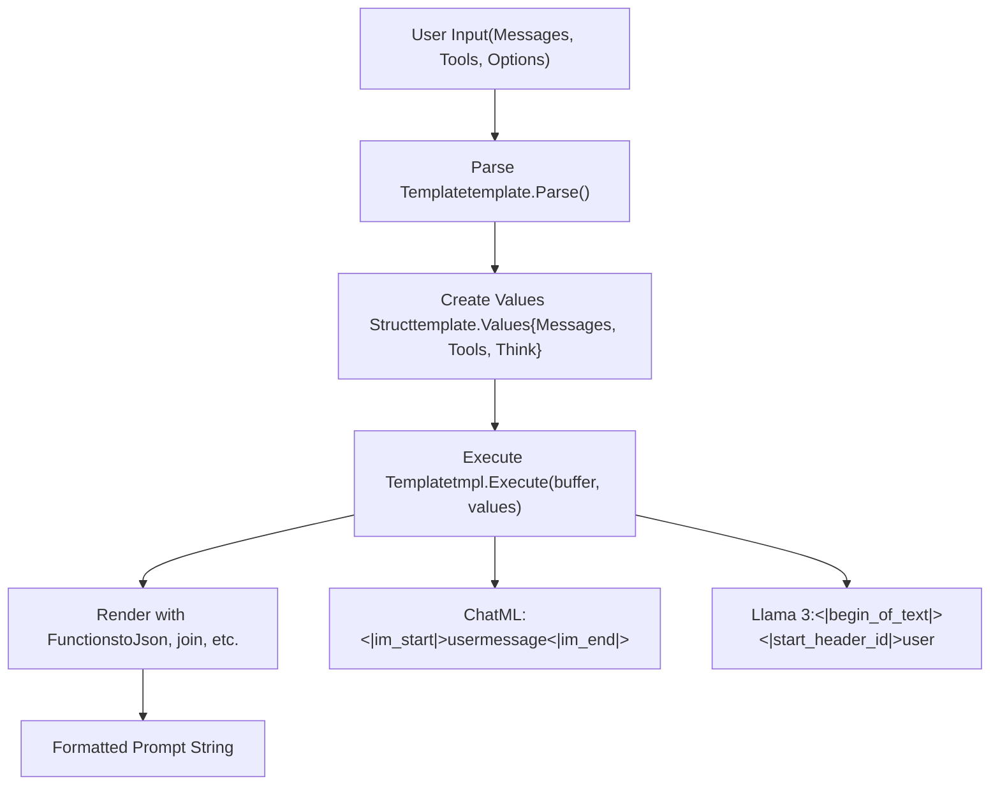
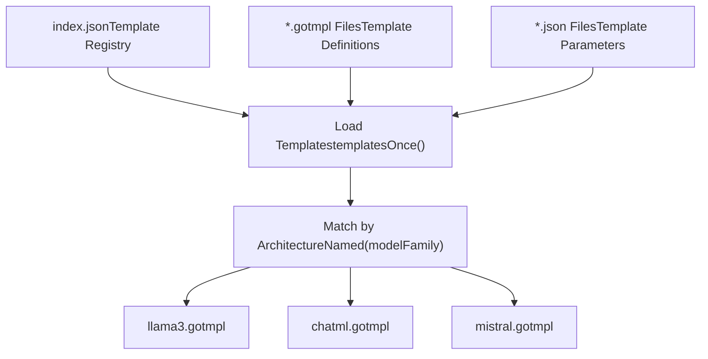
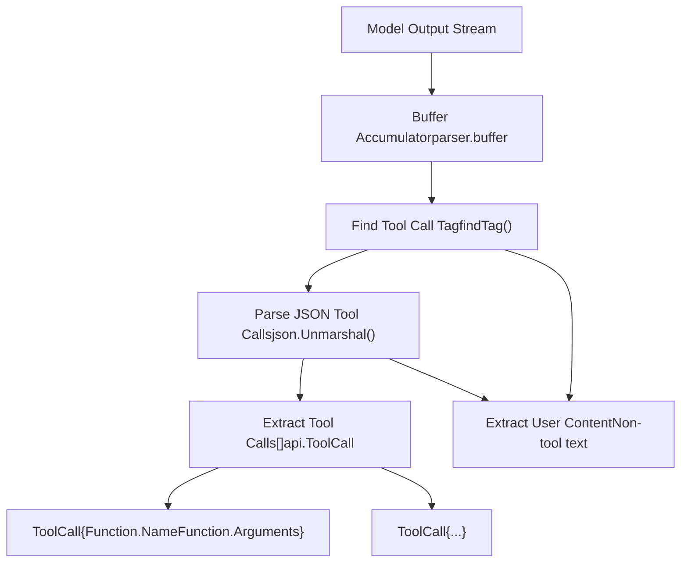
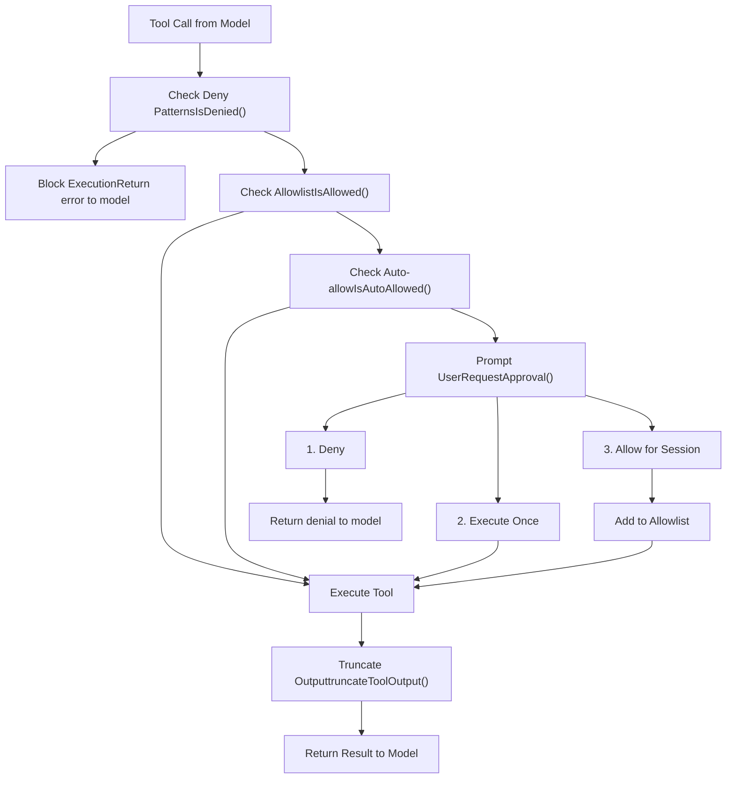
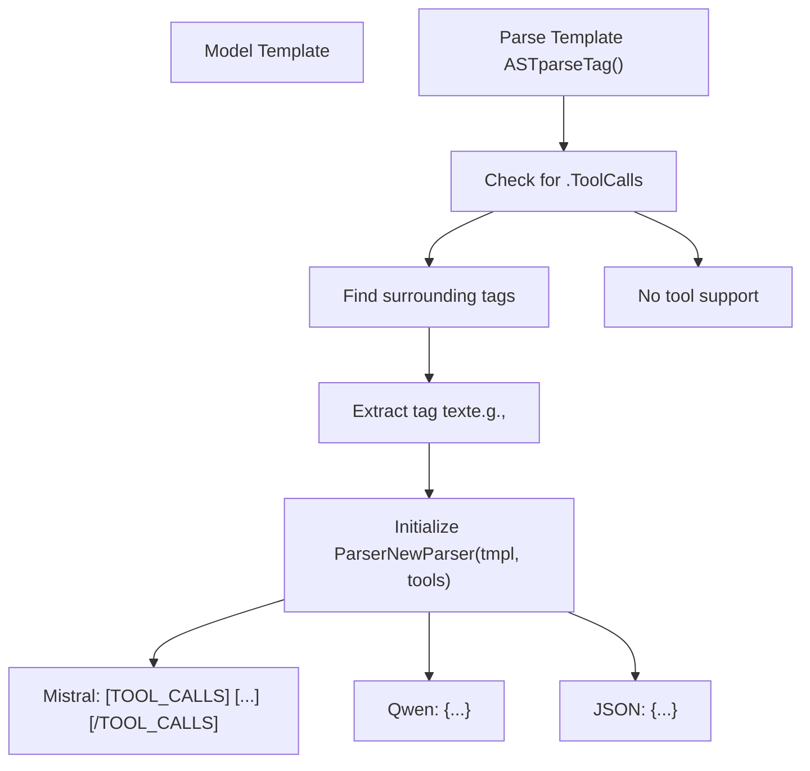
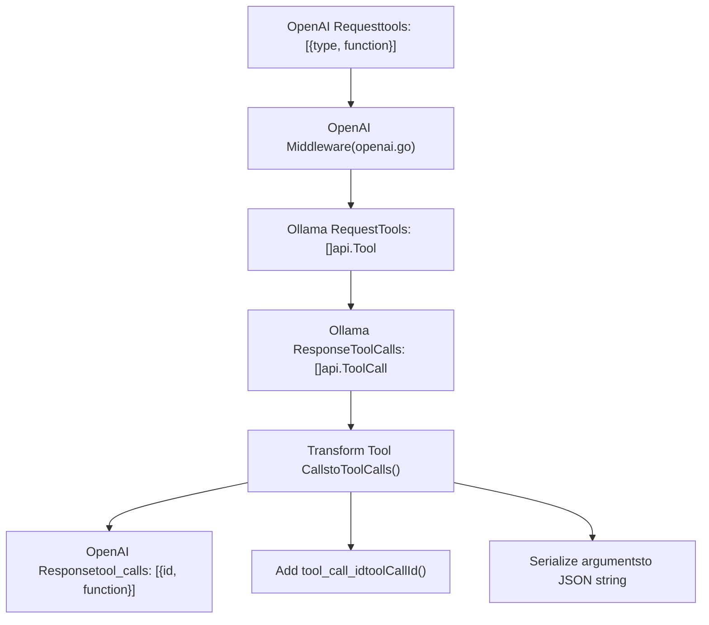
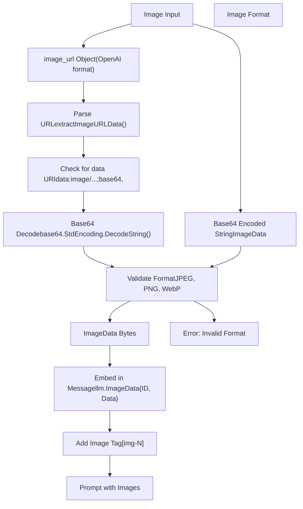
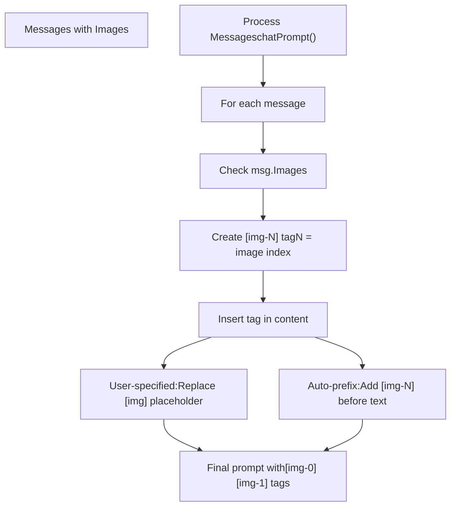
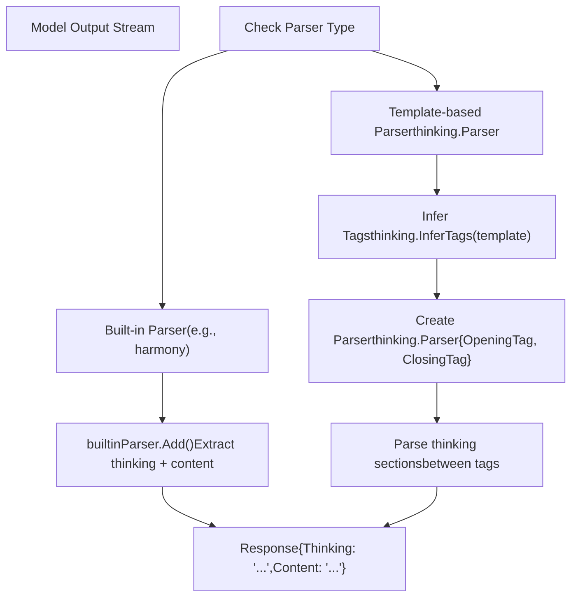

# 高级功能

相关源文件

-   [anthropic/anthropic.go](https://github.com/ollama/ollama/blob/562c76d7/anthropic/anthropic.go)
-   [anthropic/anthropic\_test.go](https://github.com/ollama/ollama/blob/562c76d7/anthropic/anthropic_test.go)
-   [api/client.go](https://github.com/ollama/ollama/blob/562c76d7/api/client.go)
-   [api/client\_test.go](https://github.com/ollama/ollama/blob/562c76d7/api/client_test.go)
-   [api/types.go](https://github.com/ollama/ollama/blob/562c76d7/api/types.go)
-   [cmd/cmd.go](https://github.com/ollama/ollama/blob/562c76d7/cmd/cmd.go)
-   [cmd/config/claude.go](https://github.com/ollama/ollama/blob/562c76d7/cmd/config/claude.go)
-   [cmd/config/config.go](https://github.com/ollama/ollama/blob/562c76d7/cmd/config/config.go)
-   [cmd/config/config\_test.go](https://github.com/ollama/ollama/blob/562c76d7/cmd/config/config_test.go)
-   [cmd/config/droid.go](https://github.com/ollama/ollama/blob/562c76d7/cmd/config/droid.go)
-   [cmd/config/droid\_test.go](https://github.com/ollama/ollama/blob/562c76d7/cmd/config/droid_test.go)
-   [cmd/config/integrations.go](https://github.com/ollama/ollama/blob/562c76d7/cmd/config/integrations.go)
-   [cmd/config/integrations\_test.go](https://github.com/ollama/ollama/blob/562c76d7/cmd/config/integrations_test.go)
-   [cmd/config/opencode.go](https://github.com/ollama/ollama/blob/562c76d7/cmd/config/opencode.go)
-   [cmd/config/opencode\_test.go](https://github.com/ollama/ollama/blob/562c76d7/cmd/config/opencode_test.go)
-   [cmd/config/selector.go](https://github.com/ollama/ollama/blob/562c76d7/cmd/config/selector.go)
-   [cmd/config/selector\_test.go](https://github.com/ollama/ollama/blob/562c76d7/cmd/config/selector_test.go)
-   [cmd/tui/tui.go](https://github.com/ollama/ollama/blob/562c76d7/cmd/tui/tui.go)
-   [middleware/anthropic.go](https://github.com/ollama/ollama/blob/562c76d7/middleware/anthropic.go)
-   [server/aliases.go](https://github.com/ollama/ollama/blob/562c76d7/server/aliases.go)
-   [server/images.go](https://github.com/ollama/ollama/blob/562c76d7/server/images.go)
-   [server/routes.go](https://github.com/ollama/ollama/blob/562c76d7/server/routes.go)
-   [server/routes\_aliases\_test.go](https://github.com/ollama/ollama/blob/562c76d7/server/routes_aliases_test.go)
-   [server/routes\_cloud\_test.go](https://github.com/ollama/ollama/blob/562c76d7/server/routes_cloud_test.go)

本文档介绍 Ollama 的高级能力：用于提示词格式化的模板系统、用于函数执行的工具调用、用于文本与图像联合处理的多模态支持、与外部工具和 IDE 的集成，以及用于结构化输入/输出的解析器与渲染器。关于基础生成与聊天功能，参见 [生成与聊天 API](/ollama/ollama/3.2-generation-and-chat-api)。关于模型管理，参见 [模型管理](/ollama/ollama/4-model-management)。

---

## 模板系统

Ollama 使用 Go 模板在将提示词发送给模型前进行格式化。模板会将用户消息、系统提示词与工具定义转换为每种模型架构所期望的特定格式。模板引擎实现于 [template/template.go](https://github.com/ollama/ollama/blob/562c76d7/template/template.go)，并在标准 Go 模板能力之外提供了自定义函数。

### 模板结构

模板针对包含以下字段的 `Values` 结构体执行：

| Field | Type | Description |
| --- | --- | --- |
| `Messages` | `[]api.Message` | 带角色与内容的对话历史 |
| `Tools` | `[]api.Tool` | 可用函数定义 |
| `System` | `string` | 系统提示词覆盖值 |
| `Prompt` | `string` | 单轮提示词文本 |
| `Suffix` | `string` | 插入点后的文本（用于 infill 模型） |
| `Think` | `bool` | 是否启用思考/推理输出 |
| `ThinkLevel` | `string` | 思考等级（"high"、"medium"、"low"） |
| `IsThinkSet` | `bool` | Think 是否被显式设置 |

模板在 [template/template.go173-217](https://github.com/ollama/ollama/blob/562c76d7/template/template.go#L173-L217) 中通过 `Execute` 方法解析并执行，该方法会使用提供的值渲染模板并将结果写入缓冲区。

### 自定义模板函数

模板引擎提供了超出 Go 标准库的附加函数：

| Function | Purpose | Example Usage |
| --- | --- | --- |
| `json` | 将任意值转换为 JSON 字符串 | `{{ .Tools | json }}` |
| `currentDate` | 获取当前日期，格式为 YYYY-MM-DD | `{{ currentDate }}` |
| `yesterdayDate` | 获取昨天日期，格式为 YYYY-MM-DD | `{{ yesterdayDate }}` |
| `toTypeScriptType` | 将工具属性转换为 TypeScript 类型字符串 | `{{ .Type | toTypeScriptType }}` |

模板引擎还支持所有标准 Go 模板函数，包括流程控制（`if`、`range`、`with`）、字符串操作（`printf`、`print`、`println`）以及比较（`eq`、`ne`、`lt`、`le`、`gt`、`ge`）。

Sources: [template/template.go120-143](https://github.com/ollama/ollama/blob/562c76d7/template/template.go#L120-L143)

### 模板执行流程


Sources: [template/template.go173-217](https://github.com/ollama/ollama/blob/562c76d7/template/template.go#L173-L217) [server/routes.go374-432](https://github.com/ollama/ollama/blob/562c76d7/server/routes.go#L374-L432) [server/prompt.go23-99](https://github.com/ollama/ollama/blob/562c76d7/server/prompt.go#L23-L99)

### 命名模板

Ollama 内置了面向常见模型架构的预定义模板。模板从嵌入文件加载，并根据架构名称与模型匹配：


匹配算法使用 Levenshtein 距离来寻找最接近的模板名称 [template/template.go72-101](https://github.com/ollama/ollama/blob/562c76d7/template/template.go#L72-L101)。每个模板可包含关联参数，例如停止序列 [template/template.go63-66](https://github.com/ollama/ollama/blob/562c76d7/template/template.go#L63-L66)。

Sources: [template/template.go23-56](https://github.com/ollama/ollama/blob/562c76d7/template/template.go#L23-L56) [template/template.go72-101](https://github.com/ollama/ollama/blob/562c76d7/template/template.go#L72-L101)

### 模板变量

模板可检查特定变量以启用功能：

| Variable Check | Purpose | Example |
| --- | --- | --- |
| `{{ if .Tools }}` | 渲染工具区块 | 用于工具调用的函数定义 |
| `{{ if .Suffix }}` | 渲染 infill 模式 | 带前缀和后缀的代码补全 |
| `{{ if .Think }}` | 启用思考输出 | 响应前先给出推理 |
| `{{ if .Messages }}` | 渲染对话 | 多轮聊天格式化 |

模板系统会根据引用了哪些变量自动检测能力。例如，若模板使用 `.Tools`，则该模型会被标记为支持工具调用 [server/images.go108-110](https://github.com/ollama/ollama/blob/562c76d7/server/images.go#L108-L110)。

Sources: [template/template.go](https://github.com/ollama/ollama/blob/562c76d7/template/template.go) [server/images.go73-136](https://github.com/ollama/ollama/blob/562c76d7/server/images.go#L73-L136)

---

## 工具调用与函数执行

工具调用使模型能够在生成过程中调用外部函数。模型会生成结构化工具调用请求，应用程序可执行后将结果返回给模型进行后续处理。Ollama 内置常见任务工具，也支持自定义工具定义。

### 内置工具

Ollama 通过 `x/tools` 包提供多个内置工具：

| Tool | Purpose | Implementation |
| --- | --- | --- |
| `bash` | 在沙箱环境中执行 shell 命令 | [x/tools/bash.go](https://github.com/ollama/ollama/blob/562c76d7/x/tools/bash.go) |
| `web_search` | 通过 ollama.com 搜索 API 进行网页搜索 | [x/tools/websearch.go58-104](https://github.com/ollama/ollama/blob/562c76d7/x/tools/websearch.go#L58-L104) |
| `web_fetch` | 抓取并提取网页内容 | [x/tools/websearch.go106-152](https://github.com/ollama/ollama/blob/562c76d7/x/tools/websearch.go#L106-L152) |

内置工具在 `DefaultRegistry()` 中注册 [x/tools/registry.go117-131](https://github.com/ollama/ollama/blob/562c76d7/x/tools/registry.go#L117-L131)，并可通过环境变量禁用：

-   `OLLAMA_AGENT_DISABLE_BASH=1` - 禁用 bash 工具
-   `OLLAMA_AGENT_DISABLE_WEBSEARCH=1` - 禁用 web search 工具

Sources: [x/tools/registry.go117-131](https://github.com/ollama/ollama/blob/562c76d7/x/tools/registry.go#L117-L131) [x/tools/bash.go](https://github.com/ollama/ollama/blob/562c76d7/x/tools/bash.go) [x/tools/websearch.go58-152](https://github.com/ollama/ollama/blob/562c76d7/x/tools/websearch.go#L58-L152)

### 工具注册表

`Registry` 类型用于管理可用工具 [x/tools/registry.go24-34](https://github.com/ollama/ollama/blob/562c76d7/x/tools/registry.go#L24-L34)。它提供注册、注销和执行工具的方法：

```
// Core registry operationsRegister(tool Tool)           // Add a toolUnregister(name string)       // Remove a tool by nameGet(name string) (Tool, bool) // Retrieve a toolHas(name string) bool         // Check if tool existsExecute(call api.ToolCall) (string, error) // Execute a tool callTools() api.Tools            // Get all tools in API format
```
工具必须实现 `Tool` 接口 [x/tools/registry.go13-22](https://github.com/ollama/ollama/blob/562c76d7/x/tools/registry.go#L13-L22)：

```
type Tool interface {    Name() string                    // Unique identifier    Description() string             // Human-readable description    Schema() api.ToolFunction        // Parameter schema for LLM    Execute(args map[string]any) (string, error) // Execute with arguments}
```
Sources: [x/tools/registry.go13-34](https://github.com/ollama/ollama/blob/562c76d7/x/tools/registry.go#L13-L34) [x/tools/registry.go93-100](https://github.com/ollama/ollama/blob/562c76d7/x/tools/registry.go#L93-L100)

### 工具定义格式

工具通过 JSON Schema 定义函数签名：

```
// From api/types.go:203-321type Tool struct {    Type     string       // "function"    Function ToolFunction} type ToolFunction struct {    Name        string    Description string    Parameters  ToolFunctionParameters} type ToolFunctionParameters struct {    Type       string                  // "object"    Required   []string                // Required parameter names    Properties map[string]ToolProperty // Parameter definitions} type ToolProperty struct {    Type        PropertyType // "string", "number", "boolean", etc.    Description string    Enum        []any // Valid values (optional)}
```
工具会在聊天请求中传入 [api/types.go132-133](https://github.com/ollama/ollama/blob/562c76d7/api/types.go#L132-L133)，并通过模板渲染到提示词中 [server/prompt.go23-99](https://github.com/ollama/ollama/blob/562c76d7/server/prompt.go#L23-L99)。

Sources: [api/types.go203-321](https://github.com/ollama/ollama/blob/562c76d7/api/types.go#L203-L321) [api/types.go148-153](https://github.com/ollama/ollama/blob/562c76d7/api/types.go#L148-L153)

### 工具调用解析

工具解析器会从模型输出中提取结构化工具调用：


解析器在 [tools/tools.go12-18](https://github.com/ollama/ollama/blob/562c76d7/tools/tools.go#L12-L18) 中定义了三种状态：

1.  `toolsState_LookingForTag`：搜索工具调用分隔符
2.  `toolsState_ToolCalling`：位于工具调用块内，累积 JSON
3.  `toolsState_Done`：工具调用解析完成

Sources: [tools/tools.go12-70](https://github.com/ollama/ollama/blob/562c76d7/tools/tools.go#L12-L70) [tools/tools.go34-57](https://github.com/ollama/ollama/blob/562c76d7/tools/tools.go#L34-L57)

### 工具审批系统

在交互式代理模式（`ollama run --experimental`）下，工具调用在执行前需要用户审批。审批系统实现了安全检查和用户确认 [x/agent/approval.go138-151](https://github.com/ollama/ollama/blob/562c76d7/x/agent/approval.go#L138-L151)。

#### 审批流程


审批管理器会维护会话级 allowlist [x/agent/approval.go138-151](https://github.com/ollama/ollama/blob/562c76d7/x/agent/approval.go#L138-L151)，并支持相关命令的前缀匹配 [x/agent/approval.go200-300](https://github.com/ollama/ollama/blob/562c76d7/x/agent/approval.go#L200-L300)。

Sources: [x/agent/approval.go138-194](https://github.com/ollama/ollama/blob/562c76d7/x/agent/approval.go#L138-L194) [x/agent/approval.go200-300](https://github.com/ollama/ollama/blob/562c76d7/x/agent/approval.go#L200-L300) [x/cmd/run.go346-414](https://github.com/ollama/ollama/blob/562c76d7/x/cmd/run.go#L346-L414)

#### 安全机制

审批系统实现了三层安全机制：

**Auto-allowed Commands** [x/agent/approval.go62-92](https://github.com/ollama/ollama/blob/562c76d7/x/agent/approval.go#L62-L92) - 从不需要审批的安全只读命令：

-   基本信息：`pwd`、`echo`、`date`、`whoami`、`hostname`、`uname`
-   Git 只读操作：`git status`、`git log`、`git diff`、`git branch`
-   包管理器只读：`npm list`、`pip list`、`go list`
-   构建命令：`go build`、`go test`、`make`、`cargo build`

**Deny Patterns** [x/agent/approval.go95-122](https://github.com/ollama/ollama/blob/562c76d7/x/agent/approval.go#L95-L122) - 始终阻断的危险模式：

-   破坏性：`rm -rf`、`mkfs`、`dd if=`、`shred`
-   权限提升：`sudo`、`chmod 777`、`chown`
-   网络外传：`curl -d`、`wget --post`、`nc`、`scp`
-   凭据访问：`.ssh/id_rsa`、`.aws/credentials`、`/etc/shadow`

**Prefix Allowlisting** [x/agent/approval.go200-285](https://github.com/ollama/ollama/blob/562c76d7/x/agent/approval.go#L200-L285) - 允许指定目录上的命令：

-   从已批准命令中的路径提取（例如 `cat tools/file.go` → 允许 `cat:tools/`）
-   防止目录穿越（拒绝 `../` 逃逸）
-   为安全起见限制在当前工作目录作用域

Sources: [x/agent/approval.go62-122](https://github.com/ollama/ollama/blob/562c76d7/x/agent/approval.go#L62-L122) [x/agent/approval.go200-285](https://github.com/ollama/ollama/blob/562c76d7/x/agent/approval.go#L200-L285)

### 工具调用执行流程

> **[Mermaid sequence]**
> *(图表结构无法解析)*

Sources: [server/routes.go1540-1733](https://github.com/ollama/ollama/blob/562c76d7/server/routes.go#L1540-L1733) [tools/tools.go46-70](https://github.com/ollama/ollama/blob/562c76d7/tools/tools.go#L46-L70) [server/prompt.go99-117](https://github.com/ollama/ollama/blob/562c76d7/server/prompt.go#L99-L117) [x/cmd/run.go336-463](https://github.com/ollama/ollama/blob/562c76d7/x/cmd/run.go#L336-L463)

### 工具调用格式检测

不同模型使用不同工具调用格式。解析器会通过分析模板来检测格式：


标签会通过遍历模板解析树并识别 `{{ .ToolCalls }}` 相邻文本节点来提取 [tools/tools.go82-137](https://github.com/ollama/ollama/blob/562c76d7/tools/tools.go#L82-L137)。

Sources: [tools/tools.go82-137](https://github.com/ollama/ollama/blob/562c76d7/tools/tools.go#L82-L137) [tools/tools.go34-44](https://github.com/ollama/ollama/blob/562c76d7/tools/tools.go#L34-L44)

### Bash 工具实现

bash 工具会在安全约束下执行 shell 命令 [x/tools/bash.go](https://github.com/ollama/ollama/blob/562c76d7/x/tools/bash.go)：

```
// Bash tool schemaName: "bash"Parameters: {    Type: "object",    Required: ["command"],    Properties: {        "command": {Type: "string", Description: "Shell command to execute"}    }}
```
**执行环境：**

-   工作目录：当前目录（`os.Getwd()`）
-   Shell：系统 shell（Unix 为 `/bin/sh`，Windows 为 `cmd.exe`）
-   输出捕获：合并 stdout 与 stderr
-   超时：每次执行可配置

**安全特性：**

-   不自动进行权限提升
-   输出截断以防上下文溢出 [x/cmd/run.go66-79](https://github.com/ollama/ollama/blob/562c76d7/x/cmd/run.go#L66-L79)
-   与审批系统集成以处理危险命令
-   当前工作目录作用域（不自动访问父目录）

Sources: [x/tools/bash.go](https://github.com/ollama/ollama/blob/562c76d7/x/tools/bash.go) [x/cmd/run.go66-79](https://github.com/ollama/ollama/blob/562c76d7/x/cmd/run.go#L66-L79)

### Web 搜索工具

Ollama 通过 ollama.com 搜索 API 提供网页搜索能力：

**web\_search Tool** [x/tools/websearch.go58-104](https://github.com/ollama/ollama/blob/562c76d7/x/tools/websearch.go#L58-L104)

```
Parameters: {    "query": "Search query string",    "num_results": "Number of results (default: 5, max: 10)"}
```
返回带标题、URL 和摘要的格式化搜索结果。

**web\_fetch Tool** [x/tools/websearch.go106-152](https://github.com/ollama/ollama/blob/562c76d7/x/tools/websearch.go#L106-L152)

```
Parameters: {    "url": "URL to fetch content from"}
```
使用 Jina Reader API 抓取网页并提取可读内容。

**认证：** Web 搜索工具需要通过 `ollama signin` 完成认证 [x/cmd/run.go82-121](https://github.com/ollama/ollama/blob/562c76d7/x/cmd/run.go#L82-L121)：

1.  401 错误时显示登录 URL
2.  轮询 `/api/whoami` 端点直到认证成功
3.  重试搜索请求

Sources: [x/tools/websearch.go20-152](https://github.com/ollama/ollama/blob/562c76d7/x/tools/websearch.go#L20-L152) [x/cmd/run.go82-121](https://github.com/ollama/ollama/blob/562c76d7/x/cmd/run.go#L82-L121)

### OpenAI 兼容工具调用

OpenAI 兼容层会在 OpenAI 与 Ollama 格式之间转换工具调用：


转换会添加 OpenAI 特有字段，例如 `tool_call_id` [openai/openai.go231-257](https://github.com/ollama/ollama/blob/562c76d7/openai/openai.go#L231-L257)，并序列化函数参数 [openai/openai.go248-254](https://github.com/ollama/ollama/blob/562c76d7/openai/openai.go#L248-L254)。

Sources: [openai/openai.go92-109](https://github.com/ollama/ollama/blob/562c76d7/openai/openai.go#L92-L109) [openai/openai.go231-257](https://github.com/ollama/ollama/blob/562c76d7/openai/openai.go#L231-L257) [openai/openai.go259-282](https://github.com/ollama/ollama/blob/562c76d7/openai/openai.go#L259-L282)

---

## 多模态与视觉支持

Ollama 支持可同时处理图像与文本的多模态模型。图像会被编码为 base64 数据，并通过视觉模型可识别的特殊标签嵌入到提示词中。

### 图像数据格式

图像在 API 中以字节数组表示并传递：

```
// From api/types.go:54-55type ImageData []byte // Messages can contain both text and images// From api/types.go:163-172type Message struct {    Role      string    Content   string    Images    []ImageData    // Base64-encoded image data    ToolCalls []ToolCall}
```
请求中接受图像有两种方式：

1.  以消息内容中的 base64 编码数据形式传入 [openai/openai.go413-445](https://github.com/ollama/ollama/blob/562c76d7/openai/openai.go#L413-L445)
2.  以消息中的独立 `Images` 数组传入 [api/types.go169](https://github.com/ollama/ollama/blob/562c76d7/api/types.go#L169-L169)

Sources: [api/types.go54-55](https://github.com/ollama/ollama/blob/562c76d7/api/types.go#L54-L55) [api/types.go163-172](https://github.com/ollama/ollama/blob/562c76d7/api/types.go#L163-L172)

### 图像处理流水线


图像校验会通过检查解码后的数据来识别支持格式 [openai/openai.go420-445](https://github.com/ollama/ollama/blob/562c76d7/openai/openai.go#L420-L445)。WebP 图像会被特殊处理 [server/routes.go29](https://github.com/ollama/ollama/blob/562c76d7/server/routes.go#L29-L29)。

Sources: [openai/openai.go413-465](https://github.com/ollama/ollama/blob/562c76d7/openai/openai.go#L413-L465) [server/routes.go368-371](https://github.com/ollama/ollama/blob/562c76d7/server/routes.go#L368-L371) [server/routes.go400-406](https://github.com/ollama/ollama/blob/562c76d7/server/routes.go#L400-L406)

### 图像标签嵌入

图像通过编号标签嵌入到提示词中：


图像嵌入逻辑位于 [server/prompt.go72-96](https://github.com/ollama/ollama/blob/562c76d7/server/prompt.go#L72-L96)。若用户消息中包含 `[img]`，会被替换为 `[img-N]`；否则图像标签会前置到消息内容之前。

Sources: [server/prompt.go72-96](https://github.com/ollama/ollama/blob/562c76d7/server/prompt.go#L72-L96) [server/routes.go400-406](https://github.com/ollama/ollama/blob/562c76d7/server/routes.go#L400-L406)

### 视觉模型支持

视觉模型通过多种机制检测：

| Detection Method | Implementation | Location |
| --- | --- | --- |
| Projector paths | `len(m.ProjectorPaths) > 0` | [server/images.go118-120](https://github.com/ollama/ollama/blob/562c76d7/server/images.go#L118-L120) |
| Vision capability | `model.CapabilityVision` in capabilities list | [server/images.go88-90](https://github.com/ollama/ollama/blob/562c76d7/server/images.go#L88-L90) |
| Vision metadata | `"vision.block_count"` in GGUF metadata | [server/images.go88-90](https://github.com/ollama/ollama/blob/562c76d7/server/images.go#L88-L90) |
| Template variable | Template uses image-related variables | [server/routes.go431-444](https://github.com/ollama/ollama/blob/562c76d7/server/routes.go#L431-L444) |

为兼容 OpenAI，系统会检查模型详情中的 `ProjectorInfo` [cmd/cmd.go436-444](https://github.com/ollama/ollama/blob/562c76d7/cmd/cmd.go#L436-L444)。

Sources: [server/images.go73-136](https://github.com/ollama/ollama/blob/562c76d7/server/images.go#L73-L136) [cmd/cmd.go436-444](https://github.com/ollama/ollama/blob/562c76d7/cmd/cmd.go#L436-L444)

### 多模态请求示例

> **[Mermaid sequence]**
> *(图表结构无法解析)*

某些模型（如 `mllama`）仅支持单张图像 [server/routes.go363-366](https://github.com/ollama/ollama/blob/562c76d7/server/routes.go#L363-L366)，会在处理前进行校验。

Sources: [server/routes.go1540-1733](https://github.com/ollama/ollama/blob/562c76d7/server/routes.go#L1540-L1733) [server/routes.go363-366](https://github.com/ollama/ollama/blob/562c76d7/server/routes.go#L363-L366) [server/prompt.go23-99](https://github.com/ollama/ollama/blob/562c76d7/server/prompt.go#L23-L99)

### 图像格式支持

支持的图像格式与处理方式：

```
// Supported MIME types"image/jpeg" - JPEG images"image/jpg"  - JPEG images (alternate)"image/png"  - PNG images  "image/webp" - WebP images (requires golang.org/x/image/webp)
```
WebP 支持在 [server/routes.go29](https://github.com/ollama/ollama/blob/562c76d7/server/routes.go#L29-L29) 中显式导入，并由 `golang.org/x/image/webp` 包处理。OpenAI 风格请求中的图像在嵌入时会从 base64 解码 [openai/openai.go420-445](https://github.com/ollama/ollama/blob/562c76d7/openai/openai.go#L420-L445)。

Sources: [server/routes.go29](https://github.com/ollama/ollama/blob/562c76d7/server/routes.go#L29-L29) [openai/openai.go413-465](https://github.com/ollama/ollama/blob/562c76d7/openai/openai.go#L413-L465)

---

## 思考/推理模型

某些模型支持在生成响应前进行显式思考或推理步骤。该特性允许模型展示其推理过程。

### 思考配置

可通过 `Think` 参数启用思考：

```
// From api/types.go:103-107Think *ThinkValue `json:"think,omitempty"` // ThinkValue can be:// - Boolean: true/false// - String: "high", "medium", "low" (for models supporting levels)
```
思考配置会透传到模板中 [template/template.go61-81](https://github.com/ollama/ollama/blob/562c76d7/template/template.go#L61-L81)，并影响提示词渲染 [server/routes.go408-413](https://github.com/ollama/ollama/blob/562c76d7/server/routes.go#L408-L413)。

Sources: [api/types.go103-107](https://github.com/ollama/ollama/blob/562c76d7/api/types.go#L103-L107) [api/types.go139-141](https://github.com/ollama/ollama/blob/562c76d7/api/types.go#L139-L141) [template/template.go61-81](https://github.com/ollama/ollama/blob/562c76d7/template/template.go#L61-L81)

### 思考输出解析


思考解析器会将推理文本与最终响应内容分离。标签由模板推断 [server/routes.go449-459](https://github.com/ollama/ollama/blob/562c76d7/server/routes.go#L449-L459)，或由内置解析器提供 [server/routes.go310-321](https://github.com/ollama/ollama/blob/562c76d7/server/routes.go#L310-L321)。

Sources: [server/routes.go447-500](https://github.com/ollama/ollama/blob/562c76d7/server/routes.go#L447-L500) [thinking/thinking.go](https://github.com/ollama/ollama/blob/562c76d7/thinking/thinking.go)

### 思考能力检测

模型通过能力声明其思考支持：

```
// From server/images.go:127-133openingTag, closingTag := thinking.InferTags(m.Template.Template)hasTags := openingTag != "" && closingTag != ""isGptoss := slices.Contains([]string{"gptoss", "gpt-oss"}, m.Config.ModelFamily)if hasTags || isGptoss || (builtinParser != nil && builtinParser.HasThinkingSupport()) {    capabilities = append(capabilities, model.CapabilityThinking)}
```
在允许思考请求前会先检查该能力 [server/routes.go324-338](https://github.com/ollama/ollama/blob/562c76d7/server/routes.go#L324-L338)。

Sources: [server/images.go127-133](https://github.com/ollama/ollama/blob/562c76d7/server/images.go#L127-L133) [server/routes.go324-338](https://github.com/ollama/ollama/blob/562c76d7/server/routes.go#L324-L338)
