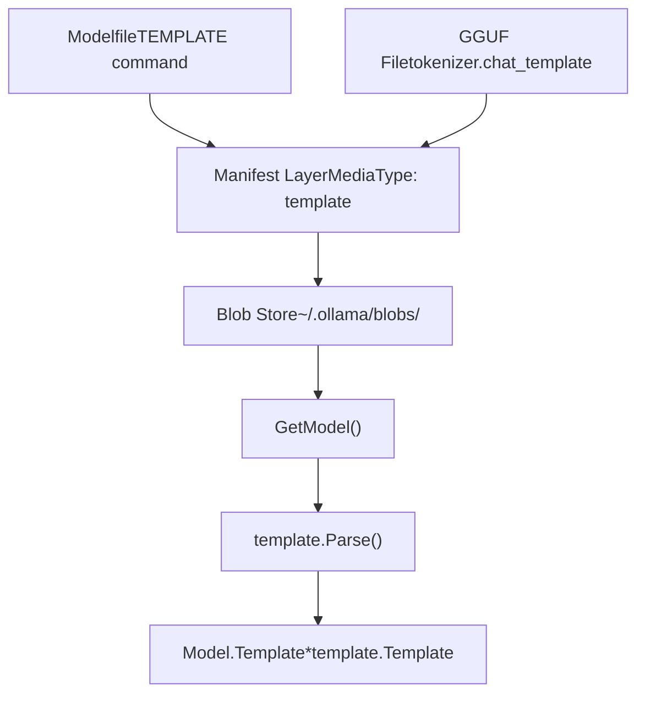
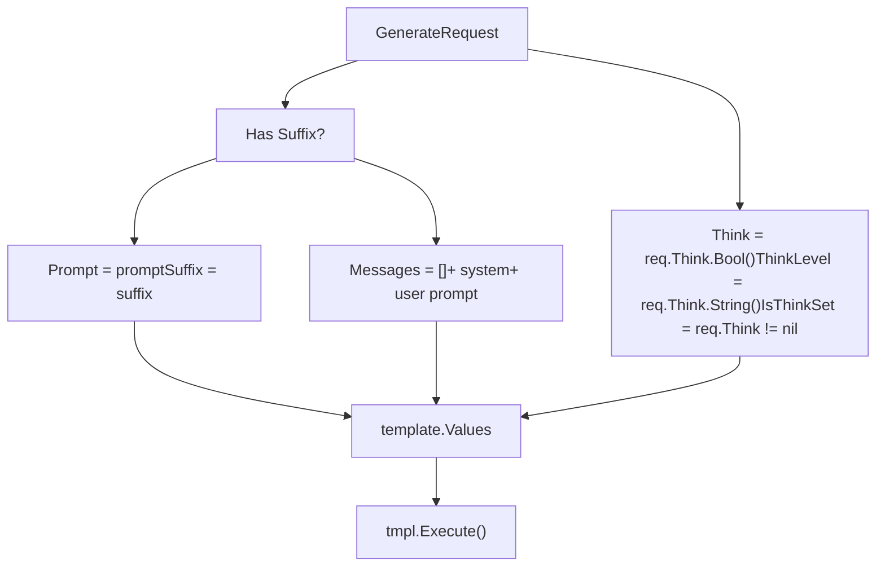
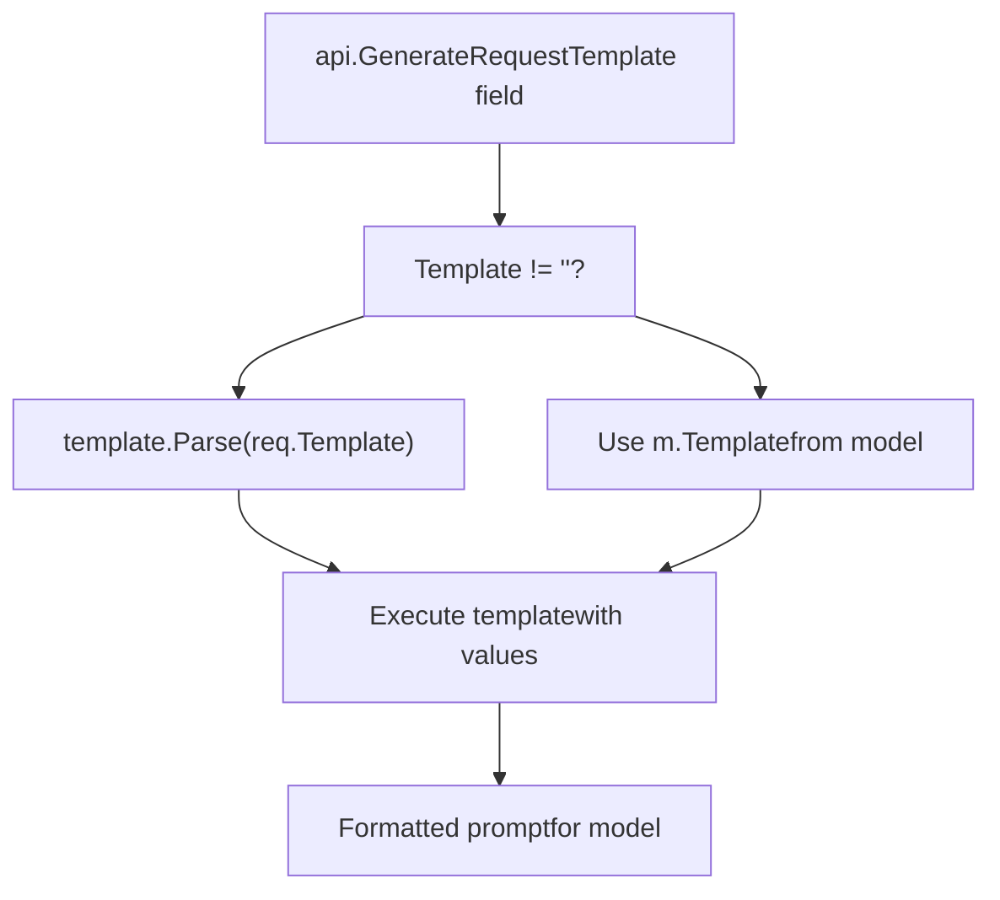
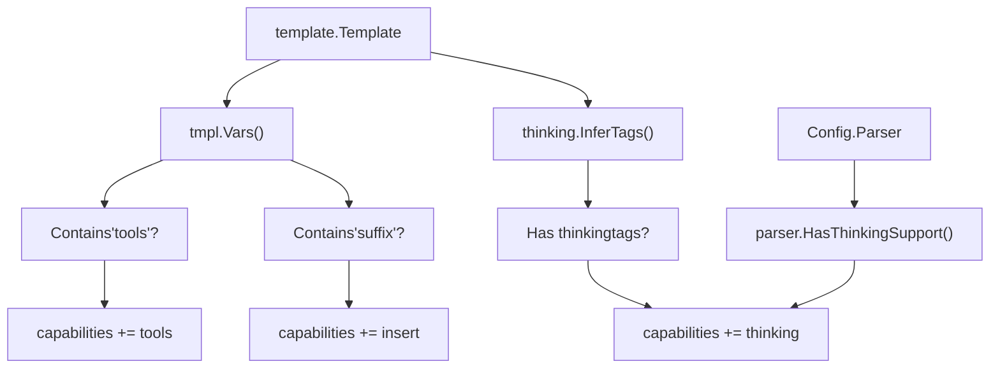
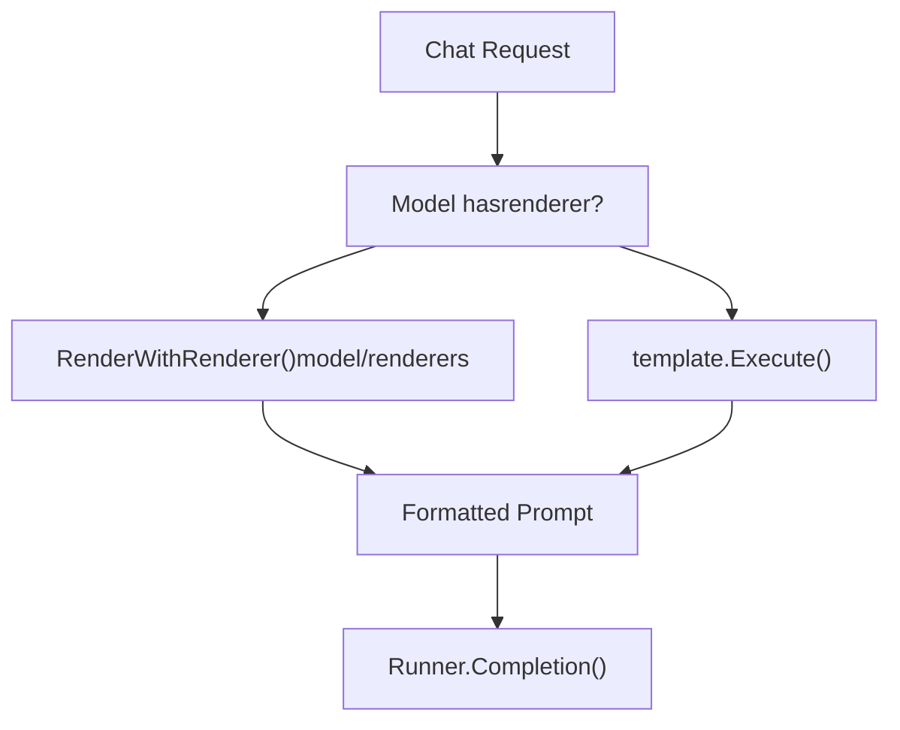
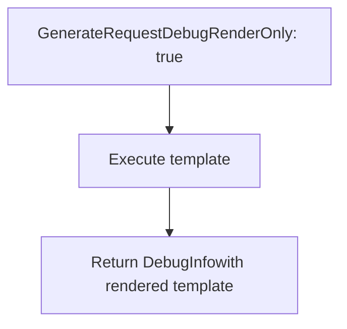

# 模板系统

相关源文件

-   [api/client.go](https://github.com/ollama/ollama/blob/562c76d7/api/client.go)
-   [api/client\_test.go](https://github.com/ollama/ollama/blob/562c76d7/api/client_test.go)
-   [api/types.go](https://github.com/ollama/ollama/blob/562c76d7/api/types.go)
-   [cmd/cmd.go](https://github.com/ollama/ollama/blob/562c76d7/cmd/cmd.go)
-   [convert/convert.go](https://github.com/ollama/ollama/blob/562c76d7/convert/convert.go)
-   [fs/ggml/ggml.go](https://github.com/ollama/ollama/blob/562c76d7/fs/ggml/ggml.go)
-   [fs/ggml/ggml\_test.go](https://github.com/ollama/ollama/blob/562c76d7/fs/ggml/ggml_test.go)
-   [model/models/models.go](https://github.com/ollama/ollama/blob/562c76d7/model/models/models.go)
-   [model/parsers/parsers.go](https://github.com/ollama/ollama/blob/562c76d7/model/parsers/parsers.go)
-   [model/parsers/parsers\_test.go](https://github.com/ollama/ollama/blob/562c76d7/model/parsers/parsers_test.go)
-   [model/renderers/glmocr.go](https://github.com/ollama/ollama/blob/562c76d7/model/renderers/glmocr.go)
-   [model/renderers/glmocr\_test.go](https://github.com/ollama/ollama/blob/562c76d7/model/renderers/glmocr_test.go)
-   [model/renderers/renderer.go](https://github.com/ollama/ollama/blob/562c76d7/model/renderers/renderer.go)
-   [server/images.go](https://github.com/ollama/ollama/blob/562c76d7/server/images.go)
-   [server/routes.go](https://github.com/ollama/ollama/blob/562c76d7/server/routes.go)

## 概述

Ollama 中的模板系统会将高层的聊天消息与提示词转换为不同语言模型所期望的特定文本格式。各模型家族（Llama、Gemma、Qwen 等）使用不同的特殊 token 和格式约定，而模板系统通过 Go 模板语法提供了灵活机制来处理这些差异。

关于模板如何与思考/推理输出交互的信息，参见 [思考模型与推理](/ollama/ollama/5.5-thinking-models-and-reasoning)。关于模板内工具调用格式的细节，参见 [工具调用与函数执行](/ollama/ollama/7.2-tool-calling-and-function-execution)。

**来源：** [server/routes.go1-658](https://github.com/ollama/ollama/blob/562c76d7/server/routes.go#L1-L658) [server/images.go57-73](https://github.com/ollama/ollama/blob/562c76d7/server/images.go#L57-L73) [api/types.go62-144](https://github.com/ollama/ollama/blob/562c76d7/api/types.go#L62-L144)

## 模板存储与检索

### 模型清单中的模板存储

模板以独立层存储在模型清单中，媒体类型为 `application/vnd.ollama.image.template`。加载模型时，会从 blob 存储读取模板并解析为 `template.Template` 对象。

**图示：模板加载流程**

`GetModel()` 函数（位于 [server/images.go275-373](https://github.com/ollama/ollama/blob/562c76d7/server/images.go#L275-L373)）会从清单层加载模板。当某层的媒体类型为 `"application/vnd.ollama.image.template"` 或已弃用的 `"application/vnd.ollama.image.prompt"` 时，会在第 324-334 行读取并解析模板内容。

**来源：** [server/images.go324-334](https://github.com/ollama/ollama/blob/562c76d7/server/images.go#L324-L334) [server/images.go286](https://github.com/ollama/ollama/blob/562c76d7/server/images.go#L286-L286)

### 默认模板

如果未显式提供模板，模型会使用 `DefaultTemplate`，如 [server/images.go286](https://github.com/ollama/ollama/blob/562c76d7/server/images.go#L286-L286) 所示。这确保即使未指定模板，每个模型也具备可用模板。

**来源：** [server/images.go286](https://github.com/ollama/ollama/blob/562c76d7/server/images.go#L286-L286)

### 从 GGUF 元数据提取模板

模板也可作为 tokenizer 元数据嵌入在 GGUF 模型文件中。GGUF 键值存储中的 `tokenizer.chat_template` 键包含模板字符串，会在模型转换期间被提取。

**来源：** [convert/convert.go146](https://github.com/ollama/ollama/blob/562c76d7/convert/convert.go#L146-L146) [fs/ggml/ggml.go141-143](https://github.com/ollama/ollama/blob/562c76d7/fs/ggml/ggml.go#L141-L143)

## 模板变量

模板通过 `template.Values` 结构体执行，该结构体为模型特定格式化提供变量。可用变量如下：

| 变量 | 类型 | 用途 |
| --- | --- | --- |
| `Messages` | `[]api.Message` | 多轮对话的聊天消息历史 |
| `Prompt` | `string` | 单轮补全的用户提示词 |
| `Suffix` | `string` | 补全/插入任务中光标后的文本 |
| `Tools` | `[]api.Tool` | 工具调用可用的函数定义 |
| `Think` | `bool` | 是否启用思考/推理 |
| `ThinkLevel` | `string` | 思考强度级别（"high"、"medium"、"low"） |
| `IsThinkSet` | `bool` | 是否显式设置了 Think 参数 |

**来源：** [server/routes.go434-462](https://github.com/ollama/ollama/blob/562c76d7/server/routes.go#L434-L462)

### 生成请求中的变量填充

对于 `/api/generate` 请求，模板变量在 [server/routes.go434-462](https://github.com/ollama/ollama/blob/562c76d7/server/routes.go#L434-L462) 处填充：

**图示：模板变量填充**

系统消息来自请求（`req.System`）或模型默认值（`m.System`），如第 440-443 行所示。用户消息由提示词内容与附带图片构建。

**来源：** [server/routes.go434-462](https://github.com/ollama/ollama/blob/562c76d7/server/routes.go#L434-L462)

## 模板执行流程

### 从请求到提示词渲染

模板执行流程通过多个阶段将 API 请求转换为模型可用提示词：

> **[Mermaid 时序图]**
> *(图表结构无法解析)*

**图示：模板执行时序**

[server/routes.go480-501](https://github.com/ollama/ollama/blob/562c76d7/server/routes.go#L480-L501) 处的关键决策点决定使用类聊天流程（支持渲染器和更好的多轮处理）还是旧版模板执行流程。

**来源：** [server/routes.go423-501](https://github.com/ollama/ollama/blob/562c76d7/server/routes.go#L423-L501)

### 模板覆盖机制

模板可以通过 `GenerateRequest` 中的 `Template` 字段在请求时被覆盖：

**图示：模板选择逻辑**

该覆盖能力在 [server/routes.go425-432](https://github.com/ollama/ollama/blob/562c76d7/server/routes.go#L425-L432) 处实现，使调用方无需修改模型本身即可试验不同提示词格式。

**来源：** [server/routes.go425-432](https://github.com/ollama/ollama/blob/562c76d7/server/routes.go#L425-L432) [api/types.go76](https://github.com/ollama/ollama/blob/562c76d7/api/types.go#L76-L76)

### 原始模式

当请求中设置 `Raw: true` 时，会在 [server/routes.go355-358](https://github.com/ollama/ollama/blob/562c76d7/server/routes.go#L355-L358) 完全跳过模板执行。该模式要求不设置 template、system 与 context 字段，并将提示词直接传给模型，不做任何格式化。

**来源：** [server/routes.go355-358](https://github.com/ollama/ollama/blob/562c76d7/server/routes.go#L355-L358)

## 基于模板的能力检测

模板系统会通过分析模板结构参与模型能力检测。[server/images.go78-145](https://github.com/ollama/ollama/blob/562c76d7/server/images.go#L78-L145) 处的 `Capabilities()` 方法会检查模板以确定支持特性：

| 能力 | 检测方式 |
| --- | --- |
| `tools` | 模板包含 `tools` 变量，或使用支持工具的解析器 |
| `insert` | 模板包含 `suffix` 变量 |
| `thinking` | 模板具有思考标签，或使用思考解析器 |

**能力检测逻辑示例：**

**图示：基于模板的能力检测**

**来源：** [server/images.go111-143](https://github.com/ollama/ollama/blob/562c76d7/server/images.go#L111-L143)

## 聊天模板格式检测

### GGUF 聊天模板提取

聊天模板会在模型转换期间从 GGUF 文件中提取。[fs/ggml/ggml.go141-143](https://github.com/ollama/ollama/blob/562c76d7/fs/ggml/ggml.go#L141-L143) 处的 `ChatTemplate()` 方法会从 GGUF 键值存储中的 `tokenizer.chat_template` 键检索模板字符串。

在从 HuggingFace/Safetensors 格式转换到 GGUF 时，模板会在 [convert/convert.go145-147](https://github.com/ollama/ollama/blob/562c76d7/convert/convert.go#L145-L147) 的 tokenizer 配置中保留。

**来源：** [fs/ggml/ggml.go141-143](https://github.com/ollama/ollama/blob/562c76d7/fs/ggml/ggml.go#L141-L143) [convert/convert.go145-147](https://github.com/ollama/ollama/blob/562c76d7/convert/convert.go#L145-L147)

### 模板变量分析

模板的 `Vars()` 方法会返回模板引用的变量名列表。这用于上述能力检测，例如检查是否存在 `tools`、`suffix` 以及消息相关变量。

**来源：** [server/images.go113-116](https://github.com/ollama/ollama/blob/562c76d7/server/images.go#L113-L116)

## 渲染器与解析器集成

模板系统与两个专门子系统集成，用于高级模型特定处理：

### 渲染器系统

渲染器为 Go 模板提供替代方案，适用于需要复杂格式逻辑的模型。当模型设置了 `Config.Renderer` 时，对于聊天请求会优先使用渲染器而不是模板执行。

**图示：渲染器与模板选择**

可用渲染器注册于 [model/renderers/renderer.go45-97](https://github.com/ollama/ollama/blob/562c76d7/model/renderers/renderer.go#L45-L97)，包括 `qwen3-vl-instruct`、`deepseek3.1`、`glm-ocr` 等模型的专用实现。

**来源：** [model/renderers/renderer.go1-98](https://github.com/ollama/ollama/blob/562c76d7/model/renderers/renderer.go#L1-L98)

### 解析器系统

解析器处理模型特定输出格式解析，包括工具调用提取和思考块检测。解析器通过 `Config.Parser` 指定，并在 [server/routes.go360-371](https://github.com/ollama/ollama/blob/562c76d7/server/routes.go#L360-L371) 与模板执行集成。

例如，在 [server/routes.go67-77](https://github.com/ollama/ollama/blob/562c76d7/server/routes.go#L67-L77) 检测到特定标签时，`gptoss` 模型会使用 harmony 解析器。

**来源：** [server/routes.go360-371](https://github.com/ollama/ollama/blob/562c76d7/server/routes.go#L360-L371) [model/parsers/parsers.go41-90](https://github.com/ollama/ollama/blob/562c76d7/model/parsers/parsers.go#L41-L90)

## 调试与开发功能

### 调试渲染模式

`GenerateRequest` 中的 `DebugRenderOnly` 标志允许开发者在不执行模型的情况下查看渲染后的模板。当其设置为 `true` 时，系统会在 [server/routes.go504-514](https://github.com/ollama/ollama/blob/562c76d7/server/routes.go#L504-L514) 的响应中返回格式化提示词。

**图示：调试渲染流程**

该功能可用于排查模板格式问题，而无需消耗模型推理资源。

**来源：** [server/routes.go504-514](https://github.com/ollama/ollama/blob/562c76d7/server/routes.go#L504-L514) [api/types.go119-121](https://github.com/ollama/ollama/blob/562c76d7/api/types.go#L119-L121)

## 模板错误处理

模板解析与执行可能以多种方式失败：

| 错误类型 | 处理方式 | 位置 |
| --- | --- | --- |
| Parse error | 返回 500 并附带错误信息 | [server/routes.go427-431](https://github.com/ollama/ollama/blob/562c76d7/server/routes.go#L427-L431) |
| Execution error | 返回 500 并附带错误信息 | [server/routes.go494-497](https://github.com/ollama/ollama/blob/562c76d7/server/routes.go#L494-L497) |
| Missing template | 使用 DefaultTemplate | [server/images.go286](https://github.com/ollama/ollama/blob/562c76d7/server/images.go#L286-L286) |

模板执行失败时，错误会按 [server/routes.go494-497](https://github.com/ollama/ollama/blob/562c76d7/server/routes.go#L494-L497) 所示返回给客户端，使用户可以修正模板语法问题。

**来源：** [server/routes.go427-497](https://github.com/ollama/ollama/blob/562c76d7/server/routes.go#L427-L497) [server/images.go286](https://github.com/ollama/ollama/blob/562c76d7/server/images.go#L286-L286)

## 远程模型模板

对于远程/云模型，模板可随请求一并发送到上游服务器。在 [server/routes.go262-264](https://github.com/ollama/ollama/blob/562c76d7/server/routes.go#L262-L264) 处，如果模型存在模板且请求中未提供模板，则会把模型模板附加到转发请求中。

这使远程模型即使由不同主机提供服务，也能维持一致的格式。

**来源：** [server/routes.go240-333](https://github.com/ollama/ollama/blob/562c76d7/server/routes.go#L240-L333)
