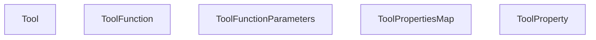
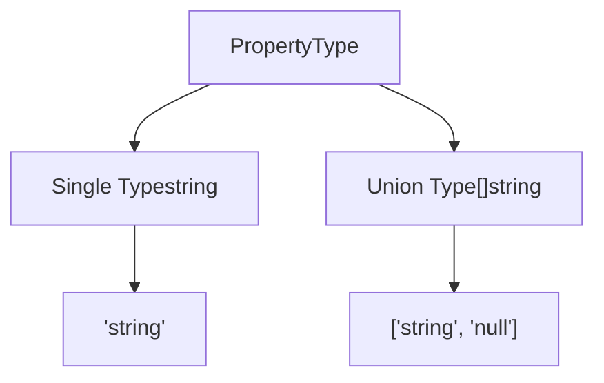
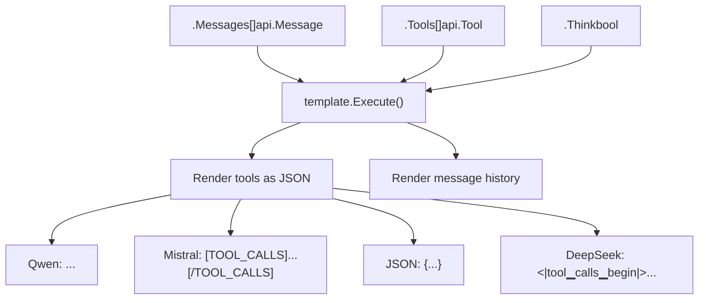
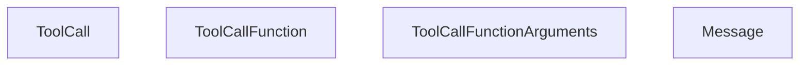
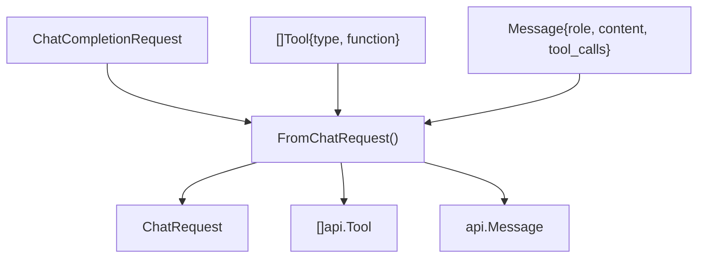
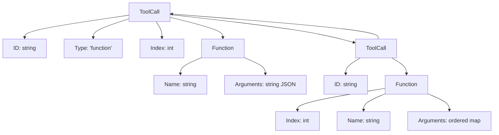
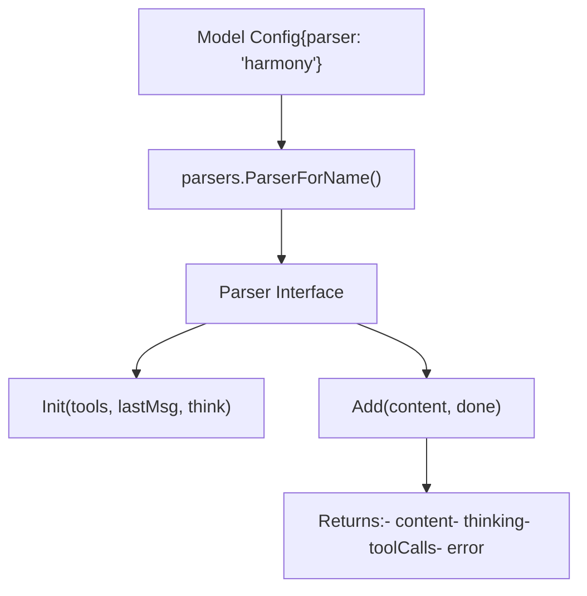
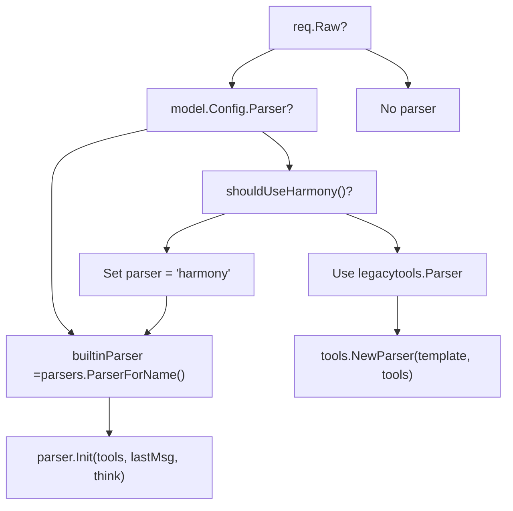
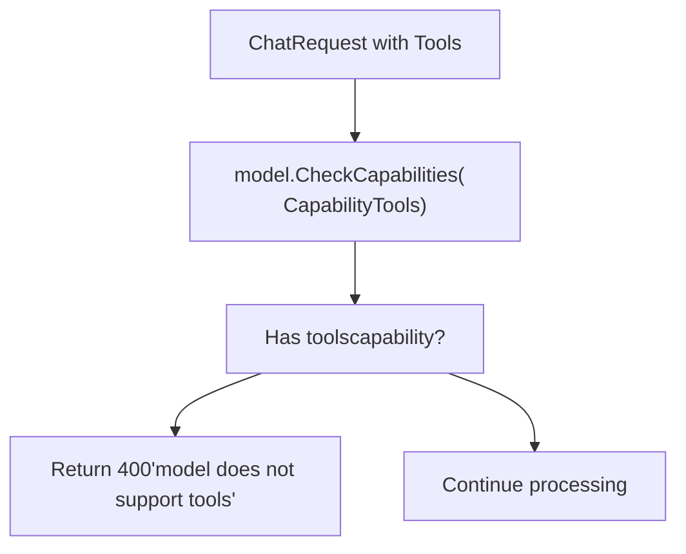
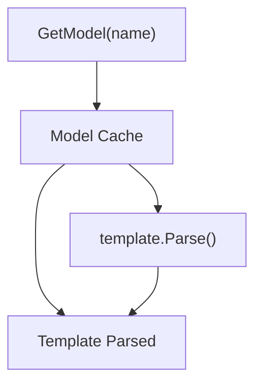

# 工具调用与函数执行

相关源文件

-   [api/client.go](https://github.com/ollama/ollama/blob/562c76d7/api/client.go)
-   [api/client\_test.go](https://github.com/ollama/ollama/blob/562c76d7/api/client_test.go)
-   [api/types.go](https://github.com/ollama/ollama/blob/562c76d7/api/types.go)
-   [api/types\_test.go](https://github.com/ollama/ollama/blob/562c76d7/api/types_test.go)
-   [api/types\_typescript\_test.go](https://github.com/ollama/ollama/blob/562c76d7/api/types_typescript_test.go)
-   [cmd/cmd.go](https://github.com/ollama/ollama/blob/562c76d7/cmd/cmd.go)
-   [middleware/openai.go](https://github.com/ollama/ollama/blob/562c76d7/middleware/openai.go)
-   [middleware/openai\_test.go](https://github.com/ollama/ollama/blob/562c76d7/middleware/openai_test.go)
-   [openai/openai.go](https://github.com/ollama/ollama/blob/562c76d7/openai/openai.go)
-   [openai/openai\_test.go](https://github.com/ollama/ollama/blob/562c76d7/openai/openai_test.go)
-   [openai/responses.go](https://github.com/ollama/ollama/blob/562c76d7/openai/responses.go)
-   [openai/responses\_test.go](https://github.com/ollama/ollama/blob/562c76d7/openai/responses_test.go)
-   [server/images.go](https://github.com/ollama/ollama/blob/562c76d7/server/images.go)
-   [server/routes.go](https://github.com/ollama/ollama/blob/562c76d7/server/routes.go)
-   [server/routes\_generate\_test.go](https://github.com/ollama/ollama/blob/562c76d7/server/routes_generate_test.go)
-   [tools/tools.go](https://github.com/ollama/ollama/blob/562c76d7/tools/tools.go)
-   [tools/tools\_test.go](https://github.com/ollama/ollama/blob/562c76d7/tools/tools_test.go)

本文档说明 Ollama 如何实现工具调用（函数调用）能力，使模型能够在生成过程中请求执行预定义函数。内容包括工具定义协议、如何从模型输出中解析工具调用，以及响应在系统中的流转方式。

关于模型能力与能力检测的信息，参见 [模型架构](/ollama/ollama/5.6-model-architectures)。关于模板渲染细节，参见 [模板系统](/ollama/ollama/7.1-template-system)。关于 OpenAI API 兼容性，参见 [OpenAI 兼容层](/ollama/ollama/3.4-openai-compatibility-layer)。

---

## 概述

工具调用使语言模型能够在文本生成期间调用外部函数。其工作流包括：

1.  客户端使用 JSON Schema 格式定义可用工具
2.  工具通过模板渲染进提示词
3.  模型生成包含工具调用请求的响应
4.  解析器从模型输出中提取工具调用
5.  客户端接收工具调用并可执行它们
6.  工具结果可回传以继续对话

该实现支持跨不同模型家族的多种工具调用格式，并可基于模型模板自动解析。

**来源：** [api/types.go196-509](https://github.com/ollama/ollama/blob/562c76d7/api/types.go#L196-L509) [tools/tools.go1-280](https://github.com/ollama/ollama/blob/562c76d7/tools/tools.go#L1-L280) [server/routes.go52-58](https://github.com/ollama/ollama/blob/562c76d7/server/routes.go#L52-L58)

---

## 工具定义模式

### 核心类型

工具通过以下类型层次结构定义：


**来源：** [api/types.go196-503](https://github.com/ollama/ollama/blob/562c76d7/api/types.go#L196-L503)

### 属性类型

`PropertyType` 同时支持单一类型和联合类型：

| 类型 | 描述 | 示例 |
| --- | --- | --- |
| `string` | 单一类型 | `"string"` |
| `[]string` | 联合类型 | `["string", "null"]` |


**来源：** [api/types.go325-365](https://github.com/ollama/ollama/blob/562c76d7/api/types.go#L325-L365)

### 有序属性

工具属性与函数参数使用 `orderedmap.Map` 保持插入顺序：

| 类型 | 用途 | 关键方法 |
| --- | --- | --- |
| `ToolPropertiesMap` | 工具参数定义 | `Get()`, `Set()`, `All()`, `ToMap()` |
| `ToolCallFunctionArguments` | 函数调用参数 | `Get()`, `Set()`, `All()`, `ToMap()` |

**来源：** [api/types.go246-317](https://github.com/ollama/ollama/blob/562c76d7/api/types.go#L246-L317) [api/types.go367-430](https://github.com/ollama/ollama/blob/562c76d7/api/types.go#L367-L430)

---

## 请求流程

### 带工具的聊天请求

> **[Mermaid 时序图]**
> *(图表结构无法解析)*

**来源：** [server/routes.go1307-1646](https://github.com/ollama/ollama/blob/562c76d7/server/routes.go#L1307-L1646) [server/routes\_chat.go1-457](https://github.com/ollama/ollama/blob/562c76d7/server/routes_chat.go#L1-L457)

### 模板集成

工具通过 `{{ .Tools }}` 模板变量渲染进提示词。不同模型使用不同格式：


**来源：** [server/routes\_chat.go50-180](https://github.com/ollama/ollama/blob/562c76d7/server/routes_chat.go#L50-L180) [tools/tools\_test.go36-60](https://github.com/ollama/ollama/blob/562c76d7/tools/tools_test.go#L36-L60)

---

## 工具调用解析

### 解析器状态机

`tools.Parser` 会从流式模型输出中提取工具调用：

**来源：** [tools/tools.go46-98](https://github.com/ollama/ollama/blob/562c76d7/tools/tools.go#L46-L98) [tools/tools.go119-153](https://github.com/ollama/ollama/blob/562c76d7/tools/tools.go#L119-L153)

---

## 工具调用表示

### API 工具调用结构


**来源：** [api/types.go235-317](https://github.com/ollama/ollama/blob/562c76d7/api/types.go#L235-L317)

### 工具调用生命周期

> **[Mermaid 时序图]**
> *(图表结构无法解析)*

**来源：** [tools/tools.go46-98](https://github.com/ollama/ollama/blob/562c76d7/tools/tools.go#L46-L98) [server/routes\_chat.go220-457](https://github.com/ollama/ollama/blob/562c76d7/server/routes_chat.go#L220-L457)

---

## OpenAI 兼容性

### 请求转换


**来源：** [openai/openai.go434-687](https://github.com/ollama/ollama/blob/562c76d7/openai/openai.go#L434-L687) [middleware/openai.go1-449](https://github.com/ollama/ollama/blob/562c76d7/middleware/openai.go#L1-L449)

### 工具调用格式转换

OpenAI 格式使用不同的字段名和结构：

| 方面 | OpenAI 格式 | Ollama 格式 |
| --- | --- | --- |
| 工具调用 ID | `id` (string) | `ID` (string) |
| 函数名 | `function.name` | `function.Name` |
| 参数 | `function.arguments` (string) | `function.Arguments` (ordered map) |
| 索引 | `index` (int) | `function.Index` (int) |
| 类型 | `type` (always "function") | Not present |


**来源：** [openai/openai.go178-187](https://github.com/ollama/ollama/blob/562c76d7/openai/openai.go#L178-L187) [openai/openai.go241-259](https://github.com/ollama/ollama/blob/562c76d7/openai/openai.go#L241-L259) [api/types.go235-244](https://github.com/ollama/ollama/blob/562c76d7/api/types.go#L235-L244)

### 响应流式传输

流式响应会以增量方式处理工具调用：

> **[Mermaid 时序图]**
> *(图表结构无法解析)*

**来源：** [middleware/openai.go70-134](https://github.com/ollama/ollama/blob/562c76d7/middleware/openai.go#L70-L134) [openai/openai.go294-324](https://github.com/ollama/ollama/blob/562c76d7/openai/openai.go#L294-L324)

---

## 内置解析器

Ollama 在 `model/parsers` 包中为部分模型家族提供专用解析器。这些解析器提供集成的工具调用和思考支持。

### 解析器接口

模型可以通过其配置中的 `parser` 字段指定自定义解析器：

| 解析器名称 | 模型家族 | 功能 |
| --- | --- | --- |
| `harmony` | GPT-OSS | 工具调用、思考块 |
| (others) | Various | Model-specific parsing |


**来源：** [server/routes.go360-371](https://github.com/ollama/ollama/blob/562c76d7/server/routes.go#L360-L371) [server/routes\_chat.go113-141](https://github.com/ollama/ollama/blob/562c76d7/server/routes_chat.go#L113-L141)

### 解析器选择


**来源：** [server/routes.go67-77](https://github.com/ollama/ollama/blob/562c76d7/server/routes.go#L67-L77) [server/routes.go360-371](https://github.com/ollama/ollama/blob/562c76d7/server/routes.go#L360-L371) [server/routes\_chat.go113-141](https://github.com/ollama/ollama/blob/562c76d7/server/routes_chat.go#L113-L141)

---

## 工具调用示例

### 基本工具定义

```
{  "type": "function",  "function": {    "name": "get_weather",    "description": "Get current weather for a location",    "parameters": {      "type": "object",      "required": ["location"],      "properties": {        "location": {          "type": "string",          "description": "City name"        },        "units": {          "type": "string",          "enum": ["celsius", "fahrenheit"],          "description": "Temperature units"        }      }    }  }}
```
### 模型输出格式

不同模型使用不同的工具调用语法：

| 模型家族 | 格式 | 示例 |
| --- | --- | --- |
| Qwen | `<tool_call>{...}</tool_call>` | `<tool_call>{"name": "get_weather", "arguments": {"location": "Paris"}}</tool_call>` |
| Mistral | `[TOOL_CALLS][...]` | `[TOOL_CALLS] [{"name": "get_weather", "arguments": {...}}]` |
| DeepSeek | `<|tool▁calls▁begin|>...` | `<|tool▁call▁begin|>function<|tool▁sep|>get_weather...` |
| JSON models | `{...}` or `[...]` | `{"name": "get_weather", "arguments": {...}}` |

**来源：** [tools/tools\_test.go36-60](https://github.com/ollama/ollama/blob/562c76d7/tools/tools_test.go#L36-L60) [tools/tools.go230-280](https://github.com/ollama/ollama/blob/562c76d7/tools/tools.go#L230-L280)

### 含工具调用的响应

```
{  "model": "qwen3:8b",  "message": {    "role": "assistant",    "content": "",    "tool_calls": [      {        "id": "call_abc123",        "function": {          "name": "get_weather",          "arguments": {            "location": "Paris",            "units": "celsius"          },          "index": 0        }      }    ]  },  "done": true}
```
**来源：** [api/types.go211-221](https://github.com/ollama/ollama/blob/562c76d7/api/types.go#L211-L221) [api/types.go235-244](https://github.com/ollama/ollama/blob/562c76d7/api/types.go#L235-L244)

---

## 错误处理

### 能力校验

在处理工具调用之前，服务器会校验模型能力：


**来源：** [server/routes\_chat.go84-111](https://github.com/ollama/ollama/blob/562c76d7/server/routes_chat.go#L84-L111) [server/images.go147-189](https://github.com/ollama/ollama/blob/562c76d7/server/images.go#L147-L189)

### 解析器错误处理

解析器在提取过程中会校验工具调用：

| 错误条件 | 处理方式 |
| --- | --- |
| Invalid JSON in arguments | Return error, stop parsing |
| Unknown tool name | Wait for more data (may be partial) |
| Malformed tool call | Return error to client |
| Missing required arguments | Validated by client, not parser |

**来源：** [tools/tools.go228-280](https://github.com/ollama/ollama/blob/562c76d7/tools/tools.go#L228-L280)

---

## 实现细节

### 参数顺序

工具调用参数使用 `orderedmap.Map` 保持插入顺序。这对确定性序列化至关重要：

```
type ToolCallFunctionArguments struct {    om *orderedmap.Map[string, any]}
```
方法：

-   `Get(key string) (any, bool)` - 获取值
-   `Set(key string, value any)` - 设置值并保持顺序
-   `All() iter.Seq2[string, any]` - 按插入顺序迭代
-   `ToMap() map[string]any` - 转换为常规 map（顺序丢失）

**来源：** [api/types.go246-317](https://github.com/ollama/ollama/blob/562c76d7/api/types.go#L246-L317)

### 属性顺序

工具属性同样使用有序映射：

```
type ToolPropertiesMap struct {    om *orderedmap.Map[string, ToolProperty]}
```
这确保 JSON Schema 属性能被一致序列化。

**来源：** [api/types.go367-430](https://github.com/ollama/ollama/blob/562c76d7/api/types.go#L367-L430)

### 解析器缓冲区管理

解析器会维护未解析内容缓冲区：

```
type Parser struct {    tag    string            // Tool calling tag from template    tools  []api.Tool        // Available tools    state  toolsState        // Current parsing state    buffer []byte            // Unparsed content    n      int               // Tool call index counter}
```
该缓冲区会随着内容到达而增长，并在工具调用被解析后缩小。

**来源：** [tools/tools.go20-27](https://github.com/ollama/ollama/blob/562c76d7/tools/tools.go#L20-L27)

---

## 性能考量

### 增量解析

解析器面向流式场景设计：

1.  内容分块到达
2.  解析器缓冲不完整工具调用
3.  完整工具调用立即提取
4.  剩余内容保留到下一块

这使流式场景中的工具调用检测具备低延迟特性。

**来源：** [tools/tools.go46-98](https://github.com/ollama/ollama/blob/562c76d7/tools/tools.go#L46-L98)

### 模板缓存

模板按模型解析一次并缓存：


**来源：** [server/images.go275-372](https://github.com/ollama/ollama/blob/562c76d7/server/images.go#L275-L372)

---

## 测试

代码库包含了针对工具调用的完整测试：

| 测试文件 | 覆盖内容 |
| --- | --- |
| `tools/tools_test.go` | 解析器逻辑、多种格式 |
| `openai/openai_test.go` | 格式转换 |
| `middleware/openai_test.go` | 请求/响应转换 |
| `server/routes_generate_test.go` | 端到端工具调用 |

**来源：** [tools/tools\_test.go35-568](https://github.com/ollama/ollama/blob/562c76d7/tools/tools_test.go#L35-L568) [openai/openai\_test.go169-235](https://github.com/ollama/ollama/blob/562c76d7/openai/openai_test.go#L169-L235) [middleware/openai\_test.go79-449](https://github.com/ollama/ollama/blob/562c76d7/middleware/openai_test.go#L79-L449)
