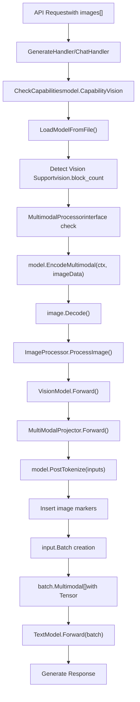
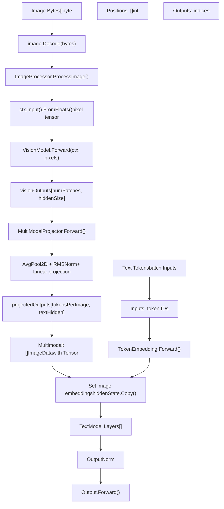

# 多模态与视觉支持

相关源文件

-   [convert/convert\_gemma3.go](https://github.com/ollama/ollama/blob/562c76d7/convert/convert_gemma3.go)
-   [convert/convert\_mllama.go](https://github.com/ollama/ollama/blob/562c76d7/convert/convert_mllama.go)
-   [fs/config.go](https://github.com/ollama/ollama/blob/562c76d7/fs/config.go)
-   [llama/llama.cpp/src/llama-batch.cpp](https://github.com/ollama/ollama/blob/562c76d7/llama/llama.cpp/src/llama-batch.cpp)
-   [llama/llama.go](https://github.com/ollama/ollama/blob/562c76d7/llama/llama.go)
-   [llama/sampling\_ext.cpp](https://github.com/ollama/ollama/blob/562c76d7/llama/sampling_ext.cpp)
-   [llama/sampling\_ext.h](https://github.com/ollama/ollama/blob/562c76d7/llama/sampling_ext.h)
-   [model/models/gemma2/model.go](https://github.com/ollama/ollama/blob/562c76d7/model/models/gemma2/model.go)
-   [model/models/gemma3/model.go](https://github.com/ollama/ollama/blob/562c76d7/model/models/gemma3/model.go)
-   [model/models/gemma3/model\_text.go](https://github.com/ollama/ollama/blob/562c76d7/model/models/gemma3/model_text.go)
-   [model/models/gemma3/model\_vision.go](https://github.com/ollama/ollama/blob/562c76d7/model/models/gemma3/model_vision.go)
-   [model/models/gemma3/process\_image.go](https://github.com/ollama/ollama/blob/562c76d7/model/models/gemma3/process_image.go)
-   [model/models/llama/model.go](https://github.com/ollama/ollama/blob/562c76d7/model/models/llama/model.go)
-   [model/models/llama4/process\_image.go](https://github.com/ollama/ollama/blob/562c76d7/model/models/llama4/process_image.go)
-   [model/models/llama4/process\_image\_test.go](https://github.com/ollama/ollama/blob/562c76d7/model/models/llama4/process_image_test.go)
-   [model/models/mllama/model.go](https://github.com/ollama/ollama/blob/562c76d7/model/models/mllama/model.go)
-   [model/models/mllama/model\_text.go](https://github.com/ollama/ollama/blob/562c76d7/model/models/mllama/model_text.go)
-   [model/models/mllama/model\_vision.go](https://github.com/ollama/ollama/blob/562c76d7/model/models/mllama/model_vision.go)
-   [model/models/mllama/process\_image.go](https://github.com/ollama/ollama/blob/562c76d7/model/models/mllama/process_image.go)

## 目的与范围

本文档描述 Ollama 的多模态与视觉能力，这些能力使语言模型能够在文本之外处理和理解图像输入。内容涵盖图像输入处理流水线、视觉模型架构、多模态投影机制以及 API 集成。

关于模板渲染与提示词格式化，参见 [模板系统](/ollama/ollama/7.1-template-system)。关于工具调用能力，参见 [工具调用与函数执行](/ollama/ollama/7.2-tool-calling-and-function-execution)。关于模型架构的通用信息，参见 [模型架构](/ollama/ollama/5.6-model-architectures)。

---

## 概览

Ollama 支持可在单次推理会话中同时处理文本和图像的多模态模型。该系统：

-   通过 API 接受多种格式图像（JPEG、PNG、BMP、WebP、TIFF）
-   通过视觉编码器处理图像并生成嵌入
-   通过多模态投影器将视觉嵌入投影到文本模型嵌入空间
-   将图像嵌入无缝整合到文本 token 序列中
-   支持带图像输入的流式与非流式响应

多模态能力会基于模型元数据和架构自动检测，用户除在 API 请求中提供图像数据外无需额外配置。

Sources: [server/images.go74-141](https://github.com/ollama/ollama/blob/562c76d7/server/images.go#L74-L141) [model/model.go50-69](https://github.com/ollama/ollama/blob/562c76d7/model/model.go#L50-L69) [api/types.go56-98](https://github.com/ollama/ollama/blob/562c76d7/api/types.go#L56-L98)

---

## 多模态数据流


**多模态请求处理流程**

该图展示了从 API 请求、视觉处理到模型推理的完整流程。`EncodeMultimodal()` 方法将图像处理为嵌入，`PostTokenize()` 会调整 token 序列以包含图像标记和嵌入。

Sources: [model/models/gemma3/model.go101-125](https://github.com/ollama/ollama/blob/562c76d7/model/models/gemma3/model.go#L101-L125) [model/models/gemma3/model.go127-153](https://github.com/ollama/ollama/blob/562c76d7/model/models/gemma3/model.go#L127-L153) [model/models/mllama/model.go63-92](https://github.com/ollama/ollama/blob/562c76d7/model/models/mllama/model.go#L63-L92)

---

## 图像输入格式

### ImageData 类型

图像通过 `ImageData` 类型以原始字节数组形式传给 Ollama：

```
// api/types.gotype ImageData []byte
```
`GenerateRequest` 和 `ChatRequest` 结构体包含 `Images` 字段：

```
type GenerateRequest struct {    Images []ImageData `json:"images,omitempty"`    // ... other fields} type Message struct {    Images []ImageData `json:"images,omitempty"`    // ... other fields}
```
图像通常在 JSON API 请求中以 base64 编码，由客户端库解码后再作为原始字节发送。

Sources: [api/types.go56-98](https://github.com/ollama/ollama/blob/562c76d7/api/types.go#L56-L98) [api/types.go211-221](https://github.com/ollama/ollama/blob/562c76d7/api/types.go#L211-L221)

### 模型中的图像处理

图像通过 `EncodeMultimodal()` 方法直接传给模型。多模态数据与输入序列一并存储，而不是依赖提示词中的占位符语法。每个模型的 `PostTokenize()` 实现会决定如何将图像嵌入插入 token 序列。

例如，在 Gemma3 中：

```
// Insert image markers and embeddingsresult = append(result,    &input.Input{Token: 108, SameBatch: inputMultimodal.Dim(1) + 3}, // "\n\n"    &input.Input{Token: 255999},                                      // "<start_of_image>"    &input.Input{Multimodal: []input.Multimodal{{Tensor: inputMultimodal}},                  MultimodalHash: inp.MultimodalHash},                 // image data)// Add image token placeholdersresult = append(result, slices.Repeat([]*input.Input{{Token: 0}},                                        inputMultimodal.Dim(1)-1)...)result = append(result,    &input.Input{Token: 256000}, // <end_of_image>    &input.Input{Token: 108},    // "\n\n")
```
Sources: [model/models/gemma3/model.go127-153](https://github.com/ollama/ollama/blob/562c76d7/model/models/gemma3/model.go#L127-L153)

---

## 多模态模型架构


**多模态模型架构**

该图展示了多模态模型的完整架构。图像经视觉流水线和投影器生成嵌入，并通过 `input.Batch.Multimodal` 字段集成进文本模型前向过程。

Sources: [model/models/gemma3/model.go101-125](https://github.com/ollama/ollama/blob/562c76d7/model/models/gemma3/model.go#L101-L125) [model/models/gemma3/model.go155-166](https://github.com/ollama/ollama/blob/562c76d7/model/models/gemma3/model.go#L155-L166) [model/models/gemma3/model\_text.go223-266](https://github.com/ollama/ollama/blob/562c76d7/model/models/gemma3/model_text.go#L223-L266)

---

## MultimodalProcessor 接口

支持视觉输入的模型必须实现 `MultimodalProcessor` 接口：

```
// model/model.gotype MultimodalProcessor interface {    // EncodeMultimodal processes image bytes and returns multimodal embeddings    EncodeMultimodal(ml.Context, []byte) ([]input.Multimodal, error)        // PostTokenize adjusts the input sequence after tokenization    PostTokenize([]*input.Input) ([]*input.Input, error)}
```
### EncodeMultimodal

该方法处理完整视觉流水线：

1.  **图像解码**：将原始字节转换为 `image.Image`

    ```
    image, _, err := image.Decode(bytes.NewReader(multimodalData))
    ```

2.  **预处理**：调整尺寸并归一化图像

    ```
    f32s, err := m.ImageProcessor.ProcessImage(image)pixelValues := ctx.Input().FromFloats(f32s, imageSize, imageSize, numChannels)
    ```

3.  **视觉编码**：通过视觉 Transformer 处理

    ```
    visionOutputs := m.VisionModel.Forward(ctx, pixelValues)
    ```

4.  **投影**：将视觉嵌入映射到文本空间

    ```
    visionOutputs = m.MultiModalProjector.Forward(ctx, visionOutputs, ...)
    ```

5.  **返回**：将 tensor 封装到 `input.Multimodal` 结构中

    ```
    return []input.Multimodal{{Tensor: visionOutputs}}, nil
    ```


### PostTokenize

在分词后，`PostTokenize()` 会插入与图像相关的 token 和嵌入。不同模型策略不同：

**Gemma3 方法**：在图像区域前后插入特殊 token

-   `<start_of_image>` token（ID: 255999）
-   图像占位 token（ID: 0）
-   `<end_of_image>` token（ID: 256000）
-   前后换行 token

**mLlama 方法**：将特定 token 替换为图像标记

-   将 token ID 改为 128256（`<|image|>`）

`SameBatch` 字段确保多 token 的图像嵌入在批处理期间保持连续。

Sources: [model/models/gemma3/model.go101-125](https://github.com/ollama/ollama/blob/562c76d7/model/models/gemma3/model.go#L101-L125) [model/models/gemma3/model.go127-153](https://github.com/ollama/ollama/blob/562c76d7/model/models/gemma3/model.go#L127-L153) [model/models/mllama/model.go94-102](https://github.com/ollama/ollama/blob/562c76d7/model/models/mllama/model.go#L94-L102)

---

## 视觉模型组件

### 视觉编码器

视觉编码器通过 Transformer 层处理图像。组件结构会因架构而异：

**Gemma3 视觉模型（VisionModel struct）：**

```
VisionModel
├── PatchEmbedding: *nn.Conv2D - Projects patches to embeddings
├── PositionEmbedding: *nn.Embedding - Adds positional info
├── Layers: []VisionEncoderLayer
│   ├── LayerNorm1: *nn.LayerNorm
│   ├── SelfAttention: *VisionSelfAttention
│   │   ├── Query: *nn.Linear
│   │   ├── Key: *nn.Linear
│   │   ├── Value: *nn.Linear
│   │   └── Output: *nn.Linear
│   ├── LayerNorm2: *nn.LayerNorm
│   └── MLP: *VisionMLP
│       ├── FC1: *nn.Linear
│       └── FC2: *nn.Linear
└── PostLayerNorm: *nn.LayerNorm
```
前向过程：

1.  通过 `PatchEmbedding.Forward()` 将图像转换为 patch
2.  重塑为 `[numPatches, hiddenSize]`
3.  添加位置嵌入
4.  经过 Transformer 层处理
5.  应用最终层归一化

**mLlama 视觉模型**拥有更复杂架构，包含全局与局部 Transformer、tile 前/后位置嵌入以及门控注意力机制。

Sources: [model/models/gemma3/model\_vision.go78-119](https://github.com/ollama/ollama/blob/562c76d7/model/models/gemma3/model_vision.go#L78-L119) [model/models/mllama/model\_vision.go146-223](https://github.com/ollama/ollama/blob/562c76d7/model/models/mllama/model_vision.go#L146-L223)

### 多模态投影器

投影器会变换视觉嵌入以匹配文本模型维度：

**Gemma3 MultiModalProjector：**

```
type MultiModalProjector struct {    SoftEmbNorm     *nn.RMSNorm `gguf:"mm_soft_emb_norm"`    InputProjection *nn.Linear  `gguf:"mm_input_projection"`    tokensPerImage  int}
```
前向过程：

1.  维度置换：`[L, H, W, C]` → `[W, H, L, C]`
2.  重塑为方形网格
3.  应用平均池化以减少 token 数
4.  应用 RMSNorm 提升稳定性
5.  通过线性投影（转置）映射到文本维度

**mLlama Projector** 更简单——仅一个线性层（`Projector: *nn.Linear`）。

Sources: [model/models/gemma3/model.go32-55](https://github.com/ollama/ollama/blob/562c76d7/model/models/gemma3/model.go#L32-L55) [model/models/mllama/model.go24](https://github.com/ollama/ollama/blob/562c76d7/model/models/mllama/model.go#L24-L24)

### 图像处理器

每个模型都实现自己的 `ImageProcessor` 结构，并提供 `ProcessImage()` 方法：

**Gemma3 ImageProcessor：**

```
type ImageProcessor struct {    imageSize, patchSize, numChannels int} func (p ImageProcessor) ProcessImage(img image.Image) ([]float32, error) {    // 1. Composite to remove transparency    newImage := imageproc.Composite(img)    // 2. Resize to fixed size    newImage = imageproc.Resize(newImage, outputSize, imageproc.ResizeBilinear)    // 3. Normalize with ImageNet mean/std    data := p.pack(newImage, imageproc.ImageNetStandardMean, imageproc.ImageNetStandardSTD)    return data, nil}
```
**mLlama ImageProcessor** 更复杂：

-   为图像确定最优 tile 排布
-   按纵横比将图像分割为多个 tile
-   填充以匹配预期画布大小
-   每张图最多支持 `maxNumTiles`（如 4）个 tile

Sources: [model/models/gemma3/process\_image.go14-58](https://github.com/ollama/ollama/blob/562c76d7/model/models/gemma3/process_image.go#L14-L58) [model/models/mllama/process\_image.go26-222](https://github.com/ollama/ollama/blob/562c76d7/model/models/mllama/process_image.go#L26-L222)

---

## 多模态分词流水线

**多模态分词序列**

该图展示了图像如何被编码并整合到 token 序列中。`EncodeMultimodal()` 方法将图像处理为 tensor，`PostTokenize()` 会在图像嵌入周围插入特殊 token 与占位符。

Sources: [model/models/gemma3/model.go101-125](https://github.com/ollama/ollama/blob/562c76d7/model/models/gemma3/model.go#L101-L125) [model/models/gemma3/model.go127-153](https://github.com/ollama/ollama/blob/562c76d7/model/models/gemma3/model.go#L127-L153)

---

## 视觉能力检测

### 自动检测

Ollama 通过多种机制自动检测模型是否支持视觉：

**检测方式：**

1.  **GGUF 元数据检查：**

```
// Check for vision.block_count in GGUF fileif f.KeyValue("vision.block_count").Valid() {    capabilities = append(capabilities, model.CapabilityVision)}
```
2.  **投影器路径检查：**

```
// Check for projector files in model layersif len(m.ProjectorPaths) > 0 {    capabilities = append(capabilities, model.CapabilityVision)}
```
3.  **配置能力声明：**

```
// Explicit capability in model configif slices.Contains(m.Config.Capabilities, "vision") {    capabilities = append(capabilities, model.CapabilityVision)}
```
Sources: [server/images.go74-141](https://github.com/ollama/ollama/blob/562c76d7/server/images.go#L74-L141)

### 向后兼容

为兼容旧模型格式，还会执行额外检查：

```
// Check for projector info in model metadataif len(info.ProjectorInfo) != 0 {    opts.MultiModal = true} // Check for vision-related keys in model infofor k := range info.ModelInfo {    if strings.Contains(k, ".vision.") {        opts.MultiModal = true        break    }}
```
Sources: [cmd/cmd.go634-642](https://github.com/ollama/ollama/blob/562c76d7/cmd/cmd.go#L634-L642)

### 模型校验

当模型被调度用于推理时，会校验能力：

```
// Validate that model supports required capabilitiesif err := model.CheckCapabilities(caps...); err != nil {    return nil, nil, nil, fmt.Errorf("%s %w", name, err)}
```
若需要视觉能力但模型不支持，则会向用户返回错误。

Sources: [server/routes.go149-151](https://github.com/ollama/ollama/blob/562c76d7/server/routes.go#L149-L151)

---

## 多模态存储与内存管理

### multimodalStore

`multimodalStore` 在推理过程中管理图像嵌入以提升内存效率：

```
type multimodalStore interface {    addMultimodal(ml.Tensor)    // Manages embedding lifecycle    // Splits embeddings across batches if needed}
```
### 内存考量

图像嵌入可能很大（相当于数百或数千 token 的嵌入），需要谨慎管理内存：

1.  **上下文分配：** 每张图像都有独立 `ml.Context`，在序列生命周期内存活
2.  **Finalizer：** Go finalizer 确保不再需要时清理上下文
3.  **批次拆分：** 大图像嵌入可能拆分到多个 batch
4.  **缓存：** 图像哈希可复用重复图像的嵌入

```
ctx := s.model.Backend().NewContext()runtime.SetFinalizer(ctx, func(c ml.Context) { c.Close() })ctxs = append(ctxs, ctx)
```
Sources: [runner/ollamarunner/runner.go271-273](https://github.com/ollama/ollama/blob/562c76d7/runner/ollamarunner/runner.go#L271-L273)

---

## 输入表示

### input.Input 结构

统一输入表示同时支持 token 与多模态嵌入：

```
type Input struct {    Token          int32      // Text token ID    Multimodal     ml.Tensor  // Image embedding tensor    MultimodalHash uint64     // Hash for caching    SameBatch      int        // Grouping for unbreakable sequences}
```
一个输入序列可混合 token 和嵌入：

```
[Token: 1234] [Token: 5678] [Multimodal: <tensor>] [Token: 9012]
```
前向过程会处理这种异构序列，模型会在合适维度上将多模态嵌入视为 token 嵌入来处理。

Sources: [model/input/input.go1-50](https://github.com/ollama/ollama/blob/562c76d7/model/input/input.go#L1-L50)

---

## 支持的模型架构

### Gemma3 Vision

**模型结构：**

```
type Model struct {    model.Base    tokenizer.Tokenizer        *VisionModel           `gguf:"v"`    *TextModel    *MultiModalProjector   `gguf:"mm"`    ImageProcessor}
```
**关键特性：**

-   使用 patch 嵌入和位置嵌入的视觉编码器
-   使用平均池化减少 token 数（例如每图 256 个 token）
-   使用 RMSNorm 和线性投影映射到文本维度
-   插入特殊 token：`<start_of_image>` (255999) 与 `<end_of_image>` (256000)
-   文本模型使用交替滑动窗口与因果注意力

**前向集成：**

```
func (m *TextModel) Forward(ctx ml.Context, batch input.Batch, cache kvcache.Cache) ml.Tensor {    hiddenState := m.TokenEmbedding.Forward(ctx, batch.Inputs)        // Set image embeddings at their positions    for _, image := range batch.Multimodal {        visionOutputs := image.Multimodal[0].Tensor        ctx.Forward(visionOutputs.Copy(ctx, hiddenState.View(...)))    }        // Process through text layers...}
```
Sources: [model/models/gemma3/model.go18-99](https://github.com/ollama/ollama/blob/562c76d7/model/models/gemma3/model.go#L18-L99) [model/models/gemma3/model\_text.go223-266](https://github.com/ollama/ollama/blob/562c76d7/model/models/gemma3/model_text.go#L223-L266)

### mLlama（带视觉的 Meta Llama）

**模型结构：**

```
type Model struct {    model.Base    tokenizer.Tokenizer        *VisionModel `gguf:"v"`    *TextModel    Projector *nn.Linear `gguf:"mm.0"`    ImageProcessor}
```
**关键特性：**

-   具备全局与局部 Transformer 的复杂视觉编码器
-   基于 tile 的图像处理（每图最多 4 个 tile）
-   预计算位置和纵横比嵌入
-   单层线性投影器
-   文本模型中的跨注意力层用于视觉-文本融合
-   将占位符替换为 `<|image|>` token (128256)

**跨注意力架构：** 文本模型包含两类层：

-   `TextSelfAttentionDecoderLayer`：标准自注意力层
-   `TextCrossAttentionDecoderLayer`：对视觉嵌入做跨注意力的层

跨注意力使用门控机制控制视觉到文本的信息流。

**视觉编码器缓存：** mLlama 使用 `EncoderCache`（与因果缓存分离）来存储跨注意力 key 和 value。这使视觉嵌入只需计算一次，可在文本生成中复用。

Sources: [model/models/mllama/model.go17-61](https://github.com/ollama/ollama/blob/562c76d7/model/models/mllama/model.go#L17-L61) [model/models/mllama/model\_text.go93-167](https://github.com/ollama/ollama/blob/562c76d7/model/models/mllama/model_text.go#L93-L167) [model/models/mllama/model\_vision.go146-203](https://github.com/ollama/ollama/blob/562c76d7/model/models/mllama/model_vision.go#L146-L203)

### 架构对比

| Feature | Gemma3 Vision | mLlama |
| --- | --- | --- |
| Vision Encoder | Single transformer | Global + local transformers |
| Image Tokens | ~256 | Variable (tile-based) |
| Projector | RMSNorm + Linear | Single Linear |
| Text Integration | Direct embedding insertion | Cross-attention layers |
| Special Tokens | `<start/end_of_image>` | `<|image|>` |
| Cache Strategy | Unified causal cache | Separate encoder cache |
| Tile Support | No | Yes (up to 4 tiles) |

Sources: [model/models/gemma3/model.go18-99](https://github.com/ollama/ollama/blob/562c76d7/model/models/gemma3/model.go#L18-L99) [model/models/mllama/model.go17-61](https://github.com/ollama/ollama/blob/562c76d7/model/models/mllama/model.go#L17-L61)

---

## API 集成

### 带图像的 Generate 端点

```
POST /api/generate{  "model": "gemma3:12b-vision",  "prompt": "Describe this image [img-0] in detail",  "images": ["<base64-encoded-image>"],  "stream": true}
```
处理器会将图像转换为 `llm.ImageData` 并校验视觉能力：

```
images := make([]llm.ImageData, len(req.Images))for i := range req.Images {    images[i] = llm.ImageData{ID: i, Data: req.Images[i]}}
```
Sources: [server/routes.go424-427](https://github.com/ollama/ollama/blob/562c76d7/server/routes.go#L424-L427)

### 带图像的 Chat 端点

图像可包含在聊天消息中：

```
POST /api/chat{  "model": "gemma3:12b-vision",  "messages": [    {      "role": "user",      "content": "What's in this picture?",      "images": ["<base64-encoded-image>"]    }  ]}
```
聊天处理器会通过与 generate 请求相同的流水线处理多模态消息。

Sources: [server/routes.go456-460](https://github.com/ollama/ollama/blob/562c76d7/server/routes.go#L456-L460)

### 错误处理

常见错误：

-   **No Vision Support:** 模型不具备视觉能力
-   **Missing Image:** 引用的 `[img-n]` 在图像数组中不存在
-   **Invalid Format:** 图像字节无法解码
-   **Out of Memory:** 图像嵌入超过可用上下文

Sources: [runner/ollamarunner/runner.go267-269](https://github.com/ollama/ollama/blob/562c76d7/runner/ollamarunner/runner.go#L267-L269) [model/model.go30](https://github.com/ollama/ollama/blob/562c76d7/model/model.go#L30-L30)

---

## 实现细节

### 批处理

多模态输入会影响 batch 构建：

-   图像嵌入因体积较大可能跨多个 batch 条目
-   `SameBatch` 字段确保图像嵌入不会被不恰当地拆分
-   位置索引会调整以匹配图像嵌入长度

### KV 缓存考量

图像嵌入会像文本 token 一样被缓存：

-   每个嵌入位置对应一条 KV cache 条目
-   基于哈希的缓存可在相同图像序列间复用
-   滑动窗口注意力可处理较长多模态序列

Sources: [kvcache/causal.go1-100](https://github.com/ollama/ollama/blob/562c76d7/kvcache/causal.go#L1-L100)

### 模板兼容性

多模态模型可能有特殊模板要求：

-   某些模型需要将图像 token 包裹在特殊标记中
-   模板渲染必须在处理过程中保留 `[img-n]` 标签
-   后分词调整用于处理模型特定格式

Sources: [template/template.go1-100](https://github.com/ollama/ollama/blob/562c76d7/template/template.go#L1-L100)

---

## 代码参考汇总

| 组件 | 用途 | 关键文件 |
| --- | --- | --- |
| `MultimodalProcessor` | 面向支持视觉模型的接口 | [model/model.go50-69](https://github.com/ollama/ollama/blob/562c76d7/model/model.go#L50-L69) |
| `EncodeMultimodal()` | 将图像字节处理为嵌入 | [model/models/gemma3/model.go101-125](https://github.com/ollama/ollama/blob/562c76d7/model/models/gemma3/model.go#L101-L125) |
| `PostTokenize()` | 以图像标记调整 token 序列 | [model/models/gemma3/model.go127-153](https://github.com/ollama/ollama/blob/562c76d7/model/models/gemma3/model.go#L127-L153) |
| `VisionModel` | 图像编码 Transformer | [model/models/gemma3/model\_vision.go78-119](https://github.com/ollama/ollama/blob/562c76d7/model/models/gemma3/model_vision.go#L78-L119) |
| `MultiModalProjector` | 视觉到文本投影 | [model/models/gemma3/model.go32-55](https://github.com/ollama/ollama/blob/562c76d7/model/models/gemma3/model.go#L32-L55) |
| `ImageProcessor` | 图像预处理 | [model/models/gemma3/process\_image.go14-58](https://github.com/ollama/ollama/blob/562c76d7/model/models/gemma3/process_image.go#L14-L58) |
| `input.Batch.Multimodal` | 在 batch 中存储图像嵌入 | [model/input/input.go1-50](https://github.com/ollama/ollama/blob/562c76d7/model/input/input.go#L1-L50) |
| `TextModel.Forward()` | 集成图像嵌入 | [model/models/gemma3/model\_text.go223-266](https://github.com/ollama/ollama/blob/562c76d7/model/models/gemma3/model_text.go#L223-L266) |
| 视觉能力检测 | 检查 GGUF 元数据 | [server/images.go74-141](https://github.com/ollama/ollama/blob/562c76d7/server/images.go#L74-L141) |
| Cross-attention layers (mLlama) | Vision-text fusion | [model/models/mllama/model\_text.go93-167](https://github.com/ollama/ollama/blob/562c76d7/model/models/mllama/model_text.go#L93-L167) |

---

来源：以上各节均包含到具体文件位置的行内引用。
