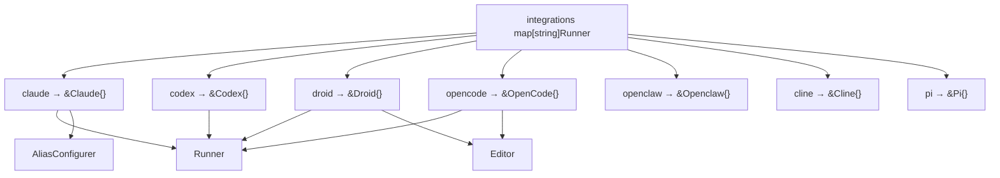
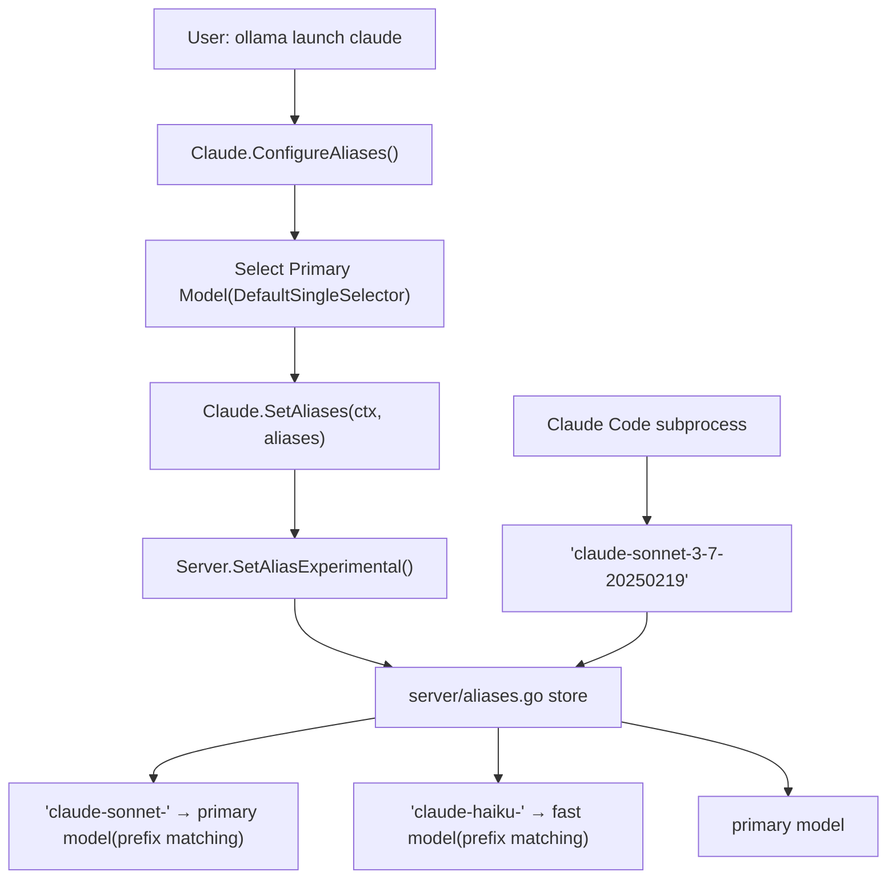
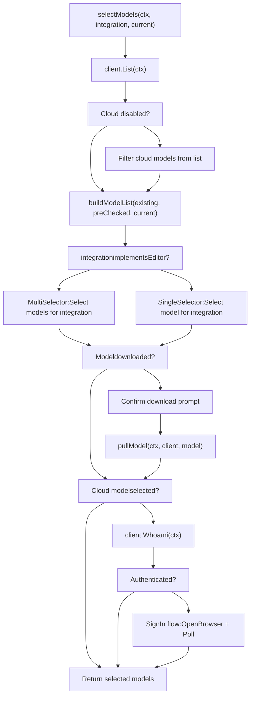

# 集成与 IDE 支持

相关源文件

-   [README.md](https://github.com/ollama/ollama/blob/562c76d7/README.md?plain=1)
-   [anthropic/anthropic.go](https://github.com/ollama/ollama/blob/562c76d7/anthropic/anthropic.go)
-   [anthropic/anthropic\_test.go](https://github.com/ollama/ollama/blob/562c76d7/anthropic/anthropic_test.go)
-   [cmd/config/claude.go](https://github.com/ollama/ollama/blob/562c76d7/cmd/config/claude.go)
-   [cmd/config/config.go](https://github.com/ollama/ollama/blob/562c76d7/cmd/config/config.go)
-   [cmd/config/config\_test.go](https://github.com/ollama/ollama/blob/562c76d7/cmd/config/config_test.go)
-   [cmd/config/droid.go](https://github.com/ollama/ollama/blob/562c76d7/cmd/config/droid.go)
-   [cmd/config/droid\_test.go](https://github.com/ollama/ollama/blob/562c76d7/cmd/config/droid_test.go)
-   [cmd/config/integrations.go](https://github.com/ollama/ollama/blob/562c76d7/cmd/config/integrations.go)
-   [cmd/config/integrations\_test.go](https://github.com/ollama/ollama/blob/562c76d7/cmd/config/integrations_test.go)
-   [cmd/config/opencode.go](https://github.com/ollama/ollama/blob/562c76d7/cmd/config/opencode.go)
-   [cmd/config/opencode\_test.go](https://github.com/ollama/ollama/blob/562c76d7/cmd/config/opencode_test.go)
-   [cmd/config/selector.go](https://github.com/ollama/ollama/blob/562c76d7/cmd/config/selector.go)
-   [cmd/config/selector\_test.go](https://github.com/ollama/ollama/blob/562c76d7/cmd/config/selector_test.go)
-   [cmd/tui/tui.go](https://github.com/ollama/ollama/blob/562c76d7/cmd/tui/tui.go)
-   [docs/README.md](https://github.com/ollama/ollama/blob/562c76d7/docs/README.md?plain=1)
-   [docs/api.md](https://github.com/ollama/ollama/blob/562c76d7/docs/api.md?plain=1)
-   [docs/development.md](https://github.com/ollama/ollama/blob/562c76d7/docs/development.md?plain=1)
-   [docs/images/ollama-keys.png](https://github.com/ollama/ollama/blob/562c76d7/docs/images/ollama-keys.png)
-   [docs/images/signup.png](https://github.com/ollama/ollama/blob/562c76d7/docs/images/signup.png)
-   [middleware/anthropic.go](https://github.com/ollama/ollama/blob/562c76d7/middleware/anthropic.go)
-   [server/aliases.go](https://github.com/ollama/ollama/blob/562c76d7/server/aliases.go)
-   [server/routes\_aliases\_test.go](https://github.com/ollama/ollama/blob/562c76d7/server/routes_aliases_test.go)
-   [server/routes\_cloud\_test.go](https://github.com/ollama/ollama/blob/562c76d7/server/routes_cloud_test.go)

本文档描述 Ollama 的集成系统。该系统使外部编码工具和 IDE（Claude Code、Codex、Droid、OpenCode 等）能够使用 Ollama 模型。系统提供了统一接口，用于启动集成、配置模型，并通过 OpenAI 兼容或 Anthropic 兼容中间件路由请求。

关于 OpenAI 与 Anthropic 兼容层本身的信息，参见 [OpenAI 兼容层](/ollama/ollama/3.4-openai-compatibility-layer) 与 [Anthropic 兼容层](/ollama/ollama/3.5-anthropic-compatibility-layer)。关于集成使用的模板系统细节，参见 [模板系统](/ollama/ollama/7.1-template-system)。

## 集成架构

集成系统围绕 [cmd/config/integrations.go26-50](https://github.com/ollama/ollama/blob/562c76d7/cmd/config/integrations.go#L26-L50) 中定义的三个可组合接口构建：

```
type Runner interface {    Run(model string, args []string) error    String() string} type Editor interface {    Paths() []string    Edit(models []string) error    Models() []string} type AliasConfigurer interface {    ConfigureAliases(ctx context.Context, primaryModel string,                     existing map[string]string, force bool) (map[string]string, bool, error)    SetAliases(ctx context.Context, aliases map[string]string) error}
```
**Runner**：使用指定模型执行某个集成。所有集成都实现该接口。

**Editor**：通过修改集成特定配置文件支持多模型选择。OpenCode 和 Droid 等集成实现该接口，以允许用户配置多个模型。

**AliasConfigurer**：为路由配置服务端模型别名。Claude Code 实现该接口，以路由子代理模型请求（例如 `claude-sonnet-*` → 主模型，`claude-haiku-*` → 快速模型）。

Sources: [cmd/config/integrations.go26-50](https://github.com/ollama/ollama/blob/562c76d7/cmd/config/integrations.go#L26-L50)

### 集成注册表

集成注册表将集成名称映射到其实现：


Sources: [cmd/config/integrations.go53-63](https://github.com/ollama/ollama/blob/562c76d7/cmd/config/integrations.go#L53-L63) [cmd/config/claude.go15-19](https://github.com/ollama/ollama/blob/562c76d7/cmd/config/claude.go#L15-L19) [cmd/config/opencode.go19-20](https://github.com/ollama/ollama/blob/562c76d7/cmd/config/opencode.go#L19-L20) [cmd/config/droid.go17-18](https://github.com/ollama/ollama/blob/562c76d7/cmd/config/droid.go#L17-L18)

## 启动命令流程

`ollama launch` 命令是集成的主要入口点。根据集成使用单模型配置还是多模型配置，流程会有所不同：

> **[Mermaid 时序图]**
> *(图表结构无法解析)*

Sources: [cmd/config/integrations.go749-866](https://github.com/ollama/ollama/blob/562c76d7/cmd/config/integrations.go#L749-L866) [cmd/tui/tui.go354-481](https://github.com/ollama/ollama/blob/562c76d7/cmd/tui/tui.go#L354-L481)

### 启动命令实现

该命令由 `LaunchCmd()` 创建，接受一个心跳检查器和一个 TUI 回调：

| 参数 | 类型 | 用途 |
| --- | --- | --- |
| `checkServerHeartbeat` | `func(*cobra.Command, []string) error` | 启动前校验 Ollama 服务器正在运行 |
| `showTUI` | `func(*cobra.Command)` | 未提供参数时显示交互式 TUI |

该命令支持以下 flag：

| Flag | 类型 | 描述 |
| --- | --- | --- |
| `--model` | string | 预选模型（跳过交互式选择） |
| `--config` | bool | 即使已配置也强制重新配置模型 |

Sources: [cmd/config/integrations.go749-866](https://github.com/ollama/ollama/blob/562c76d7/cmd/config/integrations.go#L749-L866)

## 配置存储

集成配置存储在 `~/.ollama/config.json` 中，结构如下：

```
type config struct {    Integrations  map[string]*integration `json:"integrations"`    LastModel     string                  `json:"last_model,omitempty"`    LastSelection string                  `json:"last_selection,omitempty"`} type integration struct {    Models    []string          `json:"models"`    Aliases   map[string]string `json:"aliases,omitempty"`    Onboarded bool              `json:"onboarded,omitempty"`}
```
配置示例：

```
{  "integrations": {    "claude": {      "models": ["glm-5:cloud"],      "aliases": {        "primary": "glm-5:cloud",        "fast": "glm-5:cloud"      },      "onboarded": true    },    "opencode": {      "models": ["llama3.2", "qwen3:8b"],      "onboarded": true    }  },  "last_model": "llama3.2",  "last_selection": "claude"}
```
配置由以下函数管理：

| 函数 | 用途 |
| --- | --- |
| `SaveIntegration(name, models)` | 为某个集成保存模型列表 |
| `loadIntegration(name)` | 加载集成配置 |
| `saveAliases(name, aliases)` | 保存别名配置 |
| `LastModel() / SetLastModel()` | 追踪最近使用模型 |
| `LastSelection() / SetLastSelection()` | 追踪最近选择的集成 |

Sources: [cmd/config/config.go17-301](https://github.com/ollama/ollama/blob/562c76d7/cmd/config/config.go#L17-L301)

## Claude Code 集成

Claude Code 是一个特殊集成，同时实现了 `Runner` 与 `AliasConfigurer` 接口。它使用基于前缀的服务端别名路由模型请求。

### 环境变量

启动 Claude Code 时，Ollama 会设置以下环境变量：

```
env := append(os.Environ(),    "ANTHROPIC_BASE_URL="+envconfig.Host().String(),    "ANTHROPIC_API_KEY=",    "ANTHROPIC_AUTH_TOKEN=ollama",    "ANTHROPIC_DEFAULT_OPUS_MODEL=" + primary,    "ANTHROPIC_DEFAULT_SONNET_MODEL=" + primary,    "ANTHROPIC_DEFAULT_HAIKU_MODEL=" + fast,    "CLAUDE_CODE_SUBAGENT_MODEL=" + primary,)
```
这会将所有 Claude 模型层级路由到 Ollama 的 Anthropic 中间件。

Sources: [cmd/config/claude.go62-71](https://github.com/ollama/ollama/blob/562c76d7/cmd/config/claude.go#L62-L71) [cmd/config/claude.go74-92](https://github.com/ollama/ollama/blob/562c76d7/cmd/config/claude.go#L74-L92)

### 别名配置流程

Claude Code 使用基于前缀的别名来路由子代理请求：


别名解析分两步进行：

1.  **配置阶段**（[cmd/config/claude.go94-151](https://github.com/ollama/ollama/blob/562c76d7/cmd/config/claude.go#L94-L151)）：

    -   用户选择主模型（例如 `glm-5:cloud`）
    -   对于云模型，快速模型默认与主模型相同
    -   对于本地模型，快速别名会被删除（禁用子代理路由）
2.  **运行时解析**（[server/aliases.go153-194](https://github.com/ollama/ollama/blob/562c76d7/server/aliases.go#L153-L194)）：

    -   Claude Code 请求 `claude-sonnet-3-7-20250219`
    -   服务器将前缀 `claude-sonnet-` 解析到主模型
    -   请求转发到解析后的模型

Sources: [cmd/config/claude.go94-192](https://github.com/ollama/ollama/blob/562c76d7/cmd/config/claude.go#L94-L192) [server/aliases.go153-194](https://github.com/ollama/ollama/blob/562c76d7/server/aliases.go#L153-L194)

### 别名循环检测

服务器通过深度限制解析来防止别名循环：

```
func (s *store) resolve(name string, depth int) (model.Name, bool) {    const maxAliasDepth = 10    if depth >= maxAliasDepth {        return model.Name{}, false    }    // ... resolution logic}
```
Sources: [server/aliases.go153-194](https://github.com/ollama/ollama/blob/562c76d7/server/aliases.go#L153-L194)

## OpenCode 集成

OpenCode 同时实现 `Runner` 与 `Editor` 接口，支持多模型配置。它会修改两个配置文件：

### 配置文件

| 文件 | 用途 |
| --- | --- |
| `~/.config/opencode/opencode.json` | Provider 与模型定义 |
| `~/.local/state/opencode/model.json` | 最近模型列表 |

#### Provider 配置

OpenCode 模型注册在 `provider.ollama.models` 节：

```
{  "$schema": "https://opencode.ai/config.json",  "provider": {    "ollama": {      "npm": "@ai-sdk/openai-compatible",      "name": "Ollama",      "options": {        "baseURL": "http://localhost:11434/v1"      },      "models": {        "llama3.2": {          "name": "llama3.2",          "_launch": true        },        "qwen3:8b": {          "name": "qwen3:8b",          "_launch": true,          "limit": {            "context": 131072,            "output": 8192          }        }      }    }  }}
```
`_launch` 标记用于识别由 `ollama launch` 管理的模型。重新配置模型时，不带 `_launch` 的条目会被保留（用户自行添加的模型）。

Sources: [cmd/config/opencode.go94-252](https://github.com/ollama/ollama/blob/562c76d7/cmd/config/opencode.go#L94-L252)

#### 云模型限制

云模型从 `cloudModelLimits` 映射获取上下文/输出限制：

```
var cloudModelLimits = map[string]cloudModelLimit{    "minimax-m2.5":        {Context: 204_800, Output: 128_000},    "glm-5":               {Context: 202_752, Output: 131_072},    "kimi-k2.5":           {Context: 262_144, Output: 262_144},    // ...}
```
Sources: [cmd/config/integrations.go77-94](https://github.com/ollama/ollama/blob/562c76d7/cmd/config/integrations.go#L77-L94) [cmd/config/opencode.go28-41](https://github.com/ollama/ollama/blob/562c76d7/cmd/config/opencode.go#L28-L41)

#### 最近模型状态

状态文件用于跟踪最近使用模型：

```
{  "recent": [    {"providerID": "ollama", "modelID": "llama3.2"},    {"providerID": "ollama", "modelID": "qwen3:8b"}  ],  "favorite": [],  "variant": {}}
```
模型更新时，`ollama launch` 会对其去重并前置，最多保留 10 条最近记录。

Sources: [cmd/config/opencode.go203-251](https://github.com/ollama/ollama/blob/562c76d7/cmd/config/opencode.go#L203-L251)

## Droid 集成

Droid 也实现了 `Runner` 与 `Editor`，并修改 `~/.factory/settings.json`：

```
{  "customModels": [    {      "model": "llama3.2",      "displayName": "llama3.2",      "baseUrl": "http://localhost:11434/v1",      "apiKey": "ollama",      "provider": "generic-chat-completion-api",      "maxOutputTokens": 64000,      "supportsImages": false,      "id": "custom:llama3.2-0",      "index": 0    }  ],  "sessionDefaultSettings": {    "model": "custom:llama3.2-0",    "reasoningEffort": "none"  }}
```
### 模型条目结构

Droid 模型使用顺序索引和复合 ID：

| 字段 | 描述 |
| --- | --- |
| `model` | Ollama 识别的模型名 |
| `id` | 复合 ID：`custom:{model}-{index}` |
| `index` | 从 0 开始的顺序索引 |
| `apiKey` | 设为 `"ollama"` 以识别受管模型 |
| `baseUrl` | Ollama 的 OpenAI 兼容端点 |

`apiKey: "ollama"` 标记用于识别由 `ollama launch` 管理的模型。重新配置时，非 Ollama 模型会被保留。

Sources: [cmd/config/droid.go88-207](https://github.com/ollama/ollama/blob/562c76d7/cmd/config/droid.go#L88-L207)

## 模型选择流程

模型选择采用多步骤流程，包含按需拉取与云认证：


### 模型列表构建

`buildModelList()` 函数（[cmd/config/integrations.go1151-1267](https://github.com/ollama/ollama/blob/562c76d7/cmd/config/integrations.go#L1151-L1267)）按以下优先级构建选择列表：

1.  **已预选模型优先**：如果集成已有保存模型，将其置于顶部
2.  **推荐模型**：混合安装优先云模型，仅本地安装优先本地模型
3.  **其他已安装模型**：按字母顺序排序
4.  **推荐但未下载**：标记为 "(not downloaded)" 后缀

推荐模型定义于 [cmd/config/integrations.go67-73](https://github.com/ollama/ollama/blob/562c76d7/cmd/config/integrations.go#L67-L73)：

```
var recommendedModels = []ModelItem{    {Name: "minimax-m2.5:cloud", Description: "Fast, efficient coding and real-world productivity", Recommended: true},    {Name: "glm-5:cloud", Description: "Reasoning and code generation", Recommended: true},    {Name: "kimi-k2.5:cloud", Description: "Multimodal reasoning with subagents", Recommended: true},    {Name: "glm-4.7-flash", Description: "Reasoning and code generation locally", Recommended: true},    {Name: "qwen3:8b", Description: "Efficient all-purpose assistant", Recommended: true},}
```
Sources: [cmd/config/integrations.go67-73](https://github.com/ollama/ollama/blob/562c76d7/cmd/config/integrations.go#L67-L73) [cmd/config/integrations.go1151-1267](https://github.com/ollama/ollama/blob/562c76d7/cmd/config/integrations.go#L1151-L1267) [cmd/config/integrations.go464-552](https://github.com/ollama/ollama/blob/562c76d7/cmd/config/integrations.go#L464-L552)

### 云模型认证

云模型需要通过 `/api/whoami` 端点登录认证。认证流程：

> **[Mermaid 时序图]**
> *(图表结构无法解析)*

CLI 模式下，轮询实现使用带有 spinner 动画的 ticker；在 TUI 模式下，则委托给 `DefaultSignIn` 回调。

Sources: [cmd/config/integrations.go639-710](https://github.com/ollama/ollama/blob/562c76d7/cmd/config/integrations.go#L639-L710) [cmd/tui/tui.go234-285](https://github.com/ollama/ollama/blob/562c76d7/cmd/tui/tui.go#L234-L285)

## TUI 集成选择器

TUI 提供用于选择集成与模型的交互式菜单。实现位于 [cmd/tui/tui.go45-480](https://github.com/ollama/ollama/blob/562c76d7/cmd/tui/tui.go#L45-L480)

### 菜单结构

主菜单显示：

```
Run a model                    Start an interactive chat with a model
Launch Claude Code             Agentic coding across large codebases
Launch Codex                   OpenAI's open-source coding agent
Launch OpenClaw                Personal AI with 100+ skills
More...                        Show additional integrations
```
当选择 "More..." 时，会使用 `config.ListIntegrationInfos()` 展开显示所有已注册集成。

### 模型弹窗

选择 "Run a model" 或某个集成后，会弹出模型选择窗口：

```
Select model:

★ minimax-m2.5:cloud          Fast, efficient coding and real-world productivity (not downloaded)
★ glm-5:cloud                 Reasoning and code generation (not downloaded)
★ kimi-k2.5:cloud             Multimodal reasoning with subagents (not downloaded)
★ glm-4.7-flash               Reasoning and code generation locally
★ qwen3:8b                    Efficient all-purpose assistant

  llama3.2                    [last used]
  mistral

↑/↓ navigate • enter select • ← back
```
该弹窗支持：

-   面向 `Runner` 集成的单选（`selectorModel`）
-   面向 `Editor` 集成的多选（`multiSelectorModel`）
-   带登录弹窗的云认证
-   对未安装模型进行下载确认

Sources: [cmd/tui/tui.go45-480](https://github.com/ollama/ollama/blob/562c76d7/cmd/tui/tui.go#L45-L480) [cmd/tui/selector.go1-256](https://github.com/ollama/ollama/blob/562c76d7/cmd/tui/selector.go#L1-L256) [cmd/tui/multiselector.go1-232](https://github.com/ollama/ollama/blob/562c76d7/cmd/tui/multiselector.go#L1-L232)

## 集成检测与安装

系统可以检测集成是否已安装并提供提示：

```
func IsIntegrationInstalled(name string) bool {    switch name {    case "claude":        c := &Claude{}        _, err := c.findPath()        return err == nil    case "openclaw":        if _, err := exec.LookPath("openclaw"); err == nil {            return true        }        return false    // ... other integrations    }}
```
对于可自动安装的集成（OpenClaw），`EnsureInstalled()` 会在缺失时提示通过 npm 安装。

安装提示通过以下映射提供：

```
var integrationInstallHints = map[string]string{    "claude":   "https://code.claude.com/docs/en/quickstart",    "codex":    "https://developers.openai.com/codex/cli/",    "droid":    "https://docs.factory.ai/cli/getting-started/quickstart",    "opencode": "https://opencode.ai",    "pi":       "https://github.com/badlogic/pi-mono",}
```
Sources: [cmd/config/integrations.go197-230](https://github.com/ollama/ollama/blob/562c76d7/cmd/config/integrations.go#L197-L230) [cmd/config/integrations.go108-117](https://github.com/ollama/ollama/blob/562c76d7/cmd/config/integrations.go#L108-L117)

## 集成列表

当前注册的集成：

| Name | Display Name | Implements | Description |
| --- | --- | --- | --- |
| `claude` | Claude Code | Runner, AliasConfigurer | Anthropic's coding tool with subagent routing |
| `codex` | Codex | Runner | OpenAI's open-source coding agent |
| `droid` | Droid | Runner, Editor | Factory's multi-model coding agent |
| `opencode` | OpenCode | Runner, Editor | Anomaly's multi-model coding agent |
| `openclaw` | OpenClaw | Runner | Personal AI with 100+ skills (auto-installable) |
| `cline` | Cline | Runner | Autonomous coding agent with parallel execution |
| `pi` | Pi | Runner | Minimal AI agent toolkit with plugin support |

用于向后兼容的别名：

-   `clawdbot` → `openclaw`
-   `moltbot` → `openclaw`

Sources: [cmd/config/integrations.go53-63](https://github.com/ollama/ollama/blob/562c76d7/cmd/config/integrations.go#L53-L63) [cmd/config/integrations.go103-107](https://github.com/ollama/ollama/blob/562c76d7/cmd/config/integrations.go#L103-L107) [cmd/config/integrations.go132-140](https://github.com/ollama/ollama/blob/562c76d7/cmd/config/integrations.go#L132-L140)

## 相关中间件

集成系统使用 Ollama 的兼容中间件层：

### Anthropic 中间件

Claude Code 通过 [middleware/anthropic.go1-700](https://github.com/ollama/ollama/blob/562c76d7/middleware/anthropic.go#L1-L700) 路由，该中间件：

-   将 Anthropic Messages API 请求转换为 Ollama Chat API 请求
-   将 Ollama 格式响应转换为 Anthropic 流式/非流式格式
-   支持 `web_search_20250305` 服务端工具的工具调用
-   处理推理模型的思考块

### OpenAI 中间件

Codex、Droid 与 OpenCode 通过 OpenAI 兼容端点路由：

-   `/v1/chat/completions` 用于聊天请求
-   `/v1/embeddings` 用于 embedding 生成
-   `/v1/models` 用于模型列表

Sources: [middleware/anthropic.go1-700](https://github.com/ollama/ollama/blob/562c76d7/middleware/anthropic.go#L1-L700) [README.md42-152](https://github.com/ollama/ollama/blob/562c76d7/README.md?plain=1#L42-L152)
