# 解析器与渲染器

相关源文件

-   [api/client.go](https://github.com/ollama/ollama/blob/562c76d7/api/client.go)
-   [api/client\_test.go](https://github.com/ollama/ollama/blob/562c76d7/api/client_test.go)
-   [api/types.go](https://github.com/ollama/ollama/blob/562c76d7/api/types.go)
-   [cmd/cmd.go](https://github.com/ollama/ollama/blob/562c76d7/cmd/cmd.go)
-   [convert/convert.go](https://github.com/ollama/ollama/blob/562c76d7/convert/convert.go)
-   [fs/ggml/ggml.go](https://github.com/ollama/ollama/blob/562c76d7/fs/ggml/ggml.go)
-   [fs/ggml/ggml\_test.go](https://github.com/ollama/ollama/blob/562c76d7/fs/ggml/ggml_test.go)
-   [model/models/models.go](https://github.com/ollama/ollama/blob/562c76d7/model/models/models.go)
-   [model/parsers/parsers.go](https://github.com/ollama/ollama/blob/562c76d7/model/parsers/parsers.go)
-   [model/parsers/parsers\_test.go](https://github.com/ollama/ollama/blob/562c76d7/model/parsers/parsers_test.go)
-   [model/renderers/glmocr.go](https://github.com/ollama/ollama/blob/562c76d7/model/renderers/glmocr.go)
-   [model/renderers/glmocr\_test.go](https://github.com/ollama/ollama/blob/562c76d7/model/renderers/glmocr_test.go)
-   [model/renderers/renderer.go](https://github.com/ollama/ollama/blob/562c76d7/model/renderers/renderer.go)
-   [server/images.go](https://github.com/ollama/ollama/blob/562c76d7/server/images.go)
-   [server/routes.go](https://github.com/ollama/ollama/blob/562c76d7/server/routes.go)

## 目的与范围

本页说明 Ollama 中的解析器与渲染器系统，它们负责在不同模型架构之间进行模型特定的提示词格式化与输出处理。解析器从模型输出中提取结构化信息（如思考标签与工具调用），渲染器则将消息、工具和其他输入转换为模型特定的提示词格式。

关于模板语法本身（包括模板中可用的变量和函数），参见 [模板系统](/ollama/ollama/7.1-template-system)。关于工具调用机制及其执行，参见 [工具调用与函数执行](/ollama/ollama/7.2-tool-calling-and-function-execution)。

---

## 系统概览

解析器与渲染器系统负责在 Ollama 统一 API 与模型特定格式之间进行双向转换：

-   **渲染器** 将结构化 API 请求（消息、工具、选项）转换为模型特定提示词字符串
-   **解析器** 从模型输出流中提取结构化信息（思考、工具调用）

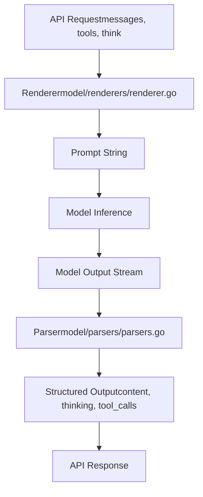
两个系统都采用注册模式，可为特定模型接入自定义实现。

**来源：** [model/parsers/parsers.go12-21](https://github.com/ollama/ollama/blob/562c76d7/model/parsers/parsers.go#L12-L21) [model/renderers/renderer.go9-11](https://github.com/ollama/ollama/blob/562c76d7/model/renderers/renderer.go#L9-L11) [server/routes.go360-371](https://github.com/ollama/ollama/blob/562c76d7/server/routes.go#L360-L371) [server/routes.go559-574](https://github.com/ollama/ollama/blob/562c76d7/server/routes.go#L559-L574)

---

## 解析器系统

解析器处理模型输出流以提取结构化信息。它们在生成期间运行，用于将常规内容与思考标签、工具调用等特殊标记分离。

### 解析器接口

`Parser` 接口定义了四个方法：

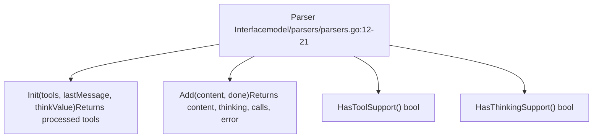
| 方法 | 用途 | 调用时机 |
| --- | --- | --- |
| `Init` | 用工具与选项初始化解析器 | 生成开始前 |
| `Add` | 处理流式内容块 | 每个输出 token/块 |
| `HasToolSupport` | 检查解析器是否支持工具 | 能力检测 |
| `HasThinkingSupport` | 检查解析器是否支持思考 | 能力检测 |

**来源：** [model/parsers/parsers.go12-21](https://github.com/ollama/ollama/blob/562c76d7/model/parsers/parsers.go#L12-L21)

### 内置解析器

Ollama 为具有专用输出格式的模型提供了解析器：

| 解析器名称 | 模型家族 | 功能 |
| --- | --- | --- |
| `passthrough` | Generic | 无解析，原样返回内容 |
| `harmony` | GPT-OSS | 使用 `<start>` 和 `<end>` 标签的完整解析 |
| `qwen3` | Qwen3 | 基础工具支持 |
| `qwen3-thinking` | Qwen3 variants | 工具与思考支持 |
| `qwen3.5` | Qwen3.5 | 高级思考级别 |
| `qwen3-coder` | Qwen3-Coder | 面向代码的工具调用 |
| `qwen3-vl-instruct` | Qwen3-VL | 视觉 + 工具支持 |
| `qwen3-vl-thinking` | Qwen3-VL variants | 视觉 + 思考支持 |
| `ministral` | Ministral | 基础工具支持 |
| `cogito` | Cogito | 偏重思考的解析 |
| `deepseek3` | DeepSeek v3 | 思考与工具支持 |
| `olmo3` | OLMo 3 | 标准解析 |
| `olmo3-think` | OLMo 3 Think | 专用思考 |
| `nemotron-3-nano` | Nemotron 3 Nano | Nvidia 格式 |
| `functiongemma` | Function Gemma | 工具导向 |
| `glm-4.7` | GLM-4.7 | 工具与思考 |
| `glm-ocr` | GLM-OCR | 视觉 + OCR 解析 |
| `lfm2` | LFM2 | 基础支持 |
| `lfm2-thinking` | LFM2 Think | 带思考支持 |

**来源：** [model/parsers/parsers.go41-89](https://github.com/ollama/ollama/blob/562c76d7/model/parsers/parsers.go#L41-L89)

### 解析器注册

可以使用 `Register` 函数注册自定义解析器：

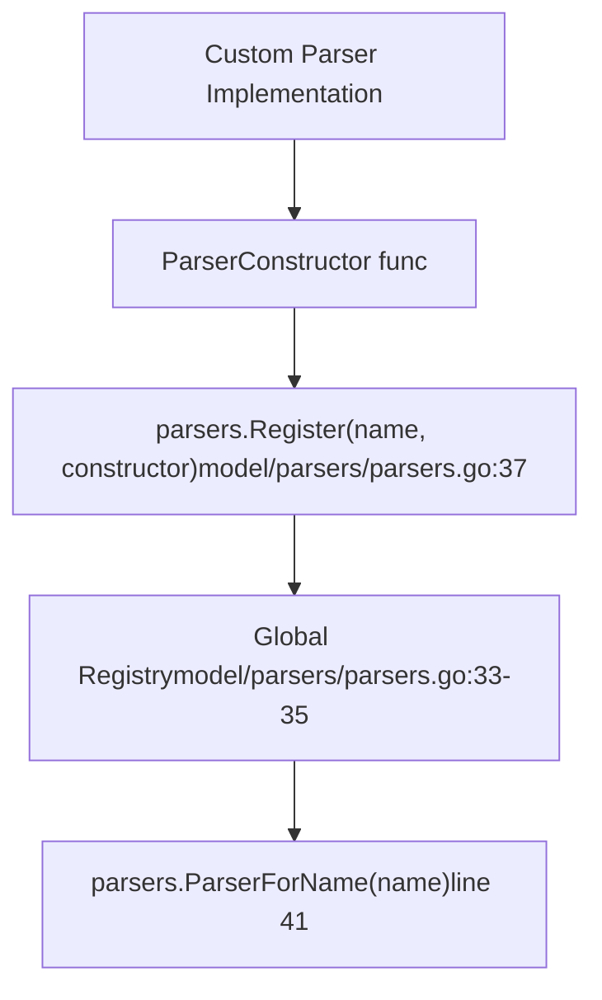
注册示例：

```
// Register a custom parserparsers.Register("custom-model", func() parsers.Parser {    return &CustomParser{}}) // Later, retrieve itparser := parsers.ParserForName("custom-model")
```
注册表允许通过使用相同名称进行注册来覆盖内置解析器。

**来源：** [model/parsers/parsers.go23-39](https://github.com/ollama/ollama/blob/562c76d7/model/parsers/parsers.go#L23-L39) [model/parsers/parsers\_test.go30-50](https://github.com/ollama/ollama/blob/562c76d7/model/parsers/parsers_test.go#L30-L50)

### 生成流程中的解析器使用

解析器被集成在 `server/routes.go` 的生成流水线中：

> **[Mermaid 时序图]**
> *(图表结构无法解析)*

**来源：** [server/routes.go360-371](https://github.com/ollama/ollama/blob/562c76d7/server/routes.go#L360-L371) [server/routes.go559-574](https://github.com/ollama/ollama/blob/562c76d7/server/routes.go#L559-L574) [server/routes.go516-528](https://github.com/ollama/ollama/blob/562c76d7/server/routes.go#L516-L528)

### 思考标签提取

当未配置自定义解析器时，具备思考能力的模型会使用后备解析器来检测思考标签：

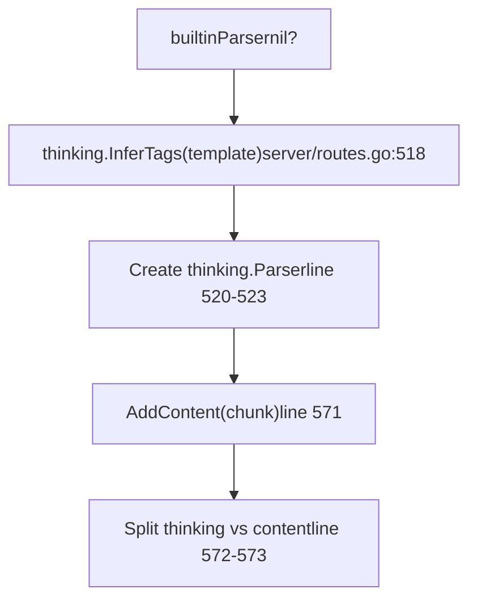
`thinking.InferTags` 函数会扫描模板中的常见思考标记，如 `<think>`、`<thinking>`、`<reasoning>` 等。

**来源：** [server/routes.go516-528](https://github.com/ollama/ollama/blob/562c76d7/server/routes.go#L516-L528) [server/routes.go570-574](https://github.com/ollama/ollama/blob/562c76d7/server/routes.go#L570-L574)

---

## 渲染器系统

渲染器将 API 消息、工具与选项转换为模型特定提示词字符串。对于复杂格式逻辑，它们提供了模板之外的替代方案。

### 渲染器接口

`Renderer` 接口只有一个方法：

```
type Renderer interface {    Render(messages []api.Message, tools []api.Tool, think *api.ThinkValue) (string, error)}
```
**来源：** [model/renderers/renderer.go9-11](https://github.com/ollama/ollama/blob/562c76d7/model/renderers/renderer.go#L9-L11)

### 内置渲染器

Ollama 为需要复杂提示词格式化的模型提供了渲染器：

| 渲染器名称 | 模型家族 | 关键特性 |
| --- | --- | --- |
| `qwen3-coder` | Qwen3-Coder | 代码补全格式 |
| `qwen3-vl-instruct` | Qwen3-VL | 视觉指令格式 |
| `qwen3-vl-thinking` | Qwen3-VL Think | 视觉 + 思考标签 |
| `qwen3.5` | Qwen3.5 | 高级思考级别 |
| `cogito` | Cogito | 偏重思考的格式 |
| `deepseek3.1` | DeepSeek 3.1 | 思考变体 |
| `olmo3` | OLMo 3 | 标准格式 |
| `olmo3.1` | OLMo 3.1 | 扩展系统消息 |
| `olmo3-think` | OLMo 3 Think | 思考变体（7B、32B） |
| `olmo3-32b-think` | OLMo 3 32B Think | 32B 专用变体 |
| `nemotron-3-nano` | Nemotron 3 Nano | Nvidia 格式 |
| `functiongemma` | Function Gemma | 工具导向格式 |
| `glm-4.7` | GLM-4.7 | 工具与思考 |
| `glm-ocr` | GLM-OCR | 视觉 + OCR 格式 |
| `lfm2` | LFM2 | 标准格式 |
| `lfm2-thinking` | LFM2 Think | 带思考支持 |

**来源：** [model/renderers/renderer.go45-97](https://github.com/ollama/ollama/blob/562c76d7/model/renderers/renderer.go#L45-L97)

### 渲染器注册

自定义渲染器使用与解析器相同的注册模式：

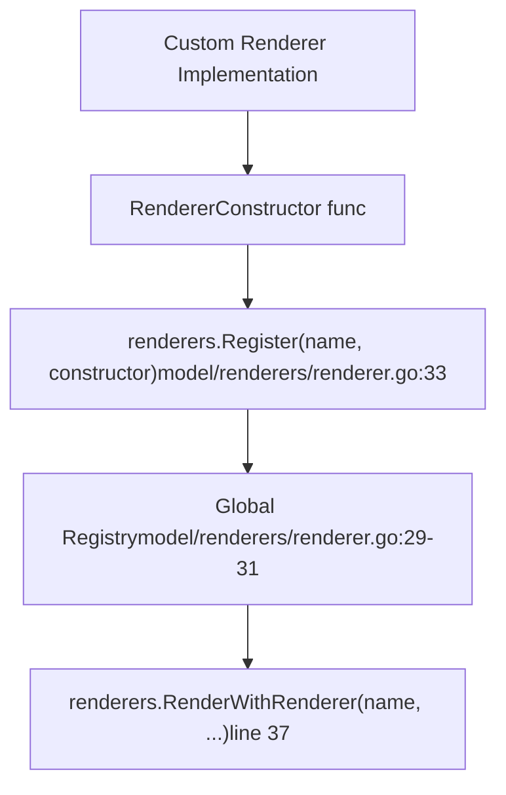
**来源：** [model/renderers/renderer.go14-36](https://github.com/ollama/ollama/blob/562c76d7/model/renderers/renderer.go#L14-L36)

### RenderImgTags 标志

渲染器会遵循一个控制图像标签格式的全局标志：

```
// Set by server package on initrenderers.RenderImgTags = true  // Use [img-N] tags
```
当 `RenderImgTags` 为 true 时，渲染器会为图像插入 `[img-0]`、`[img-1]` 等标签。为 false 时，图像将通过其他方式处理（例如多模态 token 插入）。

**来源：** [model/renderers/renderer.go20-23](https://github.com/ollama/ollama/blob/562c76d7/model/renderers/renderer.go#L20-L23) [server/routes.go107-109](https://github.com/ollama/ollama/blob/562c76d7/server/routes.go#L107-L109)

### 提示词流水线中的渲染器选择

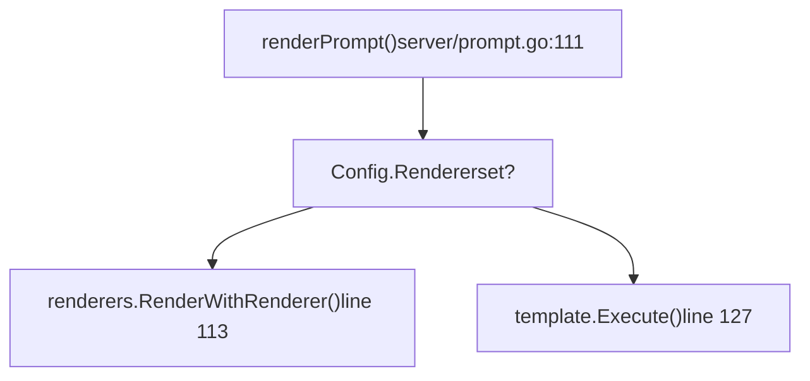
模型在 `Model.Config.Renderer` 中指定渲染器。若已设置则使用自定义渲染器，否则使用模板系统。

**来源：** [server/prompt.go111-131](https://github.com/ollama/ollama/blob/562c76d7/server/prompt.go#L111-L131)

---

## 模板系统（默认渲染器）

模板系统是 Ollama 默认的提示词渲染机制，基于 Go 的 `text/template` 包并提供自定义扩展。它处理大多数不需要复杂程序化格式化的模型。

### 模板结构与解析

模板从包含 Go 模板语法的字符串中解析，支持特殊变量和函数：

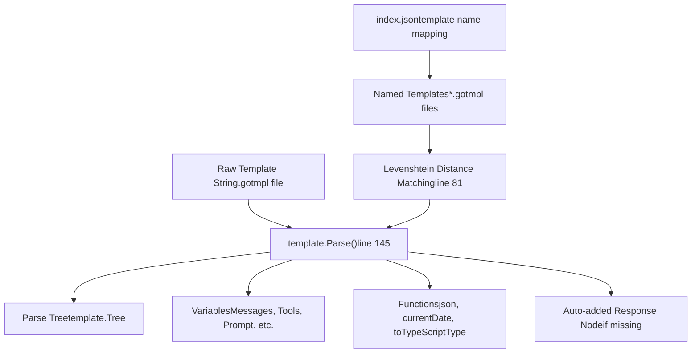
**来源：** [template/template.go145-164](https://github.com/ollama/ollama/blob/562c76d7/template/template.go#L145-L164) [template/template.go72-92](https://github.com/ollama/ollama/blob/562c76d7/template/template.go#L72-L92) [template/template.go30-56](https://github.com/ollama/ollama/blob/562c76d7/template/template.go#L30-L56)

### 模板变量

模板系统提供多个变量用于渲染提示词：

| 变量 | 类型 | 描述 | 可用范围 |
| --- | --- | --- | --- |
| `Messages` | `[]templateMessage` | 汇总后的消息历史 | 现代模板（包含 `.Messages` 变量） |
| `Tools` | `templateTools` | 可用工具定义 | 现代模板 |
| `Prompt` | `string` | 当前用户提示词 | 旧版模板 |
| `Response` | `string` | 助手响应 | 旧版模板 |
| `System` | `string` | 系统消息内容 | 两种模式均可 |
| `Think` | `bool` | 是否启用思考 | 所有模板 |
| `ThinkLevel` | `string` | 若设置则表示思考级别 | 所有模板 |
| `IsThinkSet` | `bool` | 是否显式设置了 Think | 所有模板 |
| `Suffix` | `string` | 代码补全后缀 | 代码补全模式 |

**来源：** [template/template.go195-209](https://github.com/ollama/ollama/blob/562c76d7/template/template.go#L195-L209) [template/template.go257-282](https://github.com/ollama/ollama/blob/562c76d7/template/template.go#L257-L282)

### 模板函数

内置函数扩展了模板能力：

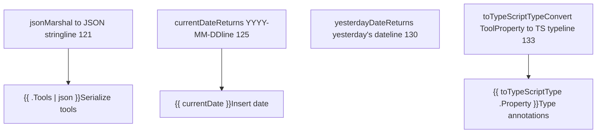
**来源：** [template/template.go120-143](https://github.com/ollama/ollama/blob/562c76d7/template/template.go#L120-L143) [template/template\_test.go455-519](https://github.com/ollama/ollama/blob/562c76d7/template/template_test.go#L455-L519)

### 模板执行模式

模板会根据是否使用现代或旧版变量在两种模式下执行：

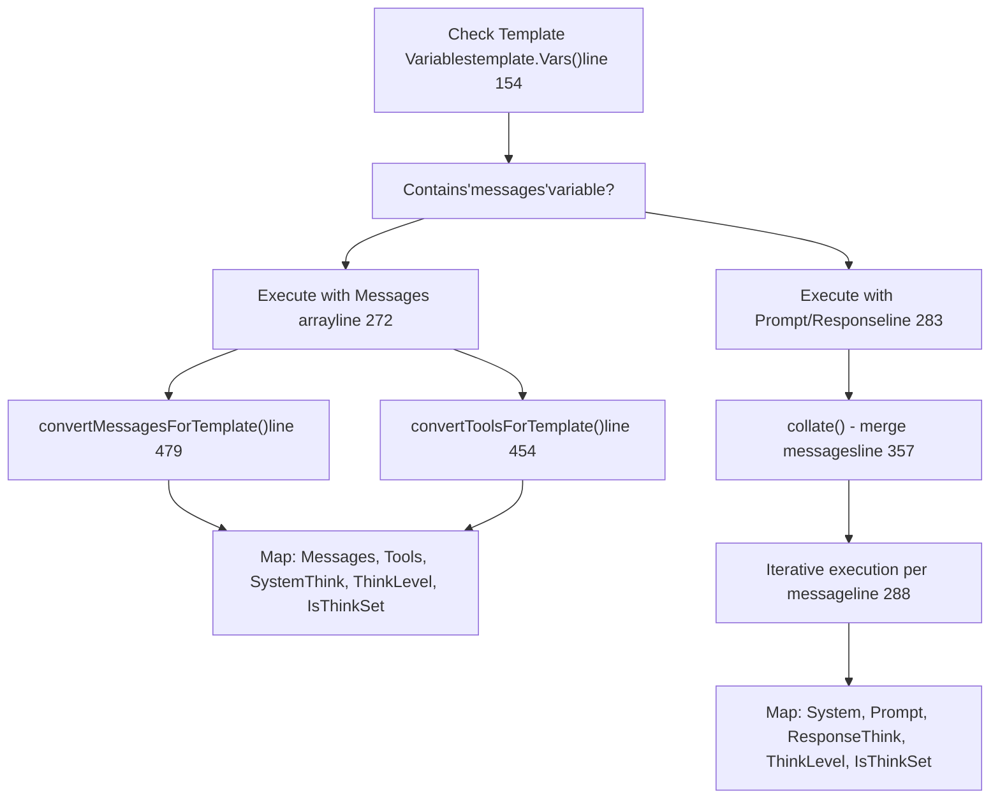
**来源：** [template/template.go257-350](https://github.com/ollama/ollama/blob/562c76d7/template/template.go#L257-L350) [template/template.go357-374](https://github.com/ollama/ollama/blob/562c76d7/template/template.go#L357-L374) [template/template.go454-508](https://github.com/ollama/ollama/blob/562c76d7/template/template.go#L454-L508)

### 消息归并

`collate` 函数会在模板执行前处理消息：

-   合并连续且角色相同的消息（工具消息除外）
-   将所有系统消息提取为单个字符串
-   保留工具消息元数据（ToolName、ToolCallID）

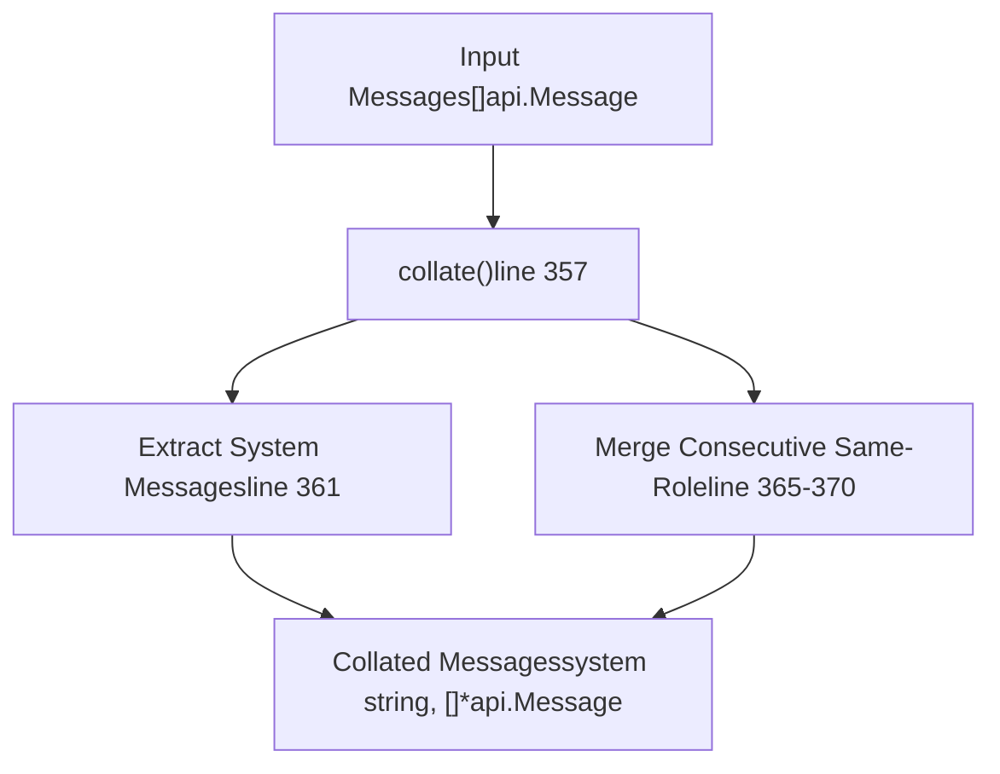
**来源：** [template/template.go357-374](https://github.com/ollama/ollama/blob/562c76d7/template/template.go#L357-L374) [template/template\_test.go521-615](https://github.com/ollama/ollama/blob/562c76d7/template/template_test.go#L521-L615)

### 模板类型转换

模板无法直接对某些 Go 类型进行 `range`，因此转换函数会创建适配模板的表示：

| 源类型 | 模板类型 | 转换函数 | 用途 |
| --- | --- | --- | --- |
| `api.Message` | `templateMessage` | `convertMessagesForTemplate()` | 支持迭代与字段访问 |
| `api.Tool` | `templateTool` | `convertToolsForTemplate()` | 转换 Properties map 以支持迭代 |
| `api.ToolCallFunctionArguments` | `templateArgs` | 转换时自动完成 | 支持参数迭代 |
| `api.ToolPropertiesMap` | `templateProperties` | 转换时自动完成 | 支持属性迭代 |

这些类型实现了 `String()` 方法，可序列化为 JSON，从而同时支持迭代和 JSON 序列化：

**来源：** [template/template.go376-508](https://github.com/ollama/ollama/blob/562c76d7/template/template.go#L376-L508) [template/template\_test.go617-771](https://github.com/ollama/ollama/blob/562c76d7/template/template_test.go#L617-L771)

---

## 渲染器系统

渲染器系统为需要自定义提示词格式化逻辑、且不易通过 Go 模板表达的模型提供模板替代方案。

### 渲染器选择

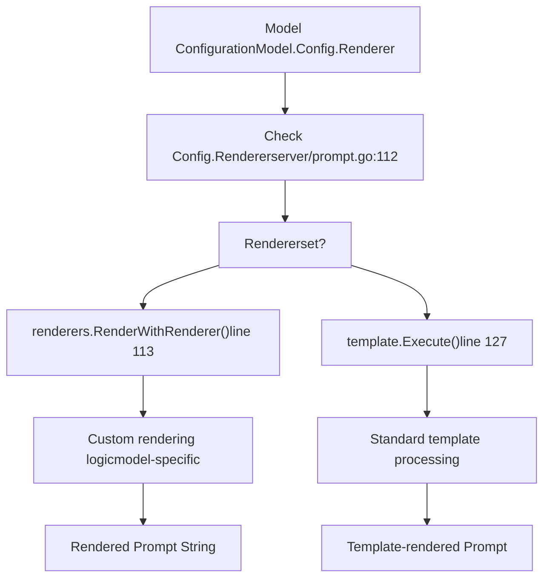
**来源：** [server/prompt.go111-131](https://github.com/ollama/ollama/blob/562c76d7/server/prompt.go#L111-L131)

渲染器接口允许模型实现复杂格式需求，例如：

-   按特定模式交错插入图像 token 与文本
-   超出模板能力的复杂工具格式化
-   基于上下文的动态提示词结构
-   需要程序化逻辑的特殊 token 序列

---

## 示例：自定义解析器与渲染器

下面展示模型如何实现自定义解析与渲染：

### 自定义解析器实现

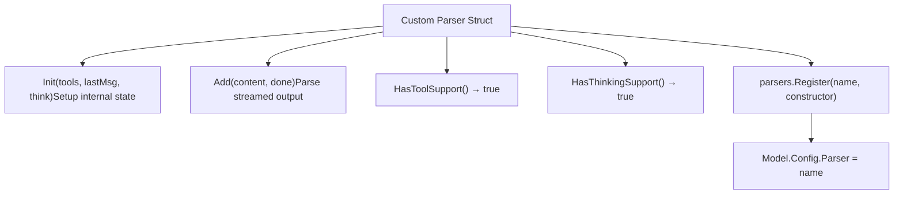
解析器以增量方式处理输出并提取结构化元素：

| 方法调用 | 输入 | 输出 |
| --- | --- | --- |
| `Init(...)` | 工具、最后一条消息、think 值 | 处理后的工具（可重命名/转换） |
| `Add("text", false)` | 部分输出块 | content、thinking、calls（空）、nil |
| `Add("<tool>...</tool>", true)` | 含工具的最终块 | ""、""、\[ToolCall{...}\]、nil |

**来源：** [model/parsers/parsers.go12-21](https://github.com/ollama/ollama/blob/562c76d7/model/parsers/parsers.go#L12-L21) [server/routes.go360-371](https://github.com/ollama/ollama/blob/562c76d7/server/routes.go#L360-L371)

### 自定义渲染器实现

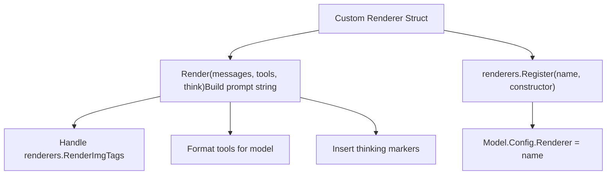
渲染器会从结构化输入构建完整提示词字符串。

**来源：** [model/renderers/renderer.go9-11](https://github.com/ollama/ollama/blob/562c76d7/model/renderers/renderer.go#L9-L11) [model/renderers/glmocr.go11-104](https://github.com/ollama/ollama/blob/562c76d7/model/renderers/glmocr.go#L11-L104)

### GLM-OCR 示例

GLM-OCR 模型同时演示了自定义解析与渲染：

**Renderer**（`glmocr.go`）：

-   当 `RenderImgTags` 为 true 时插入 `[img-N]` 标签
-   使用 XML 风格标签格式化工具：`<tools>`、`<tool_call>`
-   使用 `<think>` 标签与 `/nothink` 指令处理思考
-   使用特殊 token：`[gMASK]<sop>`、`<|user|>`、`<|assistant|>`、`<|observation|>`

**Parser**（`glmocr_parser.go`）：

-   将 `<think>` 标签间内容提取为 thinking
-   解析包含 `<arg_key>`/`<arg_value>` 键值对的 `<tool_call>` 块
-   从最终内容中移除 XML 标记

**来源：** [model/renderers/glmocr.go11-127](https://github.com/ollama/ollama/blob/562c76d7/model/renderers/glmocr.go#L11-L127) [model/parsers/glmocr.go1-150](https://github.com/ollama/ollama/blob/562c76d7/model/parsers/glmocr.go#L1-L150)

---

## 提示词渲染流水线

完整的提示词渲染流水线会处理消息截断、图像标签插入以及模板/渲染器执行。

### 流水线流程

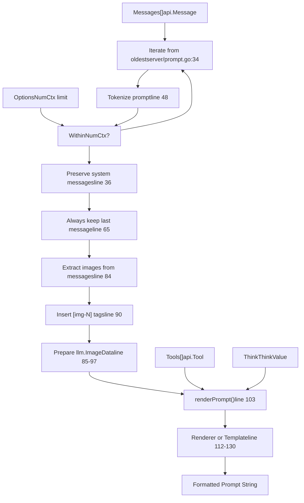
**来源：** [server/prompt.go23-109](https://github.com/ollama/ollama/blob/562c76d7/server/prompt.go#L23-L109)

### 消息截断策略

该截断算法在保留关键信息的同时确保提示词适配上下文窗口：

1.  **从全部消息开始** - 先从完整消息历史开始
2.  **从旧到新迭代** - 逐步尝试减少消息数量
3.  **保留系统消息** - 始终包含被截断部分中的系统消息
4.  **保留最后消息** - 始终包含最近一条用户消息
5.  **考虑图像开销** - 对视觉模型每张图额外计入 768 token（近似值）
6.  **分词并测量** - 检查渲染结果是否适配 `NumCtx`

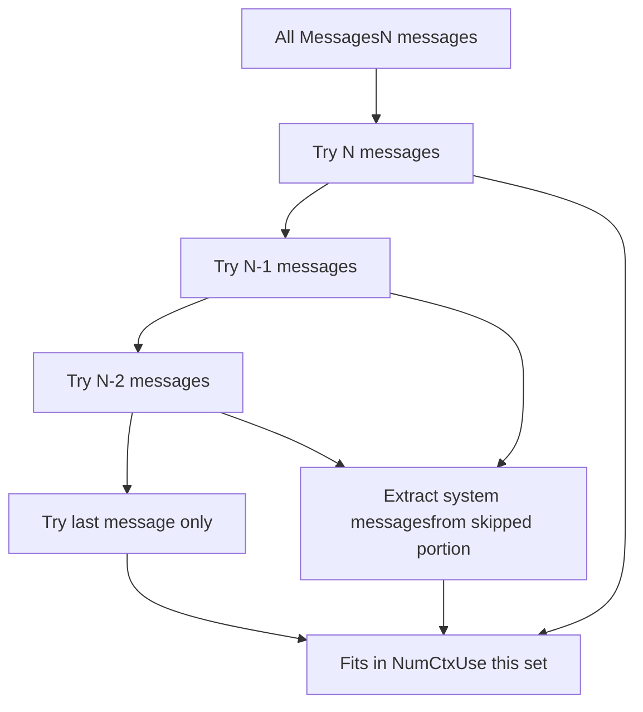
**来源：** [server/prompt.go34-70](https://github.com/ollama/ollama/blob/562c76d7/server/prompt.go#L34-L70) [server/prompt\_test.go14-267](https://github.com/ollama/ollama/blob/562c76d7/server/prompt_test.go#L14-L267)

### 图像标签插入

图像会在提示词文本中被替换为编号标签（`[img-0]`、`[img-1]` 等）：

| 场景 | 行为 | 示例 |
| --- | --- | --- |
| Image with content | Prefix tag | `[img-0]What is this?` |
| Content with `[img]` | Replace first occurrence | `What is [img-0]?` |
| Multiple images | Increment IDs | `[img-0][img-1]Compare these` |

`llm.ImageData` 结构会以匹配 ID 单独收集，以供后续处理。

**来源：** [server/prompt.go84-100](https://github.com/ollama/ollama/blob/562c76d7/server/prompt.go#L84-L100)

---

## 与模型架构的集成

不同模型架构会在不同阶段集成解析与渲染：

### 模型特定集成点

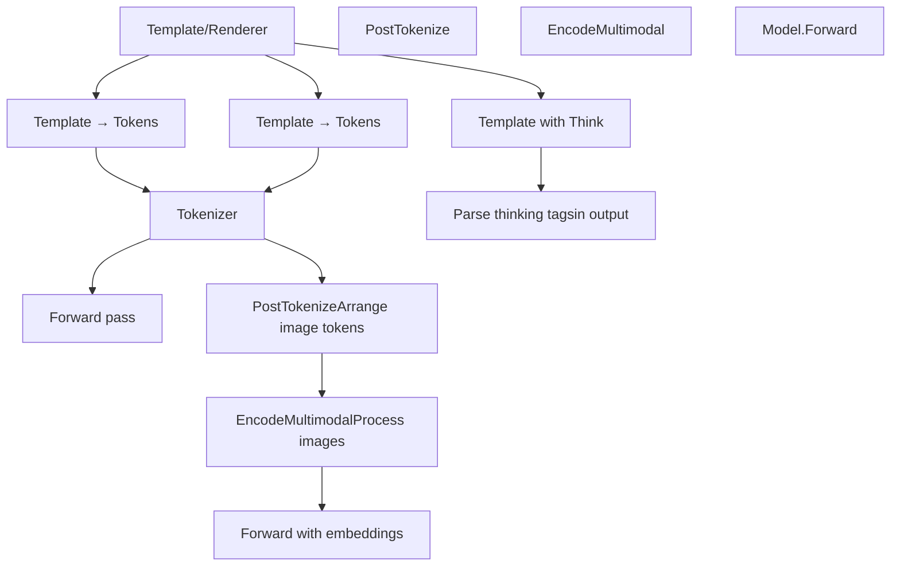
**来源：** [server/prompt.go111-131](https://github.com/ollama/ollama/blob/562c76d7/server/prompt.go#L111-L131) [model/models/gemma3/model.go101-125](https://github.com/ollama/ollama/blob/562c76d7/model/models/gemma3/model.go#L101-L125) [model/models/mistral3/model.go103-166](https://github.com/ollama/ollama/blob/562c76d7/model/models/mistral3/model.go#L103-L166)

### 多模态处理链

对于视觉模型，处理链包含多个转换步骤：

1.  **Template/Renderer** - 插入图像占位符
2.  **Tokenization** - 将文本转换为 token
3.  **PostTokenize** - 用多模态标记安排 token 序列
4.  **EncodeMultimodal** - 将图像数据处理为嵌入
5.  **Forward Pass** - 在标记位置插入嵌入

每个模型都会实现 `EncodeMultimodal` 与 `PostTokenize` 以匹配其架构要求：

| Model | Image Processing | Post-Tokenization Strategy |
| --- | --- | --- |
| Gemma3 | Vision transformer + projector | Newlines + start/end markers |
| Mistral3 | Vision model + patch merger | Row-based with break tokens |
| Llama4 | Local + global tiles | Tile separators + global view |
| Qwen2.5-VL | Spatial patches + grid | Position cache for MRoPE |
| MLlama | Cross-attention encoder | Image token as attention key |

**来源：** [model/models/gemma3/model.go101-125](https://github.com/ollama/ollama/blob/562c76d7/model/models/gemma3/model.go#L101-L125) [model/models/mistral3/model.go103-130](https://github.com/ollama/ollama/blob/562c76d7/model/models/mistral3/model.go#L103-L130) [model/models/llama4/model.go65-126](https://github.com/ollama/ollama/blob/562c76d7/model/models/llama4/model.go#L65-L126) [model/models/qwen25vl/model.go76-88](https://github.com/ollama/ollama/blob/562c76d7/model/models/qwen25vl/model.go#L76-L88) [model/models/mllama/model.go63-92](https://github.com/ollama/ollama/blob/562c76d7/model/models/mllama/model.go#L63-L92)

---

## 总结

Ollama 的解析器与渲染器系统为处理多样化模型架构提供了灵活框架：

-   **模板** 是默认渲染机制，采用 Go 模板语法
-   **渲染器** 为有复杂格式需求的模型提供自定义逻辑
-   **后分词处理** 为模型特定需求转换 token 序列
-   **类型转换** 保证复杂数据结构与模板兼容
-   **消息截断** 在上下文限制内保持提示词质量
-   **图像处理** 在整个处理流水线中协调多模态数据

该架构使 Ollama 能在向用户提供统一 API 的同时支持广泛的模型家族。

**来源：** [template/template.go1-647](https://github.com/ollama/ollama/blob/562c76d7/template/template.go#L1-L647) [server/prompt.go1-132](https://github.com/ollama/ollama/blob/562c76d7/server/prompt.go#L1-L132) [model/models/gemma3/model.go1-172](https://github.com/ollama/ollama/blob/562c76d7/model/models/gemma3/model.go#L1-L172) [model/models/mistral3/model.go1-171](https://github.com/ollama/ollama/blob/562c76d7/model/models/mistral3/model.go#L1-L171) [model/models/llama4/model.go1-181](https://github.com/ollama/ollama/blob/562c76d7/model/models/llama4/model.go#L1-L181)
