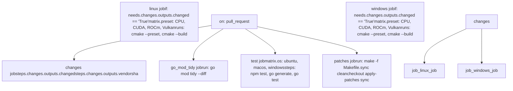
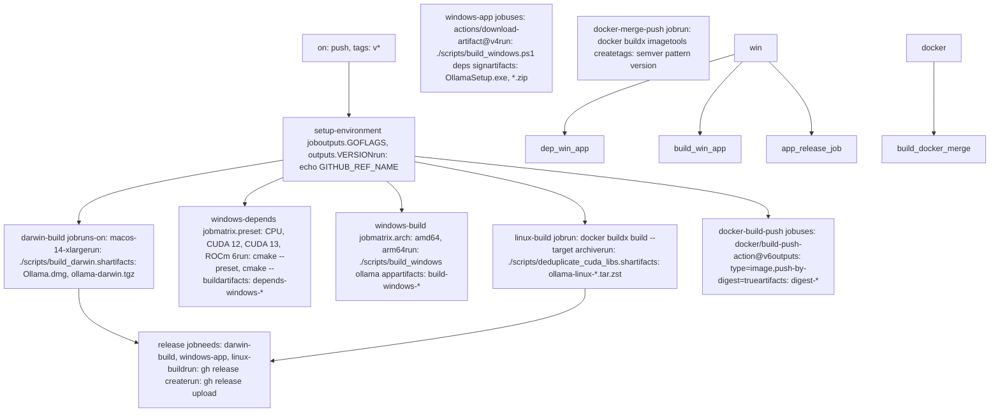
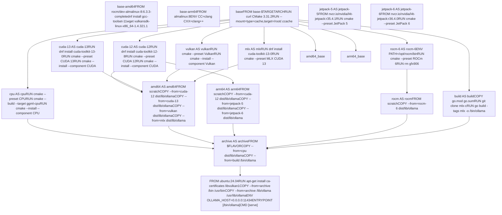
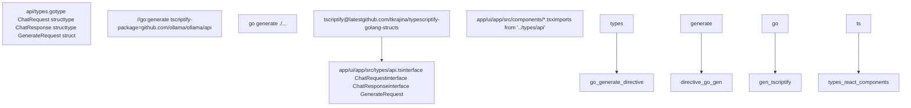

# 开发指南

相关源文件

-   [.github/workflows/release.yaml](https://github.com/ollama/ollama/blob/562c76d7/.github/workflows/release.yaml)
-   [.github/workflows/test-install.yaml](https://github.com/ollama/ollama/blob/562c76d7/.github/workflows/test-install.yaml)
-   [.github/workflows/test.yaml](https://github.com/ollama/ollama/blob/562c76d7/.github/workflows/test.yaml)
-   [Dockerfile](https://github.com/ollama/ollama/blob/562c76d7/Dockerfile)
-   [app/ollama.iss](https://github.com/ollama/ollama/blob/562c76d7/app/ollama.iss)
-   [cmd/config/claude\_test.go](https://github.com/ollama/ollama/blob/562c76d7/cmd/config/claude_test.go)
-   [cmd/config/codex.go](https://github.com/ollama/ollama/blob/562c76d7/cmd/config/codex.go)
-   [cmd/config/codex\_test.go](https://github.com/ollama/ollama/blob/562c76d7/cmd/config/codex_test.go)
-   [go.mod](https://github.com/ollama/ollama/blob/562c76d7/go.mod)
-   [go.sum](https://github.com/ollama/ollama/blob/562c76d7/go.sum)
-   [scripts/build\_darwin.sh](https://github.com/ollama/ollama/blob/562c76d7/scripts/build_darwin.sh)
-   [scripts/build\_linux.sh](https://github.com/ollama/ollama/blob/562c76d7/scripts/build_linux.sh)
-   [scripts/build\_windows.ps1](https://github.com/ollama/ollama/blob/562c76d7/scripts/build_windows.ps1)
-   [scripts/deduplicate\_cuda\_libs.sh](https://github.com/ollama/ollama/blob/562c76d7/scripts/deduplicate_cuda_libs.sh)
-   [scripts/install.ps1](https://github.com/ollama/ollama/blob/562c76d7/scripts/install.ps1)
-   [scripts/install.sh](https://github.com/ollama/ollama/blob/562c76d7/scripts/install.sh)

本指南涵盖了 Ollama 的开发工作流程、构建系统架构和贡献流程。它概述了代码库的组织方式、构建的配置方式以及 CI/CD 管道的运行方式。

有关您平台的分步构建说明，请参阅 [从源码构建](/ollama/ollama/8.1-building-from-source)。有关特定于平台的编译详细信息，请参阅 [特定于平台的构建细节](/ollama/ollama/8.2-platform-specific-build-details)。有关测试的信息，请参阅 [测试和质量保证](/ollama/ollama/8.3-testing-and-quality-assurance)。对于桌面应用程序开发，请参阅 [桌面应用程序开发](/ollama/ollama/8.4-desktop-application-development)。

---

## 仓库结构

Ollama 仓库分为几个关键目录，每个目录都有不同的职责：

| 目录 | 目的 | 关键文件 |
| --- | --- | --- |
| `cmd/` | CLI 入口点 | `cmd.go` - 主要命令执行 |
| `server/` | HTTP 服务器、API 处理程序、调度程序 | `routes.go`、`sched.go`、`images.go` |
| `llm/` | LLM 运行器界面和服务器管理 | `server.go`、`payload_*.go` |
| `runner/` | 运行器实现 | `ollamarunner/`、`llamarunner/` |
| `ml/backend/ggml/` | 本机 ML 后端 (GGML) | `ggml/`子模块 |
| `x/ml/backend/mlx/` | 实验性 MLX 后端 | `mlx/`子模块 |
| `model/` | 模型架构实现 | `gemma3/`、`llama/`、`mllama/` |
| `kvcache/` | KV缓存管理 | `cache.go` |
| `convert/` | 模型转换实用程序 | `convert.go`、`convert_*.go` |
| `template/` | 聊天模板系统 | `template.go`、`named.go` |
| `tools/` | 工具调用系统 | `parser.go`、`registry.go` |
| `discover/` | GPU发现和枚举 | `gpu_*.go` |
| `app/` | 桌面应用程序 | `ui/app/` - React UI，`cmd/app/` - Go 后端 |
| `scripts/` | 构建和发布脚本 | `build_darwin.sh`、`build_windows.ps1`、`build_linux.sh` |
| `.github/workflows/` | CI/CD 定义 | `test.yaml`、`release.yaml` |
| `integration/` | 集成测试 | `*_test.go` |

**仓库结构和构建流程**

```mermaid
flowchart TD
    cmd_main["cmd/cmd.gocmd.Execute()"]
    routes["server/routes.goServer.Serve()"]
    sched["server/sched.goScheduler.GetRunner()"]
    images["server/images.goCreateModel()"]
    llm_server["llm/server.gollama.LlamaServer"]
    ollamarunner["runner/ollamarunner/ollamarunner.NewServer()"]
    llamarunner["runner/llamarunner/llamarunner.NewLlamaServer()"]
    ggml_backend["ml/backend/ggml/ggml.goggml.Backend"]
    ggml_submod["ml/backend/ggml/ggml/ggml.c, ggml-cuda.cu"]
    cmake["CMakeLists.txttargets: ggml-cpu, ggml-cuda"]
    presets["CMakePresets.jsonpresets: CPU, CUDA 12, CUDA 13"]
    build_win["scripts/build_windows.ps1functions: cpu(), cuda12(), ollama()"]
    build_mac["scripts/build_darwin.shfunctions: _build_darwin(), _sign_darwin()"]
    build_lin["scripts/build_linux.shdocker buildx build --target archive"]
    test_yaml[".github/workflows/test.yamljobs: changes, linux, windows, test"]
    release_yaml[".github/workflows/release.yamljobs: darwin-build, windows-app, release"]

    cmd --> main_routes
    routes --> sched
    sched --> llm_server
    llm --> server_ollamarunner
    llm --> server_llamarunner
    ollamarunner --> ggml_backend
    llamarunner --> ggml_backend
    cmake --> ggml_submod
    presets --> cmake
    build --> win_cmake
    build --> mac_cmake
    build --> lin_cmake
    test --> yaml_build_win
    test --> yaml_build_mac
    release --> yaml_build_win
    release --> yaml_build_mac
    release --> yaml_build_lin
```


来源：[cmd/cmd.go1-100](https://github.com/ollama/ollama/blob/562c76d7/cmd/cmd.go#L1-L100) [server/routes.go1-50](https://github.com/ollama/ollama/blob/562c76d7/server/routes.go#L1-L50) [server/sched.go1-50](https://github.com/ollama/ollama/blob/562c76d7/server/sched.go#L1-L50) [llm/server.go1-50](https://github.com/ollama/ollama/blob/562c76d7/llm/server.go#L1-L50) [CMakeLists.txt1-219](https://github.com/ollama/ollama/blob/562c76d7/CMakeLists.txt#L1-L219) [CMakePresets.json1-183](https://github.com/ollama/ollama/blob/562c76d7/CMakePresets.json#L1-L183)

---

## 构建系统架构

Ollama 使用混合构建系统，结合了用于本机库的 CMake 和用于应用程序层的 Go。构建过程遵循三阶段管道：本机库编译、Go 二进制编译和打包。

### CMake预设系统

CMake 预设定义了不同平台和加速后端的构建配置。每个预设指定编译器标志、目标体系结构和安装路径。

**CMake 预设到目标映射**

```mermaid
flowchart TD
    cpu_preset["configurePresets[0]name: CPU"]
    cuda11_preset["configurePresets[2]name: CUDA 11"]
    cuda12_preset["configurePresets[3]name: CUDA 12"]
    cuda13_preset["configurePresets[4]name: CUDA 13"]
    rocm6_preset["configurePresets[8]name: ROCm 6"]
    vulkan_preset["configurePresets[9]name: Vulkan"]
    mlx_preset["configurePresets[10]name: MLX"]
    ggml_cpu["add_library(ggml-cpu)STATIC ggml/src/ggml.c"]
    ggml_cuda["add_library(ggml-cuda)SHARED ggml/src/ggml-cuda.cu"]
    ggml_hip["add_library(ggml-hip)SHARED ggml/src/ggml-hip.cu"]
    ggml_vulkan["add_library(ggml-vulkan)SHARED ggml/src/ggml-vulkan.cpp"]
    mlx_mlxc["add_custom_commandOUTPUT libmlx.dylib libmlxc.dylib"]
    cpu_out["dist/lib/ollama/libggml-cpu.so"]
    cuda_out["dist/lib/ollama/cuda_v*/libggml-cuda.so"]
    rocm_out["dist/lib/ollama/rocm/libggml-hip.so"]
    vulkan_out["dist/lib/ollama/vulkan/libggml-vulkan.so"]
    mlx_out["dist/lib/ollama/mlx/libmlx.dylib, libmlxc.dylib"]

    cpu --> preset_ggml_cpu
    cuda11 --> preset_ggml_cuda
    cuda12 --> preset_ggml_cuda
    cuda13 --> preset_ggml_cuda
    rocm6 --> preset_ggml_hip
    vulkan --> preset_ggml_vulkan
    mlx --> preset_mlx_mlxc
    ggml --> cpu_cpu_out
    ggml --> cuda_cuda_out
    ggml --> hip_rocm_out
    ggml --> vulkan_vulkan_out
    mlx --> mlxc_mlx_out
```


来源：[CMakePresets.json14-93](https://github.com/ollama/ollama/blob/562c76d7/CMakePresets.json#L14-L93) [CMakeLists.txt82-219](https://github.com/ollama/ollama/blob/562c76d7/CMakeLists.txt#L82-L219) [scripts/build\_windows.ps1105-229](https://github.com/ollama/ollama/blob/562c76d7/scripts/build_windows.ps1#L105-L229) [scripts/build\_darwin.sh50-79](https://github.com/ollama/ollama/blob/562c76d7/scripts/build_darwin.sh#L50-L79)

**关键 CMake 预设：**

| 预设 | 平台 | 目标 | 输出组件 |
| --- | --- | --- | --- |
| `CPU` | 全部 | `ggml-cpu` | `CPU` |
| `CUDA 11` | Windows、Linux | `ggml-cuda` | `CUDA` |
| `CUDA 12` | Windows、Linux | `ggml-cuda` | `CUDA` |
| `CUDA 13` | Windows、Linux | `ggml-cuda` | `CUDA` |
| `ROCm 6` | Windows、Linux | `ggml-hip` | `HIP` |
| `Vulkan` | 全部 | `ggml-vulkan` | `Vulkan` |
| `JetPack 5` | LinuxARM64 | `ggml-cuda` | `CUDA` |
| `JetPack 6` | LinuxARM64 | `ggml-cuda` | `CUDA` |
| `MLX` | macOS | `mlx mlxc` | `MLX` |
| `MLX CUDA 13` | Linux | `mlx mlxc` | `MLX` |

构建脚本中引用了预设：

-   Windows：[scripts/build\_windows.ps199-103](https://github.com/ollama/ollama/blob/562c76d7/scripts/build_windows.ps1#L99-L103) 用于 CPU，[scripts/build\_windows.ps1126-131](https://github.com/ollama/ollama/blob/562c76d7/scripts/build_windows.ps1#L126-L131) 用于 CUDA
-   macOS：[scripts/build\_darwin.sh50-60](https://github.com/ollama/ollama/blob/562c76d7/scripts/build_darwin.sh#L50-L60) 适用于 amd64，[scripts/build\_darwin.sh66-71](https://github.com/ollama/ollama/blob/562c76d7/scripts/build_darwin.sh#L66-L71) 适用于 arm64
-   Linux (Docker)：[Dockerfile48-159](https://github.com/ollama/ollama/blob/562c76d7/Dockerfile#L48-L159) 适用于所有预设

### 去构建标签

Go build 标签控制哪些功能被编译到二进制文件中。主要标签是 `mlx`，它启用实验性 MLX 后端支持。

**不使用 MLX 构建（默认）：**

```
go build .
```
**使用 MLX 构建：**

```
go build -tags mlx .
```
MLX 标签用于：

-   [Dockerfile175](https://github.com/ollama/ollama/blob/562c76d7/Dockerfile#L175-L175) - 支持 MLX 的 Linux 构建
-   [scripts/build\_darwin.sh76](https://github.com/ollama/ollama/blob/562c76d7/scripts/build_darwin.sh#L76-L76) - 支持 MLX 的 macOS 构建
-   [README.md276](https://github.com/ollama/ollama/blob/562c76d7/README.md?plain=1#L276-L276) - MLX 构建说明

**使用脚本函数完成构建管道**

```mermaid
flowchart TD
    cmake_config["cmake --preset CPU/CUDA/ROCm/Vulkan/MLX"]
    cmake_build["cmake --build --parallel"]
    cmake_install["cmake --install build --component CPU/CUDA/HIP"]
    go_generate["go generate ./...runs tscriptify on api/types.go"]
    go_build["go build -trimpath-ldflags with version.Version"]
    win_cpu["cpu() - line 99"]
    win_cuda12["cuda12() - line 176"]
    win_ollama["ollama() - line 231"]
    win_sign["sign() - line 304signtool.exe with KEY_CONTAINER"]
    win_installer["installer() - line 326ISCC.exe app/ollama.iss"]
    win_zip["zip() - line 342Compress-Archive"]
    mac_build["_build_darwin() - line 42lipo creates universal binary"]
    mac_sign["_sign_darwin() - line 83codesign with APPLE_IDENTITY"]
    mac_app["_build_macapp() - line 107creates Ollama.app bundle"]
    lin_docker["docker buildx build - line 28--target archive"]
    lin_compress["tar + zstd - line 60--ultra -22 -T0"]

    cmake --> config_cmake_build
    cmake --> build_cmake_install
    go --> generate_go_build
    win --> cpu_win_ollama
    win --> cuda12_win_ollama
    win --> ollama_win_sign
    win --> sign_win_installer
    win --> sign_win_zip
    mac --> build_mac_sign
    mac --> sign_mac_app
    lin --> docker_lin_compress
    cmake --> install_go_build
    go --> build_win_ollama
    go --> build_mac_build
    go --> build_lin_docker
```


来源：[scripts/build\_windows.ps193-375](https://github.com/ollama/ollama/blob/562c76d7/scripts/build_windows.ps1#L93-L375) [scripts/build\_darwin.sh42-230](https://github.com/ollama/ollama/blob/562c76d7/scripts/build_darwin.sh#L42-L230) [scripts/build\_linux.sh1-75](https://github.com/ollama/ollama/blob/562c76d7/scripts/build_linux.sh#L1-L75)

**构建环境变量：**

| 多变的 | 目的 | 设置 |
| --- | --- | --- |
| `VERSION` | 嵌入二进制文件的版本字符串 | [scripts/build\_darwin.sh15](https://github.com/ollama/ollama/blob/562c76d7/scripts/build_darwin.sh#L15-L15) |
| `GOFLAGS` | Go 链接器标志（版本、模式） | [scripts/build\_darwin.sh16](https://github.com/ollama/ollama/blob/562c76d7/scripts/build_darwin.sh#L16-L16) [.github/workflows/release.yaml25](https://github.com/ollama/ollama/blob/562c76d7/.github/workflows/release.yaml#L25-L25) |
| `CGO_ENABLED` | 启用 CGO 进行本机集成 | [scripts/build\_windows.ps158](https://github.com/ollama/ollama/blob/562c76d7/scripts/build_windows.ps1#L58-L58) |
| `CGO_CFLAGS` | C 编译器标志 | [scripts/build\_darwin.sh17](https://github.com/ollama/ollama/blob/562c76d7/scripts/build_darwin.sh#L17-L17) [scripts/build\_windows.ps162-63](https://github.com/ollama/ollama/blob/562c76d7/scripts/build_windows.ps1#L62-L63) |
| `CGO_LDFLAGS` | 链接器标志 | [scripts/build\_darwin.sh19](https://github.com/ollama/ollama/blob/562c76d7/scripts/build_darwin.sh#L19-L19) [scripts/build\_windows.ps163-64](https://github.com/ollama/ollama/blob/562c76d7/scripts/build_windows.ps1#L63-L64) |
| `VULKAN_SDK` | Vulkan SDK 路径 | [scripts/build\_windows.ps166](https://github.com/ollama/ollama/blob/562c76d7/scripts/build_windows.ps1#L66-L66) |

---

## 开发流程

### 本地开发设置

**平台先决条件：**

**苹果系统：**

```
# Apple Silicon - Metal built-ingo version  # Go 1.21+ # Intel - requires CMakebrew install cmake
```
**Windows：**

```
# Requiredcmake --version# Visual Studio 2022 with C++ Desktop Development # Optional - GPU support# CUDA: CUDA SDK 12.8 or 13.0# ROCm: AMD ROCm 6.x# Vulkan: Vulkan SDK 1.4.321.1
```
**Linux：**

```
# Requiredsudo apt install cmake  # or dnf install cmake # Optional - GPU support# CUDA: CUDA SDK 12.8 or 13.0# ROCm: ROCm 6.x# Vulkan: vulkan-sdk
```
来源：[docs/development.md3-119](https://github.com/ollama/ollama/blob/562c76d7/docs/development.md?plain=1#L3-L119)

### 构建本机库

本机库必须在 Go 二进制文件之前构建。该过程因平台而异：

**Windows（仅限 CPU）：**

```
cmake -B buildcmake --build build --config Release
```
**Windows（带有 CUDA 13）：**

```
cmake -B build --preset "CUDA 13"cmake --build build --config Release
```
**macOS（金属）：**

```
cmake --preset MLXcmake --build --preset MLX --parallel
```
**Linux（CPU）：**

```
cmake -B buildcmake --build build
```
来源：[docs/development.md28-119](https://github.com/ollama/ollama/blob/562c76d7/docs/development.md?plain=1#L28-L119) [scripts/build\_windows.ps199-223](https://github.com/ollama/ollama/blob/562c76d7/scripts/build_windows.ps1#L99-L223)

### 构建和运行 Olama

构建本机库后，编译并运行 Ollama 二进制文件：

```
# Build the binarygo run . serve # Or build and run separatelygo build ../ollama serve
```
二进制文件将自动发现与可执行文件相关的这些位置的本机库：

-   `./lib/ollama`（Windows）
-   `../lib/ollama`（Linux）
-   `.` (macOS)
-   `build/lib/ollama`（开发）

来源：[docs/development.md8-16](https://github.com/ollama/ollama/blob/562c76d7/docs/development.md?plain=1#L8-L16) [docs/development.md170-179](https://github.com/ollama/ollama/blob/562c76d7/docs/development.md?plain=1#L170-L179)

### 常见开发任务

**本机代码更改后重建：**

```
# Clear Go build cache to force CGO recompilationgo clean -cachego run . serve
```
缓存清除强制 CGO 重新编译本机绑定，这在 C/C++ 头文件或数据结构更改时是必需的。

**使用 ccache 进行更快的重建：**

构建系统使用 ccache 来加速未更改的 C/C++ 文件的重新编译：

```
# Install ccache# macOS: brew install ccache# Ubuntu: sudo apt install ccache# Windows: choco install ccache # ccache is automatically used by CMake buildscmake -B buildcmake --build build  # Subsequent builds will be faster
```
缓存目录：

-   Linux/macOS: `/github/home/.cache/ccache` (CI) 或 `~/.cache/ccache`（本地）
-   Windows：`${{ github.workspace }}\.ccache` (CI) 或 `%LOCALAPPDATA%\.ccache`（本地）

来源：[Dockerfile50](https://github.com/ollama/ollama/blob/562c76d7/Dockerfile#L50-L50) [.github/workflows/test.yaml85-88](https://github.com/ollama/ollama/blob/562c76d7/.github/workflows/test.yaml#L85-L88) [.github/workflows/release.yaml127](https://github.com/ollama/ollama/blob/562c76d7/.github/workflows/release.yaml#L127-L127)

**运行所有测试：**

```
# Unit testsgo test ./... # Integration tests (requires build)go test -tags=integration ./integration -v # Integration tests with model testinggo test -tags=integration,models ./integration -v -timeout 60m # Specific testgo test -run TestBlueSky ./integration -tags=integration -v
```
来源：[integration/README.md1-16](https://github.com/ollama/ollama/blob/562c76d7/integration/README.md?plain=1#L1-L16) [integration/basic\_test.go1-191](https://github.com/ollama/ollama/blob/562c76d7/integration/basic_test.go#L1-L191)

**运行覆盖范围的测试：**

```
go test -cover ./...
```
**生成 TypeScript 类型（用于 UI 开发）：**

```
# Install code generatorgo install github.com/tkrajina/typescriptify-golang-structs/tscriptify@latest # Generate TypeScript types from Go structsgo generate ./...
```
这会使用与 Go API 类型匹配的 TypeScript 定义更新 `app/ui/app/src/types/`。

来源：[scripts/build\_windows.ps1246-254](https://github.com/ollama/ollama/blob/562c76d7/scripts/build_windows.ps1#L246-L254) [.github/workflows/test.yaml220-228](https://github.com/ollama/ollama/blob/562c76d7/.github/workflows/test.yaml#L220-L228)

**格式代码：**

```
# Format all Go filesgo fmt ./... # Check formatting without changinggo fmt -l ./...
```
**运行短绒检查：**

```
# Using golangci-lint (used in CI)golangci-lint run
```
来源：[.github/workflows/test.yaml234-236](https://github.com/ollama/ollama/blob/562c76d7/.github/workflows/test.yaml#L234-L236)

**测试安装脚本：**

安装脚本可以在分发之前在本地测试：

```
# Test Linux/macOS installation scriptsh ./scripts/install.sh # Test Windows installation scriptpowershell -ExecutionPolicy Bypass -File .\scripts\install.ps1 # Test with custom parametersexport OLLAMA_VERSION="0.5.0"export OLLAMA_NO_START=1  # Don't start app after installsh ./scripts/install.sh
```
CI 会验证每个使用 `test-install` 工作流程修改 PR 上的安装脚本。

来源：[scripts/install.sh1-456](https://github.com/ollama/ollama/blob/562c76d7/scripts/install.sh#L1-L456) [scripts/install.ps11-324](https://github.com/ollama/ollama/blob/562c76d7/scripts/install.ps1#L1-L324) [.github/workflows/test-install.yaml1-23](https://github.com/ollama/ollama/blob/562c76d7/.github/workflows/test-install.yaml#L1-L23)

---

## CI/CD 管道

CI/CD 管道由两个主要工作流程组成：`test` 用于持续集成，`release` 用于构建和发布版本。

**测试工作流作业依赖性**


来源：[.github/workflows/test.yaml14-245](https://github.com/ollama/ollama/blob/562c76d7/.github/workflows/test.yaml#L14-L245)

**改变检测逻辑：**

该工作流程使用自定义更改检测脚本来确定本机代码是否已更改，从而避免不必要的构建：

```
# Implemented in bash/python hybridgit diff-tree -r --no-commit-id --name-only "$MERGE_BASE" "$HEAD" \  | xargs python3 -c "import sys; from pathlib import Path;      print(any(Path(x).match(glob) for x in sys.argv[1:]      for glob in '$*'.split(' ')))"
```
检查的模式：`llama/llama.cpp/**/*`、`ml/backend/ggml/ggml/**/*`

来源：[.github/workflows/test.yaml30-41](https://github.com/ollama/ollama/blob/562c76d7/.github/workflows/test.yaml#L30-L41)

**测试工作矩阵：**

| 工作 | 平台 | 目的 |
| --- | --- | --- |
| `changes` | `ubuntu-latest` | 检测本机代码更改 |
| `linux` | `linux` | 在容器中构建和测试本机后端 |
| `windows` | `windows` | 构建和测试本机后端 |
| `go_mod_tidy` | `ubuntu-latest` | 验证 `go mod tidy` 是否干净 |
| `test` | `ubuntu-latest`、`macos-latest`、`windows-latest` | 运行 Go 和 UI 测试 |
| `patches` | `ubuntu-latest` | 验证补丁是否干净地应用 |

**测试容器：**

Linux 测试作业为每个后端使用专用容器：

-   CPU: 基础 Ubuntu
-   CUDA：`nvidia/cuda:13.0.0-devel-ubuntu22.04`
-   ROCm：`rocm/dev-ubuntu-22.04:6.1.2`
-   Vulkan：带有 LunarG Vulkan SDK 的 Ubuntu

来源：[.github/workflows/test.yaml43-91](https://github.com/ollama/ollama/blob/562c76d7/.github/workflows/test.yaml#L43-L91)

### 发布工作流程

发布工作流程构建特定于平台的二进制文件、Docker 映像，并创建 GitHub 版本。

**释放工作流作业依赖项**


来源：[.github/workflows/release.yaml3-549](https://github.com/ollama/ollama/blob/562c76d7/.github/workflows/release.yaml#L3-L549)

**发布职位细分：**

1.  **设置环境** ([.github/workflows/release.yaml13-27](https://github.com/ollama/ollama/blob/562c76d7/.github/workflows/release.yaml#L13-L27)):

    -   从 git 标签中提取版本：`${GITHUB_REF_NAME#v}`
    -   设置 `GOFLAGS` 的版本和发布模式：`-ldflags="-w -s -X=github.com/ollama/ollama/version.Version=... -X=github.com/ollama/ollama/server.mode=release"`
    -   使用 `make -f Makefile.sync print-base` 计算缓存键的供应商 SHA
2.  **达尔文构建** ([.github/workflows/release.yaml29-73](https://github.com/ollama/ollama/blob/562c76d7/.github/workflows/release.yaml#L29-L73)):

    -   在 `macos-14-xlarge` (M2 Ultra) 上运行
    -   通过 `./scripts/build_darwin.sh` 构建通用二进制文件 (arm64 + amd64)
    -   使用身份 `$APPLE_IDENTITY` 使用 Apple 证书进行代码签名
    -   使用 `xcrun notarytool submit` 公证二进制文件，超时时间为 20 分钟
    -   产生：`ollama-darwin.tgz`、`ollama-darwin.tar.zst`、`Ollama-darwin.zip`、`Ollama.dmg`
3.  **windows-depends** ([.github/workflows/release.yaml75-211](https://github.com/ollama/ollama/blob/562c76d7/.github/workflows/release.yaml#L75-L211)):

    -   为每个后端构建矩阵：CPU、CUDA 12、CUDA 13、ROCm 6、Vulkan
    -   每个矩阵作业：
        -   安装 SDK（来自 `developer.download.nvidia.com` 的 CUDA、来自 AMD 的 ROCm、来自 LunarG 的 Vulkan）
        -   配置环境变量（`CUDA_PATH`、`HIP_PATH`、`VULKAN_SDK`）
        -   使用适当的预设运行 CMake
        -   使用带有基于vendorsha的缓存键的ccache
    -   将 SDK 缓存在 `C:\Program Files\NVIDIA GPU Computing Toolkit\CUDA`、`C:\Program Files\AMD\ROCm`、`C:\VulkanSDK`
    -   上传工件：`depends-windows-{os}-{arch}-{preset}`
4.  **Windows 构建** ([.github/workflows/release.yaml213-285](https://github.com/ollama/ollama/blob/562c76d7/.github/workflows/release.yaml#L213-L285)):

    -   矩阵：amd64、arm64
    -   安装 Node.js 并通过 `./scripts/build_windows ollama app` 构建 Electron 应用程序
    -   使用 `llvm-mingw` 进行正确的 UTF-16 处理（对于 Windows 至关重要）
    -   验证 gcc 是否基于 clang：`gcc -v 2>&1` 必须包含“clang”
    -   上传工件：`build-windows-{os}-{arch}`
5.  **Windows 应用程序** ([.github/workflows/release.yaml287-340](https://github.com/ollama/ollama/blob/562c76d7/.github/workflows/release.yaml#L287-L340)):

    -   下载所有 `depends-*` 和 `build-*` 工件
    -   使用 GCP 进行身份验证以进行代码签名：`credentials_json: ${{ secrets.GOOGLE_SIGNING_CREDENTIALS }}`
    -   安装 Windows SDK 和 Google Cloud KMS CNG 插件
    -   使用以下方式对所有可执行文件、DLL 和脚本进行签名：
        -   工具：`signtool.exe`（Windows Kits 8.1，由于 KMS 插件兼容性而不是 10）
        -   证书：`ollama_inc.crt`
        -   密钥容器：`${{ vars.KEY_CONTAINER }}` (GCP KMS)
        -   CSP：`"Google Cloud KMS Provider"`
        -   时间戳服务器：`http://timestamp.digicert.com`
    -   通过 `./scripts/build_windows.ps1 deps sign installer zip` 创建 Inno Setup 安装程序
    -   产生：`OllamaSetup.exe`、`ollama-windows-amd64.zip`、`ollama-windows-amd64-rocm.zip`、`ollama-windows-arm64.zip`、`install.ps1`
6.  **linux-build** ([.github/workflows/release.yaml342-406](https://github.com/ollama/ollama/blob/562c76d7/.github/workflows/release.yaml#L342-L406)):

    -   通过 Dockerfile 进行 Docker 多阶段构建
    -   矩阵：amd64（存档、rocm）、arm64（存档）
    -   运行 `./scripts/deduplicate_cuda_libs.sh` 为重复的 CUDA 库创建符号链接
    -   使用 zstd 压缩：`tar c ... | zstd --ultra -22 -T0`
    -   产生：`ollama-linux-amd64.tar.zst`、`ollama-linux-amd64-rocm.tar.zst`、`ollama-linux-arm64.tar.zst`、`ollama-linux-arm64-jetpack5.tar.zst`、`ollama-linux-arm64-jetpack6.tar.zst`
7.  **docker-build-push** ([.github/workflows/release.yaml408-462](https://github.com/ollama/ollama/blob/562c76d7/.github/workflows/release.yaml#L408-L462)):

    -   为每个 arch/flavor 组合构建图像
    -   将 `docker buildx build` 与 `--output type=image,push-by-digest=true,name-canonical=true,push=true` 一起使用
    -   按摘要（而不是按标签）推送以启用多架构清单合并
    -   使用 `cache-from: type=registry,ref=${{ vars.DOCKER_REPO }}:latest` 缓存图层
    -   将摘要保存到文本文件以进行合并作业
8.  **docker-merge-push** ([.github/workflows/release.yaml464-496](https://github.com/ollama/ollama/blob/562c76d7/.github/workflows/release.yaml#L464-L496)):

    -   使用 `docker buildx imagetools create` 将摘要合并到多架构清单中
    -   为基本和 `-rocm` 口味创建单独的清单
    -   标签：semver 模式 `{{version}}`（例如，`0.5.0`、`0.5.0-rocm`）
    -   示例：`ollama/ollama:0.5.0`（多架构：linux/amd64, linux/arm64）
9.  **发布**（[.github/workflows/release.yaml498-549](https://github.com/ollama/ollama/blob/562c76d7/.github/workflows/release.yaml#L498-L549)）：

    -   下载所有 `bundles-*` 工件
    -   将 `scripts/install.sh` 复制到 dist 以便于访问
    -   为所有工件生成 `sha256sum.txt`
    -   创建或更新 GitHub 版本：
        -   如果版本存在相同版本，则将标记更新为新提交
        -   否则创建新的预发布草案
        -   使用 `--generate-notes` 自动发布说明
    -   与后台作业并行上传工件
    -   发布工件：所有 `.exe`、`.dmg`、`.zip`、`.tgz`、`.tar.zst`、`.ps1`、`.sh`、`.txt` 文件

**构建工件流**

```mermaid
flowchart TD
    docker_build["docker-build-push--output type=image,push-by-digestartifacts: digest-linux-amd64-.txt"]
    docker_merge["docker-merge-pushimagetools createtags: semver pattern"]
    docker_out["DOCKER_REPO:0.5.0DOCKER_REPO:0.5.0-rocm"]
    win_depends["windows-dependsartifacts: depends-windows-amd64-*dist/lib/ollama/cuda_v12/"]
    win_build["windows-buildartifacts: build-windows-amd64dist/windows-amd64/ollama.exe"]
    win_app["windows-appsigntool.exe /csp Google Cloud KMSISCC.exe app/ollama.issartifacts: OllamaSetup.exe"]
    darwin["darwin-build_build_darwin(), _sign_darwin()lipo -create dist/darwin-*/ollama"]
    darwin_out["artifacts: Ollama.dmgollama-darwin.tgzollama-darwin.tar.zst"]
    linux["linux-builddocker buildx --target archivededuplicate_cuda_libs.sh"]
    linux_out["artifacts:ollama-linux-amd64.tar.zstollama-linux-arm64.tar.zst"]
    release_create["release jobgh release create GITHUB_REF_NAMEgh release upload"]
    artifacts["sha256sum.txtinstall.sh, install.ps1All .exe, .dmg, .zip, .tar.zst"]

    win --> depends_win_app
    win --> build_win_app
    darwin --> darwin_out
    linux --> linux_out
    win --> app_release_create
    darwin --> out_release_create
    linux --> out_release_create
    release --> create_artifacts
    docker --> build_docker_merge
    docker --> merge_docker_out
```


来源：[.github/workflows/release.yaml1-550](https://github.com/ollama/ollama/blob/562c76d7/.github/workflows/release.yaml#L1-L550)

### Docker 构建系统

Dockerfile 使用多阶段构建来为不同平台和加速后端生成优化的镜像。

**Dockerfile 多阶段构建流程**


来源：[Dockerfile13-215](https://github.com/ollama/ollama/blob/562c76d7/Dockerfile#L13-L215)

**主要 Dockerfile 功能：**

1.  **特定于平台的基础镜像：**

    -   AMD64：`rocm/dev-almalinux-8:${ROCMVERSION}-complete` 带有 GCC 10 工具集和 Vulkan SDK ([Dockerfile13-30](https://github.com/ollama/ollama/blob/562c76d7/Dockerfile#L13-L30))
        -   需要 GCC 10：GCC 11+ 有回归，来自 Rocky Linux 8.5 AppStream 的 GCC 10.3
        -   Vulkan SDK 1.4.321.1 从源代码构建，支持 `shaderc`
    -   ARM64：带有 Clang 编译器的 `almalinux:8` ([Dockerfile32-37](https://github.com/ollama/ollama/blob/562c76d7/Dockerfile#L32-L37))
        -   通过 `CC=clang CXX=clang++` 环境变量使用 Clang
2.  **CMake 版本：**

    -   下载 CMake 3.31.2 以实现跨所有平台的一致构建 ([Dockerfile40-41](https://github.com/ollama/ollama/blob/562c76d7/Dockerfile#L40-L41))
    -   通过 tar 提取安装到 `/usr/local`
3.  **加速库阶段：**

    -   每个阶段都会构建特定的后端目标并安装到 `dist/lib/ollama/` 子目录：
        -   `ggml-cpu` → `dist/lib/ollama/*.so`
        -   `ggml-cuda` → `dist/lib/ollama/cuda_v{11,12,13}/*.so`
        -   `ggml-hip` → `dist/lib/ollama/rocm/*.so`（由于尺寸原因删除了 gfx906 库）
        -   `ggml-vulkan` → `dist/lib/ollama/vulkan/*.so`
        -   `mlx mlxc` → `dist/lib/ollama/mlx/*.dylib, *.metallib`
    -   使用 `--parallel ${PARALLEL}`（默认 8）（[Dockerfile52](https://github.com/ollama/ollama/blob/562c76d7/Dockerfile#L52-L52)）并行构建
    -   使用 `--mount=type=cache,target=/root/.ccache` 启用 ccache 以加快重建速度 ([Dockerfile50](https://github.com/ollama/ollama/blob/562c76d7/Dockerfile#L50-L50))
    -   JetPack 阶段使用 NVIDIA L4T 容器：`nvcr.io/nvidia/l4t-jetpack:{r35.4.1,r36.4.0}` ([Dockerfile104-126](https://github.com/ollama/ollama/blob/562c76d7/Dockerfile#L104-L126))
4.  **进入构建阶段：**

    -   从 GitHub 克隆 mlx-c 标头以进行 CGO 编译 ([Dockerfile169](https://github.com/ollama/ollama/blob/562c76d7/Dockerfile#L169-L169))
    -   设置 `CGO_CFLAGS` 以包含 mlx-c 标头：`-I/go/src/github.com/ollama/ollama/build/_deps/mlx-c-src` ([Dockerfile174](https://github.com/ollama/ollama/blob/562c76d7/Dockerfile#L174-L174))
    -   使用 `-tags mlx -trimpath -buildmode=pie` ([Dockerfile177](https://github.com/ollama/ollama/blob/562c76d7/Dockerfile#L177-L177)) 构建
5.  **最终图像：**

    -   基于`ubuntu:24.04`（[Dockerfile201](https://github.com/ollama/ollama/blob/562c76d7/Dockerfile#L201-L201)）
    -   包括运行时依赖项：
        -   `ca-certificates` - 用于 HTTPS 连接
        -   `libvulkan1` - Vulkan 运行时
        -   `libopenblas0` - 用于 CPU 推理的 BLAS 库
    -   设置环境变量：
        -   `OLLAMA_HOST=0.0.0.0:11434` - 绑定到容器网络的所有接口
        -   `LD_LIBRARY_PATH=/usr/local/nvidia/lib:/usr/local/nvidia/lib64` - NVIDIA 运行时
        -   `NVIDIA_DRIVER_CAPABILITIES=compute,utility` - 所需的 GPU 功能
        -   `NVIDIA_VISIBLE_DEVICES=all` - 公开所有 GPU
    -   公开端口 11434 ([Dockerfile213](https://github.com/ollama/ollama/blob/562c76d7/Dockerfile#L213-L213))
    -   入口点：`/bin/ollama`，默认命令 `serve` ([Dockerfile214-215](https://github.com/ollama/ollama/blob/562c76d7/Dockerfile#L214-L215))
6.  **构建参数：**

    -   `FLAVOR=${TARGETARCH}` - 选择特定于平台的库 (amd64/arm64/rocm) ([Dockerfile3](https://github.com/ollama/ollama/blob/562c76d7/Dockerfile#L3-L3))
    -   `PARALLEL=8` - 并行构建作业的数量 ([Dockerfile4](https://github.com/ollama/ollama/blob/562c76d7/Dockerfile#L4-L4))
    -   `ROCMVERSION=6.3.3` - 基础镜像的 ROCm 版本 ([Dockerfile6](https://github.com/ollama/ollama/blob/562c76d7/Dockerfile#L6-L6))
    -   `JETPACK5VERSION=r35.4.1` / `JETPACK6VERSION=r36.4.0` - NVIDIA JetPack 版本 ([Dockerfile7-8](https://github.com/ollama/ollama/blob/562c76d7/Dockerfile#L7-L8))
    -   `CMAKEVERSION=3.31.2` - CMake 版本 ([Dockerfile9](https://github.com/ollama/ollama/blob/562c76d7/Dockerfile#L9-L9))
    -   `VULKANVERSION=1.4.321.1` - Vulkan SDK 版本 ([Dockerfile10](https://github.com/ollama/ollama/blob/562c76d7/Dockerfile#L10-L10))
    -   `GOFLAGS` - 从 CI 工作流程传递的 Go 链接器标志 ([Dockerfile170](https://github.com/ollama/ollama/blob/562c76d7/Dockerfile#L170-L170))
    -   `CGO_CFLAGS`、`CGO_CXXFLAGS` - C/C++ 从 CI 传递的编译器标志 ([Dockerfile172-173](https://github.com/ollama/ollama/blob/562c76d7/Dockerfile#L172-L173))
7.  **CUDA库重复数据删除：**

    -   Linux 构建脚本在提取后运行 `./scripts/deduplicate_cuda_libs.sh`
    -   在 `mlx_cuda_*` 和相应的 `cuda_*` 目录中查找相同的 `.so*` 文件
    -   用相对符号链接替换重复项以节省空间
    -   示例：`mlx_cuda_v13/libcudart.so.13.0.0` → `../cuda_v13/libcudart.so.13.0.0`

来源：[Dockerfile3-215](https://github.com/ollama/ollama/blob/562c76d7/Dockerfile#L3-L215) [scripts/deduplicate\_cuda\_libs.sh1-61](https://github.com/ollama/ollama/blob/562c76d7/scripts/deduplicate_cuda_libs.sh#L1-L61) [scripts/build\_linux.sh52-57](https://github.com/ollama/ollama/blob/562c76d7/scripts/build_linux.sh#L52-L57)

---

## 代码生成和类型安全

Ollama 使用代码生成来维护 Go 后端和 TypeScript 前端之间的类型安全。

**类型生成流程**


**运行代码生成：**

```
# Install tscriptify toolgo install github.com/tkrajina/typescriptify-golang-structs/tscriptify@latest # Generate TypeScript types from Go structsgo generate ./...
```
在构建桌面应用程序之前，这是必需的，以确保 UI 组件具有 API 请求和响应的正确类型定义。生成也会在测试工作流程期间自动运行。

来源：[scripts/build\_windows.ps1246-254](https://github.com/ollama/ollama/blob/562c76d7/scripts/build_windows.ps1#L246-L254) [scripts/build\_darwin.sh119-124](https://github.com/ollama/ollama/blob/562c76d7/scripts/build_darwin.sh#L119-L124) [.github/workflows/test.yaml220-228](https://github.com/ollama/ollama/blob/562c76d7/.github/workflows/test.yaml#L220-L228)

---

## 贡献指南

### 代码组织原则

1.  **关注点分离：**

    -   API 层 (`server/routes.go`) 处理 HTTP 问题
    -   业务逻辑（`server/sched.go`、`server/model.go`）管理状态
    -   执行层（`llm/server.go`、`runner/`）处理模型推理
    -   存储层（`server/manifest.go`）管理持久性
2.  **基于界面的设计：**

    -   `LlamaServer` 接口 ([llm/server.go](https://github.com/ollama/ollama/blob/562c76d7/llm/server.go)) 定义运行者合约
    -   多种实现：`OllamaRunner`、旧版`LlamaRunner`
    -   GPU 发现抽象 ([discover/runner.go](https://github.com/ollama/ollama/blob/562c76d7/discover/runner.go))
3.  **平台抽象：**

    -   单独文件中的平台特定代码：`*_windows.go`、`*_darwin.go`、`*_linux.go`
    -   条件编译的构建标签：`//go:build !mlx`

### 测试要求

合并之前，测试必须在所有平台上通过。测试工作流程验证：

1.  **针对更改的代码构建本机库** - 使用 `changes` 作业输出有条件地构建 ([.github/workflows/test.yaml21-41](https://github.com/ollama/ollama/blob/562c76d7/.github/workflows/test.yaml#L21-L41))
2.  **跨平台进行测试** - 在 ubuntu-latest、macos-latest、windows-latest ([.github/workflows/test.yaml199-232](https://github.com/ollama/ollama/blob/562c76d7/.github/workflows/test.yaml#L199-L232)) 上运行
3.  **Ubuntu 上的 UI 测试** - `npm ci && npm test` in app/ui/app ([.github/workflows/test.yaml217-226](https://github.com/ollama/ollama/blob/562c76d7/.github/workflows/test.yaml#L217-L226))
4.  **go mod tidy** 清洁度 - 确保 `go mod tidy --diff` 干净 ([.github/workflows/test.yaml192-197](https://github.com/ollama/ollama/blob/562c76d7/.github/workflows/test.yaml#L192-L197))
5.  **补丁应用** - 验证 `make -f Makefile.sync clean checkout apply-patches sync` ([.github/workflows/test.yaml238-245](https://github.com/ollama/ollama/blob/562c76d7/.github/workflows/test.yaml#L238-L245))

**集成测试结构：**

集成测试位于 `integration/` 中，并使用构建标签来组织测试套件：

| 标签 | 目的 | 示例文件 |
| --- | --- | --- |
| `integration` | 基本集成测试 | `basic_test.go`、`concurrency_test.go` |
| `integration,models` | 模型架构测试 | `model_arch_test.go` |
| `integration,library` | 库模型测试 | `library_models_test.go` |
| `integration,perf` | 性能基准 | `model_perf_test.go` |

**运行集成测试：**

```
# Basic integration tests (requires local build)go test -tags=integration ./integration -v -timeout 10m # Model architecture tests (requires VRAM)go test -tags=integration,models ./integration -v -timeout 60m # Performance testsgo test -tags=integration,perf ./integration -v -timeout 90m
```
**测试实用程序：**

集成测试在 `integration/utils_test.go` 中提供了几个辅助函数：

-   `InitServerConnection(ctx, t)` - 如果需要启动服务器，返回客户端（[integration/utils\_test.go477-538](https://github.com/ollama/ollama/blob/562c76d7/integration/utils_test.go#L477-L538)）
-   `PullIfMissing(ctx, client, model)` - 确保模型可用 ([integration/utils\_test.go421-471](https://github.com/ollama/ollama/blob/562c76d7/integration/utils_test.go#L421-L471))
-   `DoChat(ctx, t, client, req, expectedWords, ...)` - 执行并验证聊天 ([integration/utils\_test.go657-721](https://github.com/ollama/ollama/blob/562c76d7/integration/utils_test.go#L657-L721))
-   `DoGenerate(ctx, t, client, req, expectedWords, ...)` - 执行并验证生成 ([integration/utils\_test.go549-615](https://github.com/ollama/ollama/blob/562c76d7/integration/utils_test.go#L549-L615))

来源：[.github/workflows/test.yaml21-245](https://github.com/ollama/ollama/blob/562c76d7/.github/workflows/test.yaml#L21-L245) [integration/README.md1-16](https://github.com/ollama/ollama/blob/562c76d7/integration/README.md?plain=1#L1-L16) [integration/utils\_test.go421-721](https://github.com/ollama/ollama/blob/562c76d7/integration/utils_test.go#L421-L721)

### 拉取请求流程

1.  **叉子和分支：**

    ```
    git clone https://github.com/your-username/ollama.gitcd ollamagit checkout -b feature/my-feature
    ```

2.  **构建原生库（第一次）：**

    ```
    # macOScmake --preset MLXcmake --build --preset MLX --parallel # Windowscmake -B build --preset CPUcmake --build build --config Release # Linuxcmake -B buildcmake --build build
    ```

3.  **进行更改并在本地测试：**

    ```
    # Generate TypeScript types if API types changedgo generate ./... # Run unit testsgo test ./... # Run integration tests (requires ollama binary)go build .go test -tags=integration ./integration -v
    ```

4.  **确保代码质量：**

    ```
    # Format codego fmt ./... # Verify go.mod is cleango mod tidygit diff go.mod go.sum # Run linter (same as CI)golangci-lint run
    ```

5.  **创建拉取请求：**

    -   CI 自动运行测试工作流程 ([.github/workflows/test.yaml1-246](https://github.com/ollama/ollama/blob/562c76d7/.github/workflows/test.yaml#L1-L246))
    -   本机构建根据更改的文件有条件地运行 ([.github/workflows/test.yaml30-41](https://github.com/ollama/ollama/blob/562c76d7/.github/workflows/test.yaml#L30-L41))
    -   所有测试必须通过：go\_mod\_tidy、测试、补丁作业
    -   golangci-lint 以 `only-new-issues: true` ([.github/workflows/test.yaml234-236](https://github.com/ollama/ollama/blob/562c76d7/.github/workflows/test.yaml#L234-L236)) 运行
6.  **代码审查：**

    -   维护者审查正确性、性能、可维护性
    -   解决反馈并推送更新
    -   CI 在每次推送时自动重新运行
    -   合并需要通过所有检查

来源：[.github/workflows/test.yaml1-246](https://github.com/ollama/ollama/blob/562c76d7/.github/workflows/test.yaml#L1-L246) [integration/README.md1-16](https://github.com/ollama/ollama/blob/562c76d7/integration/README.md?plain=1#L1-L16)

### 常见的开发模式

**添加新的模型架构：**

1.  在 `convert/convert_<model>.go` 中创建转换器，实现转换逻辑
2.  通过添加到转换器映射在 `convert/convert.go` 中注册转换器
3.  如果需要，在 `model/models/<model>/` 中添加特定于模型的实现
4.  如果架构需要特殊的聊天模板，请更新 `template/named.go` 中的模板映射
5.  使用 `ollama create` 命令对示例模型进行测试

**添加新的 API 端点：**

1.  在`api/types.go`中定义request/response类型：

    ```
    type MyRequest struct {    Model string `json:"model"`    // ... other fields}
    ```

2.  在`server/routes.go`中实现处理函数：

    ```
    func (s *Server) MyHandler(c *gin.Context) {    var req api.MyRequest    if err := c.ShouldBindJSON(&req); err != nil {        c.JSON(http.StatusBadRequest, gin.H{"error": err.Error()})        return    }    // ... handler logic}
    ```

3.  在 `server/routes.go` Serve() 函数中注册路由：

    ```
    r.POST("/api/myendpoint", s.MyHandler)
    ```

4.  如果适用，请在 `openai/openai.go` 中添加 OpenAI 兼容性

5.  运行 `go generate ./...` 以更新 UI 的 TypeScript 类型

6.  使用适当的测试辅助函数在 `integration/` 中添加集成测试


**添加 GPU 后端支持：**

1.  在`CMakePresets.json`中添加CMake预设：

    ```
    {  "name": "MyBackend",  "inherits": ["Default"],  "cacheVariables": {    "OLLAMA_RUNNER_DIR": "mybackend"  }}
    ```

2.  使用新后端的构建阶段更新 `Dockerfile`

3.  更新平台构建脚本：

    -   在`scripts/build_windows.ps1`或`scripts/build_darwin.sh`中添加功能
    -   为SDK/toolkit添加检测逻辑
4.  如果需要，在 `discover/gpu_<platform>.go` 中添加 GPU 发现

5.  更新 CI 矩阵：

    -   添加到`test.yaml`矩阵进行测试([.github/workflows/test.yaml48-62](https://github.com/ollama/ollama/blob/562c76d7/.github/workflows/test.yaml#L48-L62))
    -   添加到 `release.yaml` 用于发布版本 ([.github/workflows/release.yaml76-119](https://github.com/ollama/ollama/blob/562c76d7/.github/workflows/release.yaml#L76-L119))
6.  使用适当的 GPU 硬件在目标平台上进行测试


**添加集成测试：**

1.  使用适当的构建标签在 `integration/` 中创建测试文件：

    ```
    //go:build integration package integration func TestMyFeature(t *testing.T) {    ctx, cancel := context.WithTimeout(context.Background(), 2*time.Minute)    defer cancel()    client, _, cleanup := InitServerConnection(ctx, t)    defer cleanup()        // ... test logic using DoChat or DoGenerate helpers}
    ```

2.  使用 `utils_test.go` 中的辅助函数：

    -   `InitServerConnection()` 用于服务器设置
    -   `PullIfMissing()` 确保模型可用性
    -   `DoChat()` 或 `DoGenerate()` 用于推理测试
3.  使用适当的标签运行：

    ```
    go test -tags=integration ./integration -run TestMyFeature -v
    ```


来源：[convert/convert.go1-50](https://github.com/ollama/ollama/blob/562c76d7/convert/convert.go#L1-L50) [server/routes.go1-100](https://github.com/ollama/ollama/blob/562c76d7/server/routes.go#L1-L100) [CMakePresets.json1-183](https://github.com/ollama/ollama/blob/562c76d7/CMakePresets.json#L1-L183) [.github/workflows/test.yaml48-119](https://github.com/ollama/ollama/blob/562c76d7/.github/workflows/test.yaml#L48-L119) [integration/utils\_test.go421-721](https://github.com/ollama/ollama/blob/562c76d7/integration/utils_test.go#L421-L721)

---

本开发指南为 Ollama 做出贡献奠定了基础。有关详细的构建说明，请参阅 [从源码构建](/ollama/ollama/8.1-building-from-source)。有关测试实践，请参阅 [测试和质量保证](/ollama/ollama/8.3-testing-and-quality-assurance)。
