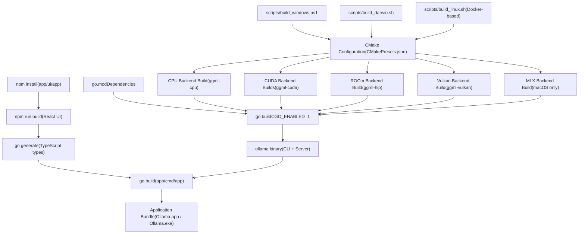
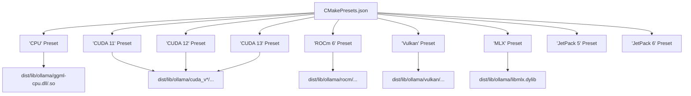
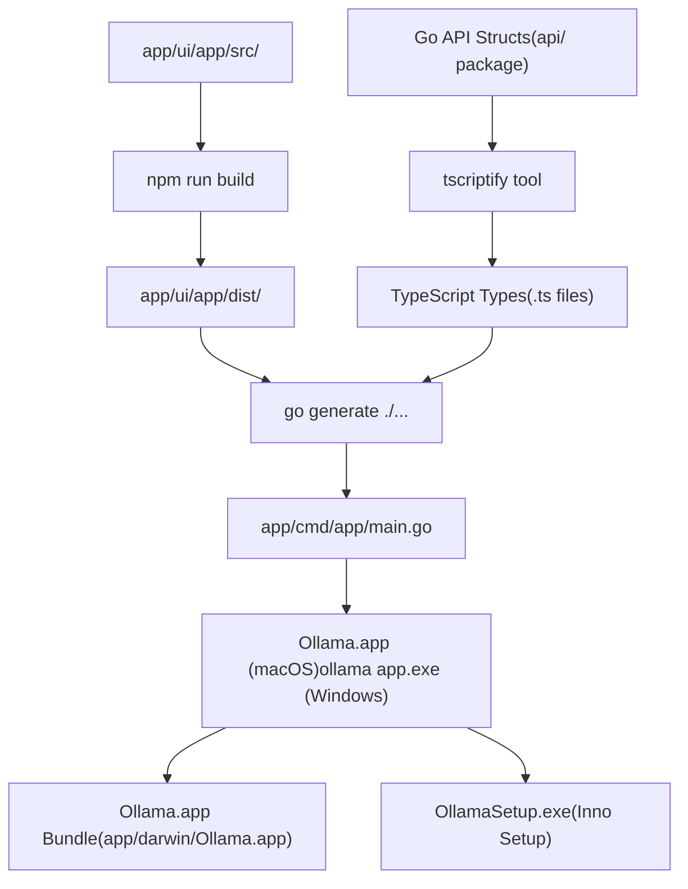
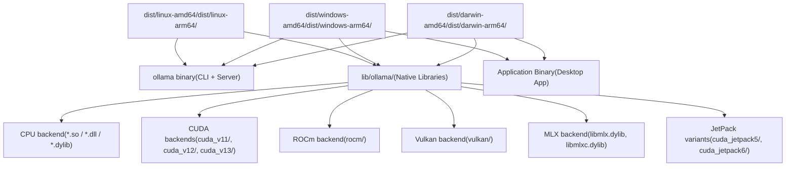
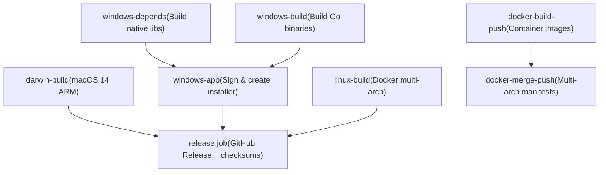

# 从源码构建

相关源文件

-   [.github/workflows/release.yaml](https://github.com/ollama/ollama/blob/562c76d7/.github/workflows/release.yaml)
-   [.github/workflows/test-install.yaml](https://github.com/ollama/ollama/blob/562c76d7/.github/workflows/test-install.yaml)
-   [.github/workflows/test.yaml](https://github.com/ollama/ollama/blob/562c76d7/.github/workflows/test.yaml)
-   [Dockerfile](https://github.com/ollama/ollama/blob/562c76d7/Dockerfile)
-   [README.md](https://github.com/ollama/ollama/blob/562c76d7/README.md?plain=1)
-   [app/ollama.iss](https://github.com/ollama/ollama/blob/562c76d7/app/ollama.iss)
-   [docs/README.md](https://github.com/ollama/ollama/blob/562c76d7/docs/README.md?plain=1)
-   [docs/api.md](https://github.com/ollama/ollama/blob/562c76d7/docs/api.md?plain=1)
-   [docs/development.md](https://github.com/ollama/ollama/blob/562c76d7/docs/development.md?plain=1)
-   [docs/images/ollama-keys.png](https://github.com/ollama/ollama/blob/562c76d7/docs/images/ollama-keys.png)
-   [docs/images/signup.png](https://github.com/ollama/ollama/blob/562c76d7/docs/images/signup.png)
-   [scripts/build\_darwin.sh](https://github.com/ollama/ollama/blob/562c76d7/scripts/build_darwin.sh)
-   [scripts/build\_linux.sh](https://github.com/ollama/ollama/blob/562c76d7/scripts/build_linux.sh)
-   [scripts/build\_windows.ps1](https://github.com/ollama/ollama/blob/562c76d7/scripts/build_windows.ps1)
-   [scripts/deduplicate\_cuda\_libs.sh](https://github.com/ollama/ollama/blob/562c76d7/scripts/deduplicate_cuda_libs.sh)
-   [scripts/install.ps1](https://github.com/ollama/ollama/blob/562c76d7/scripts/install.ps1)
-   [scripts/install.sh](https://github.com/ollama/ollama/blob/562c76d7/scripts/install.sh)

本页概述了从源代码构建 Ollama 的过程，包括先决条件、高级构建过程以及每个平台的基本快速入门说明。有关详细的特定于平台的构建配置和故障排除，请参阅 [特定于平台的构建细节](/ollama/ollama/8.2-platform-specific-build-details)。

从源代码构建 Ollama 涉及编译本机机器学习库（GGML 后端）和 Go 应用程序代码。该构建系统支持多个加速后端（CPU、CUDA、ROCm、Vulkan、Metal/MLX），并通过可选的桌面应用程序捆绑生成特定于平台的二进制文件。

## 先决条件概述

构建 Ollama 需要结合系统工具、编译器和可选加速库，具体取决于目标平台和所需的 GPU 支持。

### 核心要求

| 工具 | 目的 | 所有平台 |
| --- | --- | --- |
| **Go** | 应用编译 | 必需（来自 [go.mod1](https://github.com/ollama/ollama/blob/562c76d7/go.mod#L1-L1) 的版本） |
| **C/C++ 编译器** | 原生库编译 | 必需的 |
| **CMake** | 构建本机代码系统 | 必需（Windows ARM 除外） |

### 特定于平台的编译器

| 平台 | 编译器选项 | 笔记 |
| --- | --- | --- |
| **macOS** | Clang（内置） | Xcode 命令行工具 |
| **Windows (amd64)** | TDM-GCC、llvm-mingw、MSVC | [scripts/build\_windows.ps178-82](https://github.com/ollama/ollama/blob/562c76d7/scripts/build_windows.ps1#L78-L82) 需要 clang 才能获得正确的 UTF-16 |
| **Windows（arm64）** | llvm-mingw | [scripts/build\_windows.ps1246-253](https://github.com/ollama/ollama/blob/562c76d7/scripts/build_windows.ps1#L246-L253) |
| **Linux** | GCC 10+ 或 Clang | [Dockerfile12-20](https://github.com/ollama/ollama/blob/562c76d7/Dockerfile#L12-L20) 至少需要 gcc-toolset-10 |

### 可选的 GPU 加速库

| 后端 | 平台 | 安装源 | 构建标志 |
| --- | --- | --- | --- |
| **CUDA 11** | Windows、Linux（amd64） | [NVIDIA CUDA 工具包](https://developer.nvidia.com/cuda-downloads) | `--preset "CUDA 11"` |
| **CUDA 12** | Windows、Linux (amd64/arm64) | NVIDIA CUDA 工具包 | `--preset "CUDA 12"` |
| **CUDA 13** | Windows、Linux (amd64/arm64) | NVIDIA CUDA 工具包 | `--preset "CUDA 13"` |
| **ROCm** | Windows、Linux（amd64） | [AMD ROC](https://rocm.docs.amd.com/) | `--preset "ROCm 6"` |
| **Vulkan** | Windows、Linux | [LunarG Vulkan SDK](https://vulkan.lunarg.com/) | `--preset Vulkan` |
| **Metal/MLX** | macOS（苹果芯片） | 内置于 macOS | `--preset MLX` |
| **JetPack 5** | Linux（arm64） | NVIDIA JetPack SDK | `--preset "JetPack 5"` |
| **JetPack 6** | Linux（arm64） | NVIDIA JetPack SDK | `--preset "JetPack 6"` |

### 桌面应用程序要求

构建基于 Electron 的桌面应用程序需要额外的工具：

-   **Node.js** 和 **npm** - 用于构建 React UI ([scripts/build\_windows.ps1236-240](https://github.com/ollama/ollama/blob/562c76d7/scripts/build_windows.ps1#L236-L240))
-   **TypeScript** 编译器 (`tsc`) - 用于编译 TypeScript 代码
-   **tscriptify** - 用于生成 TypeScript 类型的 Go 工具 ([scripts/build\_windows.ps1246-252](https://github.com/ollama/ollama/blob/562c76d7/scripts/build_windows.ps1#L246-L252))

**来源：** [docs/development.md1-180](https://github.com/ollama/ollama/blob/562c76d7/docs/development.md?plain=1#L1-L180) [scripts/build\_windows.ps178-90](https://github.com/ollama/ollama/blob/562c76d7/scripts/build_windows.ps1#L78-L90) [scripts/build\_darwin.sh1-21](https://github.com/ollama/ollama/blob/562c76d7/scripts/build_darwin.sh#L1-L21) [Dockerfile12-46](https://github.com/ollama/ollama/blob/562c76d7/Dockerfile#L12-L46)

## 构建过程概述

Ollama 构建过程由三个主要阶段组成：本机库编译、Go 二进制编译和可选的桌面应用程序捆绑。


**来源：** [CMakeLists.txt1](https://github.com/ollama/ollama/blob/562c76d7/CMakeLists.txt#L1-L1) [CMakePresets.json1](https://github.com/ollama/ollama/blob/562c76d7/CMakePresets.json#L1-L1) [scripts/build\_windows.ps192-375](https://github.com/ollama/ollama/blob/562c76d7/scripts/build_windows.ps1#L92-L375) [scripts/build\_darwin.sh42-214](https://github.com/ollama/ollama/blob/562c76d7/scripts/build_darwin.sh#L42-L214) [scripts/build\_linux.sh1-75](https://github.com/ollama/ollama/blob/562c76d7/scripts/build_linux.sh#L1-L75)

### 构建配置系统

构建系统使用 CMake 预设来配置不同的后端构建。每个预设都针对特定的加速后端：


**来源：** [CMakePresets.json1](https://github.com/ollama/ollama/blob/562c76d7/CMakePresets.json#L1-L1) [scripts/build\_windows.ps193-223](https://github.com/ollama/ollama/blob/562c76d7/scripts/build_windows.ps1#L93-L223) [Dockerfile44-160](https://github.com/ollama/ollama/blob/562c76d7/Dockerfile#L44-L160)

## 按平台快速启动

### macOS

对于具有 Metal/MLX 支持的基本仅 CPU 构建（Apple Silicon）：

```
# Simple development buildgo run . serve
```
对于所有后端的完整构建：

```
./scripts/build_darwin.sh
```
macOS 构建脚本 [scripts/build\_darwin.sh42-81](https://github.com/ollama/ollama/blob/562c76d7/scripts/build_darwin.sh#L42-L81) 自动构建：

-   适用于 amd64 和 arm64 的 CPU 后端
-   用于 Apple Silicon 加速的 MLX 后端
-   结合两种架构的通用二进制文件

**来源：** [docs/development.md18-39](https://github.com/ollama/ollama/blob/562c76d7/docs/development.md?plain=1#L18-L39) [scripts/build\_darwin.sh1-231](https://github.com/ollama/ollama/blob/562c76d7/scripts/build_darwin.sh#L1-L231) [README.md245-262](https://github.com/ollama/ollama/blob/562c76d7/README.md?plain=1#L245-L262)

### Windows

对于开发构建（仅 CPU，ARM 上不需要 CMake）：

```
go run . serve
```
对于所有后端的完整构建：

```
.\scripts\build_windows.ps1
```
Windows 构建脚本 [scripts/build\_windows.ps1356-375](https://github.com/ollama/ollama/blob/562c76d7/scripts/build_windows.ps1#L356-L375) 默认构建所有可用的后端：

-   CPU后端
-   CUDA 12 和 13（如果已安装）
-   ROCm（如果已安装）
-   Vulkan（如果设置了 VULKAN\_SDK）
-   桌面应用程序
-   Inno Setup 安装程序

**来源：** [docs/development.md41-90](https://github.com/ollama/ollama/blob/562c76d7/docs/development.md?plain=1#L41-L90) [scripts/build\_windows.ps11-382](https://github.com/ollama/ollama/blob/562c76d7/scripts/build_windows.ps1#L1-L382) [README.md245-262](https://github.com/ollama/ollama/blob/562c76d7/README.md?plain=1#L245-L262)

### Linux

对于开发构建：

```
go run . serve
```
对于完整的基于 Docker 的构建：

```
./scripts/build_linux.sh
```
Linux 构建使用 Docker 多阶段构建 ([Dockerfile1-214](https://github.com/ollama/ollama/blob/562c76d7/Dockerfile#L1-L214)) 来生成：

-   CPU后端
-   CUDA 11、12、13 后端
-   ROCm 后端（仅限 amd64）
-   JetPack 5 和 6 后端（仅限arm64）
-   Vulkan后端
-   用于分发的压缩 tar.zst 存档

**来源：** [docs/development.md92-125](https://github.com/ollama/ollama/blob/562c76d7/docs/development.md?plain=1#L92-L125) [scripts/build\_linux.sh1-75](https://github.com/ollama/ollama/blob/562c76d7/scripts/build_linux.sh#L1-L75) [Dockerfile1-214](https://github.com/ollama/ollama/blob/562c76d7/Dockerfile#L1-L214)

## 构建组件

### 本机库目标

CMake 构建系统为每个后端生成不同的共享库：

| 目标 | CMake 目标名称 | 输出位置 | 平台 |
| --- | --- | --- | --- |
| 中央处理器后端 | `ggml-cpu` | `lib/ollama/` | 全部 |
| CUDA后端 | `ggml-cuda` | `lib/ollama/cuda_v*/` | Windows、Linux |
| ROCm 后端 | `ggml-hip` | `lib/ollama/rocm/` | Windows (amd64)、Linux (amd64) |
| Vulkan 后端 | `ggml-vulkan` | `lib/ollama/vulkan/` | Windows、Linux |
| MLX 后端 | `mlx`、`mlxc` | `lib/ollama/` | macOS |

构建命令遵循以下模式：

```
# Configurecmake --preset "CUDA 12" # Build specific targetcmake --build --preset "CUDA 12" --target ggml-cuda --parallel # Install to distribution directorycmake --install build --component CUDA --strip
```
**来源：** [scripts/build\_windows.ps193-223](https://github.com/ollama/ollama/blob/562c76d7/scripts/build_windows.ps1#L93-L223) [scripts/build\_darwin.sh42-81](https://github.com/ollama/ollama/blob/562c76d7/scripts/build_darwin.sh#L42-L81) [Dockerfile44-160](https://github.com/ollama/ollama/blob/562c76d7/Dockerfile#L44-L160)

### Go 二进制编译

Go 二进制文件是使用 CGO 构建的，可以链接到本机库：

```
go build \  -trimpath \  -ldflags "-s -w -X=github.com/ollama/ollama/version.Version=$VERSION" \  .
```
关键构建标志：

-   `CGO_ENABLED=1` - 需要链接本机库
-   `-trimpath` - 从二进制文件中删除绝对路径
-   `-ldflags="-s -w"` - 去除调试符号
-   `-X=github.com/ollama/ollama/version.Version` - 嵌入版本字符串
-   `-X=github.com/ollama/ollama/server.mode=release` - 设置释放模式

对于支持 MLX 的 macOS，需要额外的 CGO 标志 ([scripts/build\_darwin.sh62-76](https://github.com/ollama/ollama/blob/562c76d7/scripts/build_darwin.sh#L62-L76))：

```
CGO_CFLAGS="-O3 -I$(pwd)/build/_deps/mlx-c-src -mmacosx-version-min=14.0"CGO_LDFLAGS="-lc++ -framework Metal -framework Foundation -framework Accelerate"go build -tags mlx -o dist/darwin-arm64/ollama .
```
**来源：** [scripts/build\_windows.ps1225-231](https://github.com/ollama/ollama/blob/562c76d7/scripts/build_windows.ps1#L225-L231) [scripts/build\_darwin.sh62-81](https://github.com/ollama/ollama/blob/562c76d7/scripts/build_darwin.sh#L62-L81) [Dockerfile161-176](https://github.com/ollama/ollama/blob/562c76d7/Dockerfile#L161-L176) [.github/workflows/release.yaml16-26](https://github.com/ollama/ollama/blob/562c76d7/.github/workflows/release.yaml#L16-L26)

### 桌面应用程序包

桌面应用程序由多个组件组成：


构建步骤：

1.  安装 npm 依赖项：[app/ui/app](https://github.com/ollama/ollama/blob/562c76d7/app/ui/app) 中的 `npm install`
2.  构建 React UI：`npm run build` ([scripts/build\_windows.ps1261-266](https://github.com/ollama/ollama/blob/562c76d7/scripts/build_windows.ps1#L261-L266))
3.  生成 TypeScript 类型：`go generate ./...` ([scripts/build\_windows.ps1283](https://github.com/ollama/ollama/blob/562c76d7/scripts/build_windows.ps1#L283-L283))
4.  构建 Go 应用程序二进制文件：`go build ./app/cmd/app/` ([scripts/build\_windows.ps1285](https://github.com/ollama/ollama/blob/562c76d7/scripts/build_windows.ps1#L285-L285) [scripts/build\_darwin.sh134-138](https://github.com/ollama/ollama/blob/562c76d7/scripts/build_darwin.sh#L134-L138))
5.  平台捆绑包：
    -   **macOS**：复制到 `Ollama.app` 包结构 ([scripts/build\_darwin.sh127-148](https://github.com/ollama/ollama/blob/562c76d7/scripts/build_darwin.sh#L127-L148))
    -   **Windows**：创建 Inno Setup 安装程序 ([scripts/build\_windows.ps1310-324](https://github.com/ollama/ollama/blob/562c76d7/scripts/build_windows.ps1#L310-L324))

**来源：** [scripts/build\_windows.ps1233-287](https://github.com/ollama/ollama/blob/562c76d7/scripts/build_windows.ps1#L233-L287) [scripts/build\_darwin.sh107-214](https://github.com/ollama/ollama/blob/562c76d7/scripts/build_darwin.sh#L107-L214) [app/ollama.iss1-375](https://github.com/ollama/ollama/blob/562c76d7/app/ollama.iss#L1-L375)

## 构建工件结构

构建过程会在 `dist/` 目录中生成按平台组织的工件：


### 发行档案

最终的分发工件被创建为压缩档案：

| 平台 | 存档格式 | 内容 | 脚本 |
| --- | --- | --- | --- |
| **macOS** | `.tgz` | 通用二进制+库 | [scripts/build\_darwin.sh101-105](https://github.com/ollama/ollama/blob/562c76d7/scripts/build_darwin.sh#L101-L105) |
| **macOS 应用程序** | `.dmg` | Signed/notarized应用 | [scripts/build\_darwin.sh190-210](https://github.com/ollama/ollama/blob/562c76d7/scripts/build_darwin.sh#L190-L210) |
| **Windows** | `.zip` | 每个架构的二进制文件 + 库 | [scripts/build\_windows.ps1326-349](https://github.com/ollama/ollama/blob/562c76d7/scripts/build_windows.ps1#L326-L349) |
| **Windows 安装程序** | `OllamaSetup.exe` | Inno Setup 安装程序 | [app/ollama.iss1-375](https://github.com/ollama/ollama/blob/562c76d7/app/ollama.iss#L1-L375) |
| **Linux** | `.tar.zst` | 二进制文件+库 | [scripts/build\_linux.sh59-74](https://github.com/ollama/ollama/blob/562c76d7/scripts/build_linux.sh#L59-L74) |

Linux 为不同的变体创建单独的档案（[scripts/build\_linux.sh61-74](https://github.com/ollama/ollama/blob/562c76d7/scripts/build_linux.sh#L61-L74)）：

-   `ollama-linux-{arch}.tar.zst` - 带有 CPU 和 CUDA 的基础包
-   `ollama-linux-amd64-rocm.tar.zst` - ROCm 库
-   `ollama-linux-arm64-jetpack5.tar.zst` - JetPack 5 库
-   `ollama-linux-arm64-jetpack6.tar.zst` - JetPack 6 库

**来源：** [scripts/build\_darwin.sh101-105](https://github.com/ollama/ollama/blob/562c76d7/scripts/build_darwin.sh#L101-L105) [scripts/build\_windows.ps1326-349](https://github.com/ollama/ollama/blob/562c76d7/scripts/build_windows.ps1#L326-L349) [scripts/build\_linux.sh59-74](https://github.com/ollama/ollama/blob/562c76d7/scripts/build_linux.sh#L59-L74) [.github/workflows/release.yaml375-407](https://github.com/ollama/ollama/blob/562c76d7/.github/workflows/release.yaml#L375-L407)

## 运行时的库发现

构建后，Ollama 搜索与可执行文件相关的加速库：

| 平台 | 搜索路径 |
| --- | --- |
| **Windows** | `./lib/ollama` |
| **Linux** | `../lib/ollama` |
| **macOS** | `.`（当前目录） |
| **发展** | `build/lib/ollama` |

此搜索顺序记录在 [docs/development.md170-180](https://github.com/ollama/ollama/blob/562c76d7/docs/development.md?plain=1#L170-L180) 中。桌面应用程序将库捆绑到应用程序包结构中进行分发。

**来源：** [docs/development.md170-180](https://github.com/ollama/ollama/blob/562c76d7/docs/development.md?plain=1#L170-L180)

## CI/CD 构建管道

GitHub Actions 工作流程自动完成整个构建和发布过程：

### 测试工作流程

测试工作流程 [.github/workflows/test.yaml1-246](https://github.com/ollama/ollama/blob/562c76d7/.github/workflows/test.yaml#L1-L246) 验证基于拉取请求的构建：

-   检测本机代码的更改 ([.github/workflows/test.yaml40-41](https://github.com/ollama/ollama/blob/562c76d7/.github/workflows/test.yaml#L40-L41))
-   构建 CPU、CUDA、ROCm 和 Vulkan 变体
-   运行 Go 测试：`go test ./...` ([.github/workflows/test.yaml232](https://github.com/ollama/ollama/blob/562c76d7/.github/workflows/test.yaml#L232-L232))
-   验证补丁是否干净地应用（[.github/workflows/test.yaml238-246](https://github.com/ollama/ollama/blob/562c76d7/.github/workflows/test.yaml#L238-L246)）

### 发布工作流程

发布工作流程 [.github/workflows/release.yaml1-550](https://github.com/ollama/ollama/blob/562c76d7/.github/workflows/release.yaml#L1-L550) 生成签名的发布工件：


关键步骤：

1.  **darwin-build** ([.github/workflows/release.yaml29-74](https://github.com/ollama/ollama/blob/562c76d7/.github/workflows/release.yaml#L29-L74))：构建通用 macOS 二进制文件，使用 Apple 凭据进行签名
2.  **windows-depends** ([.github/workflows/release.yaml75-212](https://github.com/ollama/ollama/blob/562c76d7/.github/workflows/release.yaml#L75-L212))：构建 CUDA、ROCm、Vulkan 库
3.  **windows-build** ([.github/workflows/release.yaml213-286](https://github.com/ollama/ollama/blob/562c76d7/.github/workflows/release.yaml#L213-L286))：为 amd64/arm64 构建 Go 二进制文件
4.  **windows-app** ([.github/workflows/release.yaml287-341](https://github.com/ollama/ollama/blob/562c76d7/.github/workflows/release.yaml#L287-L341))：签署可执行文件，创建安装程序
5.  **linux-build** ([.github/workflows/release.yaml342-407](https://github.com/ollama/ollama/blob/562c76d7/.github/workflows/release.yaml#L342-L407))：基于 Docker 的多架构构建
6.  **docker-build-push** ([.github/workflows/release.yaml409-463](https://github.com/ollama/ollama/blob/562c76d7/.github/workflows/release.yaml#L409-L463)): 根据 arch/flavor 创建 Docker 镜像
7.  **docker-merge-push** ([.github/workflows/release.yaml465-497](https://github.com/ollama/ollama/blob/562c76d7/.github/workflows/release.yaml#L465-L497))：合并到多架构清单中
8.  **release** ([.github/workflows/release.yaml499-550](https://github.com/ollama/ollama/blob/562c76d7/.github/workflows/release.yaml#L499-L550))：将工件上传到 GitHub Release

**来源：** [.github/workflows/test.yaml1-246](https://github.com/ollama/ollama/blob/562c76d7/.github/workflows/test.yaml#L1-L246) [.github/workflows/release.yaml1-550](https://github.com/ollama/ollama/blob/562c76d7/.github/workflows/release.yaml#L1-L550)

## 下一步

有关详细的特定于平台的构建说明，包括：

-   确切的编译器版本和安装步骤
-   特定于平台的编译标志
-   解决常见的构建问题
-   交叉编译配置
-   优化标志和构建调整

参见[特定于平台的构建细节](/ollama/ollama/8.2-platform-specific-build-details)。

有关测试构建的信息，请参阅 [测试和质量保证](/ollama/ollama/8.3-testing-and-quality-assurance)。

有关使用热重载开发桌面应用程序的信息，请参阅[桌面应用程序开发](/ollama/ollama/8.4-desktop-application-development)。

**来源：** [docs/development.md1-180](https://github.com/ollama/ollama/blob/562c76d7/docs/development.md?plain=1#L1-L180) [README.md245-262](https://github.com/ollama/ollama/blob/562c76d7/README.md?plain=1#L245-L262)
