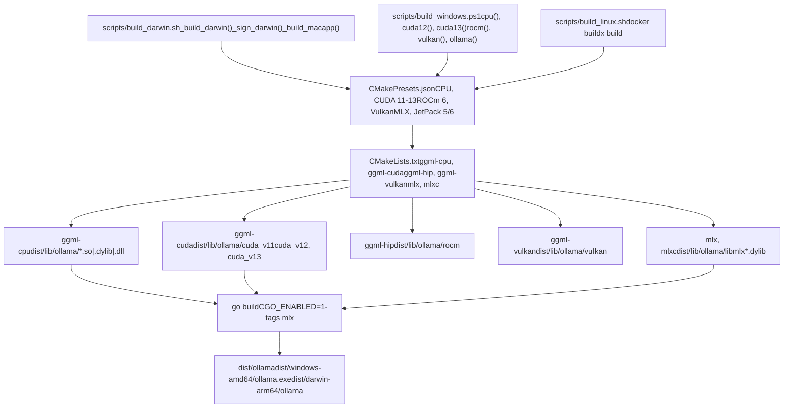
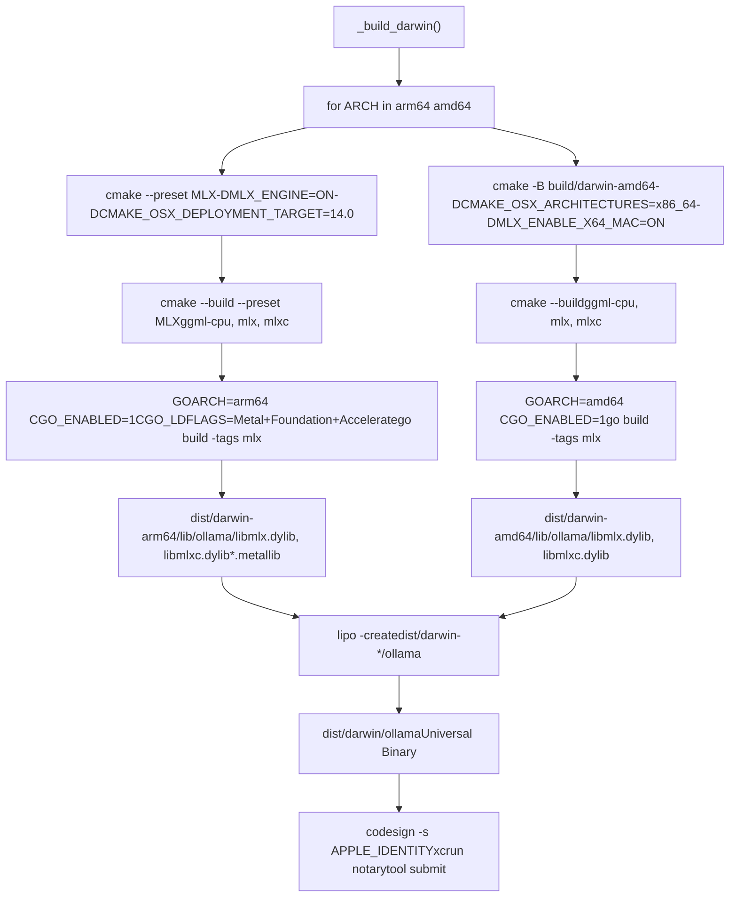
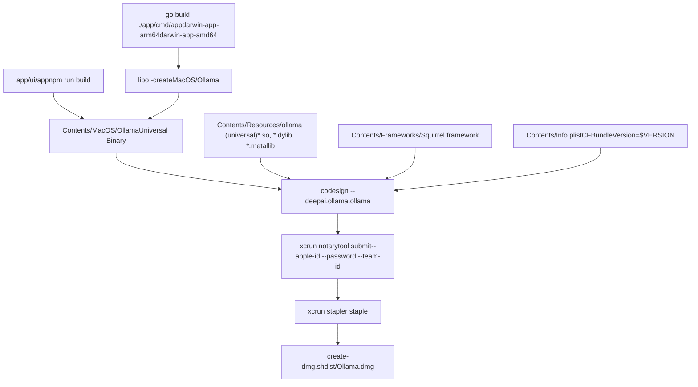
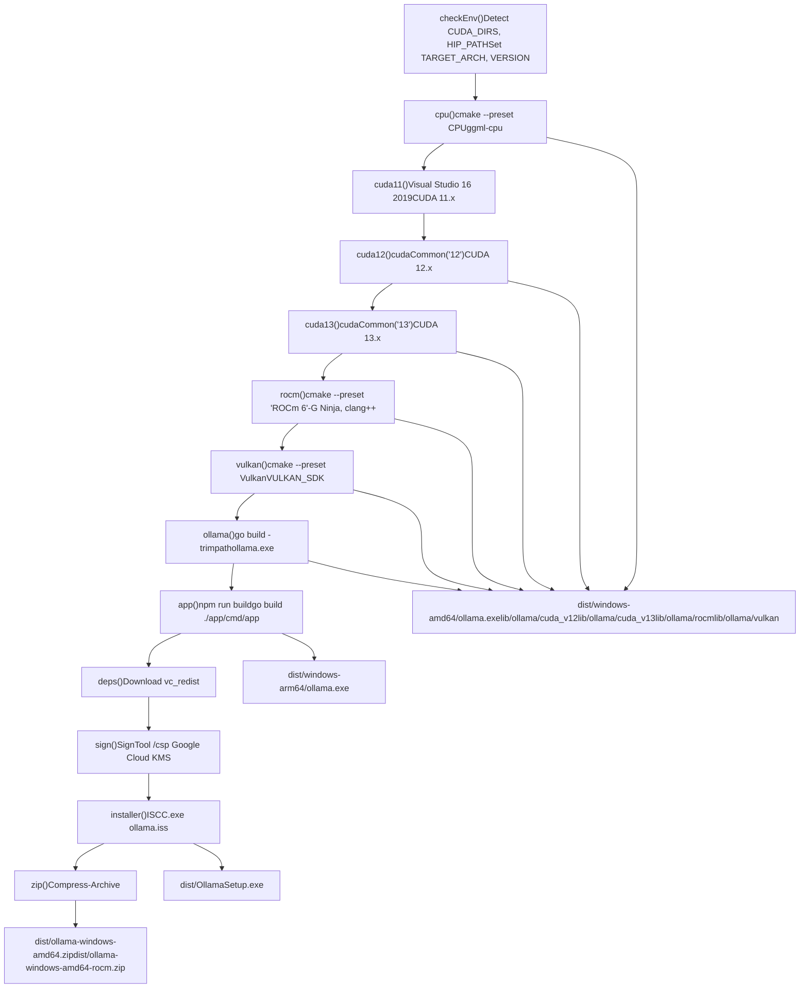
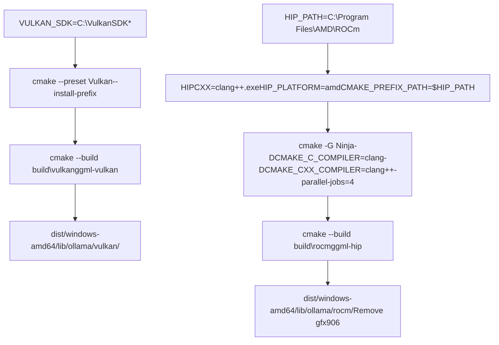
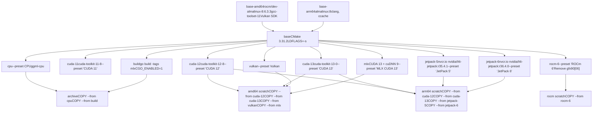
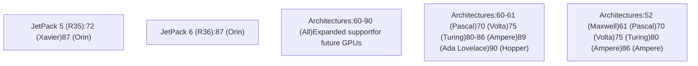
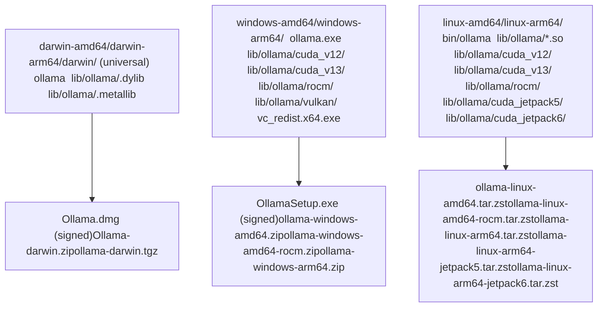
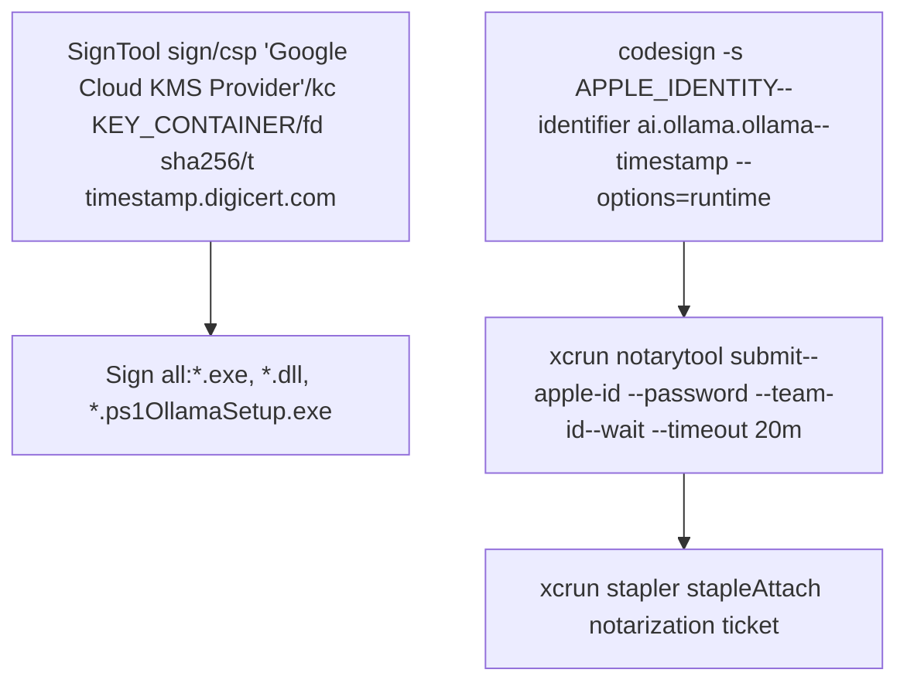

# 特定于平台的构建细节

相关源文件

-   [.github/workflows/release.yaml](https://github.com/ollama/ollama/blob/562c76d7/.github/workflows/release.yaml)
-   [.github/workflows/test-install.yaml](https://github.com/ollama/ollama/blob/562c76d7/.github/workflows/test-install.yaml)
-   [.github/workflows/test.yaml](https://github.com/ollama/ollama/blob/562c76d7/.github/workflows/test.yaml)
-   [Dockerfile](https://github.com/ollama/ollama/blob/562c76d7/Dockerfile)
-   [app/ollama.iss](https://github.com/ollama/ollama/blob/562c76d7/app/ollama.iss)
-   [scripts/build\_darwin.sh](https://github.com/ollama/ollama/blob/562c76d7/scripts/build_darwin.sh)
-   [scripts/build\_linux.sh](https://github.com/ollama/ollama/blob/562c76d7/scripts/build_linux.sh)
-   [scripts/build\_windows.ps1](https://github.com/ollama/ollama/blob/562c76d7/scripts/build_windows.ps1)
-   [scripts/deduplicate\_cuda\_libs.sh](https://github.com/ollama/ollama/blob/562c76d7/scripts/deduplicate_cuda_libs.sh)
-   [scripts/install.ps1](https://github.com/ollama/ollama/blob/562c76d7/scripts/install.ps1)
-   [scripts/install.sh](https://github.com/ollama/ollama/blob/562c76d7/scripts/install.sh)

本页面记录了用于跨 macOS、Windows 和 Linux 编译 Ollama 的特定于平台的构建配置、脚本和工作流程。它涵盖了每个平台的 CMake 预设、工具链要求、GPU 库编译和打包过程。

有关一般构建说明和先决条件，请参阅 [从源码构建](/ollama/ollama/8.1-building-from-source)。有关发布流程和工件分发的信息，请参阅 [发布流程](/ollama/ollama/8.6-release-process)。

## 构建系统概述

Ollama 使用多层构建系统来生成特定于平台的二进制文件和 GPU 加速库。构建过程通过特定于平台的脚本进行协调，这些脚本使用针对不同 GPU 后端的预定义预设来调用 CMake。

**来源：** [.github/workflows/release.yaml1-554](https://github.com/ollama/ollama/blob/562c76d7/.github/workflows/release.yaml#L1-L554) [scripts/build\_darwin.sh1-231](https://github.com/ollama/ollama/blob/562c76d7/scripts/build_darwin.sh#L1-L231) [scripts/build\_windows.ps11-398](https://github.com/ollama/ollama/blob/562c76d7/scripts/build_windows.ps1#L1-L398) [Dockerfile1-211](https://github.com/ollama/ollama/blob/562c76d7/Dockerfile#L1-L211)

## macOS 构建过程

macOS 构建由 `scripts/build_darwin.sh` 处理，它创建支持 Intel (amd64) 和 Apple Silicon (arm64) 架构的通用二进制文件。

### 特定于架构的构建流程

**来源：** [scripts/build\_darwin.sh42-81](https://github.com/ollama/ollama/blob/562c76d7/scripts/build_darwin.sh#L42-L81) [scripts/build\_darwin.sh83-105](https://github.com/ollama/ollama/blob/562c76d7/scripts/build_darwin.sh#L83-L105)

### macOS 构建配置

macOS 构建使用特定的编译器标志和部署目标：

| 多变的 | arm64 值 | amd64 值 |
| --- | --- | --- |
| `CMAKE_OSX_ARCHITECTURES` | arm64（默认） | x86\_64 |
| `CMAKE_OSX_DEPLOYMENT_TARGET` | 14.0 | 14.0 |
| `CGO_CFLAGS` | `-O3 -I.../mlx-c-src -mmacosx-version-min=14.0` | 相同的 |
| `CGO_LDFLAGS`（臂64） | `-lc++ -framework Metal -framework Foundation -framework Accelerate` | N/A |
| `CGO_LDFLAGS` (amd64) | N/A | `-ldl -lc++ -framework Accelerate` |
| `DMLX_ENABLE_X64_MAC` | 离开 | 在 |

**来源：** [scripts/build\_darwin.sh17-19](https://github.com/ollama/ollama/blob/562c76d7/scripts/build_darwin.sh#L17-L19) [scripts/build\_darwin.sh62-74](https://github.com/ollama/ollama/blob/562c76d7/scripts/build_darwin.sh#L62-L74) [.github/workflows/release.yaml42-44](https://github.com/ollama/ollama/blob/562c76d7/.github/workflows/release.yaml#L42-L44)

### macOS 应用程序包创建

`_build_macapp` 函数创建带有嵌入资源的 `Ollama.app` 包：

**来源：** [scripts/build\_darwin.sh107-214](https://github.com/ollama/ollama/blob/562c76d7/scripts/build_darwin.sh#L107-L214) [.github/workflows/release.yaml29-73](https://github.com/ollama/ollama/blob/562c76d7/.github/workflows/release.yaml#L29-L73)

## Windows 构建过程

Windows 构建由 `scripts/build_windows.ps1` 编排，它支持多个 GPU 后端和架构目标。

### Windows 构建函数

构建脚本为每个构建组件定义单独的函数：

**来源：** [scripts/build\_windows.ps199-365](https://github.com/ollama/ollama/blob/562c76d7/scripts/build_windows.ps1#L99-L365) [scripts/build\_windows.ps1373-391](https://github.com/ollama/ollama/blob/562c76d7/scripts/build_windows.ps1#L373-L391)

### Windows CUDA 构建配置

Windows 上的 CUDA 构建需要特定的 Visual Studio 和 CUDA 工具包版本：

| CUDA版本 | 预设名称 | 视觉工作室 | 所需组件 |
| --- | --- | --- | --- |
| 11.x | `CUDA 11` | 对比2019 | cudart、nvcc、cublas、cublas\_dev |
| 12.x | `CUDA 12` | VS 2022 | cudart、nvcc、cublas、cublas\_dev |
| 13.x | `CUDA 13` | VS 2022 | cudart、nvcc、cublas、cublas\_dev、crt、nvvm、nvptx 编译器 |

由于与较新的 MSVC 版本的兼容性问题，CUDA 11 版本明确使用 Visual Studio 2019：

**来源：** [scripts/build\_windows.ps1114-145](https://github.com/ollama/ollama/blob/562c76d7/scripts/build_windows.ps1#L114-L145) [.github/workflows/release.yaml85-106](https://github.com/ollama/ollama/blob/562c76d7/.github/workflows/release.yaml#L85-L106)

### Windows ROCm 和 Vulkan 构建

ROCm 和 Vulkan 构建使用 Clang 而不是 MSVC：

**来源：** [scripts/build\_windows.ps1184-215](https://github.com/ollama/ollama/blob/562c76d7/scripts/build_windows.ps1#L184-L215) [scripts/build\_windows.ps1217-229](https://github.com/ollama/ollama/blob/562c76d7/scripts/build_windows.ps1#L217-L229) [.github/workflows/release.yaml109-119](https://github.com/ollama/ollama/blob/562c76d7/.github/workflows/release.yaml#L109-L119)

### Windows 代码签名

Windows 二进制文件使用 Google Cloud KMS 进行签名：

**来源：** [scripts/build\_windows.ps1304-324](https://github.com/ollama/ollama/blob/562c76d7/scripts/build_windows.ps1#L304-L324) [.github/workflows/release.yaml294-341](https://github.com/ollama/ollama/blob/562c76d7/.github/workflows/release.yaml#L294-L341)

## Linux 构建过程

Linux 构建使用 `Dockerfile` 中定义的 Docker 多阶段构建，支持 CPU、CUDA（11、12、13）、ROCm、Vulkan、JetPack (ARM) 和 MLX 后端。

### Docker 多阶段构建架构

**来源：** [Dockerfile1-211](https://github.com/ollama/ollama/blob/562c76d7/Dockerfile#L1-L211) [.github/workflows/release.yaml343-408](https://github.com/ollama/ollama/blob/562c76d7/.github/workflows/release.yaml#L343-L408)

### Linux 构建调用

`scripts/build_linux.sh` 包装器脚本调用 Docker buildx：

**来源：** [scripts/build\_linux.sh1-75](https://github.com/ollama/ollama/blob/562c76d7/scripts/build_linux.sh#L1-L75)

### CUDA 库重复数据删除

Linux 在 MLX 和 CUDA 目录之间构建去重共享 CUDA 库：

**来源：** [scripts/deduplicate\_cuda\_libs.sh1-61](https://github.com/ollama/ollama/blob/562c76d7/scripts/deduplicate_cuda_libs.sh#L1-L61) [.github/workflows/release.yaml376-378](https://github.com/ollama/ollama/blob/562c76d7/.github/workflows/release.yaml#L376-L378)

## CMake 预设配置

所有平台都使用 `CMakePresets.json` 中定义的 CMake 预设。每个预设指定构建配置、编译器标志和特定于后端的设置。

### 预设矩阵

**来源：** [Dockerfile46-60](https://github.com/ollama/ollama/blob/562c76d7/Dockerfile#L46-L60) [Dockerfile62-86](https://github.com/ollama/ollama/blob/562c76d7/Dockerfile#L62-L86) [.github/workflows/test.yaml49-62](https://github.com/ollama/ollama/blob/562c76d7/.github/workflows/test.yaml#L49-L62)

### 构建组件并安装目标

每个预设都会构建特定的组件以及相应的安装组件：

| 预设 | 构建目标 | 安装组件 | 输出路径 |
| --- | --- | --- | --- |
| 中央处理器 | `ggml-cpu` | 中央处理器 | \`lib/ollama/\*.so |
| CUDA 11-13 | `ggml-cuda` | CUDA | `lib/ollama/cuda_v11` 至 `cuda_v13` |
| ROC 6 | `ggml-hip` | 时髦的 | `lib/ollama/rocm` |
| Vulkan | `ggml-vulkan` | Vulkan | `lib/ollama/vulkan` |
| MLX | `mlx`、`mlxc` | MLX | `lib/ollama/libmlx.dylib`、`libmlxc.dylib` |
| JetPack 5/6 | `ggml-cuda` | CUDA | `lib/ollama/cuda_jetpack5`、`cuda_jetpack6` |

**来源：** [Dockerfile43-61](https://github.com/ollama/ollama/blob/562c76d7/Dockerfile#L43-L61) [Dockerfile88-97](https://github.com/ollama/ollama/blob/562c76d7/Dockerfile#L88-L97) [scripts/build\_windows.ps1105-110](https://github.com/ollama/ollama/blob/562c76d7/scripts/build_windows.ps1#L105-L110)

## GPU 库编译详细信息

### CUDA 架构目标

不同的CUDA版本支持不同的GPU架构：

**来源：** [.github/workflows/release.yaml85-106](https://github.com/ollama/ollama/blob/562c76d7/.github/workflows/release.yaml#L85-L106) [Dockerfile99-122](https://github.com/ollama/ollama/blob/562c76d7/Dockerfile#L99-L122)

### ROCm GPU 架构目标

ROCm 构建特定目标的 AMD GPU 架构：

**来源：** [Dockerfile88-97](https://github.com/ollama/ollama/blob/562c76d7/Dockerfile#L88-L97) [.github/workflows/test.yaml53-56](https://github.com/ollama/ollama/blob/562c76d7/.github/workflows/test.yaml#L53-L56) [scripts/build\_windows.ps1196-210](https://github.com/ollama/ollama/blob/562c76d7/scripts/build_windows.ps1#L196-L210)

### Vulkan SDK 集成

Vulkan 构建需要 LunarG Vulkan SDK：

| 平台 | SDK版本 | 安装方法 |
| --- | --- | --- |
| Linux（AMD64） | 1.4.321.1 | 从 Dockerfile 中的源代码下载并构建 |
| Windows | 1.4.321.1 | 下载的安装程序，缓存在 CI 中 |
| Linux（测试） | 1.4.313 | 从 LunarG APT 仓库安装 |

**来源：** [Dockerfile16-25](https://github.com/ollama/ollama/blob/562c76d7/Dockerfile#L16-L25) [.github/workflows/release.yaml117-118](https://github.com/ollama/ollama/blob/562c76d7/.github/workflows/release.yaml#L117-L118) [.github/workflows/test.yaml70-82](https://github.com/ollama/ollama/blob/562c76d7/.github/workflows/test.yaml#L70-L82)

### MLX 后端编译

MLX 后端（仅限 macOS 和 Linux amd64）需要额外的依赖项：

**来源：** [Dockerfile131-155](https://github.com/ollama/ollama/blob/562c76d7/Dockerfile#L131-L155) [scripts/build\_darwin.sh54-74](https://github.com/ollama/ollama/blob/562c76d7/scripts/build_darwin.sh#L54-L74)

## 交叉编译和通用二进制文件

### macOS 通用二进制文件创建

`lipo` 工具结合了特定于架构的二进制文件：

**来源：** [scripts/build\_darwin.sh84-99](https://github.com/ollama/ollama/blob/562c76d7/scripts/build_darwin.sh#L84-L99) [scripts/build\_darwin.sh156-167](https://github.com/ollama/ollama/blob/562c76d7/scripts/build_darwin.sh#L156-L167)

### Windows ARM64交叉编译

Windows ARM64 构建使用 llvm-mingw 在 x64 主机上进行交叉编译：

**来源：** [.github/workflows/release.yaml232-253](https://github.com/ollama/ollama/blob/562c76d7/.github/workflows/release.yaml#L232-L253) [scripts/build\_windows.ps112-24](https://github.com/ollama/ollama/blob/562c76d7/scripts/build_windows.ps1#L12-L24)

### Linux 多架构构建

Linux 使用 Docker buildx 进行本机或模拟多架构构建：

**来源：** [.github/workflows/release.yaml410-464](https://github.com/ollama/ollama/blob/562c76d7/.github/workflows/release.yaml#L410-L464) [scripts/build\_linux.sh28-49](https://github.com/ollama/ollama/blob/562c76d7/scripts/build_linux.sh#L28-L49)

## 构建工件和包装

### 输出目录结构

每个平台都会产生一致的目录结构：

**来源：** [.github/workflows/release.yaml515-523](https://github.com/ollama/ollama/blob/562c76d7/.github/workflows/release.yaml#L515-L523) [.github/workflows/release.yaml379-407](https://github.com/ollama/ollama/blob/562c76d7/.github/workflows/release.yaml#L379-L407)

### Tarball 和存档创建

Linux 和 macOS 使用特定内容过滤器创建压缩档案：

**来源：** [scripts/build\_linux.sh59-74](https://github.com/ollama/ollama/blob/562c76d7/scripts/build_linux.sh#L59-L74) [scripts/build\_darwin.sh101-104](https://github.com/ollama/ollama/blob/562c76d7/scripts/build_darwin.sh#L101-L104) [scripts/build\_windows.ps1342-365](https://github.com/ollama/ollama/blob/562c76d7/scripts/build_windows.ps1#L342-L365)

### 安装者一代

特定于平台的安装程序是从构建工件创建的：

| 平台 | 安装工具 | 配置 | 输出 |
| --- | --- | --- | --- |
| macOS | `create-dmg.sh` | 背景图片、图标定位 | `Ollama.dmg` |
| Windows | Inno Setup (`ISCC.exe`) | `app/ollama.iss` | `OllamaSetup.exe` |
| Linux | N/A | 直接 tarball 分发 | `*.tar.zst` |

**来源：** [scripts/build\_darwin.sh192-210](https://github.com/ollama/ollama/blob/562c76d7/scripts/build_darwin.sh#L192-L210) [scripts/build\_windows.ps1326-340](https://github.com/ollama/ollama/blob/562c76d7/scripts/build_windows.ps1#L326-L340) [app/ollama.iss1-375](https://github.com/ollama/ollama/blob/562c76d7/app/ollama.iss#L1-L375)

### 代码签名和公证

macOS 和 Windows 二进制文件需要签名才能分发：

**来源：** [scripts/build\_darwin.sh89-98](https://github.com/ollama/ollama/blob/562c76d7/scripts/build_darwin.sh#L89-L98) [scripts/build\_darwin.sh184-210](https://github.com/ollama/ollama/blob/562c76d7/scripts/build_darwin.sh#L184-L210) [scripts/build\_windows.ps1309-323](https://github.com/ollama/ollama/blob/562c76d7/scripts/build_windows.ps1#L309-L323) [.github/workflows/release.yaml295-341](https://github.com/ollama/ollama/blob/562c76d7/.github/workflows/release.yaml#L295-L341)

## 环境变量和构建标志

### 通用构建环境变量

| 多变的 | 目的 | 示例值 |
| --- | --- | --- |
| `GOFLAGS` | version/mode 的 Go 链接器标志 | `'-ldflags=-w -s "-X=...Version=0.5.7"'` |
| `CGO_ENABLED` | 为本机库启用 CGo | `1` |
| `CGO_CFLAGS` | C 编译器优化标志 | `-O3`（发布）、`-mmacosx-version-min=14.0` (macOS) |
| `CGO_CXXFLAGS` | C++ 编译器标志 | `-O3` |
| `VERSION` | Ollama 版本字符串 | `0.5.7`（来自 git 标签） |
| `PKG_VERSION` | 软件包版本（主要.次要.补丁） | `0.5.7` |

**来源：** [.github/workflows/release.yaml8-27](https://github.com/ollama/ollama/blob/562c76d7/.github/workflows/release.yaml#L8-L27) [scripts/build\_darwin.sh15-19](https://github.com/ollama/ollama/blob/562c76d7/scripts/build_darwin.sh#L15-L19) [scripts/build\_windows.ps159-81](https://github.com/ollama/ollama/blob/562c76d7/scripts/build_windows.ps1#L59-L81)

### 特定于平台的环境变量

**苹果系统：**

-   `APPLE_IDENTITY`、`APPLE_ID`、`APPLE_PASSWORD`、`APPLE_TEAM_ID`：代码签名凭据
-   `MACOS_SIGNING_KEY`、`MACOS_SIGNING_KEY_PASSWORD`：证书凭据

**Windows：**

-   `KEY_CONTAINER`：用于代码签名的 Google Cloud KMS 密钥
-   `VULKAN_SDK`：Vulkan SDK 安装路径
-   `CUDAToolkit_ROOT`：CUDA安装路径
-   `HIP_PATH`、`HIPCXX`、`HIP_PLATFORM`、`CMAKE_PREFIX_PATH`：ROCm 配置

**Linux（Docker）：**

-   `FLAVOR`：构建风格（`rocm` 用于 AMD GPU 构建）
-   `PARALLEL`：并行构建作业的数量

**来源：** [.github/workflows/release.yaml36-44](https://github.com/ollama/ollama/blob/562c76d7/.github/workflows/release.yaml#L36-L44) [.github/workflows/release.yaml161-165](https://github.com/ollama/ollama/blob/562c76d7/.github/workflows/release.yaml#L161-L165) [Dockerfile3-4](https://github.com/ollama/ollama/blob/562c76d7/Dockerfile#L3-L4)

### 编译器工具链检测

每个平台都会检测可用的编译器和 SDK：

**来源：** [scripts/build\_windows.ps128-55](https://github.com/ollama/ollama/blob/562c76d7/scripts/build_windows.ps1#L28-L55) [.github/workflows/release.yaml125-177](https://github.com/ollama/ollama/blob/562c76d7/.github/workflows/release.yaml#L125-L177)
