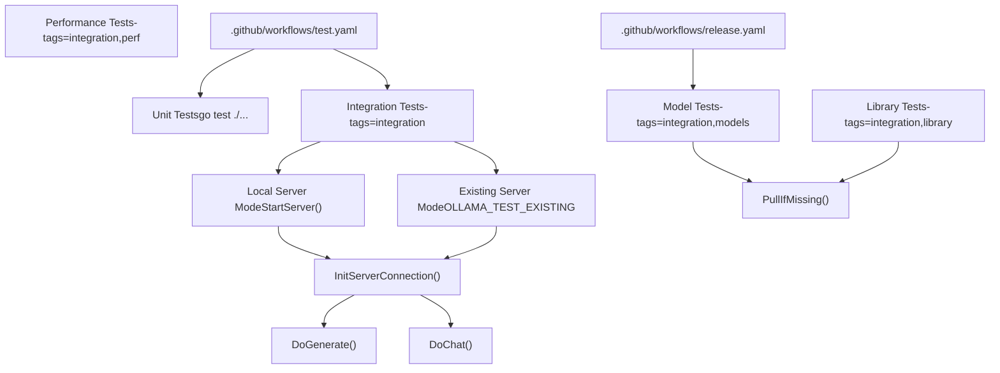
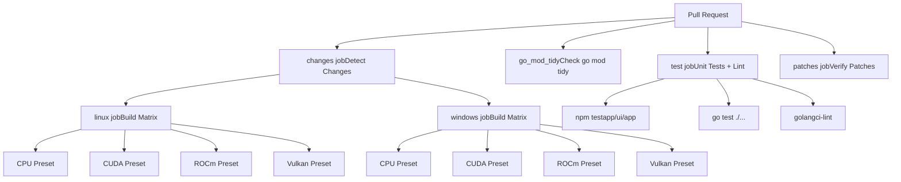
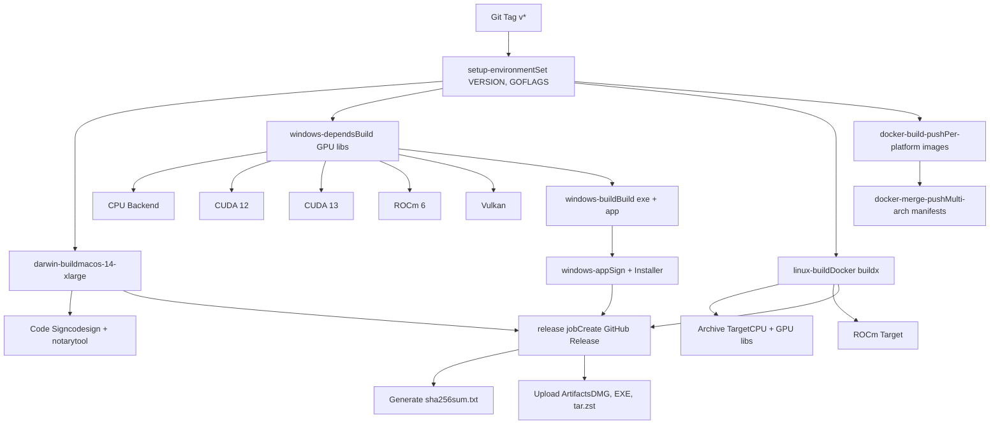
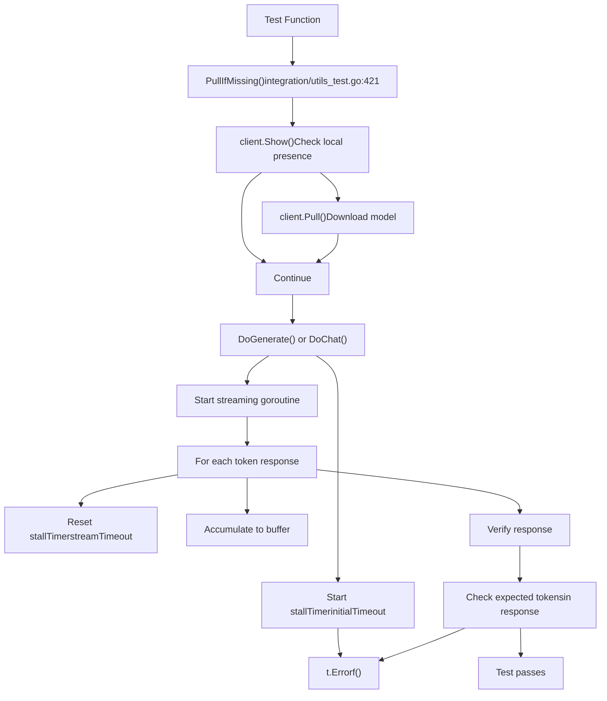
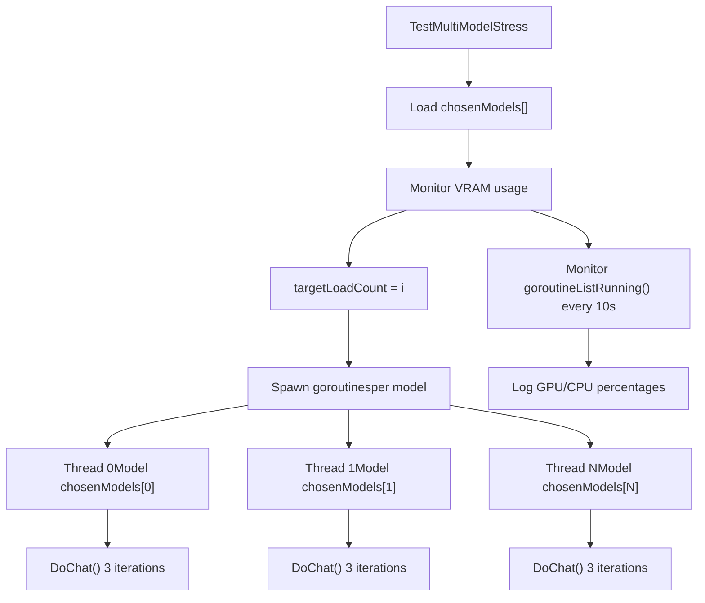
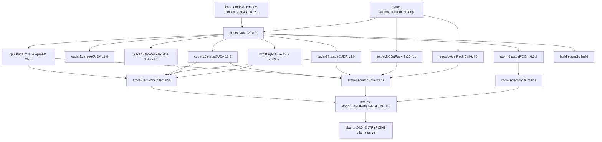
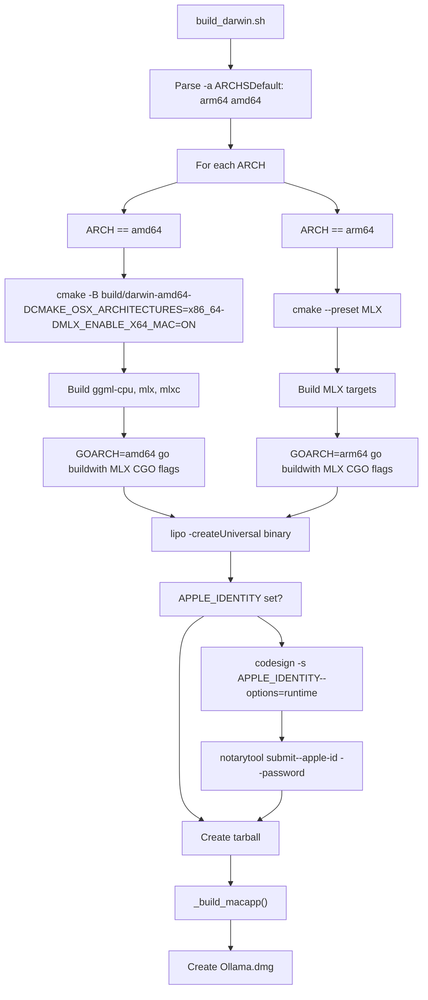

# 测试和质量保证

相关源文件

-   [api/types\_test.go](https://github.com/ollama/ollama/blob/562c76d7/api/types_test.go)
-   [api/types\_typescript\_test.go](https://github.com/ollama/ollama/blob/562c76d7/api/types_typescript_test.go)
-   [cmd/cmd\_test.go](https://github.com/ollama/ollama/blob/562c76d7/cmd/cmd_test.go)
-   [middleware/openai.go](https://github.com/ollama/ollama/blob/562c76d7/middleware/openai.go)
-   [middleware/openai\_test.go](https://github.com/ollama/ollama/blob/562c76d7/middleware/openai_test.go)
-   [openai/openai.go](https://github.com/ollama/ollama/blob/562c76d7/openai/openai.go)
-   [openai/openai\_test.go](https://github.com/ollama/ollama/blob/562c76d7/openai/openai_test.go)
-   [openai/responses.go](https://github.com/ollama/ollama/blob/562c76d7/openai/responses.go)
-   [openai/responses\_test.go](https://github.com/ollama/ollama/blob/562c76d7/openai/responses_test.go)
-   [server/create.go](https://github.com/ollama/ollama/blob/562c76d7/server/create.go)
-   [server/model.go](https://github.com/ollama/ollama/blob/562c76d7/server/model.go)
-   [server/routes\_create\_test.go](https://github.com/ollama/ollama/blob/562c76d7/server/routes_create_test.go)
-   [server/routes\_delete\_test.go](https://github.com/ollama/ollama/blob/562c76d7/server/routes_delete_test.go)
-   [server/routes\_generate\_test.go](https://github.com/ollama/ollama/blob/562c76d7/server/routes_generate_test.go)
-   [server/routes\_list\_test.go](https://github.com/ollama/ollama/blob/562c76d7/server/routes_list_test.go)
-   [server/routes\_test.go](https://github.com/ollama/ollama/blob/562c76d7/server/routes_test.go)
-   [tools/tools.go](https://github.com/ollama/ollama/blob/562c76d7/tools/tools.go)
-   [tools/tools\_test.go](https://github.com/ollama/ollama/blob/562c76d7/tools/tools_test.go)

本文档涵盖 Ollama 的测试基础架构、持续集成工作流程和质量保证流程。它详细介绍了测试类别、集成测试框架、CI/CD 管道以及构建验证程序，以确保跨多个平台和 GPU 后端的代码质量和兼容性。

有关从源代码构建的信息，请参阅 [从源码构建](/ollama/ollama/8.1-building-from-source)。有关特定于平台的构建详细信息，请参阅 [特定于平台的构建细节](/ollama/ollama/8.2-platform-specific-build-details)。

## 测试基础设施概述

Ollama 的测试策略通过 GitHub Actions 结合了单元测试、集成测试和多平台构建验证。该测试套件验证不同配置的模型推理、并发操作、硬件兼容性和端到端功能。


**来源：** [integration/README.md1-17](https://github.com/ollama/ollama/blob/562c76d7/integration/README.md?plain=1#L1-L17) [integration/utils\_test.go1-810](https://github.com/ollama/ollama/blob/562c76d7/integration/utils_test.go#L1-L810)

## GitHub Actions CI/CD 管道

### 测试工作流程

`test.yaml` 工作流程在每个拉取请求上运行，并跨多个维度验证代码更改：

| 作业 | 目的 | 平台 |
| --- | --- | --- |
| `go_mod_tidy` | 验证 `go.mod` 是否干净 | ubuntu-latest |
| `test` | 运行单元测试和 linter | ubuntu-latest、macos-latest、windows-latest |
| `patches` | 验证补丁是否干净地应用 | ubuntu-latest |
| `linux`、`windows` | 构建 GPU 后端 | 多个预设（CPU、CUDA、ROCm、Vulkan） |


**来源：** [.github/workflows/test.yaml1-246](https://github.com/ollama/ollama/blob/562c76d7/.github/workflows/test.yaml#L1-L246)

#### 构建矩阵配置

测试工作流程使用矩阵构建来验证跨不同配置的 GPU 后端编译：

**Linux 矩阵：**

```
- preset: CPU- preset: CUDA (container: nvidia/cuda:13.0.0-devel-ubuntu22.04)- preset: ROCm (container: rocm/dev-ubuntu-22.04:6.1.2)- preset: Vulkan (container: ubuntu:22.04)
```
**Windows 矩阵：**

```
- preset: CPU- preset: CUDA (install CUDA 13.0)- preset: ROCm (install AMD ROCm)- preset: Vulkan (install Vulkan SDK)
```
**来源：** [.github/workflows/test.yaml46-117](https://github.com/ollama/ollama/blob/562c76d7/.github/workflows/test.yaml#L46-L117)

### 发布工作流程

`release.yaml` 工作流程在推送标签时协调多平台构建、代码签名和工件发布：


**来源：** [.github/workflows/release.yaml1-550](https://github.com/ollama/ollama/blob/562c76d7/.github/workflows/release.yaml#L1-L550)

#### 发布构建作业

| 工作 | 跑步者 | 输出 |
| --- | --- | --- |
| `darwin-build` | macos-14-xlarge | `ollama-darwin.tgz`、`Ollama.dmg` |
| `windows-depends` | 窗口（矩阵） | 每个预设的 GPU 后端库 |
| `windows-build` | 窗口（矩阵） | `windows-{arch}/ollama.exe`、`windows-ollama-app-{arch}.exe` |
| `windows-app` | Windows | 签名 `OllamaSetup.exe`、`ollama-windows-{arch}.zip` |
| `linux-build` | Linux（矩阵） | `ollama-linux-{arch}.tar.zst`、`ollama-linux-{arch}-rocm.tar.zst` |
| `docker-build-push` | 每个平台 | Docker 镜像摘要 |
| `docker-merge-push` | 操作系统 | 多架构清单标签 |

**来源：** [.github/workflows/release.yaml29-496](https://github.com/ollama/ollama/blob/562c76d7/.github/workflows/release.yaml#L29-L496)

## 集成测试框架

### 测试服务器生命周期

集成测试管理 Ollama 服务器实例进行测试，具有两种操作模式：

> **[美人鱼序列]**
> *(图表结构无法解析)*

**来源：** [integration/utils\_test.go362-538](https://github.com/ollama/ollama/blob/562c76d7/integration/utils_test.go#L362-L538)

### 核心测试实用程序

测试框架提供了辅助函数来简化集成测试：

| 功能 | 目的 | 关键参数 |
| --- | --- | --- |
| `InitServerConnection()` | 启动或连接到服务器 | `ctx`、`*testing.T` |
| `PullIfMissing()` | 确保模型已下载 | `ctx`、`*api.Client`、`modelName` |
| `DoGenerate()` | 执行并验证生成请求 | `ctx`、`*testing.T`、`*api.Client`、`api.GenerateRequest`、`expectedTokens[]`、超时 |
| `DoChat()` | 执行并验证聊天请求 | `ctx`、`*testing.T`、`*api.Client`、`api.ChatRequest`、`expectedTokens[]`、超时 |
| `GetTestEndpoint()` | 解析 OLLAMA\_HOST 环境 | 返回 `*api.Client`、`endpoint` |
| `FindPort()` | 分配随机临时端口 | 返回端口字符串 |

**来源：** [integration/utils\_test.go311-721](https://github.com/ollama/ollama/blob/562c76d7/integration/utils_test.go#L311-L721)

### 请求验证模式


**来源：** [integration/utils\_test.go549-721](https://github.com/ollama/ollama/blob/562c76d7/integration/utils_test.go#L549-L721)

## 测试类别

### 基本功能测试

这些测试位于 `integration/basic_test.go`，验证核心推理能力：

| 测试 | 模型 | 目的 |
| --- | --- | --- |
| `TestBlueSky` | `llama3.2:1b` | 验证基本的事实答复 |
| `TestUnicode` | `deepseek-coder-v2:16b-lite-instruct-q2_K` | Unicode 标记化酷刑测试 |
| `TestExtendedUnicodeOutput` | `gemma2:2b` | 表情符号输出验证 |
| `TestUnicodeModelDir` | `llama3.2:1b` | UTF-16 路径处理 (Windows) |
| `TestNumPredict` | `qwen3:0.6b` | 准确的令牌计数验证 |

**来源：** [integration/basic\_test.go1-191](https://github.com/ollama/ollama/blob/562c76d7/integration/basic_test.go#L1-L191)

### 并发测试

位于`integration/concurrency_test.go`：

**测试并发聊天：**

-   发送 `OLLAMA_NUM_PARALLEL + 1` 并发聊天请求
-   验证调度程序处理并行负载
-   每个线程运行 `iterLimit * len(requests)` 次迭代
-   超时管理：软（8 分钟）和硬（10 分钟）限制

**测试多模型压力：**

-   加载多个模型以超出 VRAM 容量
-   强制调度程序使用 unload/reload 模型
-   监视器 GPU/CPU 与 `ListRunning()` API 分开
-   验证内存压力下的抖动行为


**来源：** [integration/concurrency\_test.go1-217](https://github.com/ollama/ollama/blob/562c76d7/integration/concurrency_test.go#L1-L217)

### 背景和历史测试

位于`integration/context_test.go`：

| 测试 | 重点 | 配置 |
| --- | --- | --- |
| `TestLongInputContext` | 大提示处理 | `num_ctx: 128`、`OLLAMA_NUM_PARALLEL=1` |
| `TestContextExhaustion` | 上下文窗口限制 | `num_ctx: 128`，表情符号重的输出 |
| `TestParallelGenerateWithHistory` | 与上下文并发 | `numParallel=2`、`iterLimit=2` |
| `TestGenerateWithHistory` | 顺序跟进提示 | 彩虹提示+6个后续 |
| `TestParallelChatWithHistory` | 并发聊天记录 | 附加助理回复 |
| `TestChatWithHistory` | 连续聊天记录 | 消息数组增长 |

**来源：** [integration/context\_test.go1-285](https://github.com/ollama/ollama/blob/562c76d7/integration/context_test.go#L1-L285)

### 视觉模型测试

位于`integration/llm_image_test.go`：

使用 Base64 编码的图像数据测试视觉模型：

```
// Tested modelstestCases := []testCase{    {model: "qwen2.5vl"},    {model: "llama3.2-vision"},    {model: "gemma3"},    {model: "qwen3-vl:8b"},    {model: "qwen3-vl:30b"}, // MoE    {model: "ministral-3"},}
```
**测试集成SplitBatch：**

-   测试跨多个块的图像批处理
-   使用大型系统提示来填充批次
-   验证部分图像溢出处理

**来源：** [integration/llm\_image\_test.go1-250](https://github.com/ollama/ollama/blob/562c76d7/integration/llm_image_test.go#L1-L250)

### 模型架构测试

位于`integration/model_arch_test.go`（需要`models`标签）：

**测试模​​型聊天：**

-   迭代 `ollamaEngineChatModels` 和 `llamaRunnerChatModels`
-   跳过超出可用 VRAM 的模型 (`OLLAMA_MAX_VRAM`)
-   验证蓝天提示响应
-   根据 GPU 百分比调整超时

**测试模​​型嵌入：**

-   测试来自 `integration/testdata/embed.json` 的嵌入模型
-   验证嵌入向量的长度和值
-   将余弦相似度与预期嵌入进行比较

**来源：** [integration/model\_arch\_test.go1-144](https://github.com/ollama/ollama/blob/562c76d7/integration/model_arch_test.go#L1-L144)

### 性能测试

位于`integration/model_perf_test.go`（需要`perf`标签）：

生成包含列的 CSV 性能数据：

| 柱子 | 描述 |
| --- | --- |
| 模型 | 带标签的型号名称 |
| 建筑学 | 来自 `general.architecture` |
| 量化 | 来自模型元数据 |
| 尺寸 | 模型大小（以字节为单位） |
| 参数个数 | 参数个数 |
| 测试名称 | “蓝天”或“莎士比亚” |
| 上下文大小 | `num_ctx` 选项 |
| GPU层 | GPU 上的层数 |
| GPU百分比 | 加载到 GPU 的百分比 |
| 提示令牌 | 输入令牌数 |
| 评估代币 | 生成的代币数量 |
| 负载持续时间 | 模型加载时间（纳秒） |
| 提示持续时间 | 提示处理时间（ns） |
| 评估持续时间 | 生成时间（纳秒） |
| 即时TPS | 每秒提示令牌数 |
| 评估TPS | 每秒评估令牌数 |

**来源：** [integration/model\_perf\_test.go1-289](https://github.com/ollama/ollama/blob/562c76d7/integration/model_perf_test.go#L1-L289)

### 库模型测试

位于`integration/library_models_test.go`（需要`library`标签）：

测试来自 `libraryChatModels` 阵列的广泛模型库（250 多个模型）。通过`OLLAMA_TEST_ARCHITECTURE`支持架构过滤。

**来源：** [integration/library\_models\_test.go1-76](https://github.com/ollama/ollama/blob/562c76d7/integration/library_models_test.go#L1-L76)

## 构建验证

### 多阶段 Docker 构建

`Dockerfile` 为每个 GPU 后端创建专门的构建阶段：


**来源：** [Dockerfile1-216](https://github.com/ollama/ollama/blob/562c76d7/Dockerfile#L1-L216)

### 平台构建脚本

#### macOS 构建过程 (`scripts/build_darwin.sh`)


**来源：** [scripts/build\_darwin.sh1-231](https://github.com/ollama/ollama/blob/562c76d7/scripts/build_darwin.sh#L1-L231)

#### Windows 构建过程 (`scripts/build_windows.ps1`)

Windows 构建脚本提供模块化目标：

| 功能 | 目的 | 输出 |
| --- | --- | --- |
| `checkEnv` | 检测 ARCH、CUDA、ROCm 路径 | 设置环境变量 |
| `cpu` | 构建CPU后端 | `dist/windows-${ARCH}/lib/ollama/*.dll` |
| `cuda11`、`cuda12`、`cuda13` | 构建 CUDA 后端 | CUDA 版本特定的 DLL |
| `rocm` | 构建 ROCm 后端 | `dist/windows-${ARCH}/lib/ollama/rocm/` |
| `vulkan` | 构建 Vulkan 后端 | Vulkan DLL |
| `ollama` | 构建命令行界面 | `dist/windows-${ARCH}/ollama.exe` |
| `app` | 构建桌面应用程序 | `windows-ollama-app-${ARCH}.exe` |
| `deps` | 下载 VC 可再发行组件 | `vc_redist.x64.exe`、`vc_redist.arm64.exe` |
| `sign` | 使用 KMS 进行代码签名 | 签署所有 `.exe` 和 `.dll` 文件 |
| `installer` | 构建 Inno Setup 安装程序 | `dist/OllamaSetup.exe` |
| `zip` | 创建便携式档案 | `ollama-windows-${ARCH}.zip` |

**来源：** [scripts/build\_windows.ps11-388](https://github.com/ollama/ollama/blob/562c76d7/scripts/build_windows.ps1#L1-L388)

#### Linux 构建过程 (`scripts/build_linux.sh`)

```
docker buildx build \    --output type=local,dest=./dist/ \    --platform=${PLATFORM} \    --target archive
```
创建压缩档案：

-   `ollama-linux-amd64.tar.zst`
-   `ollama-linux-amd64-rocm.tar.zst`
-   `ollama-linux-arm64.tar.zst`
-   `ollama-linux-arm64-jetpack5.tar.zst`
-   `ollama-linux-arm64-jetpack6.tar.zst`

**重复数据删除：** 构建后，`scripts/deduplicate_cuda_libs.sh` 为 `mlx_cuda_*` 和 `cuda_*` 目录之间共享的相同 CUDA 库创建符号链接。

**来源：** [scripts/build\_linux.sh1-75](https://github.com/ollama/ollama/blob/562c76d7/scripts/build_linux.sh#L1-L75) [scripts/deduplicate\_cuda\_libs.sh1-61](https://github.com/ollama/ollama/blob/562c76d7/scripts/deduplicate_cuda_libs.sh#L1-L61)

## 在本地运行测试

### 单元测试

```
# All unit testsgo test ./... # With coveragego test -cover ./... # Specific packagego test ./api
```
### 集成测试

```
# Build ollama binary firstgo build . # Basic integration testsgo test -tags=integration ./integration -v -timeout 10m # Model architecture testsgo test -tags=integration,models ./integration -v -timeout 60m -run TestModelsChat # Library model tests (requires large disk and VRAM)go test -tags=integration,library ./integration -v -timeout 120m # Performance benchmarksgo test -tags=integration,perf ./integration -v -timeout 90m -run TestModelsPerf
```
### 环境变量

| 多变的 | 目的 | 例子 |
| --- | --- | --- |
| `OLLAMA_HOST` | 服务器端点 | `http://127.0.0.1:11434` |
| `OLLAMA_TEST_EXISTING` | 使用现有服务器 | 任何非空值 |
| `OLLAMA_TEST_DEFAULT_MODEL` | 覆盖默认模型 | `qwen3:0.6b` |
| `OLLAMA_MAX_VRAM` | 跳过大型模型 | `8000000000`（字节） |
| `OLLAMA_NUM_PARALLEL` | 并发请求限制 | `4` |
| `OLLAMA_TEST_ARCHITECTURE` | 按架构过滤 | `llama`、`qwen2`、`gemma2` |

### 针对现有服务器进行测试

```
# Start server./ollama serve # In another terminalexport OLLAMA_TEST_EXISTING=1export OLLAMA_HOST=http://localhost:11434go test -tags=integration ./integration -v
```
**来源：** [integration/README.md1-17](https://github.com/ollama/ollama/blob/562c76d7/integration/README.md?plain=1#L1-L17) [integration/utils\_test.go301-360](https://github.com/ollama/ollama/blob/562c76d7/integration/utils_test.go#L301-L360)

## 代码签名和发布工件

### macOS 代码签名

> **[美人鱼序列]**
> *(图表结构无法解析)*

**来源：** [scripts/build\_darwin.sh83-214](https://github.com/ollama/ollama/blob/562c76d7/scripts/build_darwin.sh#L83-L214) [.github/workflows/release.yaml36-99](https://github.com/ollama/ollama/blob/562c76d7/.github/workflows/release.yaml#L36-L99)

### Windows 代码签名

Windows 版本使用 Google Cloud KMS 进行代码签名：

1.  安装 KMS CNG 提供程序插件
2.  将证书导入到钥匙串
3.  使用 `signtool.exe` 与 KMS 提供商进行签名：

```
& "${script:SignTool}" sign /v /fd sha256 `    /t http://timestamp.digicert.com `    /f "${script:OLLAMA_CERT}" `    /csp "Google Cloud KMS Provider" `    /kc ${env:KEY_CONTAINER} `    $(get-childitem -path "dist\windows-*" -r -include @('*.exe', '*.dll'))
```
**来源：** [scripts/build\_windows.ps1304-314](https://github.com/ollama/ollama/blob/562c76d7/scripts/build_windows.ps1#L304-L314) [.github/workflows/release.yaml296-310](https://github.com/ollama/ollama/blob/562c76d7/.github/workflows/release.yaml#L296-L310)

### Inno Setup 安装程序

Windows 安装程序 (`app/ollama.iss`) 包括：

-   带架构检测的文件安装（`IsArm64()`）
-   VC++ 可再发行安装
-   PATH环境变量更新
-   `ollama://` 协议处理程序的注册表项
-   带有模型清理选项的自定义卸载对话框
-   代码签名集成

**模型清理对话框：**

```
procedure InitializeUninstallProgressForm();var  DeleteModelsCheckbox: TNewCheckBox;  ModelsSize: Int64;begin  ModelsSize := GetDirSize(ModelsDir);  DeleteModelsCheckbox.Caption := 'Remove models (' + IntToStr(ModelsSize/GiB) + ' GB)';  DeleteModelsCheckbox.Checked := True;  // ... show modal dialogend;
```
**来源：** [app/ollama.iss1-375](https://github.com/ollama/ollama/blob/562c76d7/app/ollama.iss#L1-L375)
