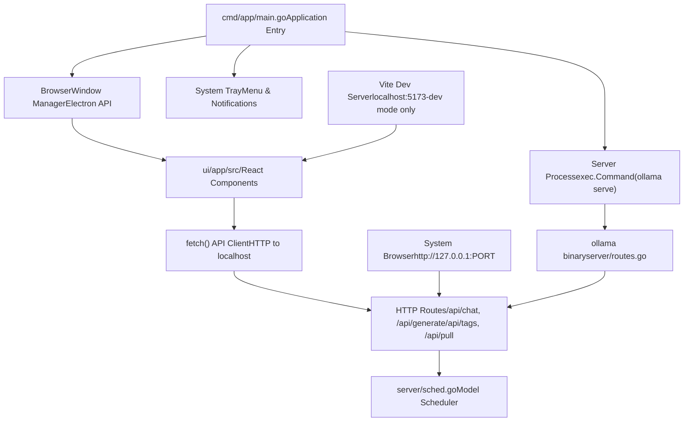
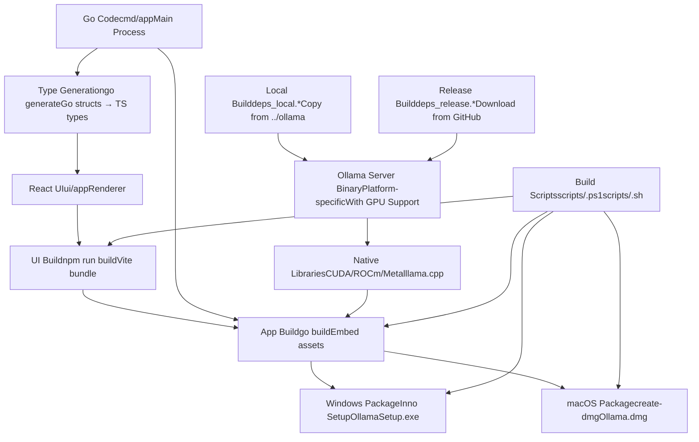
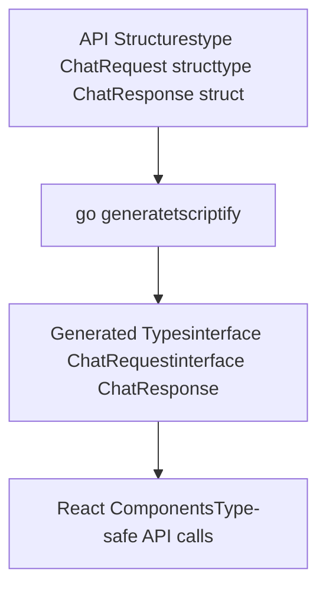

# 桌面应用程序开发

相关源文件

-   [app/README.md](https://github.com/ollama/ollama/blob/562c76d7/app/README.md?plain=1)

## 目的和范围

本文档涵盖了适用于 macOS 和 Windows 的 Ollama 桌面应用程序的开发、架构和构建流程。桌面应用程序围绕 Ollama HTTP API 服务器提供了一个本机 GUI 包装器，将 Ollama 后端和基于 React 的用户界面打包到使用 Electron 的独立应用程序中。

有关桌面应用程序与之通信的底层 HTTP 服务器和 API 的信息，请参阅 [HTTP 服务器和 API 层](/ollama/ollama/2.1-http-server-and-api-layer)。有关从源代码构建 Ollama 后端的详细信息，请参阅 [从源码构建](/ollama/ollama/8.1-building-from-source)。

**来源：** [app/README.md1-98](https://github.com/ollama/ollama/blob/562c76d7/app/README.md?plain=1#L1-L98)

---

## 架构概述

Ollama 桌面应用程序使用 Electron 的多进程架构，在应用程序中嵌入完整的 Ollama HTTP 服务器。该应用程序由一个主进程 (`cmd/app`) 组成，它生成服务器进程和渲染器进程。

### 组件架构


**图：带有代码路径的 Electron 多进程架构**

桌面应用程序由三个独立的进程组成：

1.  **主进程** (`cmd/app/main.go`) - Electron 应用程序生命周期，通过 `exec.Command` 生成服务器子进程，管理 `BrowserWindow` 和系统托盘
2.  **渲染器进程** (`ui/app/src/`) - 运行 React UI 的独立 Web 上下文，通过 fetch API 与服务器通信
3.  **服务器进程**（Ollama 二进制文件）- 从 `server/routes.go` 运行完整 HTTP 服务器的独立操作系统进程

**来源：** [app/README.md8-50](https://github.com/ollama/ollama/blob/562c76d7/app/README.md?plain=1#L8-L50)

### 开发模式与生产模式

该应用程序支持由 `-dev` 命令行标志控制的两种操作模式：

| 模式 | 用户界面源 | 服务器端口 | CORS 标头 | 重新加载 |
| --- | --- | --- | --- | --- |
| **发展** | `http://localhost:5173`（视频） | 已修复`127.0.0.1:3001` | `Access-Control-Allow-Origin: *` | 通过 HMR 热重载 |
| **生产** | 嵌入式 `ui/app/dist/` 捆绑包 | 动态（操作系统分配） | 未设置 | 需要重新启动 |

开发模式（`-dev` 标志）配置：

-   `BrowserWindow.loadURL("http://localhost:5173")` 而不是 `loadFile("dist/index.html")`
-   通过环境变量修复服务器端口以实现一致的 CORS 设置
-   服务器路由中的 CORS 中间件注入
-   Vite 的 WebSocket 连接用于热模块更换（HMR）

**来源：** [app/README.md44-50](https://github.com/ollama/ollama/blob/562c76d7/app/README.md?plain=1#L44-L50)

---

## 开发设置

### 先决条件

所需工具及其用途：

| 工具 | 目的 | 安装 |
| --- | --- | --- |
| **转到 1.21+** | 构建`cmd/app`主进程和服务器 | [https://go.dev/dl/](https://go.dev/dl/) |
| **Node.js 18+** | 运行Vite开发服务器，构建React UI | [https://nodejs.org/](https://nodejs.org/) |
| **电子** | 桌面应用程序运行时 | `npm install`（通过 package.json） |
| **tscriptify** | 从 Go 结构生成 TypeScript 接口 | `go install github.com/tkrajina/typescriptify-golang-structs/tscriptify@latest` |

安装 TypeScript 类型生成器：

```
go install github.com/tkrajina/typescriptify-golang-structs/tscriptify@latest
```
该工具读取 Go 结构体标签（例如 `` `json:"model"` ``）并在 `ui/app/src/types/` 中生成相应的 TypeScript 接口。

**来源：** [app/README.md18-25](https://github.com/ollama/ollama/blob/562c76d7/app/README.md?plain=1#L18-L25)

### 运行桌面应用程序

要使用生产 UI 包运行桌面应用程序：

```
go generate ./... &&go run ./cmd/app
```
该命令执行：

1.  `go generate ./...` - 调用 `//go:generate` 指令来运行 `tscriptify` 来生成类型
2.  `go run ./cmd/app` - 编译并运行 `cmd/app/main.go`
3.  `main.go` 产生服务器子进程：`exec.Command("ollama", "serve")`
4.  电子 `BrowserWindow` 负载 `file:///.../ui/app/dist/index.html`

**来源：** [app/README.md12-15](https://github.com/ollama/ollama/blob/562c76d7/app/README.md?plain=1#L12-L15)

### 使用热重载进行 UI 开发

要通过自动重新加载进行快速 UI 开发，请使用两个终端工作流程：

**终端1 - 启动Vite开发服务器：**

```
cd ui/appnpm installnpm run dev
```
这将在 `http://localhost:5173` 上启动 Vite：

-   为 `ui/app/src/` 中的 React 组件提供服务
-   建立 WebSocket 连接以进行热模块更换 (HMR)
-   根据文件更改进行重建（`.tsx`、`.ts`、`.css`）

**终端 2 - 在开发模式下启动 Electron 应用程序：**

```
go generate ./... &&OLLAMA_DEBUG=1 go run ./cmd/app -dev
```
`-dev` 标志启用：

-   `BrowserWindow.loadURL("http://localhost:5173")` - 从 Vite 加载而不是 `dist/`
-   固定服务器端口 `127.0.0.1:3001` - 通过 `OLLAMA_HOST` 环境变量设置
-   CORS 中间件 - 添加 `Access-Control-Allow-Origin: http://localhost:5173`
-   服务器日志 - `OLLAMA_DEBUG=1` 启用详细日志记录到标准输出

通过此设置，编辑 `ui/app/src/` 中的 React 组件会触发即时 HMR 更新，而无需重新启动 Electron。

**来源：** [app/README.md27-50](https://github.com/ollama/ollama/blob/562c76d7/app/README.md?plain=1#L27-L50) </old\_str>

## <旧\_str>

## 调试

### 控制台和开发工具

在开发模式下访问 Electron DevTools：

```
# Run with DevTools auto-openOLLAMA_DEBUG=1 go run ./cmd/app -dev
```
然后按 `Cmd+Option+I` (macOS) 或 `Ctrl+Shift+I` (Windows/Linux) 打开 Chrome DevTools。

### 记录

启用详细日志记录：

```
# Server logsOLLAMA_DEBUG=1 go run ./cmd/app -dev # Electron main process logs# Prints to terminal stdout/stderr
```
日志位置：

-   **主进程**：stdout（终端运行`go run`）
-   **渲染器进程**：DevTools Console 选项卡
-   **服务器进程**：带有 `OLLAMA_DEBUG=1` 的标准输出

### 常见问题

| 问题 | 原因 | 解决方案 |
| --- | --- | --- |
| 用户界面未加载 | 维特未运行 | 在航站楼 1 中启动 `npm run dev` |
| CORS 错误 | 错误的 port/no CORS | 验证 `-dev` 标志和端口 3001 |
| API 404 错误 | 服务器未启动 | 检查 `exec.Command` 生成是否成功 |
| HMR 不工作 | WebSocket 被阻止 | 检查 firewall/antivirus 设置 |

### 调试服务器通信

监控渲染器和服务器之间的 HTTP 请求：

1.  打开 DevTools 网络选项卡
2.  按 `127.0.0.1:3001` 过滤
3.  检查 request/response 有效负载
4.  检查响应中的 CORS 标头

**来源：** [app/README.md27-50](https://github.com/ollama/ollama/blob/562c76d7/app/README.md?plain=1#L27-L50)

---

## 代码结构

桌面应用程序代码库被组织成具有特定职责的关键目录：

```
app/
├── cmd/
│   └── app/
│       └── main.go              # Electron main process entry, spawns server
├── ui/
│   └── app/
│       ├── src/
│       │   ├── components/       # React UI components
│       │   ├── types/            # Generated TS types from Go
│       │   ├── api/              # fetch() API client
│       │   └── App.tsx           # Root component
│       ├── package.json          # npm dependencies (electron, react, vite)
│       ├── vite.config.ts        # Vite build config
│       └── tsconfig.json         # TypeScript compiler config
├── scripts/
│   ├── build_windows.ps1         # Builds OllamaSetup.exe with Inno Setup
│   ├── build_darwin.sh           # Builds Ollama.dmg with create-dmg
│   ├── deps_local.ps1/.sh        # Copy local ollama build
│   └── deps_release.ps1/.sh      # Download release binaries
└── README.md
```
### 主进程（`cmd/app/main.go`）

职责：

-   调用`app.Ready()`初始化Electron
-   生成服务器：带有环境变量的 `cmd := exec.Command("ollama", "serve")`
-   使用 `webPreferences.nodeIntegration: false` 创建 `BrowserWindow`（安全）
-   为系统托盘、文件对话框注册 IPC 处理程序
-   处理 `will-quit` 事件以终止服务器子进程

**来源：** [app/README.md12-15](https://github.com/ollama/ollama/blob/562c76d7/app/README.md?plain=1#L12-L15)

### 反应用户界面（`ui/app/src/`）

结构：

-   **组件**：`Chat.tsx`、`ModelList.tsx`、`Settings.tsx` - UI 元素
-   **API 客户端**：`api/client.ts` - 包装 `fetch()` 以实现类型安全的服务器通信
-   **类型**：`types/api.ts` - 通过 `tscriptify` 从 Go 结构自动生成
-   **State**：用于本地状态管理的 React hooks (`useState`, `useEffect`)

构建输出：

-   `npm run dev` → Vite 开发服务器端口 5173
-   `npm run build` → `ui/app/dist/` 中的静态包

**来源：** [app/README.md27-35](https://github.com/ollama/ollama/blob/562c76d7/app/README.md?plain=1#L27-L35)

---

## 调试

### 控制台和开发工具

在开发模式下访问 Electron DevTools：

```
# Run with DevTools auto-openOLLAMA_DEBUG=1 go run ./cmd/app -dev
```
然后按 `Cmd+Option+I` (macOS) 或 `Ctrl+Shift+I` (Windows/Linux) 打开 Chrome DevTools。

### 记录

启用详细日志记录：

```
# Server logsOLLAMA_DEBUG=1 go run ./cmd/app -dev # Electron main process logs# Prints to terminal stdout/stderr
```
日志位置：

-   **主进程**：stdout（终端运行`go run`）
-   **渲染器进程**：DevTools Console 选项卡
-   **服务器进程**：带有 `OLLAMA_DEBUG=1` 的标准输出

### 常见问题

| 问题 | 原因 | 解决方案 |
| --- | --- | --- |
| 用户界面未加载 | 维特未运行 | 在航站楼 1 中启动 `npm run dev` |
| CORS 错误 | 错误的 port/no CORS | 验证 `-dev` 标志和端口 3001 |
| API 404 错误 | 服务器未启动 | 检查 `exec.Command` 生成是否成功 |
| HMR 不工作 | WebSocket 被阻止 | 检查 firewall/antivirus 设置 |

### 调试服务器通信

监控渲染器和服务器之间的 HTTP 请求：

1.  打开 DevTools 网络选项卡
2.  按 `127.0.0.1:3001` 过滤
3.  检查 request/response 有效负载
4.  检查响应中的 CORS 标头

**来源：** [app/README.md27-50](https://github.com/ollama/ollama/blob/562c76d7/app/README.md?plain=1#L27-L50) </old\_str>

<新\_str>

### 开发流程

开发工作流程涉及在开发模式下同时运行 Vite 开发服务器和 Electron 应用程序：

> **[美人鱼序列]**
> *(图表结构无法解析)*

**图：热重载开发顺序**

**来源：** [app/README.md27-50](https://github.com/ollama/ollama/blob/562c76d7/app/README.md?plain=1#L27-L50)

---

## 构建过程

桌面应用程序支持两个主要分发平台，每个平台都有不同的构建过程和安装程序格式。

### Windows 构建

Windows 构建使用 Inno Setup 生成可执行安装程序。

#### 依赖管理

在构建之前，从本地构建或 GitHub 版本获取 Ollama 后端二进制文件：

**本地依赖项：**

```
.\scripts\deps_local.ps1
```
从主仓库构建输出复制本地构建的 Ollama 二进制文件。

**发布依赖项：**

```
.\scripts\deps_release.ps1 0.6.8
```
从指定的 GitHub 发行版本下载预构建的二进制文件。

#### 建筑

执行 Windows 构建脚本：

```
.\scripts\build_windows.ps1
```
这个脚本：

1.  将 React UI 捆绑到静态资产中
2.  编译Electron主流程
3.  嵌入 Ollama 后端二进制文件
4.  使用 Inno Setup 打包所有内容
5.  生成 `OllamaSetup.exe` 安装程序

**外部依赖项：** Inno Setup 必须从 [https://jrsoftware.org/isinfo.php](https://jrsoftware.org/isinfo.php) 安装

**来源：** [app/README.md54-71](https://github.com/ollama/ollama/blob/562c76d7/app/README.md?plain=1#L54-L71)

### macOS 构建

macOS 构建会生成一个 `.dmg` 磁盘映像，其中包含已签名的 `.app` 捆绑包。

#### Xcode 版本兼容性

CI 系统使用 Xcode 14.1 构建，以保持与 macOS 11+ 的兼容性。对于针对旧操作系统版本的手动构建：

```
export CGO_CFLAGS=-mmacosx-version-min=12.0export CGO_CXXFLAGS=-mmacosx-version-min=12.0export CGO_LDFLAGS=-mmacosx-version-min=12.0export SDKROOT=/Applications/Xcode_14.1.0.app/Contents/Developer/Platforms/MacOSX.platform/Developer/SDKs/MacOSX.sdkexport DEVELOPER_DIR=/Applications/Xcode_14.1.0.app/Contents/Developer
```
这些环境变量配置最小部署目标和 SDK 路径以实现向后兼容性。

#### 依赖管理

**本地依赖项：**

```
./scripts/deps_local.sh
```
**发布依赖项：**

```
./scripts/deps_release.sh 0.6.8
```
#### 建筑

执行 macOS 构建脚本：

```
./scripts/build_darwin.sh
```
这个脚本：

1.  构建 React UI 包
2.  为 macOS 编译 Electron 主进程
3.  嵌入 Ollama 后端并支持 Metal 加速
4.  创建 `.app` 包
5.  签署申请（如果有证书）
6.  生成 `Ollama.dmg` 磁盘映像

**来源：** [app/README.md73-97](https://github.com/ollama/ollama/blob/562c76d7/app/README.md?plain=1#L73-L97)

### 构建工件总结

| 平台 | 文物 | 格式 | 安装者类型 |
| --- | --- | --- | --- |
| **Windows** | `OllamaSetup.exe` | Inno Setup 安装程序 | 带快捷方式的 GUI 安装程序 |
| **macOS** | `Ollama.dmg`、`Ollama.app` | 磁盘映像、应用程序包 | 拖放式安装 |

**来源：** [app/README.md3-7](https://github.com/ollama/ollama/blob/562c76d7/app/README.md?plain=1#L3-L7)

---

## 构建依赖关系流程


**图：构建依赖关系和工件流程**

**来源：** [app/README.md51-97](https://github.com/ollama/ollama/blob/562c76d7/app/README.md?plain=1#L51-L97)

---

## UI和后端之间的通信

React UI 使用浏览器的 `fetch()` API 与嵌入式 Ollama 服务器进行通信。服务器作为由 Electron 主进程生成的单独进程运行。

> **[美人鱼序列]**
> *(图表结构无法解析)*

**图：UI 服务器与代码实体的通信**

### API端点使用

桌面 UI 向这些服务器端点发出 HTTP 请求：

| 端点 | 方法 | 请求正文 | 响应类型 | 处理程序位置 |
| --- | --- | --- | --- | --- |
| `/api/chat` | 邮政 | `ChatRequest` | `text/event-stream` | `server/routes.go:ChatHandler` |
| `/api/generate` | 邮政 | `GenerateRequest` | `text/event-stream` | `server/routes.go:GenerateHandler` |
| `/api/pull` | 邮政 | `PullRequest` | `text/event-stream` | `server/routes.go:PullHandler` |
| `/api/tags` | 得到 | \- | `application/json` | `server/routes.go:ListHandler` |
| `/api/create` | 邮政 | `CreateRequest` | `text/event-stream` | `server/routes.go:CreateHandler` |
| `/api/delete` | 删除 | `DeleteRequest` | `application/json` | `server/routes.go:DeleteHandler` |

Request/response 类型在 Go 中定义，并通过 `tscriptify` 自动生成为 TypeScript。

有关完整的 API 文档，请参阅 [生成和聊天 API](/ollama/ollama/3.2-generation-and-chat-api) 和 [模型管理API](/ollama/ollama/3.1-model-management-api)。

**来源：** [app/README.md38-50](https://github.com/ollama/ollama/blob/562c76d7/app/README.md?plain=1#L38-L50)

---

## 类型安全和代码生成

桌面应用程序通过自动代码生成来维护 Go 后端和 TypeScript 前端之间的类型安全：


**图：类型生成管道**

`tscriptify`工具分析Go结构体定义并生成相应的TypeScript接口，确保API请求和响应类型在后端和前端之间保持同步。

**来源：** [app/README.md21-25](https://github.com/ollama/ollama/blob/562c76d7/app/README.md?plain=1#L21-L25)

---

## 分发和发布

桌面应用程序二进制文件通过 GitHub Releases 分发：

-   **Windows：** `OllamaSetup.exe` - 可安装的可执行文件
-   **macOS:** `Ollama.dmg` - 通过拖放安装的磁盘映像

下载地址：

-   macOS：[https://github.com/ollama/app/releases/download/latest/Ollama.dmg](https://github.com/ollama/app/releases/download/latest/Ollama.dmg)
-   窗口：[https://github.com/ollama/app/releases/download/latest/OllamaSetup.exe](https://github.com/ollama/app/releases/download/latest/OllamaSetup.exe)

发布过程通过 GitHub Actions 工作流程实现自动化：

1.  构建特定于平台的工件
2.  签署可执行文件（macOS：代码签名，Windows：可选的authenticode）
3.  使用二进制文件创建 GitHub 版本
4.  生成校验和以进行验证

有关更广泛的发布管道（包括 Linux 和 Docker 发行版）的信息，请参阅 [构建、测试和发布管道（图 4）](/ollama/ollama/1-overview)。

**来源：** [app/README.md3-7](https://github.com/ollama/ollama/blob/562c76d7/app/README.md?plain=1#L3-L7)
