# Go 模块依赖关系

相关源文件

-   [cmd/config/claude\_test.go](https://github.com/ollama/ollama/blob/562c76d7/cmd/config/claude_test.go)
-   [cmd/config/codex.go](https://github.com/ollama/ollama/blob/562c76d7/cmd/config/codex.go)
-   [cmd/config/codex\_test.go](https://github.com/ollama/ollama/blob/562c76d7/cmd/config/codex_test.go)
-   [go.mod](https://github.com/ollama/ollama/blob/562c76d7/go.mod)
-   [go.sum](https://github.com/ollama/ollama/blob/562c76d7/go.sum)

## 目的和范围

本页面记录了 Ollama 代码库中使用的 Go 模块依赖项，按功能类别组织。它涵盖了直接和间接依赖项、它们的版本以及它们在系统中的角色。有关在开发过程中从源代码构建和管理依赖项的信息，请参阅 [从源码构建](/ollama/ollama/8.1-building-from-source)。有关特定于平台的构建要求，请参阅 [特定于平台的构建细节](/ollama/ollama/8.2-platform-specific-build-details)。

Ollama 项目需要 [go.mod3](https://github.com/ollama/ollama/blob/562c76d7/go.mod#L3-L3) 中指定的 Go 1.24.1，并使用大约 40 个直接依赖项和超过 70 个间接传递依赖项。

## 依赖组织

依赖关系在 [go.mod5-110](https://github.com/ollama/ollama/blob/562c76d7/go.mod#L5-L110) 内的三个部分中声明：

1.  **主要必需的依赖项** [go.mod5-20](https://github.com/ollama/ollama/blob/562c76d7/go.mod#L5-L20) - 核心运行时依赖项
2.  **次要必需的依赖项** [go.mod22-42](https://github.com/ollama/ollama/blob/562c76d7/go.mod#L22-L42) - 附加功能
3.  **第三级必需的依赖项** [go.mod44-80](https://github.com/ollama/ollama/blob/562c76d7/go.mod#L44-L80) 和 [go.mod82-110](https://github.com/ollama/ollama/blob/562c76d7/go.mod#L82-L110) - 支持库和传递依赖项

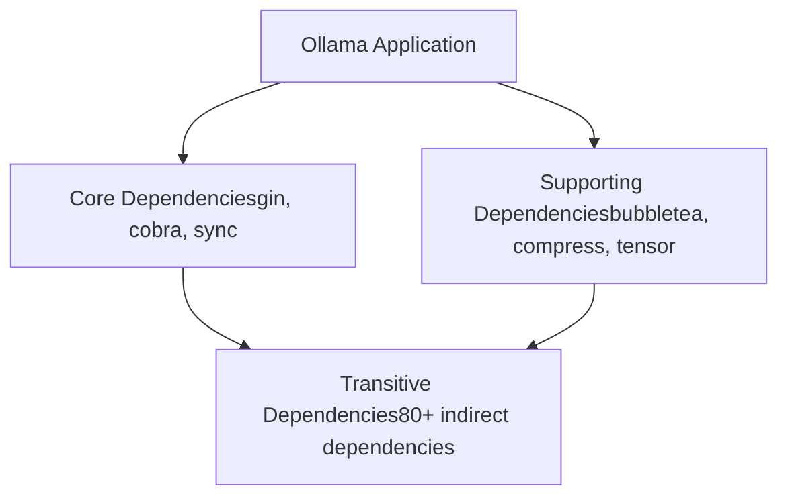
**来源：** [go.mod1-111](https://github.com/ollama/ollama/blob/562c76d7/go.mod#L1-L111)

## 关键依赖类别

### HTTP 服务器和 API 框架

Ollama 使用 Gin Web 框架作为其 HTTP API 层，提供路由、中间件和请求处理。

| 包裹 | 版本 | 目的 |
| --- | --- | --- |
| `github.com/gin-gonic/gin` | v1.10.0 | 核心 HTTP 路由器和中间件框架 |
| `github.com/gin-contrib/cors` | v1.7.2 | 用于跨源请求的 CORS 中间件 |
| `github.com/gin-contrib/sse` | v0.1.0 | 服务器发送的流式响应事件 |

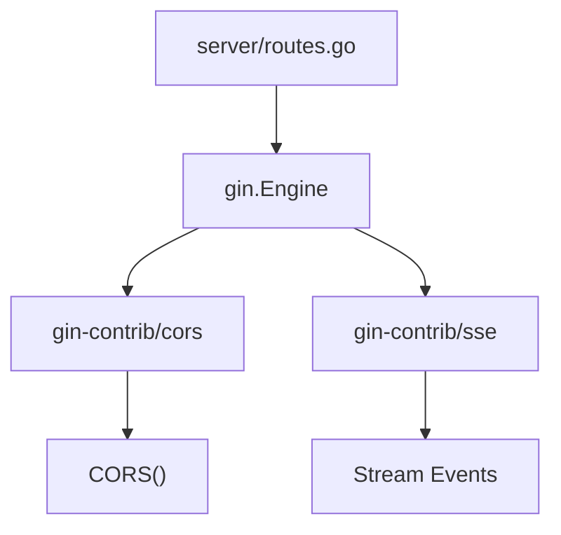
**来源：** [go.mod8](https://github.com/ollama/ollama/blob/562c76d7/go.mod#L8-L8) [go.mod85-86](https://github.com/ollama/ollama/blob/562c76d7/go.mod#L85-L86)

Gin 框架在服务器包中初始化，并为所有 API 端点（包括 `/api/chat`、`/api/generate` 和 OpenAI/Anthropic 兼容性端点提供基础。

### 命令行界面

CLI 使用 Cobra 框架构建，提供命令解析、帮助生成和子命令管理。

| 包裹 | 版本 | 目的 |
| --- | --- | --- |
| `github.com/spf13/cobra` | v1.7.0 | CLI 命令框架和路由 |
| `github.com/spf13/pflag` | v1.0.5 | POSIX 风格的命令行标志 |

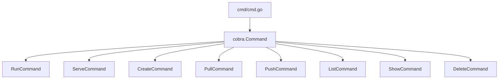
**来源：** [go.mod15](https://github.com/ollama/ollama/blob/562c76d7/go.mod#L15-L15) [go.mod99](https://github.com/ollama/ollama/blob/562c76d7/go.mod#L99-L99)

所有 CLI 命令都是使用 Cobra 的命令结构实现的，每个子命令都注册在根命令树中。

### 终端用户界面

对于交互式终端体验，Ollama 使用 Bubble Tea 框架以及 Lipgloss 提供的样式。

| 包裹 | 版本 | 目的 |
| --- | --- | --- |
| `github.com/charmbracelet/bubbletea` | v1.3.10 | 带有事件循环的终端 UI 框架 |
| `github.com/charmbracelet/lipgloss` | v1.1.0 | 终端文本样式和布局 |
| `github.com/olekukonko/tablewriter` | v0.0.5 | 用于输出的 ASCII 表呈现 |
| `github.com/containerd/console` | v1.0.3 | 控制台终端处理 |
| `github.com/mattn/go-runewidth` | v0.0.16 | Unicode 宽度计算 |

**来源：** [go.mod24-25](https://github.com/ollama/ollama/blob/562c76d7/go.mod#L24-L25) [go.mod14](https://github.com/ollama/ollama/blob/562c76d7/go.mod#L14-L14) [go.mod7](https://github.com/ollama/ollama/blob/562c76d7/go.mod#L7-L7) [go.mod30](https://github.com/ollama/ollama/blob/562c76d7/go.mod#L30-L30)

这些依赖关系为整个 CLI 中的交互式进度显示、格式化输出和基于终端的用户界面提供支持。

### 机器学习和数值计算

核心数值运算和张量操作由专门的库提供。

| 包裹 | 版本 | 目的 |
| --- | --- | --- |
| `gonum.org/v1/gonum` | v0.15.0 | 矩阵运算和线性代数 |
| `github.com/pdevine/tensor` | v0.0.0-20240510204454 | 模型数据的张量运算 |
| `github.com/x448/float16` | v0.8.4 | Float16（半精度）支持 |
| `github.com/d4l3k/go-bfloat16` | v0.0.0-20211005043715 | BFloat16 对 ML 操作的支持 |
| `github.com/nlpodyssey/gopickle` | v0.3.0 | Python pickle 格式解析器 |

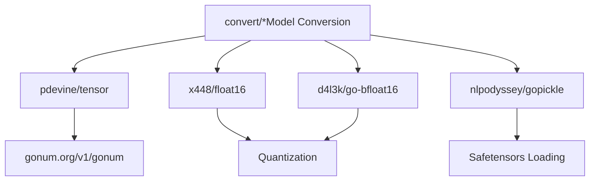
**来源：** [go.mod41](https://github.com/ollama/ollama/blob/562c76d7/go.mod#L41-L41) [go.mod32](https://github.com/ollama/ollama/blob/562c76d7/go.mod#L32-L32) [go.mod17](https://github.com/ollama/ollama/blob/562c76d7/go.mod#L17-L17) [go.mod26](https://github.com/ollama/ollama/blob/562c76d7/go.mod#L26-L26) [go.mod31](https://github.com/ollama/ollama/blob/562c76d7/go.mod#L31-L31)

这些库对于模型转换、量化和处理机器学习模型中使用的各种数字格式至关重要。

### 代码解析与分析

树托管绑定支持语法感知代码处理，以实现工具调用和代码分析功能。

| 包裹 | 版本 | 目的 |
| --- | --- | --- |
| `github.com/tree-sitter/go-tree-sitter` | v0.25.0 | 核心树保姆绑定 |
| `github.com/tree-sitter/tree-sitter-cpp` | v0.23.4 | C++语言语法 |
| `github.com/dlclark/regexp2` | v1.11.4 | 具有反向引用的高级正则表达式 |

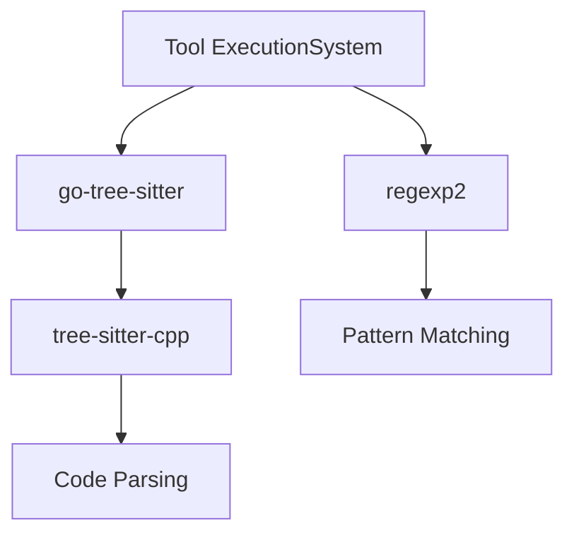
**来源：** [go.mod35-36](https://github.com/ollama/ollama/blob/562c76d7/go.mod#L35-L36) [go.mod27](https://github.com/ollama/ollama/blob/562c76d7/go.mod#L27-L27)

Tree-sitter 提供语法感知解析功能，用于工具调用功能和代码分析。

### 数据压缩和序列化

支持多种压缩和序列化格式用于模型存储和传输。

| 包裹 | 版本 | 目的 |
| --- | --- | --- |
| `github.com/klauspost/compress` | v1.18.3 | 高性能压缩（zstd、gzip） |
| `google.golang.org/protobuf` | v1.34.1 | 协议缓冲区序列化 |
| `github.com/golang/protobuf` | v1.5.4 | 旧版 protobuf 支持 |

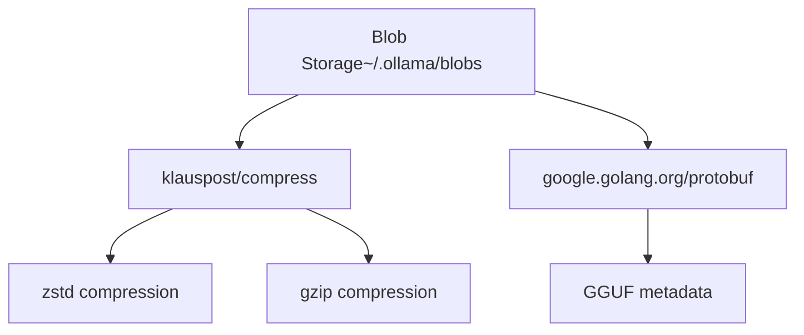
**来源：** [go.mod29](https://github.com/ollama/ollama/blob/562c76d7/go.mod#L29-L29) [go.mod108](https://github.com/ollama/ollama/blob/562c76d7/go.mod#L108-L108) [go.mod9](https://github.com/ollama/ollama/blob/562c76d7/go.mod#L9-L9)

压缩库大量用于模型 blob 存储，而 protobuf 处理结构化元数据。

### 文件处理

提供 PDF 处理功能以实现多模式文档理解。

| 包裹 | 版本 | 目的 |
| --- | --- | --- |
| `github.com/ledongthuc/pdf` | v0.0.0-20250511090121 | PDF文件解析和文本提取 |

**来源：** [go.mod12](https://github.com/ollama/ollama/blob/562c76d7/go.mod#L12-L12)

这种依赖性使得 PDF 文档处理能够支持文档理解的多模式模型。

### 数据结构和集合

高级数据结构补充了 Go 的标准库。

| 包裹 | 版本 | 目的 |
| --- | --- | --- |
| `github.com/emirpasic/gods/v2` | v2.0.0-阿尔法 | 通用集合（树、列表、地图） |
| `github.com/wk8/go-ordered-map/v2` | v2.1.8 | 具有确定性迭代的有序映射 |

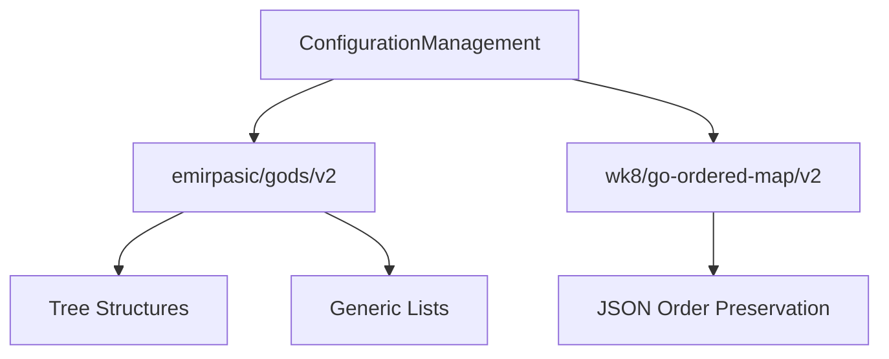
**来源：** [go.mod28](https://github.com/ollama/ollama/blob/562c76d7/go.mod#L28-L28) [go.mod37](https://github.com/ollama/ollama/blob/562c76d7/go.mod#L37-L37)

有序映射对于在模型清单和配置文件中保留 JSON 键顺序特别重要。

### 存储和数据库

SQLite 为模型元数据和配置提供本地持久存储。

| 包裹 | 版本 | 目的 |
| --- | --- | --- |
| `github.com/mattn/go-sqlite3` | v1.14.24 | 基于 CGo 的 SQLite 驱动程序 |

**来源：** [go.mod13](https://github.com/ollama/ollama/blob/562c76d7/go.mod#L13-L13)

SQLite 用于存储模型元数据、对话历史记录和持久配置。

### 测试和质量保证

全面的测试实用程序可确保代码质量和正确性。

| 包裹 | 版本 | 目的 |
| --- | --- | --- |
| `github.com/stretchr/testify` | v1.10.0 | 测试断言和模拟 |
| `github.com/google/go-cmp` | v0.7.0 | 测试的深度价值比较 |

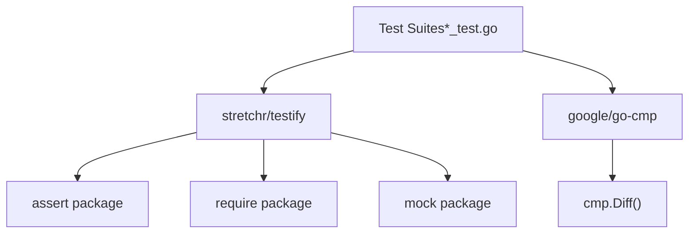
**来源：** [go.mod16](https://github.com/ollama/ollama/blob/562c76d7/go.mod#L16-L16) [go.mod10](https://github.com/ollama/ollama/blob/562c76d7/go.mod#L10-L10)

Testify 提供断言助手和模拟功能，而 go-cmp 为复杂结构提供详细的差异报告。

### 标准库扩展

Go 的扩展标准库包提供了关键的系统级功能。

| 包裹 | 版本 | 目的 |
| --- | --- | --- |
| `golang.org/x/sync` | v0.17.0 | 高级并发原语（errgroup、信号量） |
| `golang.org/x/sys` | v0.37.0 | 低级系统调用和操作系统接口 |
| `golang.org/x/crypto` | v0.43.0 | 加密函数和散列 |
| `golang.org/x/net` | v0.46.0 | 网络协议实现 |
| `golang.org/x/text` | v0.30.0 | 文本编码和 Unicode 支持 |
| `golang.org/x/image` | v0.22.0 | 图像 encoding/decoding |
| `golang.org/x/term` | v0.36.0 | 终端控制和 ANSI 处理 |
| `golang.org/x/mod` | v0.30.0 | Go 模块实用程序 |
| `golang.org/x/tools` | v0.38.0 | Go 工具库 |

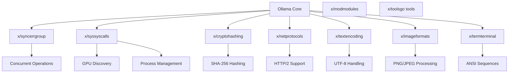
**来源：** [go.mod18-19](https://github.com/ollama/ollama/blob/562c76d7/go.mod#L18-L19) [go.mod103-107](https://github.com/ollama/ollama/blob/562c76d7/go.mod#L103-L107) [go.mod39-40](https://github.com/ollama/ollama/blob/562c76d7/go.mod#L39-L40)

这些扩展在整个代码库中用于系统级操作、并发管理、加密操作和终端处理。

### 实用程序库

其他实用程序提供各种支持功能。

| 包裹 | 版本 | 目的 |
| --- | --- | --- |
| `github.com/google/uuid` | v1.6.0 | 用于跟踪的 UUID 生成 |
| `github.com/agnivade/levenshtein` | v1.1.1 | 建议的字符串相似度 |
| `github.com/pkg/browser` | v0.0.0-20240102092130 | 跨平台浏览器启动 |
| `github.com/tkrajina/typescriptify-golang-structs` | v0.2.0 | TypeScript 类型生成 |

**来源：** [go.mod11](https://github.com/ollama/ollama/blob/562c76d7/go.mod#L11-L11) [go.mod23](https://github.com/ollama/ollama/blob/562c76d7/go.mod#L23-L23) [go.mod33](https://github.com/ollama/ollama/blob/562c76d7/go.mod#L33-L33) [go.mod34](https://github.com/ollama/ollama/blob/562c76d7/go.mod#L34-L34)

这些实用程序处理各种支持功能，从生成唯一标识符到启动 Web 浏览器以进行身份​​验证流程。

### 特定于平台的依赖关系

Windows 特定的依赖项提供平台集成。

| 包裹 | 版本 | 目的 |
| --- | --- | --- |
| `github.com/TheTitanrain/w32` | v0.0.0-20180517000239 | Windows API 绑定 |

**来源：** [go.mod6](https://github.com/ollama/ollama/blob/562c76d7/go.mod#L6-L6)

Windows 特定的功能与特定于平台的构建标记隔离，并使用此依赖关系进行 Windows API 访问。

## 依赖管理实践

### 版本固定

所有依赖项都使用显式版本固定来确保可重现的构建。直接依赖项指定语义版本 [go.mod5-110](https://github.com/ollama/ollama/blob/562c76d7/go.mod#L5-L110)，而 `go.sum` 文件 [go.sum1-454](https://github.com/ollama/ollama/blob/562c76d7/go.sum#L1-L454) 包含用于验证的加密校验和。

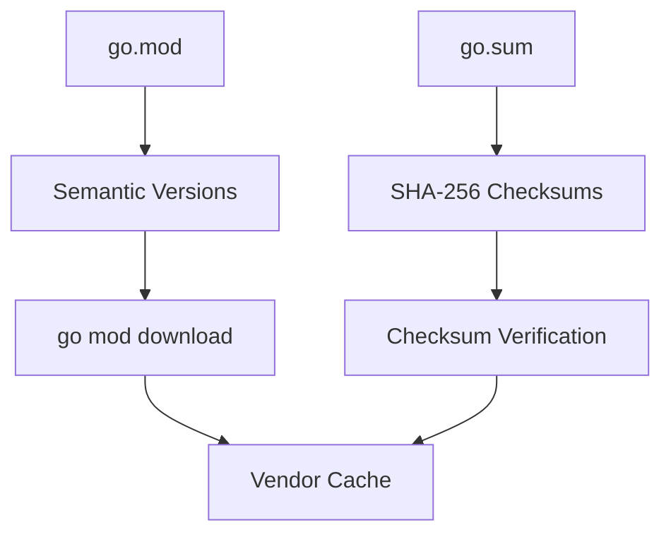
**来源：** [go.mod1-111](https://github.com/ollama/ollama/blob/562c76d7/go.mod#L1-L111) [go.sum1-454](https://github.com/ollama/ollama/blob/562c76d7/go.sum#L1-L454)

### 直接依赖与间接依赖

依赖关系分为直接和间接类别：

-   **直接依赖项** - 由 Ollama 代码显式导入
-   **间接依赖项** - 直接依赖项所需（用 `// indirect` 标记）

来自 [go.mod45-80](https://github.com/ollama/ollama/blob/562c76d7/go.mod#L45-L80) 的间接依赖关系示例：

-   `github.com/apache/arrow/go/arrow` - 张量库所需
-   `github.com/bytedance/sonic/loader` - Gin 框架所需
-   `github.com/cloudwego/base64x` - 索尼克需要

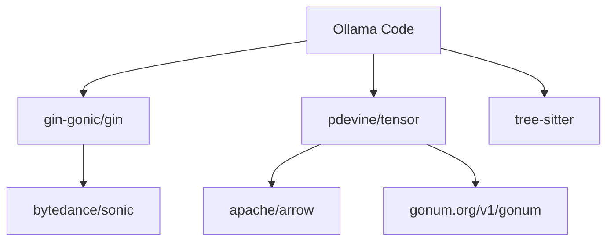
**来源：** [go.mod5-80](https://github.com/ollama/ollama/blob/562c76d7/go.mod#L5-L80)

### 依赖项更新

依赖项通过标准 Go 模块命令更新：

-   `go get -u` - 更新依赖项
-   `go mod tidy` - 清理未使用的依赖项
-   `go mod verify` - 验证校验和

`go.sum` 文件必须提交版本控制，以确保所有开发人员和 CI 系统使用相同的依赖版本。

## 整合点

### 服务器初始化

HTTP服务器初始化集成了多个依赖项：

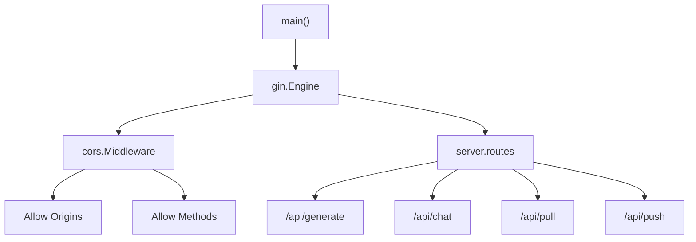
**来源：** [go.mod8](https://github.com/ollama/ollama/blob/562c76d7/go.mod#L8-L8) [go.mod85](https://github.com/ollama/ollama/blob/562c76d7/go.mod#L85-L85)

### 模型转换管道

模型转换系统集成了数值和序列化库：

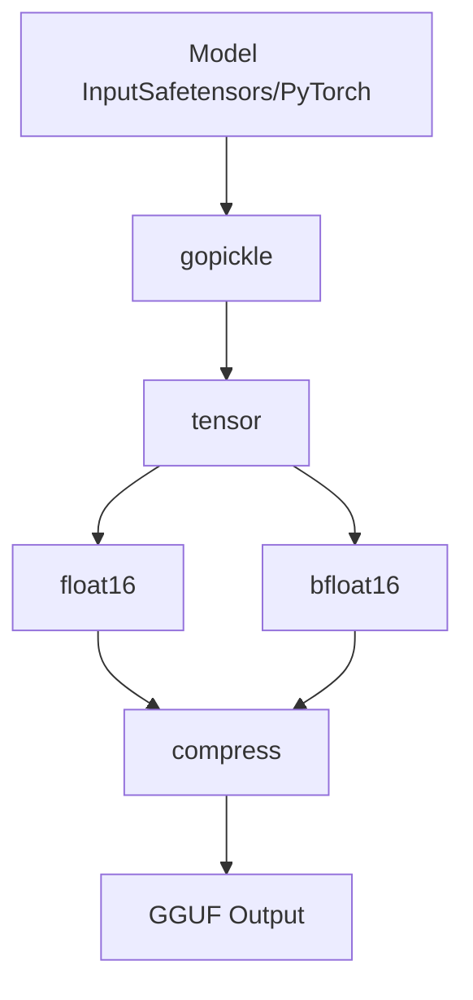
**来源：** [go.mod31](https://github.com/ollama/ollama/blob/562c76d7/go.mod#L31-L31) [go.mod32](https://github.com/ollama/ollama/blob/562c76d7/go.mod#L32-L32) [go.mod17](https://github.com/ollama/ollama/blob/562c76d7/go.mod#L17-L17) [go.mod26](https://github.com/ollama/ollama/blob/562c76d7/go.mod#L26-L26) [go.mod29](https://github.com/ollama/ollama/blob/562c76d7/go.mod#L29-L29)

### CLI 命令处理

CLI集成了多个UI和处理库：

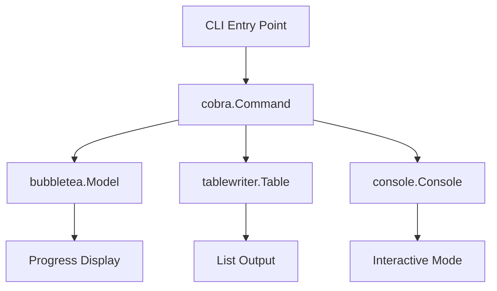
**来源：** [go.mod15](https://github.com/ollama/ollama/blob/562c76d7/go.mod#L15-L15) [go.mod24](https://github.com/ollama/ollama/blob/562c76d7/go.mod#L24-L24) [go.mod14](https://github.com/ollama/ollama/blob/562c76d7/go.mod#L14-L14) [go.mod7](https://github.com/ollama/ollama/blob/562c76d7/go.mod#L7-L7)

## 传递依赖图

主要传递依赖链：

| 直接依赖 | 关键传递依赖 | 目的 |
| --- | --- | --- |
| `gin-gonic/gin` | `bytedance/sonic`、`go-playground/validator`、`ugorji/go/codec` | JSON 编码、验证、编解码器 |
| `pdevine/tensor` | `apache/arrow`、`gonum.org/v1/gonum`、`gorgonia.org/vecf32` | 数组运算、线性代数 |
| `charmbracelet/bubbletea` | `charmbracelet/x/*`、`muesli/termenv`、`containerd/console` | 终端渲染、颜色支持 |
| `tree-sitter` | 多种`tree-sitter-*`语言语法 | 特定于语言的解析器 |

**来源：** [go.mod44-80](https://github.com/ollama/ollama/blob/562c76d7/go.mod#L44-L80) [go.mod82-110](https://github.com/ollama/ollama/blob/562c76d7/go.mod#L82-L110)

## 依赖性大小和影响

### 构建尺寸贡献者

二进制大小的主要贡献者：

1.  **GGML/llama.cpp (CGo)** - 最大的组件，ML 推理引擎
2.  **gin-gonic/gin** - 具有完整 HTTP 堆栈的 Web 框架
3.  **tree-sitter 语法** - 多语言解析器
4.  **gonum** - 数值计算库

### 运行时依赖

有些依赖项仅在特定时间需要：

-   **构建时间**：`golang.org/x/tools`，`typescriptify-golang-structs`
-   **运行时**：所有其他
-   **特定于平台**：`w32`（仅限 Windows）

**来源：** [go.mod6](https://github.com/ollama/ollama/blob/562c76d7/go.mod#L6-L6) [go.mod34](https://github.com/ollama/ollama/blob/562c76d7/go.mod#L34-L34) [go.mod40](https://github.com/ollama/ollama/blob/562c76d7/go.mod#L40-L40)

## 安全考虑

### 加密依赖性

加密操作使用经过审查的库：

-   `golang.org/x/crypto` [go.mod103](https://github.com/ollama/ollama/blob/562c76d7/go.mod#L103-L103) - 标准加密原语
-   用于 Blob 存储中内容寻址的 SHA-256 哈希
-   没有自定义加密实现

### 供应链安全

该项目使用 `go.sum` [go.sum1-454](https://github.com/ollama/ollama/blob/562c76d7/go.sum#L1-L454) 来保证供应链安全：

-   所有依赖项都有加密校验和
-   Go模块代理缓存降低单点故障风险
-   通过 sum.golang.org 进行校验和数据库验证

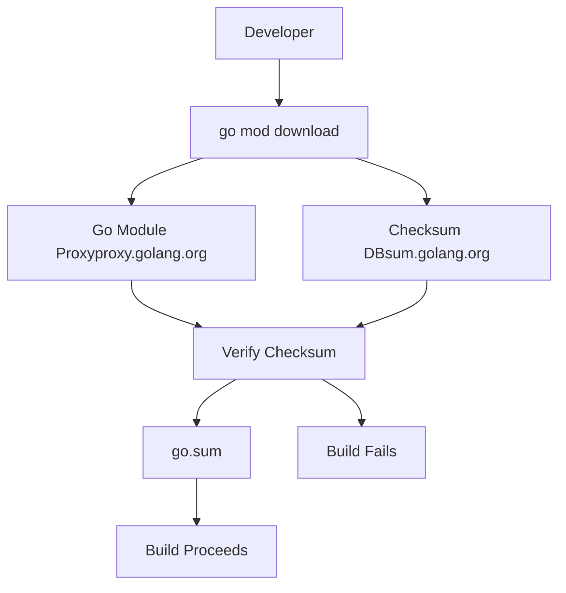
**来源：** [go.sum1-454](https://github.com/ollama/ollama/blob/562c76d7/go.sum#L1-L454)

## 维护和更新

### 更新策略

依赖关系会定期更新，并考虑以下因素：

1.  **安全补丁** - 立即应用 CVE
2.  **错误修复** - 在定期维护窗口期间应用
3.  **功能更新** - 评估收益与风险
4.  **重大变更** - 与主要版本发布协调

### 兼容性要求

一些依赖项有特定的版本要求：

-   转到 1.24.1 最小值 [go.mod3](https://github.com/ollama/ollama/blob/562c76d7/go.mod#L3-L3)
-   为 `mattn/go-sqlite3` [go.mod13](https://github.com/ollama/ollama/blob/562c76d7/go.mod#L13-L13) 启用 CGo
-   Windows 依赖项的特定于平台的构建 [go.mod6](https://github.com/ollama/ollama/blob/562c76d7/go.mod#L6-L6)

**来源：** [go.mod3](https://github.com/ollama/ollama/blob/562c76d7/go.mod#L3-L3) [go.mod13](https://github.com/ollama/ollama/blob/562c76d7/go.mod#L13-L13) [go.mod6](https://github.com/ollama/ollama/blob/562c76d7/go.mod#L6-L6)
