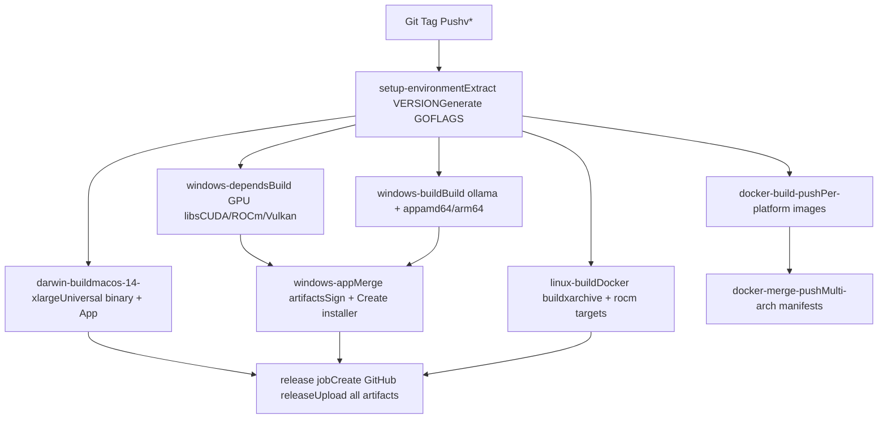
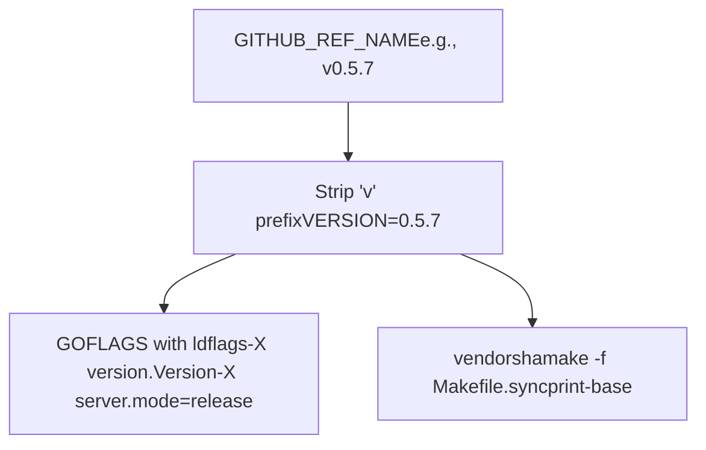
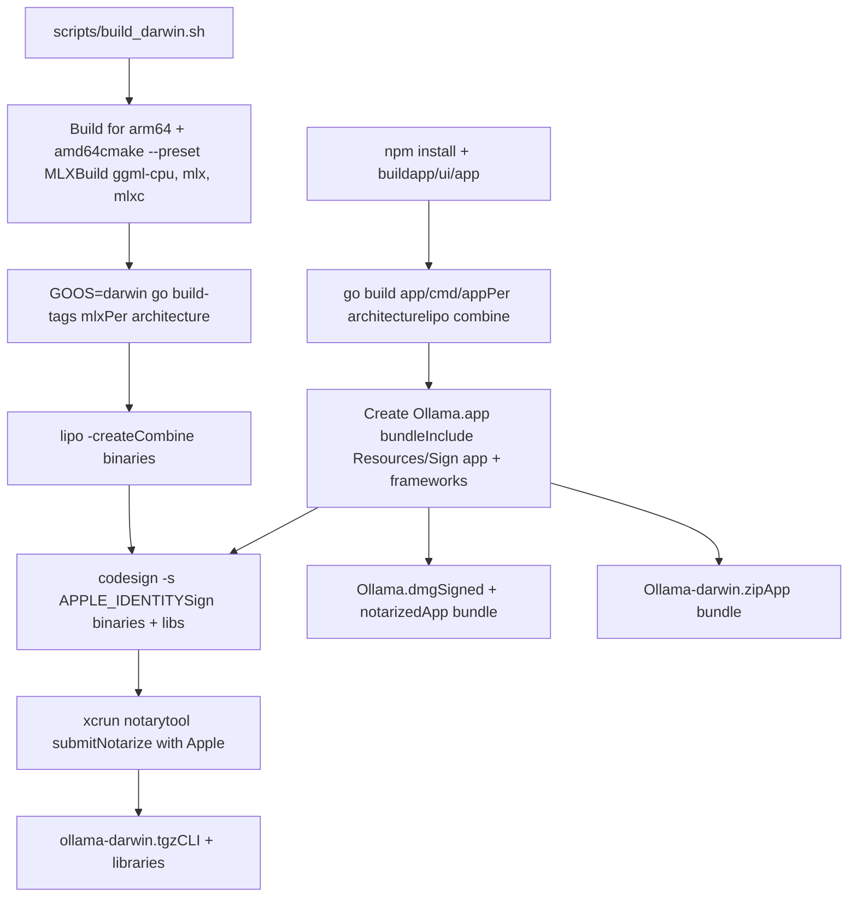
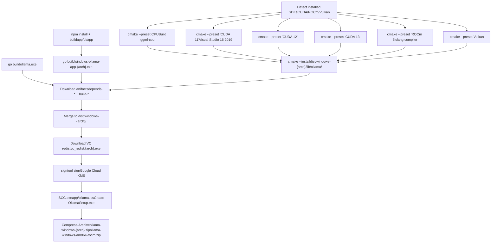
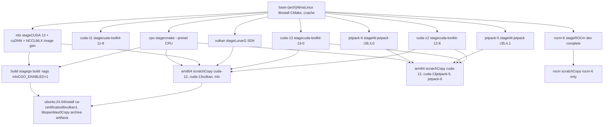
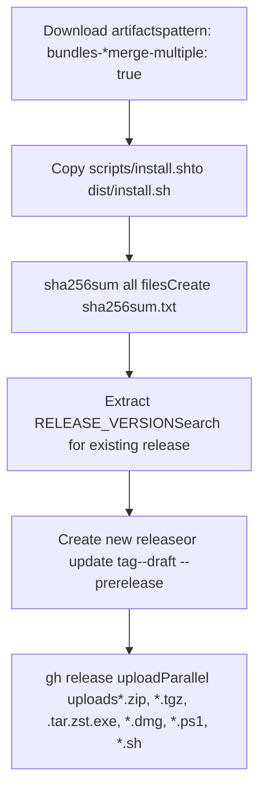

# 发布流程

相关源文件

-   [.github/workflows/release.yaml](https://github.com/ollama/ollama/blob/562c76d7/.github/workflows/release.yaml)
-   [.github/workflows/test-install.yaml](https://github.com/ollama/ollama/blob/562c76d7/.github/workflows/test-install.yaml)
-   [.github/workflows/test.yaml](https://github.com/ollama/ollama/blob/562c76d7/.github/workflows/test.yaml)
-   [Dockerfile](https://github.com/ollama/ollama/blob/562c76d7/Dockerfile)
-   [app/ollama.iss](https://github.com/ollama/ollama/blob/562c76d7/app/ollama.iss)
-   [scripts/build\_darwin.sh](https://github.com/ollama/ollama/blob/562c76d7/scripts/build_darwin.sh)
-   [scripts/build\_linux.sh](https://github.com/ollama/ollama/blob/562c76d7/scripts/build_linux.sh)
-   [scripts/build\_windows.ps1](https://github.com/ollama/ollama/blob/562c76d7/scripts/build_windows.ps1)
-   [scripts/deduplicate\_cuda\_libs.sh](https://github.com/ollama/ollama/blob/562c76d7/scripts/deduplicate_cuda_libs.sh)
-   [scripts/install.ps1](https://github.com/ollama/ollama/blob/562c76d7/scripts/install.ps1)
-   [scripts/install.sh](https://github.com/ollama/ollama/blob/562c76d7/scripts/install.sh)

本文档描述了 Ollama 的自动化发布流程，包括多平台构建、代码签名、工件生成和分发。发布过程会为跨多个架构和 GPU 后端的 macOS、Windows 和 Linux 生成特定于平台的安装程序、Docker 映像和独立存档。

有关开发期间从源代码构建的信息，请参阅 [从源码构建](/ollama/ollama/8.1-building-from-source)。有关特定于平台的构建详细信息和 CMake 配置，请参阅 [特定于平台的构建细节](/ollama/ollama/8.2-platform-specific-build-details)。

## 概述

发布过程是通过推送与模式 `v*` 匹配的 Git 标签来触发的。该工作流程为所有支持的平台和架构构建二进制文件，在适用的情况下签署可执行文件，生成安装程序和档案，构建多架构 Docker 映像，并将所有工件发布到 GitHub 版本。

**支持的平台：**

-   **macOS**：通用二进制文件（arm64 + amd64）、DMG 安装程序、桌面应用程序
-   **Windows**：amd64 和 arm64、签名的 EXE 安装程序、桌面应用程序、ZIP 存档
-   **Linux**：amd64 和 arm64、tar.zst 档案、Docker 映像

**GPU 后端变体：**

-   CUDA 11、CUDA 12、CUDA 13 (NVIDIA)
-   ROCm 6 (AMD)
-   Vulkan（跨供应商）
-   JetPack 5 和 6 (NVIDIA Jetson)
-   MLX（苹果芯片）

来源：[.github/workflows/release.yaml1-554](https://github.com/ollama/ollama/blob/562c76d7/.github/workflows/release.yaml#L1-L554)

## 发布工作流程概述


**图：发布工作流作业和依赖项**

来源：[.github/workflows/release.yaml12-503](https://github.com/ollama/ollama/blob/562c76d7/.github/workflows/release.yaml#L12-L503)

## 版本和构建标志

`setup-environment` 作业从 Git 标签中提取版本信息并配置所有下游作业使用的构建标志。


**图：版本提取和构建标志生成**

该版本通过 `-ldflags` 嵌入到 Go 二进制文件中并用于包命名：

-   `GOFLAGS`：`'-ldflags=-w -s "-X=github.com/ollama/ollama/version.Version=${VERSION}" "-X=github.com/ollama/ollama/server.mode=release"'`
-   `VERSION`：用于安装程序文件名和包元数据
-   `vendorsha`：供应商依赖项的缓存密钥

来源：[.github/workflows/release.yaml14-27](https://github.com/ollama/ollama/blob/562c76d7/.github/workflows/release.yaml#L14-L27)

## macOS 构建过程

`darwin-build` 作业在 `macos-14-xlarge` 上运行，并生成通用二进制文件、独立 tarball、DMG 安装程序和桌面应用程序。


**图表：macOS 构建和打包管道**

### 构建步骤

1.  **后端库**：使用 CMake 预设为两种架构构建 GGML CPU 和 MLX 后端
2.  **Go Binary**：针对每种架构使用 MLX 支持 (`-tags mlx`) 进行编译
3.  **通用二进制**：使用 `lipo` 组合 arm64 和 amd64 二进制文件
4.  **桌面应用程序**：构建 React UI，编译 Electron 应用程序，创建通用二进制文件
5.  **代码签名**：使用 `APPLE_IDENTITY` 签署所有二进制文件、库和应用程序包
6.  **公证**：使用 `notarytool` 提交给 Apple 进行公证
7.  **DMG 创建**：使用背景图像和应用程序图标创建 DMG 安装程序

### 代码签名要求

代码签名需要环境变量：

-   `APPLE_IDENTITY`：开发者证书
-   `APPLE_ID`：用于公证的Apple ID
-   `APPLE_PASSWORD`：应用程序专用密码
-   `APPLE_TEAM_ID`：开发者团队ID
-   `MACOS_SIGNING_KEY`：Base64编码的P12证书
-   `MACOS_SIGNING_KEY_PASSWORD`：证书密码

来源：[.github/workflows/release.yaml29-74](https://github.com/ollama/ollama/blob/562c76d7/.github/workflows/release.yaml#L29-L74) [scripts/build\_darwin.sh1-231](https://github.com/ollama/ollama/blob/562c76d7/scripts/build_darwin.sh#L1-L231)

## Windows 构建过程

Windows 构建分为三个工作：依赖关系构建、二进制编译和带有签名的最终汇编。


**图：Windows 构建管道**

### GPU后端安装

`windows-depends` 作业从缓存或新下载安装 GPU SDK：

| 后端 | 安装程序网址 | 成分 | 版本 |
| --- | --- | --- | --- |
| CUDA 12 | `cuda_12.8.0_571.96_windows.exe` | cudart、nvcc、cublas、cublas\_dev | 12.8 |
| CUDA 13 | `cuda_13.0.0_windows.exe` | cudart、nvcc、cublas、cublas\_dev、crt、nvvm、nvptx 编译器 | 13.0 |
| ROC 6 | `AMD-Software-PRO-Edition-24.Q4-WinSvr2022-For-HIP.exe` | 完整安装 | 6.2 |
| Vulkan | `vulkansdk-windows-X64-1.4.321.1.exe` | 完整的SDK | 1.4.321.1 |

来源：[.github/workflows/release.yaml75-211](https://github.com/ollama/ollama/blob/562c76d7/.github/workflows/release.yaml#L75-L211)

### 构建工具和编译

每个 GPU 后端都是使用特定的 CMake 预设构建的：

-   **CPU**：带有 clang 编译器的 `cmake --preset CPU`
-   **CUDA 11**：`cmake --preset "CUDA 11" -G "Visual Studio 16 2019"`（MSVC 兼容性）
-   **带有默认生成器的 CUDA 12/13**: `cmake --preset "CUDA 12"`
-   **ROCm**：`cmake --preset "ROCm 6" -G Ninja` 带有铿锵声
-   **Vulkan**：`cmake --preset Vulkan`

`windows-build` 作业编译 amd64 和 arm64 的 Go 二进制文件：

```
go build -trimpath -ldflags "-s -w -X=github.com/ollama/ollama/version.Version=$VERSION -X=github.com/ollama/ollama/server.mode=release" .
```
来源：[.github/workflows/release.yaml213-286](https://github.com/ollama/ollama/blob/562c76d7/.github/workflows/release.yaml#L213-L286) [scripts/build\_windows.ps199-229](https://github.com/ollama/ollama/blob/562c76d7/scripts/build_windows.ps1#L99-L229)

### 组装和签名

`windows-app` 工作：

1.  **下载工件**：收集所有 `depends-windows-*` 和 `build-windows-*` 工件
2.  **下载 VC 可再发行组件**：`vc_redist.x64.exe` 和 `vc_redist.arm64.exe`
3.  **签署二进制文件**：将 `signtool.exe` 与 Google Cloud KMS 提供商一起使用

    ```
    signtool sign /fd sha256 /t http://timestamp.digicert.com /f ollama_inc.crt /csp "Google Cloud KMS Provider" /kc $KEY_CONTAINER
    ```

4.  **创建安装程序**：在 `app/ollama.iss` 上运行 Inno Setup 编译器 (`ISCC.exe`)
5.  **创建 ZIP 档案**：用于直接提取的独立发行版

### Inno设置配置

安装程序在 `app/ollama.iss` 中定义为：

-   **应用程序 ID**：`{44E83376-CE68-45EB-8FC1-393500EB558C}`
-   **默认安装目录**：`{localappdata}\Programs\Ollama`
-   **权限**：`lowest`（每用户安装）
-   **架构支持**：`x64compatible arm64`
-   **注册表**：添加到用户 PATH，注册 `ollama://` URL 协议
-   **文件**：根据架构检查有条件地包含 amd64/arm64 二进制文件

来源：[.github/workflows/release.yaml287-342](https://github.com/ollama/ollama/blob/562c76d7/.github/workflows/release.yaml#L287-L342) [app/ollama.iss1-375](https://github.com/ollama/ollama/blob/562c76d7/app/ollama.iss#L1-L375) [scripts/build\_windows.ps1304-365](https://github.com/ollama/ollama/blob/562c76d7/scripts/build_windows.ps1#L304-L365)

## Linux 构建过程

Linux 构建使用 Docker 和多阶段 Dockerfile 来生成独立的存档和 Docker 映像。


**图：Linux Dockerfile 多阶段构建**

### 构建配置

`linux-build` 作业使用 Docker Buildx 和特定于平台的目标：

| 矩阵 | 平台 | 目标 | 输出 |
| --- | --- | --- | --- |
| amd64 存档 | linux/amd64 | 档案 | 所有 GPU 后端 + CPU |
| amd64 ROM | linux/amd64 | 罗姆 | 仅 ROCm 变体 |
| ARM64 存档 | linux/arm64 | 档案 | CUDA、JetPack 变体 |

构建传递环境变量：

-   `GOFLAGS`：使用版本构建标志
-   `CGO_CFLAGS`：`-O3`优化
-   `CGO_CXXFLAGS`：`-O3`优化

来源：[.github/workflows/release.yaml343-408](https://github.com/ollama/ollama/blob/562c76d7/.github/workflows/release.yaml#L343-L408) [Dockerfile1-211](https://github.com/ollama/ollama/blob/562c76d7/Dockerfile#L1-L211)

### 档案生成

构建后，该作业会创建单独的 tar.zst 存档：

1.  **创建清单**：列出要包含在每个存档变体中的文件

    -   标准：`bin/ollama*`、`lib/ollama/*.so*`、`lib/ollama/cuda_v*`、`lib/ollama/vulkan*`、`lib/ollama/mlx*`
    -   JetPack 5：`lib/ollama/cuda_jetpack5`
    -   JetPack 6：`lib/ollama/cuda_jetpack6`
    -   ROCm：`lib/ollama/rocm`
2.  **对 CUDA 库进行重复数据删除**：运行 `scripts/deduplicate_cuda_libs.sh` 以用符号链接替换重复的 `.so` 文件

3.  **创建压缩档案**：`tar + zstd --ultra -22` 实现最大压缩


```
tar c -C dist/$os-$arch -T $archive.tar.in --owner 0 --group 0 | zstd --ultra -22 -T0 >$(basename ${archive}.tar.zst)
```
来源：[.github/workflows/release.yaml376-407](https://github.com/ollama/ollama/blob/562c76d7/.github/workflows/release.yaml#L376-L407) [scripts/deduplicate\_cuda\_libs.sh1-61](https://github.com/ollama/ollama/blob/562c76d7/scripts/deduplicate_cuda_libs.sh#L1-L61)

## Docker 镜像构建和发布

Docker 镜像是按平台构建的，然后合并到多架构清单中。

**图：Docker多架构镜像构建**

### 构建过程

每个平台使用 `docker/build-push-action@v6` 独立构建：

-   **平台**：`linux/amd64`、`linux/arm64`
-   **构建参数**：`CGO_CFLAGS`、`CGO_CXXFLAGS`、`GOFLAGS`、`FLAVOR`（对于 ROCm）
-   **输出**：`type=image,push-by-digest=true,name-canonical=true`
-   **缓存**：来自`ollama/ollama:latest`的注册表缓存

该作业将摘要作为合并步骤的工件上传。

来源：[.github/workflows/release.yaml410-464](https://github.com/ollama/ollama/blob/562c76d7/.github/workflows/release.yaml#L410-L464)

### 清单合并

`docker-merge-push` 作业创建多架构清单：

1.  **下载摘要**：收集所有摘要工件
2.  **生成元数据**：使用 `docker/metadata-action@v4` 创建标签
    -   `type=semver,pattern={{version}}`：例如，`0.5.7`
    -   `type=ref,event=pr`：例如，`pr-1234`
    -   后缀：`-rocm` 用于 ROCm 变体
3.  **创建清单**：`docker buildx imagetools create` 组合每个平台的图像
4.  **检查清单**：验证多架构清单是否已创建

命令示例：

```
docker buildx imagetools create \  -t ollama/ollama:0.5.7 \  ollama/ollama@sha256:... ollama/ollama@sha256:...
```
来源：[.github/workflows/release.yaml466-497](https://github.com/ollama/ollama/blob/562c76d7/.github/workflows/release.yaml#L466-L497)

## 发布组装和分发

`release` 作业收集所有工件并将其发布到 GitHub。


**图：发布组装并上传**

### 神器类型

| 图案 | 平台 | 描述 |
| --- | --- | --- |
| `*.dmg` | macOS | 带有应用程序包的签名 DMG 安装程序 |
| `*.zip` | macOS、Windows | Ollama-darwin.zip, ollama-windows-{arch}.zip |
| `*.tgz` | macOS | ollama-darwin.tgz（CLI + 库） |
| `*.tar.zst` | Linux | ollama-linux-{arch}.tar.zst 及其变体 |
| `*.exe` | Windows | OllamaSetup.exe 签名安装程序 |
| `*.ps1` | Windows | install.ps1 签名的 PowerShell 脚本 |
| `*.sh` | Linux、苹果系统 | install.sh安装脚本 |
| `sha256sum.txt` | 全部 | 用于验证的校验和 |

来源：[.github/workflows/release.yaml500-553](https://github.com/ollama/ollama/blob/562c76d7/.github/workflows/release.yaml#L500-L553)

### 发布策略

该工作流程创建或更新 GitHub 版本：

1.  **版本提取**：`RELEASE_VERSION=$(echo ${GITHUB_REF_NAME} | cut -f1 -d-)`
2.  **现有版本检查**：`gh release ls --json name,tagName`
3.  **创建或更新**：
    -   如果存在：`gh release edit ${OLD_TAG} --tag ${GITHUB_REF_NAME}`
    -   如果是新的：`gh release create ${GITHUB_REF_NAME} --title ${RELEASE_VERSION} --draft --generate-notes --prerelease`
4.  **并行上传**：与 `--clobber` 同时上传所有工件以覆盖

来源：[.github/workflows/release.yaml524-553](https://github.com/ollama/ollama/blob/562c76d7/.github/workflows/release.yaml#L524-L553)

## 代码签名

在 macOS 和 Windows 上执行代码签名以确保工件的真实性。

### macOS 代码签名

使用 Apple 开发者证书和公证：

```
# Sign binariescodesign -f --timestamp -s "$APPLE_IDENTITY" \  --identifier ai.ollama.ollama \  --options=runtime \  dist/darwin/ollama # Sign app bundlecodesign -f --timestamp -s "$APPLE_IDENTITY" \  --identifier com.electron.ollama \  --deep --options=runtime \  dist/Ollama.app # Notarizexcrun notarytool submit dist/Ollama-darwin.zip \  --wait --timeout 20m \  --apple-id $APPLE_ID \  --password $APPLE_PASSWORD \  --team-id $APPLE_TEAM_ID # Staple notarizationxcrun stapler staple dist/Ollama.appxcrun stapler staple dist/Ollama.dmg
```
来源：[scripts/build\_darwin.sh89-99](https://github.com/ollama/ollama/blob/562c76d7/scripts/build_darwin.sh#L89-L99) [scripts/build\_darwin.sh171-210](https://github.com/ollama/ollama/blob/562c76d7/scripts/build_darwin.sh#L171-L210)

### Windows 代码签名

通过 Windows SDK Signtool 使用 Google Cloud KMS：

```
# Install Google Cloud KMS ProviderInvoke-WebRequest -Uri "https://github.com/GoogleCloudPlatform/kms-integrations/releases/download/cng-v1.0/kmscng-1.0-windows-amd64.zip"Expand-Archive -Path "$plugin.zip"& "kmscng.msi" /quiet # Sign executables and librariessigntool sign /v /fd sha256 /t http://timestamp.digicert.com `  /f "ollama_inc.crt" `  /csp "Google Cloud KMS Provider" `  /kc $KEY_CONTAINER `  dist\windows-*\*.exe dist\windows-*\*.dll # Sign installer (via Inno Setup)ISCC.exe /SMySignTool="signtool sign ..." app\ollama.iss
```
签约流程：

1.  从 `ollama_inc.crt` 加载证书
2.  使用 Google Cloud KMS 提供商作为 CSP（加密服务提供商）
3.  通过 `$KEY_CONTAINER` 环境变量引用密钥容器
4.  通过 DigiCert 时间戳服务器进行时间戳签名
5.  使用 SHA-256 算法进行签名

来源：[.github/workflows/release.yaml296-320](https://github.com/ollama/ollama/blob/562c76d7/.github/workflows/release.yaml#L296-L320) [scripts/build\_windows.ps1309-324](https://github.com/ollama/ollama/blob/562c76d7/scripts/build_windows.ps1#L309-L324)

## 安装脚本

分发了两个安装脚本以进行自动设置。

### Linux/macOS安装脚本

`scripts/install.sh` 支持：

-   **平台检测**：Linux 或 macOS 通过 `uname -s`
-   **架构检测**：x86\_64→amd64，aarch64/arm64→arm64
-   **版本选择**：`OLLAMA_VERSION`环境变量
-   **macOS**：下载 `Ollama-darwin.zip`，解压到 `/Applications/Ollama.app`
-   **Linux**：下载 `ollama-linux-{arch}.tar.zst`，解压到 `/usr/local` 或 `/usr`
    -   JetPack 检测：检查 `/etc/nv_tegra_release` 中的 R35/R36
    -   ROCm 检测：通过 `lspci`/`lshw` 检查 AMD GPU，下载 ROCm 变体
    -   CUDA 驱动程序安装：如果检测到 GPU，则安装 NVIDIA 驱动程序
-   **Systemd 服务**：使用 user/group 配置创建 `ollama.service`

```
# Download and extractdownload_and_extract() {    local url_base="$1"    local dest_dir="$2"    local filename="$3"        # Try .tar.zst first (newer), fall back to .tgz    if curl --fail --silent --head "${url_base}/${filename}.tar.zst${VER_PARAM}"; then        curl "${url_base}/${filename}.tar.zst${VER_PARAM}" | \            zstd -d | tar -xf - -C "${dest_dir}"    else        curl "${url_base}/${filename}.tgz${VER_PARAM}" | \            tar -xzf - -C "${dest_dir}"    fi}
```
来源：[scripts/install.sh1-456](https://github.com/ollama/ollama/blob/562c76d7/scripts/install.sh#L1-L456)

### Windows PowerShell 安装脚本

`scripts/install.ps1` 提供：

-   **快速安装**：`irm https://ollama.com/install.ps1 | iex`
-   **版本选择**：`$env:OLLAMA_VERSION`
-   **自定义安装目录**：`$env:OLLAMA_INSTALL_DIR`
-   **卸载支持**：`$env:OLLAMA_UNINSTALL=1`
-   **签名验证**：验证来自“Ollama Inc.”的 Authenticode 签名
-   **静默安装**：使用 `/VERYSILENT /NORESTART` 运行安装程序
-   **升级标记**：创建 `%LOCALAPPDATA%\Ollama\upgraded` 以隐藏启动应用程序
-   **PATH 更新**：安装后立即更新会话 PATH

```
# Signature verificationfunction Test-Signature {    param([string]$FilePath)        $sig = Get-AuthenticodeSignature -FilePath $FilePath    if ($sig.Status -ne "Valid") { return $false }        $subject = $sig.SignerCertificate.Subject    if ($subject -notmatch "(^|, )O=Ollama Inc\.(,|$)") {        return $false    }        return $true}
```
来源：[scripts/install.ps11-324](https://github.com/ollama/ollama/blob/562c76d7/scripts/install.ps1#L1-L324)

## 构建环境变量

以下环境变量控制构建和发布过程：

| 多变的 | 用法 | 例子 |
| --- | --- | --- |
| `VERSION` | 嵌入版本字符串 | `0.5.7` |
| `GOFLAGS` | 使用 ldflags 构建标志 | `-ldflags="-X version.Version=..."` |
| `CGO_CFLAGS` | C编译器优化 | `-O3` |
| `CGO_CXXFLAGS` | C++编译器优化 | `-O3` |
| `APPLE_IDENTITY` | macOS 代码签名证书 | 开发者ID |
| `APPLE_ID` | Apple ID 公证 | [电子邮件@example.com](mailto:email@example.com) |
| `APPLE_PASSWORD` | 应用专用密码 | 应用程序密码 |
| `APPLE_TEAM_ID` | 开发者团队ID | ABCD1234 |
| `KEY_CONTAINER` | Windows 签名密钥 | GCP KMS 密钥路径 |
| `PKG_VERSION` | 安装程序的软件包版本 | `0.5.7` |
| `OLLAMA_CERT` | 证书文件路径 | `ollama_inc.crt` |
| `DOCKER_REPO` | Docker 注册表仓库 | `ollama/ollama` |

来源：[.github/workflows/release.yaml8-10](https://github.com/ollama/ollama/blob/562c76d7/.github/workflows/release.yaml#L8-L10) [.github/workflows/release.yaml22-26](https://github.com/ollama/ollama/blob/562c76d7/.github/workflows/release.yaml#L22-L26) [.github/workflows/release.yaml33-44](https://github.com/ollama/ollama/blob/562c76d7/.github/workflows/release.yaml#L33-L44)
