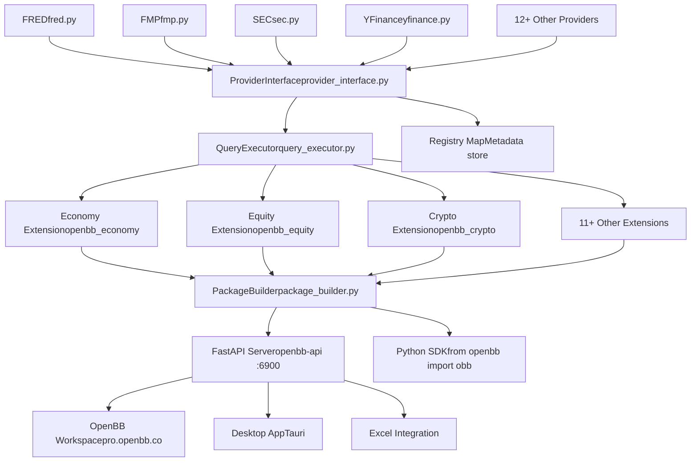
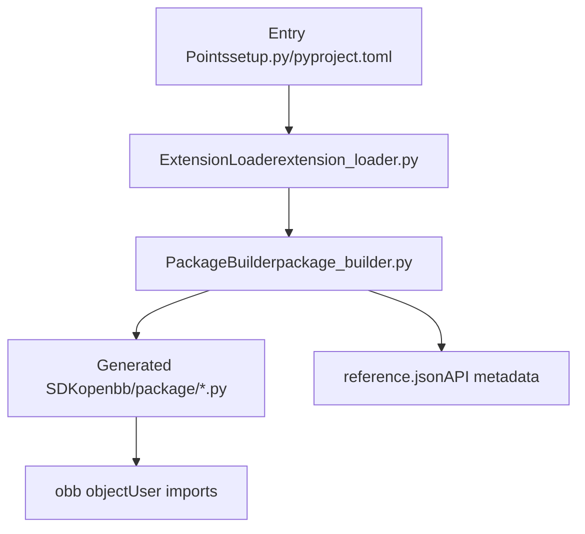
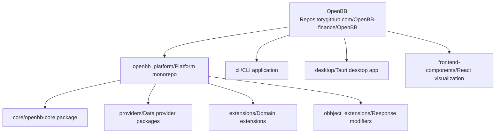

# 概述

相关源文件

-   [.pre-commit-config.yaml](https://github.com/OpenBB-finance/OpenBB/blob/dddc3b32/.pre-commit-config.yaml)
-   [README.md](https://github.com/OpenBB-finance/OpenBB/blob/dddc3b32/README.md?plain=1)
-   [cli/poetry.lock](https://github.com/OpenBB-finance/OpenBB/blob/dddc3b32/cli/poetry.lock)
-   [openbb\_platform/core/openbb/assets/reference.json](https://github.com/OpenBB-finance/OpenBB/blob/dddc3b32/openbb_platform/core/openbb/assets/reference.json)
-   [openbb\_platform/core/poetry.lock](https://github.com/OpenBB-finance/OpenBB/blob/dddc3b32/openbb_platform/core/poetry.lock)
-   [openbb\_platform/core/pyproject.toml](https://github.com/OpenBB-finance/OpenBB/blob/dddc3b32/openbb_platform/core/pyproject.toml)
-   [openbb\_platform/dev\_install.py](https://github.com/OpenBB-finance/OpenBB/blob/dddc3b32/openbb_platform/dev_install.py)
-   [openbb\_platform/extensions/devtools/poetry.lock](https://github.com/OpenBB-finance/OpenBB/blob/dddc3b32/openbb_platform/extensions/devtools/poetry.lock)
-   [openbb\_platform/extensions/devtools/pyproject.toml](https://github.com/OpenBB-finance/OpenBB/blob/dddc3b32/openbb_platform/extensions/devtools/pyproject.toml)
-   [openbb\_platform/poetry.lock](https://github.com/OpenBB-finance/OpenBB/blob/dddc3b32/openbb_platform/poetry.lock)
-   [openbb\_platform/providers/yfinance/poetry.lock](https://github.com/OpenBB-finance/OpenBB/blob/dddc3b32/openbb_platform/providers/yfinance/poetry.lock)
-   [openbb\_platform/pyproject.toml](https://github.com/OpenBB-finance/OpenBB/blob/dddc3b32/openbb_platform/pyproject.toml)

本文档介绍了 OpenBB 平台及其底层的开放数据平台 (ODP) 架构。它解释了核心的“一次连接，随处消费”设计理念，并概述了主要的系统组件及其关系。

有关安装和设置说明，请参阅 [安装与设置](/OpenBB-finance/OpenBB/1.1-installation-and-setup)。有关使用平台的快速示例，请参阅 [快速入门指南](/OpenBB-finance/OpenBB/1.2-quick-start-guide)。有关详细的架构文档，请参阅 [核心架构](/OpenBB-finance/OpenBB/2-core-architecture)。

---

## 什么是开放数据平台？

**开放数据平台 (ODP)** 是一个开源基础设施层，使数据工程师能够只需集成一次专有、授权和公共数据源，然后同时将该数据暴露给多个下游应用程序。ODP 不再为 Python 笔记本、Web 仪表板、Excel 表格和 AI 代理构建单独的数据集成，而是作为一个统一的抽象层，将数据提供商连接到消费端。

该平台基于 **“一次连接，随处消费”** 的原则运行：数据集成只需作为提供商实现一次，然后即可自动通过以下方式使用：

-   Python SDK (`openbb` 包)
-   REST API 服务器 (`openbb-api` 命令)
-   OpenBB Workspace (位于 pro.openbb.co 的企业级 UI)
-   Excel 集成
-   用于 AI 代理的 MCP 服务器
-   桌面应用程序 (基于 Tauri)

来源: [README.md1-20](https://github.com/OpenBB-finance/OpenBB/blob/dddc3b32/README.md?plain=1#L1-L20)

---

## 高层架构

OpenBB 平台由四个主要的架构层组成，这些层协同工作以实现“一次连接，随处消费”模型：

### 架构层图示


来源: [README.md18-44](https://github.com/OpenBB-finance/OpenBB/blob/dddc3b32/README.md?plain=1#L18-L44) [openbb\_platform/core/pyproject.toml1-36](https://github.com/OpenBB-finance/OpenBB/blob/dddc3b32/openbb_platform/core/pyproject.toml#L1-L36) [openbb\_platform/pyproject.toml1-118](https://github.com/OpenBB-finance/OpenBB/blob/dddc3b32/openbb_platform/pyproject.toml#L1-L118)

---

## 核心组件

### 1\. 数据集成层

平台支持 **12+ 个数据提供商**，集成了各种数据源：

| 提供商类型 | 示例 | 包位置 |
| --- | --- | --- |
| 经济数据 | FRED, Federal Reserve, OECD, IMF | `openbb_platform/providers/fred/`, `openbb_platform/providers/federal_reserve/` |
| 财务数据 | FMP, Intrinio, Benzinga, YFinance | `openbb_platform/providers/fmp/`, `openbb_platform/providers/intrinio/` |
| 监管数据 | SEC, Congress.gov | `openbb_platform/providers/sec/`, `openbb_platform/providers/congress_gov/` |
| 社区 | CBOE, TMX, Nasdaq, Alpha Vantage | `openbb_platform/providers/cboe/`, `openbb_platform/providers/tmx/` |

每个提供商都实现了一个由 [openbb\_platform/core/openbb\_core/app/provider\_interface.py](https://github.com/OpenBB-finance/OpenBB/blob/dddc3b32/openbb_platform/core/openbb_core/app/provider_interface.py) 中的 `ProviderInterface` 定义的标准接口，允许多个提供商提供相同类型的数据（例如，历史股票价格），同时保留提供商特有的功能。

来源: [openbb\_platform/pyproject.toml16-62](https://github.com/OpenBB-finance/OpenBB/blob/dddc3b32/openbb_platform/pyproject.toml#L16-L62)

### 2\. 平台核心 (`openbb-core`)

**openbb-core** 包 [openbb\_platform/core/](https://github.com/OpenBB-finance/OpenBB/blob/dddc3b32/openbb_platform/core/) 提供了基础基础设施：

-   **ProviderInterface**: 管理提供商注册和查询路由的单例协调器
-   **QueryExecutor**: 执行三阶段数据获取流水线 (transform\_query → aextract\_data → transform\_data)
-   **路由系统**: 用于生成 API 端点的装饰器和命令映射
-   **OBBject**: 带有转换方法 (`.to_dataframe()`, `.to_dict()`) 的标准响应封装器
-   **设置管理**: 通过 `SystemSettings` 和 `UserSettings` 进行系统和用户配置

核心被依赖注入到所有扩展和提供商中，确保整个平台行为的一致性。

来源: [openbb\_platform/core/pyproject.toml1-36](https://github.com/OpenBB-finance/OpenBB/blob/dddc3b32/openbb_platform/core/pyproject.toml#L1-L36)

### 3\. 扩展系统

扩展按金融领域组织平台功能：

| 扩展 | 用途 | 包 |
| --- | --- | --- |
| `openbb_economy` | 经济指标、日历、FRED 数据 | `openbb_platform/extensions/economy/` |
| `openbb_equity` | 股票价格、基本面、所有权 | `openbb_platform/extensions/equity/` |
| `openbb_crypto` | 加密货币价格和数据 | `openbb_platform/extensions/crypto/` |
| `openbb_derivatives` | 期权、期货数据 | `openbb_platform/extensions/derivatives/` |
| `openbb_etf` | ETF 持仓、价格 | `openbb_platform/extensions/etf/` |

扩展通过 Python 入口点被发现，并由 `ExtensionLoader` 加载。每个扩展注册定义了可通过 SDK 和 API 访问的命令的路由。

来源: [openbb\_platform/pyproject.toml34-66](https://github.com/OpenBB-finance/OpenBB/blob/dddc3b32/openbb_platform/pyproject.toml#L34-L66)

### 4\. 动态代码生成

**PackageBuilder** [openbb\_platform/core/openbb\_core/app/static/package\_builder.py](https://github.com/OpenBB-finance/OpenBB/blob/dddc3b32/openbb_platform/core/openbb_core/app/static/package_builder.py) 根据安装的扩展动态生成 Python SDK 代码：


当安装或删除扩展时，构建器会重新生成 SDK 模块以公开相应的命令。这实现了“插件式”架构，可以在不修改核心代码的情况下添加功能。

`AUTO_BUILD` 配置标志决定平台是否在启动时检测到扩展更改后自动重建。

来源: [openbb\_platform/core/pyproject.toml30-31](https://github.com/OpenBB-finance/OpenBB/blob/dddc3b32/openbb_platform/core/pyproject.toml#L30-L31)

---

## 关键代码实体

理解这些核心代码实体有助于导航代码库：

| 实体 | 类型 | 位置 | 用途 |
| --- | --- | --- | --- |
| `openbb_core` | 包 | `openbb_platform/core/` | 核心平台基础设施 |
| `obb` | 对象 | 动态生成 | Python SDK 用户的主要入口点 |
| `ProviderInterface` | 类 | `openbb_core/app/provider_interface.py` | 协调提供商注册和查询 |
| `Router` | 装饰器 | `openbb_core/app/router.py` | 将函数标记为 API/SDK 命令 |
| `OBBject` | 类 | `openbb_core/app/model/obbject.py` | 标准化响应容器 |
| `PackageBuilder` | 类 | `openbb_core/app/static/package_builder.py` | 从扩展生成 SDK 代码 |
| `CommandRunner` | 类 | `openbb_core/app/command_runner.py` | 执行带有验证的命令 |
| `QueryExecutor` | 类 | 提供商实现 | 三阶段数据获取模式 |

来源: [openbb\_platform/core/pyproject.toml1-36](https://github.com/OpenBB-finance/OpenBB/blob/dddc3b32/openbb_platform/core/pyproject.toml#L1-L36) [openbb\_platform/core/openbb/assets/reference.json1-15](https://github.com/OpenBB-finance/OpenBB/blob/dddc3b32/openbb_platform/core/openbb/assets/reference.json#L1-L15)

---

## 安装和基本用法

平台通过 PyPI 作为 `openbb` 包分发：

```
pip install openbb
```
对于所有提供商和扩展：

```
pip install "openbb[all]"
```
Python 中的基本用法：

```python
from openbb import obb # 获取股票历史价格（使用默认提供商）result = obb.equity.price.historical("AAPL") # 转换为 pandas DataFramedf = result.to_dataframe()
```
启动 REST API 服务器：

```
openbb-api
```
这将在 `http://127.0.0.1:6900` 启动一个带有自动生成 OpenAPI 文档的 FastAPI 服务器。

来源: [README.md28-34](https://github.com/OpenBB-finance/OpenBB/blob/dddc3b32/README.md?plain=1#L28-L34) [README.md67-79](https://github.com/OpenBB-finance/OpenBB/blob/dddc3b32/README.md?plain=1#L67-L79)

---

## 仓库结构

仓库遵循 Monorepo 结构，职责分离清晰：


| 目录 | 内容 |
| --- | --- |
| `openbb_platform/` | 平台 Monorepo 根目录 |
| `openbb_platform/core/` | 核心基础设施 (`openbb-core`) |
| `openbb_platform/providers/` | 数据提供商实现 (12+ 个提供商) |
| `openbb_platform/extensions/` | 特定领域的扩展 (经济, 股票等) |
| `openbb_platform/obbject_extensions/` | 修改 OBBject 行为的扩展 (制图) |
| `cli/` | 命令行界面应用程序 |
| `desktop/` | 基于 Tauri 的桌面应用程序 |
| `frontend-components/` | React 可视化组件 (Plotly, Table) |

来源: [openbb\_platform/pyproject.toml1-118](https://github.com/OpenBB-finance/OpenBB/blob/dddc3b32/openbb_platform/pyproject.toml#L1-L118) [README.md1-214](https://github.com/OpenBB-finance/OpenBB/blob/dddc3b32/README.md?plain=1#L1-L214)

---

## 与 OpenBB Workspace 的集成

虽然开放数据平台是完全开源且独立的，但它与 **OpenBB Workspace** 无缝集成，后者是一个用于可视化和 AI 代理的商业企业级 UI。

集成通过以下方式工作：

1.  运行本地 API 服务器 (`openbb-api` 位于 `127.0.0.1:6900`)
2.  将 OpenBB Workspace 连接到本地后端
3.  Workspace 通过 OpenAPI 规范自动发现可用命令
4.  组件系统根据 `widgets.json` 生成 UI 组件

这种架构保持了 **数据主权**（数据保留在用户的机器上），同时利用了基于云的 UI 功能。

来源: [README.md40-96](https://github.com/OpenBB-finance/OpenBB/blob/dddc3b32/README.md?plain=1#L40-L96)

---

## 开发模型

该平台使用 **Poetry** 进行依赖管理，并通过 [openbb\_platform/dev\_install.py](https://github.com/OpenBB-finance/OpenBB/blob/dddc3b32/openbb_platform/dev_install.py) 脚本支持本地开发安装。该脚本：

1.  暂时修改 `pyproject.toml` 以使用本地路径依赖
2.  使用本地包重新生成 `poetry.lock`
3.  以开发模式安装依赖项
4.  安装后恢复原始配置文件

通过以下方式强制执行质量保证：

-   **Pre-commit 钩子** [.pre-commit-config.yaml1-95](https://github.com/OpenBB-finance/OpenBB/blob/dddc3b32/.pre-commit-config.yaml#L1-L95) 运行 Black, Ruff, MyPy, Pylint
-   **GitHub Actions** 工作流进行 linting、测试和部署
-   **VCR 磁带** 用于确定性的集成测试
-   **每日构建** 采用基于日期的版本控制

来源: [openbb\_platform/dev\_install.py1-215](https://github.com/OpenBB-finance/OpenBB/blob/dddc3b32/openbb_platform/dev_install.py#L1-L215) [.pre-commit-config.yaml1-95](https://github.com/OpenBB-finance/OpenBB/blob/dddc3b32/.pre-commit-config.yaml#L1-L95)

---

## 下一步

本概述介绍了 OpenBB 平台的基本架构和组件。有关更多详细信息：

-   **安装**: 参阅 [安装与设置](/OpenBB-finance/OpenBB/1.1-installation-and-setup) 了解详细的安装选项
-   **用法示例**: 参阅 [快速入门指南](/OpenBB-finance/OpenBB/1.2-quick-start-guide) 了解常见用例
-   **架构深入解析**: 参阅 [核心架构](/OpenBB-finance/OpenBB/2-core-architecture) 了解详细的组件交互
-   **扩展开发**: 参阅 [创建扩展](/OpenBB-finance/OpenBB/6.3-creating-extensions) 了解如何构建自定义扩展
-   **提供商集成**: 参阅 [提供商架构](/OpenBB-finance/OpenBB/2.3-provider-architecture) 了解如何添加新数据源

来源: [README.md1-214](https://github.com/OpenBB-finance/OpenBB/blob/dddc3b32/README.md?plain=1#L1-L214)
