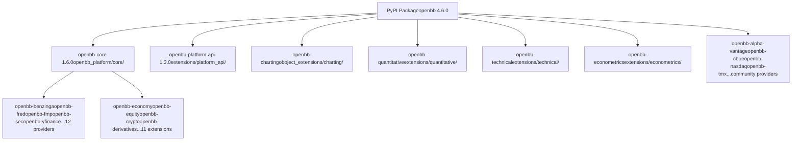
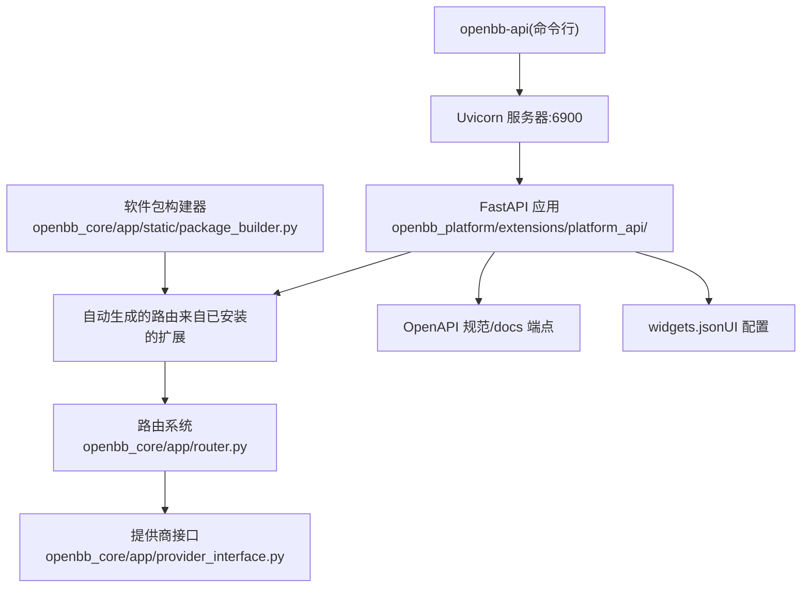
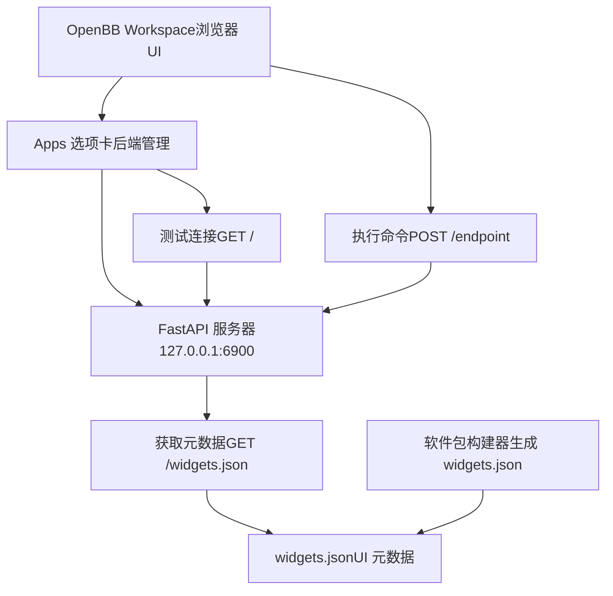
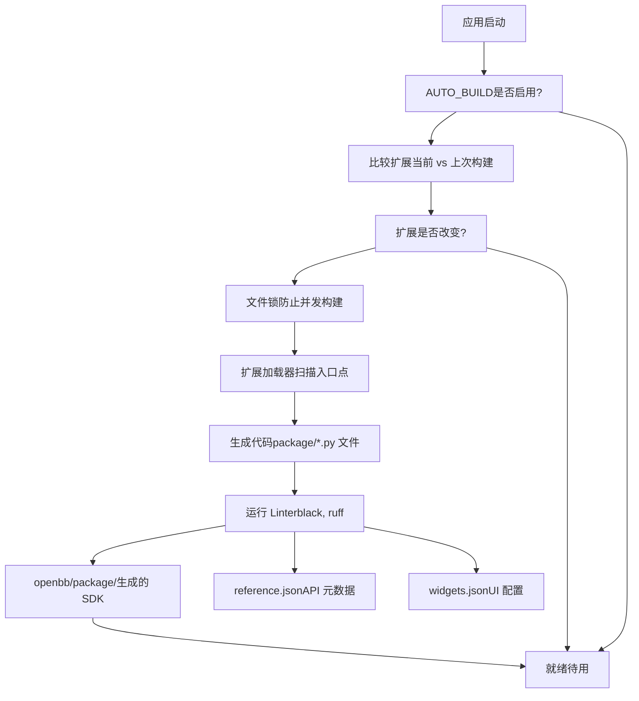
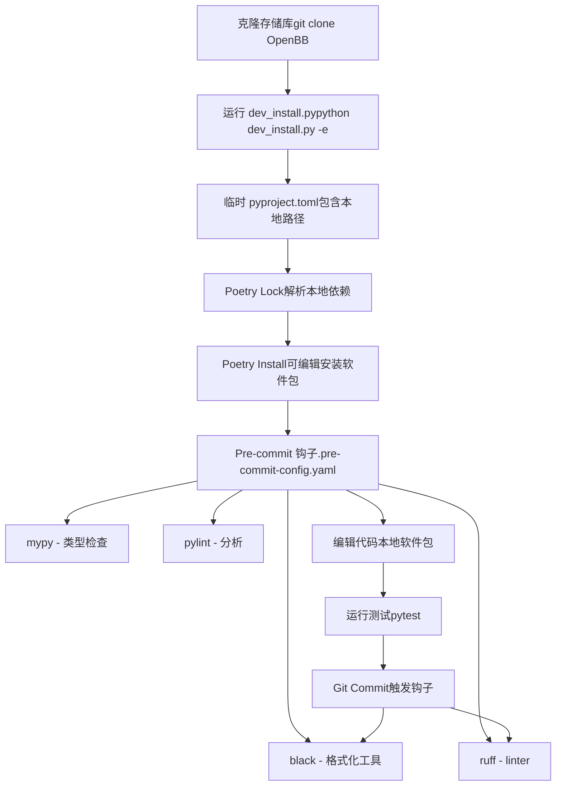

# 安装与设置

相关源文件

-   [.pre-commit-config.yaml](https://github.com/OpenBB-finance/OpenBB/blob/dddc3b32/.pre-commit-config.yaml)
-   [README.md](https://github.com/OpenBB-finance/OpenBB/blob/dddc3b32/README.md?plain=1)
-   [cli/poetry.lock](https://github.com/OpenBB-finance/OpenBB/blob/dddc3b32/cli/poetry.lock)
-   [openbb_platform/core/openbb/assets/reference.json](https://github.com/OpenBB-finance/OpenBB/blob/dddc3b32/openbb_platform/core/openbb/assets/reference.json)
-   [openbb_platform/core/poetry.lock](https://github.com/OpenBB-finance/OpenBB/blob/dddc3b32/openbb_platform/core/poetry.lock)
-   [openbb_platform/core/pyproject.toml](https://github.com/OpenBB-finance/OpenBB/blob/dddc3b32/openbb_platform/core/pyproject.toml)
-   [openbb_platform/dev_install.py](https://github.com/OpenBB-finance/OpenBB/blob/dddc3b32/openbb_platform/dev_install.py)
-   [openbb_platform/extensions/devtools/poetry.lock](https://github.com/OpenBB-finance/OpenBB/blob/dddc3b32/openbb_platform/extensions/devtools/poetry.lock)
-   [openbb_platform/extensions/devtools/pyproject.toml](https://github.com/OpenBB-finance/OpenBB/blob/dddc3b32/openbb_platform/extensions/devtools/pyproject.toml)
-   [openbb_platform/poetry.lock](https://github.com/OpenBB-finance/OpenBB/blob/dddc3b32/openbb_platform/poetry.lock)
-   [openbb_platform/providers/yfinance/poetry.lock](https://github.com/OpenBB-finance/OpenBB/blob/dddc3b32/openbb_platform/providers/yfinance/poetry.lock)
-   [openbb_platform/pyproject.toml](https://github.com/OpenBB-finance/OpenBB/blob/dddc3b32/openbb_platform/pyproject.toml)

本页涵盖了 OpenBB Platform 的安装、API 服务器的运行以及连接到 OpenBB Workspace 的方法。有关 CLI 安装的信息，请参阅 OpenBB 文档。有关构建系统和软件包生成的详细信息，请参阅 [Package Builder and Code Generation](/OpenBB-finance/OpenBB/2.4-package-builder-and-code-generation)。

---

## 安装方法

OpenBB Platform 以 Python 软件包的形式在 PyPI 上分发，可以根据您的使用场景以多种方式安装。

### 标准安装

最简单的安装包括核心平台和标准数据提供商：

```
pip install openbb
```
这将安装 `openbb` 软件包，其中包括：

-   **openbb-core** - 核心平台功能 ([openbb_platform/core/pyproject.toml1-36](https://github.com/OpenBB-finance/OpenBB/blob/dddc3b32/openbb_platform/core/pyproject.toml#L1-L36))
-   **openbb-platform-api** - FastAPI REST API 服务器 ([openbb_platform/pyproject.toml14](https://github.com/OpenBB-finance/OpenBB/blob/dddc3b32/openbb_platform/pyproject.toml#L14-L14))
-   标准提供商 (Standard providers)：benzinga, bls, cftc, econdb, federal-reserve, fmp, fred, intrinio, sec, yfinance 等 ([openbb_platform/pyproject.toml16-32](https://github.com/OpenBB-finance/OpenBB/blob/dddc3b32/openbb_platform/pyproject.toml#L16-L32))
-   标准扩展 (Standard extensions)：commodity, crypto, currency, derivatives, economy, equity, etf, fixedincome, index, news, regulators ([openbb_platform/pyproject.toml34-44](https://github.com/OpenBB-finance/OpenBB/blob/dddc3b32/openbb_platform/pyproject.toml#L34-L44))

**Python 版本要求**：Python 3.10 至 3.12 ([openbb_platform/pyproject.toml12](https://github.com/OpenBB-finance/OpenBB/blob/dddc3b32/openbb_platform/pyproject.toml#L12-L12))

### 包含扩展的安装

要安装所有可选扩展和社区提供商：

```
pip install "openbb[all]"
```
`[all]` 额外选项包括在 extras 部分定义的其他提供商和扩展 ([openbb_platform/pyproject.toml92-113](https://github.com/OpenBB-finance/OpenBB/blob/dddc3b32/openbb_platform/pyproject.toml#L92-L113))：

-   社区提供商 (Community providers)：alpha-vantage, biztoc, cboe, deribit, ecb, finra, finviz, nasdaq, tmx, tradier, wsj
-   分析扩展 (Analysis extensions)：charting, econometrics, quantitative, technical
-   MCP 服务器扩展

可以有选择地安装单个额外选项：

```
pip install "openbb[charting,quantitative]"
```
**安装架构图**


**来源**：[openbb_platform/pyproject.toml1-118](https://github.com/OpenBB-finance/OpenBB/blob/dddc3b32/openbb_platform/pyproject.toml#L1-L118) [README.md28-34](https://github.com/OpenBB-finance/OpenBB/blob/dddc3b32/README.md?plain=1#L28-L34) [README.md113-119](https://github.com/OpenBB-finance/OpenBB/blob/dddc3b32/README.md?plain=1#L113-L119)

---

## 运行 API 服务器

OpenBB Platform 包含一个基于 FastAPI 的 REST API 服务器，通过 HTTP 公开所有平台功能。

### 启动服务器

安装后，使用以下命令启动 API 服务器：

```
openbb-api
```
默认情况下，这将在 `http://127.0.0.1:6900` 启动一个 Uvicorn 服务器 ([README.md73-79](https://github.com/OpenBB-finance/OpenBB/blob/dddc3b32/README.md?plain=1#L73-L79))。

`openbb-api` 命令在 platform-api 扩展中注册为脚本入口点。服务器提供：

-   在 `http://127.0.0.1:6900/docs` 自动生成的 OpenAPI 规范
-   对所有已安装扩展和提供商的 RESTful 访问
-   用于 OpenBB Workspace 集成的组件元数据生成

### API 服务器组件


**验证**：访问 `http://127.0.0.1:6900` 以确认服务器正在运行 ([README.md79](https://github.com/OpenBB-finance/OpenBB/blob/dddc3b32/README.md?plain=1#L79-L79))。

**来源**：[README.md71-79](https://github.com/OpenBB-finance/OpenBB/blob/dddc3b32/README.md?plain=1#L71-L79) [openbb_platform/core/pyproject.toml30-31](https://github.com/OpenBB-finance/OpenBB/blob/dddc3b32/openbb_platform/core/pyproject.toml#L30-L31)

---

## 连接到 OpenBB Workspace

OpenBB Workspace ([https://pro.openbb.co](https://pro.openbb.co)) 是连接到本地 API 后端的企业级 UI，实现了“一次连接，随处消费”的架构。

### 连接设置

**步骤 1：启动本地后端**

```
pip install "openbb[all]"
openbb-api
```
服务器必须运行在 `http://127.0.0.1:6900` ([README.md66-77](https://github.com/OpenBB-finance/OpenBB/blob/dddc3b32/README.md?plain=1#L66-L77))。

**步骤 2：从 Workspace 连接**

1.  登录 OpenBB Workspace：[https://pro.openbb.co](https://pro.openbb.co)
2.  导航到“Apps”选项卡
3.  点击“Connect backend”
4.  填写连接表单：
    -   **Name**: Open Data Platform
    -   **URL**: [http://127.0.0.1:6900](http://127.0.0.1:6900)
5.  点击“Test” - 应返回“Test successful”以及找到的应用数量
6.  点击“Add”

([README.md83-94](https://github.com/OpenBB-finance/OpenBB/blob/dddc3b32/README.md?plain=1#L83-L94))

### 连接架构


**数据主权 (Data Sovereignty)**：OpenBB Workspace UI 在云端运行，但所有数据处理都在本地进行。Workspace 仅从您的本地后端接收结果 ([README.md40-53](https://github.com/OpenBB-finance/OpenBB/blob/dddc3b32/README.md?plain=1#L40-L53))。

**来源**：[README.md59-96](https://github.com/OpenBB-finance/OpenBB/blob/dddc3b32/README.md?plain=1#L59-L96) [openbb_platform/extensions/platform_api/README.md](https://github.com/OpenBB-finance/OpenBB/blob/dddc3b32/openbb_platform/extensions/platform_api/README.md?plain=1)

---

## 配置与构建系统

### 环境配置

平台使用环境变量和配置文件进行自定义。关键配置方面：

| 配置类型 | 位置 | 用途 |
| --- | --- | --- |
| 用户设置 (User Settings) | 运行时加载 | 提供商凭据、偏好设置 |
| 系统设置 (System Settings) | 运行时加载 | 日志、缓存、AUTO_BUILD |
| 提供商凭据 (Provider Credentials) | 用户特定 | 数据提供商的 API 密钥 |

### AUTO_BUILD 设置

平台包含一个自动重建系统，用于检测已安装扩展的变化：

-   **AUTO_BUILD=true** (默认)：启动时，将已安装的扩展与上一次构建进行比较，如果检测到变化则触发重建。
-   **AUTO_BUILD=false**：跳过自动重建，需要手动执行 `openbb-build` 命令。

构建过程由 `PackageBuilder` 类管理 ([openbb_platform/core/openbb_core/app/static/package_builder.py](https://github.com/OpenBB-finance/OpenBB/blob/dddc3b32/openbb_platform/core/openbb_core/app/static/package_builder.py))，该类根据已安装的扩展动态生成 Python SDK 模块。

**构建过程图**


**来源**：[openbb_platform/core/openbb_core/app/static/package_builder.py](https://github.com/OpenBB-finance/OpenBB/blob/dddc3b32/openbb_platform/core/openbb_core/app/static/package_builder.py) [openbb_platform/core/pyproject.toml30-31](https://github.com/OpenBB-finance/OpenBB/blob/dddc3b32/openbb_platform/core/pyproject.toml#L30-L31)

---

## 开发设置

对于开发 OpenBB Platform 本身的贡献者，提供了一个开发安装脚本。

### 开发安装脚本

`dev_install.py` 脚本将平台配置为使用本地路径依赖项，而不是 PyPI 软件包 ([openbb_platform/dev_install.py1-215](https://github.com/OpenBB-finance/OpenBB/blob/dddc3b32/openbb_platform/dev_install.py#L1-L215))：

```
python dev_install.py
```
**选项**：

-   `-e` 或 `--extras`：安装所有软件包的所有开发依赖项
-   `-c` 或 `--cli`：同时设置 CLI 进行开发

### 脚本的功能

**开发依赖表**

| 组件 | 类型 | 路径 | 用途 |
| --- | --- | --- | --- |
| openbb-core | 核心 | `./core` | 平台核心，develop=true |
| openbb-platform-api | 扩展 | `./extensions/platform_api` | API 服务器 |
| openbb-devtools | 扩展 | `./extensions/devtools` | 开发工具 (pytest, ruff, mypy) |
| 标准提供商 | 提供商 | `./providers/*` | 15+ 提供商作为本地路径 |
| 标准扩展 | 扩展 | `./extensions/*` | 11+ 扩展作为本地路径 |
| 可选提供商 | 提供商 | `./providers/*` | 社区提供商 |
| 可选扩展 | 扩展 | `./extensions/*` | 分析扩展 |

该脚本 ([openbb_platform/dev_install.py113-165](https://github.com/OpenBB-finance/OpenBB/blob/dddc3b32/openbb_platform/dev_install.py#L113-L165))：

1.  **备份原始文件**：保存 `pyproject.toml` 和 `poetry.lock`
2.  **注入本地依赖项**：用本地路径替换 PyPI 依赖项 ([openbb_platform/dev_install.py18-77](https://github.com/OpenBB-finance/OpenBB/blob/dddc3b32/openbb_platform/dev_install.py#L18-L77))
3.  **聚合开发依赖项**：收集所有软件包的开发依赖项 ([openbb_platform/dev_install.py102-110](https://github.com/OpenBB-finance/OpenBB/blob/dddc3b32/openbb_platform/dev_install.py#L102-L110))
4.  **运行 poetry**：执行 `poetry lock --regenerate` 和 `poetry install`
5.  **恢复原始文件**：安装后将文件恢复到原始状态 ([openbb_platform/dev_install.py158-164](https://github.com/OpenBB-finance/OpenBB/blob/dddc3b32/openbb_platform/dev_install.py#L158-L164))

### 开发依赖项

devtools 扩展提供了所有开发工具 ([openbb_platform/extensions/devtools/pyproject.toml11-30](https://github.com/OpenBB-finance/OpenBB/blob/dddc3b32/openbb_platform/extensions/devtools/pyproject.toml#L11-L30))：

**代码检查与格式化 (Linting & Formatting)**：

-   `ruff` - 快速 Python linter ([.pre-commit-config.yaml17-20](https://github.com/OpenBB-finance/OpenBB/blob/dddc3b32/.pre-commit-config.yaml#L17-L20))
-   `black` - 代码格式化工具 ([.pre-commit-config.yaml13-16](https://github.com/OpenBB-finance/OpenBB/blob/dddc3b32/.pre-commit-config.yaml#L13-L16))
-   `pylint` - 全面的 linter
-   `mypy` - 类型检查 ([.pre-commit-config.yaml45-57](https://github.com/OpenBB-finance/OpenBB/blob/dddc3b32/.pre-commit-config.yaml#L45-L57))
-   `pydocstyle` - Docstring 规范 ([.pre-commit-config.yaml21-32](https://github.com/OpenBB-finance/OpenBB/blob/dddc3b32/.pre-commit-config.yaml#L21-L32))

**测试**：

-   `pytest` - 测试框架
-   `pytest-recorder` - VCR 磁带录制
-   `pytest-asyncio` - 异步测试支持
-   `pytest-cov` - 覆盖率报告

**Pre-commit 集成**：所有质量检查都通过 pre-commit 钩子强制执行 ([.pre-commit-config.yaml1-95](https://github.com/OpenBB-finance/OpenBB/blob/dddc3b32/.pre-commit-config.yaml#L1-L95))：

```
pre-commit install
```
### 开发工作流图


**来源**：[openbb_platform/dev_install.py1-215](https://github.com/OpenBB-finance/OpenBB/blob/dddc3b32/openbb_platform/dev_install.py#L1-L215) [openbb_platform/extensions/devtools/pyproject.toml1-36](https://github.com/OpenBB-finance/OpenBB/blob/dddc3b32/openbb_platform/extensions/devtools/pyproject.toml#L1-L36) [.pre-commit-config.yaml1-95](https://github.com/OpenBB-finance/OpenBB/blob/dddc3b32/.pre-commit-config.yaml#L1-L95)

---

## 验证与故障排除

### 验证安装

**Python SDK**：

```
from openbb import obb
output = obb.equity.price.historical("AAPL")
df = output.to_dataframe()
print(df.head())
```
**API 服务器**：

```
curl http://127.0.0.1:6900/
```
**Workspace 连接**：

1.  Workspace 测试应返回成功消息
2.  检查组件是否出现在“Apps”选项卡中
3.  尝试从 Workspace UI 执行命令

### 常见问题

| 问题 | 原因 | 解决方案 |
| --- | --- | --- |
| Python 版本错误 | Python < 3.10 或 >= 4.0 | 安装 Python 3.10-3.12 |
| 导入错误 | 缺少依赖项 | 运行 `pip install "openbb[all]"` |
| API 服务器无法启动 | 端口 6900 被占用 | 使用不同端口或终止现有进程 |
| Workspace 无法连接 | 服务器未运行 | 验证 `openbb-api` 是否运行在 :6900 |
| 开发环境构建失败 | lock 文件损坏 | 删除 poetry.lock 并重新运行 dev_install.py |

### 构建命令

用于不启动应用程序的情况下手动重新构建软件包：

```
openbb-build
```
该命令由 openbb-core 注册 ([openbb_platform/core/pyproject.toml30-31](https://github.com/OpenBB-finance/OpenBB/blob/dddc3b32/openbb_platform/core/pyproject.toml#L30-L31))，并直接触发 PackageBuilder。

**来源**：[README.md28-34](https://github.com/OpenBB-finance/OpenBB/blob/dddc3b32/README.md?plain=1#L28-L34) [README.md73-79](https://github.com/OpenBB-finance/OpenBB/blob/dddc3b32/README.md?plain=1#L73-L79) [README.md83-94](https://github.com/OpenBB-finance/OpenBB/blob/dddc3b32/README.md?plain=1#L83-L94) [openbb_platform/core/pyproject.toml30-31](https://github.com/OpenBB-finance/OpenBB/blob/dddc3b32/openbb_platform/core/pyproject.toml#L30-L31)
