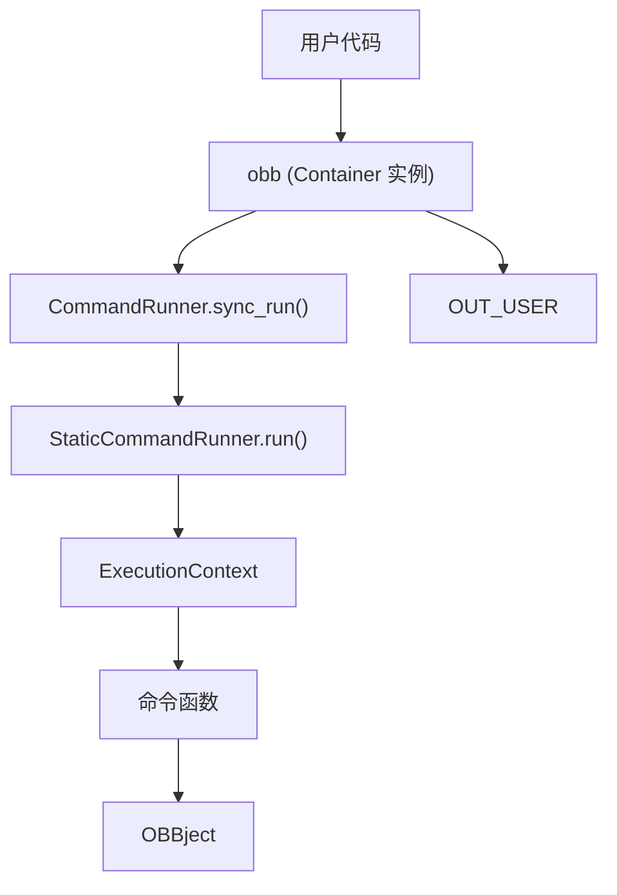
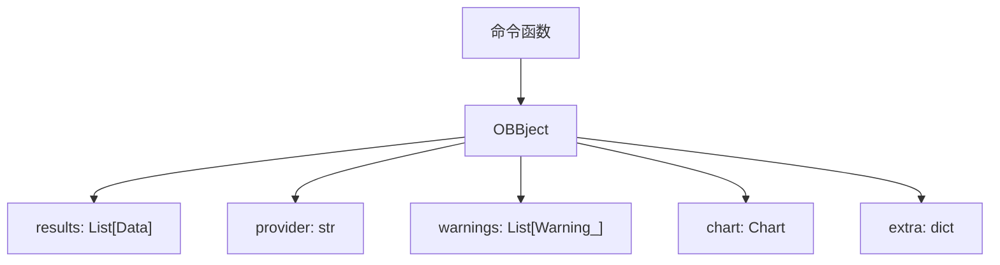
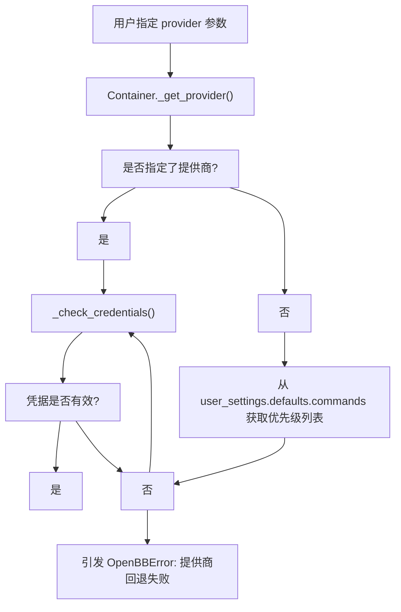
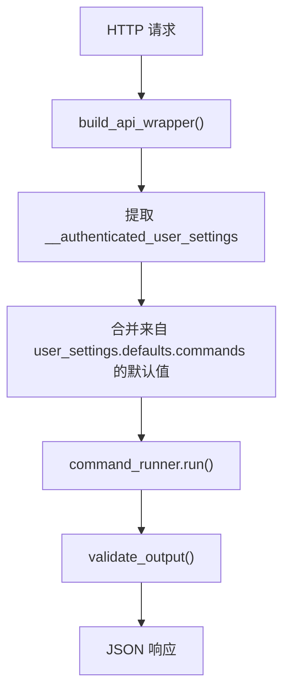
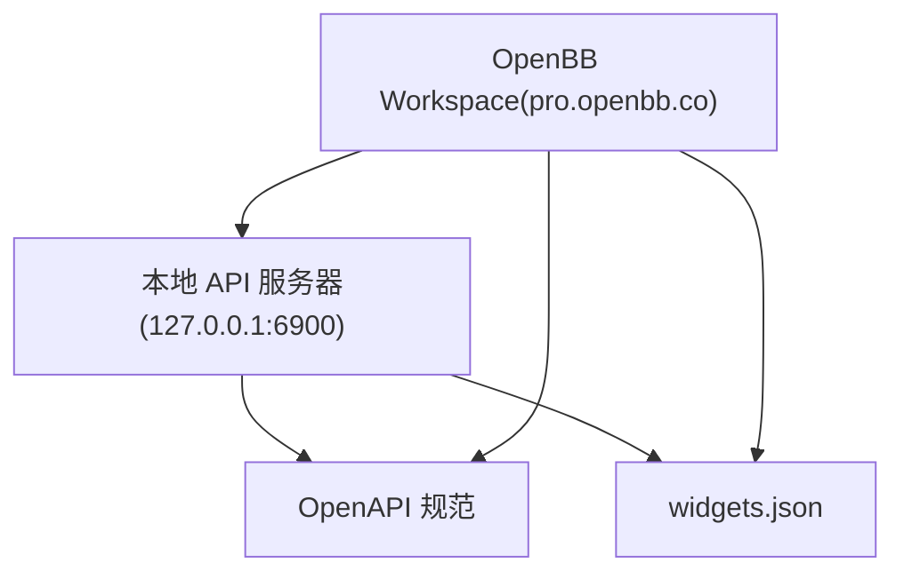

# 快速入门指南

相关源文件

-   [.pre-commit-config.yaml](https://github.com/OpenBB-finance/OpenBB/blob/dddc3b32/.pre-commit-config.yaml)
-   [README.md](https://github.com/OpenBB-finance/OpenBB/blob/dddc3b32/README.md?plain=1)
-   [frontend-components/plotly/src/data/mockup.ts](https://github.com/OpenBB-finance/OpenBB/blob/dddc3b32/frontend-components/plotly/src/data/mockup.ts)
-   [openbb_platform/core/openbb_core/api/router/commands.py](https://github.com/OpenBB-finance/OpenBB/blob/dddc3b32/openbb_platform/core/openbb_core/api/router/commands.py)
-   [openbb_platform/core/openbb_core/app/command_runner.py](https://github.com/OpenBB-finance/OpenBB/blob/dddc3b32/openbb_platform/core/openbb_core/app/command_runner.py)
-   [openbb_platform/core/openbb_core/app/extension_loader.py](https://github.com/OpenBB-finance/OpenBB/blob/dddc3b32/openbb_platform/core/openbb_core/app/extension_loader.py)
-   [openbb_platform/core/openbb_core/app/logs/handlers_manager.py](https://github.com/OpenBB-finance/OpenBB/blob/dddc3b32/openbb_platform/core/openbb_core/app/logs/handlers_manager.py)
-   [openbb_platform/core/openbb_core/app/logs/logging_service.py](https://github.com/OpenBB-finance/OpenBB/blob/dddc3b32/openbb_platform/core/openbb_core/app/logs/logging_service.py)
-   [openbb_platform/core/openbb_core/app/logs/models/logging_settings.py](https://github.com/OpenBB-finance/OpenBB/blob/dddc3b32/openbb_platform/core/openbb_core/app/logs/models/logging_settings.py)
-   [openbb_platform/core/openbb_core/app/model/abstract/tagged.py](https://github.com/OpenBB-finance/OpenBB/blob/dddc3b32/openbb_platform/core/openbb_core/app/model/abstract/tagged.py)
-   [openbb_platform/core/openbb_core/app/model/charts/charting_settings.py](https://github.com/OpenBB-finance/OpenBB/blob/dddc3b32/openbb_platform/core/openbb_core/app/model/charts/charting_settings.py)
-   [openbb_platform/core/openbb_core/app/model/defaults.py](https://github.com/OpenBB-finance/OpenBB/blob/dddc3b32/openbb_platform/core/openbb_core/app/model/defaults.py)
-   [openbb_platform/core/openbb_core/app/model/extension.py](https://github.com/OpenBB-finance/OpenBB/blob/dddc3b32/openbb_platform/core/openbb_core/app/model/extension.py)
-   [openbb_platform/core/openbb_core/app/model/obbject.py](https://github.com/OpenBB-finance/OpenBB/blob/dddc3b32/openbb_platform/core/openbb_core/app/model/obbject.py)
-   [openbb_platform/core/openbb_core/app/model/system_settings.py](https://github.com/OpenBB-finance/OpenBB/blob/dddc3b32/openbb_platform/core/openbb_core/app/model/system_settings.py)
-   [openbb_platform/core/openbb_core/app/service/system_service.py](https://github.com/OpenBB-finance/OpenBB/blob/dddc3b32/openbb_platform/core/openbb_core/app/service/system_service.py)
-   [openbb_platform/core/openbb_core/app/static/container.py](https://github.com/OpenBB-finance/OpenBB/blob/dddc3b32/openbb_platform/core/openbb_core/app/static/container.py)
-   [openbb_platform/core/openbb_core/env.py](https://github.com/OpenBB-finance/OpenBB/blob/dddc3b32/openbb_platform/core/openbb_core/env.py)
-   [openbb_platform/core/tests/app/logs/test_handlers_manager.py](https://github.com/OpenBB-finance/OpenBB/blob/dddc3b32/openbb_platform/core/tests/app/logs/test_handlers_manager.py)
-   [openbb_platform/core/tests/app/logs/test_logging_service.py](https://github.com/OpenBB-finance/OpenBB/blob/dddc3b32/openbb_platform/core/tests/app/logs/test_logging_service.py)
-   [openbb_platform/core/tests/app/model/test_extension.py](https://github.com/OpenBB-finance/OpenBB/blob/dddc3b32/openbb_platform/core/tests/app/model/test_extension.py)
-   [openbb_platform/core/tests/app/model/test_obbject.py](https://github.com/OpenBB-finance/OpenBB/blob/dddc3b32/openbb_platform/core/tests/app/model/test_obbject.py)
-   [openbb_platform/core/tests/app/model/test_system_settings.py](https://github.com/OpenBB-finance/OpenBB/blob/dddc3b32/openbb_platform/core/tests/app/model/test_system_settings.py)
-   [openbb_platform/core/tests/app/test_command_runner.py](https://github.com/OpenBB-finance/OpenBB/blob/dddc3b32/openbb_platform/core/tests/app/test_command_runner.py)
-   [openbb_platform/obbject_extensions/charting/openbb_charting/charts/helpers.py](https://github.com/OpenBB-finance/OpenBB/blob/dddc3b32/openbb_platform/obbject_extensions/charting/openbb_charting/charts/helpers.py)

本指南提供了 OpenBB Platform 常见使用场景的快速示例。它涵盖了基本的 Python SDK 用法、如何使用数据提供商、运行 API 服务器以及连接到 OpenBB Workspace。有关底层架构和命令执行流程的详细信息，请参阅 [Command Execution Pipeline](/OpenBB-finance/OpenBB/2.1-command-execution-pipeline)。有关提供商特定的配置，请参阅 [Provider Interface and Integration](/OpenBB-finance/OpenBB/4.1-provider-interface-and-integration)。有关完整的安装说明和开发设置，请参阅 [Installation and Setup](/OpenBB-finance/OpenBB/1.1-installation-and-setup)。

---

## 安装

从 PyPI 安装 OpenBB Platform Python 软件包：

```
pip install openbb
```
如需安装所有可用的提供商和扩展：

```
pip install "openbb[all]"
```
软件包安装过程会触发 `PackageBuilder` 根据已安装的扩展动态生成 Python SDK 接口 ([openbb_platform/core/openbb_core/app/static/package_builder.py1-500](https://github.com/OpenBB-finance/OpenBB/blob/dddc3b32/openbb_platform/core/openbb_core/app/static/package_builder.py#L1-L500))。

**来源：** [README.md113-119](https://github.com/OpenBB-finance/OpenBB/blob/dddc3b32/README.md?plain=1#L113-L119) [openbb_platform/core/openbb_core/app/static/package_builder.py](https://github.com/OpenBB-finance/OpenBB/blob/dddc3b32/openbb_platform/core/openbb_core/app/static/package_builder.py)

---

## 基本 Python 用法

### 导入并运行命令

主要的入口点是 `obb` 对象，它提供了对所有平台功能的访问：

```
from openbb import obb
# 获取股票历史价格数据
output = obb.equity.price.historical("AAPL")
```
`obb` 对象是一个 `Container` 实例，它封装了 `CommandRunner` ([openbb_platform/core/openbb_core/app/static/container.py11-22](https://github.com/OpenBB-finance/OpenBB/blob/dddc3b32/openbb_platform/core/openbb_core/app/static/container.py#L11-L22))。当您调用类似 `obb.equity.price.historical()` 的方法时，`Container._run()` 方法 ([openbb_platform/core/openbb_core/app/static/container.py23-58](https://github.com/OpenBB-finance/OpenBB/blob/dddc3b32/openbb_platform/core/openbb_core/app/static/container.py#L23-L58)) 会通过 `CommandRunner.sync_run()` 方法执行命令 ([openbb_platform/core/openbb_core/app/command_runner.py713-722](https://github.com/OpenBB-finance/OpenBB/blob/dddc3b32/openbb_platform/core/openbb_core/app/command_runner.py#L713-L722))。


**来源：** [README.md30-34](https://github.com/OpenBB-finance/OpenBB/blob/dddc3b32/README.md?plain=1#L30-L34) [openbb_platform/core/openbb_core/app/static/container.py11-58](https://github.com/OpenBB-finance/OpenBB/blob/dddc3b32/openbb_platform/core/openbb_core/app/static/container.py#L11-L58) [openbb_platform/core/openbb_core/app/command_runner.py642-722](https://github.com/OpenBB-finance/OpenBB/blob/dddc3b32/openbb_platform/core/openbb_core/app/command_runner.py#L642-L722)

### 理解 OBBject

所有命令都返回一个 `OBBject` 实例，它封装了结果并提供元数据：

```
output = obb.equity.price.historical("AAPL")
# OBBject 结构
print(output.results)    # 原始数据 (List[Data] 或类似格式)
print(output.provider)   # 使用的提供商 (例如 'yfinance')
print(output.warnings)   # 生成的所有警告
print(output.chart)      # 图表对象 (如果安装了图表扩展)
print(output.extra)      # 额外元数据
```
`OBBject` 类在 [openbb_platform/core/openbb_core/app/model/obbject.py36-383](https://github.com/OpenBB-finance/OpenBB/blob/dddc3b32/openbb_platform/core/openbb_core/app/model/obbject.py#L36-L383) 中定义。关键属性包括：

| 属性 | 类型 | 描述 |
| --- | --- | --- |
| `results` | `T | None` | 可序列化的结果数据 |
| `provider` | `str | None` | 用于查询的提供商名称 |
| `warnings` | `list[Warning_] | None` | 执行过程中生成的警告列表 |
| `chart` | `Chart | None` | 如果有可视化可用，则为图表对象 |
| `extra` | `dict[str, Any]` | 包含执行信息在内的额外元数据 |


**来源：** [openbb_platform/core/openbb_core/app/model/obbject.py36-72](https://github.com/OpenBB-finance/OpenBB/blob/dddc3b32/openbb_platform/core/openbb_core/app/model/obbject.py#L36-L72) [openbb_platform/core/tests/app/model/test_obbject.py13-28](https://github.com/OpenBB-finance/OpenBB/blob/dddc3b32/openbb_platform/core/tests/app/model/test_obbject.py#L13-L28)

### 转换输出

`OBBject` 提供了多种转换方法：

```
# 转换为 pandas DataFrame
df = output.to_dataframe()
# 或者
df = output.to_df()
# 转换为字典
data_dict = output.to_dict(orient='records')
# 转换为 polars DataFrame
polars_df = output.to_polars()
# 转换为 numpy 数组
array = output.to_numpy()
```
`to_dataframe()` 方法 ([openbb_platform/core/openbb_core/app/model/obbject.py121-285](https://github.com/OpenBB-finance/OpenBB/blob/dddc3b32/openbb_platform/core/openbb_core/app/model/obbject.py#L121-L285)) 处理多种输入格式：

-   `List[BaseModel]`
-   `List[Dict]`
-   `Dict[str, List]`
-   `Dict[str, Dict]`
-   单个 `BaseModel` 实例

```
# 使用可选参数
df = output.to_dataframe(
    index="date",        # 设置索引列
    sort_by="value",     # 按列排序
    ascending=True       # 排序顺序
)
```
转换逻辑对 Pydantic 模型使用 `basemodel_to_df()` 工具 ([openbb_platform/core/openbb_core/app/utils.py](https://github.com/OpenBB-finance/OpenBB/blob/dddc3b32/openbb_platform/core/openbb_core/app/utils.py))，并正确处理时区感知 (timezone-aware) 的 datetime 对象 ([openbb_platform/core/tests/app/model/test_obbject.py269-292](https://github.com/OpenBB-finance/OpenBB/blob/dddc3b32/openbb_platform/core/tests/app/model/test_obbject.py#L269-L292))。

**来源：** [openbb_platform/core/openbb_core/app/model/obbject.py81-336](https://github.com/OpenBB-finance/OpenBB/blob/dddc3b32/openbb_platform/core/openbb_core/app/model/obbject.py#L81-L336) [openbb_platform/core/tests/app/model/test_obbject.py59-267](https://github.com/OpenBB-finance/OpenBB/blob/dddc3b32/openbb_platform/core/tests/app/model/test_obbject.py#L59-L267)

---

## 使用提供商

### 指定提供商

许多命令支持多个数据提供商。使用 `provider` 参数指定提供商：

```
# 使用 Financial Modeling Prep
output = obb.equity.price.historical("AAPL", provider="fmp")
# 使用 Intrinio
output = obb.equity.price.historical("AAPL", provider="intrinio")
```
提供商选择由 `Container._get_provider()` ([openbb_platform/core/openbb_core/app/static/container.py68-114](https://github.com/OpenBB-finance/OpenBB/blob/dddc3b32/openbb_platform/core/openbb_core/app/static/container.py#L68-L114)) 处理，该方法：

1.  检查是否指定了提供商
2.  如果没有指定，则回退到用户设置中配置的优先级列表
3.  验证优先级列表中每个提供商的凭据
4.  返回第一个具有有效凭据的提供商


### 提供商特定参数

每个提供商可能有特定的参数。这些参数作为额外的关键字参数传递：

```
# FMP 特定参数
output = obb.equity.price.historical(
    "AAPL",
    provider="fmp",
    interval="1d"  # FMP 特定的间隔格式
)
```
提供商特定参数由 `ParametersBuilder.validate_kwargs()` 方法验证 ([openbb_platform/core/openbb_core/app/command_runner.py181-206](https://github.com/OpenBB-finance/OpenBB/blob/dddc3b32/openbb_platform/core/openbb_core/app/command_runner.py#L181-L206))。无效参数会生成 `OpenBBWarning` ([openbb_platform/core/openbb_core/app/command_runner.py146-169](https://github.com/OpenBB-finance/OpenBB/blob/dddc3b32/openbb_platform/core/openbb_core/app/command_runner.py#L146-L169))。

**来源：** [openbb_platform/core/openbb_core/app/static/container.py60-114](https://github.com/OpenBB-finance/OpenBB/blob/dddc3b32/openbb_platform/core/openbb_core/app/static/container.py#L60-L114) [openbb_platform/core/openbb_core/app/command_runner.py146-236](https://github.com/OpenBB-finance/OpenBB/blob/dddc3b32/openbb_platform/core/openbb_core/app/command_runner.py#L146-L236) [README.md36](https://github.com/OpenBB-finance/OpenBB/blob/dddc3b32/README.md?plain=1#L36-L36)

---

## 运行 API 服务器

### 启动服务器

使用 `openbb-api` 命令启动 FastAPI 服务器：

```
openbb-api
```
这将启动一个位于 `http://127.0.0.1:6900` 的 Uvicorn 服务器 ([README.md73-77](https://github.com/OpenBB-finance/OpenBB/blob/dddc3b32/README.md?plain=1#L73-L77))。

API 服务器在 [openbb_platform/core/openbb_core/api/router/commands.py354-356](https://github.com/OpenBB-finance/OpenBB/blob/dddc3b32/openbb_platform/core/openbb_core/api/router/commands.py#L354-L356) 中初始化：

```
system_settings = SystemService(logging_sub_app="api").system_settings
command_runner_instance = CommandRunner(system_settings=system_settings)
add_command_map(command_runner=command_runner_instance, api_router=router)
```
### API 端点

API 会自动为所有已安装的命令生成端点。例如：

```
# 使用 curl 获取股票价格的 GET 请求
curl "http://127.0.0.1:6900/equity/price/historical?symbol=AAPL&provider=yfinance"
```
每个端点都由 `build_api_wrapper()` 封装 ([openbb_platform/core/openbb_core/api/router/commands.py212-342](https://github.com/OpenBB-finance/OpenBB/blob/dddc3b32/openbb_platform/core/openbb_core/api/router/commands.py#L212-L342))，该方法：

1.  从身份验证标头中提取用户设置
2.  将用户设置中的命令默认值合并
3.  通过 `CommandRunner.run()` 执行命令
4.  验证并序列化 `OBBject` 输出


**来源：** [README.md73-79](https://github.com/OpenBB-finance/OpenBB/blob/dddc3b32/README.md?plain=1#L73-L79) [openbb_platform/core/openbb_core/api/router/commands.py212-356](https://github.com/OpenBB-finance/OpenBB/blob/dddc3b32/openbb_platform/core/openbb_core/api/router/commands.py#L212-L356) [openbb_platform/extensions/platform_api/README.md](https://github.com/OpenBB-finance/OpenBB/blob/dddc3b32/openbb_platform/extensions/platform_api/README.md?plain=1)

### 检查服务器

验证服务器是否正在运行：

```
curl http://127.0.0.1:6900
```
OpenAPI 文档会自动生成，可通过 `http://127.0.0.1:6900/docs` 访问。

**来源：** [README.md79](https://github.com/OpenBB-finance/OpenBB/blob/dddc3b32/README.md?plain=1#L79-L79)

---

## 连接到 OpenBB Workspace

### 后端集成

OpenBB Workspace 连接到您的本地 API 服务器以访问数据：

1.  **启动 API 服务器：**

```
openbb-api
```
2.  **访问 OpenBB Workspace：**

导航至 [https://pro.openbb.co](https://pro.openbb.co)

3.  **连接后端：**

-   转到“Apps”选项卡
-   点击“Connect backend”
-   填写表单：
    -   **Name:** Open Data Platform
    -   **URL:** `http://127.0.0.1:6900`
-   点击“Test”以验证连接
-   点击“Add”保存


Workspace 从 API 服务器获取 `widgets.json`，该文件为每个端点定义了 UI 组件。此文件是由组件生成系统根据 OpenAPI 规范生成的 ([openbb_platform/extensions/platform_api/README.md](https://github.com/OpenBB-finance/OpenBB/blob/dddc3b32/openbb_platform/extensions/platform_api/README.md?plain=1))。

**来源：** [README.md59-96](https://github.com/OpenBB-finance/OpenBB/blob/dddc3b32/README.md?plain=1#L59-L96) [openbb_platform/extensions/platform_api/README.md](https://github.com/OpenBB-finance/OpenBB/blob/dddc3b32/openbb_platform/extensions/platform_api/README.md?plain=1)

### 数据主权

这种架构维护了数据主权：您的数据查询在本地计算机上执行，只有结果显示在基于云的 Workspace UI 中。API 服务器绝不会将凭据或原始查询发送给 Workspace。

**来源：** [README.md42-50](https://github.com/OpenBB-finance/OpenBB/blob/dddc3b32/README.md?plain=1#L42-L50)

---

## 配置与设置

### 用户设置 (User Settings)

在 `~/.openbb_platform/user_settings.json` 中配置默认提供商、输出格式和凭据：

```
{
  "credentials": {
    "fmp_api_key": "your_api_key"
  },
  "preferences": {
    "output_type": "OBBject",
    "show_warnings": true
  },
  "defaults": {
    "commands": {
      "equity.price.historical": {
        "provider": ["fmp", "yfinance"]
      }
    }
  }
}
```
`UserSettings` 模型 ([openbb_platform/core/openbb_core/app/model/user_settings.py](https://github.com/OpenBB-finance/OpenBB/blob/dddc3b32/openbb_platform/core/openbb_core/app/model/user_settings.py)) 由 `UserService.read_from_file()` 加载，并用于整个命令执行过程。

### 系统设置 (System Settings)

系统级设置存储在 `~/.openbb_platform/system_settings.json` 中，并由 `SystemSettings` 管理 ([openbb_platform/core/openbb_core/app/model/system_settings.py22-105](https://github.com/OpenBB-finance/OpenBB/blob/dddc3b32/openbb_platform/core/openbb_core/app/model/system_settings.py#L22-L105))：

```
{
  "test_mode": false,
  "debug_mode": false,
  "logging_suppress": true,
  "allow_mutable_extensions": false,
  "allow_on_command_output": false
}
```
这些设置控制日志行为、扩展权限和系统范围的配置。

**来源：** [openbb_platform/core/openbb_core/app/model/system_settings.py22-105](https://github.com/OpenBB-finance/OpenBB/blob/dddc3b32/openbb_platform/core/openbb_core/app/model/system_settings.py#L22-L105) [openbb_platform/core/openbb_core/app/service/system_service.py1-110](https://github.com/OpenBB-finance/OpenBB/blob/dddc3b32/openbb_platform/core/openbb_core/app/service/system_service.py#L1-L110) [openbb_platform/core/openbb_core/app/constants.py](https://github.com/OpenBB-finance/OpenBB/blob/dddc3b32/openbb_platform/core/openbb_core/app/constants.py)

---

## 快速参考：常用命令

```
from openbb import obb
# 股票价格数据
prices = obb.equity.price.historical("AAPL", start_date="2024-01-01")
# 公司基本面
income = obb.equity.fundamental.income("AAPL", provider="fmp")
# 经济数据
gdp = obb.economy.gdp.real(provider="fred")
# 转换为 DataFrame
df = prices.to_dataframe()
# 访问特定字段
print(prices.provider)
print(prices.warnings)
```
### 输出类型控制

通过用户设置或以编程方式控制默认输出类型：

```
# 在代码中设置输出类型 (影响后续所有命令)
obb._command_runner.user_settings.preferences.output_type = "dataframe"
# 现在命令直接返回 DataFrame
df = obb.equity.price.historical("AAPL")
```
`Container._run()` 方法会检查 `output_type` 偏好设置 ([openbb_platform/core/openbb_core/app/static/container.py53-58](https://github.com/OpenBB-finance/OpenBB/blob/dddc3b32/openbb_platform/core/openbb_core/app/static/container.py#L53-L58))，并使用 `to_dataframe()`、`to_dict()` 等方法将 `OBBject` 自动转换为所需的格式。

**来源：** [openbb_platform/core/openbb_core/app/static/container.py23-58](https://github.com/OpenBB-finance/OpenBB/blob/dddc3b32/openbb_platform/core/openbb_core/app/static/container.py#L23-L58) [openbb_platform/core/openbb_core/app/model/obbject.py81-336](https://github.com/OpenBB-finance/OpenBB/blob/dddc3b32/openbb_platform/core/openbb_core/app/model/obbject.py#L81-L336)

---

## 后续步骤

-   有关详细的架构信息，请参阅 [Core Architecture](/OpenBB-finance/OpenBB/2-core-architecture)
-   要了解命令是如何执行的，请参阅 [Command Execution Pipeline](/OpenBB-finance/OpenBB/2.1-command-execution-pipeline)
-   要了解如何创建自定义扩展，请参阅 [Creating Extensions](/OpenBB-finance/OpenBB/6.3-creating-extensions)
-   有关提供商特定的文档，请参阅 [Data Providers](/OpenBB-finance/OpenBB/4-data-providers)
-   要探索用于 Workspace 集成的组件系统，请参阅 [Widget System](/OpenBB-finance/OpenBB/5.4-widget-system)
