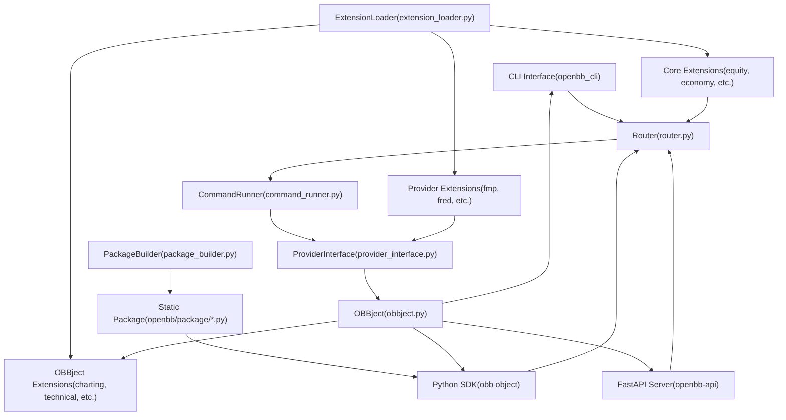
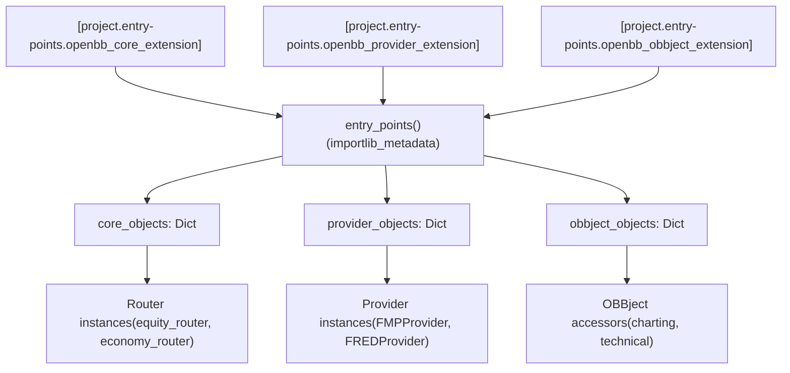
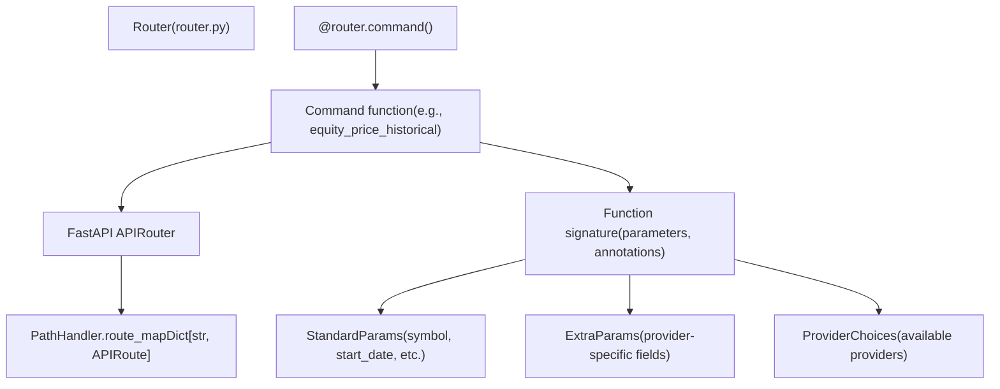
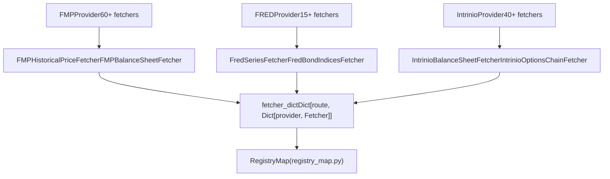
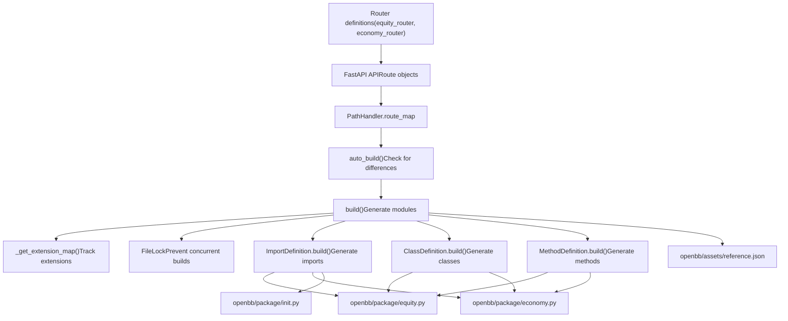

# 架构

相关源文件

-   [.pre-commit-config.yaml](https://github.com/OpenBB-finance/OpenBB/blob/dddc3b32/.pre-commit-config.yaml)
-   [README.md](https://github.com/OpenBB-finance/OpenBB/blob/dddc3b32/README.md?plain=1)
-   [cli/poetry.lock](https://github.com/OpenBB-finance/OpenBB/blob/dddc3b32/cli/poetry.lock)
-   [cli/tests/test\_argparse\_translator\_obbject\_registry.py](https://github.com/OpenBB-finance/OpenBB/blob/dddc3b32/cli/tests/test_argparse_translator_obbject_registry.py)
-   [openbb\_platform/core/openbb/assets/reference.json](https://github.com/OpenBB-finance/OpenBB/blob/dddc3b32/openbb_platform/core/openbb/assets/reference.json)
-   [openbb\_platform/core/openbb\_core/api/app\_loader.py](https://github.com/OpenBB-finance/OpenBB/blob/dddc3b32/openbb_platform/core/openbb_core/api/app_loader.py)
-   [openbb\_platform/core/openbb\_core/api/exception\_handlers.py](https://github.com/OpenBB-finance/OpenBB/blob/dddc3b32/openbb_platform/core/openbb_core/api/exception_handlers.py)
-   [openbb\_platform/core/openbb\_core/api/rest\_api.py](https://github.com/OpenBB-finance/OpenBB/blob/dddc3b32/openbb_platform/core/openbb_core/api/rest_api.py)
-   [openbb\_platform/core/openbb\_core/api/router/coverage.py](https://github.com/OpenBB-finance/OpenBB/blob/dddc3b32/openbb_platform/core/openbb_core/api/router/coverage.py)
-   [openbb\_platform/core/openbb\_core/app/provider\_interface.py](https://github.com/OpenBB-finance/OpenBB/blob/dddc3b32/openbb_platform/core/openbb_core/app/provider_interface.py)
-   [openbb\_platform/core/openbb\_core/app/router.py](https://github.com/OpenBB-finance/OpenBB/blob/dddc3b32/openbb_platform/core/openbb_core/app/router.py)
-   [openbb\_platform/core/openbb\_core/app/static/package\_builder.py](https://github.com/OpenBB-finance/OpenBB/blob/dddc3b32/openbb_platform/core/openbb_core/app/static/package_builder.py)
-   [openbb\_platform/core/openbb\_core/app/static/utils/filters.py](https://github.com/OpenBB-finance/OpenBB/blob/dddc3b32/openbb_platform/core/openbb_core/app/static/utils/filters.py)
-   [openbb\_platform/core/openbb\_core/app/utils.py](https://github.com/OpenBB-finance/OpenBB/blob/dddc3b32/openbb_platform/core/openbb_core/app/utils.py)
-   [openbb\_platform/core/openbb\_core/provider/registry\_map.py](https://github.com/OpenBB-finance/OpenBB/blob/dddc3b32/openbb_platform/core/openbb_core/provider/registry_map.py)
-   [openbb\_platform/core/openbb\_core/provider/standard\_models/fred\_release\_table.py](https://github.com/OpenBB-finance/OpenBB/blob/dddc3b32/openbb_platform/core/openbb_core/provider/standard_models/fred_release_table.py)
-   [openbb\_platform/core/openbb\_core/provider/standard\_models/futures\_curve.py](https://github.com/OpenBB-finance/OpenBB/blob/dddc3b32/openbb_platform/core/openbb_core/provider/standard_models/futures_curve.py)
-   [openbb\_platform/core/openbb\_core/provider/standard\_models/yield\_curve.py](https://github.com/OpenBB-finance/OpenBB/blob/dddc3b32/openbb_platform/core/openbb_core/provider/standard_models/yield_curve.py)
-   [openbb\_platform/core/poetry.lock](https://github.com/OpenBB-finance/OpenBB/blob/dddc3b32/openbb_platform/core/poetry.lock)
-   [openbb\_platform/core/pyproject.toml](https://github.com/OpenBB-finance/OpenBB/blob/dddc3b32/openbb_platform/core/pyproject.toml)
-   [openbb\_platform/core/tests/app/static/test\_filters.py](https://github.com/OpenBB-finance/OpenBB/blob/dddc3b32/openbb_platform/core/tests/app/static/test_filters.py)
-   [openbb\_platform/core/tests/app/static/test\_package\_builder.py](https://github.com/OpenBB-finance/OpenBB/blob/dddc3b32/openbb_platform/core/tests/app/static/test_package_builder.py)
-   [openbb\_platform/core/tests/app/test\_platform\_router.py](https://github.com/OpenBB-finance/OpenBB/blob/dddc3b32/openbb_platform/core/tests/app/test_platform_router.py)
-   [openbb\_platform/core/tests/app/test\_provider\_interface.py](https://github.com/OpenBB-finance/OpenBB/blob/dddc3b32/openbb_platform/core/tests/app/test_provider_interface.py)
-   [openbb\_platform/dev\_install.py](https://github.com/OpenBB-finance/OpenBB/blob/dddc3b32/openbb_platform/dev_install.py)
-   [openbb\_platform/extensions/devtools/poetry.lock](https://github.com/OpenBB-finance/OpenBB/blob/dddc3b32/openbb_platform/extensions/devtools/poetry.lock)
-   [openbb\_platform/extensions/devtools/pyproject.toml](https://github.com/OpenBB-finance/OpenBB/blob/dddc3b32/openbb_platform/extensions/devtools/pyproject.toml)
-   [openbb\_platform/obbject\_extensions/charting/tests/test\_charting.py](https://github.com/OpenBB-finance/OpenBB/blob/dddc3b32/openbb_platform/obbject_extensions/charting/tests/test_charting.py)
-   [openbb\_platform/poetry.lock](https://github.com/OpenBB-finance/OpenBB/blob/dddc3b32/openbb_platform/poetry.lock)
-   [openbb\_platform/providers/bls/openbb\_bls/utils/helpers.py](https://github.com/OpenBB-finance/OpenBB/blob/dddc3b32/openbb_platform/providers/bls/openbb_bls/utils/helpers.py)
-   [openbb\_platform/providers/cboe/openbb\_cboe/models/futures\_curve.py](https://github.com/OpenBB-finance/OpenBB/blob/dddc3b32/openbb_platform/providers/cboe/openbb_cboe/models/futures_curve.py)
-   [openbb\_platform/providers/cboe/tests/test\_cboe\_fetchers.py](https://github.com/OpenBB-finance/OpenBB/blob/dddc3b32/openbb_platform/providers/cboe/tests/test_cboe_fetchers.py)
-   [openbb\_platform/providers/fred/openbb\_fred/models/release\_table.py](https://github.com/OpenBB-finance/OpenBB/blob/dddc3b32/openbb_platform/providers/fred/openbb_fred/models/release_table.py)
-   [openbb\_platform/providers/yfinance/poetry.lock](https://github.com/OpenBB-finance/OpenBB/blob/dddc3b32/openbb_platform/providers/yfinance/poetry.lock)
-   [openbb\_platform/pyproject.toml](https://github.com/OpenBB-finance/OpenBB/blob/dddc3b32/openbb_platform/pyproject.toml)

## 目的和范围

本文档描述了 OpenBB 平台的高层架构，解释了命令如何从用户界面流经核心平台层，并作为结构化结果返回。它涵盖了实现平台“一次连接，随处消费”理念的扩展系统、命令执行引擎、提供商抽象以及静态代码生成机制。

有关特定用户界面（Python SDK、CLI、API、Workspace）的详细信息，请参阅 [用户界面](/OpenBB-finance/OpenBB/5-user-interfaces)。有关单个数据扩展和提供商的信息，请参阅 [数据扩展](/OpenBB-finance/OpenBB/3-data-extensions) 和 [数据提供商](/OpenBB-finance/OpenBB/4-data-providers)。有关命令执行的实现细节，请参阅 [命令执行引擎](/OpenBB-finance/OpenBB/2.1-command-execution-pipeline)。

## 架构概述

OpenBB 平台采用了分层架构，通过统一的核心平台层将用户界面与数据提供商分离。命令通过路由器动态定义，静态生成到 Python 模块中以支持 IDE，并通过标准化的流水线执行，该流水线抽象掉了提供商特有的细节。

### 核心平台层


**来源:** [openbb\_platform/core/openbb\_core/app/router.py1-100](https://github.com/OpenBB-finance/OpenBB/blob/dddc3b32/openbb_platform/core/openbb_core/app/router.py#L1-L100) [openbb\_platform/core/openbb\_core/app/command\_runner.py1-100](https://github.com/OpenBB-finance/OpenBB/blob/dddc3b32/openbb_platform/core/openbb_core/app/command_runner.py#L1-L100) [openbb\_platform/core/openbb\_core/app/extension\_loader.py1-50](https://github.com/OpenBB-finance/OpenBB/blob/dddc3b32/openbb_platform/core/openbb_core/app/extension_loader.py#L1-L50) [openbb\_platform/core/openbb\_core/app/static/package\_builder.py134-169](https://github.com/OpenBB-finance/OpenBB/blob/dddc3b32/openbb_platform/core/openbb_core/app/static/package_builder.py#L134-L169)

平台由四个主要层组成：

| 层 | 组件 | 目的 |
| --- | --- | --- |
| **界面层** | CLI, Python SDK, FastAPI Server | 面向用户的入口点 |
| **核心平台层** | Router, CommandRunner, ExtensionLoader, ProviderInterface | 命令路由和执行 |
| **扩展系统** | Core, Provider, OBBject extensions | 模块化功能 |
| **构建系统** | PackageBuilder, Static Package | IDE 自动补全支持 |

## 扩展发现和加载

平台使用 `pyproject.toml` 文件中定义的 Python 入口点在运行时发现并加载扩展。扩展分为三种类型，每种类型服务于不同的目的。

### 扩展入口点


**来源:** [openbb\_platform/core/openbb\_core/app/extension\_loader.py1-150](https://github.com/OpenBB-finance/OpenBB/blob/dddc3b32/openbb_platform/core/openbb_core/app/extension_loader.py#L1-L150) [openbb\_platform/pyproject.toml1-118](https://github.com/OpenBB-finance/OpenBB/blob/dddc3b32/openbb_platform/pyproject.toml#L1-L118)

`ExtensionLoader` 类通过三个入口点组发现扩展：

| 入口点组 | 扩展类型 | 扩展示例 |
| --- | --- | --- |
| `openbb_core_extension` | 组织命令的路由器模块 | `openbb-equity`, `openbb-economy`, `openbb-etf` |
| `openbb_provider_extension` | 数据提供商实现 | `openbb-fmp`, `openbb-fred`, `openbb-intrinio` |
| `openbb_obbject_extension` | OBBject 输出处理器 | `openbb-charting`, `openbb-technical`, `openbb-quantitative` |

### 扩展加载过程

> **[Mermaid sequence]**
> *(图表结构无法解析)*

**来源:** [openbb\_platform/core/openbb\_core/app/extension\_loader.py40-120](https://github.com/OpenBB-finance/OpenBB/blob/dddc3b32/openbb_platform/core/openbb_core/app/extension_loader.py#L40-L120)

`ExtensionLoader` 类实现了单例模式，并使用其属性上的 `@lru_cache` 装饰器延迟加载扩展。通过 `importlib_metadata.entry_points()` 发现入口点，并将其加载到按扩展名称索引的字典中。

## 命令路由和执行

命令流经一个多阶段流水线，该流水线验证参数、解析提供商、执行获取器，并将结果封装在 `OBBject` 容器中。

### 路由器命令注册


**来源:** [openbb\_platform/core/openbb\_core/app/router.py79-250](https://github.com/OpenBB-finance/OpenBB/blob/dddc3b32/openbb_platform/core/openbb_core/app/router.py#L79-L250) [openbb\_platform/core/openbb\_core/app/static/package\_builder.py145-146](https://github.com/OpenBB-finance/OpenBB/blob/dddc3b32/openbb_platform/core/openbb_core/app/static/package_builder.py#L145-L146)

`Router.command()` 装饰器将函数注册为 API 路由。每个命令：

1.  定义 `standard_params` - 所有提供商通用的参数
2.  可选定义 `extra_params` - 提供商特有的参数
3.  通过 `ProviderInterface` 指定可用的 `providers`
4.  返回一个包含结果和元数据的 `OBBject`

### 命令执行流水线

> **[Mermaid sequence]**
> *(图表结构无法解析)*

**来源:** [openbb\_platform/core/openbb\_core/app/command\_runner.py34-237](https://github.com/OpenBB-finance/OpenBB/blob/dddc3b32/openbb_platform/core/openbb_core/app/command_runner.py#L34-L237) [openbb\_platform/core/openbb\_core/app/provider\_interface.py70-350](https://github.com/OpenBB-finance/OpenBB/blob/dddc3b32/openbb_platform/core/openbb_core/app/provider_interface.py#L70-L350)

执行流水线包括：

| 阶段 | 组件 | 职责 |
| --- | --- | --- |
| **上下文创建** | `ExecutionContext` | 保存路由、系统设置、用户设置 |
| **参数构建** | `ParametersBuilder` | 合并 args/kwargs，验证类型，注入 `CommandContext` |
| **命令执行** | `CommandRunner` | 编排执行，处理错误，触发扩展 |
| **提供商解析** | `ProviderInterface` | 将路由映射到获取器，解析提供商选择 |
| **数据获取** | `Fetcher` | 转换查询，调用外部 API，转换数据 |
| **结果封装** | `OBBject` | 包含结果、提供商、警告、图表、元数据 |

### ExecutionContext 和设置

`ExecutionContext` 类在命令执行期间提供对系统和用户设置的访问：

```python
# 来自 command_runner.py:34-57
class ExecutionContext:
    def __init__(
        self,
        command_map: "CommandMap",
        route: str,
        system_settings: "SystemSettings",
        user_settings: "UserSettings",
    ) -> None:
        self.command_map = command_map
        self.route = route
        self.system_settings = system_settings
        self.user_settings = user_settings
```
**来源:** [openbb\_platform/core/openbb\_core/app/command\_runner.py34-57](https://github.com/OpenBB-finance/OpenBB/blob/dddc3b32/openbb_platform/core/openbb_core/app/command_runner.py#L34-L57)

`CommandContext` 会注入到具有 `cc` 参数的函数中：

```python
# 来自 command_runner.py:126-144
@staticmethod
def update_command_context(
    func: Callable,
    kwargs: dict[str, Any],
    system_settings: "SystemSettings",
    user_settings: "UserSettings",
) -> dict[str, Any]:
    argcount = func.__code__.co_argcount
    if "cc" in func.__code__.co_varnames[:argcount]:
        kwargs["cc"] = CommandContext(
            user_settings=user_settings,
            system_settings=system_settings,
        )
    return kwargs
```
**来源:** [openbb\_platform/core/openbb\_core/app/command\_runner.py126-144](https://github.com/OpenBB-finance/OpenBB/blob/dddc3b32/openbb_platform/core/openbb_core/app/command_runner.py#L126-L144)

### 参数验证

`ParametersBuilder.validate_kwargs()` 方法创建一个动态 Pydantic 模型来验证和转换参数：

```python
# 来自 command_runner.py:180-206
@staticmethod
def validate_kwargs(
    func: Callable,
    kwargs: dict[str, Any],
) -> dict[str, Any]:
    sig = signature(func)
    fields: dict[str, tuple[Any, Any]] = {}
    for name, param in sig.parameters.items():
        if param.kind is Parameter.VAR_KEYWORD:
            continue
        annotation = (
            Any if param.annotation is Parameter.empty else param.annotation
        )
        default = ... if param.default is Parameter.empty else param.default
        fields[name] = (annotation, default)
    config = ConfigDict(extra="allow", arbitrary_types_allowed=True)
    ValidationModel = create_model(func.__name__, __config__=config, **fields)
    model = ValidationModel(**kwargs)
    ParametersBuilder._warn_kwargs(
        ParametersBuilder._as_dict(kwargs.get("extra_params", {})),
        ValidationModel,
    )
    return dict(model)
```
**来源:** [openbb\_platform/core/openbb\_core/app/command\_runner.py180-206](https://github.com/OpenBB-finance/OpenBB/blob/dddc3b32/openbb_platform/core/openbb_core/app/command_runner.py#L180-L206)

## 提供商抽象

`ProviderInterface` 允许多个数据提供商以一致的输出实现相同的数据类型。它动态生成参数模型并将查询路由到适当的获取器。

### 提供商注册


**来源:** [openbb\_platform/core/openbb\_core/provider/registry\_map.py1-150](https://github.com/OpenBB-finance/OpenBB/blob/dddc3b32/openbb_platform/core/openbb_core/provider/registry_map.py#L1-L150)

`RegistryMap` 维护路由到可用提供商及其获取器的映射：

```python
# fetcher_dict 的结构
{
    "/equity/price/historical": {
        "fmp": FMPHistoricalPriceFetcher,
        "intrinio": IntrinioHistoricalPriceFetcher,
        "yfinance": YFinanceHistoricalPriceFetcher,
    },
    "/equity/fundamental/balance": {
        "fmp": FMPBalanceSheetFetcher,
        "intrinio": IntrinioBalanceSheetFetcher,
    },
}
```
### 查询执行流程

> **[Mermaid sequence]**
> *(图表结构无法解析)*

**来源:** [openbb\_platform/core/openbb\_core/app/provider\_interface.py150-450](https://github.com/OpenBB-finance/OpenBB/blob/dddc3b32/openbb_platform/core/openbb_core/app/provider_interface.py#L150-L450)

每个获取器实现两个关键方法：

| 方法 | 目的 | 职责 |
| --- | --- | --- |
| `transform_query(params, credentials)` | 准备 API 请求 | 将标准参数转换为提供商特定格式，添加身份验证 |
| `transform_data(query, data, **kwargs)` | 处理 API 响应 | 解析 JSON，转换为标准模型，处理错误 |

### 标准模型

标准模型定义了跨提供商的通用架构：

```python
# 标准模型结构示例
class HistoricalPriceData(Data):
    date: datetime
    open: float
    high: float
    low: float
    close: float
    volume: int
```
提供商特定的模型扩展了标准模型：

```python
# 提供商特定的扩展
class FMPHistoricalPriceData(HistoricalPriceData):
    adj_close: Optional[float] = None
    change: Optional[float] = None
    change_percent: Optional[float] = None
```
**来源:** [openbb\_platform/core/openbb\_core/app/provider\_interface.py200-350](https://github.com/OpenBB-finance/OpenBB/blob/dddc3b32/openbb_platform/core/openbb_core/app/provider_interface.py#L200-L350)

## 静态代码生成

`PackageBuilder` 从动态路由定义生成静态 Python 模块，在保持运行时灵活性的同时实现 IDE 自动补全。

### 构建过程


**来源:** [openbb\_platform/core/openbb\_core/app/static/package\_builder.py134-305](https://github.com/OpenBB-finance/OpenBB/blob/dddc3b32/openbb_platform/core/openbb_core/app/static/package_builder.py#L134-L305)

### 构建触发和锁定

`PackageBuilder.auto_build()` 方法在扩展更改时自动触发构建：

```python
# 来自 package_builder.py:149-168
def auto_build(self) -> None:
    if Env().AUTO_BUILD:
        reference = PackageBuilder._read(
            self.directory / "assets" / "reference.json"
        )
        ext_map = reference.get("info", {}).get("extensions", {})
        add, remove = PackageBuilder._diff(ext_map)
        if add:
            a = ", ".join(sorted(add))
            print(f"Extensions to add: {a}")
        if remove:
            r = ", ".join(sorted(remove))
            print(f"Extensions to remove: {r}")
        if add or remove:
            print("\nBuilding...")
            self.build()
```
**来源:** [openbb\_platform/core/openbb\_core/app/static/package\_builder.py149-168](https://github.com/OpenBB-finance/OpenBB/blob/dddc3b32/openbb_platform/core/openbb_core/app/static/package_builder.py#L149-L168)

文件锁可防止并发构建：

```python
# 来自 package_builder.py:174-205
def build(self, modules: str | list[str] | None = None) -> None:
    self._lock_path.touch(exist_ok=True)
    with open(self._lock_path, "w", encoding="utf-8") as lock_file:
        file_lock = FileLock(lock_file)
        try:
            file_lock.acquire(blocking=False)
            lock_file.write(str(os.getpid()))
            lock_file.flush()

            # 构建步骤
            self._clean(modules)
            ext_map = self._get_extension_map()
            self._save_modules(modules, ext_map)
            self._save_reference_file(ext_map)
            self._save_package()
            if self.lint:
                self._run_linters()
        except BlockingIOError:
            raise RuntimeError(
                f"Another build process is running and has locked {self._lock_path}"
            )
        finally:
            with contextlib.suppress(Exception):
                file_lock.release()
```
**来源:** [openbb\_platform/core/openbb\_core/app/static/package\_builder.py174-205](https://github.com/OpenBB-finance/OpenBB/blob/dddc3b32/openbb_platform/core/openbb_core/app/static/package_builder.py#L174-L205)

### 模块生成

`ModuleBuilder` 为每个路由器生成一个完整的 Python 模块：

```python
# 来自 package_builder.py:363-374
@staticmethod
def build(path: str, ext_map: dict[str, list[str]] | None = None) -> str:
    code = f'"""Autogenerated OpenBB {path} Module."""\n\n'
    code += "### THIS FILE IS AUTO-GENERATED. DO NOT EDIT. ###\n\n"
    code += "#  pylint: disable=R0917,C0103,C0415\n\n"
    code += ImportDefinition.build(path)
    code += ClassDefinition.build(path, ext_map)
    return code
```
**来源:** [openbb\_platform/core/openbb\_core/app/static/package\_builder.py363-374](https://github.com/OpenBB-finance/OpenBB/blob/dddc3b32/openbb_platform/core/openbb_core/app/static/package_builder.py#L363-L374)

#### 导入语句生成

`ImportDefinition.build()` 从路由函数中提取类型提示并生成适当的导入：

```python
# 来自 package_builder.py:529-664
@classmethod
def build(cls, path: str) -> str:
    hint_type_list = cls.get_path_hint_type_list(path=path)
    code = "from openbb_core.app.static.container import Container"
    code += "\nfrom openbb_core.app.model.obbject import OBBject"
    # 标准导入
    code += "\nimport openbb_core.provider"
    code += "\nfrom openbb_core.provider.abstract.data import Data"
    code += "\nimport pandas"
    code += "\nfrom pandas import DataFrame, Series"
    # ... 更多导入
    # 按模块对类型进行分组
    module_types: dict = {}
    for hint_type in hint_type_list:
        if hasattr(hint_type, "__module__"):
            module = hint_type.__module__
            # ... 提取类型名称
            module_types[module].add(sanitized_name)
    # 生成 from-import 语句
    for module, types in sorted(module_types.items()):
        # ... 生成导入
        return code + "\n"
```
**来源:** [openbb\_platform/core/openbb\_core/app/static/package\_builder.py529-664](https://github.com/OpenBB-finance/OpenBB/blob/dddc3b32/openbb_platform/core/openbb_core/app/static/package_builder.py#L529-L664)

#### 类生成

`ClassDefinition.build()` 创建一个类，其中包含子路由器的属性和命令的方法：

```python
# 来自 package_builder.py:667-759
@staticmethod
def build(path: str, ext_map: dict[str, list[str]] | None = None) -> str:
    class_name = PathHandler.build_module_class(path=path)
    code = f"class {class_name}(Container):\n"
    # 构建文档字符串
    doc = f'    """{path}\n' if path else '    # fmt: off\n    """\nRouters:\n'
    methods = ""
    for c in child_path_list:
        route = PathHandler.get_route(c, route_map)
        has_subroutes = any(r.startswith(c + "/") and r != c for r in route_map)
        if route is None:
            if has_subroutes:
                # 子路由器属性
                doc += "    /" + c.split("/")[-1] + "\n"
                methods += MethodDefinition.build_class_loader_method(path=c)
            continue
        if is_command_route:
            # 命令方法
            doc += f"    {route.name}\n"
            methods += MethodDefinition.build_command_method(...)
        return code + doc + methods
```
**来源:** [openbb\_platform/core/openbb\_core/app/static/package\_builder.py667-759](https://github.com/OpenBB-finance/OpenBB/blob/dddc3b32/openbb_platform/core/openbb_core/app/static/package_builder.py#L667-L759)

#### 方法生成

`MethodDefinition.build_command_method()` 生成带有完整签名的命令方法：

```python
# 生成的方法示例
@validate
@exception_handler
def historical(
    self,
    symbol: Annotated[Union[str, List[str]], OpenBBField(description="Symbol...")],
    start_date: Annotated[Union[datetime, str, None], OpenBBField(description="Start date...")] = None,
    end_date: Annotated[Union[datetime, str, None], OpenBBField(description="End date...")] = None,
    provider: Annotated[Optional[Literal["fmp", "intrinio", "yfinance"]], ...] = None,
    **kwargs,
) -> OBBject:
    """Get historical price data."""
    return self._run(
        "/equity/price/historical",
        **filter_inputs(
            provider_choices={"provider": self._get_provider(...), ...},
            standard_params={
                "symbol": symbol,
                "start_date": start_date,
                "end_date": end_date,
            },
            extra_params=kwargs,
        ),
    )
```
**来源:** [openbb\_platform/core/openbb\_core/app/static/package\_builder.py1000-1400](https://github.com/OpenBB-finance/OpenBB/blob/dddc3b32/openbb_platform/core/openbb_core/app/static/package_builder.py#L1000-L1400)

### Reference JSON 生成

`reference.json` 文件跟踪已安装的扩展和可用的路由：

```json
{
    "openbb": "1.5.9core",
    "info": {
        "title": "OpenBB Platform (Python)",
        "description": "Investment research for everyone, anywhere.",
        "core": "1.5.9",
        "extensions": {
            "openbb_core_extension": [
                "commodity@1.4.2",
                "equity@1.5.1"
            ],
            "openbb_provider_extension": [
                "fmp@1.5.2",
                "fred@1.5.1"
            ],
            "openbb_obbject_extension": [
                "openbb_charting@2.4.1"
            ]
        }
    },
    "paths": {
        "/equity/price/historical": {...}
    },
    "routers": {
        "/equity": {...}
    }
}
```
**来源:** [openbb\_platform/core/openbb/assets/reference.json1-15](https://github.com/OpenBB-finance/OpenBB/blob/dddc3b32/openbb_platform/core/openbb/assets/reference.json#L1-L15) [openbb\_platform/core/openbb\_core/app/static/package\_builder.py268-285](https://github.com/OpenBB-finance/OpenBB/blob/dddc3b32/openbb_platform/core/openbb_core/app/static/package_builder.py#L268-L285)

## OBBject 结果容器

`OBBject` 类为带有转换方法和扩展访问器的命令结果提供了一个标准化容器。

### OBBject 结构

```mermaid
flowchart TD
    Route["_route: str | None(e.g., '/equity/price/historical')"]
    StandardParams["_standard_params: Dict[str, Any]"]
    ExtraParams["_extra_params: Dict[str, Any]"]
    Results["results: T | None(List[Data], DataFrame, dict)"]
    Provider["provider: str | None(e.g., 'fmp', 'fred')"]
    Warnings["warnings: List[Warning_] | None"]
    Chart["chart: Chart | None"]
    Extra["extra: Dict[str, Any]"]
    ToDF["to_dataframe()/to_df()Returns pandas DataFrame"]
    ToDict["to_dict()Returns dict"]
    ToNumpy["to_numpy()Returns ndarray"]
    ToPolars["to_polars()Returns PolarsDataFrame"]
    Charting["charting(if openbb-charting installed)"]
    Technical["technical(if openbb-technical installed)"]
    Quantitative["quantitative(if openbb-quantitative installed)"]

    Results --> ToDF
    Results --> ToDict
    Results --> ToNumpy
    Results --> ToPolars
    Results --> Charting
    Results --> Technical
    Results --> Quantitative
    Route --> StandardParams
    Route --> ExtraParams
```


**来源:** [openbb\_platform/core/openbb\_core/app/model/obbject.py36-150](https://github.com/OpenBB-finance/OpenBB/blob/dddc3b32/openbb_platform/core/openbb_core/app/model/obbject.py#L36-L150)

`OBBject` 类对内部元数据使用 `PrivateAttr`：

```python
# 来自 obbject.py:36-72
class OBBject(Tagged, Generic[T]):
    accessors: ClassVar[set[str]] = set()
    _user_settings: ClassVar[BaseModel | None] = None
    _system_settings: ClassVar[BaseModel | None] = None
    results: T | None = Field(
        default=None,
        description="Serializable results.",
    )
    provider: str | None = Field(
        default=None,
        description="Provider name.",
    )
    warnings: list[Warning_] | None = Field(
        default=None,
        description="List of warnings.",
    )
    chart: Chart | None = Field(
        default=None,
        description="Chart object.",
    )
    extra: dict[str, Any] = Field(
        default_factory=dict,
        description="Extra info.",
    )
    _route: str | None = PrivateAttr(default=None)
    _standard_params: dict[str, Any] | None = PrivateAttr(default_factory=dict)
    _extra_params: dict[str, Any] | None = PrivateAttr(default_factory=dict)
```
**来源:** [openbb\_platform/core/openbb\_core/app/model/obbject.py36-72](https://github.com/OpenBB-finance/OpenBB/blob/dddc3b32/openbb_platform/core/openbb_core/app/model/obbject.py#L36-L72)

### 数据转换方法

`OBBject` 提供了将结果转换为各种格式的方法：

| 方法 | 返回类型 | 描述 |
| --- | --- | --- |
| `to_dataframe()` / `to_df()` | `pandas.DataFrame` | 转换为 pandas DataFrame，可选排序 |
| `to_dict()` | `dict` | 转换为字典（默认 orient="list"） |
| `to_numpy()` | `numpy.ndarray` | 转换为 NumPy 数组 |
| `to_polars()` | `polars.DataFrame` | 转换为 Polars DataFrame |

**来源:** [openbb\_platform/core/openbb\_core/app/model/obbject.py81-300](https://github.com/OpenBB-finance/OpenBB/blob/dddc3b32/openbb_platform/core/openbb_core/app/model/obbject.py#L81-L300)

## 架构中的数据流

从用户请求到结果的完整数据流说明了所有架构组件如何交互。

> **[Mermaid sequence]**
> *(图表结构无法解析)*

**来源:** [openbb\_platform/core/openbb\_core/app/static/container.py1-100](https://github.com/OpenBB-finance/OpenBB/blob/dddc3b32/openbb_platform/core/openbb_core/app/static/container.py#L1-L100) [openbb\_platform/core/openbb\_core/app/command\_runner.py240-400](https://github.com/OpenBB-finance/OpenBB/blob/dddc3b32/openbb_platform/core/openbb_core/app/command_runner.py#L240-L400) [openbb\_platform/core/openbb\_core/app/provider\_interface.py200-450](https://github.com/OpenBB-finance/OpenBB/blob/dddc3b32/openbb_platform/core/openbb_core/app/provider_interface.py#L200-L450)

### 关键数据转换

| 阶段 | 输入 | 输出 | 组件 |
| --- | --- | --- | --- |
| **用户调用** | 带有参数的函数调用 | 经过验证的参数字典 | `ParametersBuilder` |
| **提供商解析** | 路由 + 提供商名称 | 获取器类实例 | `ProviderInterface` |
| **查询转换** | 标准参数 | 提供商特定的 API 参数 | `Fetcher.transform_query()` |
| **数据转换** | 原始 API 响应 | 标准模型列表 | `Fetcher.transform_data()` |
| **结果封装** | 数据 + 元数据 | `OBBject` 实例 | `CommandRunner` |
| **用户转换** | `OBBject` | DataFrame/dict/array | `OBBject.to_*()` 方法 |

**来源:** [openbb\_platform/core/openbb\_core/app/command\_runner.py1-400](https://github.com/OpenBB-finance/OpenBB/blob/dddc3b32/openbb_platform/core/openbb_core/app/command_runner.py#L1-L400) [openbb\_platform/core/openbb\_core/app/provider\_interface.py1-600](https://github.com/OpenBB-finance/OpenBB/blob/dddc3b32/openbb_platform/core/openbb_core/app/provider_interface.py#L1-L600)
