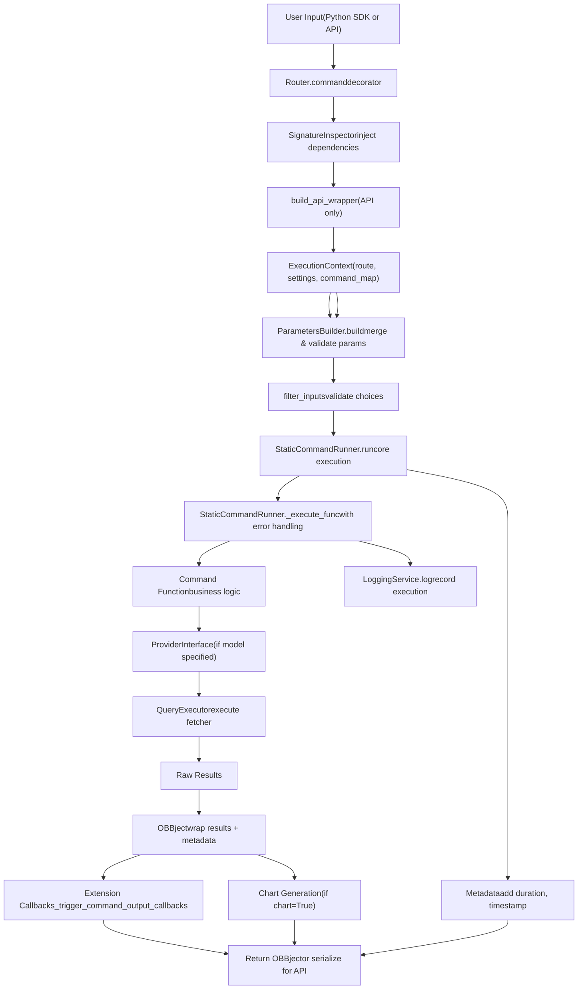
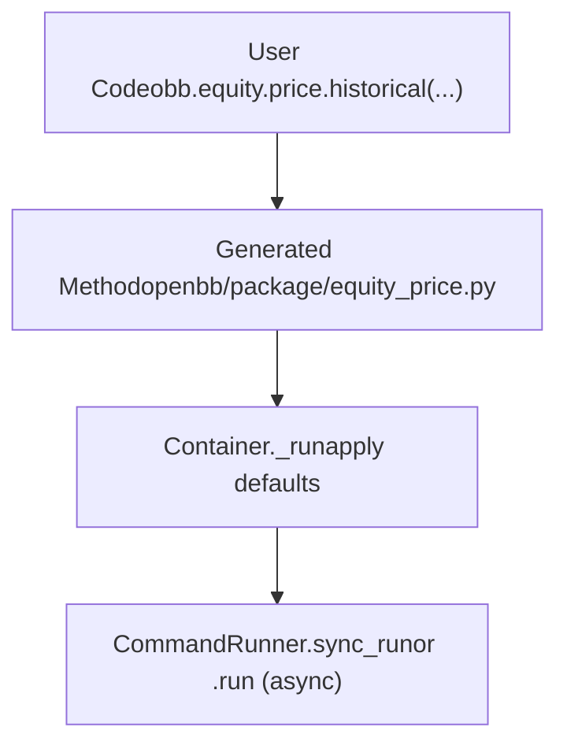
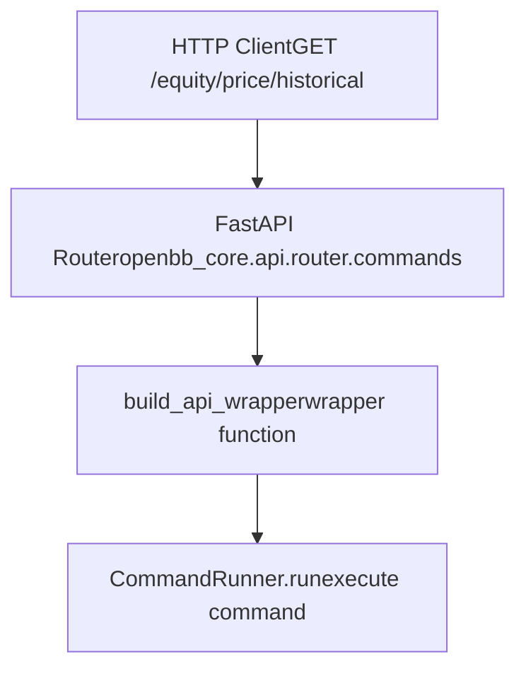
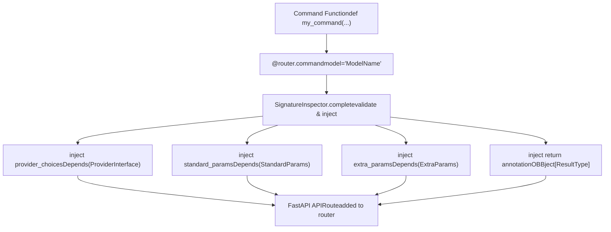
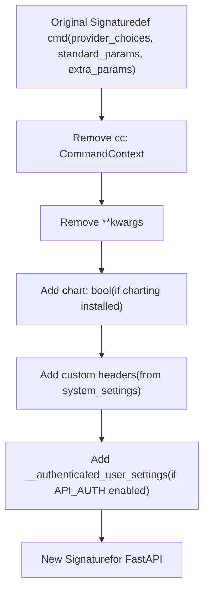
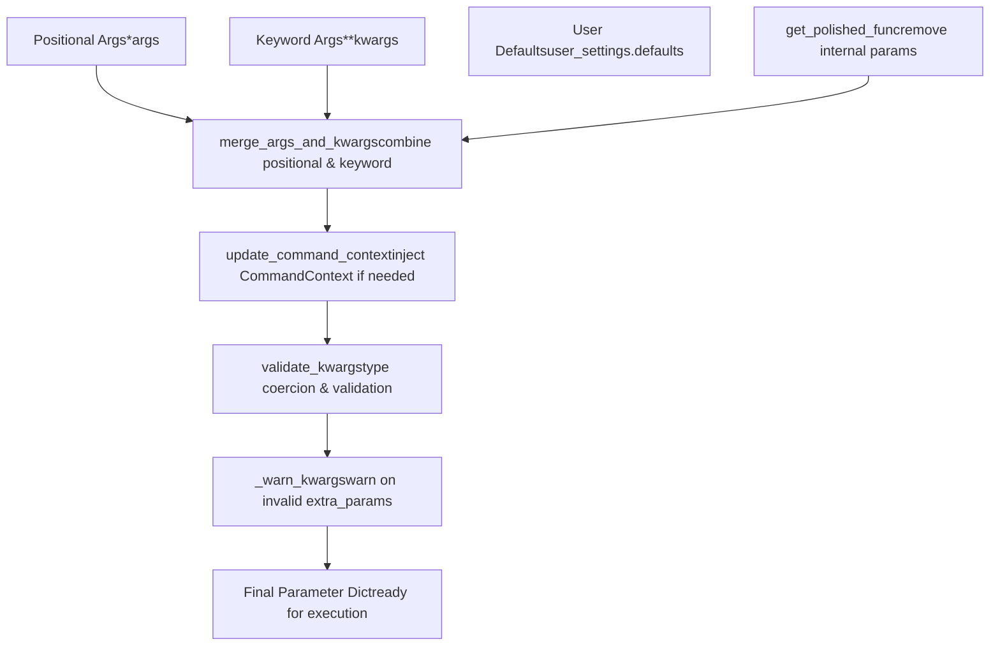
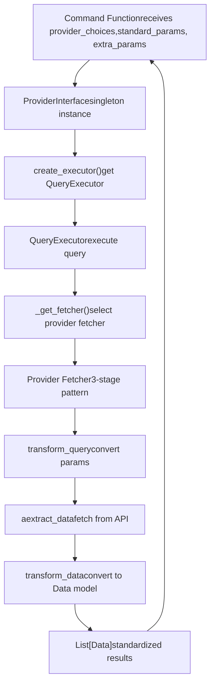
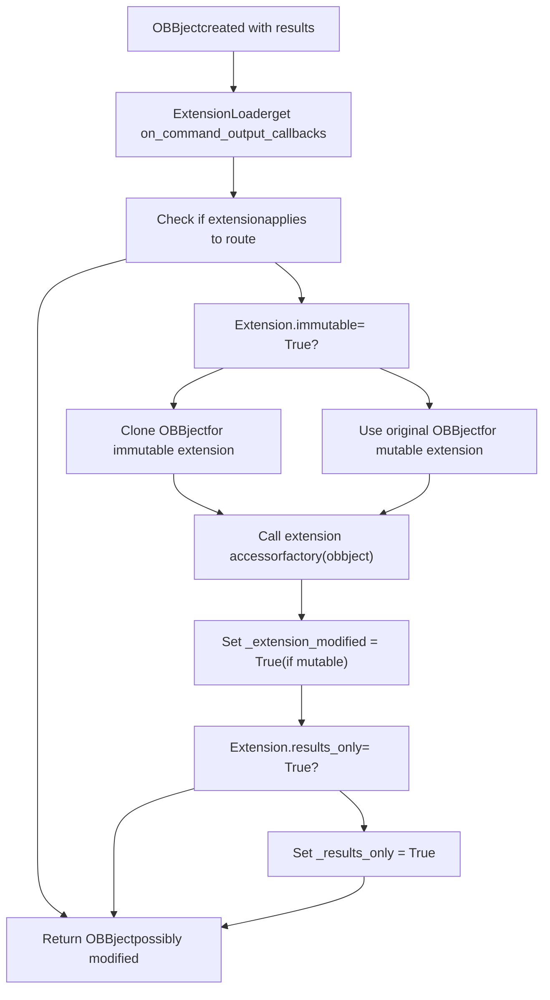
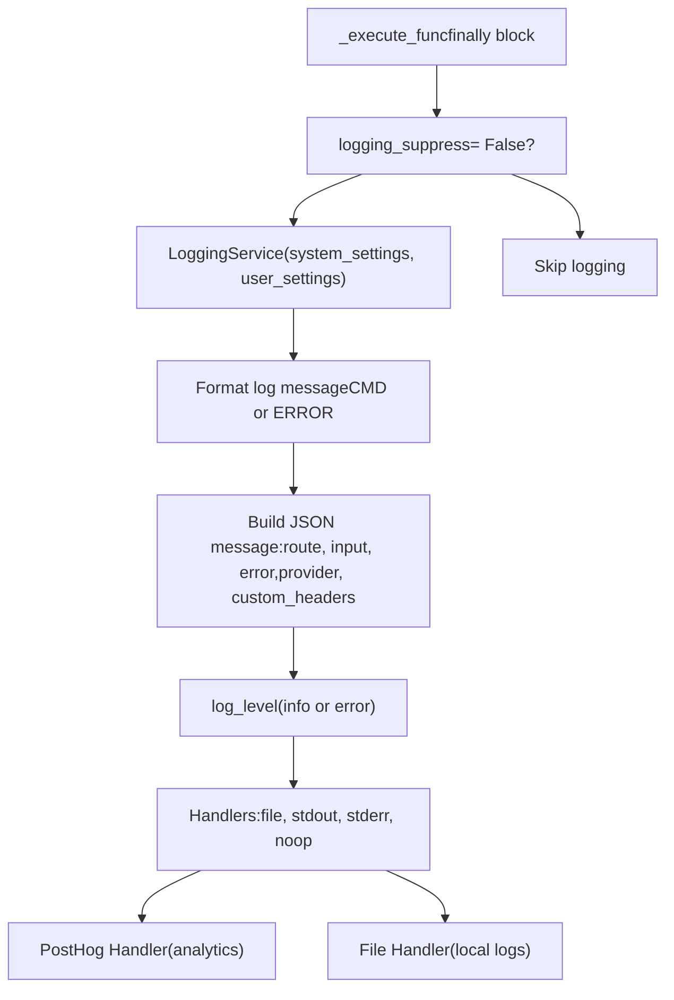
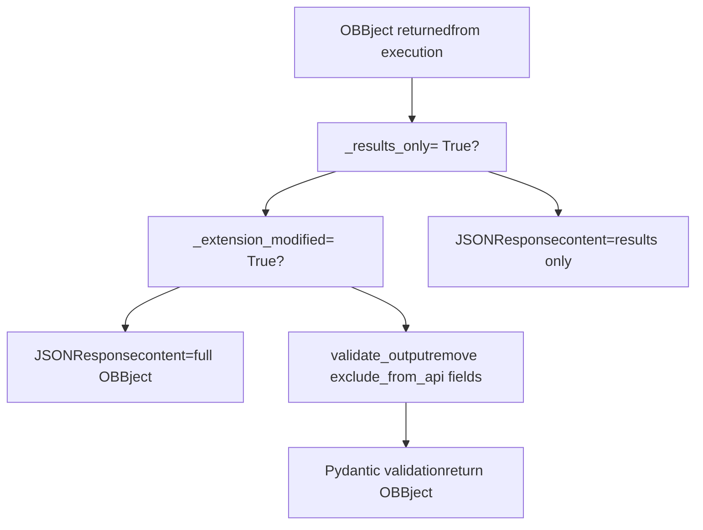

# 命令执行流水线

相关源文件

-   [cli/tests/test_argparse_translator_obbject_registry.py](https://github.com/OpenBB-finance/OpenBB/blob/dddc3b32/cli/tests/test_argparse_translator_obbject_registry.py)
-   [frontend-components/plotly/src/data/mockup.ts](https://github.com/OpenBB-finance/OpenBB/blob/dddc3b32/frontend-components/plotly/src/data/mockup.ts)
-   [openbb_platform/core/openbb_core/api/app_loader.py](https://github.com/OpenBB-finance/OpenBB/blob/dddc3b32/openbb_platform/core/openbb_core/api/app_loader.py)
-   [openbb_platform/core/openbb_core/api/exception_handlers.py](https://github.com/OpenBB-finance/OpenBB/blob/dddc3b32/openbb_platform/core/openbb_core/api/exception_handlers.py)
-   [openbb_platform/core/openbb_core/api/rest_api.py](https://github.com/OpenBB-finance/OpenBB/blob/dddc3b32/openbb_platform/core/openbb_core/api/rest_api.py)
-   [openbb_platform/core/openbb_core/api/router/commands.py](https://github.com/OpenBB-finance/OpenBB/blob/dddc3b32/openbb_platform/core/openbb_core/api/router/commands.py)
-   [openbb_platform/core/openbb_core/api/router/coverage.py](https://github.com/OpenBB-finance/OpenBB/blob/dddc3b32/openbb_platform/core/openbb_core/api/router/coverage.py)
-   [openbb_platform/core/openbb_core/app/command_runner.py](https://github.com/OpenBB-finance/OpenBB/blob/dddc3b32/openbb_platform/core/openbb_core/app/command_runner.py)
-   [openbb_platform/core/openbb_core/app/extension_loader.py](https://github.com/OpenBB-finance/OpenBB/blob/dddc3b32/openbb_platform/core/openbb_core/app/extension_loader.py)
-   [openbb_platform/core/openbb_core/app/logs/handlers_manager.py](https://github.com/OpenBB-finance/OpenBB/blob/dddc3b32/openbb_platform/core/openbb_core/app/logs/handlers_manager.py)
-   [openbb_platform/core/openbb_core/app/logs/logging_service.py](https://github.com/OpenBB-finance/OpenBB/blob/dddc3b32/openbb_platform/core/openbb_core/app/logs/logging_service.py)
-   [openbb_platform/core/openbb_core/app/logs/models/logging_settings.py](https://github.com/OpenBB-finance/OpenBB/blob/dddc3b32/openbb_platform/core/openbb_core/app/logs/models/logging_settings.py)
-   [openbb_platform/core/openbb_core/app/model/abstract/tagged.py](https://github.com/OpenBB-finance/OpenBB/blob/dddc3b32/openbb_platform/core/openbb_core/app/model/abstract/tagged.py)
-   [openbb_platform/core/openbb_core/app/model/charts/charting_settings.py](https://github.com/OpenBB-finance/OpenBB/blob/dddc3b32/openbb_platform/core/openbb_core/app/model/charts/charting_settings.py)
-   [openbb_platform/core/openbb_core/app/model/defaults.py](https://github.com/OpenBB-finance/OpenBB/blob/dddc3b32/openbb_platform/core/openbb_core/app/model/defaults.py)
-   [openbb_platform/core/openbb_core/app/model/extension.py](https://github.com/OpenBB-finance/OpenBB/blob/dddc3b32/openbb_platform/core/openbb_core/app/model/extension.py)
-   [openbb_platform/core/openbb_core/app/model/obbject.py](https://github.com/OpenBB-finance/OpenBB/blob/dddc3b32/openbb_platform/core/openbb_core/app/model/obbject.py)
-   [openbb_platform/core/openbb_core/app/model/system_settings.py](https://github.com/OpenBB-finance/OpenBB/blob/dddc3b32/openbb_platform/core/openbb_core/app/model/system_settings.py)
-   [openbb_platform/core/openbb_core/app/provider_interface.py](https://github.com/OpenBB-finance/OpenBB/blob/dddc3b32/openbb_platform/core/openbb_core/app/provider_interface.py)
-   [openbb_platform/core/openbb_core/app/router.py](https://github.com/OpenBB-finance/OpenBB/blob/dddc3b32/openbb_platform/core/openbb_core/app/router.py)
-   [openbb_platform/core/openbb_core/app/service/system_service.py](https://github.com/OpenBB-finance/OpenBB/blob/dddc3b32/openbb_platform/core/openbb_core/app/service/system_service.py)
-   [openbb_platform/core/openbb_core/app/static/container.py](https://github.com/OpenBB-finance/OpenBB/blob/dddc3b32/openbb_platform/core/openbb_core/app/static/container.py)
-   [openbb_platform/core/openbb_core/app/static/package_builder.py](https://github.com/OpenBB-finance/OpenBB/blob/dddc3b32/openbb_platform/core/openbb_core/app/static/package_builder.py)
-   [openbb_platform/core/openbb_core/app/static/utils/filters.py](https://github.com/OpenBB-finance/OpenBB/blob/dddc3b32/openbb_platform/core/openbb_core/app/static/utils/filters.py)
-   [openbb_platform/core/openbb_core/app/utils.py](https://github.com/OpenBB-finance/OpenBB/blob/dddc3b32/openbb_platform/core/openbb_core/app/utils.py)
-   [openbb_platform/core/openbb_core/env.py](https://github.com/OpenBB-finance/OpenBB/blob/dddc3b32/openbb_platform/core/openbb_core/env.py)
-   [openbb_platform/core/openbb_core/provider/registry_map.py](https://github.com/OpenBB-finance/OpenBB/blob/dddc3b32/openbb_platform/core/openbb_core/provider/registry_map.py)
-   [openbb_platform/core/openbb_core/provider/standard_models/fred_release_table.py](https://github.com/OpenBB-finance/OpenBB/blob/dddc3b32/openbb_platform/core/openbb_core/provider/standard_models/fred_release_table.py)
-   [openbb_platform/core/openbb_core/provider/standard_models/futures_curve.py](https://github.com/OpenBB-finance/OpenBB/blob/dddc3b32/openbb_platform/core/openbb_core/provider/standard_models/futures_curve.py)
-   [openbb_platform/core/openbb_core/provider/standard_models/yield_curve.py](https://github.com/OpenBB-finance/OpenBB/blob/dddc3b32/openbb_platform/core/openbb_core/provider/standard_models/yield_curve.py)
-   [openbb_platform/core/tests/app/logs/test_handlers_manager.py](https://github.com/OpenBB-finance/OpenBB/blob/dddc3b32/openbb_platform/core/tests/app/logs/test_handlers_manager.py)
-   [openbb_platform/core/tests/app/logs/test_logging_service.py](https://github.com/OpenBB-finance/OpenBB/blob/dddc3b32/openbb_platform/core/tests/app/logs/test_logging_service.py)
-   [openbb_platform/core/tests/app/model/test_extension.py](https://github.com/OpenBB-finance/OpenBB/blob/dddc3b32/openbb_platform/core/tests/app/model/test_extension.py)
-   [openbb_platform/core/tests/app/model/test_obbject.py](https://github.com/OpenBB-finance/OpenBB/blob/dddc3b32/openbb_platform/core/tests/app/model/test_obbject.py)
-   [openbb_platform/core/tests/app/model/test_system_settings.py](https://github.com/OpenBB-finance/OpenBB/blob/dddc3b32/openbb_platform/core/tests/app/model/test_system_settings.py)
-   [openbb_platform/core/tests/app/static/test_filters.py](https://github.com/OpenBB-finance/OpenBB/blob/dddc3b32/openbb_platform/core/tests/app/static/test_filters.py)
-   [openbb_platform/core/tests/app/static/test_package_builder.py](https://github.com/OpenBB-finance/OpenBB/blob/dddc3b32/openbb_platform/core/tests/app/static/test_package_builder.py)
-   [openbb_platform/core/tests/app/test_command_runner.py](https://github.com/OpenBB-finance/OpenBB/blob/dddc3b32/openbb_platform/core/tests/app/test_command_runner.py)
-   [openbb_platform/core/tests/app/test_platform_router.py](https://github.com/OpenBB-finance/OpenBB/blob/dddc3b32/openbb_platform/core/tests/app/test_platform_router.py)
-   [openbb_platform/core/tests/app/test_provider_interface.py](https://github.com/OpenBB-finance/OpenBB/blob/dddc3b32/openbb_platform/core/tests/app/test_provider_interface.py)
-   [openbb_platform/obbject_extensions/charting/openbb_charting/charts/helpers.py](https://github.com/OpenBB-finance/OpenBB/blob/dddc3b32/openbb_platform/obbject_extensions/charting/openbb_charting/charts/helpers.py)
-   [openbb_platform/obbject_extensions/charting/tests/test_charting.py](https://github.com/OpenBB-finance/OpenBB/blob/dddc3b32/openbb_platform/obbject_extensions/charting/tests/test_charting.py)
-   [openbb_platform/providers/bls/openbb_bls/utils/helpers.py](https://github.com/OpenBB-finance/OpenBB/blob/dddc3b32/openbb_platform/providers/bls/openbb_bls/utils/helpers.py)
-   [openbb_platform/providers/cboe/openbb_cboe/models/futures_curve.py](https://github.com/OpenBB-finance/OpenBB/blob/dddc3b32/openbb_platform/providers/cboe/openbb_cboe/models/futures_curve.py)
-   [openbb_platform/providers/cboe/tests/test_cboe_fetchers.py](https://github.com/OpenBB-finance/OpenBB/blob/dddc3b32/openbb_platform/providers/cboe/tests/test_cboe_fetchers.py)
-   [openbb_platform/providers/fred/openbb_fred/models/release_table.py](https://github.com/OpenBB-finance/OpenBB/blob/dddc3b32/openbb_platform/providers/fred/openbb_fred/models/release_table.py)

本文档描述了 OpenBB Platform 中完整的命令执行流水线，从用户输入（Python SDK 或 REST API）开始，经过验证、参数构建、数据商数据获取，到最终的 OBBject 输出。这涵盖了平台中所有命令的运行时执行流程。

有关命令如何注册以及路由如何在启动时构建的信息，请参见 [扩展系统](/OpenBB-finance/OpenBB/2.2-extension-system)。有关数据商如何获取和转换数据的详细信息，请参见 [数据商架构](/OpenBB-finance/OpenBB/2.3-provider-architecture)。有关创建 SDK 方法的代码生成信息，请参见 [包构建器与代码生成](/OpenBB-finance/OpenBB/2.4-package-builder-and-code-generation)。

---

## 概述

命令执行流水线由每个命令流经的几个阶段组成：

1.  **输入接收**：命令源自 Python SDK（例如 `obb.equity.price.historical()`）或 REST API（例如 `GET /equity/price/historical`）
2.  **路由与验证**：`Router.command` 装饰器包装端点函数，`SignatureInspector` 注入数据商选择和参数依赖项
3.  **上下文构建**：`ExecutionContext` 聚合系统设置、用户设置和命令映射
4.  **参数构建**：`ParametersBuilder` 合并位置参数、关键字参数、默认值并验证类型
5.  **命令执行**：`StaticCommandRunner.run` 使用构建的参数执行命令函数
6.  **数据商集成**：使用 `ProviderInterface` 的命令通过 `QueryExecutor` 使用三阶段获取器模式获取数据
7.  **输出包装**：结果被包装在带有元数据的 `OBBject` 中
8.  **扩展回调**：注册的扩展可以修改或响应 OBBject
9.  **日志记录**：`LoggingService` 记录执行详情、错误和分析数据
10. **响应**：OBBject 返回给调用者或序列化为 API 响应

**流水线流程图**


来源：[openbb_platform/core/openbb_core/app/command_runner.py1-723](https://github.com/OpenBB-finance/OpenBB/blob/dddc3b32/openbb_platform/core/openbb_core/app/command_runner.py#L1-L723) [openbb_platform/core/openbb_core/api/router/commands.py1-357](https://github.com/OpenBB-finance/OpenBB/blob/dddc3b32/openbb_platform/core/openbb_core/api/router/commands.py#L1-L357) [openbb_platform/core/openbb_core/app/router.py1-538](https://github.com/OpenBB-finance/OpenBB/blob/dddc3b32/openbb_platform/core/openbb_core/app/router.py#L1-L538)

---

## 输入层

命令通过两个入口点进入执行流水线：

### Python SDK 入口点

生成的 Python SDK 方法（在 `openbb.package.*` 模块中）调用 `Container._run()`，后者调用 `CommandRunner.sync_run()` 或 `CommandRunner.run()`：


`Container._run()` 方法在将请求传递给运行器之前，会应用来自 `user_settings.defaults.commands` 的用户默认值。

来源：[openbb_platform/core/openbb_core/app/static/container.py23-58](https://github.com/OpenBB-finance/OpenBB/blob/dddc3b32/openbb_platform/core/openbb_core/app/static/container.py#L23-L58)

### REST API 入口点

API 请求通过 FastAPI 路由流向 `build_api_wrapper` 函数，该函数为每个命令创建一个包装器：


API 包装器处理：

-   如果启用了 `API_AUTH`，则通过 `AuthService().user_settings_hook` 进行用户身份验证
-   从请求中提取 `standard_params` 和 `extra_params`
-   应用来自 `user_settings.defaults.commands` 的用户默认值
-   路由级依赖项的依赖注入
-   输出验证或序列化为 JSONResponse

来源：[openbb_platform/core/openbb_core/api/router/commands.py212-342](https://github.com/OpenBB-finance/OpenBB/blob/dddc3b32/openbb_platform/core/openbb_core/api/router/commands.py#L212-L342)

---

## 路由与签名注入

### Router.command 装饰器

`@router.command()` 装饰器应用于扩展路由中的所有命令函数。它执行多项转换：


**SignatureInspector 执行的关键转换：**

| 转换 | 目的 | 代码引用 |
| --- | --- | --- |
| 验证签名 | 确保函数具有必需参数：`provider_choices`、`standard_params`、`extra_params` | [router.py322-335](https://github.com/OpenBB-finance/OpenBB/blob/dddc3b32/router.py#L322-L335) |
| 注入 provider_choices | 为可用数据商添加 `Annotated[ProviderChoices, Depends()]` | [router.py261-265](https://github.com/OpenBB-finance/OpenBB/blob/dddc3b32/router.py#L261-L265) |
| 注入 standard_params | 为通用参数添加 `Annotated[StandardParams, Depends()]` | [router.py267-271](https://github.com/OpenBB-finance/OpenBB/blob/dddc3b32/router.py#L267-L271) |
| 注入 extra_params | 为特定数据商参数添加 `Annotated[ExtraParams, Depends()]` | [router.py273-277](https://github.com/OpenBB-finance/OpenBB/blob/dddc3b32/router.py#L273-L277) |
| 注入返回注解 | 将返回类型设置为 `OBBject[ResultType]` | [router.py279-282](https://github.com/OpenBB-finance/OpenBB/blob/dddc3b32/router.py#L279-L282) |

来源：[openbb_platform/core/openbb_core/app/router.py87-171](https://github.com/OpenBB-finance/OpenBB/blob/dddc3b32/openbb_platform/core/openbb_core/app/router.py#L87-L171) [openbb_platform/core/openbb_core/app/router.py227-375](https://github.com/OpenBB-finance/OpenBB/blob/dddc3b32/openbb_platform/core/openbb_core/app/router.py#L227-L375)

### API 签名构建

对于 REST API，`build_new_signature()` 修改函数签名，以向 FastAPI 的 OpenAPI 生成暴露正确的参数：


这确保了：

-   FastAPI 不会暴露内部参数，如 `CommandContext` 或 `**kwargs`
-   为支持图表的命令添加了 Chart 参数
-   注入了 `system_settings.api_settings.custom_headers` 中定义的自定义头
-   当启用 `API_AUTH` 时，添加了身份验证依赖项

来源：[openbb_platform/core/openbb_core/api/router/commands.py53-149](https://github.com/OpenBB-finance/OpenBB/blob/dddc3b32/openbb_platform/core/openbb_core/api/router/commands.py#L53-L149)

---

## 执行上下文

`ExecutionContext` 类聚合了命令执行所需的所有上下文信息：

**ExecutionContext 组件**


上下文在 `CommandRunner.run()` 开始时创建：

```python
execution_context = ExecutionContext(    command_map=self._command_map,    route=route,    system_settings=self._system_settings,    user_settings=self._user_settings,)
```
来源：[openbb_platform/core/openbb_core/app/command_runner.py34-56](https://github.com/OpenBB-finance/OpenBB/blob/dddc3b32/openbb_platform/core/openbb_core/app/command_runner.py#L34-L56) [openbb_platform/core/openbb_core/app/command_runner.py703-708](https://github.com/OpenBB-finance/OpenBB/blob/dddc3b32/openbb_platform/core/openbb_core/app/command_runner.py#L703-L708)

---

## 参数构建

`ParametersBuilder` 类负责在执行前合并和验证所有参数：

**参数构建流水线**


**ParametersBuilder 方法：**

| 方法 | 目的 | 代码引用 |
| --- | --- | --- |
| `get_polished_func()` | 从签名中移除 `__authenticated_user_settings` | [command_runner.py71-86](https://github.com/OpenBB-finance/OpenBB/blob/dddc3b32/command_runner.py#L71-L86) |
| `get_polished_parameter_list()` | 从函数签名中提取参数列表 | [command_runner.py63-68](https://github.com/OpenBB-finance/OpenBB/blob/dddc3b32/command_runner.py#L63-L68) |
| `merge_args_and_kwargs()` | 合并位置参数与关键字参数，处理 `**kwargs` | [command_runner.py88-124](https://github.com/OpenBB-finance/OpenBB/blob/dddc3b32/command_runner.py#L88-L124) |
| `update_command_context()` | 如果函数接受 `cc` 参数，则注入 `CommandContext` | [command_runner.py126-144](https://github.com/OpenBB-finance/OpenBB/blob/dddc3b32/command_runner.py#L126-L144) |
| `validate_kwargs()` | 创建 Pydantic 模型以验证和强制转换类型 | [command_runner.py180-206](https://github.com/OpenBB-finance/OpenBB/blob/dddc3b32/command_runner.py#L180-L206) |
| `_warn_kwargs()` | 如果 extra_params 包含无法识别的字段，则发出警告 | [command_runner.py146-168](https://github.com/OpenBB-finance/OpenBB/blob/dddc3b32/command_runner.py#L146-L168) |

`validate_kwargs()` 方法动态地从函数签名创建 Pydantic 模型：

```python
ValidationModel = create_model(func.__name__, __config__=config, **fields)model = ValidationModel(**kwargs)
```
这确保了类型安全和自动强制转换（例如，对于 int 参数，将 `"2"` 转换为 `2`）。

来源：[openbb_platform/core/openbb_core/app/command_runner.py59-236](https://github.com/OpenBB-finance/OpenBB/blob/dddc3b32/openbb_platform/core/openbb_core/app/command_runner.py#L59-L236)

---

## 命令执行

### StaticCommandRunner

`StaticCommandRunner` 类包含核心执行逻辑。执行流程为：

> **[Mermaid 序列图]**
> *(图表结构无法解析)*

**关键执行步骤：**

1.  使用路由从 `CommandMap` **检索命令函数**
2.  使用 `ParametersBuilder` **构建参数**
3.  使用 `maybe_coroutine()` **执行函数**，该函数处理同步和异步函数
4.  如果 `chart=True` 且图表扩展可用，则 **生成图表**
5.  **记录执行日志**，包括路由、kwargs、错误、数据商
6.  为 `on_command_output` 扩展 **触发扩展回调**
7.  **添加元数据**，包括时长、时间戳、参数

来源：[openbb_platform/core/openbb_core/app/command_runner.py240-640](https://github.com/OpenBB-finance/OpenBB/blob/dddc3b32/openbb_platform/core/openbb_core/app/command_runner.py#L240-L640)

### 错误处理与警告

执行被包装在一个捕获警告的 try/finally 块中：

```python
with catch_warnings(record=True) as warning_list:    # ... 参数构建和执行 ...    obbject = await cls._command(func, kwargs)finally:    if raised_warnings:        for w in raised_warnings:            obbject.warnings.append(cast_warning(w))
```
执行期间引发的所有警告都会被捕获并附加到 `OBBject.warnings` 字段。

来源：[openbb_platform/core/openbb_core/app/command_runner.py323-410](https://github.com/OpenBB-finance/OpenBB/blob/dddc3b32/openbb_platform/core/openbb_core/app/command_runner.py#L323-L410)

---

## 数据商集成

在 `@router.command()` 装饰器中指定了 `model` 参数的命令会与 `ProviderInterface` 集成，以从数据商获取数据：

**数据商执行流**


命令函数通常如下所示：

```python
from openbb_core.provider.abstract.fetcher import Fetcher
results = await obb.equity.price.historical(
    symbol="AAPL",
    provider_choices=provider_choices,
    standard_params=standard_params,
    extra_params=extra_params,
)
```
在内部，这会调用：

```python
executor = ProviderInterface().create_executor()results = await executor.execute(    model="EquityHistorical",    provider=provider_choices.provider,    params=merged_params,)
```
有关三阶段获取器模式的详细信息，请参见 [数据商架构](/OpenBB-finance/OpenBB/2.3-provider-architecture)。

来源：[openbb_platform/core/openbb_core/app/provider_interface.py170-172](https://github.com/OpenBB-finance/OpenBB/blob/dddc3b32/openbb_platform/core/openbb_core/app/provider_interface.py#L170-L172) [openbb_platform/core/openbb_core/app/command_runner.py360-376](https://github.com/OpenBB-finance/OpenBB/blob/dddc3b32/openbb_platform/core/openbb_core/app/command_runner.py#L360-L376)

---

## OBBject 创建与后处理

在命令函数返回结果后，它们被包装在 `OBBject` 中：

**OBBject 结构**


**后处理步骤：**

1.  在 OBBject 上 **设置路由和参数**：

    ```python
    obbject._route = routeobbject._standard_params = std_paramsobbject._extra_params = extra_params
    ```

2.  如果 `chart=True`，则 **生成图表**：

    ```python
    if chart and obbject.results:    cls._chart(obbject, **kwargs_copy)
    ```

3.  如果 `user_settings.preferences.metadata` 为 True，则 **添加元数据**：

    ```python
    obbject.extra["metadata"] = Metadata(    arguments=kwargs,    duration=duration,    route=route,    timestamp=timestamp,)
    ```

4.  通过移除依赖项参数名称，从元数据参数中 **清理依赖注入**。


来源：[openbb_platform/core/openbb_core/app/command_runner.py365-376](https://github.com/OpenBB-finance/OpenBB/blob/dddc3b32/openbb_platform/core/openbb_core/app/command_runner.py#L365-L376) [openbb_platform/core/openbb_core/app/command_runner.py458-505](https://github.com/OpenBB-finance/OpenBB/blob/dddc3b32/openbb_platform/core/openbb_core/app/command_runner.py#L458-L505) [openbb_platform/core/openbb_core/app/model/obbject.py1-383](https://github.com/OpenBB-finance/OpenBB/blob/dddc3b32/openbb_platform/core/openbb_core/app/model/obbject.py#L1-L383)

---

## 扩展回调

注册了 `on_command_output=True` 的扩展可以在执行后修改或响应 OBBject：

**扩展回调流**


**扩展注册：**

扩展在初始化期间注册到 `ExtensionLoader` 中：

```python
for ext in self.obbject_objects.values():    if ext.on_command_output:        paths = ext.command_output_paths or ["*"]        for path in paths:            self._on_command_output_callbacks[path].append(ext)
```
`"*"` 路径表示该扩展适用于所有路由。

**回调执行：**

```python
for ext in ordered_extensions:    target = _clone_for_immutable(obbject) if ext.immutable else obbject        if iscoroutinefunction(factory):        run_async(factory, target)    else:        result = factory(target)        if callable(result):            result()        if ext.immutable is False:        object.__setattr__(obbject, "_extension_modified", True)
```
如果任何扩展设置了 `results_only=True`，API 将仅返回 `results` 字段，而不是完整的 OBBject。

来源：[openbb_platform/core/openbb_core/app/command_runner.py537-640](https://github.com/OpenBB-finance/OpenBB/blob/dddc3b32/openbb_platform/core/openbb_core/app/command_runner.py#L537-L640) [openbb_platform/core/openbb_core/app/extension_loader.py61-69](https://github.com/OpenBB-finance/OpenBB/blob/dddc3b32/openbb_platform/core/openbb_core/app/extension_loader.py#L61-L69)

---

## 日志记录

`LoggingService` 记录所有命令执行：

**日志流**


**日志消息结构：**

```json
{    "route": "/equity/price/historical",    "input": {        "standard_params": {"symbol": "AAPL", "start_date": "2020-01-01"},        "extra_params": {"interval": "1d"},        "provider_choices": {"provider": "yfinance"}    },    "error": null,    "provider": "yfinance",    "custom_headers": {"X-OpenBB-Session": "..."}}
```
错误通过 `exc_info` 记录，以包含完整的堆栈跟踪：

```python
log_level(    log_message,    extra={"func_name_override": func.__name__},    exc_info=exec_info,)
```
来源：[openbb_platform/core/openbb_core/app/command_runner.py412-425](https://github.com/OpenBB-finance/OpenBB/blob/dddc3b32/openbb_platform/core/openbb_core/app/command_runner.py#L412-L425) [openbb_platform/core/openbb_core/app/logs/logging_service.py199-282](https://github.com/OpenBB-finance/OpenBB/blob/dddc3b32/openbb_platform/core/openbb_core/app/logs/logging_service.py#L199-L282)

---

## 返回路径

### Python SDK 返回

对于 Python SDK 调用，直接返回 OBBject，或根据 `user_settings.preferences.output_type` 进行转换：

```python
output_type = self._command_runner.user_settings.preferences.output_type
if output_type == "OBBject":
    return obbject
return getattr(obbject, "to_" + output_type)()
```
支持的输出类型：`"OBBject"`、`"dataframe"`、`"dict"`、`"polars"`、`"numpy"`。

来源：[openbb_platform/core/openbb_core/app/static/container.py53-58](https://github.com/OpenBB-finance/OpenBB/blob/dddc3b32/openbb_platform/core/openbb_core/app/static/container.py#L53-L58)

### REST API 返回

对于 REST API 调用，包装器确定响应格式：


`validate_output()` 函数会移除标记有 `exclude_from_api=True` 的字段：

```python
if json_schema_extra and json_schema_extra.get("exclude_from_api"):    delattr(c_out, key)
```
来源：[openbb_platform/core/openbb_core/api/router/commands.py152-340](https://github.com/OpenBB-finance/OpenBB/blob/dddc3b32/openbb_platform/core/openbb_core/api/router/commands.py#L152-L340) [openbb_platform/core/openbb_core/api/router/commands.py308-338](https://github.com/OpenBB-finance/OpenBB/blob/dddc3b32/openbb_platform/core/openbb_core/api/router/commands.py#L308-L338)

---

## 摘要表

| 阶段 | 关键类/函数 | 输入 | 输出 | 目的 |
| --- | --- | --- | --- | --- |
| 输入接收 | `Container._run`，API 包装器 | 用户调用或 HTTP 请求 | 路由、args、kwargs | 命令的入口点 |
| 路由与验证 | `Router.command`，`SignatureInspector` | 命令函数 | 注入依赖项的 APIRoute | 注册并转换端点 |
| 上下文构建 | `ExecutionContext` | 路由、设置、命令映射 | ExecutionContext 对象 | 聚合执行上下文 |
| 参数构建 | `ParametersBuilder.build` | args、kwargs、上下文 | 经过验证的参数字典 | 合并、验证并准备参数 |
| 命令执行 | `StaticCommandRunner.run` | 上下文、参数 | 原始结果或 OBBject | 执行命令函数 |
| 数据商集成 | `ProviderInterface`，`QueryExecutor` | 模型、数据商、参数 | List[Data] | 从数据商获取数据 |
| OBBject 创建 | `OBBject.__init__` | 结果、数据商、路由 | OBBject | 用元数据包装结果 |
| 扩展回调 | `_trigger_command_output_callbacks` | 路由、obbject | 修改后的 OBBject | 允许扩展修改输出 |
| 日志记录 | `LoggingService.log` | 路由、函数、kwargs、exec_info | 日志条目 | 记录执行详情 |
| 返回路径 | `Container._run`，API 包装器 | OBBject | 格式化后的响应 | 将结果返回给调用者 |

来源：[openbb_platform/core/openbb_core/app/command_runner.py1-723](https://github.com/OpenBB-finance/OpenBB/blob/dddc3b32/openbb_platform/core/openbb_core/app/command_runner.py#L1-L723) [openbb_platform/core/openbb_core/api/router/commands.py1-357](https://github.com/OpenBB-finance/OpenBB/blob/dddc3b32/openbb_platform/core/openbb_core/api/router/commands.py#L1-L357) [openbb_platform/core/openbb_core/app/router.py1-538](https://github.com/OpenBB-finance/OpenBB/blob/dddc3b32/openbb_platform/core/openbb_core/app/router.py#L1-L538)
