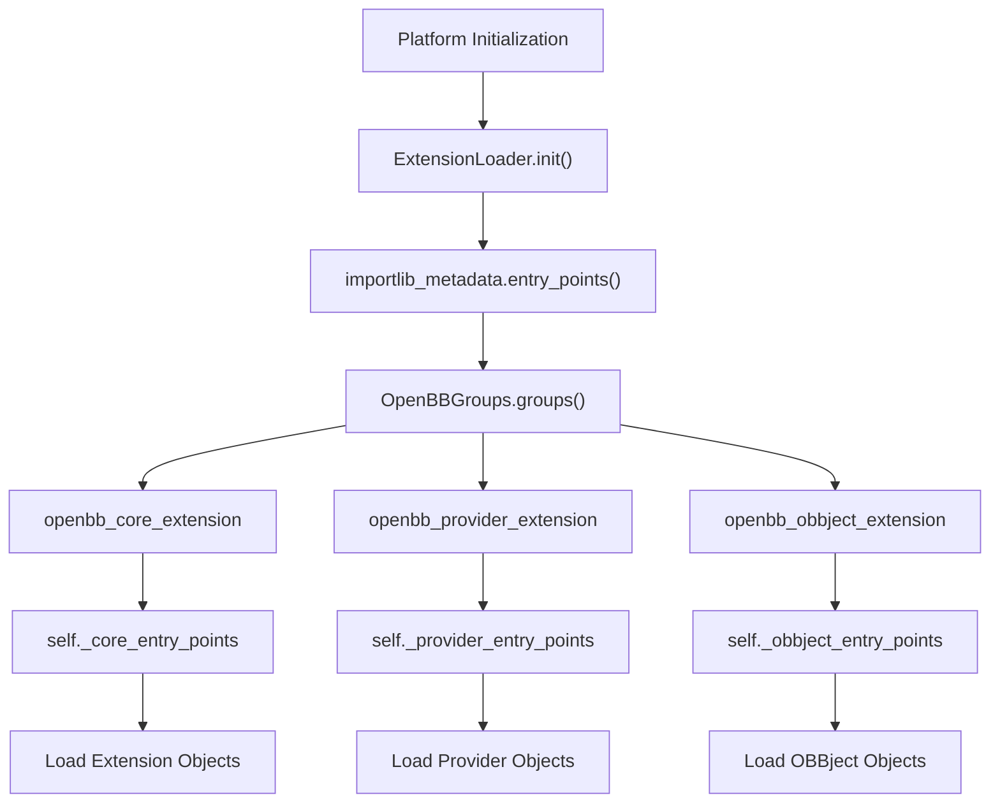
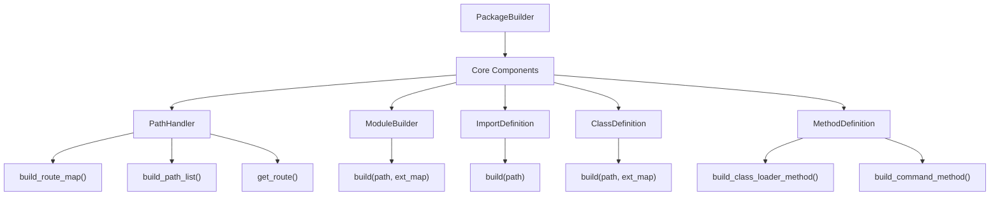
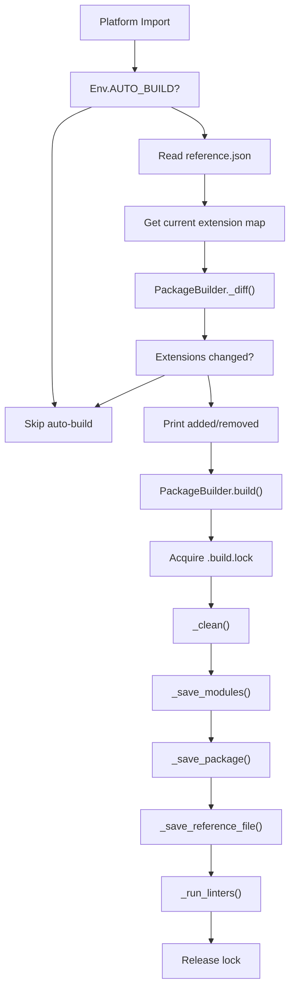
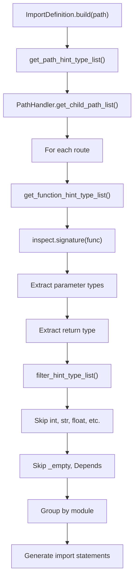
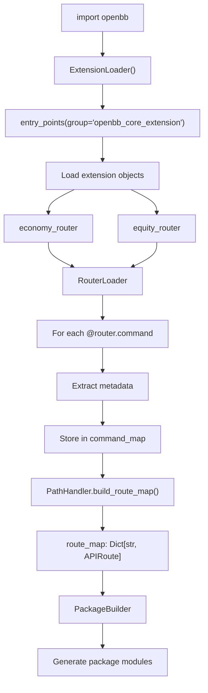
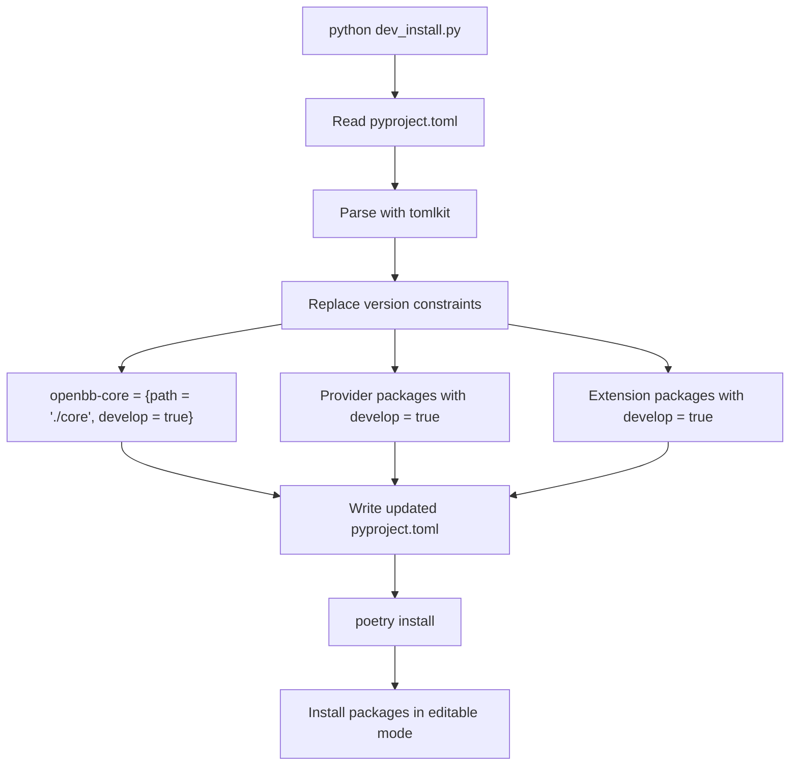

# 扩展系统

相关源文件

-   [cli/tests/test_argparse_translator_obbject_registry.py](https://github.com/OpenBB-finance/OpenBB/blob/dddc3b32/cli/tests/test_argparse_translator_obbject_registry.py)
-   [frontend-components/plotly/src/data/mockup.ts](https://github.com/OpenBB-finance/OpenBB/blob/dddc3b32/frontend-components/plotly/src/data/mockup.ts)
-   [openbb_platform/core/openbb_core/api/app_loader.py](https://github.com/OpenBB-finance/OpenBB/blob/dddc3b32/openbb_platform/core/openbb_core/api/app_loader.py)
-   [openbb_platform/core/openbb_core/api/exception_handlers.py](https://github.com/OpenBB-finance/OpenBB/blob/dddc3b32/openbb_platform/core/openbb_core/api/exception_handlers.py)
-   [openbb_platform/core/openbb_core/api/rest_api.py](https://github.com/OpenBB-finance/OpenBB/blob/dddc3b32/openbb_platform/core/openbb_core/api/rest_api.py)
-   [openbb_platform/core/openbb_core/api/router/commands.py](https://github.com/OpenBB-finance/OpenBB/blob/dddc3b32/openbb_platform/core/openbb_core/api/router/commands.py)
-   [openbb_platform/core/openbb_core/api/router/coverage.py](https://github.com/OpenBB-finance/OpenBB/blob/dddc3b32/openbb_platform/core/openbb_core/api/router/coverage.py)
-   [openbb_platform/core/openbb_core/app/command_runner.py](https://github.com/OpenBB-finance/OpenBB/blob/dddc3b32/openbb_platform/core/openbb_core/app/command_runner.py)
-   [openbb_platform/core/openbb_core/app/extension_loader.py](https://github.com/OpenBB-finance/OpenBB/blob/dddc3b32/openbb_platform/core/openbb_core/app/extension_loader.py)
-   [openbb_platform/core/openbb_core/app/logs/handlers_manager.py](https://github.com/OpenBB-finance/OpenBB/blob/dddc3b32/openbb_platform/core/openbb_core/app/logs/handlers_manager.py)
-   [openbb_platform/core/openbb_core/app/logs/logging_service.py](https://github.com/OpenBB-finance/OpenBB/blob/dddc3b32/openbb_platform/core/openbb_core/app/logs/logging_service.py)
-   [openbb_platform/core/openbb_core/app/logs/models/logging_settings.py](https://github.com/OpenBB-finance/OpenBB/blob/dddc3b32/openbb_platform/core/openbb_core/app/logs/models/logging_settings.py)
-   [openbb_platform/core/openbb_core/app/model/abstract/tagged.py](https://github.com/OpenBB-finance/OpenBB/blob/dddc3b32/openbb_platform/core/openbb_core/app/model/abstract/tagged.py)
-   [openbb_platform/core/openbb_core/app/model/charts/chart.py](https://github.com/OpenBB-finance/OpenBB/blob/dddc3b32/openbb_platform/core/openbb_core/app/model/charts/chart.py)
-   [openbb_platform/core/openbb_core/app/model/charts/charting_settings.py](https://github.com/OpenBB-finance/OpenBB/blob/dddc3b32/openbb_platform/core/openbb_core/app/model/charts/charting_settings.py)
-   [openbb_platform/core/openbb_core/app/model/defaults.py](https://github.com/OpenBB-finance/OpenBB/blob/dddc3b32/openbb_platform/core/openbb_core/app/model/defaults.py)
-   [openbb_platform/core/openbb_core/app/model/extension.py](https://github.com/OpenBB-finance/OpenBB/blob/dddc3b32/openbb_platform/core/openbb_core/app/model/extension.py)
-   [openbb_platform/core/openbb_core/app/model/obbject.py](https://github.com/OpenBB-finance/OpenBB/blob/dddc3b32/openbb_platform/core/openbb_core/app/model/obbject.py)
-   [openbb_platform/core/openbb_core/app/model/system_settings.py](https://github.com/OpenBB-finance/OpenBB/blob/dddc3b32/openbb_platform/core/openbb_core/app/model/system_settings.py)
-   [openbb_platform/core/openbb_core/app/provider_interface.py](https://github.com/OpenBB-finance/OpenBB/blob/dddc3b32/openbb_platform/core/openbb_core/app/provider_interface.py)
-   [openbb_platform/core/openbb_core/app/router.py](https://github.com/OpenBB-finance/OpenBB/blob/dddc3b32/openbb_platform/core/openbb_core/app/router.py)
-   [openbb_platform/core/openbb_core/app/service/system_service.py](https://github.com/OpenBB-finance/OpenBB/blob/dddc3b32/openbb_platform/core/openbb_core/app/service/system_service.py)
-   [openbb_platform/core/openbb_core/app/static/container.py](https://github.com/OpenBB-finance/OpenBB/blob/dddc3b32/openbb_platform/core/openbb_core/app/static/container.py)
-   [openbb_platform/core/openbb_core/app/static/package_builder.py](https://github.com/OpenBB-finance/OpenBB/blob/dddc3b32/openbb_platform/core/openbb_core/app/static/package_builder.py)
-   [openbb_platform/core/openbb_core/app/static/utils/filters.py](https://github.com/OpenBB-finance/OpenBB/blob/dddc3b32/openbb_platform/core/openbb_core/app/static/utils/filters.py)
-   [openbb_platform/core/openbb_core/app/utils.py](https://github.com/OpenBB-finance/OpenBB/blob/dddc3b32/openbb_platform/core/openbb_core/app/utils.py)
-   [openbb_platform/core/openbb_core/env.py](https://github.com/OpenBB-finance/OpenBB/blob/dddc3b32/openbb_platform/core/openbb_core/env.py)
-   [openbb_platform/core/openbb_core/provider/registry_map.py](https://github.com/OpenBB-finance/OpenBB/blob/dddc3b32/openbb_platform/core/openbb_core/provider/registry_map.py)
-   [openbb_platform/core/openbb_core/provider/standard_models/fred_release_table.py](https://github.com/OpenBB-finance/OpenBB/blob/dddc3b32/openbb_platform/core/openbb_core/provider/standard_models/fred_release_table.py)
-   [openbb_platform/core/openbb_core/provider/standard_models/futures_curve.py](https://github.com/OpenBB-finance/OpenBB/blob/dddc3b32/openbb_platform/core/openbb_core/provider/standard_models/futures_curve.py)
-   [openbb_platform/core/openbb_core/provider/standard_models/primary_dealer_fails.py](https://github.com/OpenBB-finance/OpenBB/blob/dddc3b32/openbb_platform/core/openbb_core/provider/standard_models/primary_dealer_fails.py)
-   [openbb_platform/core/openbb_core/provider/standard_models/yield_curve.py](https://github.com/OpenBB-finance/OpenBB/blob/dddc3b32/openbb_platform/core/openbb_core/provider/standard_models/yield_curve.py)
-   [openbb_platform/core/tests/app/logs/test_handlers_manager.py](https://github.com/OpenBB-finance/OpenBB/blob/dddc3b32/openbb_platform/core/tests/app/logs/test_handlers_manager.py)
-   [openbb_platform/core/tests/app/logs/test_logging_service.py](https://github.com/OpenBB-finance/OpenBB/blob/dddc3b32/openbb_platform/core/tests/app/logs/test_logging_service.py)
-   [openbb_platform/core/tests/app/model/charts/test_chart.py](https://github.com/OpenBB-finance/OpenBB/blob/dddc3b32/openbb_platform/core/tests/app/model/charts/test_chart.py)
-   [openbb_platform/core/tests/app/model/test_extension.py](https://github.com/OpenBB-finance/OpenBB/blob/dddc3b32/openbb_platform/core/tests/app/model/test_extension.py)
-   [openbb_platform/core/tests/app/model/test_obbject.py](https://github.com/OpenBB-finance/OpenBB/blob/dddc3b32/openbb_platform/core/tests/app/model/test_obbject.py)
-   [openbb_platform/core/tests/app/model/test_system_settings.py](https://github.com/OpenBB-finance/OpenBB/blob/dddc3b32/openbb_platform/core/tests/app/model/test_system_settings.py)
-   [openbb_platform/core/tests/app/static/test_filters.py](https://github.com/OpenBB-finance/OpenBB/blob/dddc3b32/openbb_platform/core/tests/app/static/test_filters.py)
-   [openbb_platform/core/tests/app/static/test_package_builder.py](https://github.com/OpenBB-finance/OpenBB/blob/dddc3b32/openbb_platform/core/tests/app/static/test_package_builder.py)
-   [openbb_platform/core/tests/app/test_command_runner.py](https://github.com/OpenBB-finance/OpenBB/blob/dddc3b32/openbb_platform/core/tests/app/test_command_runner.py)
-   [openbb_platform/core/tests/app/test_platform_router.py](https://github.com/OpenBB-finance/OpenBB/blob/dddc3b32/openbb_platform/core/tests/app/test_platform_router.py)
-   [openbb_platform/core/tests/app/test_provider_interface.py](https://github.com/OpenBB-finance/OpenBB/blob/dddc3b32/openbb_platform/core/tests/app/test_provider_interface.py)
-   [openbb_platform/extensions/economy/integration/test_economy_api.py](https://github.com/OpenBB-finance/OpenBB/blob/dddc3b32/openbb_platform/extensions/economy/integration/test_economy_api.py)
-   [openbb_platform/extensions/economy/integration/test_economy_python.py](https://github.com/OpenBB-finance/OpenBB/blob/dddc3b32/openbb_platform/extensions/economy/integration/test_economy_python.py)
-   [openbb_platform/extensions/economy/openbb_economy/economy_router.py](https://github.com/OpenBB-finance/OpenBB/blob/dddc3b32/openbb_platform/extensions/economy/openbb_economy/economy_router.py)
-   [openbb_platform/extensions/economy/openbb_economy/survey/survey_router.py](https://github.com/OpenBB-finance/OpenBB/blob/dddc3b32/openbb_platform/extensions/economy/openbb_economy/survey/survey_router.py)
-   [openbb_platform/extensions/platform_api/openbb_platform_api/assets/default_apps.json](https://github.com/OpenBB-finance/OpenBB/blob/dddc3b32/openbb_platform/extensions/platform_api/openbb_platform_api/assets/default_apps.json)
-   [openbb_platform/extensions/tests/test_integration_tests_api.py](https://github.com/OpenBB-finance/OpenBB/blob/dddc3b32/openbb_platform/extensions/tests/test_integration_tests_api.py)
-   [openbb_platform/extensions/tests/test_integration_tests_python.py](https://github.com/OpenBB-finance/OpenBB/blob/dddc3b32/openbb_platform/extensions/tests/test_integration_tests_python.py)
-   [openbb_platform/extensions/tests/utils/integration_tests_api_generator.py](https://github.com/OpenBB-finance/OpenBB/blob/dddc3b32/openbb_platform/extensions/tests/utils/integration_tests_api_generator.py)
-   [openbb_platform/extensions/tests/utils/integration_tests_testers.py](https://github.com/OpenBB-finance/OpenBB/blob/dddc3b32/openbb_platform/extensions/tests/utils/integration_tests_testers.py)
-   [openbb_platform/obbject_extensions/charting/openbb_charting/charts/helpers.py](https://github.com/OpenBB-finance/OpenBB/blob/dddc3b32/openbb_platform/obbject_extensions/charting/openbb_charting/charts/helpers.py)
-   [openbb_platform/obbject_extensions/charting/tests/test_charting.py](https://github.com/OpenBB-finance/OpenBB/blob/dddc3b32/openbb_platform/obbject_extensions/charting/tests/test_charting.py)
-   [openbb_platform/providers/bls/openbb_bls/utils/helpers.py](https://github.com/OpenBB-finance/OpenBB/blob/dddc3b32/openbb_platform/providers/bls/openbb_bls/utils/helpers.py)
-   [openbb_platform/providers/cboe/openbb_cboe/models/futures_curve.py](https://github.com/OpenBB-finance/OpenBB/blob/dddc3b32/openbb_platform/providers/cboe/openbb_cboe/models/futures_curve.py)
-   [openbb_platform/providers/cboe/tests/test_cboe_fetchers.py](https://github.com/OpenBB-finance/OpenBB/blob/dddc3b32/openbb_platform/providers/cboe/tests/test_cboe_fetchers.py)
-   [openbb_platform/providers/federal_reserve/openbb_federal_reserve/__init__.py](https://github.com/OpenBB-finance/OpenBB/blob/dddc3b32/openbb_platform/providers/federal_reserve/openbb_federal_reserve/__init__.py)
-   [openbb_platform/providers/federal_reserve/openbb_federal_reserve/assets/historical_releases.json](https://github.com/OpenBB-finance/OpenBB/blob/dddc3b32/openbb_platform/providers/federal_reserve/openbb_federal_reserve/assets/historical_releases.json)
-   [openbb_platform/providers/federal_reserve/openbb_federal_reserve/models/fomc_documents.py](https://github.com/OpenBB-finance/OpenBB/blob/dddc3b32/openbb_platform/providers/federal_reserve/openbb_federal_reserve/models/fomc_documents.py)
-   [openbb_platform/providers/federal_reserve/openbb_federal_reserve/models/primary_dealer_fails.py](https://github.com/OpenBB-finance/OpenBB/blob/dddc3b32/openbb_platform/providers/federal_reserve/openbb_federal_reserve/models/primary_dealer_fails.py)
-   [openbb_platform/providers/federal_reserve/openbb_federal_reserve/models/primary_dealer_positioning.py](https://github.com/OpenBB-finance/OpenBB/blob/dddc3b32/openbb_platform/providers/federal_reserve/openbb_federal_reserve/models/primary_dealer_positioning.py)
-   [openbb_platform/providers/federal_reserve/openbb_federal_reserve/utils/fomc_documents.py](https://github.com/OpenBB-finance/OpenBB/blob/dddc3b32/openbb_platform/providers/federal_reserve/openbb_federal_reserve/utils/fomc_documents.py)
-   [openbb_platform/providers/federal_reserve/openbb_federal_reserve/utils/primary_dealer_statistics.py](https://github.com/OpenBB-finance/OpenBB/blob/dddc3b32/openbb_platform/providers/federal_reserve/openbb_federal_reserve/utils/primary_dealer_statistics.py)
-   [openbb_platform/providers/federal_reserve/tests/record/http/test_federal_reserve_fetchers/test_federal_reserve_fomc_documents_fetcher_urllib3_v2.yaml](https://github.com/OpenBB-finance/OpenBB/blob/dddc3b32/openbb_platform/providers/federal_reserve/tests/record/http/test_federal_reserve_fetchers/test_federal_reserve_fomc_documents_fetcher_urllib3_v2.yaml)
-   [openbb_platform/providers/federal_reserve/tests/record/http/test_federal_reserve_fetchers/test_federal_reserve_primary_dealer_fails_fetcher_urllib3_v2.yaml](https://github.com/OpenBB-finance/OpenBB/blob/dddc3b32/openbb_platform/providers/federal_reserve/tests/record/http/test_federal_reserve_fetchers/test_federal_reserve_primary_dealer_fails_fetcher_urllib3_v2.yaml)
-   [openbb_platform/providers/federal_reserve/tests/test_federal_reserve_fetchers.py](https://github.com/OpenBB-finance/OpenBB/blob/dddc3b32/openbb_platform/providers/federal_reserve/tests/test_federal_reserve_fetchers.py)
-   [openbb_platform/providers/fred/openbb_fred/__init__.py](https://github.com/OpenBB-finance/OpenBB/blob/dddc3b32/openbb_platform/providers/fred/openbb_fred/__init__.py)
-   [openbb_platform/providers/fred/openbb_fred/models/manufacturing_outlook_ny.py](https://github.com/OpenBB-finance/OpenBB/blob/dddc3b32/openbb_platform/providers/fred/openbb_fred/models/manufacturing_outlook_ny.py)
-   [openbb_platform/providers/fred/openbb_fred/models/release_table.py](https://github.com/OpenBB-finance/OpenBB/blob/dddc3b32/openbb_platform/providers/fred/openbb_fred/models/release_table.py)
-   [openbb_platform/providers/fred/tests/record/http/test_fred_fetchers/test_fred_manufacturing_outlook_ny_fetcher_urllib3_v2.yaml](https://github.com/OpenBB-finance/OpenBB/blob/dddc3b32/openbb_platform/providers/fred/tests/record/http/test_fred_fetchers/test_fred_manufacturing_outlook_ny_fetcher_urllib3_v2.yaml)
-   [openbb_platform/providers/fred/tests/test_fred_fetchers.py](https://github.com/OpenBB-finance/OpenBB/blob/dddc3b32/openbb_platform/providers/fred/tests/test_fred_fetchers.py)

扩展系统提供了一种插件架构，可以在运行时动态发现、加载和构建扩展的 Python 包。`PackageBuilder` 类从发现的扩展中生成 Python 模块，创建用户交互的 `openbb.package.*` 层级结构。扩展通过 Python 入口点（entry points）被发现，并在检测到更改时自动构建。

本页面重点介绍扩展如何构建和加载的技术机制。有关 Economy 或 Equity 等特定扩展的信息，请参见第 3 节。有关创建自定义扩展的信息，请参见第 6.3 节。

## 扩展类型与入口点

扩展是通过 `pyproject.toml` 文件中定义的 Python `entry_points` 系统发现的。`OpenBBGroups` 枚举定义了三个入口点组：

| 组名 | 用途 | 示例包 |
| --- | --- | --- |
| `openbb_core_extension` | API 端点的路由定义 | `openbb-economy`, `openbb-equity` |
| `openbb_provider_extension` | 数据获取器实现 | `openbb-fmp`, `openbb-fred`, `openbb-yfinance` |
| `openbb_obbject_extension` | OBBject 访问器方法 | `openbb-charting` |

**入口点定义**

每个扩展包都在其 `pyproject.toml` 中声明入口点：

```toml
[tool.poetry.plugins."openbb_provider_extension"]
yfinance = "openbb_yfinance:yfinance_provider"
```
`ExtensionLoader` 单例类在运行时使用 `importlib_metadata.entry_points()` 发现这些入口点。

**扩展入口点发现流程**


来源：

-   [openbb_platform/core/openbb_core/app/extension_loader.py16-30](https://github.com/OpenBB-finance/OpenBB/blob/dddc3b32/openbb_platform/core/openbb_core/app/extension_loader.py#L16-L30)
-   [openbb_platform/core/openbb_core/app/extension_loader.py95-172](https://github.com/OpenBB-finance/OpenBB/blob/dddc3b32/openbb_platform/core/openbb_core/app/extension_loader.py#L95-L172)
-   [openbb_platform/providers/yfinance/pyproject.toml19-20](https://github.com/OpenBB-finance/OpenBB/blob/dddc3b32/openbb_platform/providers/yfinance/pyproject.toml#L19-L20)

## PackageBuilder 架构

`PackageBuilder` 类在 `openbb_platform/core/openbb/package/` 中生成 Python 模块，以公开扩展功能。它将发现的路由结构转换为可导入的 Python 代码。

**PackageBuilder 组件**


**关键类与方法**

| 类 | 关键方法 | 目的 |
| --- | --- | --- |
| `PackageBuilder` | `build()`, `auto_build()`, `_save_modules()` | 编排构建过程 |
| `PathHandler` | `build_route_map()`, `build_path_list()` | 将路由映射到路径 |
| `ModuleBuilder` | `build()` | 生成模块代码 |
| `ImportDefinition` | `build()`, `get_path_hint_type_list()` | 生成导入语句 |
| `ClassDefinition` | `build()` | 生成类定义 |
| `MethodDefinition` | `build_command_method()`, `build_class_loader_method()` | 生成方法代码 |

来源：

-   [openbb_platform/core/openbb_core/app/static/package_builder.py135-206](https://github.com/OpenBB-finance/OpenBB/blob/dddc3b32/openbb_platform/core/openbb_core/app/static/package_builder.py#L135-L206)
-   [openbb_platform/core/openbb_core/app/static/package_builder.py364-376](https://github.com/OpenBB-finance/OpenBB/blob/dddc3b32/openbb_platform/core/openbb_core/app/static/package_builder.py#L364-L376)
-   [openbb_platform/core/openbb_core/app/static/package_builder.py668-760](https://github.com/OpenBB-finance/OpenBB/blob/dddc3b32/openbb_platform/core/openbb_core/app/static/package_builder.py#L668-L760)

## 自动构建机制

当安装的扩展与构建的扩展不同时，`PackageBuilder.auto_build()` 方法会触发重新构建。它将当前的扩展映射与 `reference.json` 进行对比。

**自动构建流程**


**扩展差异检测**

`_diff()` 方法比较扩展版本：

```python
# 扩展以 "name@version" 字符串形式存储
built = set(ext_map.get("openbb_core_extension", {}))
installed = set(f"{e.name}@{e.dist.version}" for e in entry_points(group="openbb_core_extension"))
add = installed - built
remove = built - installed
```
**文件锁机制**

PackageBuilder 通过 `.build.lock` 使用跨平台文件锁（`FileLock` 类）来防止并发构建：

-   Unix 上：使用 `fcntl.flock()`
-   Windows 上：使用 `msvcrt.locking()`

来源：

-   [openbb_platform/core/openbb_core/app/static/package_builder.py150-169](https://github.com/OpenBB-finance/OpenBB/blob/dddc3b32/openbb_platform/core/openbb_core/app/static/package_builder.py#L150-L169)
-   [openbb_platform/core/openbb_core/app/static/package_builder.py318-361](https://github.com/OpenBB-finance/OpenBB/blob/dddc3b32/openbb_platform/core/openbb_core/app/static/package_builder.py#L318-L361)
-   [openbb_platform/core/openbb_core/app/static/package_builder.py96-133](https://github.com/OpenBB-finance/OpenBB/blob/dddc3b32/openbb_platform/core/openbb_core/app/static/package_builder.py#L96-L133)

## 构建过程详情

`PackageBuilder.build()` 方法执行一个六步过程，将路由结构转换为 Python 模块。

**构建步骤顺序**

> **[Mermaid 序列图]**
> *(图表结构无法解析)*

**生成的模块结构**

对于像 `/equity/price` 这样的路径，构建器生成：

```text
openbb/package/
├── __init__.py
├── equity.py                    # 包含 EQUITY 类
└── equity_price.py              # 包含 EQUITYPrice 类
```
每个模块包含：

1.  自动生成的导入（来自 `ImportDefinition.build()`）
2.  继承自 `Container` 的类（来自 `ClassDefinition.build()`）
3.  命令方法或子路由属性（来自 `MethodDefinition`）

来源：

-   [openbb_platform/core/openbb_core/app/static/package_builder.py170-207](https://github.com/OpenBB-finance/OpenBB/blob/dddc3b32/openbb_platform/core/openbb_core/app/static/package_builder.py#L170-L207)
-   [openbb_platform/core/openbb_core/app/static/package_builder.py231-261](https://github.com/OpenBB-finance/OpenBB/blob/dddc3b32/openbb_platform/core/openbb_core/app/static/package_builder.py#L231-L261)
-   [openbb_platform/core/openbb_core/app/static/package_builder.py262-267](https://github.com/OpenBB-finance/OpenBB/blob/dddc3b32/openbb_platform/core/openbb_core/app/static/package_builder.py#L262-L267)

## 代码生成细节

`ModuleBuilder`、`ImportDefinition`、`ClassDefinition` 和 `MethodDefinition` 类根据路由元数据生成 Python 代码。

**导入生成**

`ImportDefinition.build()` 分析来自路由的类型提示，并生成必要的导入：


**命令的方法生成**

`MethodDefinition.build_command_method()` 创建包装器方法，该方法执行以下操作：

1.  从 `locals()` 中提取参数
2.  调用 `filter_inputs()` 验证输入
3.  通过 `self._command_runner.sync_run()` 执行
4.  返回 `OBBject`

**子路由的方法生成**

`MethodDefinition.build_class_loader_method()` 创建延迟加载子路由类的 `@property` 方法：

```python
@property
def price(self):
    """Price data endpoints."""
    from . import equity_price
    return equity_price.EQUITYPrice(command_runner=self._command_runner)
```
来源：

-   [openbb_platform/core/openbb_core/app/static/package_builder.py457-528](https://github.com/OpenBB-finance/OpenBB/blob/dddc3b32/openbb_platform/core/openbb_core/app/static/package_builder.py#L457-L528)
-   [openbb_platform/core/openbb_core/app/static/package_builder.py924-939](https://github.com/OpenBB-finance/OpenBB/blob/dddc3b32/openbb_platform/core/openbb_core/app/static/package_builder.py#L924-L939)
-   [openbb_platform/core/openbb_core/app/static/package_builder.py1065-1281](https://github.com/OpenBB-finance/OpenBB/blob/dddc3b32/openbb_platform/core/openbb_core/app/static/package_builder.py#L1065-L1281)

## 参考文件生成

`_save_reference_file()` 方法生成 `openbb/assets/reference.json`，其中包含：

-   OpenBB 版本
-   核心版本
-   安装的扩展映射（按组）
-   来自 `ReferenceGenerator.get_paths()` 的路径元数据
-   来自 `ReferenceGenerator.get_routers()` 的路由元数据

**reference.json 结构**

```json
{
    "openbb": "1.5.8",
    "info": {
        "title": "OpenBB Platform (Python)",
        "description": "Investment research for everyone, anywhere.",
        "core": "1.5.8",
        "extensions": {
            "openbb_core_extension": ["economy@1.5.1", "equity@1.5.1"],
            "openbb_provider_extension": ["fmp@1.5.2", "yfinance@1.5.2"],
            "openbb_obbject_extension": ["charting@2.4.1"]
        }
    },
    "paths": {...},
    "routers": {...}
}
```
此文件由 `auto_build()` 用于检测扩展更改。

来源：

-   [openbb_platform/core/openbb_core/app/static/package_builder.py269-286](https://github.com/OpenBB-finance/OpenBB/blob/dddc3b32/openbb_platform/core/openbb_core/app/static/package_builder.py#L269-L286)
-   [openbb_platform/core/openbb/assets/reference.json1-15](https://github.com/OpenBB-finance/OpenBB/blob/dddc3b32/openbb_platform/core/openbb/assets/reference.json#L1-L15)

## 路由注册流程

加载扩展时，核心扩展提供 `Router` 对象，这些对象被注册到平台的路由系统中。

**路由加载与命令映射生成**


**命令装饰器注册**

`@router.command()` 装饰器将命令注册到 `Router.api_router`（FastAPI `APIRouter`）上：

```python
@router.command(
    model="EquityHistorical",
    examples=[...],
)
def historical(...)
```
这将存储：

-   `openapi_extra["model"]` - 标准模型名称
-   `openapi_extra["examples"]` - 使用示例
-   `operation_id` - 唯一的操作标识符
-   `path` - API 端点路径

来源：

-   [openbb_platform/core/openbb_core/app/router.py87-147](https://github.com/OpenBB-finance/OpenBB/blob/dddc3b32/openbb_platform/core/openbb_core/app/router.py#L87-L147)
-   [openbb_platform/core/openbb_core/app/router.py502-555](https://github.com/OpenBB-finance/OpenBB/blob/dddc3b32/openbb_platform/core/openbb_core/app/router.py#L502-L555)
-   [openbb_platform/core/openbb_core/app/static/package_builder.py146-147](https://github.com/OpenBB-finance/OpenBB/blob/dddc3b32/openbb_platform/core/openbb_core/app/static/package_builder.py#L146-L147)

## 开发模式安装

`dev_install.py` 脚本通过将 `pyproject.toml` 中的版本约束替换为路径依赖项来配置本地开发。

**开发安装过程**


**路径依赖项配置**

该脚本将：

```toml
openbb-core = "^1.5.8"
```
转换为：

```toml
openbb-core = { path = "./core", develop = true }
```
这允许本地更改立即生效，无需重新安装。结合 `PackageBuilder.auto_build()`，任何扩展更改都会在下次导入时触发重新构建。

来源：

-   [openbb_platform/dev_install.py1-152](https://github.com/OpenBB-finance/OpenBB/blob/dddc3b32/openbb_platform/dev_install.py#L1-L152)
-   [openbb_platform/dev_install.py18-68](https://github.com/OpenBB-finance/OpenBB/blob/dddc3b32/openbb_platform/dev_install.py#L18-L68)

## 关键类与方法

**PackageBuilder 类**

| 方法 | 参数 | 目的 |
| --- | --- | --- |
| `__init__()` | `directory`, `lint`, `verbose` | 使用目标目录初始化构建器 |
| `auto_build()` | None | 检查扩展更改，并根据需要触发构建 |
| `build()` | `modules` (可选) | 执行完整的构建过程 |
| `_clean()` | `modules` | 删除之前的构建产物 |
| `_get_extension_map()` | None | 获取按类型分组的已安装扩展 |
| `_save_modules()` | `modules`, `ext_map` | 生成并写入模块文件 |
| `_save_package()` | None | 写入包 `__init__.py` |
| `_save_reference_file()` | `ext_map` | 写入 `reference.json` |
| `_run_linters()` | None | 对生成的代码运行 ruff 和 black |
| `_write()` | `code`, `name`, `extension`, `folder` | 将代码写入文件 |

**PathHandler 类**

| 方法 | 目的 |
| --- | --- |
| `build_route_map()` | 从所有路由创建 `Dict[str, APIRoute]` |
| `build_path_list()` | 从 route_map 提取唯一路径 |
| `get_route()` | 获取特定路径的 APIRoute |
| `get_child_path_list()` | 获取父路径的子路径 |
| `build_module_name()` | 将路径转换为模块名（例如 `/equity/price` → `equity_price`） |
| `build_module_class()` | 将路径转换为类名（例如 `/equity/price` → `EQUITYPrice`） |

来源：

-   [openbb_platform/core/openbb_core/app/static/package_builder.py135-306](https://github.com/OpenBB-finance/OpenBB/blob/dddc3b32/openbb_platform/core/openbb_core/app/static/package_builder.py#L135-L306)
-   [openbb_platform/core/openbb_core/app/static/package_builder.py1473-1651](https://github.com/OpenBB-finance/OpenBB/blob/dddc3b32/openbb_platform/core/openbb_core/app/static/package_builder.py#L1473-L1651)

## 扩展系统 API

扩展系统主要通过 `ExtensionLoader` 类暴露其功能，该类提供以下关键方法：

| 方法 | 描述 |
| --- | --- |
| `obbject_entry_points` | 返回 OBBject 入口点 |
| `core_entry_points` | 返回核心入口点 |
| `provider_entry_points` | 返回数据商入口点 |
| `entry_points` | 返回所有入口点 |
| `obbject_objects` | 返回加载的 OBBject 扩展对象 |
| `core_objects` | 返回加载的核心扩展对象 |
| `provider_objects` | 返回加载的数据商扩展对象 |
| `get_obbject_entry_point` | 按名称获取 OBBject 入口点 |
| `get_core_entry_point` | 按名称获取核心入口点 |
| `get_provider_entry_point` | 按名称获取数据商入口点 |

来源：

-   [openbb_platform/core/openbb_core/app/extension_loader.py54-123](https://github.com/OpenBB-finance/OpenBB/blob/dddc3b32/openbb_platform/core/openbb_core/app/extension_loader.py#L54-L123)
-   [openbb_platform/core/tests/app/test_extension_loader.py](https://github.com/OpenBB-finance/OpenBB/blob/dddc3b32/openbb_platform/core/tests/app/test_extension_loader.py)

## 扩展中的错误处理

扩展系统包含对扩展加载和执行的错误处理。如果某个扩展加载失败，系统会记录警告但继续加载其他扩展，确保即使某些扩展存在问题，平台仍能运行。

在命令执行期间，来自扩展的错误会被捕获并返回相应的错误响应，在调试模式下会提供详细信息。

来源：

-   [openbb_platform/core/openbb_core/app/router.py515-522](https://github.com/OpenBB-finance/OpenBB/blob/dddc3b32/openbb_platform/core/openbb_core/app/router.py#L515-L522)
-   [openbb_platform/core/openbb_core/api/exception_handlers.py20-134](https://github.com/OpenBB-finance/OpenBB/blob/dddc3b32/openbb_platform/core/openbb_core/api/exception_handlers.py#L20-L134)
-   [openbb_platform/core/openbb_core/provider/utils/errors.py8-40](https://github.com/OpenBB-finance/OpenBB/blob/dddc3b32/openbb_platform/core/openbb_core/provider/utils/errors.py#L8-L40)

## 总结

扩展系统是 OpenBB Platform 的核心组件，实现了模块化和可扩展性。它通过标准化的入口点机制，实现了新金融数据 API、数据商和输出对象增强功能的无缝集成。该系统处理扩展的发现、加载以及与平台其余部分的集成，为扩展平台功能提供了坚实的基础。
