# 数据商架构

相关源文件

-   [cli/tests/test_argparse_translator_obbject_registry.py](https://github.com/OpenBB-finance/OpenBB/blob/dddc3b32/cli/tests/test_argparse_translator_obbject_registry.py)
-   [openbb_platform/core/openbb_core/api/app_loader.py](https://github.com/OpenBB-finance/OpenBB/blob/dddc3b32/openbb_platform/core/openbb_core/api/app_loader.py)
-   [openbb_platform/core/openbb_core/api/exception_handlers.py](https://github.com/OpenBB-finance/OpenBB/blob/dddc3b32/openbb_platform/core/openbb_core/api/exception_handlers.py)
-   [openbb_platform/core/openbb_core/api/rest_api.py](https://github.com/OpenBB-finance/OpenBB/blob/dddc3b32/openbb_platform/core/openbb_core/api/rest_api.py)
-   [openbb_platform/core/openbb_core/api/router/coverage.py](https://github.com/OpenBB-finance/OpenBB/blob/dddc3b32/openbb_platform/core/openbb_core/api/router/coverage.py)
-   [openbb_platform/core/openbb_core/app/model/charts/chart.py](https://github.com/OpenBB-finance/OpenBB/blob/dddc3b32/openbb_platform/core/openbb_core/app/model/charts/chart.py)
-   [openbb_platform/core/openbb_core/app/provider_interface.py](https://github.com/OpenBB-finance/OpenBB/blob/dddc3b32/openbb_platform/core/openbb_core/app/provider_interface.py)
-   [openbb_platform/core/openbb_core/app/router.py](https://github.com/OpenBB-finance/OpenBB/blob/dddc3b32/openbb_platform/core/openbb_core/app/router.py)
-   [openbb_platform/core/openbb_core/app/static/package_builder.py](https://github.com/OpenBB-finance/OpenBB/blob/dddc3b32/openbb_platform/core/openbb_core/app/static/package_builder.py)
-   [openbb_platform/core/openbb_core/app/static/utils/filters.py](https://github.com/OpenBB-finance/OpenBB/blob/dddc3b32/openbb_platform/core/openbb_core/app/static/utils/filters.py)
-   [openbb_platform/core/openbb_core/app/utils.py](https://github.com/OpenBB-finance/OpenBB/blob/dddc3b32/openbb_platform/core/openbb_core/app/utils.py)
-   [openbb_platform/core/openbb_core/provider/registry_map.py](https://github.com/OpenBB-finance/OpenBB/blob/dddc3b32/openbb_platform/core/openbb_core/provider/registry_map.py)
-   [openbb_platform/core/openbb_core/provider/standard_models/company_filings.py](https://github.com/OpenBB-finance/OpenBB/blob/dddc3b32/openbb_platform/core/openbb_core/provider/standard_models/company_filings.py)
-   [openbb_platform/core/openbb_core/provider/standard_models/fred_release_table.py](https://github.com/OpenBB-finance/OpenBB/blob/dddc3b32/openbb_platform/core/openbb_core/provider/standard_models/fred_release_table.py)
-   [openbb_platform/core/openbb_core/provider/standard_models/futures_curve.py](https://github.com/OpenBB-finance/OpenBB/blob/dddc3b32/openbb_platform/core/openbb_core/provider/standard_models/futures_curve.py)
-   [openbb_platform/core/openbb_core/provider/standard_models/primary_dealer_fails.py](https://github.com/OpenBB-finance/OpenBB/blob/dddc3b32/openbb_platform/core/openbb_core/provider/standard_models/primary_dealer_fails.py)
-   [openbb_platform/core/openbb_core/provider/standard_models/yield_curve.py](https://github.com/OpenBB-finance/OpenBB/blob/dddc3b32/openbb_platform/core/openbb_core/provider/standard_models/yield_curve.py)
-   [openbb_platform/core/tests/app/model/charts/test_chart.py](https://github.com/OpenBB-finance/OpenBB/blob/dddc3b32/openbb_platform/core/tests/app/model/charts/test_chart.py)
-   [openbb_platform/core/tests/app/static/test_filters.py](https://github.com/OpenBB-finance/OpenBB/blob/dddc3b32/openbb_platform/core/tests/app/static/test_filters.py)
-   [openbb_platform/core/tests/app/static/test_package_builder.py](https://github.com/OpenBB-finance/OpenBB/blob/dddc3b32/openbb_platform/core/tests/app/static/test_package_builder.py)
-   [openbb_platform/core/tests/app/test_platform_router.py](https://github.com/OpenBB-finance/OpenBB/blob/dddc3b32/openbb_platform/core/tests/app/test_platform_router.py)
-   [openbb_platform/core/tests/app/test_provider_interface.py](https://github.com/OpenBB-finance/OpenBB/blob/dddc3b32/openbb_platform/core/tests/app/test_provider_interface.py)
-   [openbb_platform/extensions/economy/integration/test_economy_api.py](https://github.com/OpenBB-finance/OpenBB/blob/dddc3b32/openbb_platform/extensions/economy/integration/test_economy_api.py)
-   [openbb_platform/extensions/economy/integration/test_economy_python.py](https://github.com/OpenBB-finance/OpenBB/blob/dddc3b32/openbb_platform/extensions/economy/integration/test_economy_python.py)
-   [openbb_platform/extensions/economy/openbb_economy/economy_router.py](https://github.com/OpenBB-finance/OpenBB/blob/dddc3b32/openbb_platform/extensions/economy/openbb_economy/economy_router.py)
-   [openbb_platform/extensions/economy/openbb_economy/survey/survey_router.py](https://github.com/OpenBB-finance/OpenBB/blob/dddc3b32/openbb_platform/extensions/economy/openbb_economy/survey/survey_router.py)
-   [openbb_platform/extensions/equity/integration/test_equity_api.py](https://github.com/OpenBB-finance/OpenBB/blob/dddc3b32/openbb_platform/extensions/equity/integration/test_equity_api.py)
-   [openbb_platform/extensions/equity/integration/test_equity_python.py](https://github.com/OpenBB-finance/OpenBB/blob/dddc3b32/openbb_platform/extensions/equity/integration/test_equity_python.py)
-   [openbb_platform/extensions/equity/openbb_equity/fundamental/fundamental_router.py](https://github.com/OpenBB-finance/OpenBB/blob/dddc3b32/openbb_platform/extensions/equity/openbb_equity/fundamental/fundamental_router.py)
-   [openbb_platform/extensions/etf/integration/test_etf_api.py](https://github.com/OpenBB-finance/OpenBB/blob/dddc3b32/openbb_platform/extensions/etf/integration/test_etf_api.py)
-   [openbb_platform/extensions/etf/integration/test_etf_python.py](https://github.com/OpenBB-finance/OpenBB/blob/dddc3b32/openbb_platform/extensions/etf/integration/test_etf_python.py)
-   [openbb_platform/extensions/platform_api/openbb_platform_api/assets/default_apps.json](https://github.com/OpenBB-finance/OpenBB/blob/dddc3b32/openbb_platform/extensions/platform_api/openbb_platform_api/assets/default_apps.json)
-   [openbb_platform/extensions/tests/test_integration_tests_api.py](https://github.com/OpenBB-finance/OpenBB/blob/dddc3b32/openbb_platform/extensions/tests/test_integration_tests_api.py)
-   [openbb_platform/extensions/tests/test_integration_tests_python.py](https://github.com/OpenBB-finance/OpenBB/blob/dddc3b32/openbb_platform/extensions/tests/test_integration_tests_python.py)
-   [openbb_platform/extensions/tests/utils/integration_tests_api_generator.py](https://github.com/OpenBB-finance/OpenBB/blob/dddc3b32/openbb_platform/extensions/tests/utils/integration_tests_api_generator.py)
-   [openbb_platform/extensions/tests/utils/integration_tests_testers.py](https://github.com/OpenBB-finance/OpenBB/blob/dddc3b32/openbb_platform/extensions/tests/utils/integration_tests_testers.py)
-   [openbb_platform/obbject_extensions/charting/tests/test_charting.py](https://github.com/OpenBB-finance/OpenBB/blob/dddc3b32/openbb_platform/obbject_extensions/charting/tests/test_charting.py)
-   [openbb_platform/providers/bls/openbb_bls/utils/helpers.py](https://github.com/OpenBB-finance/OpenBB/blob/dddc3b32/openbb_platform/providers/bls/openbb_bls/utils/helpers.py)
-   [openbb_platform/providers/cboe/openbb_cboe/models/futures_curve.py](https://github.com/OpenBB-finance/OpenBB/blob/dddc3b32/openbb_platform/providers/cboe/openbb_cboe/models/futures_curve.py)
-   [openbb_platform/providers/cboe/tests/test_cboe_fetchers.py](https://github.com/OpenBB-finance/OpenBB/blob/dddc3b32/openbb_platform/providers/cboe/tests/test_cboe_fetchers.py)
-   [openbb_platform/providers/federal_reserve/openbb_federal_reserve/__init__.py](https://github.com/OpenBB-finance/OpenBB/blob/dddc3b32/openbb_platform/providers/federal_reserve/openbb_federal_reserve/__init__.py)
-   [openbb_platform/providers/federal_reserve/openbb_federal_reserve/assets/historical_releases.json](https://github.com/OpenBB-finance/OpenBB/blob/dddc3b32/openbb_platform/providers/federal_reserve/openbb_federal_reserve/assets/historical_releases.json)
-   [openbb_platform/providers/federal_reserve/openbb_federal_reserve/models/fomc_documents.py](https://github.com/OpenBB-finance/OpenBB/blob/dddc3b32/openbb_platform/providers/federal_reserve/openbb_federal_reserve/models/fomc_documents.py)
-   [openbb_platform/providers/federal_reserve/openbb_federal_reserve/models/primary_dealer_fails.py](https://github.com/OpenBB-finance/OpenBB/blob/dddc3b32/openbb_platform/providers/federal_reserve/openbb_federal_reserve/models/primary_dealer_fails.py)
-   [openbb_platform/providers/federal_reserve/openbb_federal_reserve/models/primary_dealer_positioning.py](https://github.com/OpenBB-finance/OpenBB/blob/dddc3b32/openbb_platform/providers/federal_reserve/openbb_federal_reserve/models/primary_dealer_positioning.py)
-   [openbb_platform/providers/federal_reserve/openbb_federal_reserve/utils/fomc_documents.py](https://github.com/OpenBB-finance/OpenBB/blob/dddc3b32/openbb_platform/providers/federal_reserve/openbb_federal_reserve/utils/fomc_documents.py)
-   [openbb_platform/providers/federal_reserve/openbb_federal_reserve/utils/primary_dealer_statistics.py](https://github.com/OpenBB-finance/OpenBB/blob/dddc3b32/openbb_platform/providers/federal_reserve/openbb_federal_reserve/utils/primary_dealer_statistics.py)
-   [openbb_platform/providers/federal_reserve/tests/record/http/test_federal_reserve_fetchers/test_federal_reserve_fomc_documents_fetcher_urllib3_v2.yaml](https://github.com/OpenBB-finance/OpenBB/blob/dddc3b32/openbb_platform/providers/federal_reserve/tests/record/http/test_federal_reserve_fetchers/test_federal_reserve_fomc_documents_fetcher_urllib3_v2.yaml)
-   [openbb_platform/providers/federal_reserve/tests/record/http/test_federal_reserve_fetchers/test_federal_reserve_primary_dealer_fails_fetcher_urllib3_v2.yaml](https://github.com/OpenBB-finance/OpenBB/blob/dddc3b32/openbb_platform/providers/federal_reserve/tests/record/http/test_federal_reserve_fetchers/test_federal_reserve_primary_dealer_fails_fetcher_urllib3_v2.yaml)
-   [openbb_platform/providers/federal_reserve/tests/test_federal_reserve_fetchers.py](https://github.com/OpenBB-finance/OpenBB/blob/dddc3b32/openbb_platform/providers/federal_reserve/tests/test_federal_reserve_fetchers.py)
-   [openbb_platform/providers/fmp/openbb_fmp/__init__.py](https://github.com/OpenBB-finance/OpenBB/blob/dddc3b32/openbb_platform/providers/fmp/openbb_fmp/__init__.py)
-   [openbb_platform/providers/fmp/openbb_fmp/models/company_filings.py](https://github.com/OpenBB-finance/OpenBB/blob/dddc3b32/openbb_platform/providers/fmp/openbb_fmp/models/company_filings.py)
-   [openbb_platform/providers/fmp/pyproject.toml](https://github.com/OpenBB-finance/OpenBB/blob/dddc3b32/openbb_platform/providers/fmp/pyproject.toml)
-   [openbb_platform/providers/fmp/tests/test_fmp_fetchers.py](https://github.com/OpenBB-finance/OpenBB/blob/dddc3b32/openbb_platform/providers/fmp/tests/test_fmp_fetchers.py)
-   [openbb_platform/providers/fred/openbb_fred/__init__.py](https://github.com/OpenBB-finance/OpenBB/blob/dddc3b32/openbb_platform/providers/fred/openbb_fred/__init__.py)
-   [openbb_platform/providers/fred/openbb_fred/models/manufacturing_outlook_ny.py](https://github.com/OpenBB-finance/OpenBB/blob/dddc3b32/openbb_platform/providers/fred/openbb_fred/models/manufacturing_outlook_ny.py)
-   [openbb_platform/providers/fred/openbb_fred/models/release_table.py](https://github.com/OpenBB-finance/OpenBB/blob/dddc3b32/openbb_platform/providers/fred/openbb_fred/models/release_table.py)
-   [openbb_platform/providers/fred/tests/record/http/test_fred_fetchers/test_fred_manufacturing_outlook_ny_fetcher_urllib3_v2.yaml](https://github.com/OpenBB-finance/OpenBB/blob/dddc3b32/openbb_platform/providers/fred/tests/record/http/test_fred_fetchers/test_fred_manufacturing_outlook_ny_fetcher_urllib3_v2.yaml)
-   [openbb_platform/providers/fred/tests/test_fred_fetchers.py](https://github.com/OpenBB-finance/OpenBB/blob/dddc3b32/openbb_platform/providers/fred/tests/test_fred_fetchers.py)
-   [openbb_platform/providers/intrinio/openbb_intrinio/__init__.py](https://github.com/OpenBB-finance/OpenBB/blob/dddc3b32/openbb_platform/providers/intrinio/openbb_intrinio/__init__.py)
-   [openbb_platform/providers/intrinio/openbb_intrinio/models/company_filings.py](https://github.com/OpenBB-finance/OpenBB/blob/dddc3b32/openbb_platform/providers/intrinio/openbb_intrinio/models/company_filings.py)
-   [openbb_platform/providers/intrinio/tests/test_intrinio_fetchers.py](https://github.com/OpenBB-finance/OpenBB/blob/dddc3b32/openbb_platform/providers/intrinio/tests/test_intrinio_fetchers.py)
-   [openbb_platform/providers/sec/openbb_sec/__init__.py](https://github.com/OpenBB-finance/OpenBB/blob/dddc3b32/openbb_platform/providers/sec/openbb_sec/__init__.py)
-   [openbb_platform/providers/sec/openbb_sec/utils/form4.py](https://github.com/OpenBB-finance/OpenBB/blob/dddc3b32/openbb_platform/providers/sec/openbb_sec/utils/form4.py)
-   [openbb_platform/providers/sec/tests/test_sec_fetchers.py](https://github.com/OpenBB-finance/OpenBB/blob/dddc3b32/openbb_platform/providers/sec/tests/test_sec_fetchers.py)
-   [openbb_platform/providers/tmx/openbb_tmx/models/company_filings.py](https://github.com/OpenBB-finance/OpenBB/blob/dddc3b32/openbb_platform/providers/tmx/openbb_tmx/models/company_filings.py)

## 目的与范围

本文档描述了数据商架构（Provider Architecture），该架构使 OpenBB Platform 能够通过统一的抽象层连接到多个数据源。该架构允许单个命令（如 `obb.equity.price.historical()`）与不同的数据商（FRED、FMP、Intrinio 等）协同工作，同时保留通用参数和数据商特定参数及字段。

有关命令如何通过此数据商系统执行的信息，请参见 [命令执行流水线](/OpenBB-finance/OpenBB/2.1-command-execution-pipeline)。有关数据商如何动态集成到 Python SDK 中的详细信息，请参见 [包构建器与代码生成](/OpenBB-finance/OpenBB/2.4-package-builder-and-code-generation)。

---

## 数据商注册与发现

### 数据商模块结构

每个数据商都是一个通过入口点注册自身的 Python 包。数据商通过将模型名称映射到获取器类（Fetcher classes），声明它们支持哪些标准模型。

**示例：FRED 数据商注册**

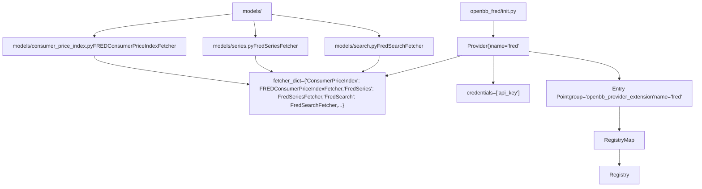
来源：[openbb_platform/providers/fred/openbb_fred/__init__.py1-106](https://github.com/OpenBB-finance/OpenBB/blob/dddc3b32/openbb_platform/providers/fred/openbb_fred/__init__.py#L1-L106) [openbb_platform/providers/fmp/openbb_fmp/__init__.py1-151](https://github.com/OpenBB-finance/OpenBB/blob/dddc3b32/openbb_platform/providers/fmp/openbb_fmp/__init__.py#L1-L151) [openbb_platform/providers/intrinio/openbb_intrinio/__init__.py1-112](https://github.com/OpenBB-finance/OpenBB/blob/dddc3b32/openbb_platform/providers/intrinio/openbb_intrinio/__init__.py#L1-L112)

### 注册映射构建

`RegistryMap` 类发现所有已安装的数据商，并构建一个全面的映射，说明哪些数据商支持哪些模型。

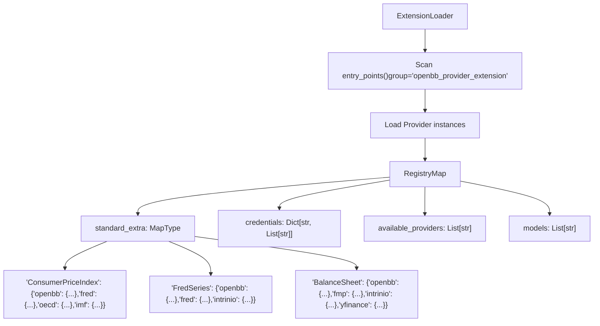
来源：[openbb_platform/core/openbb_core/provider/registry_map.py1-254](https://github.com/OpenBB-finance/OpenBB/blob/dddc3b32/openbb_platform/core/openbb_core/provider/registry_map.py#L1-L254) [openbb_platform/core/openbb_core/app/provider_interface.py98-119](https://github.com/OpenBB-finance/OpenBB/blob/dddc3b32/openbb_platform/core/openbb_core/app/provider_interface.py#L98-L119)

---

## 标准与额外参数及数据

### 标准/额外模式（Standard/Extra Pattern）

数据商架构采用双重模式方法，每个模型都定义了：

-   **标准参数/数据**：所有数据商共享的通用字段
-   **额外参数/数据**：特定数据商的扩展

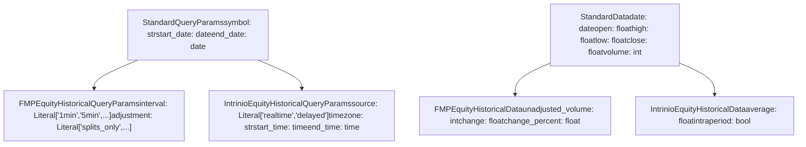
来源：[openbb_platform/core/openbb_core/app/provider_interface.py36-61](https://github.com/OpenBB-finance/OpenBB/blob/dddc3b32/openbb_platform/core/openbb_core/app/provider_interface.py#L36-L61) [openbb_platform/providers/fmp/openbb_fmp/models/equity_historical.py](https://github.com/OpenBB-finance/OpenBB/blob/dddc3b32/openbb_platform/providers/fmp/openbb_fmp/models/equity_historical.py) [openbb_platform/providers/intrinio/openbb_intrinio/models/equity_historical.py](https://github.com/OpenBB-finance/OpenBB/blob/dddc3b32/openbb_platform/providers/intrinio/openbb_intrinio/models/equity_historical.py)

### 运行时参数合并

`ProviderInterface` 通过组合标准字段和数据商特定字段，在运行时动态生成合并后的参数类。

**参数合并过程**

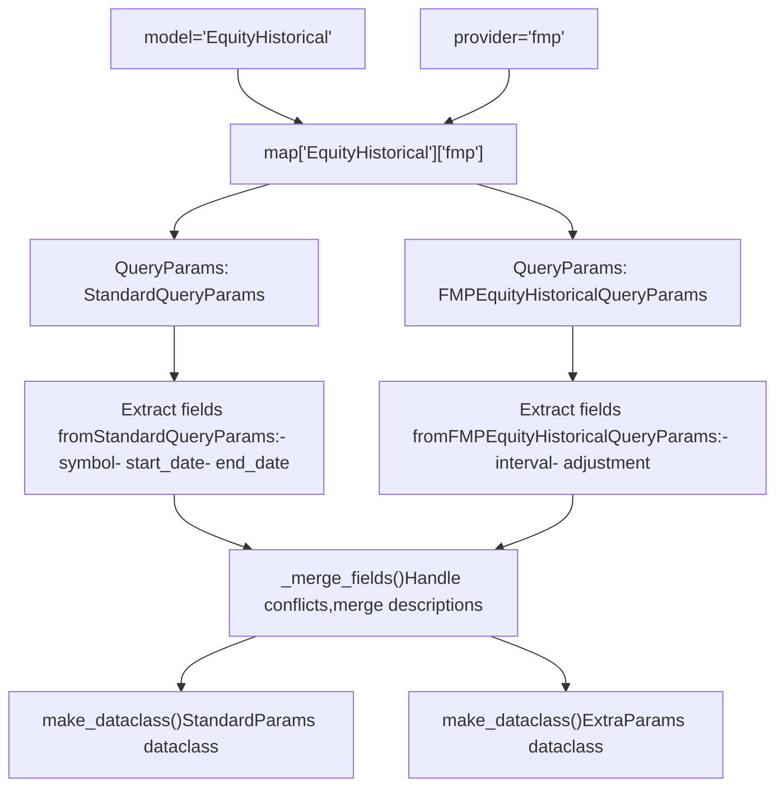
来源：[openbb_platform/core/openbb_core/app/provider_interface.py174-291](https://github.com/OpenBB-finance/OpenBB/blob/dddc3b32/openbb_platform/core/openbb_core/app/provider_interface.py#L174-L291) [openbb_platform/core/openbb_core/app/provider_interface.py293-410](https://github.com/OpenBB-finance/OpenBB/blob/dddc3b32/openbb_platform/core/openbb_core/app/provider_interface.py#L293-L410)

---

## 三阶段获取器模式（The Three-Stage Fetcher Pattern）

### Fetcher 抽象类

所有数据商实现都遵循由 `Fetcher` 抽象类定义的三阶段模式：

1.  **`transform_query`**：验证并转换输入参数
2.  **`extract_data`**（或 `aextract_data`）：从数据商 API 获取原始数据
3.  **`transform_data`**：将响应解析并验证为标准格式

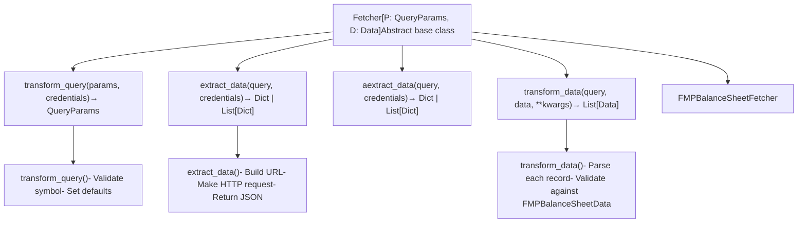
来源：[openbb_platform/core/openbb_core/provider/abstract/fetcher.py](https://github.com/OpenBB-finance/OpenBB/blob/dddc3b32/openbb_platform/core/openbb_core/provider/abstract/fetcher.py) [openbb_platform/providers/fmp/openbb_fmp/models/balance_sheet.py](https://github.com/OpenBB-finance/OpenBB/blob/dddc3b32/openbb_platform/providers/fmp/openbb_fmp/models/balance_sheet.py)

### 执行流程示例

**从 FMP 获取资产负债表数据**

> **[Mermaid 序列图]**
> *(图表结构无法解析)*

来源：[openbb_platform/core/openbb_core/provider/query_executor.py](https://github.com/OpenBB-finance/OpenBB/blob/dddc3b32/openbb_platform/core/openbb_core/provider/query_executor.py) [openbb_platform/providers/fmp/openbb_fmp/models/balance_sheet.py](https://github.com/OpenBB-finance/OpenBB/blob/dddc3b32/openbb_platform/providers/fmp/openbb_fmp/models/balance_sheet.py)

---

## ProviderInterface：动态模型生成

### ProviderInterface 单例

`ProviderInterface` 类作为一个单例，协调所有数据商交互并生成运行时类型定义。

**ProviderInterface 架构**

```mermaid
flowchart TD
    PI["ProviderInterfacemetaclass=SingletonMeta"]
    MAP["map: MapTypeFull provider/model mapping"]
    CREDS["credentials: Dict[str, List[str]]"]
    MODEL_PROV["model_providers: Dict[str, ProviderChoices]"]
    PARAMS["params: Dict[str, Dict[str, StandardParams | ExtraParams]]"]
    DATA["data: Dict[str, Dict[str, StandardData | ExtraData]]"]
    RET_SCHEMA["return_schema: Dict[str, Type[BaseModel]]"]
    GEN_PROV["_generate_model_providers_dc()"]
    GEN_PARAMS["_generate_params_dc()"]
    GEN_DATA["_generate_data_dc()"]
    GEN_SCHEMA["_generate_return_schema()"]
    CREATE_EXEC["create_executor() → QueryExecutor"]
    PC["ProviderChoices dataclassprovider: Literal['fred','fmp','intrinio',...]"]
    SP["StandardParams dataclasssymbol: str, start_date: date, ..."]
    EP["ExtraParams dataclassinterval: str, adjustment: str, ..."]
    RET["Return Schema (Pydantic)SerializeAsAny[Annotated[Union[  Annotated[FredData, Tag('fred')],  Annotated[FmpData, Tag('fmp')],  ...], Discriminator(...)]]"]

    PI --> MAP
    PI --> CREDS
    PI --> MODEL_PROV
    PI --> PARAMS
    PI --> DATA
    PI --> RET_SCHEMA
    PI --> GEN_PROV
    PI --> GEN_PARAMS
    PI --> GEN_DATA
    PI --> GEN_SCHEMA
    PI --> CREATE_EXEC
    GEN_PROV --> PC
    GEN_PARAMS --> SP
    GEN_PARAMS --> EP
    GEN_SCHEMA --> RET
```
来源：[openbb_platform/core/openbb_core/app/provider_interface.py70-173](https://github.com/OpenBB-finance/OpenBB/blob/dddc3b32/openbb_platform/core/openbb_core/app/provider_interface.py#L70-L173)

### 数据商选择生成

对于每个模型，`ProviderInterface` 会生成一个 `ProviderChoices` 数据类，其中包含一个带有所有可用数据商的 Literal 类型。

**示例：ConsumerPriceIndex 模型**

| 模型 | 可用数据商 | 生成的类型 |
| --- | --- | --- |
| `ConsumerPriceIndex` | `fred`, `oecd`, `imf` | `Literal["fred", "oecd", "imf"]` |
| `BalanceSheet` | `fmp`, `intrinio`, `yfinance` | `Literal["fmp", "intrinio", "yfinance"]` |
| `FredSeries` | `fred`, `intrinio` | `Literal["fred", "intrinio"]` |

来源：[openbb_platform/core/openbb_core/app/provider_interface.py412-445](https://github.com/OpenBB-finance/OpenBB/blob/dddc3b32/openbb_platform/core/openbb_core/app/provider_interface.py#L412-L445)

### 可鉴别联合返回类型（Discriminated Union Return Types）

`ProviderInterface` 为响应数据生成 Pydantic 可鉴别联合类型，允许 FastAPI 正确验证和序列化数据商特定字段。

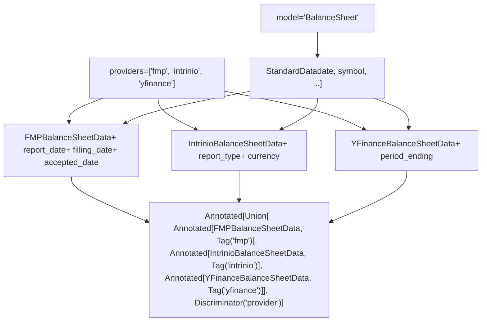
来源：[openbb_platform/core/openbb_core/app/provider_interface.py447-536](https://github.com/OpenBB-finance/OpenBB/blob/dddc3b32/openbb_platform/core/openbb_core/app/provider_interface.py#L447-L536)

---

## QueryExecutor：编排数据获取

### QueryExecutor 架构

`QueryExecutor` 类管理获取器的三阶段执行，处理同步和异步操作。

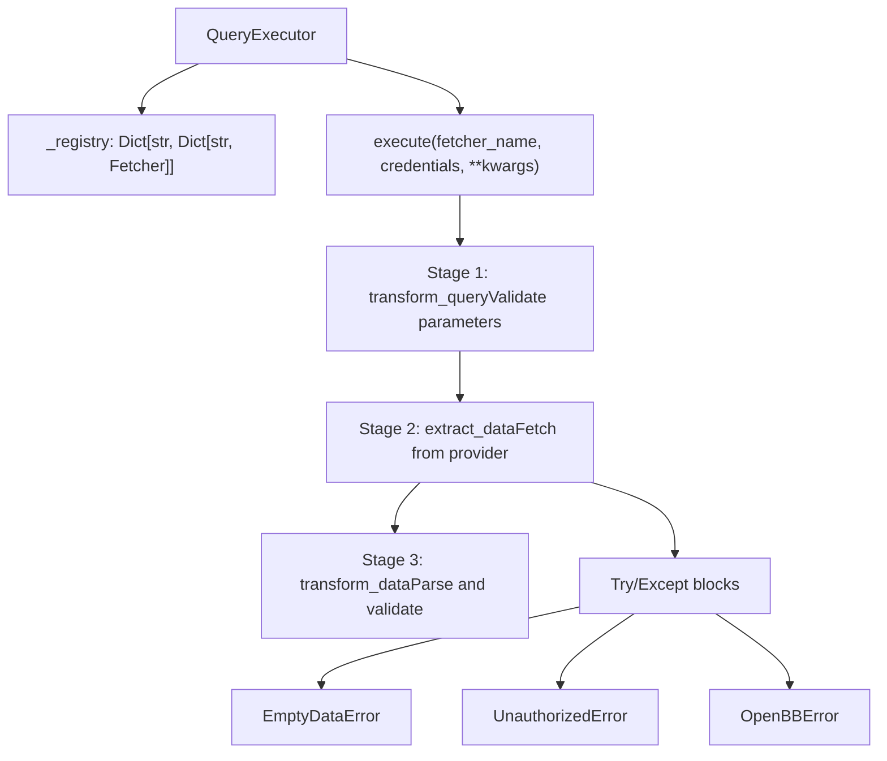
来源：[openbb_platform/core/openbb_core/provider/query_executor.py](https://github.com/OpenBB-finance/OpenBB/blob/dddc3b32/openbb_platform/core/openbb_core/provider/query_executor.py)

### 命令上下文中的执行流程

**从路由到数据商的完整流程**

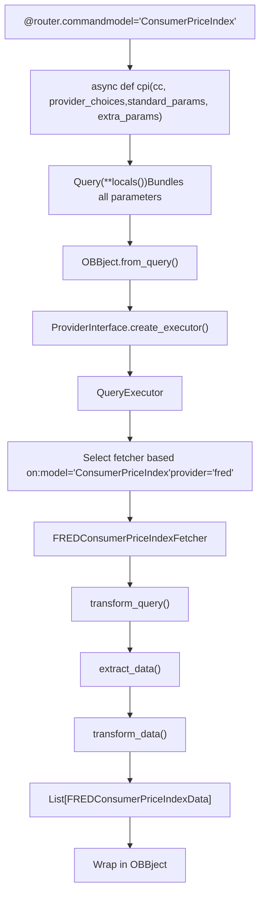
来源：[openbb_platform/extensions/economy/openbb_economy/economy_router.py66-96](https://github.com/OpenBB-finance/OpenBB/blob/dddc3b32/openbb_platform/extensions/economy/openbb_economy/economy_router.py#L66-L96) [openbb_platform/core/openbb_core/app/query.py](https://github.com/OpenBB-finance/OpenBB/blob/dddc3b32/openbb_platform/core/openbb_core/app/query.py) [openbb_platform/core/openbb_core/app/model/obbject.py](https://github.com/OpenBB-finance/OpenBB/blob/dddc3b32/openbb_platform/core/openbb_core/app/model/obbject.py)

---

## 路由与数据商集成

### 命令装饰器注入

`@router.command` 装饰器使用 `SignatureInspector` 将数据商相关的依赖项注入到命令签名中。

**SignatureInspector 流程**

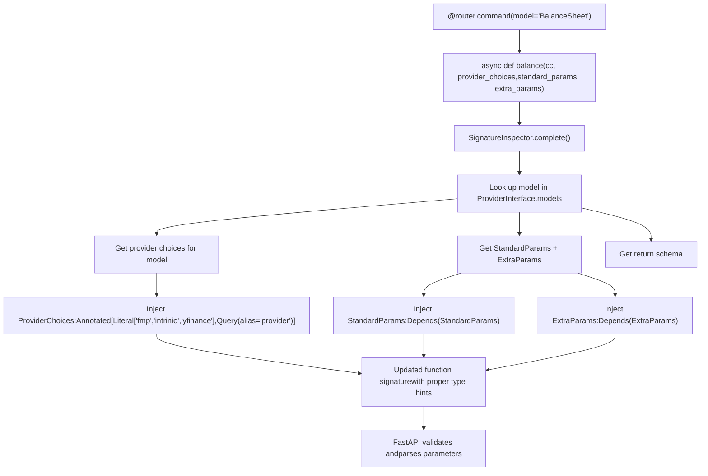
来源：[openbb_platform/core/openbb_core/app/router.py227-336](https://github.com/OpenBB-finance/OpenBB/blob/dddc3b32/openbb_platform/core/openbb_core/app/router.py#L227-L336) [openbb_platform/core/openbb_core/app/static/package_builder.py1149-1252](https://github.com/OpenBB-finance/OpenBB/blob/dddc3b32/openbb_platform/core/openbb_core/app/static/package_builder.py#L1149-L1252)

### 参数流示例

**示例：带有 FRED 数据商的 `obb.economy.cpi()`**

| 参数 | 来源 | 类型 | 默认值 |
| --- | --- | --- | --- |
| `country` | StandardParams | `str` | 必填 |
| `start_date` | StandardParams | `Optional[date]` | `None` |
| `end_date` | StandardParams | `Optional[date]` | `None` |
| `transform` | StandardParams (FRED) | `Optional[Literal["chg","pch",...]]` | `None` |
| `frequency` | ExtraParams (FRED) | `Optional[Literal["m","q","a"]]` | `None` |
| `harmonized` | ExtraParams (FRED) | `Optional[bool]` | `None` |
| `provider` | ProviderChoices | `Literal["fred","oecd","imf"]` | 用户选择 |

来源：[openbb_platform/providers/fred/openbb_fred/models/consumer_price_index.py](https://github.com/OpenBB-finance/OpenBB/blob/dddc3b32/openbb_platform/providers/fred/openbb_fred/models/consumer_price_index.py) [openbb_platform/extensions/economy/openbb_economy/economy_router.py66-96](https://github.com/OpenBB-finance/OpenBB/blob/dddc3b32/openbb_platform/extensions/economy/openbb_economy/economy_router.py#L66-L96)

---

## 测试数据商实现

### 集成测试模式

数据商实现使用参数化集成测试进行测试，验证每个获取器与多个参数组合的协同工作。

**测试结构**

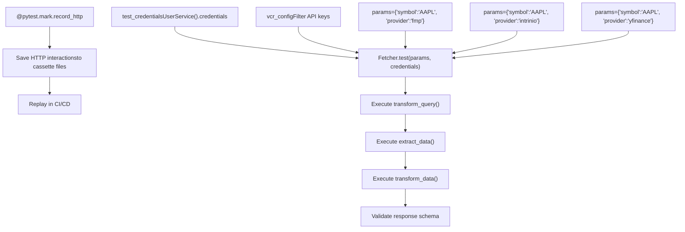
来源：[openbb_platform/extensions/equity/integration/test_equity_python.py21-58](https://github.com/OpenBB-finance/OpenBB/blob/dddc3b32/openbb_platform/extensions/equity/integration/test_equity_python.py#L21-L58) [openbb_platform/providers/fmp/tests/test_fmp_fetchers.py1-100](https://github.com/OpenBB-finance/OpenBB/blob/dddc3b32/openbb_platform/providers/fmp/tests/test_fmp_fetchers.py#L1-L100) [openbb_platform/providers/fred/tests/test_fred_fetchers.py1-100](https://github.com/OpenBB-finance/OpenBB/blob/dddc3b32/openbb_platform/providers/fred/tests/test_fred_fetchers.py#L1-L100)

### 示例：测试资产负债表获取器

**参数化测试用例**

```python
@pytest.mark.parametrize(
    "params",
    [
        {"symbol": "AAPL", "period": "annual", "limit": 12, "provider": "fmp"},
        {"symbol": "AAPL", "period": "quarter", "fiscal_year": 2014,
          "limit": 2, "provider": "intrinio"},
        {"symbol": "AAPL", "period": "annual", "limit": 5, "provider": "yfinance"},
    ],
)
@pytest.mark.integration
def test_equity_fundamental_balance(params, obb):
    result = obb.equity.fundamental.balance(**params)
    assert result
    assert isinstance(result, OBBject)
    assert len(result.results) > 0
```
来源：[openbb_platform/extensions/equity/integration/test_equity_python.py21-58](https://github.com/OpenBB-finance/OpenBB/blob/dddc3b32/openbb_platform/extensions/equity/integration/test_equity_python.py#L21-L58)

---

## 数据商特定注意事项

### 凭据管理

数据商在其注册中声明所需的凭据，这些凭据在执行前进行验证。

| 数据商 | 所需凭据 | 环境变量 |
| --- | --- | --- |
| FRED | `api_key` | `FRED_API_KEY` |
| FMP | `api_key` | `FMP_API_KEY` |
| Intrinio | `api_key` | `INTRINIO_API_KEY` |
| SEC | 无 | N/A |

来源：[openbb_platform/providers/fred/openbb_fred/__init__.py59-106](https://github.com/OpenBB-finance/OpenBB/blob/dddc3b32/openbb_platform/providers/fred/openbb_fred/__init__.py#L59-L106) [openbb_platform/providers/fmp/openbb_fmp/__init__.py141-151](https://github.com/OpenBB-finance/OpenBB/blob/dddc3b32/openbb_platform/providers/fmp/openbb_fmp/__init__.py#L141-L151) [openbb_platform/providers/intrinio/openbb_intrinio/__init__.py99-112](https://github.com/OpenBB-finance/OpenBB/blob/dddc3b32/openbb_platform/providers/intrinio/openbb_intrinio/__init__.py#L99-L112)

### 多数据商支持

支持多个数据商的命令会根据选择的数据商动态调整其参数类型和返回模式。

**示例：`EquityHistorical` 模型**

| 数据商 | 间隔选项 | 特殊参数 |
| --- | --- | --- |
| FMP | `1min`, `5min`, `15min`, `30min`, `1h`, `4h`, `1d` | `adjustment`, `extended_hours` |
| Intrinio | `1min`, `5min`, `15min`, `30min`, `1h`, `1d` | `source`, `timezone`, `start_time`, `end_time` |
| YFinance | `1m`, `2m`, `5m`, `15m`, `30m`, `60m`, `90m`, `1h`, `1d`, `5d`, `1wk`, `1mo`, `3mo` | `include_actions`, `adjustment` |
| Alpha Vantage | `1min`, `5min`, `15min`, `30min`, `60min` | `outputsize`, `datatype` |

来源：[openbb_platform/extensions/equity/integration/test_equity_python.py970-1131](https://github.com/OpenBB-finance/OpenBB/blob/dddc3b32/openbb_platform/extensions/equity/integration/test_equity_python.py#L970-L1131)

---

## 总结

数据商架构使 OpenBB Platform 能够：

1.  **抽象化数据源**：单个命令通过 `ProviderInterface` 与多个数据商协作
2.  **保持灵活性**：标准+额外模式保留了数据商的特定功能
3.  **类型安全**：运行时生成数据类和 Pydantic 模型，提供完整的类型验证
4.  **可扩展性**：新数据商通过实现三阶段 `Fetcher` 模式进行集成
5.  **测试**：参数化集成测试验证所有数据商/模型组合

**关键类与文件：**

| 组件 | 主要文件 | 目的 |
| --- | --- | --- |
| `ProviderInterface` | [openbb_core/app/provider_interface.py](https://github.com/OpenBB-finance/OpenBB/blob/dddc3b32/openbb_core/app/provider_interface.py) | 协调数据商发现和运行时类型生成 |
| `RegistryMap` | [openbb_core/provider/registry_map.py](https://github.com/OpenBB-finance/OpenBB/blob/dddc3b32/openbb_core/provider/registry_map.py) | 将数据商映射到模型并提取模式 |
| `QueryExecutor` | [openbb_core/provider/query_executor.py](https://github.com/OpenBB-finance/OpenBB/blob/dddc3b32/openbb_core/provider/query_executor.py) | 执行三阶段获取器模式 |
| `Fetcher` | [openbb_core/provider/abstract/fetcher.py](https://github.com/OpenBB-finance/OpenBB/blob/dddc3b32/openbb_core/provider/abstract/fetcher.py) | 所有数据商实现的基类 |
| `SignatureInspector` | [openbb_core/app/router.py227-336](https://github.com/OpenBB-finance/OpenBB/blob/dddc3b32/openbb_core/app/router.py#L227-L336) | 将数据商类型注入到命令签名中 |

来源：[openbb_platform/core/openbb_core/app/provider_interface.py1-536](https://github.com/OpenBB-finance/OpenBB/blob/dddc3b32/openbb_platform/core/openbb_core/app/provider_interface.py#L1-L536) [openbb_platform/core/openbb_core/provider/registry_map.py1-254](https://github.com/OpenBB-finance/OpenBB/blob/dddc3b32/openbb_platform/core/openbb_core/provider/registry_map.py#L1-L254) [openbb_platform/core/openbb_core/app/router.py1-400](https://github.com/OpenBB-finance/OpenBB/blob/dddc3b32/openbb_platform/core/openbb_core/app/router.py#L1-L400)
