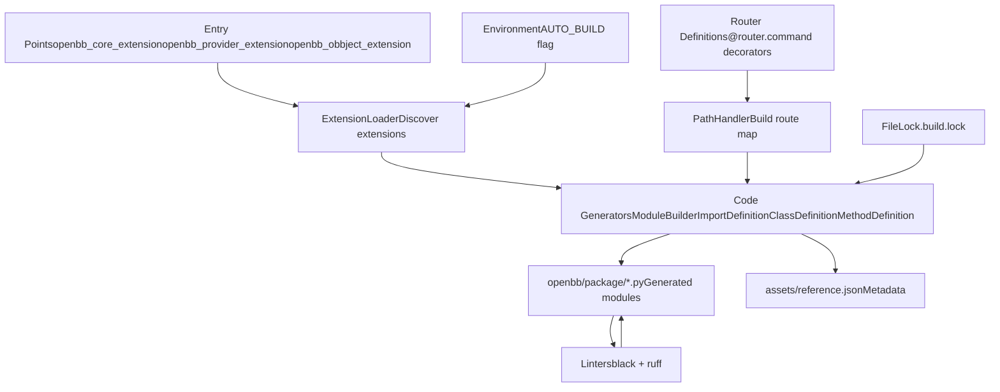
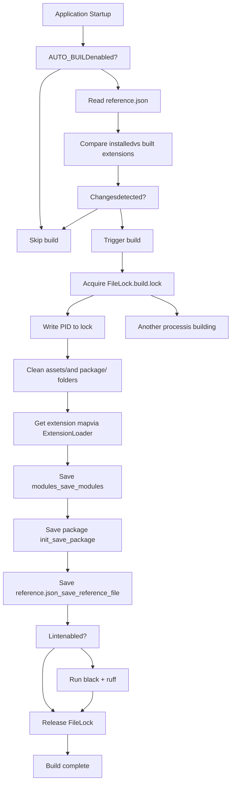
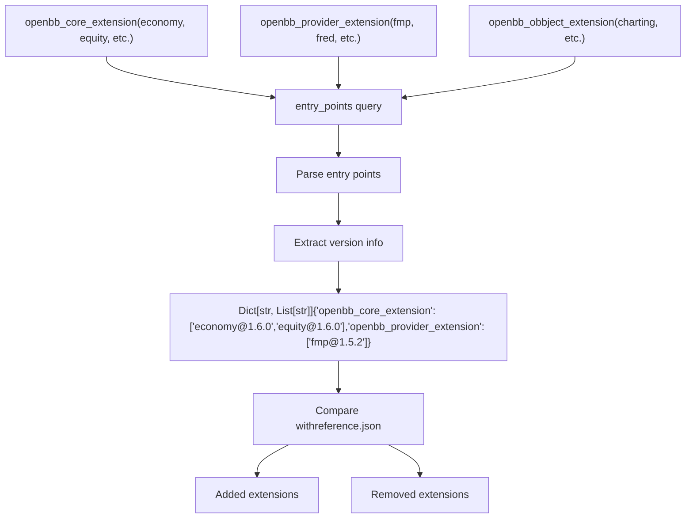
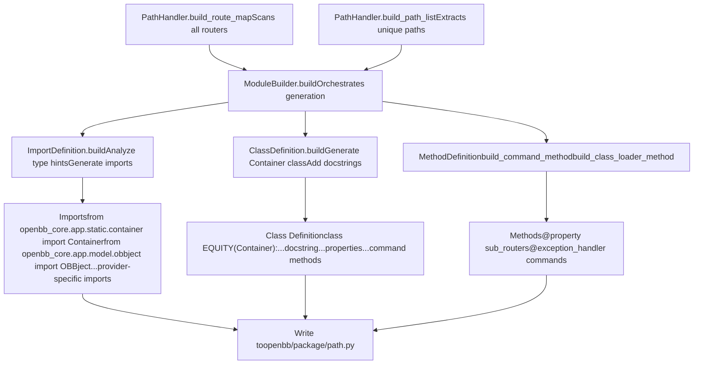
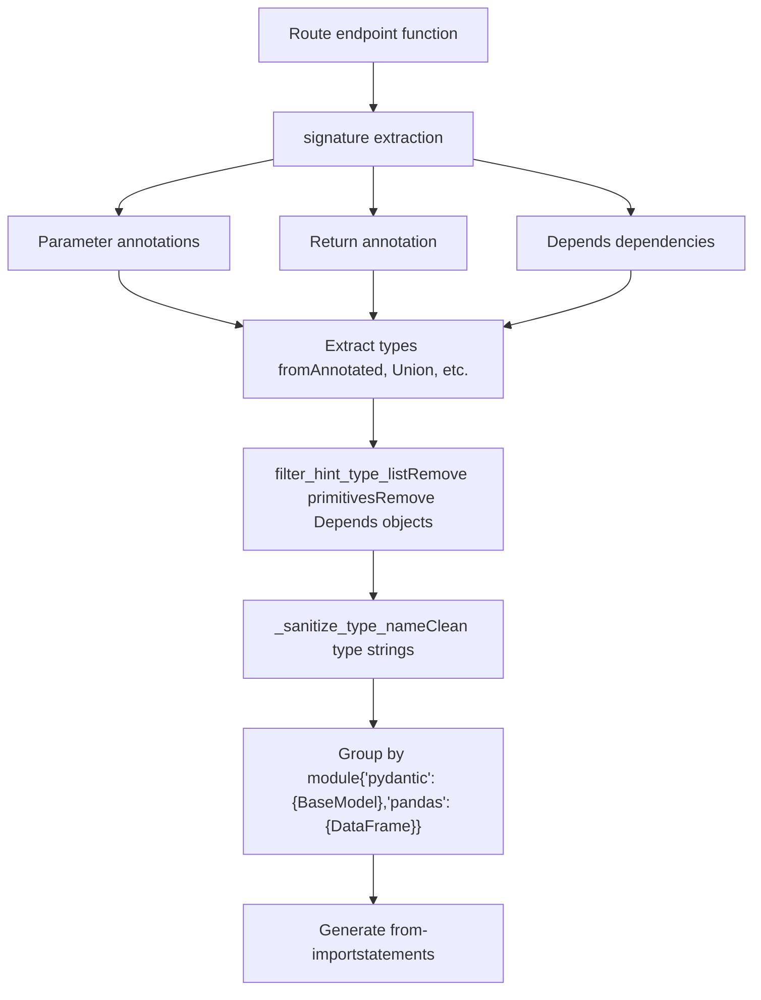
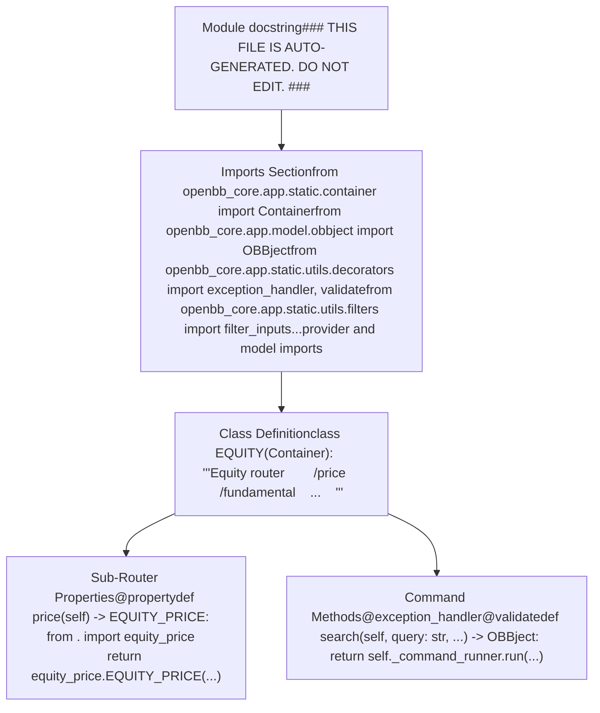
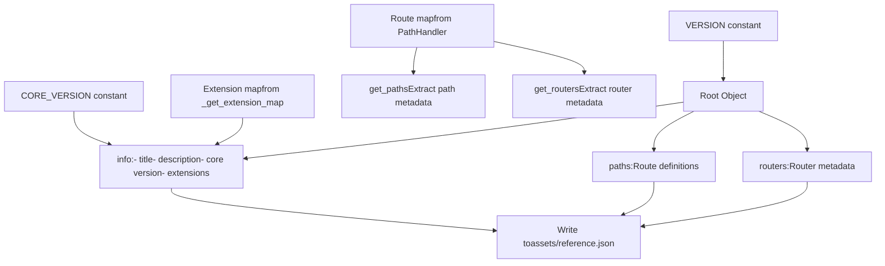
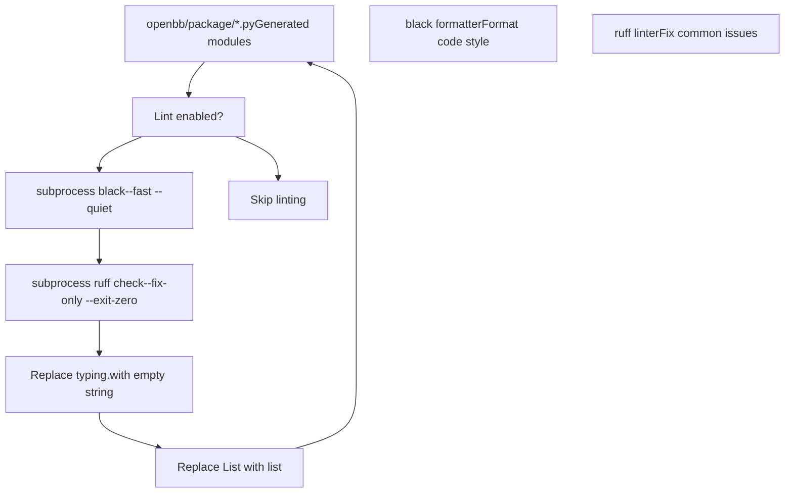
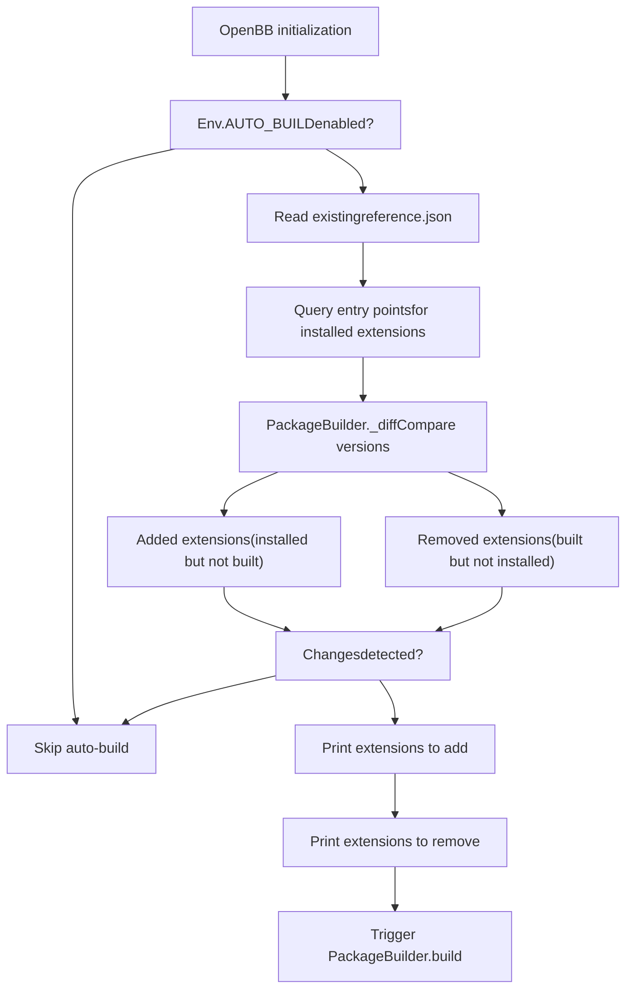
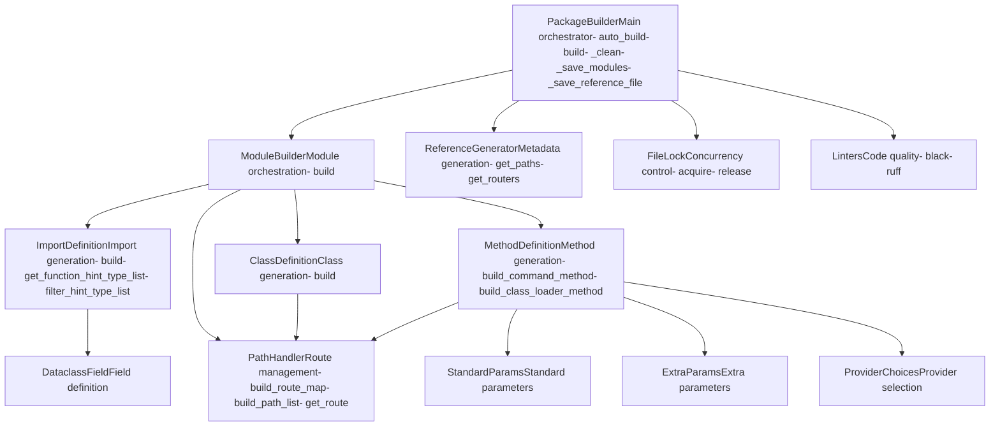

# 包构建器与代码生成

相关源文件

-   [cli/poetry.lock](https://github.com/OpenBB-finance/OpenBB/blob/dddc3b32/cli/poetry.lock)
-   [cli/tests/test_argparse_translator_obbject_registry.py](https://github.com/OpenBB-finance/OpenBB/blob/dddc3b32/cli/tests/test_argparse_translator_obbject_registry.py)
-   [openbb_platform/core/openbb/assets/reference.json](https://github.com/OpenBB-finance/OpenBB/blob/dddc3b32/openbb_platform/core/openbb/assets/reference.json)
-   [openbb_platform/core/openbb_core/api/app_loader.py](https://github.com/OpenBB-finance/OpenBB/blob/dddc3b32/openbb_platform/core/openbb_core/api/app_loader.py)
-   [openbb_platform/core/openbb_core/api/exception_handlers.py](https://github.com/OpenBB-finance/OpenBB/blob/dddc3b32/openbb_platform/core/openbb_core/api/exception_handlers.py)
-   [openbb_platform/core/openbb_core/api/rest_api.py](https://github.com/OpenBB-finance/OpenBB/blob/dddc3b32/openbb_platform/core/openbb_core/api/rest_api.py)
-   [openbb_platform/core/openbb_core/api/router/coverage.py](https://github.com/OpenBB-finance/OpenBB/blob/dddc3b32/openbb_platform/core/openbb_core/api/router/coverage.py)
-   [openbb_platform/core/openbb_core/app/provider_interface.py](https://github.com/OpenBB-finance/OpenBB/blob/dddc3b32/openbb_platform/core/openbb_core/app/provider_interface.py)
-   [openbb_platform/core/openbb_core/app/router.py](https://github.com/OpenBB-finance/OpenBB/blob/dddc3b32/openbb_platform/core/openbb_core/app/router.py)
-   [openbb_platform/core/openbb_core/app/static/package_builder.py](https://github.com/OpenBB-finance/OpenBB/blob/dddc3b32/openbb_platform/core/openbb_core/app/static/package_builder.py)
-   [openbb_platform/core/openbb_core/app/static/utils/filters.py](https://github.com/OpenBB-finance/OpenBB/blob/dddc3b32/openbb_platform/core/openbb_core/app/static/utils/filters.py)
-   [openbb_platform/core/openbb_core/app/utils.py](https://github.com/OpenBB-finance/OpenBB/blob/dddc3b32/openbb_platform/core/openbb_core/app/utils.py)
-   [openbb_platform/core/openbb_core/provider/registry_map.py](https://github.com/OpenBB-finance/OpenBB/blob/dddc3b32/openbb_platform/core/openbb_core/provider/registry_map.py)
-   [openbb_platform/core/openbb_core/provider/standard_models/fred_release_table.py](https://github.com/OpenBB-finance/OpenBB/blob/dddc3b32/openbb_platform/core/openbb_core/provider/standard_models/fred_release_table.py)
-   [openbb_platform/core/openbb_core/provider/standard_models/futures_curve.py](https://github.com/OpenBB-finance/OpenBB/blob/dddc3b32/openbb_platform/core/openbb_core/provider/standard_models/futures_curve.py)
-   [openbb_platform/core/openbb_core/provider/standard_models/yield_curve.py](https://github.com/OpenBB-finance/OpenBB/blob/dddc3b32/openbb_platform/core/openbb_core/provider/standard_models/yield_curve.py)
-   [openbb_platform/core/poetry.lock](https://github.com/OpenBB-finance/OpenBB/blob/dddc3b32/openbb_platform/core/poetry.lock)
-   [openbb_platform/core/pyproject.toml](https://github.com/OpenBB-finance/OpenBB/blob/dddc3b32/openbb_platform/core/pyproject.toml)
-   [openbb_platform/core/tests/app/static/test_filters.py](https://github.com/OpenBB-finance/OpenBB/blob/dddc3b32/openbb_platform/core/tests/app/static/test_filters.py)
-   [openbb_platform/core/tests/app/static/test_package_builder.py](https://github.com/OpenBB-finance/OpenBB/blob/dddc3b32/openbb_platform/core/tests/app/static/test_package_builder.py)
-   [openbb_platform/core/tests/app/test_platform_router.py](https://github.com/OpenBB-finance/OpenBB/blob/dddc3b32/openbb_platform/core/tests/app/test_platform_router.py)
-   [openbb_platform/core/tests/app/test_provider_interface.py](https://github.com/OpenBB-finance/OpenBB/blob/dddc3b32/openbb_platform/core/tests/app/test_provider_interface.py)
-   [openbb_platform/dev_install.py](https://github.com/OpenBB-finance/OpenBB/blob/dddc3b32/openbb_platform/dev_install.py)
-   [openbb_platform/extensions/devtools/poetry.lock](https://github.com/OpenBB-finance/OpenBB/blob/dddc3b32/openbb_platform/extensions/devtools/poetry.lock)
-   [openbb_platform/extensions/devtools/pyproject.toml](https://github.com/OpenBB-finance/OpenBB/blob/dddc3b32/openbb_platform/extensions/devtools/pyproject.toml)
-   [openbb_platform/obbject_extensions/charting/tests/test_charting.py](https://github.com/OpenBB-finance/OpenBB/blob/dddc3b32/openbb_platform/obbject_extensions/charting/tests/test_charting.py)
-   [openbb_platform/poetry.lock](https://github.com/OpenBB-finance/OpenBB/blob/dddc3b32/openbb_platform/poetry.lock)
-   [openbb_platform/providers/bls/openbb_bls/utils/helpers.py](https://github.com/OpenBB-finance/OpenBB/blob/dddc3b32/openbb_platform/providers/bls/openbb_bls/utils/helpers.py)
-   [openbb_platform/providers/cboe/openbb_cboe/models/futures_curve.py](https://github.com/OpenBB-finance/OpenBB/blob/dddc3b32/openbb_platform/providers/cboe/openbb_cboe/models/futures_curve.py)
-   [openbb_platform/providers/cboe/tests/test_cboe_fetchers.py](https://github.com/OpenBB-finance/OpenBB/blob/dddc3b32/openbb_platform/providers/cboe/tests/test_cboe_fetchers.py)
-   [openbb_platform/providers/fred/openbb_fred/models/release_table.py](https://github.com/OpenBB-finance/OpenBB/blob/dddc3b32/openbb_platform/providers/fred/openbb_fred/models/release_table.py)
-   [openbb_platform/providers/yfinance/poetry.lock](https://github.com/OpenBB-finance/OpenBB/blob/dddc3b32/openbb_platform/providers/yfinance/poetry.lock)
-   [openbb_platform/pyproject.toml](https://github.com/OpenBB-finance/OpenBB/blob/dddc3b32/openbb_platform/pyproject.toml)

## 目的与范围

包构建器（Package Builder）系统负责为 OpenBB Platform 动态生成 Python SDK 代码。它通过入口点发现已安装的扩展，分析它们的路由结构，并生成带有正确类层次结构、方法签名和文档的 Python 模块。该系统确保平台的 API 表面能够自动适应已安装的扩展，而无需手动更新代码。

有关扩展如何在运行时加载的信息，请参见 [扩展系统](/OpenBB-finance/OpenBB/2.2-extension-system)。有关使用生成代码的命令执行流水线的详细信息，请参见 [命令执行流水线](/OpenBB-finance/OpenBB/2.1-command-execution-pipeline)。

---

## 系统概述

包构建器通过动态生成模块、类和方法，将路由定义转换为可导航的 Python API。该系统通过 `openbb-build` 命令手动触发，或在启用 `AUTO_BUILD` 时在启动时自动触发。


**来源：** [openbb_platform/core/openbb_core/app/static/package_builder.py1-361](https://github.com/OpenBB-finance/OpenBB/blob/dddc3b32/openbb_platform/core/openbb_core/app/static/package_builder.py#L1-L361)

---

## 构建过程流程

构建过程遵循一个结构化的序列，并带有文件锁，以防止并发构建和自动清理陈旧产物。


**构建方法实现：**

构建过程由 `PackageBuilder.build()` 编排，它使用文件锁来确保一次只有一个构建在运行。

| 步骤 | 方法 | 目的 |
| --- | --- | --- |
| 1 | `_clean()` | 移除现有的 `assets/` 和 `package/` 目录 |
| 2 | `_get_extension_map()` | 查询已安装扩展的入口点 |
| 3 | `_save_modules()` | 生成 Python 模块文件 |
| 4 | `_save_package()` | 创建包 `__init__.py` |
| 5 | `_save_reference_file()` | 生成 `reference.json` 元数据 |
| 6 | `_run_linters()` | 使用 black 和 ruff 格式化代码 |

**来源：** [openbb_platform/core/openbb_core/app/static/package_builder.py149-206](https://github.com/OpenBB-finance/OpenBB/blob/dddc3b32/openbb_platform/core/openbb_core/app/static/package_builder.py#L149-L206) [openbb_platform/core/openbb_core/app/static/package_builder.py207-216](https://github.com/OpenBB-finance/OpenBB/blob/dddc3b32/openbb_platform/core/openbb_core/app/static/package_builder.py#L207-L216)

---

## 扩展发现

系统通过 Python 入口点发现扩展，并将它们分为三组：核心扩展（core extensions）、数据商扩展（provider extensions）和 OBBject 扩展。


**扩展映射结构：**

`_get_extension_map()` 方法创建一个字典，将入口点组映射到带有版本的扩展列表：

```json
{    "openbb_core_extension": [        "commodity@1.5.0",        "economy@1.6.0",        "equity@1.6.0",        ...    ],    "openbb_provider_extension": [        "fmp@1.5.2",        "fred@1.5.1",        ...    ],    "openbb_obbject_extension": [        "openbb_charting@2.5.0"    ]}
```
**来源：** [openbb_platform/core/openbb_core/app/static/package_builder.py218-228](https://github.com/OpenBB-finance/OpenBB/blob/dddc3b32/openbb_platform/core/openbb_core/app/static/package_builder.py#L218-L228) [openbb_platform/core/openbb_core/app/static/package_builder.py317-360](https://github.com/OpenBB-finance/OpenBB/blob/dddc3b32/openbb_platform/core/openbb_core/app/static/package_builder.py#L317-L360)

---

## 代码生成流水线

代码生成流水线处理路由结构，以创建具有正确类层次结构和方法签名的 Python 模块。


**模块生成过程：**

对于路径列表中的每个路径，`ModuleBuilder.build()` 生成一个完整的 Python 模块：

1.  **导入生成**（`ImportDefinition.build`）：

    -   扫描函数签名的类型提示
    -   从 `Annotated`、`Union`、`Optional` 中提取类型
    -   过滤原始类型和内置类型
    -   按模块分组导入
    -   生成 from-import 语句
2.  **类生成**（`ClassDefinition.build`）：

    -   创建 `Container` 子类
    -   生成列出子路由的文档字符串
    -   添加 `__repr__` 方法
    -   在根模块中包含扩展信息
3.  **方法生成**（`MethodDefinition`）：

    -   `build_command_method`：端点的全签名方法
    -   `build_class_loader_method`：子路由的属性方法

**来源：** [openbb_platform/core/openbb_core/app/static/package_builder.py363-374](https://github.com/OpenBB-finance/OpenBB/blob/dddc3b32/openbb_platform/core/openbb_core/app/static/package_builder.py#L363-L374) [openbb_platform/core/openbb_core/app/static/package_builder.py377-664](https://github.com/OpenBB-finance/OpenBB/blob/dddc3b32/openbb_platform/core/openbb_core/app/static/package_builder.py#L377-L664) [openbb_platform/core/openbb_core/app/static/package_builder.py667-759](https://github.com/OpenBB-finance/OpenBB/blob/dddc3b32/openbb_platform/core/openbb_core/app/static/package_builder.py#L667-L759)

---

## 导入定义生成

`ImportDefinition` 类分析函数签名以确定所需的导入，处理复杂的类型注解和依赖项。


**类型提示处理：**

系统处理几种类型注解模式：

| 模式 | 示例 | 处理方式 |
| --- | --- | --- |
| `Annotated` | `Annotated[str, Field(...)]` | 提取基类，处理元数据 |
| `Union` | `Union[int, str]` | 提取所有联合成员 |
| `Depends` | `Depends(get_credentials)` | 将依赖函数添加到导入中 |
| `Optional` | `Optional[DataFrame]` | 提取包装的类型 |
| `List[T]` | `List[BaseModel]` | 提取泛型参数 |

**过滤逻辑：**

`filter_hint_type_list()` 方法移除：

-   `Parameter._empty` 哨兵值
-   原始类型：`int`, `float`, `str`, `bool`, `list`, `dict`, `tuple`, `set`
-   来自 FastAPI 的 `Depends` 对象
-   元数据中包含 `Depends` 的 Annotated 类型
-   来自 `builtins` 模块的类型

**来源：** [openbb_platform/core/openbb_core/app/static/package_builder.py377-455](https://github.com/OpenBB-finance/OpenBB/blob/dddc3b32/openbb_platform/core/openbb_core/app/static/package_builder.py#L377-L455) [openbb_platform/core/openbb_core/app/static/package_builder.py456-526](https://github.com/OpenBB-finance/OpenBB/blob/dddc3b32/openbb_platform/core/openbb_core/app/static/package_builder.py#L456-L526) [openbb_platform/core/openbb_core/app/static/package_builder.py528-664](https://github.com/OpenBB-finance/OpenBB/blob/dddc3b32/openbb_platform/core/openbb_core/app/static/package_builder.py#L528-L664)

---

## 类与方法生成

`ClassDefinition` 和 `MethodDefinition` 类生成具有正确方法签名和文档的 Container 子类。

**命令方法生成：**

为具有端点函数的路由生成命令方法：

```python
# 生成的命令方法结构
@exception_handler
@validate
def historical(
    self,
    symbol: Annotated[str, OpenBBField(...)],
    provider: Annotated[Literal["fmp", "yfinance"], OpenBBField(...)] = "fmp",
    **kwargs
) -> OBBject:
    """[包含参数描述和示例的文档字符串]"""
    return self._command_runner.run(
        "/equity/price/historical",
        **filter_inputs(provider_choices=..., standard_params=..., extra_params=...)
    )
```
**加载器类的方法生成：**

为具有子路由的路径生成子路由属性：

```python
# 为子路由生成的属性
@property
def price(self):
    """Equity price data sub-router."""
    from . import equity_price
        return equity_price.EQUITY_PRICE(command_runner=self._command_runner)
```
**类型扩展：**

`TYPE_EXPANSION` 字典定义了应该接受更广泛输入的类型：

| 字段名 | 标准类型 | 扩展类型 |
| --- | --- | --- |
| `data` | `Data` | `DataProcessingSupportedTypes` |
| `start_date` | `date` | `str` (同时也接受字符串) |
| `end_date` | `date` | `str` (同时也接受字符串) |
| `date` | `date` | `str` (同时也接受字符串) |
| `provider` | `Literal[...]` | `None` (经过特殊处理) |

**来源：** [openbb_platform/core/openbb_core/app/static/package_builder.py667-759](https://github.com/OpenBB-finance/OpenBB/blob/dddc3b32/openbb_platform/core/openbb_core/app/static/package_builder.py#L667-L759) [openbb_platform/core/openbb_core/app/static/package_builder.py762-938](https://github.com/OpenBB-finance/OpenBB/blob/dddc3b32/openbb_platform/core/openbb_core/app/static/package_builder.py#L762-L938)

---

## 生成的模块结构

每个生成的模块都遵循一致的结构，包括导入、类定义和方法。


**文件组织：**

生成的文件按路径层次结构组织：

```text
openbb/
├── package/
│   ├── __init__.py              # 自动生成的包标记
│   ├── equity.py                # /equity 路由
│   ├── equity_price.py          # /equity/price 路由
│   ├── equity_fundamental.py    # /equity/fundamental 路由
│   ├── economy.py               # /economy 路由
│   └── ...
└── assets/
    └── reference.json           # 关于生成代码的元数据
```
**来源：** [openbb_platform/core/openbb_core/app/static/package_builder.py230-260](https://github.com/OpenBB-finance/OpenBB/blob/dddc3b32/openbb_platform/core/openbb_core/app/static/package_builder.py#L230-L260) [openbb_platform/core/openbb_core/app/static/package_builder.py261-266](https://github.com/OpenBB-finance/OpenBB/blob/dddc3b32/openbb_platform/core/openbb_core/app/static/package_builder.py#L261-L266)

---

## Reference.json 生成

`reference.json` 文件存储有关生成代码的元数据，包括版本信息、已安装的扩展以及路由映射。


**Reference.json 模式：**

```json
{    "openbb": "1.6.0",    "info": {        "title": "OpenBB Platform (Python)",        "description": "Investment research for everyone, anywhere.",        "core": "1.6.0",        "extensions": {            "openbb_core_extension": [                "economy@1.6.0",                "equity@1.6.0"            ],            "openbb_provider_extension": [                "fmp@1.5.2",                "fred@1.5.1"            ],            "openbb_obbject_extension": [                "openbb_charting@2.5.0"            ]        }    },    "paths": {        "/equity/price/historical": {            "description": "...",            "parameters": [...],            "returns": {...}        }    },    "routers": {        "/equity": {            "description": "Equity data router"        }    }}
```
**来源：** [openbb_platform/core/openbb_core/app/static/package_builder.py268-285](https://github.com/OpenBB-finance/OpenBB/blob/dddc3b32/openbb_platform/core/openbb_core/app/static/package_builder.py#L268-L285) [openbb_platform/core/openbb/assets/reference.json1-15](https://github.com/OpenBB-finance/OpenBB/blob/dddc3b32/openbb_platform/core/openbb/assets/reference.json#L1-L15)

---

## 代码格式化与质量控制

构建过程包括自动代码格式化和 linting，以确保生成的代码符合质量标准。


**Linting 配置：**

`Linters` 类运行两个格式化程序：

| 工具 | 命令 | 目的 |
| --- | --- | --- |
| `black` | `black --fast --quiet <dir>` | 保持代码风格一致 |
| `ruff` | `ruff check --fix-only --exit-zero <dir>` | 修复常见的 linting 问题 |

**字符串处理：**

生成的代码在写入期间会进行字符串替换：

-   移除 `typing.` 前缀，以使导入更简洁
-   将 `List` 替换为 `list`，以兼容 Python 3.10+
-   将 `Dict` 替换为 `dict`，以兼容 Python 3.10+

**来源：** [openbb_platform/core/openbb_core/app/static/package_builder.py287-292](https://github.com/OpenBB-finance/OpenBB/blob/dddc3b32/openbb_platform/core/openbb_core/app/static/package_builder.py#L287-L292) [openbb_platform/core/openbb_core/app/static/package_builder.py294-304](https://github.com/OpenBB-finance/OpenBB/blob/dddc3b32/openbb_platform/core/openbb_core/app/static/package_builder.py#L294-L304)

---

## 自动构建系统

自动构建系统检测已安装扩展的更改，并在必要时自动重新构建包。


**更改检测算法：**

`_diff()` 方法比较扩展集：

```python
def _diff(ext_map: dict) -> tuple[set[str], set[str]]:
    """
    返回：
        (added, removed) 其中：
        - added: 已安装但不在 reference.json 中
        - removed: 在 reference.json 中但未安装
    """
    for group in ["openbb_core_extension", "openbb_provider_extension", "openbb_obbject_extension"]:
        built = set(ext_map.get(group, {}))  # 来自 reference.json
        installed = set(entry_points(group=group))  # 来自环境
        add = add.union(installed - built)
        remove = remove.union(built - installed)
        return add, remove
```
**输出示例：**

检测到更改时，系统打印：

```text
Extensions to add: economy@1.6.0, equity@1.6.0
Extensions to remove: old_extension@1.0.0

Building...
```
**来源：** [openbb_platform/core/openbb_core/app/static/package_builder.py149-167](https://github.com/OpenBB-finance/OpenBB/blob/dddc3b32/openbb_platform/core/openbb_core/app/static/package_builder.py#L149-L167) [openbb_platform/core/openbb_core/app/static/package_builder.py317-360](https://github.com/OpenBB-finance/OpenBB/blob/dddc3b32/openbb_platform/core/openbb_core/app/static/package_builder.py#L317-L360)

---

## 文件锁机制

`FileLock` 类提供跨平台文件锁，以防止并发构建损坏生成的代码。

**锁文件用法：**

`.build.lock` 文件有两个用途：

1.  **进程同步**：防止多个构建进程同时运行
2.  **进程跟踪**：存储构建进程的 PID，用于调试

**获取锁的流程：**

```python
# 非阻塞获取尝试
with open(".build.lock", "w") as lock_file:
    file_lock = FileLock(lock_file)
    try:
        file_lock.acquire(blocking=False)  # 如果已锁定则引发 BlockingIOError

        # 写入 PID 用于调试
        lock_file.write(str(os.getpid()))
        lock_file.flush()

        # 执行构建操作
        self._clean()
        self._save_modules()
        # ...
            except BlockingIOError:
        raise RuntimeError("Another build process is running")
    finally:
        file_lock.release()
```
**特定平台的实现：**

| 平台 | 模块 | 锁定函数 | 解锁函数 |
| --- | --- | --- | --- |
| 类 Unix | `fcntl` | `fcntl.flock(fd, LOCK_EX)` | `fcntl.flock(fd, LOCK_UN)` |
| Windows | `msvcrt` | `msvcrt.locking(fd, LK_LOCK, 1)` | `msvcrt.locking(fd, LK_UNLCK, 1)` |

**来源：** [openbb_platform/core/openbb_core/app/static/package_builder.py95-132](https://github.com/OpenBB-finance/OpenBB/blob/dddc3b32/openbb_platform/core/openbb_core/app/static/package_builder.py#L95-L132) [openbb_platform/core/openbb_core/app/static/package_builder.py169-206](https://github.com/OpenBB-finance/OpenBB/blob/dddc3b32/openbb_platform/core/openbb_core/app/static/package_builder.py#L169-L206)

---

## 关键类及其角色

包构建器系统被组织成几个专门的类，每个类负责代码生成的特定方面。


**类的职责：**

| 类 | 文件位置 | 主要职责 |
| --- | --- | --- |
| `PackageBuilder` | [openbb_core/app/static/package_builder.py134-361](https://github.com/OpenBB-finance/OpenBB/blob/dddc3b32/openbb_core/app/static/package_builder.py#L134-L361) | 编排整个构建过程，管理文件 I/O |
| `ModuleBuilder` | [openbb_core/app/static/package_builder.py363-374](https://github.com/OpenBB-finance/OpenBB/blob/dddc3b32/openbb_platform/core/openbb_core/app/static/package_builder.py#L363-L374) | 通过协调子生成器构建完整的模块代码 |
| `ImportDefinition` | [openbb_core/app/static/package_builder.py377-664](https://github.com/OpenBB-finance/OpenBB/blob/dddc3b32/openbb_platform/core/openbb_core/app/static/package_builder.py#L377-L664) | 分析类型提示并生成导入语句 |
| `ClassDefinition` | [openbb_core/app/static/package_builder.py667-759](https://github.com/OpenBB-finance/OpenBB/blob/dddc3b32/openbb_platform/core/openbb_core/app/static/package_builder.py#L667-L759) | 生成具有文档字符串的 `Container` 子类定义 |
| `MethodDefinition` | [openbb_core/app/static/package_builder.py762-1155](https://github.com/OpenBB-finance/OpenBB/blob/dddc3b32/openbb_platform/core/openbb_core/app/static/package_builder.py#L762-L1155) | 生成命令方法和子路由的属性方法 |
| `PathHandler` | [openbb_core/app/static/package_builder.py1158-1389](https://github.com/OpenBB-finance/OpenBB/blob/dddc3b32/openbb_platform/core/openbb_core/app/static/package_builder.py#L1158-L1389) | 管理路由映射和路径层次结构 |
| `ReferenceGenerator` | [openbb_core/app/static/package_builder.py1392-1533](https://github.com/OpenBB-finance/OpenBB/blob/dddc3b32/openbb_platform/core/openbb_core/app/static/package_builder.py#L1392-L1533) | 生成 `reference.json` 的元数据 |
| `FileLock` | [openbb_core/app/static/package_builder.py95-132](https://github.com/OpenBB-finance/OpenBB/blob/dddc3b32/openbb_platform/core/openbb_core/app/static/package_builder.py#L95-L132) | 为构建同步提供跨平台文件锁 |
| `Linters` | [openbb_core/app/static/utils/linters.py](https://github.com/OpenBB-finance/OpenBB/blob/dddc3b32/openbb_core/app/static/utils/linters.py) | 对生成的代码运行 black 和 ruff 格式化程序 |

**与核心系统的集成：**

包构建器与几个核心系统集成：

1.  **ExtensionLoader**：通过入口点发现已安装的扩展
2.  **RouterLoader**：提供用于分析的路由定义
3.  **ProviderInterface**：提供参数的类型信息
4.  **SystemService**：提供版本信息

**来源：** [openbb_platform/core/openbb_core/app/static/package_builder.py134-1533](https://github.com/OpenBB-finance/OpenBB/blob/dddc3b32/openbb_platform/core/openbb_core/app/static/package_builder.py#L134-L1533)

---

## 命令入口点

包构建器通过 `openbb-build` 入口点作为命令行工具公开。

**入口点配置：**

`openbb-core` 包在 `pyproject.toml` 中定义了一个脚本入口点：

```toml
[tool.poetry.scripts]
openbb-build = "openbb_core.build:main"
```
这允许用户运行：

```bash
openbb-build
```
这将手动触发构建过程，对于以下情况很有用：

-   安装扩展后强制重新构建
-   开发期间重新生成代码
-   排除构建问题
