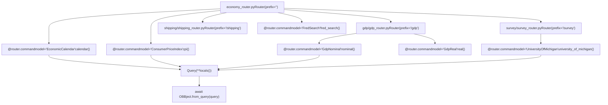
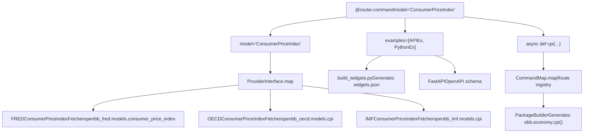
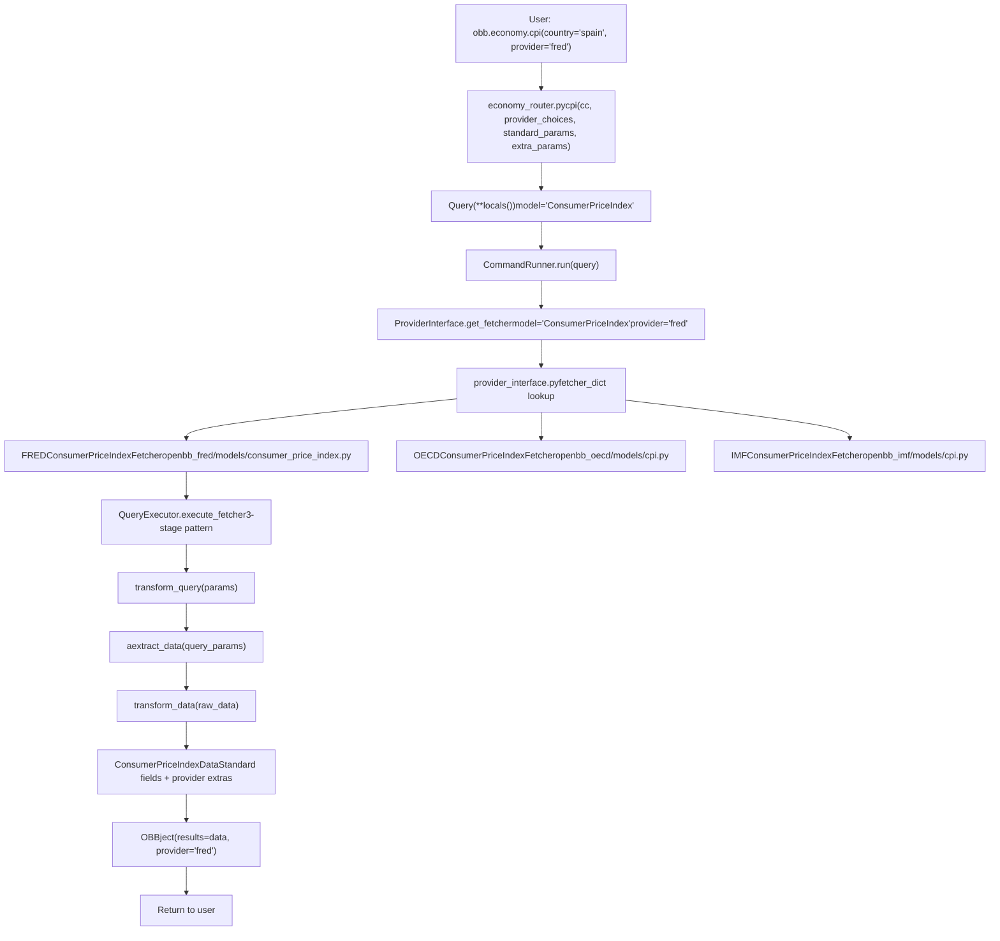
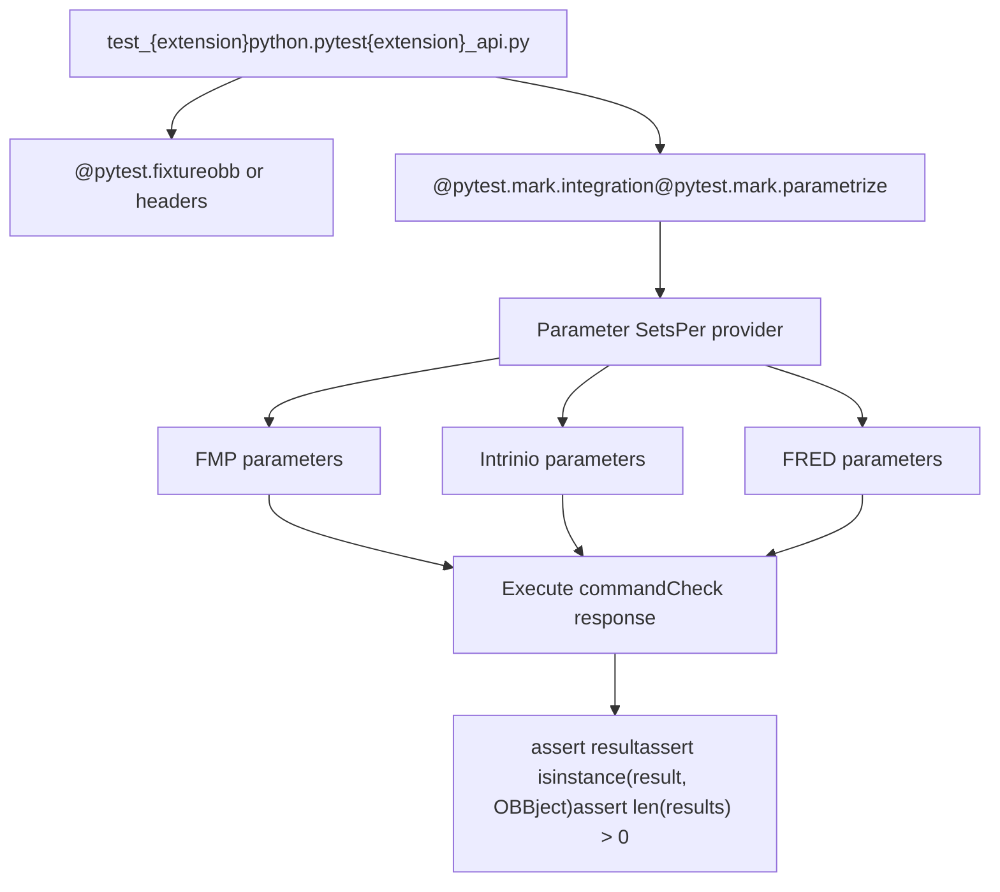
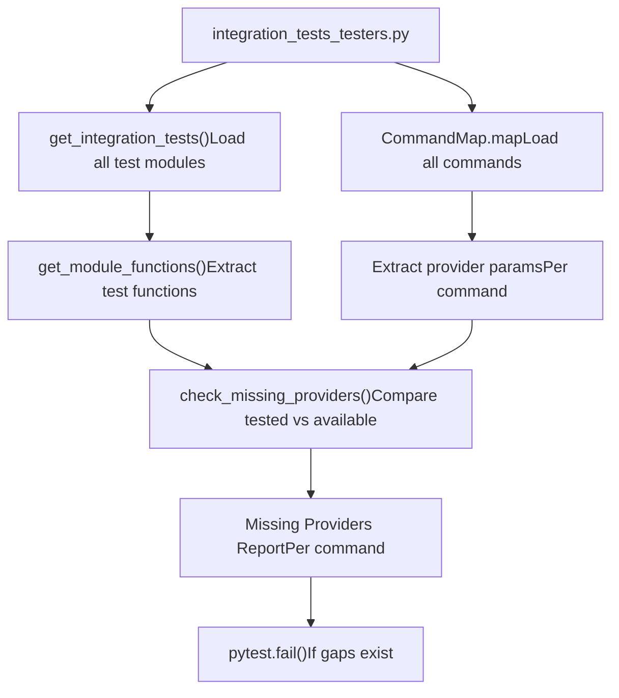

# 数据扩展

相关源文件

-   [cli/poetry.lock](https://github.com/OpenBB-finance/OpenBB/blob/dddc3b32/cli/poetry.lock)
-   [openbb\_platform/core/openbb/assets/reference.json](https://github.com/OpenBB-finance/OpenBB/blob/dddc3b32/openbb_platform/core/openbb/assets/reference.json)
-   [openbb\_platform/core/openbb\_core/app/model/charts/chart.py](https://github.com/OpenBB-finance/OpenBB/blob/dddc3b32/openbb_platform/core/openbb_core/app/model/charts/chart.py)
-   [openbb\_platform/core/openbb\_core/provider/standard\_models/company\_filings.py](https://github.com/OpenBB-finance/OpenBB/blob/dddc3b32/openbb_platform/core/openbb_core/provider/standard_models/company_filings.py)
-   [openbb\_platform/core/openbb\_core/provider/standard\_models/primary\_dealer\_fails.py](https://github.com/OpenBB-finance/OpenBB/blob/dddc3b32/openbb_platform/core/openbb_core/provider/standard_models/primary_dealer_fails.py)
-   [openbb\_platform/core/poetry.lock](https://github.com/OpenBB-finance/OpenBB/blob/dddc3b32/openbb_platform/core/poetry.lock)
-   [openbb\_platform/core/pyproject.toml](https://github.com/OpenBB-finance/OpenBB/blob/dddc3b32/openbb_platform/core/pyproject.toml)
-   [openbb\_platform/core/tests/app/model/charts/test\_chart.py](https://github.com/OpenBB-finance/OpenBB/blob/dddc3b32/openbb_platform/core/tests/app/model/charts/test_chart.py)
-   [openbb\_platform/dev\_install.py](https://github.com/OpenBB-finance/OpenBB/blob/dddc3b32/openbb_platform/dev_install.py)
-   [openbb\_platform/extensions/devtools/poetry.lock](https://github.com/OpenBB-finance/OpenBB/blob/dddc3b32/openbb_platform/extensions/devtools/poetry.lock)
-   [openbb\_platform/extensions/devtools/pyproject.toml](https://github.com/OpenBB-finance/OpenBB/blob/dddc3b32/openbb_platform/extensions/devtools/pyproject.toml)
-   [openbb\_platform/extensions/economy/integration/test\_economy\_api.py](https://github.com/OpenBB-finance/OpenBB/blob/dddc3b32/openbb_platform/extensions/economy/integration/test_economy_api.py)
-   [openbb\_platform/extensions/economy/integration/test\_economy\_python.py](https://github.com/OpenBB-finance/OpenBB/blob/dddc3b32/openbb_platform/extensions/economy/integration/test_economy_python.py)
-   [openbb\_platform/extensions/economy/openbb\_economy/economy\_router.py](https://github.com/OpenBB-finance/OpenBB/blob/dddc3b32/openbb_platform/extensions/economy/openbb_economy/economy_router.py)
-   [openbb\_platform/extensions/economy/openbb\_economy/survey/survey\_router.py](https://github.com/OpenBB-finance/OpenBB/blob/dddc3b32/openbb_platform/extensions/economy/openbb_economy/survey/survey_router.py)
-   [openbb\_platform/extensions/equity/integration/test\_equity\_api.py](https://github.com/OpenBB-finance/OpenBB/blob/dddc3b32/openbb_platform/extensions/equity/integration/test_equity_api.py)
-   [openbb\_platform/extensions/equity/integration/test\_equity\_python.py](https://github.com/OpenBB-finance/OpenBB/blob/dddc3b32/openbb_platform/extensions/equity/integration/test_equity_python.py)
-   [openbb\_platform/extensions/equity/openbb\_equity/fundamental/fundamental\_router.py](https://github.com/OpenBB-finance/OpenBB/blob/dddc3b32/openbb_platform/extensions/equity/openbb_equity/fundamental/fundamental_router.py)
-   [openbb\_platform/extensions/etf/integration/test\_etf\_api.py](https://github.com/OpenBB-finance/OpenBB/blob/dddc3b32/openbb_platform/extensions/etf/integration/test_etf_api.py)
-   [openbb\_platform/extensions/etf/integration/test\_etf\_python.py](https://github.com/OpenBB-finance/OpenBB/blob/dddc3b32/openbb_platform/extensions/etf/integration/test_etf_python.py)
-   [openbb\_platform/extensions/platform\_api/openbb\_platform\_api/assets/default\_apps.json](https://github.com/OpenBB-finance/OpenBB/blob/dddc3b32/openbb_platform/extensions/platform_api/openbb_platform_api/assets/default_apps.json)
-   [openbb\_platform/extensions/tests/test\_integration\_tests\_api.py](https://github.com/OpenBB-finance/OpenBB/blob/dddc3b32/openbb_platform/extensions/tests/test_integration_tests_api.py)
-   [openbb\_platform/extensions/tests/test\_integration\_tests\_python.py](https://github.com/OpenBB-finance/OpenBB/blob/dddc3b32/openbb_platform/extensions/tests/test_integration_tests_python.py)
-   [openbb\_platform/extensions/tests/utils/integration\_tests\_api\_generator.py](https://github.com/OpenBB-finance/OpenBB/blob/dddc3b32/openbb_platform/extensions/tests/utils/integration_tests_api_generator.py)
-   [openbb\_platform/extensions/tests/utils/integration\_tests\_testers.py](https://github.com/OpenBB-finance/OpenBB/blob/dddc3b32/openbb_platform/extensions/tests/utils/integration_tests_testers.py)
-   [openbb\_platform/poetry.lock](https://github.com/OpenBB-finance/OpenBB/blob/dddc3b32/openbb_platform/poetry.lock)
-   [openbb\_platform/providers/federal\_reserve/openbb\_federal\_reserve/\_\_init\_\_.py](https://github.com/OpenBB-finance/OpenBB/blob/dddc3b32/openbb_platform/providers/federal_reserve/openbb_federal_reserve/__init__.py)
-   [openbb\_platform/providers/federal\_reserve/openbb\_federal\_reserve/assets/historical\_releases.json](https://github.com/OpenBB-finance/OpenBB/blob/dddc3b32/openbb_platform/providers/federal_reserve/openbb_federal_reserve/assets/historical_releases.json)
-   [openbb\_platform/providers/federal\_reserve/openbb\_federal\_reserve/models/fomc\_documents.py](https://github.com/OpenBB-finance/OpenBB/blob/dddc3b32/openbb_platform/providers/federal_reserve/openbb_federal_reserve/models/fomc_documents.py)
-   [openbb\_platform/providers/federal\_reserve/openbb\_federal\_reserve/models/primary\_dealer\_fails.py](https://github.com/OpenBB-finance/OpenBB/blob/dddc3b32/openbb_platform/providers/federal_reserve/openbb_federal_reserve/models/primary_dealer_fails.py)
-   [openbb\_platform/providers/federal\_reserve/openbb\_federal\_reserve/models/primary\_dealer\_positioning.py](https://github.com/OpenBB-finance/OpenBB/blob/dddc3b32/openbb_platform/providers/federal_reserve/openbb_federal_reserve/models/primary_dealer_positioning.py)
-   [openbb\_platform/providers/federal\_reserve/openbb\_federal\_reserve/utils/fomc\_documents.py](https://github.com/OpenBB-finance/OpenBB/blob/dddc3b32/openbb_platform/providers/federal_reserve/openbb_federal_reserve/utils/fomc_documents.py)
-   [openbb\_platform/providers/federal\_reserve/openbb\_federal\_reserve/utils/primary\_dealer\_statistics.py](https://github.com/OpenBB-finance/OpenBB/blob/dddc3b32/openbb_platform/providers/federal_reserve/openbb_federal_reserve/utils/primary_dealer_statistics.py)
-   [openbb\_platform/providers/federal\_reserve/tests/record/http/test\_federal\_reserve\_fetchers/test\_federal\_reserve\_fomc\_documents\_fetcher\_urllib3\_v2.yaml](https://github.com/OpenBB-finance/OpenBB/blob/dddc3b32/openbb_platform/providers/federal_reserve/tests/record/http/test_federal_reserve_fetchers/test_federal_reserve_fomc_documents_fetcher_urllib3_v2.yaml)
-   [openbb\_platform/providers/federal\_reserve/tests/record/http/test\_federal\_reserve\_fetchers/test\_federal\_reserve\_primary\_dealer\_fails\_fetcher\_urllib3\_v2.yaml](https://github.com/OpenBB-finance/OpenBB/blob/dddc3b32/openbb_platform/providers/federal_reserve/tests/record/http/test_federal_reserve_fetchers/test_federal_reserve_primary_dealer_fails_fetcher_urllib3_v2.yaml)
-   [openbb\_platform/providers/federal\_reserve/tests/test\_federal\_reserve\_fetchers.py](https://github.com/OpenBB-finance/OpenBB/blob/dddc3b32/openbb_platform/providers/federal_reserve/tests/test_federal_reserve_fetchers.py)
-   [openbb\_platform/providers/fmp/openbb\_fmp/\_\_init\_\_.py](https://github.com/OpenBB-finance/OpenBB/blob/dddc3b32/openbb_platform/providers/fmp/openbb_fmp/__init__.py)
-   [openbb\_platform/providers/fmp/openbb\_fmp/models/company\_filings.py](https://github.com/OpenBB-finance/OpenBB/blob/dddc3b32/openbb_platform/providers/fmp/openbb_fmp/models/company_filings.py)
-   [openbb\_platform/providers/fmp/pyproject.toml](https://github.com/OpenBB-finance/OpenBB/blob/dddc3b32/openbb_platform/providers/fmp/pyproject.toml)
-   [openbb\_platform/providers/fmp/tests/test\_fmp\_fetchers.py](https://github.com/OpenBB-finance/OpenBB/blob/dddc3b32/openbb_platform/providers/fmp/tests/test_fmp_fetchers.py)
-   [openbb\_platform/providers/fred/openbb\_fred/\_\_init\_\_.py](https://github.com/OpenBB-finance/OpenBB/blob/dddc3b32/openbb_platform/providers/fred/openbb_fred/__init__.py)
-   [openbb\_platform/providers/fred/openbb\_fred/models/manufacturing\_outlook\_ny.py](https://github.com/OpenBB-finance/OpenBB/blob/dddc3b32/openbb_platform/providers/fred/openbb_fred/models/manufacturing_outlook_ny.py)
-   [openbb\_platform/providers/fred/tests/record/http/test\_fred\_fetchers/test\_fred\_manufacturing\_outlook\_ny\_fetcher\_urllib3\_v2.yaml](https://github.com/OpenBB-finance/OpenBB/blob/dddc3b32/openbb_platform/providers/fred/tests/record/http/test_fred_fetchers/test_fred_manufacturing_outlook_ny_fetcher_urllib3_v2.yaml)
-   [openbb\_platform/providers/fred/tests/test\_fred\_fetchers.py](https://github.com/OpenBB-finance/OpenBB/blob/dddc3b32/openbb_platform/providers/fred/tests/test_fred_fetchers.py)
-   [openbb\_platform/providers/intrinio/openbb\_intrinio/\_\_init\_\_.py](https://github.com/OpenBB-finance/OpenBB/blob/dddc3b32/openbb_platform/providers/intrinio/openbb_intrinio/__init__.py)
-   [openbb\_platform/providers/intrinio/openbb\_intrinio/models/company\_filings.py](https://github.com/OpenBB-finance/OpenBB/blob/dddc3b32/openbb_platform/providers/intrinio/openbb_intrinio/models/company_filings.py)
-   [openbb\_platform/providers/intrinio/tests/test\_intrinio\_fetchers.py](https://github.com/OpenBB-finance/OpenBB/blob/dddc3b32/openbb_platform/providers/intrinio/tests/test_intrinio_fetchers.py)
-   [openbb\_platform/providers/sec/openbb\_sec/\_\_init\_\_.py](https://github.com/OpenBB-finance/OpenBB/blob/dddc3b32/openbb_platform/providers/sec/openbb_sec/__init__.py)
-   [openbb\_platform/providers/sec/openbb\_sec/utils/form4.py](https://github.com/OpenBB-finance/OpenBB/blob/dddc3b32/openbb_platform/providers/sec/openbb_sec/utils/form4.py)
-   [openbb\_platform/providers/sec/tests/test\_sec\_fetchers.py](https://github.com/OpenBB-finance/OpenBB/blob/dddc3b32/openbb_platform/providers/sec/tests/test_sec_fetchers.py)
-   [openbb\_platform/providers/tmx/openbb\_tmx/models/company\_filings.py](https://github.com/OpenBB-finance/OpenBB/blob/dddc3b32/openbb_platform/providers/tmx/openbb_tmx/models/company_filings.py)
-   [openbb\_platform/providers/yfinance/poetry.lock](https://github.com/OpenBB-finance/OpenBB/blob/dddc3b32/openbb_platform/providers/yfinance/poetry.lock)
-   [openbb\_platform/pyproject.toml](https://github.com/OpenBB-finance/OpenBB/blob/dddc3b32/openbb_platform/pyproject.toml)

## 概述

数据扩展将 OpenBB 平台组织成特定领域的职能模块。平台包含以下扩展：

-   **Economy (经济)** - 宏观经济数据（GDP、CPI、FRED 系列、经济日历）
-   **Equity (股票)** - 公司级财务数据（基本面、价格数据、申报文件、所有权）
-   **ETF** - 交易所交易基金信息和持仓
-   **Crypto (加密货币)** - 加密货币价格和市场数据
-   **Derivatives (衍生品)** - 期权和期货数据
-   **Currency (货币)** - 外汇汇率和交叉汇率
-   **Fixed Income (固定收益)** - 债券收益率、利差和政府证券
-   **Index (指数)** - 市场指数及其成分
-   **Commodity (商品)** - 商品现货价格和期货
-   **News (新闻)** - 财经新闻聚合
-   **Regulators (监管机构)** - 监管申报文件和数据

每个扩展都是一个 Python 包，通过入口点注册命令路由。扩展在运行时由 [ExtensionLoader](https://github.com/OpenBB-finance/OpenBB/blob/dddc3b32/ExtensionLoader)（见第 2.2 页）发现，并集成到统一的 `obb` 命名空间中。[PackageBuilder](https://github.com/OpenBB-finance/OpenBB/blob/dddc3b32/PackageBuilder)（见第 2.4 页）根据安装的扩展动态生成 Python SDK 模块。

扩展定义了多个提供商实现的标注数据模型，使用户无需更改代码即可切换数据源。[ProviderInterface](https://github.com/OpenBB-finance/OpenBB/blob/dddc3b32/ProviderInterface)（见第 2.3 页）处理提供商解析和参数合并。

**来源:** [openbb\_platform/pyproject.toml34-44](https://github.com/OpenBB-finance/OpenBB/blob/dddc3b32/openbb_platform/pyproject.toml#L34-L44) [openbb\_platform/extensions/economy/openbb\_economy/economy\_router.py21-24](https://github.com/OpenBB-finance/OpenBB/blob/dddc3b32/openbb_platform/extensions/economy/openbb_economy/economy_router.py#L21-L24) [openbb\_platform/extensions/equity/openbb\_equity/equity\_router.py1-20](https://github.com/OpenBB-finance/OpenBB/blob/dddc3b32/openbb_platform/extensions/equity/openbb_equity/equity_router.py#L1-L20)

## 扩展架构

### 目录结构

每个数据扩展都遵循标准的目录布局：

```
openbb_platform/extensions/{extension_name}/
├── openbb_{extension_name}/
│   ├── {extension_name}_router.py     # 带有命令定义的主路由器
│   ├── {sub_domain}/                  # 可选的子路由器
│   │   └── {sub_domain}_router.py
│   └── __init__.py
├── integration/
│   ├── test_{extension_name}_api.py   # API 集成测试
│   └── test_{extension_name}_python.py # Python 接口测试
└── pyproject.toml                      # 入口点注册
```
**来源:** [openbb\_platform/extensions/economy/openbb\_economy/economy\_router.py1-25](https://github.com/OpenBB-finance/OpenBB/blob/dddc3b32/openbb_platform/extensions/economy/openbb_economy/economy_router.py#L1-L25) [openbb\_platform/extensions/economy/openbb\_economy/survey/survey\_router.py1-14](https://github.com/OpenBB-finance/OpenBB/blob/dddc3b32/openbb_platform/extensions/economy/openbb_economy/survey/survey_router.py#L1-L14)

### 路由器定义模式

扩展使用来自 `openbb_core.app.router` 的 `Router` 类来定义其命令结构。经济扩展展示了分层路由器的组织结构：


**图表：经济扩展路由器层级**

所有命令都遵循使用 `@router.command` 装饰器并注入依赖项的标准模式：

```python
@router.command(
    model="EconomicCalendar",  # 标准模型名称
    examples=[APIEx(...), PythonEx(...)],  # 文档示例
)
async def calendar(
    cc: CommandContext,           # 执行上下文
    provider_choices: ProviderChoices,  # 此模型的可用提供商
    standard_params: StandardParams,    # 通用参数 (代码, 日期等)
    extra_params: ExtraParams,          # 提供商特有的参数
) -> OBBject:
    """获取即将发生或历史的全球经济日历事件。"""
    return await OBBject.from_query(Query(**locals()))
```
`Query(**locals())` 模式将所有注入的参数传递给 [CommandRunner](https://github.com/OpenBB-finance/OpenBB/blob/dddc3b32/CommandRunner)，由其解析提供商、验证参数并通过 [ProviderInterface](https://github.com/OpenBB-finance/OpenBB/blob/dddc3b32/ProviderInterface) 执行命令。完整的执行流水线请参见第 2.1 页。

**来源:** [openbb\_platform/extensions/economy/openbb\_economy/economy\_router.py21-24](https://github.com/OpenBB-finance/OpenBB/blob/dddc3b32/openbb_platform/extensions/economy/openbb_economy/economy_router.py#L21-L24) [openbb\_platform/extensions/economy/openbb\_economy/economy\_router.py36-63](https://github.com/OpenBB-finance/OpenBB/blob/dddc3b32/openbb_platform/extensions/economy/openbb_economy/economy_router.py#L36-L63) [openbb\_platform/extensions/economy/openbb\_economy/gdp/gdp\_router.py1-14](https://github.com/OpenBB-finance/OpenBB/blob/dddc3b32/openbb_platform/extensions/economy/openbb_economy/gdp/gdp_router.py#L1-L14)

## 扩展端点和模型

### 命令注册

`@router.command` 装饰器注册带有元数据的命令，驱动运行时执行和文档生成：


**图表：命令注册和代码生成流程**

命令装饰器元数据被以下组件消费：

-   **ProviderInterface** - 将模型名称映射到提供商获取器
-   **PackageBuilder** - 生成 Python SDK 方法
-   **FastAPI** - 自动生成 REST API 端点和 OpenAPI 架构
-   **组件生成器** - 为 OpenBB Workspace 创建 UI 配置

**来源:** [openbb\_platform/extensions/economy/openbb\_economy/economy\_router.py66-96](https://github.com/OpenBB-finance/OpenBB/blob/dddc3b32/openbb_platform/extensions/economy/openbb_economy/economy_router.py#L66-L96) [openbb\_platform/core/openbb\_core/app/provider\_interface.py1-50](https://github.com/OpenBB-finance/OpenBB/blob/dddc3b32/openbb_platform/core/openbb_core/app/provider_interface.py#L1-L50)

## 主要数据扩展

### Economy (经济) 扩展

经济扩展 (`openbb-economy` 包) 提供组织到主路由器和专门子路由器中的宏观经济数据：

| 路由器文件 | 路由前缀 | 端点 |
| --- | --- | --- |
| `economy_router.py` | `/economy` | `calendar`, `cpi`, `fred_search`, `fred_series`, `fred_release_table`, `money_measures`, `unemployment`, `balance_of_payments`, `interest_rates`, `retail_prices`, `short_term_interest_rate`, `long_term_interest_rate`, `composite_leading_indicator`, `immediate_interest_rate`, `share_price_index`, `house_price_index`, `risk_premium` |
| `gdp/gdp_router.py` | `/economy/gdp` | `forecast`, `nominal`, `real` |
| `survey/survey_router.py` | `/economy/survey` | `university_of_michigan`, `sloos`, `economic_conditions_chicago`, `manufacturing_outlook_texas`, `nonfarm_payrolls`, `manufacturing_outlook_ny` |
| `shipping/shipping_router.py` | `/economy/shipping` | `port_volume`, `shipping_index` |

**入口点注册** (来自 `openbb_economy/pyproject.toml`):

```toml
[tool.poetry.plugins."openbb_core_extension"]
economy = "openbb_economy.economy_router:router"
```
**关键提供商支持：**

-   **FRED** - 联邦储备经济数据（通过 `fred_search` 和 `fred_series` 访问 50+ 个系列）
-   **OECD** - 跨国经济指标
-   **IMF** - 国际货币基金组织数据集
-   **EconDB** - 替代经济数据库
-   **Trading Economics** - 实时经济日历
-   **Federal Reserve** - H.6 发布货币供应量、一级交易商持仓
-   **Nasdaq** - 经济日历

**来源:** [openbb\_platform/extensions/economy/openbb\_economy/economy\_router.py21-636](https://github.com/OpenBB-finance/OpenBB/blob/dddc3b32/openbb_platform/extensions/economy/openbb_economy/economy_router.py#L21-L636) [openbb\_platform/extensions/economy/integration/test\_economy\_python.py20-446](https://github.com/OpenBB-finance/OpenBB/blob/dddc3b32/openbb_platform/extensions/economy/integration/test_economy_python.py#L20-L446)

### Equity (股票) 扩展

股票扩展 (`openbb-equity` 包) 通过一个主路由器和六个子路由器提供公司级财务数据：

```mermaid
flowchart TD
    MainRouter["equity_router.pyMain: search, profile, market_snapshots"]
    FundamentalRouter["fundamental/fundamental_router.py/equity/fundamental"]
    PriceRouter["price/price_router.py/equity/price"]
    EstimatesRouter["estimates/estimates_router.py/equity/estimates"]
    OwnershipRouter["ownership/ownership_router.py/equity/ownership"]
    CalendarRouter["calendar/calendar_router.py/equity/calendar"]
    DiscoveryRouter["discovery/discovery_router.py/equity/discovery"]
    CompareRouter["compare/compare_router.py/equity/compare"]
    BalanceCmd["balance()BalanceSheet model"]
    IncomeCmd["income()IncomeStatement model"]
    CashCmd["cash()CashFlowStatement model"]
    MetricsCmd["metrics()KeyMetrics model"]
    RatiosCmd["ratios()FinancialRatios model"]
    DividendsCmd["dividends()HistoricalDividends model"]
    FilingsCmd["filings()CompanyFilings model"]
    HistoricalCmd["historical()EquityHistorical model"]
    QuoteCmd["quote()EquityQuote model"]
    NbboCmd["nbbo()EquityNBBO model"]
    PriceTargetCmd["price_target()PriceTarget model"]
    ConsensusCmd["consensus()AnalystEstimates model"]
    ForwardEPSCmd["forward_eps()ForwardEpsEstimates model"]
    ForwardSalesCmd["forward_sales()ForwardSalesEstimates model"]
    InsiderCmd["insider_trading()InsiderTrading model"]
    InstitutionalCmd["institutional()InstitutionalOwnership model"]
    ShareStatsCmd["share_statistics()ShareStatistics model"]
    EarningsCmd["earnings()CalendarEarnings model"]
    IPOCmd["ipo()CalendarIpo model"]
    DividendCmd["dividend()CalendarDividend model"]
    SplitsCmd["splits()CalendarSplits model"]
    ScreenerCmd["screener()EquityScreener model"]
    AggregatesCmd["aggregates()MarketAggregates model"]
    PeersCmd["peers()EquityPeers model"]
    GroupsCmd["groups()EquityGroups model"]

    MainRouter --> FundamentalRouter
    MainRouter --> PriceRouter
    MainRouter --> EstimatesRouter
    MainRouter --> OwnershipRouter
    MainRouter --> CalendarRouter
    MainRouter --> DiscoveryRouter
    MainRouter --> CompareRouter
    FundamentalRouter --> BalanceCmd
    FundamentalRouter --> IncomeCmd
    FundamentalRouter --> CashCmd
    FundamentalRouter --> MetricsCmd
    FundamentalRouter --> RatiosCmd
    FundamentalRouter --> DividendsCmd
    FundamentalRouter --> FilingsCmd
    PriceRouter --> HistoricalCmd
    PriceRouter --> QuoteCmd
    PriceRouter --> NbboCmd
    EstimatesRouter --> PriceTargetCmd
    EstimatesRouter --> ConsensusCmd
    EstimatesRouter --> ForwardEPSCmd
    EstimatesRouter --> ForwardSalesCmd
    OwnershipRouter --> InsiderCmd
    OwnershipRouter --> InstitutionalCmd
    OwnershipRouter --> ShareStatsCmd
    CalendarRouter --> EarningsCmd
    CalendarRouter --> IPOCmd
    CalendarRouter --> DividendCmd
    CalendarRouter --> SplitsCmd
    DiscoveryRouter --> ScreenerCmd
    DiscoveryRouter --> AggregatesCmd
    CompareRouter --> PeersCmd
    CompareRouter --> GroupsCmd
```


**图表：股票扩展路由器结构和标准模型**

**入口点注册**：

```toml
[tool.poetry.plugins."openbb_core_extension"]
equity = "openbb_equity.equity_router:router"
```
**提供商支持：**

-   **FMP** - 50+ 个端点，包括基本面、价格、预估、所有权
-   **Intrinio** - 企业级基本面和价格数据
-   **YFinance** - 免费价格数据和基本面
-   **SEC** - 官方 SEC 申报文件和内幕交易 (Forms 3, 4, 5, 10-K, 10-Q, 8-K)
-   **TMX** - 多伦多证券交易所数据
-   **Nasdaq** - 纳斯达克上市证券
-   **Finviz** - 股票筛选和分析师评级
-   **Benzinga** - 实时新闻和分析师预估

**来源:** [openbb\_platform/extensions/equity/openbb\_equity/equity\_router.py1-50](https://github.com/OpenBB-finance/OpenBB/blob/dddc3b32/openbb_platform/extensions/equity/openbb_equity/equity_router.py#L1-L50) [openbb\_platform/extensions/equity/openbb\_equity/fundamental/fundamental\_router.py1-30](https://github.com/OpenBB-finance/OpenBB/blob/dddc3b32/openbb_platform/extensions/equity/openbb_equity/fundamental/fundamental_router.py#L1-L30) [openbb\_platform/extensions/equity/integration/test\_equity\_python.py21-100](https://github.com/OpenBB-finance/OpenBB/blob/dddc3b32/openbb_platform/extensions/equity/integration/test_equity_python.py#L21-L100)

### ETF 扩展

ETF 扩展 (`openbb-etf` 包) 通过单个路由器提供交易所交易基金数据：

| 命令 | 模型 | 描述 | 提供商 |
| --- | --- | --- | --- |
| `search()` | `EtfSearch` | ETF 代码查找 | FMP, TMX, Intrinio |
| `historical()` | `EtfHistorical` | 价格历史 (OHLCV) | Alpha Vantage, CBOE, FMP, Intrinio, YFinance, Polygon, Tiingo, Tradier, TMX |
| `info()` | `EtfInfo` | 概况和元数据 | FMP, Intrinio, TMX, YFinance |
| `holdings()` | `EtfHoldings` | 当前持仓组合 | FMP, Intrinio, TMX, SEC (N-PORT filings) |
| `holdings_date()` | `EtfHoldingsDate` | 可用的持仓日期 | FMP |
| `holdings_performance()` | `EtfHoldingsPerformance` | 持仓绩效归因 | FMP |
| `sectors()` | `EtfSectors` | 板块配置 | FMP, Intrinio |
| `countries()` | `EtfCountries` | 地理配置 | FMP, Intrinio |
| `price_performance()` | `EtfPricePerformance` | 回报统计 | FMP, Intrinio |
| `equity_exposure()` | `EtfEquityExposure` | 股票持仓明细 | FMP |

**入口点注册**：

```toml
[tool.poetry.plugins."openbb_core_extension"]
etf = "openbb_etf.etf_router:router"
```
**来源:** [openbb\_platform/extensions/etf/integration/test\_etf\_python.py20-370](https://github.com/OpenBB-finance/OpenBB/blob/dddc3b32/openbb_platform/extensions/etf/integration/test_etf_python.py#L20-L370) [openbb\_platform/extensions/etf/openbb\_etf/etf\_router.py1-50](https://github.com/OpenBB-finance/OpenBB/blob/dddc3b32/openbb_platform/extensions/etf/openbb_etf/etf_router.py#L1-L50)

## 提供商集成模式

### 多提供商支持

扩展定义了多个提供商实现的标注模型。`ProviderInterface` 在运行时解析适当的获取器：


**图表：多提供商命令执行流程**

**提供商选择优先级：**

1.  显式：`obb.economy.cpi(provider='fred')`
2.  用户凭据：具有有效 API 密钥的第一个提供商
3.  命令默认：在 `@router.command` 装饰器中指定

**来源:** [openbb\_platform/extensions/economy/openbb\_economy/economy\_router.py89-96](https://github.com/OpenBB-finance/OpenBB/blob/dddc3b32/openbb_platform/extensions/economy/openbb_economy/economy_router.py#L89-L96) [openbb\_platform/core/openbb\_core/app/provider\_interface.py1-100](https://github.com/OpenBB-finance/OpenBB/blob/dddc3b32/openbb_platform/core/openbb_core/app/provider_interface.py#L1-L100) [openbb\_platform/core/openbb\_core/app/command\_runner.py1-50](https://github.com/OpenBB-finance/OpenBB/blob/dddc3b32/openbb_platform/core/openbb_core/app/command_runner.py#L1-L50)

### 提供商特有的参数

命令接受标准参数和提供商特有的参数：

```python
# 标准参数 (所有提供商)
obb.economy.cpi(
    country="united_states",
    start_date="2020-01-01",
    end_date="2023-12-31"
)

# 提供商特有的参数
obb.economy.cpi(
    country="spain",
    provider="fred",
    frequency="monthly",    # FRED 特有
    harmonized=True        # FRED 特有
)

obb.economy.cpi(
    country="spain",
    provider="oecd",
    expenditure="transport"  # OECD 特有
)
```
**来源:** [openbb\_platform/extensions/economy/integration/test\_economy\_python.py62-113](https://github.com/OpenBB-finance/OpenBB/blob/dddc3b32/openbb_platform/extensions/economy/integration/test_economy_python.py#L62-L113)

## 集成测试

### 测试结构

每个扩展都维护着针对 Python 和 API 接口的全面集成测试：


**图表：集成测试执行模式**

**来源:** [openbb\_platform/extensions/equity/integration/test\_equity\_python.py1-100](https://github.com/OpenBB-finance/OpenBB/blob/dddc3b32/openbb_platform/extensions/equity/integration/test_equity_python.py#L1-L100) [openbb\_platform/extensions/economy/integration/test\_economy\_api.py1-100](https://github.com/OpenBB-finance/OpenBB/blob/dddc3b32/openbb_platform/extensions/economy/integration/test_economy_api.py#L1-L100)

### 测试覆盖率验证

平台包含自动检查以确保完整的测试覆盖率：


**图表：测试覆盖率验证系统**

系统验证：

-   所有命令都有集成测试
-   所有提供商都针对每个命令进行了测试
-   涵盖了 Python 和 API 接口

**来源:** [openbb\_platform/extensions/tests/utils/integration\_tests\_testers.py22-96](https://github.com/OpenBB-finance/OpenBB/blob/dddc3b32/openbb_platform/extensions/tests/utils/integration_tests_testers.py#L22-L96) [openbb\_platform/extensions/tests/test\_integration\_tests\_python.py1-50](https://github.com/OpenBB-finance/OpenBB/blob/dddc3b32/openbb_platform/extensions/tests/test_integration_tests_python.py#L1-L50)

### 测试实现示例

摘自 [openbb\_platform/extensions/economy/integration/test\_economy\_python.py62-113](https://github.com/OpenBB-finance/OpenBB/blob/dddc3b32/openbb_platform/extensions/economy/integration/test_economy_python.py#L62-L113):

```python
@pytest.mark.parametrize(
    "params",
    [
        {
            "country": "spain",
            "transform": "yoy",
            "frequency": "annual",
            "harmonized": False,
            "start_date": "2020-01-01",
            "end_date": "2023-06-06",
            "provider": "fred",
        },
        {
            "country": "portugal,spain",
            "transform": "period",
            "frequency": "monthly",
            "harmonized": True,
            "start_date": "2023-01-01",
            "end_date": "2023-06-06",
            "provider": "fred",
        },
        {
            "country": "portugal,spain",
            "transform": "yoy",
            "frequency": "quarter",
            "harmonized": False,
            "start_date": "2020-01-01",
            "end_date": "2023-06-06",
            "provider": "oecd",
            "expenditure": "transport",
        },
    ],
)
@pytest.mark.integration
def test_economy_cpi(params, obb):
    """测试 economy cpi。"""
    result = obb.economy.cpi(**params)
    assert result
    assert isinstance(result, OBBject)
    assert len(result.results) > 0
```
**来源:** [openbb\_platform/extensions/economy/integration/test\_economy\_python.py62-113](https://github.com/OpenBB-finance/OpenBB/blob/dddc3b32/openbb_platform/extensions/economy/integration/test_economy_python.py#L62-L113)

## 扩展开发模式

### 命令定义模板

```python
@router.command(
    model="StandardModelName",  # 映射到提供商获取器
    examples=[
        APIEx(parameters={"provider": "default_provider"}),
        APIEx(
            description="用例描述",
            parameters={
                "provider": "specific_provider",
                "param": "value"
            }
        ),
        PythonEx(
            description="Python 专用示例",
            code=["result = obb.category.endpoint(...)"]
        ),
    ],
)
async def endpoint_name(
    cc: CommandContext,
    provider_choices: ProviderChoices,
    standard_params: StandardParams,
    extra_params: ExtraParams,
) -> OBBject:
    """端点描述。"""
    return await OBBject.from_query(Query(**locals()))
```
**来源:** [openbb\_platform/extensions/economy/openbb\_economy/economy\_router.py66-96](https://github.com/OpenBB-finance/OpenBB/blob/dddc3b32/openbb_platform/extensions/economy/openbb_economy/economy_router.py#L66-L96)

### 子路由器集成

扩展可以将相关功能组织到子路由器中：

摘自 [openbb\_platform/extensions/economy/openbb\_economy/economy\_router.py17-24](https://github.com/OpenBB-finance/OpenBB/blob/dddc3b32/openbb_platform/extensions/economy/openbb_economy/economy_router.py#L17-L24):

```python
from openbb_economy.gdp.gdp_router import router as gdp_router
from openbb_economy.shipping.shipping_router import router as shipping_router
from openbb_economy.survey.survey_router import router as survey_router

router = Router(prefix="", description="Economic data.")
router.include_router(gdp_router)
router.include_router(shipping_router)
router.include_router(survey_router)
```
**来源:** [openbb\_platform/extensions/economy/openbb\_economy/economy\_router.py17-24](https://github.com/OpenBB-finance/OpenBB/blob/dddc3b32/openbb_platform/extensions/economy/openbb_economy/economy_router.py#L17-L24) [openbb\_platform/extensions/economy/openbb\_economy/survey/survey\_router.py1-14](https://github.com/OpenBB-finance/OpenBB/blob/dddc3b32/openbb_platform/extensions/economy/openbb_economy/survey/survey_router.py#L1-L14)

## 提供商覆盖矩阵

### 经济扩展提供商

| 端点 | FRED | OECD | IMF | FMP | EconDB | Federal Reserve | Trading Economics | Nasdaq |
| --- | --- | --- | --- | --- | --- | --- | --- | --- |
| `calendar` | \- | \- | \- | ✓ | \- | \- | ✓ | ✓ |
| `cpi` | ✓ | ✓ | ✓ | \- | \- | \- | \- | \- |
| `fred_search` | ✓ | \- | \- | \- | \- | \- | \- | \- |
| `fred_series` | ✓ | \- | \- | \- | \- | ✓ | \- | \- |
| `unemployment` | \- | ✓ | \- | \- | \- | \- | \- | \- |
| `balance_of_payments` | ✓ | \- | \- | \- | \- | \- | \- | \- |
| `central_bank_holdings` | \- | \- | \- | \- | \- | ✓ | \- | \- |
| `indicators` | \- | \- | ✓ | \- | ✓ | \- | \- | \- |

**来源:** [openbb\_platform/extensions/economy/integration/test\_economy\_python.py20-906](https://github.com/OpenBB-finance/OpenBB/blob/dddc3b32/openbb_platform/extensions/economy/integration/test_economy_python.py#L20-L906)

### 股票扩展提供商

| 端点类别 | FMP | Intrinio | YFinance | SEC | TMX | Nasdaq | Finviz | Benzinga |
| --- | --- | --- | --- | --- | --- | --- | --- | --- |
| 基本面 | ✓ | ✓ | ✓ | \- | \- | \- | \- | \- |
| 价格数据 | ✓ | ✓ | ✓ | \- | ✓ | \- | \- | \- |
| 预估 | ✓ | ✓ | ✓ | \- | \- | \- | ✓ | ✓ |
| 所有权 | ✓ | ✓ | \- | ✓ | ✓ | \- | \- | \- |
| 申报文件 | ✓ | ✓ | \- | ✓ | ✓ | ✓ | \- | \- |
| 搜索 | \- | ✓ | \- | ✓ | ✓ | ✓ | \- | \- |

**来源:** [openbb\_platform/extensions/equity/integration/test\_equity\_python.py21-1590](https://github.com/OpenBB-finance/OpenBB/blob/dddc3b32/openbb_platform/extensions/equity/integration/test_equity_python.py#L21-L1590)
