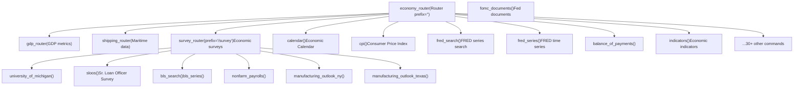
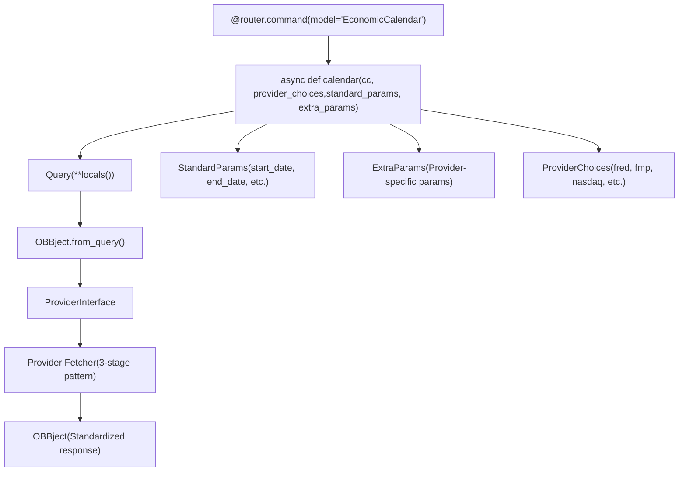
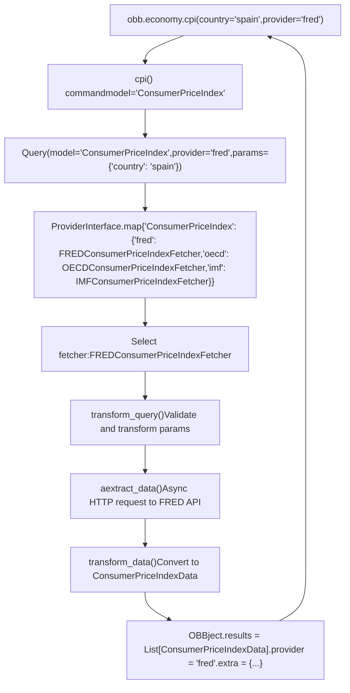
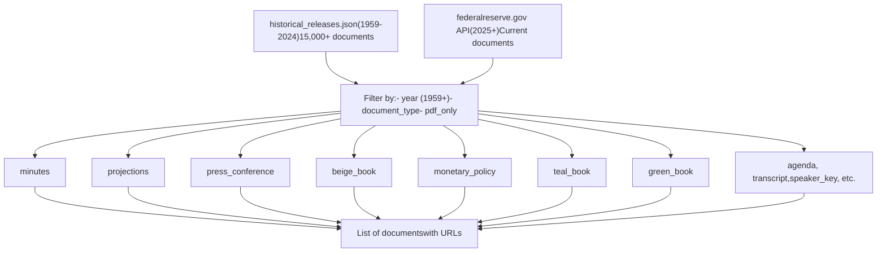
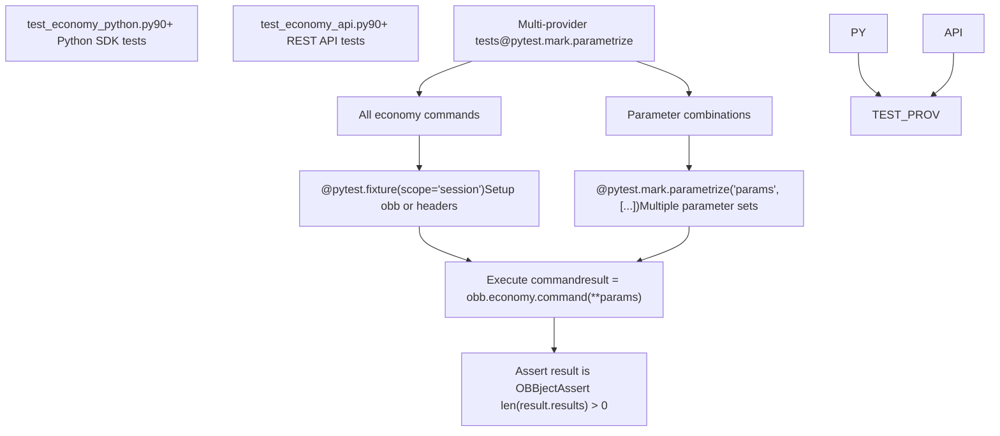

# 经济扩展 (Economy Extension)

相关源文件

-   [openbb\_platform/core/openbb\_core/app/model/charts/chart.py](https://github.com/OpenBB-finance/OpenBB/blob/dddc3b32/openbb_platform/core/openbb_core/app/model/charts/chart.py)
-   [openbb\_platform/core/openbb\_core/provider/standard\_models/primary\_dealer\_fails.py](https://github.com/OpenBB-finance/OpenBB/blob/dddc3b32/openbb_platform/core/openbb_core/provider/standard_models/primary_dealer_fails.py)
-   [openbb\_platform/core/tests/app/model/charts/test\_chart.py](https://github.com/OpenBB-finance/OpenBB/blob/dddc3b32/openbb_platform/core/tests/app/model/charts/test_chart.py)
-   [openbb\_platform/extensions/economy/integration/test\_economy\_api.py](https://github.com/OpenBB-finance/OpenBB/blob/dddc3b32/openbb_platform/extensions/economy/integration/test_economy_api.py)
-   [openbb\_platform/extensions/economy/integration/test\_economy\_python.py](https://github.com/OpenBB-finance/OpenBB/blob/dddc3b32/openbb_platform/extensions/economy/integration/test_economy_python.py)
-   [openbb\_platform/extensions/economy/openbb\_economy/economy\_router.py](https://github.com/OpenBB-finance/OpenBB/blob/dddc3b32/openbb_platform/extensions/economy/openbb_economy/economy_router.py)
-   [openbb\_platform/extensions/economy/openbb\_economy/survey/survey\_router.py](https://github.com/OpenBB-finance/OpenBB/blob/dddc3b32/openbb_platform/extensions/economy/openbb_economy/survey/survey_router.py)
-   [openbb\_platform/extensions/platform\_api/openbb\_platform\_api/assets/default\_apps.json](https://github.com/OpenBB-finance/OpenBB/blob/dddc3b32/openbb_platform/extensions/platform_api/openbb_platform_api/assets/default_apps.json)
-   [openbb\_platform/extensions/tests/test\_integration\_tests\_api.py](https://github.com/OpenBB-finance/OpenBB/blob/dddc3b32/openbb_platform/extensions/tests/test_integration_tests_api.py)
-   [openbb\_platform/extensions/tests/test\_integration\_tests\_python.py](https://github.com/OpenBB-finance/OpenBB/blob/dddc3b32/openbb_platform/extensions/tests/test_integration_tests_python.py)
-   [openbb\_platform/extensions/tests/utils/integration\_tests\_api\_generator.py](https://github.com/OpenBB-finance/OpenBB/blob/dddc3b32/openbb_platform/extensions/tests/utils/integration_tests_api_generator.py)
-   [openbb\_platform/extensions/tests/utils/integration\_tests\_testers.py](https://github.com/OpenBB-finance/OpenBB/blob/dddc3b32/openbb_platform/extensions/tests/utils/integration_tests_testers.py)
-   [openbb\_platform/providers/federal\_reserve/openbb\_federal\_reserve/\_\_init\_\_.py](https://github.com/OpenBB-finance/OpenBB/blob/dddc3b32/openbb_platform/providers/federal_reserve/openbb_federal_reserve/__init__.py)
-   [openbb\_platform/providers/federal\_reserve/openbb\_federal\_reserve/assets/historical\_releases.json](https://github.com/OpenBB-finance/OpenBB/blob/dddc3b32/openbb_platform/providers/federal_reserve/openbb_federal_reserve/assets/historical_releases.json)
-   [openbb\_platform/providers/federal\_reserve/openbb\_federal\_reserve/models/fomc\_documents.py](https://github.com/OpenBB-finance/OpenBB/blob/dddc3b32/openbb_platform/providers/federal_reserve/openbb_federal_reserve/models/fomc_documents.py)
-   [openbb\_platform/providers/federal\_reserve/openbb\_federal\_reserve/models/primary\_dealer\_fails.py](https://github.com/OpenBB-finance/OpenBB/blob/dddc3b32/openbb_platform/providers/federal_reserve/openbb_federal_reserve/models/primary_dealer_fails.py)
-   [openbb\_platform/providers/federal\_reserve/openbb\_federal\_reserve/models/primary\_dealer\_positioning.py](https://github.com/OpenBB-finance/OpenBB/blob/dddc3b32/openbb_platform/providers/federal_reserve/openbb_federal_reserve/models/primary_dealer_positioning.py)
-   [openbb\_platform/providers/federal\_reserve/openbb\_federal\_reserve/utils/fomc\_documents.py](https://github.com/OpenBB-finance/OpenBB/blob/dddc3b32/openbb_platform/providers/federal_reserve/openbb_federal_reserve/utils/fomc_documents.py)
-   [openbb\_platform/providers/federal\_reserve/openbb\_federal\_reserve/utils/primary\_dealer\_statistics.py](https://github.com/OpenBB-finance/OpenBB/blob/dddc3b32/openbb_platform/providers/federal_reserve/openbb_federal_reserve/utils/primary_dealer_statistics.py)
-   [openbb\_platform/providers/federal\_reserve/tests/record/http/test\_federal\_reserve\_fetchers/test\_federal\_reserve\_fomc\_documents\_fetcher\_urllib3\_v2.yaml](https://github.com/OpenBB-finance/OpenBB/blob/dddc3b32/openbb_platform/providers/federal_reserve/tests/record/http/test_federal_reserve_fetchers/test_federal_reserve_fomc_documents_fetcher_urllib3_v2.yaml)
-   [openbb\_platform/providers/federal\_reserve/tests/record/http/test\_federal\_reserve\_fetchers/test\_federal\_reserve\_primary\_dealer\_fails\_fetcher\_urllib3\_v2.yaml](https://github.com/OpenBB-finance/OpenBB/blob/dddc3b32/openbb_platform/providers/federal_reserve/tests/record/http/test_federal_reserve_fetchers/test_federal_reserve_primary_dealer_fails_fetcher_urllib3_v2.yaml)
-   [openbb\_platform/providers/federal\_reserve/tests/test\_federal\_reserve\_fetchers.py](https://github.com/OpenBB-finance/OpenBB/blob/dddc3b32/openbb_platform/providers/federal_reserve/tests/test_federal_reserve_fetchers.py)
-   [openbb\_platform/providers/fred/openbb\_fred/\_\_init\_\_.py](https://github.com/OpenBB-finance/OpenBB/blob/dddc3b32/openbb_platform/providers/fred/openbb_fred/__init__.py)
-   [openbb\_platform/providers/fred/openbb\_fred/models/manufacturing\_outlook\_ny.py](https://github.com/OpenBB-finance/OpenBB/blob/dddc3b32/openbb_platform/providers/fred/openbb_fred/models/manufacturing_outlook_ny.py)
-   [openbb\_platform/providers/fred/tests/record/http/test\_fred\_fetchers/test\_fred\_manufacturing\_outlook\_ny\_fetcher\_urllib3\_v2.yaml](https://github.com/OpenBB-finance/OpenBB/blob/dddc3b32/openbb_platform/providers/fred/tests/record/http/test_fred_fetchers/test_fred_manufacturing_outlook_ny_fetcher_urllib3_v2.yaml)
-   [openbb\_platform/providers/fred/tests/test\_fred\_fetchers.py](https://github.com/OpenBB-finance/OpenBB/blob/dddc3b32/openbb_platform/providers/fred/tests/test_fred_fetchers.py)

## 目的与范围

经济扩展 (`openbb-economy`) 通过统一界面提供跨多个数据提供商的宏观经济数据访问。它将经济数据命令组织成逻辑类别，包括 GDP 指标、调查、航运统计、经济日历、消费者价格指数、国际收支以及美联储数据。

该扩展是 OpenBB 平台中特定领域的数据扩展之一（有关所有扩展的概述，请参阅 [数据扩展 (Data Extensions)](/OpenBB-finance/OpenBB/3-data-extensions)）。有关股票市场数据，请参阅 [股票扩展 (Equity Extension)](/OpenBB-finance/OpenBB/3.2-equity-extension)。有关支持多提供商的底层提供商架构，请参阅 [提供商架构 (Provider Architecture)](/OpenBB-finance/OpenBB/2.3-provider-architecture)。

**来源：** [openbb\_platform/extensions/economy/openbb\_economy/economy\_router.py1-749](https://github.com/OpenBB-finance/OpenBB/blob/dddc3b32/openbb_platform/extensions/economy/openbb_economy/economy_router.py#L1-L749)

## 路由组织

经济扩展使用分层路由结构按领域组织命令。主 `economy_router` 委托给专门的子路由以实现更好的组织。


**路由初始化模式：**

-   主路由：`Router(prefix="", description="Economic data.")`
-   通过 `router.include_router(gdp_router)` 模式包含子路由
-   使用 `@router.command(model="ModelName")` 装饰器注册命令

**来源：** [openbb\_platform/extensions/economy/openbb\_economy/economy\_router.py21-24](https://github.com/OpenBB-finance/OpenBB/blob/dddc3b32/openbb_platform/extensions/economy/openbb_economy/economy_router.py#L21-L24) [openbb\_platform/extensions/economy/openbb\_economy/survey/survey\_router.py14](https://github.com/OpenBB-finance/OpenBB/blob/dddc3b32/openbb_platform/extensions/economy/openbb_economy/survey/survey_router.py#L14-L14)

## 命令注册与执行

经济扩展中的每个命令都遵循通过提供商界面进行注册和执行的标准模式。


**命令函数签名：** 所有命令都使用以下标准异步签名：

```python
async def command_name(
    cc: CommandContext,
    provider_choices: ProviderChoices,
    standard_params: StandardParams,
    extra_params: ExtraParams,
) -> OBBject
```
函数体通常只有一行：`return await OBBject.from_query(Query(**locals()))`

这将执行委托给 [命令执行流水线 (Command Execution Pipeline)](/OpenBB-finance/OpenBB/2.1-command-execution-pipeline) 中描述的命令流水线。

**来源：** [openbb\_platform/extensions/economy/openbb\_economy/economy\_router.py36-63](https://github.com/OpenBB-finance/OpenBB/blob/dddc3b32/openbb_platform/extensions/economy/openbb_economy/economy_router.py#L36-L63) [openbb\_platform/extensions/economy/openbb\_economy/economy\_router.py66-96](https://github.com/OpenBB-finance/OpenBB/blob/dddc3b32/openbb_platform/extensions/economy/openbb_economy/economy_router.py#L66-L96)

## 主要命令类别

### 经济日历与指标

| 命令 | 模型 | 描述 | 主要提供商 |
| --- | --- | --- | --- |
| `calendar()` | EconomicCalendar | 即将发生/历史经济事件 | fmp, nasdaq, tradingeconomics, fred |
| `indicators()` | EconomicIndicators | 按国家/代码划分的经济指标 | econdb, imf |
| `available_indicators()` | AvailableIndicators | 列出可用指标 | econdb, imf |
| `cpi()` | ConsumerPriceIndex | 按国家划分的消费者价格指数 | fred, oecd, imf |
| `risk_premium()` | RiskPremium | 按国家划分的市场风险溢价 | fmp |

**来源：** [openbb\_platform/extensions/economy/openbb\_economy/economy\_router.py36-111](https://github.com/OpenBB-finance/OpenBB/blob/dddc3b32/openbb_platform/extensions/economy/openbb_economy/economy_router.py#L36-L111) [openbb\_platform/extensions/economy/openbb\_economy/economy\_router.py329-398](https://github.com/OpenBB-finance/OpenBB/blob/dddc3b32/openbb_platform/extensions/economy/openbb_economy/economy_router.py#L329-L398)

### FRED 集成

该扩展提供了与圣路易斯联储经济数据库 (FRED) API 的广泛集成：

| 命令 | 模型 | 描述 |
| --- | --- | --- |
| `fred_search()` | FredSearch | 按 ID 或字符串搜索 FRED 系列 |
| `fred_series()` | FredSeries | 从 FRED 获取系列数据 |
| `fred_regional()` | FredRegional | 查询 Geo Fred API 获取区域数据 |
| `fred_release_table()` | FredReleaseTable | 按 ID/元素获取经济发布数据表 |

**FRED 命令特性：**

-   **转换参数**：`pc1` (百分比变化), `chg` (变化), `log` (对数)
-   **聚合方法**：`eop` (期末值), `avg` (平均值)
-   **频率转换**：将系列转换为不同的频率（日、周、月、季、年）
-   **系列组**：同时查询多个相关的系列

**来源：** [openbb\_platform/extensions/economy/openbb\_economy/economy\_router.py136-200](https://github.com/OpenBB-finance/OpenBB/blob/dddc3b32/openbb_platform/extensions/economy/openbb_economy/economy_router.py#L136-L200) [openbb\_platform/extensions/economy/openbb\_economy/economy\_router.py273-301](https://github.com/OpenBB-finance/OpenBB/blob/dddc3b32/openbb_platform/extensions/economy/openbb_economy/economy_router.py#L273-L301)

### GDP 与国民经济核算

GDP 相关命令组织在一个专门的子路由中：

```text
# GDP 路由端点
/economy/gdp/forecast      # GDP 预测（按国家，OECD）
/economy/gdp/nominal       # 名义 GDP (econdb, OECD)
/economy/gdp/real          # 实际 GDP (econdb, OECD)
```
**来源：** [openbb\_platform/extensions/economy/openbb\_economy/economy\_router.py17](https://github.com/OpenBB-finance/OpenBB/blob/dddc3b32/openbb_platform/extensions/economy/openbb_economy/economy_router.py#L17-L17)

### 美联储数据

| 命令 | 模型 | 描述 |
| --- | --- | --- |
| `money_measures()` | MoneyMeasures | M1/M2 及其组成部分 (H.6 发布) |
| `central_bank_holdings()` | CentralBankHoldings | 联储资产负债表持有量 |
| `primary_dealer_positioning()` | PrimaryDealerPositioning | 一级交易商净头寸 |
| `primary_dealer_fails()` | PrimaryDealerFails | 交付/接收失败统计 |
| `fomc_documents()` | FomcDocuments | FOMC 会议文件（会议纪要、预测等） |
| `total_factor_productivity()` | TotalFactorProductivity | 美国商业部门的全要素生产率 |

**来源：** [openbb\_platform/extensions/economy/openbb\_economy/economy\_router.py202-220](https://github.com/OpenBB-finance/OpenBB/blob/dddc3b32/openbb_platform/extensions/economy/openbb_economy/economy_router.py#L202-L220) [openbb\_platform/extensions/economy/openbb\_economy/economy\_router.py400-430](https://github.com/OpenBB-finance/OpenBB/blob/dddc3b32/openbb_platform/extensions/economy/openbb_economy/economy_router.py#L400-L430) [openbb\_platform/extensions/economy/openbb\_economy/economy\_router.py550-643](https://github.com/OpenBB-finance/OpenBB/blob/dddc3b32/openbb_platform/extensions/economy/openbb_economy/economy_router.py#L550-L643) [openbb\_platform/extensions/economy/openbb\_economy/economy\_router.py682-748](https://github.com/OpenBB-finance/OpenBB/blob/dddc3b32/openbb_platform/extensions/economy/openbb_economy/economy_router.py#L682-L748)

### 调查数据

调查子路由 (`/economy/survey`) 提供对各种经济调查的访问：

| 命令 | 描述 | 提供商 |
| --- | --- | --- |
| `university_of_michigan()` | 消费者信心与通胀预期 | fred |
| `sloos()` | 高级信贷员意见调查 | fred |
| `economic_conditions_chicago()` | 芝加哥联储调查 | fred |
| `manufacturing_outlook_texas()` | 达拉斯联储制造业调查 | fred |
| `manufacturing_outlook_ny()` | 纽约联储帝国州制造业调查 | fred |
| `nonfarm_payrolls()` | 非农就业情况数据 | fred |
| `inflation_expectations()` | 专业预测者调查 | federal\_reserve |
| `bls_search()` | 搜索 BLS 调查 | bls |
| `bls_series()` | 获取 BLS 时间系列数据 | bls |

**来源：** [openbb\_platform/extensions/economy/openbb\_economy/survey/survey\_router.py19-215](https://github.com/OpenBB-finance/OpenBB/blob/dddc3b32/openbb_platform/extensions/economy/openbb_economy/survey/survey_router.py#L19-L215)

### 贸易与航运

| 命令 | 模型 | 描述 |
| --- | --- | --- |
| `balance_of_payments()` | BalanceOfPayments | 国际收支报告（按国家） |
| `export_destinations()` | ExportDestinations | 主要出口目的地 (UN Comtrade) |
| `direction_of_trade()` | DirectionOfTrade | 贸易方向统计 |
| `shipping.port_info()` | ShippingPortInfo | 港口信息 |
| `shipping.port_volume()` | ShippingPortVolume | 港口吞吐量数据 |
| `shipping.chokepoint_info()` | ShippingChokepointInfo | 咽喉点信息 |
| `shipping.chokepoint_volume()` | ShippingChokepointVolume | 咽喉点吞吐量数据 |

**来源：** [openbb\_platform/extensions/economy/openbb\_economy/economy\_router.py113-134](https://github.com/OpenBB-finance/OpenBB/blob/dddc3b32/openbb_platform/extensions/economy/openbb_economy/economy_router.py#L113-L134) [openbb\_platform/extensions/economy/openbb\_economy/economy\_router.py596-679](https://github.com/OpenBB-finance/OpenBB/blob/dddc3b32/openbb_platform/extensions/economy/openbb_economy/economy_router.py#L596-L679)

## 提供商集成流程

经济扩展通过 ProviderInterface 系统与 12 个以上的数据提供商集成。每个命令都可以使用不同的提供商执行，每个提供商可能提供不同的参数和数据字段。


**提供商关键特性：**

1.  **特定提供商参数**：每个提供商都可以定义标准参数之外的额外参数
2.  **多提供商支持**：同一个命令可以与多个提供商配合使用（例如，`cpi()` 适用于 fred、oecd、imf）
3.  **动态参数合并**：标准参数和额外参数在运行时合并
4.  **提供商回退**：如果未指定提供商，则使用第一个可用的提供商

**来源：** [openbb\_platform/extensions/economy/openbb\_economy/economy\_router.py66-96](https://github.com/OpenBB-finance/OpenBB/blob/dddc3b32/openbb_platform/extensions/economy/openbb_economy/economy_router.py#L66-L96) [openbb\_platform/providers/fred/openbb\_fred/\_\_init\_\_.py59-107](https://github.com/OpenBB-finance/OpenBB/blob/dddc3b32/openbb_platform/providers/fred/openbb_fred/__init__.py#L59-L107) [openbb\_platform/providers/federal\_reserve/openbb\_federal\_reserve/\_\_init\_\_.py40-60](https://github.com/OpenBB-finance/OpenBB/blob/dddc3b32/openbb_platform/providers/federal_reserve/openbb_federal_reserve/__init__.py#L40-L60)

## 主要数据提供商

### FRED 提供商

FRED 提供商是集成最广泛的，支持 30 多个经济扩展模型：

**支持的模型：**

-   `ConsumerPriceIndex`, `BalanceOfPayments`, `EconomicCalendar`
-   `FredSearch`, `FredSeries`, `FredRegional`, `FredReleaseTable`
-   `UniversityOfMichigan`, `SeniorLoanOfficerSurvey`, `RetailPrices`
-   `ManufacturingOutlookNY`, `ManufacturingOutlookTexas`
-   `NonFarmPayrolls`, `PersonalConsumptionExpenditures`

**FRED 特定特性：**

-   通过字符串、标签或发布物进行序列 ID 搜索
-   通过 Geo Fred API 获取区域数据
-   数据转换（百分比变化、对数等）
-   频率聚合
-   带元素 ID 的发布表导航

**来源：** [openbb\_platform/providers/fred/openbb\_fred/\_\_init\_\_.py59-107](https://github.com/OpenBB-finance/OpenBB/blob/dddc3b32/openbb_platform/providers/fred/openbb_fred/__init__.py#L59-L107)

### 美联储 (Federal Reserve) 提供商

直接与美联储数据源集成：

**支持的模型：**

-   `MoneyMeasures` (H.6 发布)
-   `CentralBankHoldings`（资产负债表）
-   `PrimaryDealerPositioning`, `PrimaryDealerFails`
-   `FomcDocuments`（会议文件）
-   `TotalFactorProductivity`, `InflationExpectations`
-   `FederalFundsRate`, `SOFR`, `YieldCurve`

**FOMC 文件集成：**

FOMC 文件端点提供对全面档案的访问：


**一级交易商统计：**

美联储提供商包括一级交易商头寸和失败数据的专门端点：

-   **头寸**：按资产类别（国债、MBS、公司债等）划分的净头寸（多头 - 空头）
-   **失败**：按资产类别划分的交付/接收失败统计，每周跟踪
-   **类别**：13 个以上的资产类别，带有详细的子类别
-   **时间序列**：每周四更新的历史数据

**来源：** [openbb\_platform/providers/federal\_reserve/openbb\_federal\_reserve/\_\_init\_\_.py40-60](https://github.com/OpenBB-finance/OpenBB/blob/dddc3b32/openbb_platform/providers/federal_reserve/openbb_federal_reserve/__init__.py#L40-L60) [openbb\_federal\_reserve/utils/fomc\_documents.py27-249](https://github.com/OpenBB-finance/OpenBB/blob/dddc3b32/openbb_platform/providers/federal_reserve/openbb_federal_reserve/utils/fomc_documents.py#L27-L249) [openbb\_federal\_reserve/models/primary\_dealer\_fails.py1-173](https://github.com/OpenBB-finance/OpenBB/blob/dddc3b32/openbb_platform/providers/federal_reserve/openbb_federal_reserve/models/primary_dealer_fails.py#L1-L173) [openbb\_federal\_reserve/models/primary\_dealer\_positioning.py1-165](https://github.com/OpenBB-finance/OpenBB/blob/dddc3b32/openbb_platform/providers/federal_reserve/openbb_federal_reserve/models/primary_dealer_positioning.py#L1-L165)

### 其他主要提供商

| 提供商 | 关键模型 | 特点 |
| --- | --- | --- |
| **OECD** | Unemployment, GDP, CompositeLeadingIndicator, InterestRates | 跨国可比数据 |
| **IMF** | EconomicIndicators, DirectionOfTrade, ShippingPortInfo | 全球经济数据、贸易统计 |
| **EconDB** | CountryProfile, EconomicIndicators, ExportDestinations | 国家级聚合数据 |
| **ECB** | BalanceOfPayments | 欧洲央行数据 |
| **BLS** | BlsSearch, BlsSeries | 美国劳工统计局 |

**来源：** [openbb\_platform/extensions/economy/integration/test\_economy\_python.py20-1290](https://github.com/OpenBB-finance/OpenBB/blob/dddc3b32/openbb_platform/extensions/economy/integration/test_economy_python.py#L20-L1290)

## 集成测试结构

经济扩展包括涵盖 Python SDK 和 REST API 界面的全面集成测试：


**测试参数化示例：**

对于每个命令，测试都使用不同的提供商配置进行参数化：

```python
@pytest.mark.parametrize(
    "params",
    [
        {"country": "spain", "provider": "fred"},
        {"country": "portugal,spain", "provider": "oecd"},
        {"country": "portugal,spain", "provider": "imf"},
    ],
)
def test_economy_cpi(params, obb):
    result = obb.economy.cpi(**params)
    assert isinstance(result, OBBject)
    assert len(result.results) > 0
```
这种模式确保：

-   测试每个提供商的实现
-   涵盖参数变化
-   验证标准参数和提供商特定参数

**测试验证：**

测试基础设施包括多个验证层：

-   `check_missing_providers()`：确保模型的所有提供商都有测试
-   `check_missing_params()`：验证所有参数都已测试
-   `check_wrong_params()`：捕获无效参数的使用
-   `check_outdated_integration_tests()`：识别已删除命令的测试

**来源：** [openbb\_platform/extensions/economy/integration/test\_economy\_python.py1-1290](https://github.com/OpenBB-finance/OpenBB/blob/dddc3b32/openbb_platform/extensions/economy/integration/test_economy_python.py#L1-L1290) [openbb\_platform/extensions/economy/integration/test\_economy\_api.py1-2079](https://github.com/OpenBB-finance/OpenBB/blob/dddc3b32/openbb_platform/extensions/economy/integration/test_economy_api.py#L1-L2079) [openbb\_platform/extensions/tests/utils/integration\_tests\_testers.py60-372](https://github.com/OpenBB-finance/OpenBB/blob/dddc3b32/openbb_platform/extensions/tests/utils/integration_tests_testers.py#L60-L372)

## 示例用法模式

**基本命令执行：**

```python
# 使用默认提供商（第一个可用）
result = obb.economy.cpi(country="united_states")

# 指定提供商
result = obb.economy.cpi(
    country="united_states,united_kingdom",
    provider="fred"
)

# 提供商特定参数
result = obb.economy.cpi(
    country="canada",
    transform="weight_percent",
    expenditure="transport",
    provider="imf"
)
```
**FRED 系列搜索与获取：**

```python
# 搜索系列
search_results = obb.economy.fred_search(
    query="GDP",
    tag_names="gdp",
    limit=10
)

# 获取系列数据
series_data = obb.economy.fred_series(
    symbol="GDPC1",
    transform="pc1",  # 百分比变化
    frequency="q"      # 季度
)
```
**美联储数据：**

```python
# 获取 FOMC 文件
fomc_docs = obb.economy.fomc_documents(
    year=2022,
    document_type="minutes"
)

# 一级交易商头寸
positioning = obb.economy.primary_dealer_positioning(
    category="treasuries",
    start_date="2024-01-01"
)
```
**来源：** [openbb\_platform/extensions/economy/openbb\_economy/economy\_router.py66-96](https://github.com/OpenBB-finance/OpenBB/blob/dddc3b32/openbb_platform/extensions/economy/openbb_economy/economy_router.py#L66-L96) [openbb\_platform/extensions/economy/openbb\_economy/economy\_router.py136-200](https://github.com/OpenBB-finance/OpenBB/blob/dddc3b32/openbb_platform/extensions/economy/openbb_economy/economy_router.py#L136-L200) [openbb\_platform/extensions/economy/openbb\_economy/economy\_router.py682-713](https://github.com/OpenBB-finance/OpenBB/blob/dddc3b32/openbb_platform/extensions/economy/openbb_economy/economy_router.py#L682-L713)

Co-Authored-By: Claude Opus 4.6 <noreply@anthropic.com>
