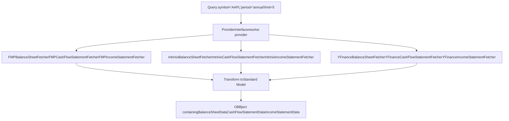
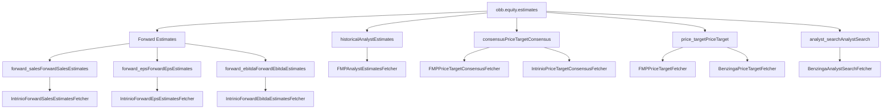
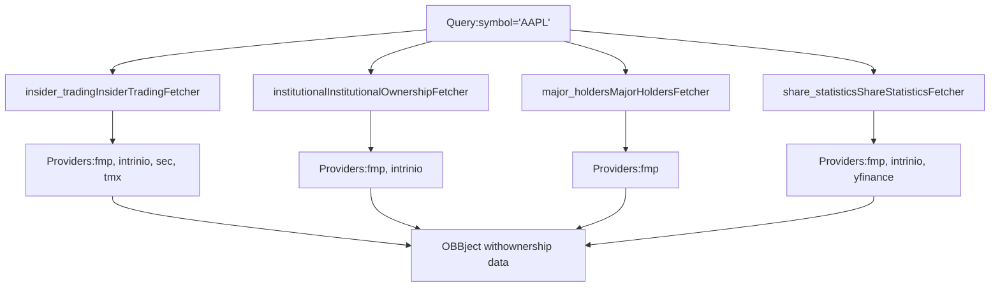
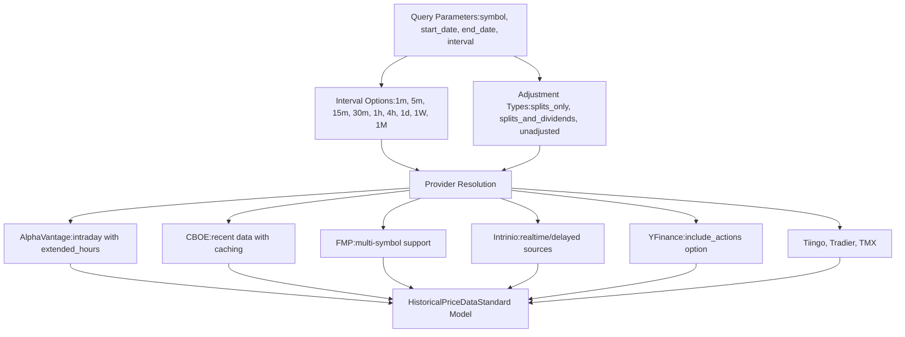
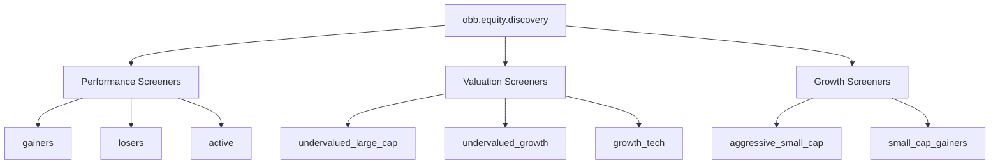
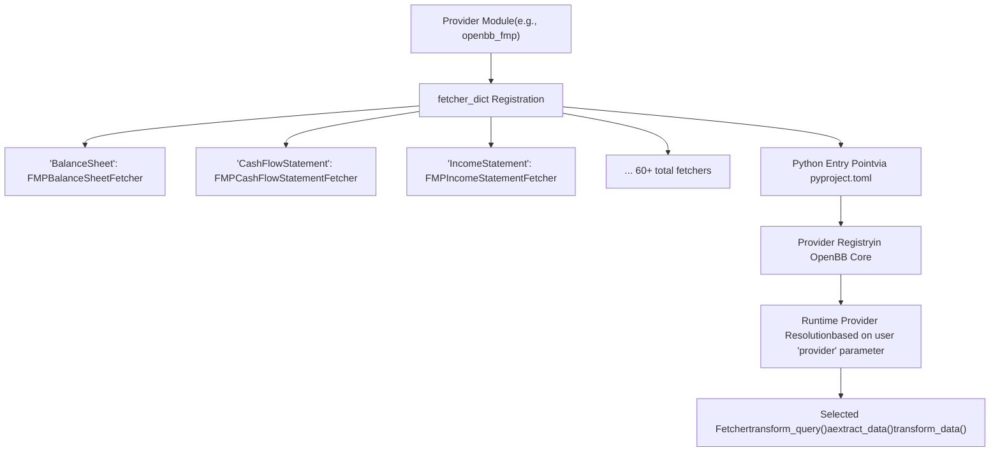
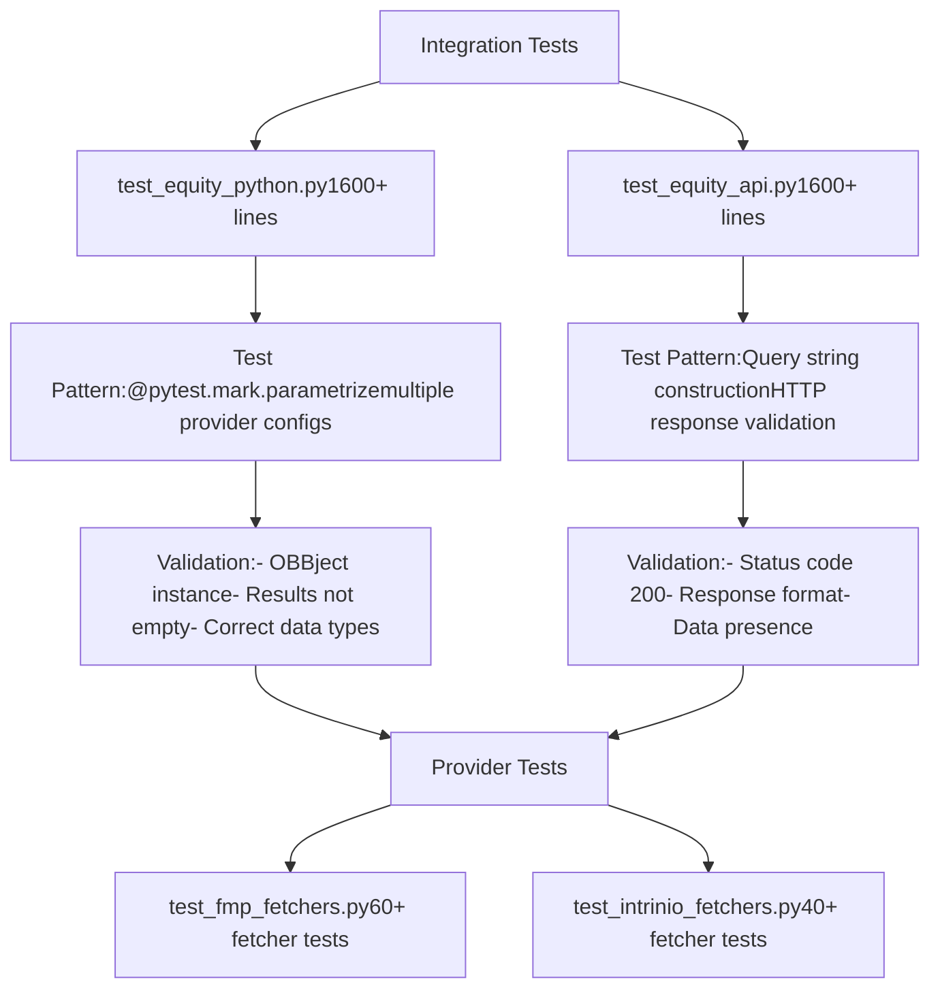

# 股票扩展 (Equity Extension)

相关源文件

-   [openbb\_platform/core/openbb\_core/provider/standard\_models/company\_filings.py](https://github.com/OpenBB-finance/OpenBB/blob/dddc3b32/openbb_platform/core/openbb_core/provider/standard_models/company_filings.py)
-   [openbb\_platform/extensions/equity/integration/test\_equity\_api.py](https://github.com/OpenBB-finance/OpenBB/blob/dddc3b32/openbb_platform/extensions/equity/integration/test_equity_api.py)
-   [openbb\_platform/extensions/equity/integration/test\_equity\_python.py](https://github.com/OpenBB-finance/OpenBB/blob/dddc3b32/openbb_platform/extensions/equity/integration/test_equity_python.py)
-   [openbb\_platform/extensions/equity/openbb\_equity/fundamental/fundamental\_router.py](https://github.com/OpenBB-finance/OpenBB/blob/dddc3b32/openbb_platform/extensions/equity/openbb_equity/fundamental/fundamental_router.py)
-   [openbb\_platform/extensions/etf/integration/test\_etf\_api.py](https://github.com/OpenBB-finance/OpenBB/blob/dddc3b32/openbb_platform/extensions/etf/integration/test_etf_api.py)
-   [openbb\_platform/extensions/etf/integration/test\_etf\_python.py](https://github.com/OpenBB-finance/OpenBB/blob/dddc3b32/openbb_platform/extensions/etf/integration/test_etf_python.py)
-   [openbb\_platform/providers/fmp/openbb\_fmp/\_\_init\_\_.py](https://github.com/OpenBB-finance/OpenBB/blob/dddc3b32/openbb_platform/providers/fmp/openbb_fmp/__init__.py)
-   [openbb\_platform/providers/fmp/openbb\_fmp/models/company\_filings.py](https://github.com/OpenBB-finance/OpenBB/blob/dddc3b32/openbb_platform/providers/fmp/openbb_fmp/models/company_filings.py)
-   [openbb\_platform/providers/fmp/pyproject.toml](https://github.com/OpenBB-finance/OpenBB/blob/dddc3b32/openbb_platform/providers/fmp/pyproject.toml)
-   [openbb\_platform/providers/fmp/tests/test\_fmp\_fetchers.py](https://github.com/OpenBB-finance/OpenBB/blob/dddc3b32/openbb_platform/providers/fmp/tests/test_fmp_fetchers.py)
-   [openbb\_platform/providers/intrinio/openbb\_intrinio/\_\_init\_\_.py](https://github.com/OpenBB-finance/OpenBB/blob/dddc3b32/openbb_platform/providers/intrinio/openbb_intrinio/__init__.py)
-   [openbb\_platform/providers/intrinio/openbb\_intrinio/models/company\_filings.py](https://github.com/OpenBB-finance/OpenBB/blob/dddc3b32/openbb_platform/providers/intrinio/openbb_intrinio/models/company_filings.py)
-   [openbb\_platform/providers/intrinio/tests/test\_intrinio\_fetchers.py](https://github.com/OpenBB-finance/OpenBB/blob/dddc3b32/openbb_platform/providers/intrinio/tests/test_intrinio_fetchers.py)
-   [openbb\_platform/providers/sec/openbb\_sec/\_\_init\_\_.py](https://github.com/OpenBB-finance/OpenBB/blob/dddc3b32/openbb_platform/providers/sec/openbb_sec/__init__.py)
-   [openbb\_platform/providers/sec/openbb\_sec/utils/form4.py](https://github.com/OpenBB-finance/OpenBB/blob/dddc3b32/openbb_platform/providers/sec/openbb_sec/utils/form4.py)
-   [openbb\_platform/providers/sec/tests/test\_sec\_fetchers.py](https://github.com/OpenBB-finance/OpenBB/blob/dddc3b32/openbb_platform/providers/sec/tests/test_sec_fetchers.py)
-   [openbb\_platform/providers/tmx/openbb\_tmx/models/company\_filings.py](https://github.com/OpenBB-finance/OpenBB/blob/dddc3b32/openbb_platform/providers/tmx/openbb_tmx/models/company_filings.py)

## 目的与范围

股票扩展通过支持多个数据提供商的统一界面提供对股票市场数据的全面访问。它将股票相关功能组织成逻辑子路由，涵盖基本面数据、价格数据、分析师估计、所有权信息、日历事件、发现/筛选工具和比较实用程序。

本页记录了该扩展的结构、可用端点、提供商集成模式以及测试方法。有关支持多提供商的提供商架构的信息，请参阅 [提供商架构 (Provider Architecture)](/OpenBB-finance/OpenBB/2.3-provider-architecture)。有关通用扩展系统概念，请参阅 [扩展系统 (Extension System)](/OpenBB-finance/OpenBB/2.2-extension-system)。

## 扩展结构

股票扩展组织为七个主要的子路由类别，每个类别都可通过 `obb.equity` 命名空间访问：

```mermaid
flowchart TD
    Root["equity(root router)"]
    Fundamental["fundamental(sub-router)"]
    Estimates["estimates(sub-router)"]
    Ownership["ownership(sub-router)"]
    Calendar["calendar(sub-router)"]
    Price["price(sub-router)"]
    Compare["compare(sub-router)"]
    Discovery["discovery(sub-router)"]
    Direct["Direct endpoints:search, screener, profile"]
    F1["balance, cash, income"]
    F2["balance_growth, cash_growth, income_growth"]
    F3["dividends, employee_count, historical_splits"]
    F4["management, management_compensation, metrics"]
    F5["ratios, filings, transcript"]
    F6["revenue_per_geography, revenue_per_segment"]
    F7["search_attributes, historical_attributes, latest_attributes"]
    E1["historical, consensus"]
    E2["price_target, analyst_search"]
    E3["forward_sales, forward_eps, forward_ebitda"]
    O1["insider_trading, institutional"]
    O2["major_holders, share_statistics"]
    C1["dividend, splits, earnings, ipo"]
    P1["historical"]
    CM1["peers, groups"]
    D1["gainers, losers, active"]
    D2["undervalued, growth, aggressive_small_cap"]

    Root --> Fundamental
    Root --> Estimates
    Root --> Ownership
    Root --> Calendar
    Root --> Price
    Root --> Compare
    Root --> Discovery
    Root --> Direct
    Fundamental --> F1
    Fundamental --> F2
    Fundamental --> F3
    Fundamental --> F4
    Fundamental --> F5
    Fundamental --> F6
    Fundamental --> F7
    Estimates --> E1
    Estimates --> E2
    Estimates --> E3
    Ownership --> O1
    Ownership --> O2
    Calendar --> C1
    Price --> P1
    Compare --> CM1
    Discovery --> D1
    Discovery --> D2
```


**来源：** [openbb\_platform/extensions/equity/integration/test\_equity\_python.py1-1600](https://github.com/OpenBB-finance/OpenBB/blob/dddc3b32/openbb_platform/extensions/equity/integration/test_equity_python.py#L1-L1600)

## 基本面数据 (Fundamental Data) 子路由

`fundamental` 子路由提供对公司财务报表、增长指标、管理层信息和公司公告的访问。所有端点都支持多个提供商，并具有标准化的输出模型。

### 财务报表

提供了三种核心报表类型，具有一致的参数模式：

| 端点 | 标准模型 | 提供商 | 关键参数 |
| --- | --- | --- | --- |
| `balance` | BalanceSheet | fmp, intrinio, yfinance | symbol, period, limit, fiscal\_year |
| `cash` | CashFlowStatement | fmp, intrinio, yfinance | symbol, period, limit, fiscal\_year |
| `income` | IncomeStatement | fmp, intrinio, yfinance | symbol, period, limit, fiscal\_year |


**来源：** [openbb\_platform/extensions/equity/integration/test\_equity\_python.py21-168](https://github.com/OpenBB-finance/OpenBB/blob/dddc3b32/openbb_platform/extensions/equity/integration/test_equity_python.py#L21-L168) [openbb\_platform/providers/fmp/openbb\_fmp/\_\_init\_\_.py78-148](https://github.com/OpenBB-finance/OpenBB/blob/dddc3b32/openbb_platform/providers/fmp/openbb_fmp/__init__.py#L78-L148) [openbb\_platform/providers/intrinio/openbb\_intrinio/\_\_init\_\_.py72-112](https://github.com/OpenBB-finance/OpenBB/blob/dddc3b32/openbb_platform/providers/intrinio/openbb_intrinio/__init__.py#L72-L112)

### 增长指标 (Growth Metrics)

增长端点提供财务报表行项目的同比或环比百分比变化：

```python
# 资产负债表增长
obb.equity.fundamental.balance_growth(symbol="AAPL", limit=10, provider="fmp", period="annual")
# 现金流量表增长
obb.equity.fundamental.cash_growth(symbol="AAPL", limit=10, provider="fmp", period="annual")
# 利润表增长
obb.equity.fundamental.income_growth(symbol="AAPL", limit=10, period="annual", provider="fmp")
```
**来源：** [openbb\_platform/extensions/equity/integration/test\_equity\_python.py61-185](https://github.com/OpenBB-finance/OpenBB/blob/dddc3b32/openbb_platform/extensions/equity/integration/test_equity_python.py#L61-L185)

### 管理层与公司治理

| 端点 | 描述 | 提供商 |
| --- | --- | --- |
| `management` | 关键高管和领导层 | fmp, yfinance |
| `management_compensation` | 高管薪酬详情 | fmp |
| `employee_count` | 历史员工人数 | fmp |

**来源：** [openbb\_platform/extensions/equity/integration/test\_equity\_python.py186-318](https://github.com/OpenBB-finance/OpenBB/blob/dddc3b32/openbb_platform/extensions/equity/integration/test_equity_python.py#L186-L318)

### 分红与拆股

历史公司行动可通过专用端点获得：

```python
# 历史分红支付
obb.equity.fundamental.dividends(
    symbol="AAPL",
    start_date="2021-01-01",
    end_date="2023-06-06",
    provider="intrinio"
)
# 历史股票拆分
obb.equity.fundamental.historical_splits(symbol="AAPL", provider="fmp")
```
**来源：** [openbb\_platform/extensions/equity/integration/test\_equity\_python.py236-295](https://github.com/OpenBB-finance/OpenBB/blob/dddc3b32/openbb_platform/extensions/equity/integration/test_equity_python.py#L236-L295)

### 财务指标与比率

综合指标端点提供计算出的财务比率和关键性能指标：

```python
# 关键指标 (P/E, EPS, 市值等)
obb.equity.fundamental.metrics(symbol="AAPL", period="annual", provider="fmp")
# 财务比率 (流动性、盈利能力、效率)
obb.equity.fundamental.ratios(symbol="AAPL", period="annual", limit=2, provider="fmp")
```
`metrics` 端点支持多个提供商，具有不同的数据模式：

-   **fmp**: 支持 TTM 的综合指标
-   **intrinio**: 具有 `industry_group_number` 参数的行业特定指标
-   **yfinance**: 基础指标
-   **finviz**: 支持多个股票代码的快照指标

**来源：** [openbb\_platform/extensions/equity/integration/test\_equity\_python.py508-536](https://github.com/OpenBB-finance/OpenBB/blob/dddc3b32/openbb_platform/extensions/equity/integration/test_equity_python.py#L508-L536) [openbb\_platform/extensions/equity/integration/test\_equity\_python.py763-793](https://github.com/OpenBB-finance/OpenBB/blob/dddc3b32/openbb_platform/extensions/equity/integration/test_equity_python.py#L763-L793)

### 收入细分 (Revenue Segmentation)

地理位置和业务线收入明细：

```python
# 按地理区域划分的收入
obb.equity.fundamental.revenue_per_geography(symbol="AAPL", period="annual", provider="fmp")
# 按业务板块划分的收入
obb.equity.fundamental.revenue_per_segment(symbol="AAPL", period="annual", provider="fmp")
```
**来源：** [openbb\_platform/extensions/equity/integration/test\_equity\_python.py795-834](https://github.com/OpenBB-finance/OpenBB/blob/dddc3b32/openbb_platform/extensions/equity/integration/test_equity_python.py#L795-L834)

### 公司公告 (Corporate Filings)

访问 SEC 公告和监管文件：

```python
# 具有灵活过滤功能的 SEC 公告
obb.equity.fundamental.filings(
    symbol="AAPL",
    form_type="8-K",
    limit=3,
    start_date="2021-01-01",
    end_date="2023-01-01",
    provider="sec",
    use_cache=False
)
# 基于 CIK 的查询
obb.equity.fundamental.filings(
    cik="0001067983",
    limit=3,
    form_type="10-Q",
    provider="sec"
)
```
提供商支持包括：

-   **fmp**: 具有表格类型过滤的历史公告
-   **intrinio**: 启用了 THEA 的公告
-   **sec**: 具有缓存功能的直接 SEC EDGAR 访问
-   **tmx**: 加拿大公告
-   **nasdaq**: 按年份划分的表格组过滤

**来源：** [openbb\_platform/extensions/equity/integration/test\_equity\_python.py837-908](https://github.com/OpenBB-finance/OpenBB/blob/dddc3b32/openbb_platform/extensions/equity/integration/test_equity_python.py#L837-L908)

### 业绩电话会议摘要 (Earnings Transcripts)

```python
# 季度业绩电话会议摘要
obb.equity.fundamental.transcript(symbol="AAPL", year=2023, quarter=2, provider="fmp")
```
**来源：** [openbb\_platform/extensions/equity/integration/test\_equity\_python.py927-940](https://github.com/OpenBB-finance/OpenBB/blob/dddc3b32/openbb_platform/extensions/equity/integration/test_equity_python.py#L927-L940)

### Intrinio 数据标签

Intrinio 提供商提供专门的端点来访问自定义财务数据标签：

```python
# 搜索可用数据标签
obb.equity.fundamental.search_attributes(query="ebit", limit=100, provider="intrinio")
# 特定标签的历史值
obb.equity.fundamental.historical_attributes(
    symbol="AAPL,MSFT",
    tag="ebit,ebitda,marketcap",
    frequency="yearly",
    start_date="2013-01-01",
    end_date="2023-01-01",
    provider="intrinio"
)
# 标签的最新值
obb.equity.fundamental.latest_attributes(
    symbol="AAPL,MSFT",
    tag="ceo,ebitda",
    provider="intrinio"
)
```
**来源：** [openbb\_platform/extensions/equity/integration/test\_equity\_python.py1127-1284](https://github.com/OpenBB-finance/OpenBB/blob/dddc3b32/openbb_platform/extensions/equity/integration/test_equity_python.py#L1127-L1284)

## 估计 (Estimates) 子路由

`estimates` 子路由提供分析师预测和共识数据：


### 历史估计

```python
# 历史分析师估计
obb.equity.estimates.historical(symbol="AAPL,MSFT", period="annual", limit=30)
```
**来源：** [openbb\_platform/extensions/equity/integration/test\_equity\_python.py320-333](https://github.com/OpenBB-finance/OpenBB/blob/dddc3b32/openbb_platform/extensions/equity/integration/test_equity_python.py#L320-L333)

### 价格目标

```python
# 分析师价格目标
obb.equity.estimates.price_target(symbol="AAPL", limit=10, provider="fmp")
# 使用 Benzinga 提供商获取详细分析师信息
obb.equity.estimates.price_target(
    symbol="AAPL",
    limit=10,
    provider="benzinga",
    importance=None,
    analyst_ids=None,
    firm_ids=None
)
```
**来源：** [openbb\_platform/extensions/equity/integration/test\_equity\_python.py578-610](https://github.com/OpenBB-finance/OpenBB/blob/dddc3b32/openbb_platform/extensions/equity/integration/test_equity_python.py#L578-L610)

### 共识估计

多个提供商通过不同的参数集提供共识视图：

```python
# FMP 共识
obb.equity.estimates.consensus(symbol="AAPL", provider="fmp")
# Intrinio 具有行业分组
obb.equity.estimates.consensus(
    symbol="AAPL,MSFT",
    industry_group_number=None,
    provider="intrinio"
)
# Seeking Alpha 共识
obb.equity.estimates.consensus(symbol="AAPL,BAM:CA", provider="seeking_alpha")
```
**来源：** [openbb\_platform/extensions/equity/integration/test\_equity\_python.py638-660](https://github.com/OpenBB-finance/OpenBB/blob/dddc3b32/openbb_platform/extensions/equity/integration/test_equity_python.py#L638-L660)

### 前瞻性估计 (Forward Estimates)

前瞻性估计支持多种会计期间配置：

```python
# 前瞻性销售额
obb.equity.estimates.forward_sales(
    symbol="AAPL,MSFT",
    fiscal_period="fy",
    provider="intrinio"
)
# 包含历史数据的前瞻性 EPS
obb.equity.estimates.forward_eps(
    symbol="AAPL,MSFT",
    fiscal_period="annual",
    include_historical=False,
    provider="fmp"
)
# 前瞻性 EBITDA
obb.equity.estimates.forward_ebitda(
    symbol="AAPL,MSFT",
    fiscal_period="quarter",
    provider="intrinio"
)
```
**来源：** [openbb\_platform/extensions/equity/integration/test\_equity\_python.py662-761](https://github.com/OpenBB-finance/OpenBB/blob/dddc3b32/openbb_platform/extensions/equity/integration/test_equity_python.py#L662-L761)

### 分析师搜索

Benzinga 提供商提供分析师和公司搜索功能：

```python
obb.equity.estimates.analyst_search(
    limit=10,
    provider="benzinga",
    firm_name="Barclays",
    analyst_name=None
)
```
**来源：** [openbb\_platform/extensions/equity/integration/test\_equity\_python.py612-636](https://github.com/OpenBB-finance/OpenBB/blob/dddc3b32/openbb_platform/extensions/equity/integration/test_equity_python.py#L612-L636)

## 所有权 (Ownership) 子路由

`ownership` 子路由跟踪机构持有量、内幕交易和股票统计：


### 内幕交易

跟踪具有多个提供商选项的公司内幕交易：

```python
# 具有交易类型过滤功能的 FMP 内幕交易
obb.equity.ownership.insider_trading(
    symbol="AAPL",
    limit=10,
    transaction_type=None,
    statistics=False,
    provider="fmp"
)
# 具有日期范围和所有权类型的 Intrinio
obb.equity.ownership.insider_trading(
    symbol="AAPL",
    limit=10,
    start_date="2021-01-01",
    end_date="2023-06-06",
    ownership_type=None,
    sort_by="updated_on",
    provider="intrinio"
)
# 具有缓存功能的 SEC 直接公告数据
obb.equity.ownership.insider_trading(
    symbol="AAPL",
    limit=10,
    start_date="2024-06-30",
    end_date="2024-09-30",
    use_cache=True,
    provider="sec"
)
```
**来源：** [openbb\_platform/extensions/equity/integration/test\_equity\_python.py388-437](https://github.com/OpenBB-finance/OpenBB/blob/dddc3b32/openbb_platform/extensions/equity/integration/test_equity_python.py#L388-L437)

### 机构持有 (Institutional Ownership)

显示机构持有量的季度 13F 公告数据：

```python
# FMP 按季度划分的机构持有情况
obb.equity.ownership.institutional(
    symbol="AAPL",
    year=2024,
    quarter=4,
    provider="fmp"
)
```
**注意：** Intrinio 机构持有端点由于上游 API 的可靠性问题已被禁用。

**来源：** [openbb\_platform/extensions/equity/integration/test\_equity\_python.py439-467](https://github.com/OpenBB-finance/OpenBB/blob/dddc3b32/openbb_platform/extensions/equity/integration/test_equity_python.py#L439-L467)

### 主要持有人 (Major Holders)

显著的机构头寸：

```python
obb.equity.ownership.major_holders(
    symbol="AAPL",
    year=2024,
    quarter=1,
    page=None,
    limit=None,
    provider="fmp"
)
```
**来源：** [openbb\_platform/extensions/equity/integration/test\_equity\_python.py554-576](https://github.com/OpenBB-finance/OpenBB/blob/dddc3b32/openbb_platform/extensions/equity/integration/test_equity_python.py#L554-L576)

### 股票统计 (Share Statistics)

自由流通量、发行在外股份和所有权百分比：

```python
# 对股票统计的多提供商支持
obb.equity.ownership.share_statistics(symbol="AAPL", provider="fmp")
obb.equity.ownership.share_statistics(symbol="AAPL", provider="intrinio")
obb.equity.ownership.share_statistics(symbol="AAPL", provider="yfinance")
```
**来源：** [openbb\_platform/extensions/equity/integration/test\_equity\_python.py910-925](https://github.com/OpenBB-finance/OpenBB/blob/dddc3b32/openbb_platform/extensions/equity/integration/test_equity_python.py#L910-L925)

## 日历 (Calendar) 子路由

`calendar` 子路由提供即将发生和历史的公司事件：

| 端点 | 事件类型 | 参数 | 提供商 |
| --- | --- | --- | --- |
| `dividend` | 分红公告 | start\_date, end\_date | fmp, nasdaq |
| `splits` | 股票拆分 | start\_date, end\_date | fmp |
| `earnings` | 业绩发布 | start\_date, end\_date, country | fmp, nasdaq, tmx, seeking\_alpha |
| `ipo` | IPO 事件 | start\_date, end\_date, status | intrinio, nasdaq, fmp |

### 日历用法模式

```python
# 分红日历
obb.equity.calendar.dividend(
    start_date="2023-11-05",
    end_date="2023-11-10",
    provider="fmp"
)
# 股票拆分日历
obb.equity.calendar.splits(
    start_date="2023-11-05",
    end_date="2023-11-10",
    provider="fmp"
)
# 具有国家过滤功能的业绩日历
obb.equity.calendar.earnings(
    start_date="2023-11-09",
    end_date="2023-11-10",
    provider="seeking_alpha",
    country="us"
)
# 具有状态过滤功能的 IPO 日历
obb.equity.calendar.ipo(
    start_date="2023-01-01",
    end_date="2023-11-01",
    status="priced",
    provider="nasdaq",
    is_spo=False
)
```
**来源：** [openbb\_platform/extensions/equity/integration/test\_equity\_python.py76-130](https://github.com/OpenBB-finance/OpenBB/blob/dddc3b32/openbb_platform/extensions/equity/integration/test_equity_python.py#L76-L130) [openbb\_platform/extensions/equity/integration/test\_equity\_python.py92-105](https://github.com/OpenBB-finance/OpenBB/blob/dddc3b32/openbb_platform/extensions/equity/integration/test_equity_python.py#L92-L105) [openbb\_platform/extensions/equity/integration/test\_equity\_python.py107-130](https://github.com/OpenBB-finance/OpenBB/blob/dddc3b32/openbb_platform/extensions/equity/integration/test_equity_python.py#L107-L130) [openbb\_platform/extensions/equity/integration/test\_equity\_python.py469-506](https://github.com/OpenBB-finance/OpenBB/blob/dddc3b32/openbb_platform/extensions/equity/integration/test_equity_python.py#L469-L506)

## 价格 (Price) 子路由

`price` 子路由提供具有广泛间隔和调整选项的历史价格数据：


### 历史价格示例

```python
# 具有盘后交易功能的 Alpha Vantage
obb.equity.price.historical(
    symbol="AAPL",
    start_date="2023-01-01",
    end_date="2023-06-06",
    interval="15m",
    adjustment="unadjusted",
    extended_hours=True,
    provider="alpha_vantage"
)
# 用于最近数据的 CBOE
obb.equity.price.historical(
    symbol="AAPL",
    interval="1d",
    provider="cboe",
    use_cache=False
)
# 支持多个股票代码的 FMP
obb.equity.price.historical(
    symbol="AAPL,MSFT",
    interval="1h",
    provider="fmp",
    adjustment="splits_only"
)
# 具有源选择功能的 Intrinio
obb.equity.price.historical(
    symbol="AAPL",
    start_date="2023-06-01",
    end_date="2023-06-03",
    interval="1h",
    timezone="UTC",
    source="realtime",
    provider="intrinio"
)
# 具有公司行动功能的 YFinance
obb.equity.price.historical(
    symbol="AAPL",
    start_date="2023-01-01",
    end_date="2023-06-06",
    interval="1d",
    extended_hours=False,
    include_actions=True,
    adjustment="splits_only",
    provider="yfinance"
)
```
**来源：** [openbb\_platform/extensions/equity/integration/test\_equity\_python.py970-1131](https://github.com/OpenBB-finance/OpenBB/blob/dddc3b32/openbb_platform/extensions/equity/integration/test_equity_python.py#L970-L1131)

## 比较 (Compare) 子路由

同行比较和分组分析功能：

```python
# 查找同行公司
obb.equity.compare.peers(symbol="AAPL")
# 按指标比较行业组
obb.equity.compare.groups(
    group="country",
    metric="overview",
    provider="finviz"
)
```
**来源：** [openbb\_platform/extensions/equity/integration/test\_equity\_python.py942-968](https://github.com/OpenBB-finance/OpenBB/blob/dddc3b32/openbb_platform/extensions/equity/integration/test_equity_python.py#L942-L968)

## 发现 (Discovery) 子路由

根据业绩、估值和增长标准筛选股票：


**来源：** [openbb\_platform/extensions/equity/integration/test\_equity\_python.py1485-1600](https://github.com/OpenBB-finance/OpenBB/blob/dddc3b32/openbb_platform/extensions/equity/integration/test_equity_python.py#L1485-L1600)

## 直接股票端点 (Direct Equity Endpoints)

有几个端点直接位于 `obb.equity` 下：

### 搜索 (Search)

具有灵活查询选项的多提供商股票搜索：

```python
# 按股票代码进行 CBOE 搜索
obb.equity.search(query="AAPL", is_symbol=True, provider="cboe", use_cache=False)
# 按公司名称进行 SEC 搜索
obb.equity.search(query="Apple", provider="sec", use_cache=False, is_fund=False)
# Nasdaq ETF 搜索
obb.equity.search(query="", provider="nasdaq", is_etf=True)
# TMX 搜索
obb.equity.search(query="gold", provider="tmx", use_cache=False)
# 具有活跃度过滤功能的 Intrinio
obb.equity.search(query="gold", provider="intrinio", active=True, limit=100)
```
**来源：** [openbb\_platform/extensions/equity/integration/test\_equity\_python.py1286-1311](https://github.com/OpenBB-finance/OpenBB/blob/dddc3b32/openbb_platform/extensions/equity/integration/test_equity_python.py#L1286-L1311)

### 筛选器 (Screener)

按财务标准过滤股票：

```python
obb.equity.screener(
    industry="REIT",
    sector="real_estate",
    mktcap_min=None,
    mktcap_max=None,
    price_min=None,
    price_max=None,
    beta_min=0.5,
    beta_max=1.5,
    volume_min=None,
    volume_max=None,
    dividend_min=None,
    dividend_max=None,
    is_etf=False,
    is_active=True,
    limit=50,
    provider="fmp"
)
```
**来源：** [openbb\_platform/extensions/equity/integration/test\_equity\_python.py1313-1386](https://github.com/OpenBB-finance/OpenBB/blob/dddc3b32/openbb_platform/extensions/equity/integration/test_equity_python.py#L1313-L1386)

### 资料 (Profile)

公司资料和信息：

```python
# FMP 资料
obb.equity.profile(symbol="AAPL", provider="fmp")
# 具有多个股票代码的 YFinance 资料
obb.equity.profile(symbol="AAPL,MSFT", provider="yfinance")
# Intrinio 资料
obb.equity.profile(symbol="AAPL", provider="intrinio")
```
**来源：** [openbb\_platform/extensions/equity/integration/test\_equity\_python.py1388-1483](https://github.com/OpenBB-finance/OpenBB/blob/dddc3b32/openbb_platform/extensions/equity/integration/test_equity_python.py#L1388-L1483)

## 提供商集成模式

股票扩展演示了全面的提供商集成。每个端点都遵循一致的模式：


### FMP 提供商覆盖范围

FMP 提供商实现了最全面的股票抓取器集：

**基本面数据：**

-   `FMPBalanceSheetFetcher`, `FMPBalanceSheetGrowthFetcher`
-   `FMPCashFlowStatementFetcher`, `FMPCashFlowStatementGrowthFetcher`
-   `FMPIncomeStatementFetcher`, `FMPIncomeStatementGrowthFetcher`
-   `FMPFinancialRatiosFetcher`, `FMPKeyMetricsFetcher`
-   `FMPRevenueGeographicFetcher`, `FMPRevenueBusinessLineFetcher`
-   `FMPHistoricalDividendsFetcher`, `FMPHistoricalSplitsFetcher`, `FMPHistoricalEmployeesFetcher`
-   `FMPKeyExecutivesFetcher`, `FMPExecutiveCompensationFetcher`
-   `FMPCompanyFilingsFetcher`, `FMPEarningsCallTranscriptFetcher`

**估计与分析：**

-   `FMPAnalystEstimatesFetcher`, `FMPHistoricalEpsFetcher`
-   `FMPPriceTargetFetcher`, `FMPPriceTargetConsensusFetcher`
-   `FMPForwardEpsEstimatesFetcher`, `FMPForwardEbitdaEstimatesFetcher`

**所有权：**

-   `FMPInsiderTradingFetcher`, `FMPInstitutionalOwnershipFetcher`
-   `FMPEquityOwnershipFetcher`, `FMPShareStatisticsFetcher`

**日历与事件：**

-   `FMPCalendarDividendFetcher`, `FMPCalendarSplitsFetcher`
-   `FMPCalendarEarningsFetcher`, `FMPCalendarIpoFetcher`

**价格与市场数据：**

-   `FMPEquityHistoricalFetcher`, `FMPEquityQuoteFetcher`
-   `FMPGainersFetcher`, `FMPLosersFetcher`, `FMPEquityActiveFetcher`

**发现与筛选：**

-   `FMPEquityScreenerFetcher`, `FMPEquityProfileFetcher`
-   `FMPEquityPeersFetcher`, `FMPMarketSnapshotsFetcher`

**来源：** [openbb\_platform/providers/fmp/openbb\_fmp/\_\_init\_\_.py1-153](https://github.com/OpenBB-finance/OpenBB/blob/dddc3b32/openbb_platform/providers/fmp/openbb_fmp/__init__.py#L1-L153)

### Intrinio 提供商覆盖范围

Intrinio 提供 40 多个股票抓取器，重点关注实时数据和专门的财务指标：

**核心财务：**

-   `IntrinioBalanceSheetFetcher`, `IntrinioCashFlowStatementFetcher`, `IntrinioIncomeStatementFetcher`
-   `IntrinioFinancialRatiosFetcher`, `IntrinioKeyMetricsFetcher`

**高级数据：**

-   `IntrinioHistoricalAttributesFetcher`, `IntrinioLatestAttributesFetcher`, `IntrinioSearchAttributesFetcher`
-   `IntrinioReportedFinancialsFetcher`

**估计：**

-   `IntrinioForwardEpsEstimatesFetcher`, `IntrinioForwardSalesEstimatesFetcher`
-   `IntrinioForwardEbitdaEstimatesFetcher`, `IntrinioForwardPeEstimatesFetcher`
-   `IntrinioPriceTargetConsensusFetcher`

**市场数据：**

-   `IntrinioEquityHistoricalFetcher`, `IntrinioEquityQuoteFetcher`
-   `IntrinioOptionsChainsFetcher`, `IntrinioOptionsUnusualFetcher`, `IntrinioOptionsSnapshotsFetcher`
-   `IntrinioMarketSnapshotsFetcher`

**所有权与公告：**

-   `IntrinioInsiderTradingFetcher`, `IntrinioShareStatisticsFetcher`
-   `IntrinioCompanyFilingsFetcher`, `IntrinioHistoricalDividendsFetcher`

**来源：** [openbb\_platform/providers/intrinio/openbb\_intrinio/\_\_init\_\_.py1-117](https://github.com/OpenBB-finance/OpenBB/blob/dddc3b32/openbb_platform/providers/intrinio/openbb_intrinio/__init__.py#L1-L117)

## 测试基础设施

股票扩展采用了涵盖 Python 和 API 界面的全面集成测试：


### Python 集成测试模式

每个端点都使用多个提供商配置进行测试：

```python
@pytest.mark.parametrize(
    "params",
    [
        ({"symbol": "AAPL", "period": "annual", "limit": 12}),
        ({"provider": "intrinio", "symbol": "AAPL", "period": "quarter", "fiscal_year": 2014, "limit": 2}),
        ({"symbol": "AAPL", "period": "annual", "limit": 12, "provider": "fmp"}),
        ({"symbol": "AAPL", "period": "annual", "limit": 5, "provider": "yfinance"}),
    ],
)
@pytest.mark.integration
def test_equity_fundamental_balance(params, obb):
    """测试股票基本面资产负债表端点。"""
    result = obb.equity.fundamental.balance(**params)
    assert result
    assert isinstance(result, OBBject)
    assert len(result.results) > 0
```
**来源：** [openbb\_platform/extensions/equity/integration/test\_equity\_python.py21-59](https://github.com/OpenBB-finance/OpenBB/blob/dddc3b32/openbb_platform/extensions/equity/integration/test_equity_python.py#L21-L59)

### API 集成测试模式

API 测试验证 HTTP 端点和响应格式：

```python
@pytest.mark.parametrize(
    "params",
    [
        ({"symbol": "AAPL", "period": "annual", "limit": 12, "provider": "fmp"}),
        ({"provider": "intrinio", "symbol": "AAPL", "period": "annual", "fiscal_year": None, "limit": 2}),
    ],
)
@pytest.mark.integration
def test_equity_fundamental_balance(params, headers):
    """测试股票基本面资产负债表端点。"""
    params = {p: v for p, v in params.items() if v}
    query_str = get_querystring(params, [])
    url = f"http://0.0.0.0:8000/api/v1/equity/fundamental/balance?{query_str}"
    result = requests.get(url, headers=headers, timeout=10)
    assert isinstance(result, requests.Response)
    assert result.status_code == 200
```
**来源：** [openbb\_platform/extensions/equity/integration/test\_equity\_api.py23-64](https://github.com/OpenBB-finance/OpenBB/blob/dddc3b32/openbb_platform/extensions/equity/integration/test_equity_api.py#L23-L64)

### 提供商专用抓取器测试

每个提供商都使用 VCR 进行 HTTP 录制，维护单个抓取器的单元测试：

```python
@pytest.mark.record_http
def test_fmp_balance_sheet_fetcher(credentials=test_credentials):
    """测试 FMP 资产负债表抓取器。"""
    params = {"symbol": "AAPL", "limit": 1}
    fetcher = FMPBalanceSheetFetcher()
    result = fetcher.test(params, credentials)
    assert result is None

@pytest.mark.record_http
def test_intrinio_balance_sheet_fetcher(credentials=test_credentials):
    """测试 Intrinio 资产负债表抓取器。"""
    params = {"symbol": "AAPL"}
    fetcher = IntrinioBalanceSheetFetcher()
    result = fetcher.test(params, credentials)
    assert result is None
```
**来源：** [openbb\_platform/providers/fmp/tests/test\_fmp\_fetchers.py188-205](https://github.com/OpenBB-finance/OpenBB/blob/dddc3b32/openbb_platform/providers/fmp/tests/test_fmp_fetchers.py#L188-L205) [openbb\_platform/providers/intrinio/tests/test\_intrinio\_fetchers.py195-203](https://github.com/OpenBB-finance/OpenBB/blob/dddc3b32/openbb_platform/providers/intrinio/tests/test_intrinio_fetchers.py#L195-L203)

### VCR 配置

测试使用 VCR 录制和回放 HTTP 交互，并过滤掉敏感凭据：

```python
@pytest.fixture(scope="module")
def vcr_config():
    """VCR 配置。"""
    return {
        "filter_headers": [("User-Agent", None)],
        "filter_query_parameters": [
            ("apikey", "MOCK_API_KEY"),
        ],
        "before_record_response": response_filter,
    }
```
**来源：** [openbb\_platform/providers/fmp/tests/test\_fmp\_fetchers.py92-103](https://github.com/OpenBB-finance/OpenBB/blob/dddc3b32/openbb_platform/providers/fmp/tests/test_fmp_fetchers.py#L92-L103) [openbb\_platform/providers/intrinio/tests/test\_intrinio\_fetchers.py75-90](https://github.com/OpenBB-finance/OpenBB/blob/dddc3b32/openbb_platform/providers/intrinio/tests/test_intrinio_fetchers.py#L75-L90)

## 标准模型与数据一致性

所有股票端点都返回归一化为 `openbb_core.provider.standard_models` 中定义的标准模型的数据。这确保了无论使用哪个提供商，字段名称和数据类型都保持一致：

| 端点 | 标准模型 | 关键字段 |
| --- | --- | --- |
| `balance` | BalanceSheetData | date, symbol, assets, liabilities, equity |
| `cash` | CashFlowStatementData | date, symbol, operating\_cash\_flow, investing\_cash\_flow, financing\_cash\_flow |
| `income` | IncomeStatementData | date, symbol, revenue, net\_income, eps |
| `dividends` | HistoricalDividendsData | ex\_dividend\_date, amount, declaration\_date, payment\_date |
| `filings` | CompanyFilingsData | filing\_date, form\_type, symbol, url |
| `insider_trading` | InsiderTradingData | transaction\_date, filing\_date, insider\_name, transaction\_type, shares |

提供商特定的字段将作为扩展添加到标准模型中，而不会破坏兼容性。

**来源：** [openbb\_platform/extensions/equity/integration/test\_equity\_python.py1-1600](https://github.com/OpenBB-finance/OpenBB/blob/dddc3b32/openbb_platform/extensions/equity/integration/test_equity_python.py#L1-L1600)

## 总结

股票扩展提供了一个全面的、多提供商的股票市场数据接口，组织为七个功能子路由：基本面、估计、所有权、日历、价格、比较和发现。通过支持 10 多个数据提供商和 80 多个端点，它实现了灵活的数据访问，同时通过标准模型保持一致的输出。该扩展的测试基础设施确保了所有提供商和界面的可靠性。

Co-Authored-By: Claude Opus 4.6 <noreply@anthropic.com>
